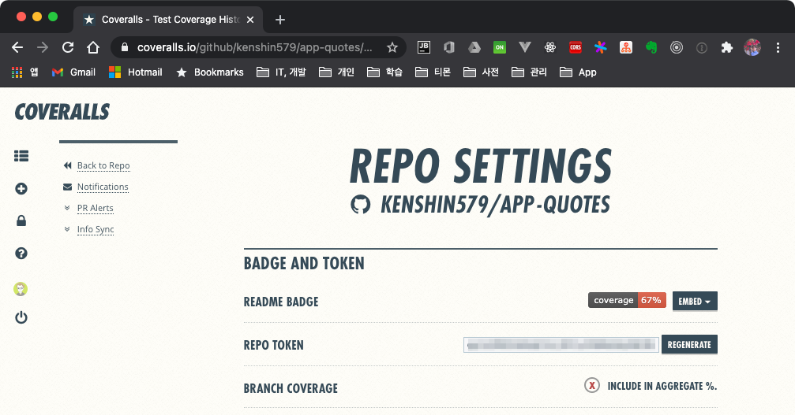
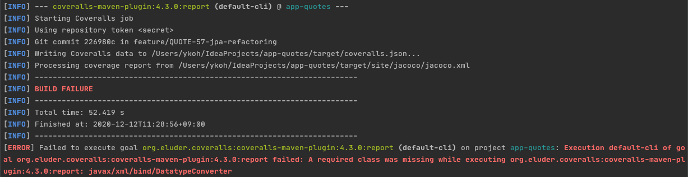
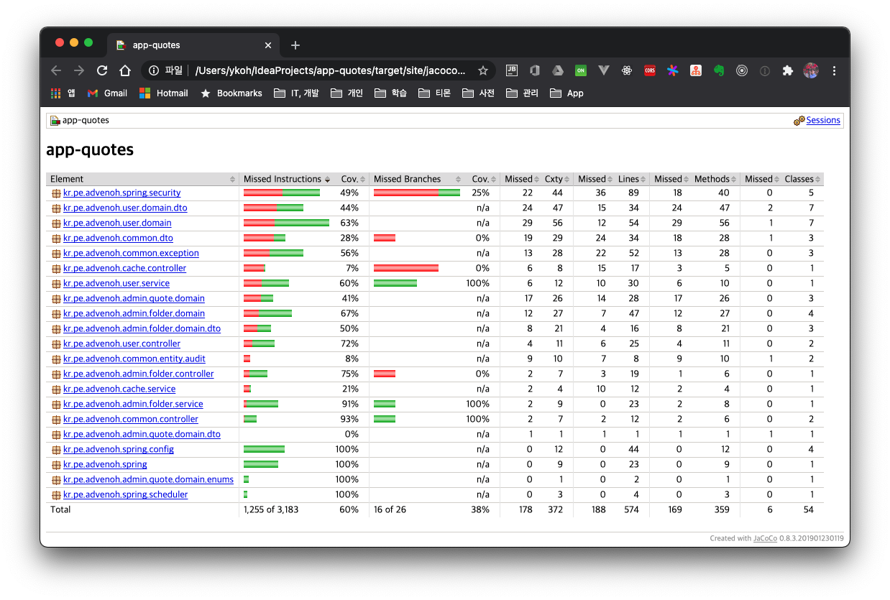
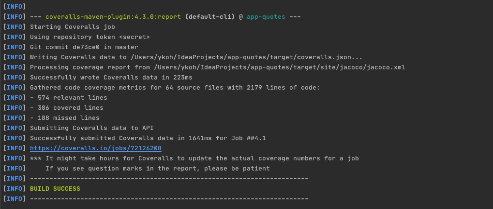
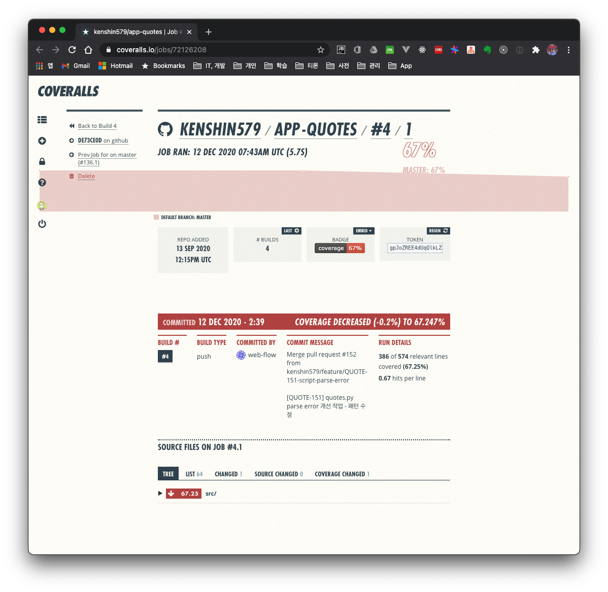

# 1. Introduction

Let's look at how to check the code coverage of a Maven + Java project. The overall workflow is to generate Java coverage with JaCoCo and upload it to the Coveralls site to review the results.

- JaCoCo
    - A library that checks code coverage
    - After running unit tests, it generates the coverage results as files in various formats (e.g. HTML)
- Coveralls
    - A web-based code coverage management site
    - Manages coverage by integrating with a repository (e.g. GitHub)
- Travis CI
    - A CI service for projects hosted on GitHub.

The content applied in this post can be found in [app-quotes](https://github.com/kenshin579/app-quotes), a personal project currently under development.

# 2. Maven Configuration

## 2.1 JaCoCo dependency

If the project contains Querydsl files, exclude them with an exclude tag in the configuration.

```xml
<plugin>
    <groupId>org.jacoco</groupId>
    <artifactId>jacoco-maven-plugin</artifactId>
    <version>0.8.3</version>
    <executions>
        <execution>
            <id>prepare-agent</id>
            <goals>
                <goal>prepare-agent</goal>
            </goals>
        </execution>
    </executions>
    <configuration>
        <excludes>
            <exclude>**/Q*.class</exclude>
        </excludes>
    </configuration>
</plugin>
```


## 2.2 Coveralls dependency

When adding the Coveralls dependency, you need to look up the Repo Token on the Coveralls site and put it into the repoToken tag. Coverage results are uploaded to the corresponding project based on this token value.



```xml
<plugin>
    <groupId>org.eluder.coveralls</groupId>
    <artifactId>coveralls-maven-plugin</artifactId>
    <version>4.3.0</version>
    <configuration>
        <repoToken>gpJoZREE123412341234bMmUsdfRQ</repoToken>
    </configuration>
    <dependencies>
        <dependency>
            <groupId>javax.xml.bind</groupId>
            <artifactId>jaxb-api</artifactId>
            <version>2.3.1</version>
        </dependency>
    </dependencies>
</plugin>
```

When running on a higher JDK version (e.g. 14), you may run into an error where the javax/xml/bind/Datatype*Converter* class cannot be found. Since it's a class-not-found error, you can fix it by adding the jaxb-api dependency.



# 3. Execution

## 3.1 Generating the JaCoCo report

After adding the JaCoCo dependency, running the command below generates an HTML file in the target/site/jacoco folder.

- skipTests=false
    - Unit tests must run in order to check coverage
- maven.test.failure.ignore=true
    - Gives the ignore option so that coverage can still be generated even if some unit tests fail

```bash
$ mvn clean test jacoco:report -DskipTests=false -Dmaven.test.failure.ignore=true
```

You can check coverage per package.



## 3.2 Uploading coverage results to Coveralls

To upload the JaCoCo execution results to Coveralls, add coveralls:report and run it.

```bash
$ mvn clean test jacoco:report coveralls:report -DskipTests=false -Dmaven.test.failure.ignore=true
```

Once it uploads successfully, you can check it via the completed job link.



app-quotes has 67% coverage. While developing the project I don't think I paid as much attention to unit tests as I should have, but it doesn't seem too bad.



## 3.3 Uploading code coverage to Coveralls from a Travis build

app-quotes is already integrated with Travis CI. The details of GitHub + Travis CI integration will be covered next time. You just add the commands we've run so far to the `.travis.yml` file.

```yml
after_success:
  - CI=false ./mvnw test jacoco:report coveralls:report -DskipTests=false -Dmaven.test.failure.ignore=true
```

# 4. Summary

This time we looked at how to check code coverage in a Maven project using JaCoCo and Coveralls. Next time, we'll also look at how to check the code coverage of a project that consists of multiple modules.

# 5. References

- https://woowabros.github.io/experience/2020/02/02/jacoco-config-on-gradle-project.html
- https://github.com/trautonen/coveralls-maven-plugin
- https://jojoldu.tistory.com/275
