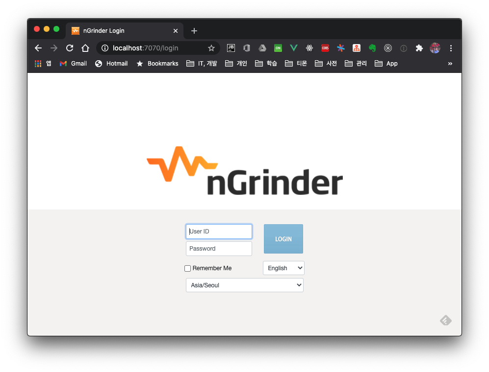
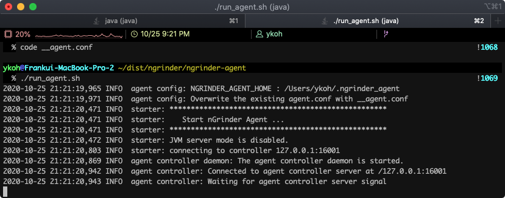
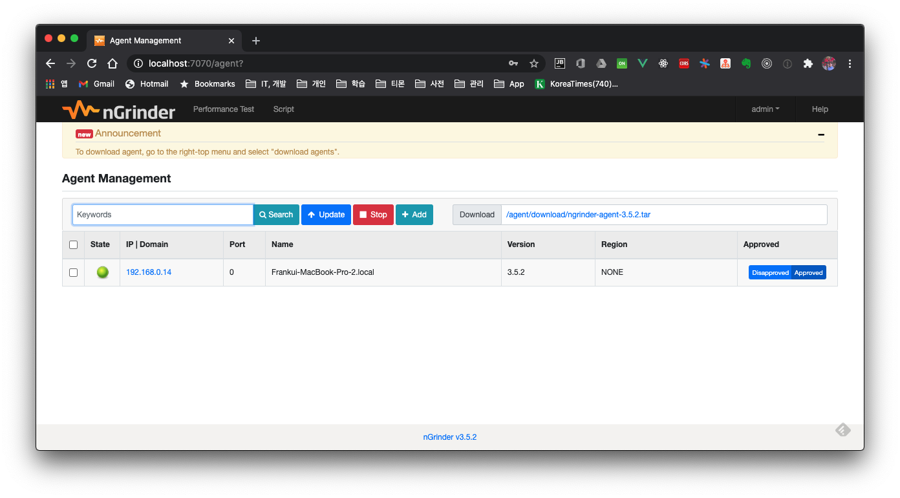
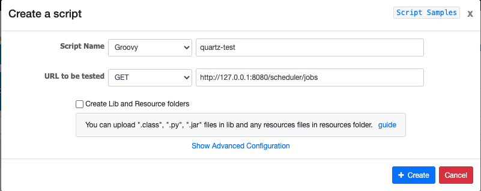
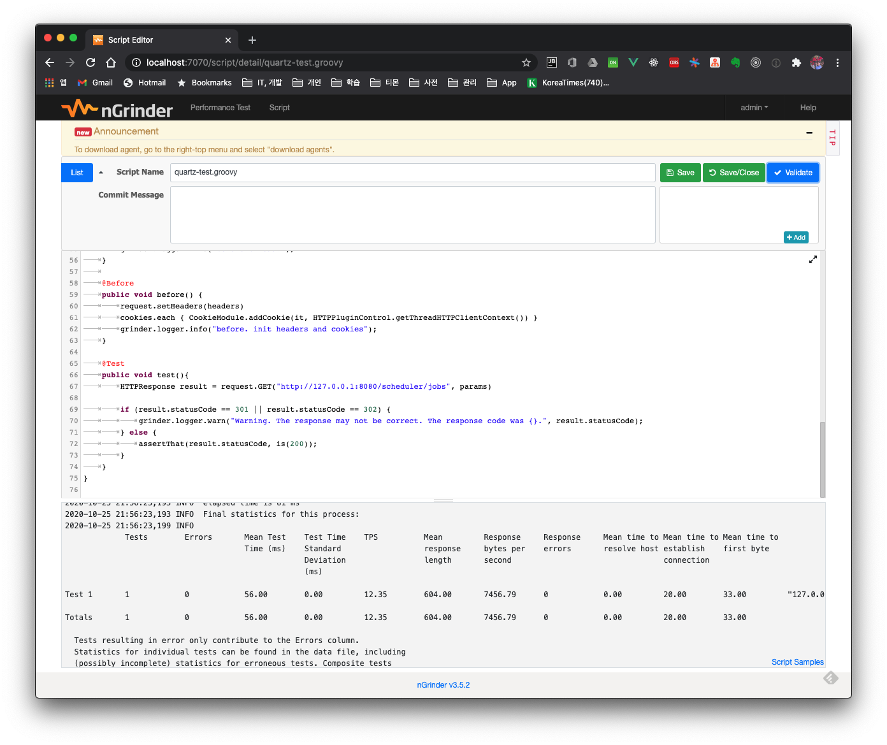
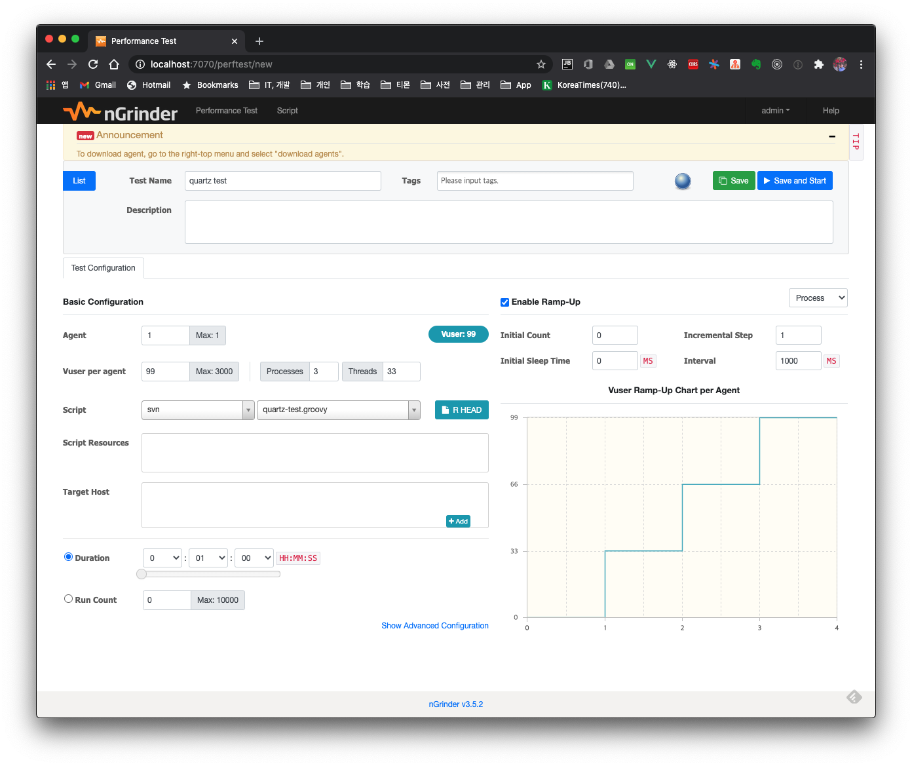
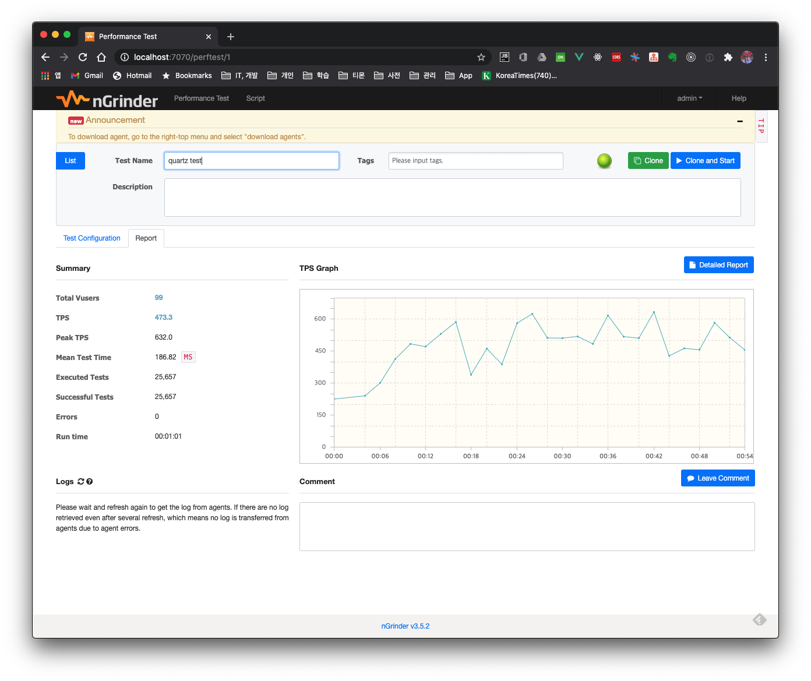

# 1. Introduction

nGrinder is a stress testing tool written on top of the open-source [Grinder](http://grinder.sourceforge.net/), and it was developed by Naver. Let's walk through everything from installing nGrinder to running an API test.

## 1.1 nGrinder components


| Component  | Description                                                  |
| ---------- | ------------------------------------------------------------ |
| controller | A web-based GUI system through which the overall testing work is controlled |
| agent      | Receives commands from the controller and runs processes and threads on the target machine to generate load. Install the agent on the machine you want to test |
| target     | The target machine you want to test                          |


## 1.2 Environment

- Test environment
    - Since there's no additional hardware, we build and run the test environment on a single machine
- API to test
    - We test the API of this quartz project, [springboot-quartz-in-memory](https://github.com/kenshin579/tutorials-java/tree/master/springboot-quartz-in-memory)

# 2. How to Use nGrinder

## 2.1 Installing nGrinder

Download the latest WAR version from the [nGrinder releases](https://github.com/naver/ngrinder/releases) page.

```bash
$ mkdir ngrinder
$ cd ngrinder
$ wget https://github.com/naver/ngrinder/releases/download/ngrinder-3.5.2-20200929/ngrinder-controller-3.5.2.war
```

After downloading, run it with the -jar option. Since the application we want to run will also use port 8080, we launch the controller on port 7070.

```bash
$ java -jar ngrinder-controller-3.5.2.war --port 7070
```

Once it starts up without issues, you can access it at the site address http://localhost:7070/login.



The initial admin id/password is admin/admin.

## 2.2 Installing the Agent

Next, let's install the agent on the target machine we want to test. After logging in to the site, click admin > Download Agent in the menu to download the agent. Extract the downloaded file with the command below.

```bash
$ tar -xvf ngrinder-agent-3.5.2-localhost.tar
```

Edit the controller IP address in the agent configuration file. In this test the controller is local, so we leave it unchanged here.

```bash
$ cd ngrinder-agent
$ vim __agent.conf
common.start_mode=agent
agent.controller_host=localhost
agent.controller_port=16001
agent.region=NONE
```

Run the agent with the shell script below. If there are no issues, it gets registered with the controller.

```bash
$ ./run_agent.sh
```



You can check whether it registered properly on the controller by clicking admin > Agent Management.



## 2.3 API Test

### 2.3.1 Writing a Script



After creating the script, click the Validate button to confirm there are no issues with the actual API call, then save.



### 2.3.2 Creating a Performance Test

Click Performance Test > Create Test, then configure the desired test settings.



### 2.3.3 Results After Running the Test

While the test is running you can watch the test progress live, and after the test ends you can review the results in more detail through the overall test Summary and the Detailed Report.



# 3. Summary

Here we briefly looked at how to use the nGrinder testing tool. If you want to actually improve the performance of a web application you're developing, you need to gradually improve the code while checking the test results before and after code changes against concrete test scenarios. When I get the chance, I plan to post about a case of improving API performance.


# 4. References

- nGrinder
    - http://naver.github.io/ngrinder/
    - https://heedipro.tistory.com/279
    - https://brownbears.tistory.com/26
    - https://nesoy.github.io/articles/2018-10/nGrinder-Start
- Configuration
    - https://programmer.help/blogs/ngrinder-2-stress-test-script-groovy.html
