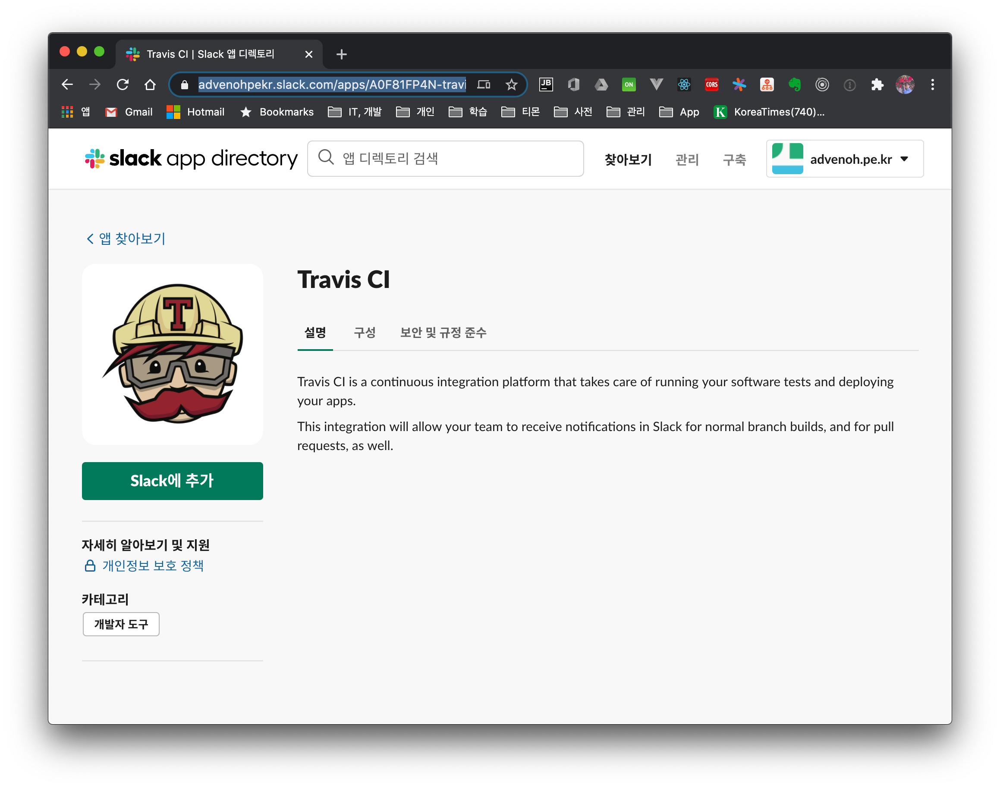
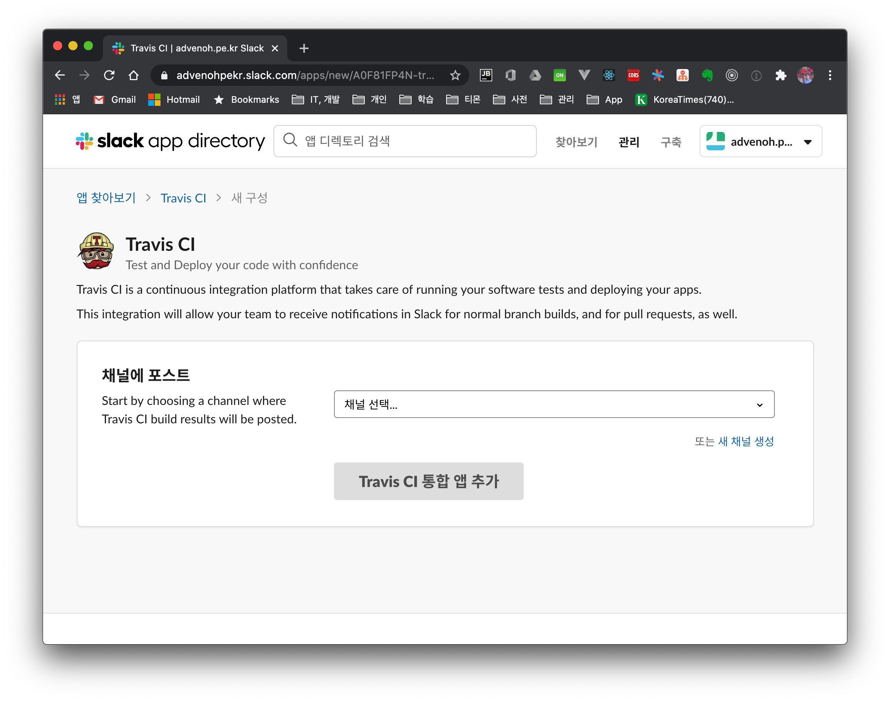
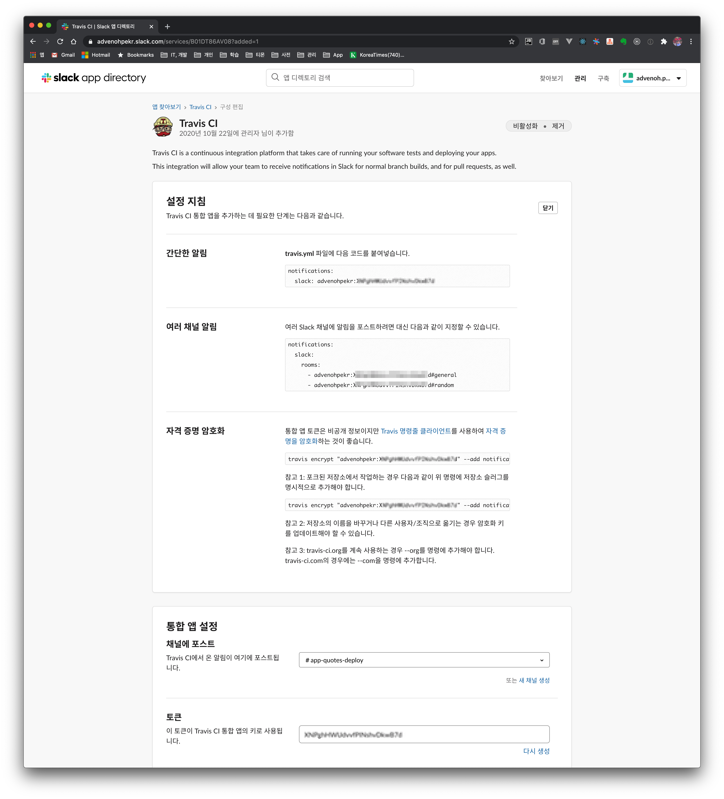
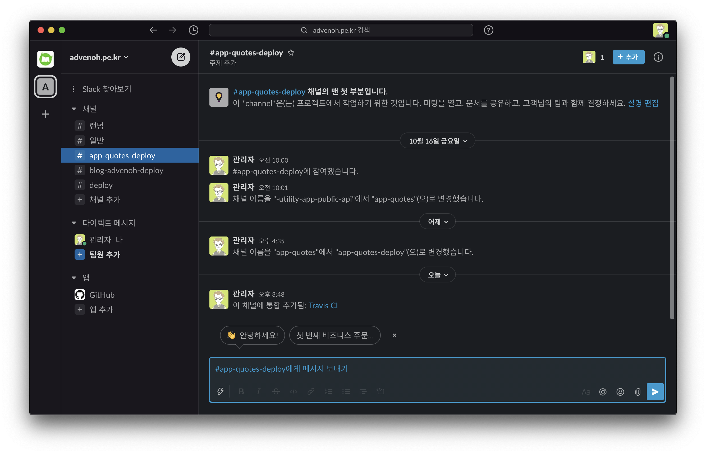
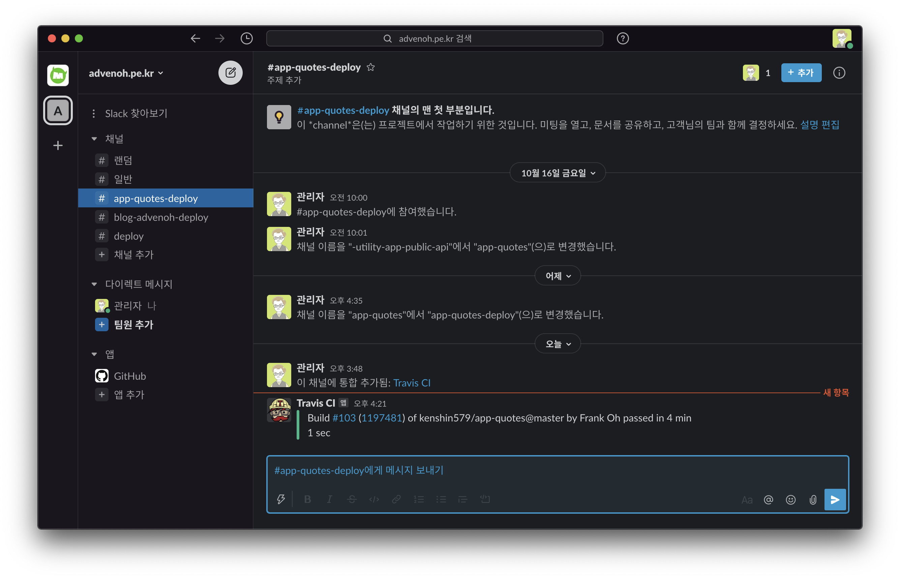

# 1. Introduction

Let's look at how to receive notifications in Slack after a build with Travis CI. Explanations of how to deploy GitHub source to Travis CI already exist in many other places, so I'll skip that part.

These are the things you need beforehand. I'll just mention them briefly and move on.

- Create a Slack workspace and a channel
- GitHub source code
- Build and deploy GitHub source with Travis CI

The source we're building is [app-quotes](https://github.com/kenshin579/app-quotes), and the files written for this post are also included in this source.

# 2. Integrating Slack with Travis CI

## 2.1 Add Travis CI from the Slack App Directory

Find and add the Travis CI App in the Slack app directory.



Click Add to Slack > select a channel > Add Travis CI Integration App button to integrate Slack with Travis CI.



After adding the Travis CI integration app, it shows you the app token information. You can use this information for the work that follows. As noted there too, if the source code is public and the app token is exposed, anyone can send messages, so let's encrypt that token.



When the integration is set up properly, you'll receive messages in the Slack channel.



## 2.2 Add Slack information to the travis.yml configuration

### 2.2.1 Encrypting the app token

Install the travis command needed for encryption.

```bash
$ ruby -v 
$ sudo gem install travis
$ travis —-version
```

Add --com to log in when using travis-ci.com.

```bash
$ travis login
$ travis login --com
```

Running it where the travis.yml file is located outputs the full configuration with the existing settings plus the added Slack information.

```bash
$ travis encrypt "<slack-domain-name>:<token of the travis APP>#<channel-name>" --add notifications.slack
```

### 2.2.2 Add the Slack configuration to travis.yml

I've set it up to always receive messages on both build success and failure. For additional explanation of Travis build settings, please refer to the [Travis documentation](https://docs.travis-ci.com/user/notifications/).

```yaml
notifications:
  slack:
    on_success: always
    on_failure: always
    secure: pnEZaS1REkNU5VWKLK+JE2tbA7n18vfE8Cikk9RCO5rkGeubTDG/Pgicc=
```

### 2.2.3 Building on Travis CI

If you run a build directly on Travis CI, you can confirm that the build messages are received properly in Slack.



# 3. Conclusion

We did the integration work so that build messages can be received in Slack on a Travis CI build. In the next post, I plan to work on integrating GitHub Action with Slack.

# 4. References


* Slack integration

    * https://berndrabe.de/enabling-travis-ci-with-slack-integration/
    * https://www.edmondscommerce.co.uk/handbook/Development-Tools/Testing/Travis-CI/
    * [https://riverandeye.tistory.com/entry/Travis-Travis-Ci-%ED%8A%9C%ED%86%A0%EB%A6%AC%EC%96%BC-%EB%8F%84%EC%A0%84%EA%B8%B0-2-%EC%8A%AC%EB%9E%99-%EC%97%B0%EB%8F%99%ED%95%98%EA%B8%B0](https://riverandeye.tistory.com/entry/Travis-Travis-Ci-튜토리얼-도전기-2-슬랙-연동하기)
    * https://docs.travis-ci.com/user/notifications/
* Deploying with Travis CI

    * https://teichae.tistory.com/entry/Travis-CI%EB%A5%BC-%EC%9D%B4%EC%9A%A9%ED%95%9C-%EB%B0%B0%ED%8F%AC-1
