# 1. Introduction

Let's look at how to do a Git Rebase. Unlike Merge, Rebase is a way to bring multiple commits from one branch onto another branch as they are. The following scenario happens often during development. You frequently find yourself pulling the newly updated commits from the master branch into the branch you're currently working on so you can keep developing.

**Rebase scenario**

1. Developer 1
    1. Creates a new working branch (feature/GIT-7-working-branch) from master
    2. Modifies code on feature/GIT-7-working-branch
2. Developer 2
    1. Creates a new working branch (feature/GIT-8) from master
    2. Modifies code and merges it into master
3. Developer 1
    1. Performs a rebase to bring the latest code from master and continue development

Let's try a rebase with [GitKraken](https://www.gitkraken.com/), a Git client program I personally use often, and also look at how to do it with the actual git commands.

# 2. Development Environment

* OS : Mac OS
* GUI
    * IDE : Intellij
    * Git Client : [Gitkraken](https://www.gitkraken.com/)
* Source code : [github](https://github.com/kenshin579/tutorials-git)

# 3. Doing a Rebase

First let's do a rebase using GitKraken, and then do a rebase directly in the terminal with git commands.

## 3.1 Merging with rebase using Git Kraken

### 3.1.1 Creating a branch per feature

Developer Frank creates a new branch named feature/GIT-6-working-branch from master and starts developing the feature. The new branch is created with the following steps.

_Select the master branch > right-click > select Create branch here > enter the branch name feature/GIT-6-working-branch_

### 3.1.2 Developer Frank modifies code and commits

After checking out, developer Frank modifies the code and pushes 3 commits.

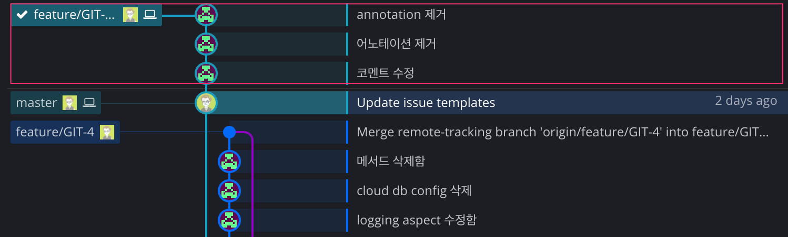

#### 3.1.2.1 Developer Joe modifies code and commits

Developer Joe also creates a new branch (feature/GIT-7) from master to develop another feature.

After modifying the code, he made 3 commits.

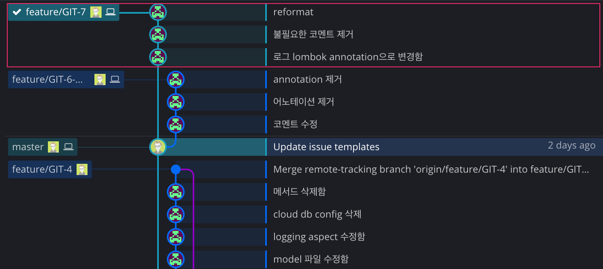

To reflect the changed code into master, he creates a pull request (pr). In GitKraken you can create a pr from the menu below.

_Select the master branch > right-click > click Start a pull request to origin_master from origin_feature/GIT-7 > enter the pr details (e.g. title, description, etc.)_

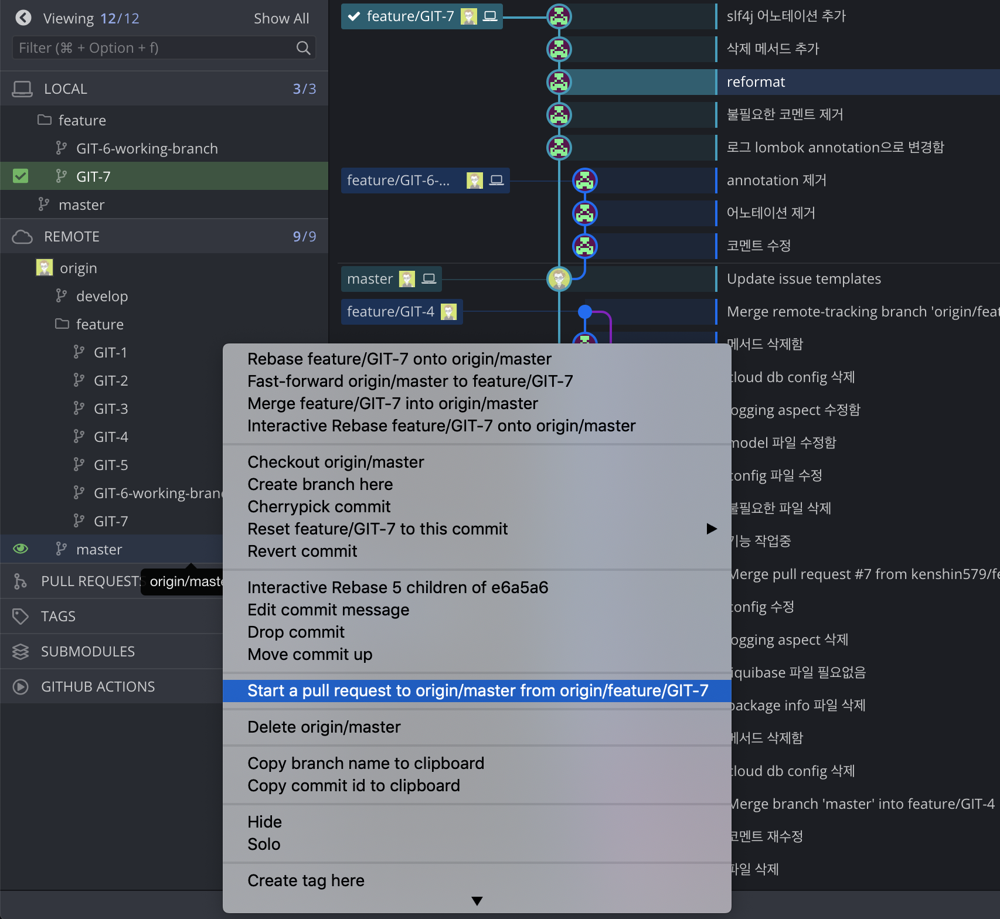

When you create a pull request, a link is generated that takes you directly to the Github site; click the link button to go to the Github site. Click the Merge pull request button to proceed with the merge.

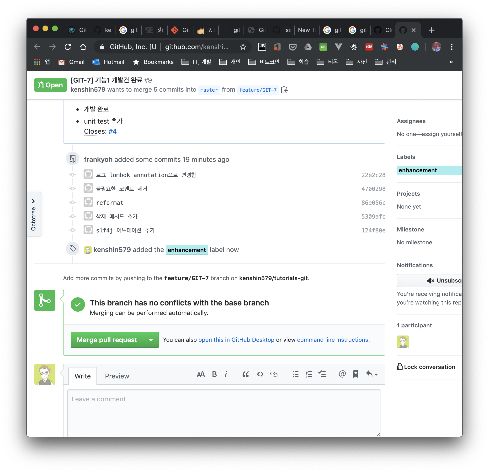

Since there's no conflict in the code, a success message appears right after merging.

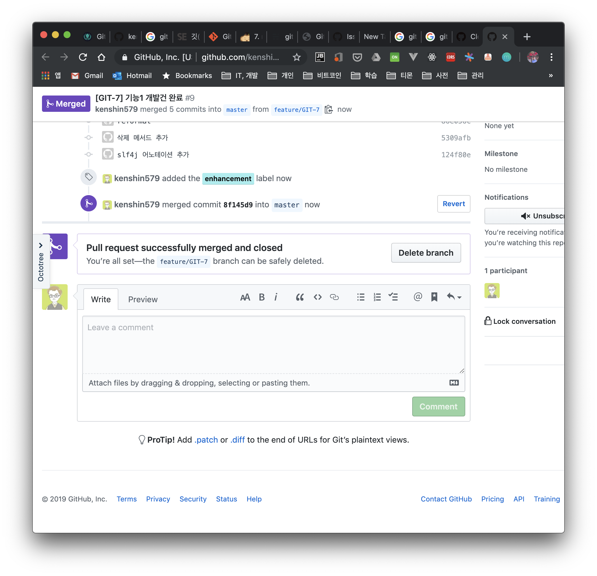

Joe's committed work (feature/GIT-7) was reflected nicely into master.

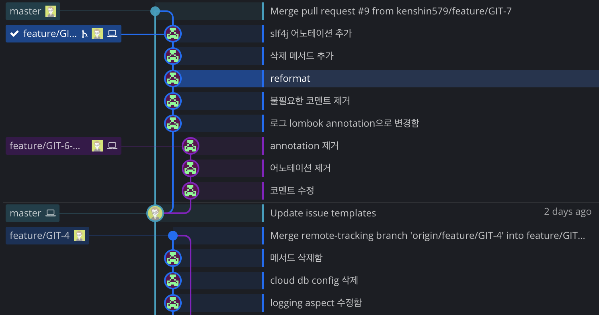

### 3.1.3 Merging onto the latest master with rebase

Let's bring the latest code committed by developer Joe into feature/GIT-6-working-branch, which developer Frank is currently working on.

_After selecting the master branch > right-click > choose one of the two below_

* Click Rebase feature/GIT-6-working-branch onto master
* Click Interactive Rebase feature/GIT-6-working-branch onto master
    * Selecting this menu lets you selectively rebase multiple commits (see: 3.1.3)

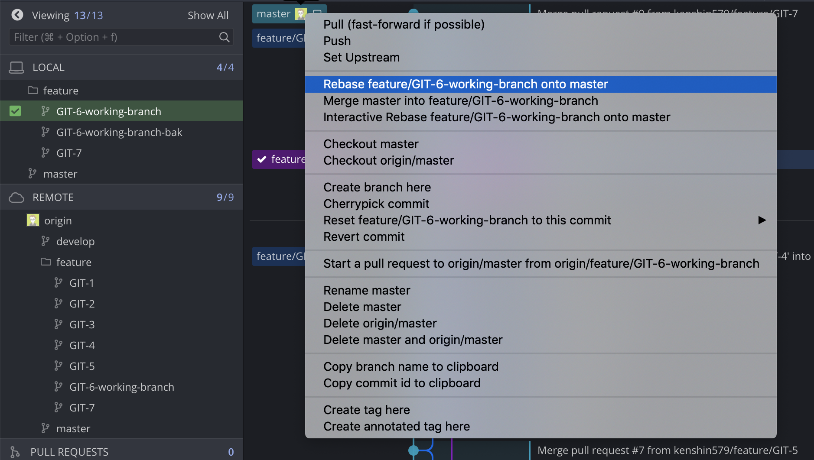

After rebasing, you can see that the feature/GIT-6-working-branch commits come after the commits on the master branch.

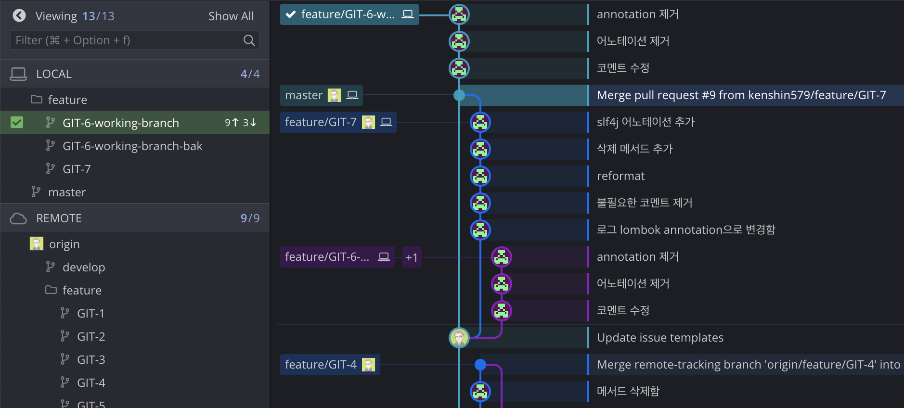

There are 3 items to bring into the master branch, and once you pull the commits and then push, the merge is complete.

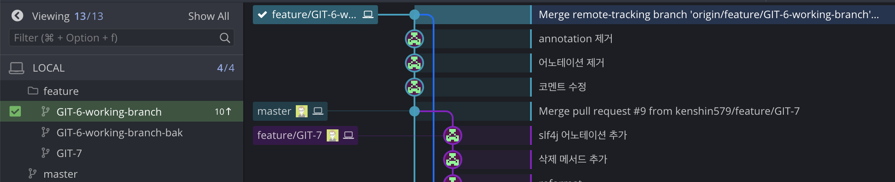

This is the result of pushing to remote/GIT-6-working-branch. The work done on GIT-6-working-branch (e.g. removing annotations, removing the annotation, editing comments) was committed after the master branch commits.

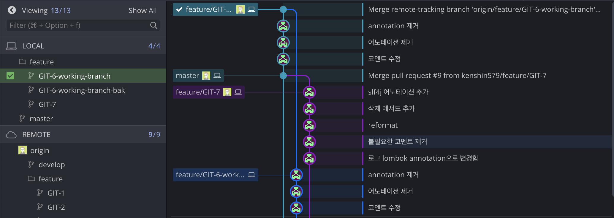

### 3.1.4 Doing an Interactive Rebase

To test rebasing in various ways in the same situation, I created several branches (e.g. GIT-6-working-branch-*) in advance from the same point.

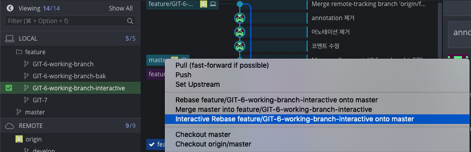

When you rebase interactively, you can decide at rebase time whether to selectively include each committed change, as shown below. In this example, I click the Start Rebase button to rebase including all commits.

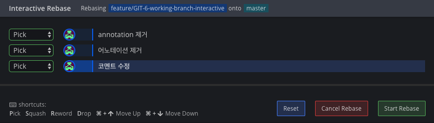

The result is the same as rebasing the normal way.

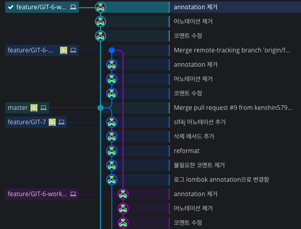

## 3.2 Doing a rebase directly with Git commands

Using a Git client makes it easy to create and merge branches, but let's also look at the Git commands.

### 3.2.1 Switching to the working branch

Switch to the working branch.

```bash
$ git checkout GIT-6-working-branch-cmd
```

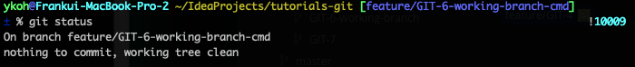

### 3.2.2 Doing a Rebase

The command below rebases the current working branch onto master. Very simple, right?

```bash
$ git rebase origin/master
```

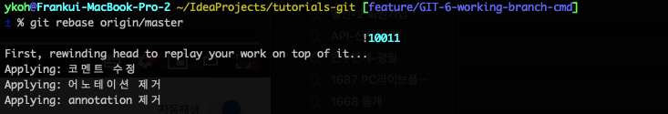

Looking at the rebased result in Git Kraken, you can confirm the result is the same.

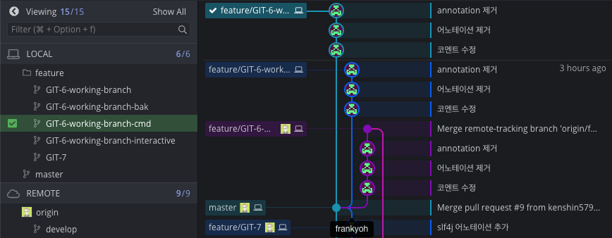

## 3.3 Merging with Merge

With Rebase, all the commits you've made so far are preserved and the history remains, whereas with a Merge, multiple commits are combined into a single commit, so it has the downside of losing the commit history. Let's see how this differs in practice by merging with merge in GitKraken.

_After selecting master > right-click > Merge master into feature/GIT-6-working-branch-merge-test_

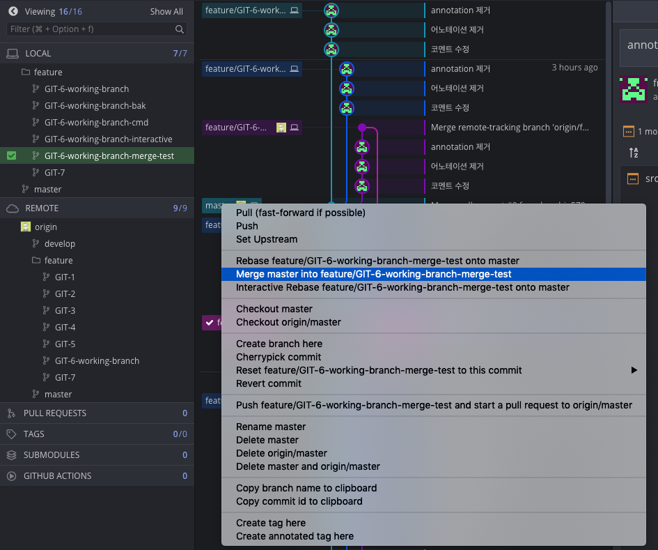

The work committed on the master branch was merged into GIT-6-working-branch-merge-test as a whole.

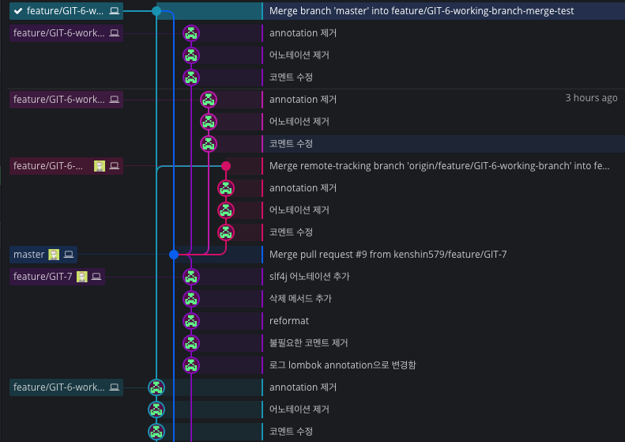

# 4. Conclusion

We performed rebase merges both in a Git client and in the terminal. Both make it easy to rebase, so you can go with whichever way you're most comfortable with according to your personal preference. We also briefly looked at the difference between merge and rebase when merging. When you want to merge while keeping master's commit history, you can merge using the rebase approach we looked at instead of merge.

# 5. References

* What is Rebase
    * [https://git-scm.com/book/ko/v1/Git-브랜치-Rebase하기](https://git-scm.com/book/ko/v1/Git-%EB%B8%8C%EB%9E%9C%EC%B9%98-Rebase%ED%95%98%EA%B8%B0)
* Rebase vs Merge
    * [https://elegantcoder.com/git-merge-or-rebase/](https://elegantcoder.com/git-merge-or-rebase/)
* Rebase in GitKaren
    * [https://blog.axosoft.com/rebasing-gitkraken-vs-cli/](https://blog.axosoft.com/rebasing-gitkraken-vs-cli/)
* When should you rebase?
    * [http://dogfeet.github.io/articles/2012/git-merge-rebase.html](http://dogfeet.github.io/articles/2012/git-merge-rebase.html)
* Rebasing directly with commands
    * [https://git-scm.com/book/ko/v1/Git-브랜치-Rebase하기](https://git-scm.com/book/ko/v1/Git-%EB%B8%8C%EB%9E%9C%EC%B9%98-Rebase%ED%95%98%EA%B8%B0)
