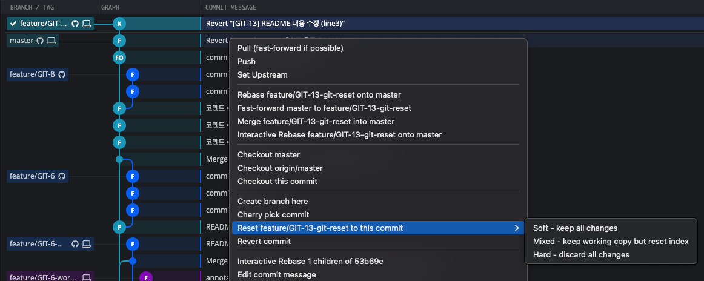
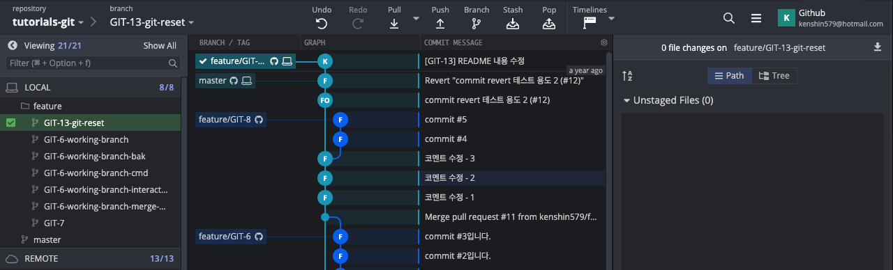
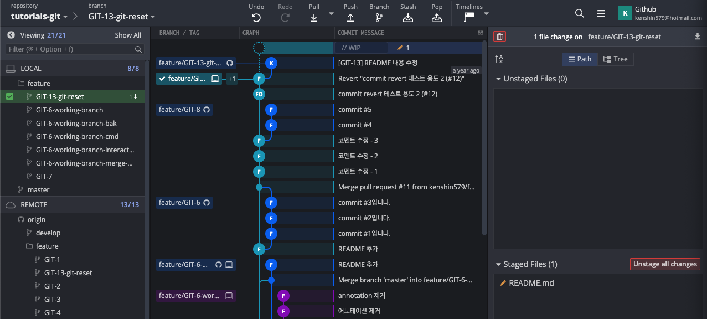
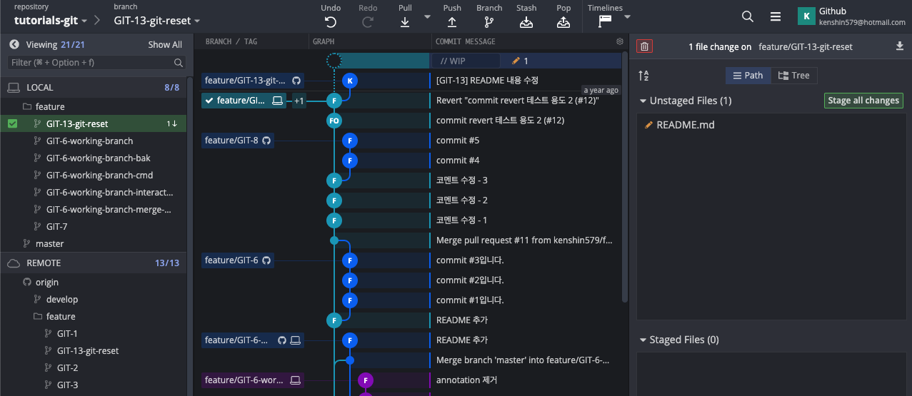
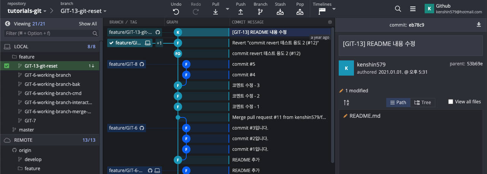
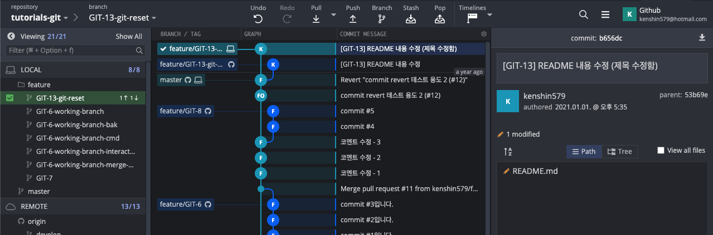
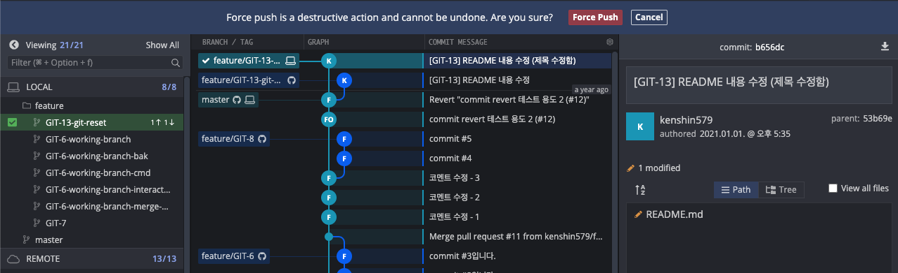
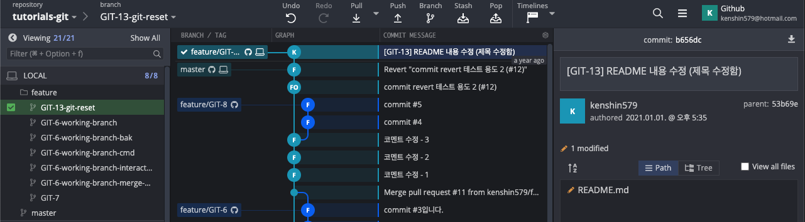

# 1. Git Reset

When working with Git, you often run into situations where you need to revert committed history. Git Reset provides the 3 options below. Let's look at the difference between each option.

## 1.1 Types of Git Reset

- `soft`
    - Used when you want to revert only the commit
    - The changed code is left in the stage area
- `mixed` (default option)
    - Used when you want to reset the state of the changed index (stage area) back to the original
    - The changed code remains in the working directory. To commit again, you need to add it back to the staged area
- `hard`
    - Used when you want to completely discard the most recent commit and revert to the previous state
    - All changed code disappears, so be careful when using hard

### 1.1.1 Terminology

| Term                 | Description                          |
| -------------------- | ------------------------------------ |
| HEAD                 | - Points to the current branch       |
| Index (Staging Area) | - Where files ready to be committed are |
| Working Directory    | - Where files to be modified are     |


## 1.2 Trying Git Reset in GitKraken

### 1.2.1 How to Reset

#### 1.2.1.1 With Git commands

The Git Reset command runs in the form below. The mode option is one of the 3 above, and if omitted it defaults to `mixed` mode. The commit to reset can be specified by commit number or in the HEAD~# form.

> HEAD indicates the current commit position. HEAD~2 means the previous 2 commits.

```bash
$ git reset --<mode> <commit>
```

Here are various Git Reset commands.

```bash
$ git reset HEAD~1 # go back to right before the last commit
$ git reset c1c2239a # reset to commit c1c2239a (mixed mode)
$ git reset --hard c1c2239a # reset to commit c1c2239a (hard mode)
```

#### 1.2.1.2 With GitKraken

In GitKraken, right-clicking the commit you want to reset to in the commit list brings up a pop-up menu. From the **Reset ### to this commit** menu, select the mode you want.




### 1.2.2 A collection of examples by reset type

Now let's actually try resetting in the 3 modes in GitKraken. Currently GIT-13 has been committed and pushed to the remote repository. Now let's revert to the previous commit in the 3 modes.



#### 1.2.2.1 Soft Reset

This is a Soft Reset. It points to the previous branch, and since the `README.md` file is already in the `staged area`, you can commit again.



```bash
$ git status
On branch feature/GIT-13-git-reset
Your branch is behind 'origin/feature/GIT-13-git-reset' by 1 commit, and can be fast-forwarded.
  (use "git pull" to update your local branch)

Changes to be committed:
  (use "git restore --staged <file>..." to unstage)
        modified:   README.md
```

#### 1.2.2.2 Mixed Reset (default mode)

This is a Mixed Reset. The branch position is at the previous commit, and the previously committed files are excluded from the `staged area`, so to commit them you need to add them back to the `staged area`.



The `git status` command also explains that the files are not staged and that you need to add them with `git add`.

```bash
$ git status
On branch feature/GIT-13-git-reset
Your branch is behind 'origin/feature/GIT-13-git-reset' by 1 commit, and can be fast-forwarded.
  (use "git pull" to update your local branch)

Changes not staged for commit:
  (use "git add <file>..." to update what will be committed)
  (use "git restore <file>..." to discard changes in working directory)
        modified:   README.md

no changes added to commit (use "git add" and/or "git commit -a")

```

#### 1.2.2.3 Hard Reset

This is a Hard Reset. When you revert to a previous commit, the commits after it simply disappear, so be careful when using it.



```bash
$ git status
On branch feature/GIT-13-git-reset
Your branch is behind 'origin/feature/GIT-13-git-reset' by 1 commit, and can be fast-forwarded.
  (use "git pull" to update your local branch)

nothing to commit, working tree clean
```

### 1.2.3 Example of changing the title and committing again (mixed mode)

So far we've looked at the differences between the 3 modes. Let's wrap up with a final example of modifying the title of a commit that has already been pushed to remote.

1. Reset to the previous commit in mixed mode. Add the file to commit again to the staged area, change the commit title, and commit.



2. Force push to remote.



3. Verify that it was pushed correctly with the changed title.



# 2. Summary

Now that you've mastered Git Reset, just use it appropriately. The code written in this posting can be found on [github](https://github.com/kenshin579/tutorials-git).

# 3. References

- [https://www.devpools.kr/2017/02/05/%EC%B4%88%EB%B3%B4%EC%9A%A9-git-%EB%90%98%EB%8F%8C%EB%A6%AC%EA%B8%B0-reset-revert](https://www.devpools.kr/2017/02/05/초보용-git-되돌리기-reset-revert)/
- https://backlog.com/git-tutorial/kr/stepup/stepup6_3.html
- [https://git-scm.com/book/ko/v2/Git-%EB%8F%84%EA%B5%AC-Reset-%EB%AA%85%ED%99%95%ED%9E%88-%EC%95%8C%EA%B3%A0-%EA%B0%80%EA%B8%B0](https://git-scm.com/book/ko/v2/Git-도구-Reset-명확히-알고-가기)
- https://opentutorials.org/module/4032/24533
- https://c10106.tistory.com/3930
- https://antilog.tistory.com/33
- https://medium.com/@joongwon/git-git-%EC%9D%98-%EA%B8%B0%EC%B4%88-a7801f45091d
- https://c10106.tistory.com/3943
