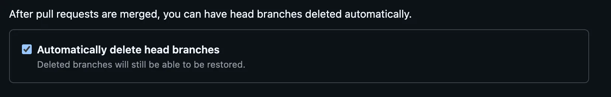

# Overview

When you use `Git` for code version control, even after creating a new branch for some work, working on it, and then `Merge`-ing it, unused branches keep piling up locally.

For remote branches, you can delete them automatically by enabling the `Automatically delete head branches` option in GitHub's settings



But local branches are not deleted automatically and have to be done manually every time. To reduce the hassle, let's write a simple script.

> I got help writing the script from `ChatGPT`. As long as you convey your requirements well these days, it writes a perfect script, so I'm using it really well.

# Usage

## Command usage

- When the `-i` option is present, it runs `interactive`ly, asking for a `confirm` before deleting each local branch

```bash
> cleanup_prune_local_branches.sh -h
/Users/user/bin/cleanup_prune_local_branches.sh: illegal option -- h
Usage: cleanup_prune_local_branches.sh [-i]
-i: Enable interactive mode with confirmation prompt for each branch deletion
```

## Run example

```bash
> cleanup_prune_local_branches.sh -i 

Deleting local branch: chore/throttle
=======[WARN] Are you sure you want to delete unused branch ? [y/N] y
Delete branch...chore/throttle...
Deleted branch chore/throttle (was 696ca70ec).

Deleting local branch: dev-tmp
=======[WARN] Are you sure you want to delete unused branch ? [y/N] y
Delete branch...dev-tmp...
Deleted branch dev-tmp (was a615ec3d6).

Deleting local branch: feat/#1987-integration
=======[WARN] Are you sure you want to delete unused branch ? [y/N] n
cancelled.

Deleting local branch: feat/#1987-robot-path-order
=======[WARN] Are you sure you want to delete unused branch ? [y/N]
```

# Source Code

Here is the full source code of the script.

```bash
#!/usr/bin/env bash

IGNORE_BRANCHES=("chores")
INTERACTIVE_MODE=false

# Parse command-line options
while getopts "i" opt; do
  case $opt in
    i)
      INTERACTIVE_MODE=true
      ;;
    *)
      echo "Usage: $(basename "$0") [-i]"
      echo "-i: Enable interactive mode with confirmation prompt for each branch deletion"
      exit 1
      ;;
  esac
done

confirm() {
  local branch=$1
  read -r -p "=======[WARN] Are you sure you want to delete unused branch $branch? [y/N] " response
  case "$response" in
    [yY][eE][sS]|[yY])
      echo "Delete branch...$branch..."
      git branch -D "$branch"
      ;;
    *)
      echo "Skipping branch '$branch'..."
      return 1
      ;;
  esac
}

# Fetch the latest list of remote branches
git fetch --prune

# Check the currently checked-out branch
current_branch=$(git symbolic-ref --short HEAD)

# Iterate over the list of local branches
for branch in $(git branch --format '%(refname:short)'); do
    # Skip the current branch
    if [[ "$branch" == "$current_branch" ]]; then
        continue
    fi

    # Check for branches to exclude
    skip_branch=false
    for ignore in "${IGNORE_BRANCHES[@]}"; do
        if [[ "$branch" == "$ignore" ]]; then
            echo "Skipping ignored branch: $branch"
            skip_branch=true
            break
        fi
    done

    if [[ "$skip_branch" == true ]]; then
        continue
    fi

    # Delete branches with no remote
    if ! git show-ref --quiet "refs/remotes/origin/$branch"; then
        echo "Found local branch with no remote: $branch"
        if [[ "$INTERACTIVE_MODE" == true ]]; then
            confirm "$branch"
        else
            echo "Deleting branch...$branch..."
            git branch -D "$branch"
        fi
    fi
done
```

Using this script, you can effectively clean up unnecessary Git branches locally.
