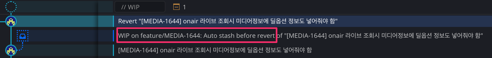

This is material where I personally jot down things I don't know and briefly organize the parts I come to understand.
If you know any of the unanswered ones, please leave a comment. Thank you.

# Full Q&A List

# [Unanswered Questions]

- - - -

# [Answered]

# 1. What is WIP?
It means Work In Progress. GitKraken automatically created a WIP. When reverting, because there were files being worked on in the current branch, it automatically stashed them and created a WIP in that situation.

Reference
* [https://stackoverflow.com/questions/15763059/github-what-is-a-wip-branch](https://stackoverflow.com/questions/15763059/github-what-is-a-wip-branch)
