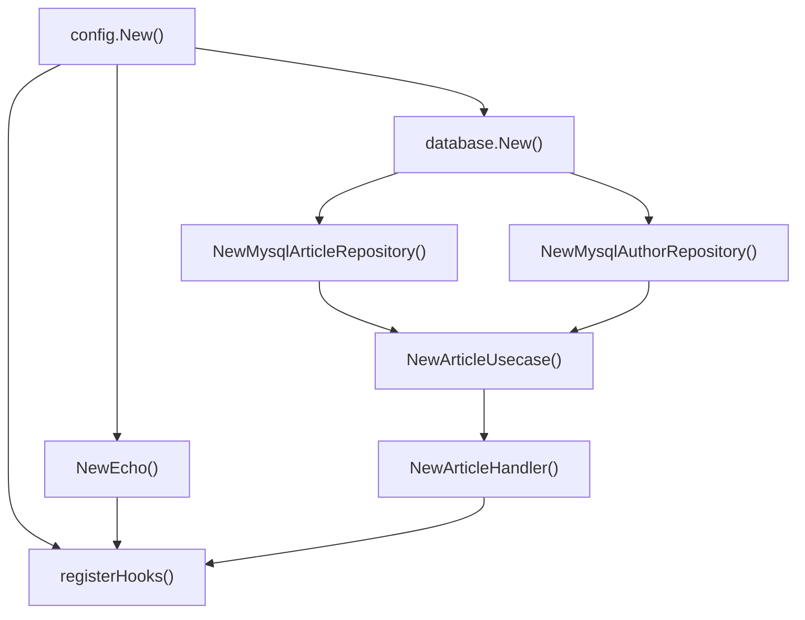

# 1. 들어가며

Go 애플리케이션이 커지면 의존성 조립이 복잡해진다. `main()`에서 생성자를 하나하나 호출하고, 매개변수 순서를 맞추고, 수명주기를 직접 관리해야 한다. uber/fx는 이 문제를 해결하는 Go용 DI(Dependency Injection) 프레임워크다.

이 글에서 다루는 범위는 다음과 같다.

- 기본 API: `fx.Provide`, `fx.Invoke`, `fx.Supply`, `fx.New`
- 수명주기 관리: `fx.Lifecycle` (OnStart/OnStop)
- 그룹화·확장 패턴: `fx.Module`, `fx.Decorate`
- 동일 타입 다중 인스턴스: `fx.Annotate` + `name:` / `group:` 태그 (`fx.Group`)
- Module 캡슐화: `fx.Private`
- 테스트 전략: `fxtest.New`, `fx.Replace`, `fx.Populate`

# 2. fx 기초

## 2.1 Go에서 DI가 필요한 이유

레이어가 분리된 실전 프로젝트에서는 의존성이 많다. 예를 들어 Article API를 구성하려면 다음 의존성을 순서대로 조립해야 한다.

```go
// 수동 DI: main()에서 직접 조립
cfg, _ := config.New()
db, _ := database.New(cfg)

authorRepo := author.NewMysqlAuthorRepository(db)
articleRepo := article.NewMysqlArticleRepository(db)

timeout := time.Duration(cfg.Context.Timeout) * time.Second
articleUsecase := article.NewArticleUsecase(articleRepo, authorRepo, timeout)

e := NewEcho()
article.NewArticleHandler(e, articleUsecase)

e.Start(cfg.Server.Address)
```

의존성이 늘어날수록 이 코드는 급격히 복잡해진다. 순서를 틀리면 컴파일 에러가 나고, 새로운 서비스를 추가할 때마다 main()을 수정해야 한다.

uber/fx는 이 문제를 해결한다. 생성자 함수의 **매개변수와 반환 타입**을 분석하여 의존성 그래프를 자동으로 구성하고, 올바른 순서로 생성한다.

```bash
go get go.uber.org/fx
```

## 2.2 fx 기본 개념

본격적으로 들어가기 전에, 이 글에서 다루는 fx 메서드를 한눈에 정리한다. fx는 메서드가 많아 매번 헷갈리기 쉬우므로, 아래 표를 지도 삼아 읽으면 좋다. 분류 순서는 글의 진행 순서(기초 → 확장 → 테스트)와 일치한다.

| 메서드 | 분류 | 역할 | 언제/왜 쓰나 | 도입 버전 |
|--------|------|------|--------------|-----------|
| `fx.New` | 기초 | 앱 컨테이너 생성 | 앱의 진입점. 모든 `Provide`/`Invoke`를 모아 의존성 그래프를 만든다 | — |
| `fx.Provide` | 기초 | lazy 등록 (반환 타입 기준 그래프 등록) | 대부분의 생성자(`NewXxx`)를 등록할 때. 실제로 필요해지는 순간까지 실행을 미룬다 | — |
| `fx.Invoke` | 기초 | eager 실행 (서버 시작·라우터 등록 등 부수 효과) | 앱 시작 시 반드시 실행돼야 하는 코드. 이게 있어야 lazy한 그래프가 실제로 조립된다 | — |
| `fx.Supply` | 기초 | 생성자 없이 값 직접 등록 | 이미 만들어진 값(설정 구조체, 상수 등)을 넣을 때. 생성 로직이 없어 `Provide`가 과할 때 | — |
| `fx.Lifecycle` | 수명주기 | OnStart/OnStop 훅으로 시작·종료 관리 | 서버 기동/종료, DB 커넥션 open/close처럼 시작·정리가 짝을 이루는 리소스 관리 | — |
| `fx.Module` | 확장 | 도메인별 의존성 그룹화 | 앱이 커져 `Provide`가 수십 개로 늘 때. 도메인별로 묶어 재사용·격리한다 | v1.17+ |
| `fx.Decorate` | 확장 | 기존 의존성 래핑 (로깅·캐싱·메트릭) | 원본 코드를 안 건드리고 기존 의존성에 로깅/캐싱/메트릭 등 횡단 관심사를 덧씌울 때 | v1.18+ |
| `fx.Annotate` | 확장 | 생성자에 메타데이터 부여 (name/group/As) | 일반 생성자를 그대로 두고 name/group/As 같은 부가 정보만 얹고 싶을 때 | — |
| `fx.In` / `fx.Out` | 확장 | 파라미터·반환값을 구조체로 묶어 주입 (name/group 태그 매칭) | 주입받을 의존성이 많거나, name/group 태그로 특정 인스턴스를 지목해야 할 때 | — |
| `fx.ResultTags` + `name:` | 확장 | 동일 타입을 개별 식별 | 같은 타입 인스턴스가 여러 개일 때(예: read/write DB) 이름으로 구분해 주입 | — |
| `group:` 태그 | 확장 | 동일 인터페이스 구현체를 슬라이스로 모음 | 플러그인·핸들러처럼 같은 인터페이스 구현체를 한꺼번에 슬라이스로 받고 싶을 때 | — |
| `fx.Private` | 확장 | Module 내부 의존성 캡슐화 | Module 내부에서만 쓰는 의존성을 바깥 그래프에 노출하지 않고 감추고 싶을 때 | v1.20+ |
| `fxtest.New` | 테스트 | 테스트 전용 앱 생성 | 테스트에서 fx 앱을 띄울 때. 실패를 `t`로 리포트하고 정리를 도와준다 | — |
| `fx.Replace` | 테스트 | 기존 Provide를 Mock으로 교체 | 실제 의존성 대신 Mock/Stub을 주입해 테스트를 격리할 때 | — |
| `fx.Populate` | 테스트 | 컨테이너 내부 인스턴스를 외부 변수로 추출 | 테스트에서 조립된 인스턴스를 꺼내 검증할 때(`Invoke` 클로저 없이 간결하게) | — |

각 메서드가 무엇을 인자로 받아 무엇을 반환하는지도 함께 알아두면 이해가 빠르다. 핵심은 **대부분의 fx 함수가 `fx.Option`을 반환**하고, 그 `Option`들을 `fx.New()`가 모아 앱을 조립한다는 점이다.

| 메서드 | 인자 (받는 것) | 반환값 |
|--------|----------------|--------|
| `fx.New` | `opts ...fx.Option` (Provide/Invoke 등) | `*fx.App` |
| `fx.Provide` | `constructors ...interface{}` (생성자 함수들) | `fx.Option` |
| `fx.Invoke` | `funcs ...interface{}` (실행할 함수들) | `fx.Option` |
| `fx.Supply` | `values ...interface{}` (이미 만든 값들) | `fx.Option` |
| `fx.Module` | `name string, opts ...fx.Option` | `fx.Option` |
| `fx.Decorate` | `decorators ...interface{}` (데코레이터 함수들) | `fx.Option` |
| `fx.Annotate` | `f interface{}, anns ...fx.Annotation` | `interface{}` (주석 달린 생성자) |
| `fx.ResultTags` / `fx.ParamTags` | `tags ...string` | `fx.Annotation` |
| `fx.Replace` | `values ...interface{}` | `fx.Option` |
| `fx.Populate` | `targets ...interface{}` (포인터들) | `fx.Option` |
| `fxtest.New` | `tb fxtest.TB, opts ...fx.Option` | `*fxtest.App` |

위 표는 함수형 API만 다뤘다. `fx.Lifecycle`(인터페이스), `fx.In` / `fx.Out`(임베드용 구조체), `name:` / `group:`(struct 태그)은 함수가 아니라 각각 뒤 섹션에서 따로 설명한다.

정리하면 두 가지만 기억하면 된다. ①`Provide`·`Invoke`·`Supply`·`Module`·`Decorate`·`Replace`·`Populate`는 전부 `fx.Option`을 반환해 `fx.New`의 인자로 들어간다. ②`Annotate`·`ResultTags`는 `Annotation`(또는 주석 달린 생성자)을 반환해 `Provide`·`Supply` 안에서 쓰인다.

이후 섹션에서 각 메서드를 실전 예제로 하나씩 다룬다. 우선 가장 기초가 되는 `fx.Provide`, `fx.Invoke`, `fx.Supply`, `fx.New`부터 살펴보자.

`fx.Provide()`에 등록된 생성자는 즉시 실행되지 않는다. 다른 곳에서 해당 타입이 필요할 때 **lazy**하게 생성된다.

```go
// fx_test.go
func TestFx_Provide_Invoke(t *testing.T) {
    var svc *UserService

    app := fxtest.New(t,
        // fx.Provide: 생성자를 등록만 한다. 즉시 실행되지 않고, 의존성으로 필요해질 때 lazy하게 호출된다.
        fx.Provide(
            NewLogger,       // Logger 인터페이스 반환
            NewMysqlUserRepo, // UserRepository 인터페이스 반환 (Logger 필요)
            NewUserService,   // *UserService 반환 (UserRepository 필요)
        ),
        // fx.Invoke: 앱 시작 시 즉시 실행되는 부수 효과. 여기서는 조립된 UserService를 외부 변수로 꺼낸다.
        fx.Invoke(func(s *UserService) {
            svc = s
        }),
    )
    defer app.RequireStop()
    app.RequireStart()

    assert.Equal(t, "user-1", svc.repo.FindByID(1))
}
```

`fx.Supply()`는 생성자 없이 이미 만들어진 값을 직접 제공한다.

```go
// fx_test.go
type Config struct {
    DBHost string
    DBPort int
}

cfg := &Config{DBHost: "localhost", DBPort: 3306}

app := fxtest.New(t,
    fx.Supply(cfg), // 생성자 없이 값 직접 등록
    fx.Invoke(func(c *Config) {
        // c.DBHost == "localhost"
    }),
)
```

## 2.3 실전 프로젝트에 fx 적용

수동 DI 코드를 fx로 변환하면 다음과 같다.

```go
// cmd/main.go
app := fx.New(
    fx.Provide(
        config.New,              // *config.Config
        database.New,            // *sql.DB (*config.Config 필요)
        NewEcho,                 // *echo.Echo
        ProvideBasicConfig,      // time.Duration

        article.NewArticleHandler,         // Handler (Echo, UseCase 필요)
        article.NewArticleUsecase,         // UseCase (Repo, AuthorRepo, Duration 필요)
        article.NewMysqlArticleRepository, // Repository (DB 필요)

        author.NewMysqlAuthorRepository,   // AuthorRepo (DB 필요)
    ),
    fx.Invoke(registerHooks),  // 서버 시작
)
```

fx는 각 생성자의 매개변수 타입을 보고 의존성 순서를 자동으로 결정한다. 예를 들어 `database.New(cfg *config.Config)`는 `*config.Config`가 필요하므로 `config.New()`가 먼저 호출된다.

각 생성자의 시그니처를 보면 의존성 관계가 명확하다.

```go
// pkg/config/config.go
func New() (*config.Config, error) { ... }

// pkg/database/db.go
func New(cfg *config.Config) (*sql.DB, error) { ... }

// article/usecase.go
func NewArticleUsecase(
    a domain.ArticleRepository,
    ar domain.AuthorRepository,
    timeout time.Duration,
) domain.ArticleUsecase { ... }

// article/handler.go
func NewArticleHandler(e *echo.Echo, us domain.ArticleUsecase) *ArticleHandler { ... }
```

`fx.Provide()`에는 위처럼 미리 정의한 생성자뿐 아니라 **익명 함수**도 그대로 등록할 수 있다. 간단한 변환 로직은 별도 생성자 파일을 만들 필요 없이 인라인으로 처리하면 편하다. 위의 `ProvideBasicConfig`를 익명 함수로 풀어 쓰면 다음과 같다.

```go
// cmd/main.go
app := fx.New(
    fx.Provide(
        config.New,
        database.New,
        NewEcho,

        // 익명 함수도 생성자로 등록 가능 — 매개변수·반환 타입만 맞으면 된다
        func(cfg *config.Config) time.Duration {
            return time.Duration(cfg.Context.Timeout) * time.Second
        },

        article.NewArticleHandler,
        article.NewArticleUsecase,
        article.NewMysqlArticleRepository,
        author.NewMysqlAuthorRepository,
    ),
    fx.Invoke(registerHooks),
)
```

fx는 named 생성자와 똑같이 익명 함수의 매개변수(`*config.Config`)와 반환 타입(`time.Duration`)을 분석해 의존성 그래프에 연결한다. 함수 형태만 다를 뿐, fx 입장에서는 동일한 생성자다.

이렇게 등록한 생성자들로 fx가 구성하는 의존성 그래프를 시각화하면 다음과 같다.



fx는 이 그래프를 생성자의 매개변수와 반환 타입만으로 자동 구성한다. 순환 의존성이 있으면 앱 시작 시 명확한 에러 메시지를 출력한다.

## 2.4 Lifecycle 관리

`fx.Lifecycle`은 앱의 시작과 종료를 관리한다. `OnStart`에서 서버를 시작하고, `OnStop`에서 Graceful Shutdown을 처리한다.

```go
// cmd/main.go
func registerHooks(lifecycle fx.Lifecycle, e *echo.Echo, cfg *config.Config) {
    lifecycle.Append(
        fx.Hook{
            OnStart: func(context.Context) error {
                fmt.Println("Starting server")
                go e.Start(cfg.Server.Address)
                return nil
            },
            OnStop: func(context.Context) error {
                fmt.Println("Stopping server")
                return nil
            },
        },
    )
}
```

`registerHooks`는 `fx.Invoke()`로 등록한다. 한 가지 주의할 점은 **실행 시점**이다. `fx.Invoke`(그리고 이를 내부적으로 사용하는 `fx.Populate`)는 `app.Start()`가 아니라 **`fx.New()` 호출 시점**에 즉시 실행된다. 따라서 위 `registerHooks`는 `fx.New()` 단계에서 호출되어 `Lifecycle`에 OnStart/OnStop 훅을 *등록*만 하고, 실제 서버 기동(`OnStart` 본문)은 이후 `app.Start(ctx)` 시점에 트리거된다. `fx.Lifecycle`이 이런 2단계 구조를 가지는 이유다 — Invoke로 일찍 훅을 등록해두고, 훅 본문 실행은 `Start`까지 미루는 것.

| 단계 | 시점 | 실행되는 것 |
|------|------|------------|
| 1 | `fx.New()` / `fxtest.New()` | `fx.Invoke` 함수 본문 (= `fx.Populate`도 여기서 채워짐), Lifecycle 훅 *등록* |
| 2 | `app.Start(ctx)` | 등록된 `OnStart` 훅 실행 (서버 기동 등) |
| 3 | `app.Stop(ctx)` | 등록된 `OnStop` 훅 실행 (Graceful Shutdown) |

```go
// fx_test.go
func TestFx_Lifecycle(t *testing.T) {
    var startCalled, stopCalled bool

    app := fxtest.New(t,
        fx.Invoke(func(lc fx.Lifecycle) {
            lc.Append(fx.Hook{
                OnStart: func(context.Context) error {
                    startCalled = true
                    return nil
                },
                OnStop: func(context.Context) error {
                    stopCalled = true
                    return nil
                },
            })
        }),
    )

    app.RequireStart()
    assert.True(t, startCalled)

    app.RequireStop()
    assert.True(t, stopCalled)
}
```

# 3. 확장 패턴

fx.Module부터 fx.Private까지, fx 기초 위에 쌓이는 확장 도구들을 살펴본다.

## 3.1 fx.Module 패턴

`fx.Module()`은 관련 의존성을 도메인별로 그룹화한다. 앱이 커질수록 `fx.Provide()`에 생성자가 한꺼번에 나열되면 가독성이 떨어진다. Module로 분리하면 관심사가 명확해진다.

```go
// fx_test.go
var UserModule = fx.Module("user",
    fx.Provide(
        NewMysqlUserRepo,
        NewUserService,
    ),
)

var OrderModule = fx.Module("order",
    fx.Provide(
        NewMysqlOrderRepo,
        NewOrderService,
    ),
)

app := fxtest.New(t,
    fx.Provide(NewLogger), // 공통 의존성
    UserModule,
    OrderModule,
    fx.Invoke(func(u *UserService, o *OrderService) {
        // 모든 의존성이 자동으로 연결됨
    }),
)
```

실제 프로젝트에서는 각 도메인 패키지에 Module 변수를 정의하고, main()에서 조합하는 패턴이 일반적이다.

```go
// 실전 적용 예시
app := fx.New(
    fx.Provide(config.New, database.New, NewEcho),
    article.Module,   // article 도메인 모듈
    author.Module,    // author 도메인 모듈
    payment.Module,   // payment 도메인 모듈
    fx.Invoke(registerHooks),
)
```

> **fx.Module은 v1.17.0+부터 사용 가능**하다. 이전 버전에서는 `fx.Options()`로 유사한 그룹화가 가능하지만, 모듈 이름과 스코프 격리는 지원하지 않는다.

## 3.2 fx.Decorate 패턴

`fx.Decorate()`는 기존 의존성을 래핑하여 동작을 추가한다. 데코레이터 패턴과 동일한 개념으로, 로깅, 캐싱, 메트릭 수집 등에 활용된다.

```go
// fx_test.go
// 로깅 데코레이터: 기존 UserRepository를 래핑
type loggingUserRepo struct {
    inner  UserRepository
    logger Logger
    calls  []string
}

func (r *loggingUserRepo) FindByID(id int) string {
    r.calls = append(r.calls, fmt.Sprintf("FindByID(%d)", id))
    return r.inner.FindByID(id) // 원본 호출
}

app := fxtest.New(t,
    fx.Provide(NewLogger, NewMysqlUserRepo, NewUserService),
    // 기존 UserRepository를 로깅 래퍼로 교체
    fx.Decorate(func(repo UserRepository, logger Logger) UserRepository {
        return &loggingUserRepo{inner: repo, logger: logger}
    }),
    fx.Invoke(func(svc *UserService) {
        svc.repo.FindByID(1) // 로깅 래퍼를 통해 호출됨
    }),
)
```

`fx.Decorate()`는 원본 의존성을 매개변수로 받아 래핑된 새 인스턴스를 반환한다. UserService는 변경 없이 자동으로 래핑된 Repository를 주입받는다.

> **fx.Decorate는 v1.18.0+부터 사용 가능**하다.

## 3.3 fx.Annotate + Named 의존성

동일 타입의 여러 인스턴스를 구분해야 할 때 `fx.Annotate()`와 `name` 태그를 사용한다. 예를 들어 Read/Write DB를 분리하는 경우다.

```go
// fx_test.go
type DBConnection struct {
    Name string
    DSN  string
}

func NewReadDB() *DBConnection {
    return &DBConnection{Name: "read", DSN: "read-replica:3306"}
}

func NewWriteDB() *DBConnection {
    return &DBConnection{Name: "write", DSN: "primary:3306"}
}
```

`fx.Annotate()`로 각 생성자에 이름을 부여한다.

```go
// fx_test.go
fx.Provide(
    fx.Annotate(NewReadDB, fx.ResultTags(`name:"readDB"`)),
    fx.Annotate(NewWriteDB, fx.ResultTags(`name:"writeDB"`)),
    NewDBService,
)
```

수신 측에서는 `fx.In` 구조체에 `name` 태그로 매칭한다. `fx.In`은 여러 의존성을 하나의 파라미터 구조체로 묶어 주입받게 해주는 임베디드 마커다. 생성자 파라미터가 많거나, 지금처럼 `name`·`group` 태그로 특정 인스턴스를 지목해야 할 때 사용한다. 구조체에 `fx.In`을 임베드하면 fx가 각 필드를 개별 의존성으로 인식해 채워준다(반대로 반환값을 구조체로 묶을 때는 `fx.Out`을 쓴다).

```go
// fx_test.go
type DBParams struct {
    fx.In
    ReadDB  *DBConnection `name:"readDB"`
    WriteDB *DBConnection `name:"writeDB"`
}

func NewDBService(params DBParams) *DBService {
    return &DBService{
        readDB:  params.ReadDB,  // read-replica:3306
        writeDB: params.WriteDB, // primary:3306
    }
}
```

## 3.4 fx.Group으로 동일 인터페이스 여러 구현체 모으기

`name:` 태그는 동일 타입을 **개별** 식별할 때 쓴다. 하지만 동일 인터페이스의 여러 구현체를 한꺼번에 주입받고 싶다면 — 예를 들어 모든 Notifier에게 알림을 발송하는 경우 — `name:`으로는 부족하다. 각 구현체에 다른 이름을 붙이고 수신 측에서 일일이 받아야 하기 때문이다.

`group:` 태그는 이 문제를 해결한다. 같은 그룹에 등록된 구현체들이 슬라이스로 한꺼번에 주입된다.

```go
// fx_test.go
type Notifier interface {
    Send(msg string) string
}

type EmailNotifier struct{}
func (e *EmailNotifier) Send(msg string) string { return "email:" + msg }

type SlackNotifier struct{}
func (s *SlackNotifier) Send(msg string) string { return "slack:" + msg }

type SMSNotifier struct{}
func (s *SMSNotifier) Send(msg string) string { return "sms:" + msg }
```

`fx.Annotate()`와 `fx.ResultTags()`로 각 생성자를 같은 그룹에 등록한다.

```go
// fx_test.go
fx.Provide(
    fx.Annotate(func() Notifier { return &EmailNotifier{} },
        fx.ResultTags(`group:"notifiers"`)),
    fx.Annotate(func() Notifier { return &SlackNotifier{} },
        fx.ResultTags(`group:"notifiers"`)),
    fx.Annotate(func() Notifier { return &SMSNotifier{} },
        fx.ResultTags(`group:"notifiers"`)),
    NewNotifierService,
)
```

수신 측은 `fx.In` 구조체에 `group:` 태그가 붙은 슬라이스 필드로 받는다.

```go
// fx_test.go
type NotifierParams struct {
    fx.In
    Notifiers []Notifier `group:"notifiers"`
}

type NotifierService struct {
    notifiers []Notifier
}

func NewNotifierService(p NotifierParams) *NotifierService {
    return &NotifierService{notifiers: p.Notifiers}
}
```

여러 외부 서비스 클라이언트를 단일 인터페이스 슬라이스로 모으는 패턴이 대표적인 실전 활용 예다. 새 구현체가 추가되어도 수신 측 코드는 변경되지 않는다.

`name:` vs `group:` 차이를 정리하면:

| 패턴 | 용도 | 수신 측 |
|------|------|---------|
| `name:"X"` | 동일 타입을 **개별** 식별 | 단일 필드 |
| `group:"Y"` | 동일 타입(또는 인터페이스)을 **모음** | 슬라이스 필드 |

## 3.5 fx.Private로 Module 캡슐화

`fx.Module()`로 도메인을 분리해도 모든 `fx.Provide()`는 기본적으로 전역에 노출된다. Module 내부 전용으로만 쓰고 싶은 의존성은 `fx.Private`으로 막을 수 있다. 데이터베이스 핸들이나 외부 API 클라이언트 같은 인프라 의존성을 다른 Module이 우연히 같은 인스턴스를 공유하는 걸 막을 때 유용하다.

`fx.Private`은 같은 `fx.Provide()` 호출 안에 다른 생성자와 함께 넣으면 그 그룹 전체를 Module-private으로 만든다.

```go
// fx_test.go
type internalDB struct {
    name string
}

func newInternalDB() *internalDB {
    return &internalDB{name: "private-db"}
}

type ModuleService struct {
    db *internalDB
}

func newModuleService(db *internalDB) *ModuleService {
    return &ModuleService{db: db}
}

PrivateModule := fx.Module("private",
    fx.Provide(
        newInternalDB,
        fx.Private,        // 같은 fx.Provide() 그룹 전체를 Module 내부 전용으로
    ),
    fx.Provide(newModuleService), // ModuleService는 외부 노출
)
```

`*internalDB`는 `PrivateModule` 안의 `newModuleService`만 주입받을 수 있다. Module 외부에서 `*internalDB`를 직접 요청하면 fx는 의존성 그래프 구성 시점에 에러를 반환한다(`fx.Populate`는 4.3에서 다룬다).

```go
// fx_test.go
// 외부에서 *internalDB 직접 추출 시도 → fx.New가 에러 반환
var leaked *internalDB
leakApp := fx.New(
    PrivateModule,
    fx.Populate(&leaked),
    fx.NopLogger,
)
// leakApp.Err() != nil
```

> **fx.Private은 v1.20.0+부터 사용 가능**하다. 이전 버전에서는 `fx.Module`로 격리하더라도 모든 Provide가 전역 그래프에 등록된다.

# 4. 테스트 전략

fx로 구성한 앱은 `fxtest` 패키지로 테스트한다. mock 주입과 인스턴스 추출까지 살펴본다.

## 4.1 fxtest.New

`fxtest.New()`는 테스트 전용 앱을 생성한다. 테스트 실패 시 자동으로 정리되고, fx 로그가 테스트 출력에 포함된다.

```go
// fx_test.go
app := fxtest.New(t,
    fx.Provide(NewLogger, NewMysqlUserRepo, NewUserService),
    fx.Invoke(func(svc *UserService) { ... }),
)
defer app.RequireStop()
app.RequireStart()
```

## 4.2 fx.Replace로 Mock 주입

`fx.Replace()`는 기존 Provide를 완전히 교체한다. 테스트에서 실제 구현 대신 Mock을 주입할 때 유용하다.

```go
// fx_test.go
type mockUserRepo struct{}

func (r *mockUserRepo) FindByID(id int) string {
    return fmt.Sprintf("mock-user-%d", id) // Mock 응답
}

app := fxtest.New(t,
    fx.Provide(NewLogger, NewMysqlUserRepo, NewUserService),
    // 실제 UserRepository를 Mock으로 교체
    fx.Replace(fx.Annotate(&mockUserRepo{}, fx.As(new(UserRepository)))),
    fx.Invoke(func(svc *UserService) {
        result := svc.repo.FindByID(1)
        // result == "mock-user-1"
    }),
)
```

`fx.As(new(UserRepository))`는 `*mockUserRepo`를 `UserRepository` 인터페이스로 타입 변환하여 등록한다.

## 4.3 fx.Populate로 인스턴스 추출

지금까지는 `fx.Invoke(func(s *Svc) { svc = s })` 형태로 외부 변수에 인스턴스를 캡처했다. `fx.Populate`는 같은 일을 더 간결하게 한다.

사실 `fx.Populate`는 내부적으로 `fx.Invoke`로 구현된 편의 함수다. `fx.Populate(&svc)`는 "주입받은 값을 `svc`에 대입하는 `fx.Invoke`"를 자동으로 생성하는 것과 같다. 즉 둘의 본질은 동일하다. 차이는 **목적**에 있다. `fx.Invoke`는 꺼낸 의존성으로 무언가를 *실행*하는 게 목적이라 클로저 본문에서 호출·검증 등 무엇이든 할 수 있고(추출은 그중 하나일 뿐), `fx.Populate`는 *추출 자체*가 목적이라 클로저가 군더더기일 때 이를 생략한 형태다.

두 메서드를 비교하면 다음과 같다.

| 구분 | `fx.Invoke` | `fx.Populate` |
|------|-------------|---------------|
| 본질 | 함수를 **실행**한다 | 변수에 값을 **채운다** |
| 넘기는 것 | 함수(클로저) | 포인터 |
| 본문 | 있음 — 대입·호출·검증 등 무엇이든 | 없음 — 추출만 |
| 추출 | 클로저 안에서 `svc = s`로 부수적으로 가능 | 그 자체가 유일한 목적 |

```go
// fx_test.go
// 방식 1: fx.Invoke 클로저로 캡처 (앞서 사용한 방식)
var svc1 *UserService
app1 := fxtest.New(t,
    fx.Provide(NewLogger, NewMysqlUserRepo, NewUserService),
    fx.Invoke(func(s *UserService) {
        svc1 = s
    }),
)

// 방식 2: fx.Populate로 직접 추출
var svc2 *UserService
app2 := fxtest.New(t,
    fx.Provide(NewLogger, NewMysqlUserRepo, NewUserService),
    fx.Populate(&svc2),
)
```

여러 인스턴스를 한꺼번에 추출할 때 차이가 더 두드러진다.

```go
// fx_test.go
var (
    svc    *UserService
    logger Logger
)
app := fxtest.New(t,
    fx.Provide(NewLogger, NewMysqlUserRepo, NewUserService),
    fx.Populate(&svc, &logger),
)
```

선택 가이드는 단순하다.

| 상황 | 권장 |
|------|------|
| 인스턴스를 외부 변수로 꺼내는 게 목적 | `fx.Populate` |
| 추출 후 함수 호출이나 추가 검증을 같은 시점에 수행 | `fx.Invoke` |

# 5. 퀴즈

여기까지 읽었으면 아래 질문에 답할 수 있어야 한다. 펼치기 전에 먼저 스스로 답해보고, 막히면 괄호 안의 절로 돌아가면 된다.

<details>
<summary><b>Q1.</b> <code>fx.Provide()</code>에 생성자를 잔뜩 등록했는데 앱을 띄워도 아무것도 실행되지 않는다. 왜일까?</summary>

**A.** `fx.Provide`는 등록만 하고 실행은 미루는 lazy 등록이기 때문이다. 그래프가 실제로 조립되려면 그 타입을 요구하는 쪽이 있어야 하고, 그 시작점이 `fx.Invoke`다. 부수 효과(서버 기동·라우터 등록)를 담당하는 `Invoke`가 하나도 없으면 어떤 생성자도 호출되지 않는다. (2.2)

</details>

<details>
<summary><b>Q2.</b> <code>fx.Provide</code>와 <code>fx.Supply</code>는 무엇이 다른가?</summary>

**A.** `Provide`는 **생성자 함수**를 등록하고, fx가 그 함수의 반환 타입을 보고 그래프에 연결한다. `Supply`는 **이미 만들어진 값**을 그대로 등록한다. 설정 구조체나 상수처럼 생성 로직이 따로 없는 값에는 `Supply`가 맞다. (2.2)

</details>

<details>
<summary><b>Q3.</b> fx는 생성자를 어떤 순서로 호출할지 어떻게 결정하나?</summary>

**A.** 각 생성자의 **매개변수 타입과 반환 타입**만 본다. `database.New(cfg *config.Config)`는 `*config.Config`를 요구하므로 그 타입을 반환하는 `config.New()`가 먼저 호출된다. 등록 순서는 상관없고, 순환 의존성이 있으면 앱 시작 시점에 에러로 알려준다. (2.3)

</details>

<details>
<summary><b>Q4.</b> <code>registerHooks</code>를 <code>fx.Invoke</code>로 등록했다. 서버는 정확히 언제 뜨나?</summary>

**A.** 두 시점으로 나뉜다. `Invoke` 함수 본문은 `fx.New()` 호출 시점에 즉시 실행되지만, 거기서 하는 일은 `Lifecycle`에 훅을 *등록*하는 것뿐이다. `OnStart` 본문(실제 서버 기동)은 이후 `app.Start(ctx)`가 호출될 때 실행된다. `fx.Lifecycle`이 2단계 구조인 이유가 이것이다. (2.4)

</details>

<details>
<summary><b>Q5.</b> 도메인별로 <code>fx.Module</code>을 나눴는데, 다른 Module이 같은 DB 핸들을 주입받아 버렸다. 무엇을 빠뜨렸나?</summary>

**A.** `fx.Module`은 이름을 붙여 묶어줄 뿐, 안에 있는 `fx.Provide`는 기본적으로 전역 그래프에 노출된다. 모듈 내부 전용으로 감추려면 같은 `fx.Provide()` 그룹에 `fx.Private`을 넣어야 한다. 그러면 외부에서 그 타입을 요청할 때 그래프 구성 단계에서 에러가 난다. (3.1, 3.5)

</details>

<details>
<summary><b>Q6.</b> 기존 Repository 코드를 한 줄도 건드리지 않고 로깅을 붙이고 싶다.</summary>

**A.** `fx.Decorate`다. 원본 의존성을 매개변수로 받아 래핑한 **같은 타입**을 반환하면 fx가 그래프의 해당 노드를 교체한다. 이 의존성을 주입받는 쪽(`UserService`)은 코드 변경 없이 래퍼를 받게 된다. (3.2)

</details>

<details>
<summary><b>Q7.</b> 같은 <code>*DBConnection</code> 타입인 read용·write용 커넥션을 각각 주입받으려면?</summary>

**A.** `fx.Annotate`와 `fx.ResultTags`로 생성자마다 `name:"readDB"` 같은 이름을 붙이고, 수신 측은 `fx.In`을 임베드한 구조체의 필드에 `name` 태그를 달아 매칭한다. 타입이 같아도 이름으로 구분되므로 충돌하지 않는다. (3.3)

</details>

<details>
<summary><b>Q8.</b> <code>Notifier</code> 구현체가 셋인데 전부 한꺼번에 주입받고 싶다. <code>name:</code> 태그로 되나?</summary>

**A.** 되긴 하지만 나쁜 방법이다. 구현체마다 다른 이름을 붙이고 수신 측에서 필드를 하나씩 받아야 해서, 구현체가 늘 때마다 수신 코드를 고쳐야 한다. `fx.ResultTags`에 `group:"notifiers"`를 달아 등록하고 수신 측은 같은 태그를 붙인 `[]Notifier` 슬라이스 필드로 받으면, 새 구현체를 추가해도 수신 코드는 그대로다. (3.4)

</details>

<details>
<summary><b>Q9.</b> 테스트에서 실제 Repository 대신 Mock을 넣으려는데, <code>fx.Replace(&mockUserRepo{})</code>만으로는 왜 부족한가?</summary>

**A.** fx는 타입으로 매칭하는데 `&mockUserRepo{}`의 타입은 `*mockUserRepo`이지 `UserRepository` 인터페이스가 아니기 때문이다. `fx.Annotate(&mockUserRepo{}, fx.As(new(UserRepository)))`로 감싸 인터페이스 타입으로 등록해야 기존 Provide를 교체한다. (4.2)

</details>

<details>
<summary><b>Q10.</b> 조립된 인스턴스를 테스트로 꺼낼 때 <code>fx.Invoke</code>와 <code>fx.Populate</code> 중 무엇을 쓰나?</summary>

**A.** `fx.Populate`는 내부적으로 `fx.Invoke`로 구현된 편의 함수라 본질은 같고, 차이는 목적이다. 변수에 담는 것만이 목적이면 클로저가 군더더기이므로 `Populate`, 꺼낸 뒤 같은 시점에 호출·검증까지 해야 하면 본문을 쓸 수 있는 `Invoke`가 낫다. (4.3)

</details>

# 6. 마무리

fx는 메서드가 많아 헷갈리기 쉽다. 상황별로 무엇을 고르면 되는지 정리하면 다음과 같다.

| 하고 싶은 일 | 메서드 | 선택 팁 |
|------------|--------|--------|
| 의존성을 그래프에 등록 (나중에 lazy 생성) | `fx.Provide` | 즉시 실행 아님 — 필요할 때 호출 |
| 앱 시작 시 즉시 실행 (서버 기동·라우터 등록) | `fx.Invoke` | `Provide`와 헷갈리면 "부수 효과면 Invoke" |
| 이미 만든 값·설정을 생성자 없이 주입 | `fx.Supply` | 상수·구성값에 적합 |
| 시작/종료 훅 관리 (Graceful Shutdown) | `fx.Lifecycle` | `Invoke` 안에서 `Append`로 등록 |
| 도메인별로 의존성 묶기 | `fx.Module` | 커진 `Provide` 목록을 분리 |
| 기존 의존성에 로깅·캐싱 덧입히기 | `fx.Decorate` | 원본 코드 수정 없이 래핑 |
| 동일 타입을 **개별** 식별 (read/write DB) | `fx.Annotate` + `name:` | 수신 측은 단일 필드 |
| 동일 인터페이스 구현체를 **모아서** 주입 | `group:` 태그 | 수신 측은 슬라이스 필드 |
| Module 내부 의존성을 외부에 숨기기 | `fx.Private` | 인프라 핸들 격리 |
| 테스트에서 실제 구현 대신 Mock | `fx.Replace` | `fx.As`로 인터페이스 매칭 |
| 테스트에서 컨테이너 내부 인스턴스 꺼내기 | `fx.Populate` | 검증까지 같이 하면 `fx.Invoke` |

한 가지만 기억하자. 모든 의존성을 fx로 관리할 필요는 없다. 단순한 값 객체나 유틸리티는 직접 생성하는 편이 명확하고, fx는 **수명주기 관리가 필요한 컴포넌트**(DB 연결·HTTP 서버·외부 클라이언트)에 집중할 때 가장 빛난다. 리플렉션 기반이라 컴파일 타임 타입 안전성은 일부 포기하지만, 상세한 런타임 에러 메시지와 실전 생산성이 이를 충분히 상쇄한다.

전체 소스는 다음 두 곳에서 확인할 수 있다.

- 메서드별 학습 예제 (본문 `// fx_test.go` 코드): [golang/third-party/fx](https://github.com/kenshin579/tutorials-go/tree/master/golang/third-party/fx)
- 실전 적용 예시 (Clean Architecture + fx, `// cmd/main.go` 코드): [project-layout/go-clean-arch-v2](https://github.com/kenshin579/tutorials-go/tree/master/project-layout/go-clean-arch-v2)

# 7. 참고

- [uber/fx 공식 문서](https://uber-go.github.io/fx/)
- [uber/fx GitHub](https://github.com/uber-go/fx)
- [uber/dig GitHub](https://github.com/uber-go/dig)
- [fx.Module 도입 (v1.17)](https://github.com/uber-go/fx/releases/tag/v1.17.0)
- [fx.Decorate 도입 (v1.18)](https://github.com/uber-go/fx/releases/tag/v1.18.0)
- [Go Dependency Injection - uber/fx](https://pkg.go.dev/go.uber.org/fx)
- [Value Groups (fx Docs)](https://uber-go.github.io/fx/value-groups/)
- [fx.Private 도입 (v1.20)](https://github.com/uber-go/fx/releases/tag/v1.20.0)
- [fx.Populate API](https://pkg.go.dev/go.uber.org/fx#Populate)
