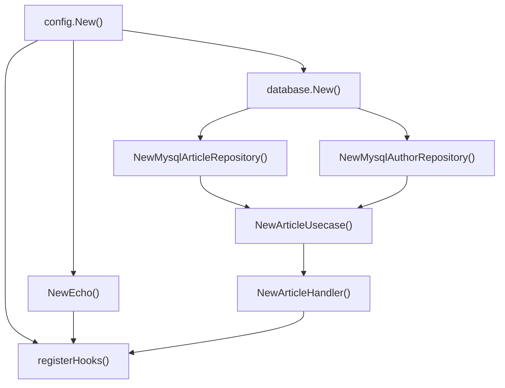

# 1. Introduction

As a Go application grows, assembling dependencies becomes complex. You have to call constructors one by one in `main()`, line up parameter orders, and manage the lifecycle yourself. uber/fx is a DI (Dependency Injection) framework for Go that solves this problem.

The scope of this article is as follows.

- Basic API: `fx.Provide`, `fx.Invoke`, `fx.Supply`, `fx.New`
- Lifecycle management: `fx.Lifecycle` (OnStart/OnStop)
- Grouping and extension patterns: `fx.Module`, `fx.Decorate`
- Multiple instances of the same type: `fx.Annotate` + `name:` / `group:` tags (`fx.Group`)
- Module encapsulation: `fx.Private`
- Testing strategies: `fxtest.New`, `fx.Replace`, `fx.Populate`

<!-- slides -->

# 2. fx Basics

## 2.1 Why DI Is Needed in Go

A real-world project with separated layers has many dependencies. For example, to construct an Article API, you must assemble the following dependencies in order.

```go
// Manual DI: assembled directly in main()
cfg, _ := config.New()
db, _ := database.New(cfg)

authorRepo := author.NewMysqlAuthorRepository(db)
articleRepo := article.NewMysqlArticleRepository(db)

timeout := time.Duration(cfg.Context.Timeout) * time.Second
articleUsecase := article.NewArticleUsecase(articleRepo, authorRepo, timeout)

e := NewEcho()
article.NewArticleHandler(e, articleUsecase)

e.Start(cfg.Server.Address)
```

As the number of dependencies grows, this code becomes dramatically more complex. Get the order wrong and you get a compile error, and every time you add a new service you have to modify main().

uber/fx solves this problem. It analyzes the **parameters and return types** of constructor functions to build the dependency graph automatically, and creates everything in the correct order.

```bash
go get go.uber.org/fx
```

## 2.2 fx Basic Concepts

Before diving in, here is an at-a-glance summary of the fx methods covered in this article. fx has many methods that are easy to confuse, so use the table below as a map while reading. The order of categories matches the article's flow (basics → extension → testing).

| Method | Category | Role | When/why to use | Introduced in |
|--------|------|------|-----------------|-----------|
| `fx.New` | Basic | Create the app container | The app's entry point. Gathers all `Provide`/`Invoke` calls and builds the dependency graph | — |
| `fx.Provide` | Basic | lazy registration (register in the graph by return type) | For registering most constructors (`NewXxx`). Defers execution until the value is actually needed | — |
| `fx.Invoke` | Basic | eager execution (side effects like starting the server, registering routes) | For code that must run at app startup. This is what actually assembles the lazy graph | — |
| `fx.Supply` | Basic | register a value directly without a constructor | For injecting an already-built value (config struct, constant, etc.) when there's no construction logic and `Provide` would be overkill | — |
| `fx.Lifecycle` | Lifecycle | manage startup/shutdown via OnStart/OnStop hooks | For resources whose setup and teardown come in pairs — server boot/shutdown, DB connection open/close | — |
| `fx.Module` | Extension | group dependencies by domain | When the app grows and `Provide` calls number in the dozens. Groups them by domain for reuse and isolation | v1.17+ |
| `fx.Decorate` | Extension | wrap an existing dependency (logging/caching/metrics) | When you want to layer cross-cutting concerns (logging/caching/metrics) onto an existing dependency without touching the original code | v1.18+ |
| `fx.Annotate` | Extension | attach metadata to a constructor (name/group/As) | When you want to keep a plain constructor as-is but add only metadata like name/group/As | — |
| `fx.In` / `fx.Out` | Extension | group parameters/return values into a struct for injection (name/group tag matching) | When there are many dependencies to inject, or you need to target a specific instance by name/group tag | — |
| `fx.ResultTags` + `name:` | Extension | identify the same type individually | When there are multiple instances of the same type (e.g. read/write DB) and you inject them distinguished by name | — |
| `group:` tag | Extension | collect implementations of the same interface into a slice | When you want to receive all implementations of the same interface at once as a slice, like plugins or handlers | — |
| `fx.Private` | Extension | encapsulate a dependency within a Module | When you want to hide a dependency used only inside a Module and not expose it to the outer graph | v1.20+ |
| `fxtest.New` | Testing | create a test-only app | For spinning up an fx app in tests. Reports failures via `t` and helps with cleanup | — |
| `fx.Replace` | Testing | replace an existing Provide with a Mock | For injecting a Mock/Stub in place of the real dependency to isolate a test | — |
| `fx.Populate` | Testing | extract an internal container instance into an external variable | For pulling out an assembled instance to verify it in a test (concisely, without an `Invoke` closure) | — |

It also helps to know what each method takes as arguments and what it returns. The key point is that **most fx functions return an `fx.Option`**, and `fx.New()` gathers those `Option`s to assemble the app.

| Method | Arguments (takes) | Returns |
|--------|-------------------|---------|
| `fx.New` | `opts ...fx.Option` (Provide/Invoke, etc.) | `*fx.App` |
| `fx.Provide` | `constructors ...interface{}` (constructor functions) | `fx.Option` |
| `fx.Invoke` | `funcs ...interface{}` (functions to run) | `fx.Option` |
| `fx.Supply` | `values ...interface{}` (already-built values) | `fx.Option` |
| `fx.Module` | `name string, opts ...fx.Option` | `fx.Option` |
| `fx.Decorate` | `decorators ...interface{}` (decorator functions) | `fx.Option` |
| `fx.Annotate` | `f interface{}, anns ...fx.Annotation` | `interface{}` (annotated constructor) |
| `fx.ResultTags` / `fx.ParamTags` | `tags ...string` | `fx.Annotation` |
| `fx.Replace` | `values ...interface{}` | `fx.Option` |
| `fx.Populate` | `targets ...interface{}` (pointers) | `fx.Option` |
| `fxtest.New` | `tb fxtest.TB, opts ...fx.Option` | `*fxtest.App` |

The table above covers only the function-style API. `fx.Lifecycle` (an interface), `fx.In` / `fx.Out` (structs to embed), and `name:` / `group:` (struct tags) are not functions and are explained separately in later sections.

In short, just remember two things: ① `Provide`, `Invoke`, `Supply`, `Module`, `Decorate`, `Replace`, and `Populate` all return an `fx.Option` that goes into `fx.New`'s arguments. ② `Annotate` and `ResultTags` return an `Annotation` (or an annotated constructor) used inside `Provide` and `Supply`.

The following sections cover each method one by one with hands-on examples. First, let's look at the most basic building blocks: `fx.Provide`, `fx.Invoke`, `fx.Supply`, and `fx.New`.

A constructor registered with `fx.Provide()` is not executed immediately. It is created **lazily** when the corresponding type is needed elsewhere.

```go
// fx_test.go
func TestFx_Provide_Invoke(t *testing.T) {
    var svc *UserService

    app := fxtest.New(t,
        // fx.Provide: only registers the constructor. It is not run immediately; it is called lazily when needed as a dependency.
        fx.Provide(
            NewLogger,       // returns the Logger interface
            NewMysqlUserRepo, // returns the UserRepository interface (needs Logger)
            NewUserService,   // returns *UserService (needs UserRepository)
        ),
        // fx.Invoke: a side effect run immediately at app startup. Here it pulls the assembled UserService into an external variable.
        fx.Invoke(func(s *UserService) {
            svc = s
        }),
    )
    defer app.RequireStop()
    app.RequireStart()

    assert.Equal(t, "user-1", svc.repo.FindByID(1))
}
```

`fx.Supply()` provides an already-built value directly, without a constructor.

```go
// fx_test.go
type Config struct {
    DBHost string
    DBPort int
}

cfg := &Config{DBHost: "localhost", DBPort: 3306}

app := fxtest.New(t,
    fx.Supply(cfg), // register the value directly without a constructor
    fx.Invoke(func(c *Config) {
        // c.DBHost == "localhost"
    }),
)
```

## 2.3 Applying fx to a Real Project

Converting the manual DI code to fx looks like this.

```go
// cmd/main.go
app := fx.New(
    fx.Provide(
        config.New,              // *config.Config
        database.New,            // *sql.DB (needs *config.Config)
        NewEcho,                 // *echo.Echo
        ProvideBasicConfig,      // time.Duration

        article.NewArticleHandler,         // Handler (needs Echo, UseCase)
        article.NewArticleUsecase,         // UseCase (needs Repo, AuthorRepo, Duration)
        article.NewMysqlArticleRepository, // Repository (needs DB)

        author.NewMysqlAuthorRepository,   // AuthorRepo (needs DB)
    ),
    fx.Invoke(registerHooks),  // start the server
)
```

fx looks at each constructor's parameter types to determine the dependency order automatically. For example, `database.New(cfg *config.Config)` needs a `*config.Config`, so `config.New()` is called first.

Looking at each constructor's signature, the dependency relationships are clear.

```go
// pkg/config/config.go
func New() (*config.Config, error) { ... }

// pkg/database/db.go
func New(cfg *config.Config) (*sql.DB, error) { ... }

// article/usecase.go
func NewArticleUsecase(
    a domain.ArticleRepository,
    ar domain.AuthorRepository,
    timeout time.Duration,
) domain.ArticleUsecase { ... }

// article/handler.go
func NewArticleHandler(e *echo.Echo, us domain.ArticleUsecase) *ArticleHandler { ... }
```

`fx.Provide()` accepts not only predefined constructors like the ones above but also **anonymous functions** directly. For simple conversion logic, it's convenient to handle it inline rather than creating a separate constructor file. Expanding the `ProvideBasicConfig` above into an anonymous function looks like this.

```go
// cmd/main.go
app := fx.New(
    fx.Provide(
        config.New,
        database.New,
        NewEcho,

        // an anonymous function can be registered as a constructor too — only the parameters and return type need to match
        func(cfg *config.Config) time.Duration {
            return time.Duration(cfg.Context.Timeout) * time.Second
        },

        article.NewArticleHandler,
        article.NewArticleUsecase,
        article.NewMysqlArticleRepository,
        author.NewMysqlAuthorRepository,
    ),
    fx.Invoke(registerHooks),
)
```

Just like a named constructor, fx analyzes the anonymous function's parameters (`*config.Config`) and return type (`time.Duration`) and wires it into the dependency graph. Only the form of the function differs; from fx's perspective it's the same constructor.

Visualizing the dependency graph that fx builds from the constructors registered this way looks like this.



fx builds this graph automatically using only the constructors' parameters and return types. If there is a circular dependency, it prints a clear error message at app startup.

## 2.4 Lifecycle Management

`fx.Lifecycle` manages app startup and shutdown. You start the server in `OnStart` and handle graceful shutdown in `OnStop`.

```go
// cmd/main.go
func registerHooks(lifecycle fx.Lifecycle, e *echo.Echo, cfg *config.Config) {
    lifecycle.Append(
        fx.Hook{
            OnStart: func(context.Context) error {
                fmt.Println("Starting server")
                go e.Start(cfg.Server.Address)
                return nil
            },
            OnStop: func(context.Context) error {
                fmt.Println("Stopping server")
                return nil
            },
        },
    )
}
```

`registerHooks` is registered with `fx.Invoke()`. One thing to watch out for is the **timing of execution**. `fx.Invoke` (and `fx.Populate`, which uses it internally) runs immediately at the **time `fx.New()` is called**, not at `app.Start()`. So the `registerHooks` above is called during the `fx.New()` step and only *registers* the OnStart/OnStop hooks on the `Lifecycle`; the actual server boot (the body of `OnStart`) is triggered later at `app.Start(ctx)`. This is why `fx.Lifecycle` has this two-phase structure — register the hooks early via Invoke, and defer running the hook bodies until `Start`.

| Phase | Timing | What runs |
|------|------|------------|
| 1 | `fx.New()` / `fxtest.New()` | the body of the `fx.Invoke` function (= `fx.Populate` is also filled here), *registration* of Lifecycle hooks |
| 2 | `app.Start(ctx)` | the registered `OnStart` hooks run (server boot, etc.) |
| 3 | `app.Stop(ctx)` | the registered `OnStop` hooks run (graceful shutdown) |

```go
// fx_test.go
func TestFx_Lifecycle(t *testing.T) {
    var startCalled, stopCalled bool

    app := fxtest.New(t,
        fx.Invoke(func(lc fx.Lifecycle) {
            lc.Append(fx.Hook{
                OnStart: func(context.Context) error {
                    startCalled = true
                    return nil
                },
                OnStop: func(context.Context) error {
                    stopCalled = true
                    return nil
                },
            })
        }),
    )

    app.RequireStart()
    assert.True(t, startCalled)

    app.RequireStop()
    assert.True(t, stopCalled)
}
```

# 3. Extension Patterns

From fx.Module to fx.Private, let's look at the extension tools that build on top of the fx basics.

## 3.1 The fx.Module Pattern

`fx.Module()` groups related dependencies by domain. As the app grows, listing all constructors together in `fx.Provide()` hurts readability. Splitting them into Modules makes concerns clearer.

```go
// fx_test.go
var UserModule = fx.Module("user",
    fx.Provide(
        NewMysqlUserRepo,
        NewUserService,
    ),
)

var OrderModule = fx.Module("order",
    fx.Provide(
        NewMysqlOrderRepo,
        NewOrderService,
    ),
)

app := fxtest.New(t,
    fx.Provide(NewLogger), // shared dependency
    UserModule,
    OrderModule,
    fx.Invoke(func(u *UserService, o *OrderService) {
        // all dependencies are wired automatically
    }),
)
```

In real projects, a common pattern is to define a Module variable in each domain package and compose them in main().

```go
// real-world application example
app := fx.New(
    fx.Provide(config.New, database.New, NewEcho),
    article.Module,   // article domain module
    author.Module,    // author domain module
    payment.Module,   // payment domain module
    fx.Invoke(registerHooks),
)
```

> **fx.Module is available from v1.17.0+**. In earlier versions, you can do similar grouping with `fx.Options()`, but it does not support module names or scope isolation.

## 3.2 The fx.Decorate Pattern

`fx.Decorate()` wraps an existing dependency to add behavior. It's the same concept as the decorator pattern, used for logging, caching, metrics collection, and so on.

```go
// fx_test.go
// logging decorator: wraps the existing UserRepository
type loggingUserRepo struct {
    inner  UserRepository
    logger Logger
    calls  []string
}

func (r *loggingUserRepo) FindByID(id int) string {
    r.calls = append(r.calls, fmt.Sprintf("FindByID(%d)", id))
    return r.inner.FindByID(id) // call the original
}

app := fxtest.New(t,
    fx.Provide(NewLogger, NewMysqlUserRepo, NewUserService),
    // replace the existing UserRepository with a logging wrapper
    fx.Decorate(func(repo UserRepository, logger Logger) UserRepository {
        return &loggingUserRepo{inner: repo, logger: logger}
    }),
    fx.Invoke(func(svc *UserService) {
        svc.repo.FindByID(1) // called through the logging wrapper
    }),
)
```

`fx.Decorate()` takes the original dependency as a parameter and returns a new wrapped instance. UserService receives the wrapped Repository automatically, with no changes.

> **fx.Decorate is available from v1.18.0+**.

## 3.3 fx.Annotate + Named Dependencies

When you need to distinguish multiple instances of the same type, use `fx.Annotate()` and the `name` tag. A typical case is separating Read/Write DBs.

```go
// fx_test.go
type DBConnection struct {
    Name string
    DSN  string
}

func NewReadDB() *DBConnection {
    return &DBConnection{Name: "read", DSN: "read-replica:3306"}
}

func NewWriteDB() *DBConnection {
    return &DBConnection{Name: "write", DSN: "primary:3306"}
}
```

Use `fx.Annotate()` to give each constructor a name.

```go
// fx_test.go
fx.Provide(
    fx.Annotate(NewReadDB, fx.ResultTags(`name:"readDB"`)),
    fx.Annotate(NewWriteDB, fx.ResultTags(`name:"writeDB"`)),
    NewDBService,
)
```

On the receiving side, match by `name` tag in an `fx.In` struct. `fx.In` is an embedded marker that lets you inject multiple dependencies bundled into a single parameter struct. Use it when a constructor takes many parameters, or when — as here — you need to target a specific instance via a `name` or `group` tag. Embedding `fx.In` in a struct tells fx to treat each field as an individual dependency and fill it in (conversely, use `fx.Out` to bundle return values into a struct).

```go
// fx_test.go
type DBParams struct {
    fx.In
    ReadDB  *DBConnection `name:"readDB"`
    WriteDB *DBConnection `name:"writeDB"`
}

func NewDBService(params DBParams) *DBService {
    return &DBService{
        readDB:  params.ReadDB,  // read-replica:3306
        writeDB: params.WriteDB, // primary:3306
    }
}
```

## 3.4 Collecting Multiple Implementations of the Same Interface with fx.Group

The `name:` tag is for identifying the same type **individually**. But if you want to inject multiple implementations of the same interface all at once — for example, sending a notification to every Notifier — `name:` is not enough, because you'd have to give each implementation a different name and receive them one by one on the receiving side.

The `group:` tag solves this problem. Implementations registered in the same group are injected together as a slice.

```go
// fx_test.go
type Notifier interface {
    Send(msg string) string
}

type EmailNotifier struct{}
func (e *EmailNotifier) Send(msg string) string { return "email:" + msg }

type SlackNotifier struct{}
func (s *SlackNotifier) Send(msg string) string { return "slack:" + msg }

type SMSNotifier struct{}
func (s *SMSNotifier) Send(msg string) string { return "sms:" + msg }
```

Use `fx.Annotate()` and `fx.ResultTags()` to register each constructor in the same group.

```go
// fx_test.go
fx.Provide(
    fx.Annotate(func() Notifier { return &EmailNotifier{} },
        fx.ResultTags(`group:"notifiers"`)),
    fx.Annotate(func() Notifier { return &SlackNotifier{} },
        fx.ResultTags(`group:"notifiers"`)),
    fx.Annotate(func() Notifier { return &SMSNotifier{} },
        fx.ResultTags(`group:"notifiers"`)),
    NewNotifierService,
)
```

The receiving side takes it as a slice field with a `group:` tag in an `fx.In` struct.

```go
// fx_test.go
type NotifierParams struct {
    fx.In
    Notifiers []Notifier `group:"notifiers"`
}

type NotifierService struct {
    notifiers []Notifier
}

func NewNotifierService(p NotifierParams) *NotifierService {
    return &NotifierService{notifiers: p.Notifiers}
}
```

A representative real-world use is collecting multiple external service clients into a single interface slice. Even when a new implementation is added, the receiving-side code does not change.

To summarize the difference between `name:` and `group:`:

| Pattern | Use | Receiving side |
|------|------|---------|
| `name:"X"` | identify the same type **individually** | single field |
| `group:"Y"` | **collect** the same type (or interface) | slice field |

## 3.5 Encapsulating a Module with fx.Private

Even if you split domains with `fx.Module()`, every `fx.Provide()` is exposed globally by default. For a dependency you want to use only inside a Module, you can block exposure with `fx.Private`. It's useful for preventing another Module from accidentally sharing the same instance of an infrastructure dependency such as a database handle or external API client.

When you place `fx.Private` inside the same `fx.Provide()` call alongside other constructors, it makes that entire group Module-private.

```go
// fx_test.go
type internalDB struct {
    name string
}

func newInternalDB() *internalDB {
    return &internalDB{name: "private-db"}
}

type ModuleService struct {
    db *internalDB
}

func newModuleService(db *internalDB) *ModuleService {
    return &ModuleService{db: db}
}

PrivateModule := fx.Module("private",
    fx.Provide(
        newInternalDB,
        fx.Private,        // makes the entire fx.Provide() group Module-internal
    ),
    fx.Provide(newModuleService), // ModuleService is exposed externally
)
```

`*internalDB` can only be injected into `newModuleService` inside `PrivateModule`. If you request `*internalDB` directly from outside the Module, fx returns an error when constructing the dependency graph (`fx.Populate` is covered in 4.3).

```go
// fx_test.go
// attempting to extract *internalDB directly from outside → fx.New returns an error
var leaked *internalDB
leakApp := fx.New(
    PrivateModule,
    fx.Populate(&leaked),
    fx.NopLogger,
)
// leakApp.Err() != nil
```

> **fx.Private is available from v1.20.0+**. In earlier versions, even with `fx.Module` isolation, all Provides are registered in the global graph.

# 4. Testing Strategies

An app built with fx is tested with the `fxtest` package. We'll also look at mock injection and instance extraction.

## 4.1 fxtest.New

`fxtest.New()` creates a test-only app. It cleans up automatically on test failure, and fx logs are included in the test output.

```go
// fx_test.go
app := fxtest.New(t,
    fx.Provide(NewLogger, NewMysqlUserRepo, NewUserService),
    fx.Invoke(func(svc *UserService) { ... }),
)
defer app.RequireStop()
app.RequireStart()
```

## 4.2 Injecting a Mock with fx.Replace

`fx.Replace()` completely replaces an existing Provide. It's useful for injecting a Mock instead of the real implementation in a test.

```go
// fx_test.go
type mockUserRepo struct{}

func (r *mockUserRepo) FindByID(id int) string {
    return fmt.Sprintf("mock-user-%d", id) // Mock response
}

app := fxtest.New(t,
    fx.Provide(NewLogger, NewMysqlUserRepo, NewUserService),
    // replace the real UserRepository with a Mock
    fx.Replace(fx.Annotate(&mockUserRepo{}, fx.As(new(UserRepository)))),
    fx.Invoke(func(svc *UserService) {
        result := svc.repo.FindByID(1)
        // result == "mock-user-1"
    }),
)
```

`fx.As(new(UserRepository))` registers `*mockUserRepo` after type-converting it to the `UserRepository` interface.

## 4.3 Extracting an Instance with fx.Populate

So far we've captured instances into external variables in the `fx.Invoke(func(s *Svc) { svc = s })` form. `fx.Populate` does the same thing more concisely.

In fact, `fx.Populate` is a convenience function implemented internally with `fx.Invoke`. `fx.Populate(&svc)` is equivalent to automatically generating "an `fx.Invoke` that assigns the injected value to `svc`." In other words, the two are essentially the same. The difference is in **purpose**. `fx.Invoke` exists to *do something* with the pulled-out dependency, so you can call, verify, or do anything in the closure body (extraction is just one of those things); `fx.Populate` exists for *extraction itself*, so it omits the closure when it would just be boilerplate.

Comparing the two methods:

| Aspect | `fx.Invoke` | `fx.Populate` |
|------|-------------|---------------|
| Essence | **runs** a function | **fills** a variable |
| What you pass | a function (closure) | a pointer |
| Body | yes — assign, call, verify, anything | none — extraction only |
| Extraction | possible as a side effect via `svc = s` in the closure | that is its sole purpose |

```go
// fx_test.go
// Approach 1: capture via an fx.Invoke closure (the approach used earlier)
var svc1 *UserService
app1 := fxtest.New(t,
    fx.Provide(NewLogger, NewMysqlUserRepo, NewUserService),
    fx.Invoke(func(s *UserService) {
        svc1 = s
    }),
)

// Approach 2: extract directly with fx.Populate
var svc2 *UserService
app2 := fxtest.New(t,
    fx.Provide(NewLogger, NewMysqlUserRepo, NewUserService),
    fx.Populate(&svc2),
)
```

The difference is even more pronounced when extracting multiple instances at once.

```go
// fx_test.go
var (
    svc    *UserService
    logger Logger
)
app := fxtest.New(t,
    fx.Provide(NewLogger, NewMysqlUserRepo, NewUserService),
    fx.Populate(&svc, &logger),
)
```

The selection guide is simple.

| Situation | Recommended |
|------|------|
| The goal is to pull an instance into an external variable | `fx.Populate` |
| Perform a function call or additional verification at the same point after extraction | `fx.Invoke` |

# 5. Quiz

If you've read this far, these are questions you can answer. Pick an answer and the explanation shows up right away.

```quiz
- type: code
  q: "What happens when you run this app?"
  lang: go
  code: |
    app := fx.New(
        fx.Provide(NewLogger, NewMysqlUserRepo, NewUserService),
    )
    app.Run()
  choices: ["Every registered constructor is called in order", "No constructor is ever called", "Only NewUserService is called", "It fails to compile"]
  answer: 1
  explain: "fx.Provide only registers and defers execution — it is lazy. For the graph to be assembled, something has to demand those types, and fx.Invoke is that starting point. With no Invoke handling side effects (server boot, route registration), no constructor is ever called. (2.2)"

- type: mcq
  q: "What is the difference between fx.Provide and fx.Supply?"
  choices: ["Provide registers a value, and Supply registers a constructor function", "Provide registers a constructor function that fx wires into the graph by its return type, while Supply registers an already-built value as is", "Both register constructors, but only Supply runs immediately", "Supply can register only interfaces and Provide only structs"]
  answer: 1
  explain: "Provide registers a constructor function, and fx wires it into the graph based on that function's return type. Supply registers an already-built value as is. For values with no construction logic — config structs, constants — Supply is the right fit. (2.2)"

- type: mcq
  q: "How does fx decide the order in which constructors are called?"
  choices: ["In the order they were registered with fx.Provide", "By analyzing each constructor's parameter types and return type", "Alphabetically by constructor name", "In the order they are listed in fx.Invoke"]
  answer: 1
  explain: "It looks only at each constructor's parameter types and return type. database.New(cfg *config.Config) requires *config.Config, so config.New(), which returns that type, is called first. Registration order does not matter, and a circular dependency is reported as an error at app startup. (2.3)"

- type: mcq
  q: "You registered registerHooks with fx.Invoke. When exactly does the server start?"
  choices: ["Immediately when fx.New() is called", "When fx.Provide calls the server constructor", "When app.Start(ctx) is called and the OnStart hook runs", "The moment the Invoke body of registerHooks runs"]
  answer: 2
  explain: "It splits into two points. The Invoke function body runs immediately when fx.New() is called, but all it does there is register hooks on the Lifecycle. The OnStart body (the actual server boot) runs later, when app.Start(ctx) is called. That is precisely why fx.Lifecycle has this two-stage structure. (2.4)"

- type: blank
  q: "Even after splitting domains into fx.Module, the fx.Provide calls inside are exposed to the global graph by default. To hide one for module-internal use only, put ___ in the same fx.Provide() group."
  answer: ["fx.Private", "Private"]
  explain: "fx.Module only names and groups things — the fx.Provide calls inside it are still exposed to the global graph by default. To hide a dependency for module-internal use only, put fx.Private in the same fx.Provide() group. Then requesting that type from outside fails while the graph is being built. (3.1, 3.5)"

- type: blank
  q: "To add logging without touching a single line of the existing Repository code, take the original dependency as a parameter and return a wrapped value of the same type using ___."
  answer: ["fx.Decorate", "Decorate"]
  explain: "That's fx.Decorate. Take the original dependency as a parameter and return a wrapped value of the same type, and fx swaps that node in the graph. Whatever injects this dependency (UserService) receives the wrapper with no code changes. (3.2)"

- type: blank
  q: "To keep a read and a write connection of the same *DBConnection type apart, give each constructor a ___ tag (e.g. readDB) via fx.Annotate and fx.ResultTags, and match it on the receiving fx.In struct field."
  answer: ["name", "name:"]
  explain: "Use fx.Annotate with fx.ResultTags to give each constructor a name tag (e.g. name:readDB), and on the receiving side match it with a name tag on a field of a struct that embeds fx.In. Even with identical types, the names keep them apart. (3.3)"

- type: ox
  q: "Injecting all three Notifier implementations at once is only possible with the group: tag and is entirely impossible with the name: tag."
  answer: false
  explain: "The name: tag can do it too. But you would have to name each implementation and receive them field by field, so every new implementation forces a change on the receiving side — the wrong tool. Register them with group:notifiers and receive a []Notifier slice field carrying the same tag; then adding an implementation leaves the receiving code untouched. (3.4)"

- type: mcq
  q: "You want a Mock instead of the real Repository in a test. Why isn't fx.Replace(&mockUserRepo{}) enough on its own?"
  choices: ["Because fx.Replace cannot be used in tests", "Because the type of &mockUserRepo{} is *mockUserRepo, not the UserRepository interface, so it does not match", "Because you must first delete the existing fx.Provide before fx.Replace", "Because a Mock can only be injected with fx.Supply"]
  answer: 1
  explain: "fx matches by type, and the type of &mockUserRepo{} is *mockUserRepo, not the UserRepository interface. Wrap it as fx.Annotate(&mockUserRepo{}, fx.As(new(UserRepository))) so it is registered under the interface type; only then does it replace the existing Provide. (4.2)"

- type: mcq
  q: "To pull an assembled instance out in a test, do you use fx.Invoke or fx.Populate?"
  choices: ["Use fx.Populate if the only goal is to store the value in a variable; use fx.Invoke if you need to call or verify something at the same point after extracting it", "They are entirely different features, so fx.Populate cannot pull an instance out at all"]
  answer: 0
  explain: "fx.Populate is a convenience function implemented on top of fx.Invoke, so they are the same underneath; the difference is intent. If the only goal is to store the value in a variable, the closure is dead weight, so use Populate. If you need to call or verify something at the same point after extracting it, Invoke gives you a body to do that. (4.3)"
```

# 6. Wrapping Up

fx has many methods and is easy to confuse. Here's a summary of what to choose in each situation.

| What you want to do | Method | Tip for choosing |
|------------|--------|--------|
| Register a dependency in the graph (created lazily later) | `fx.Provide` | not immediate — called when needed |
| Run immediately at app startup (server boot, route registration) | `fx.Invoke` | if confused with `Provide`, "if it's a side effect, use Invoke" |
| Inject an already-built value/config without a constructor | `fx.Supply` | suitable for constants and config values |
| Manage startup/shutdown hooks (graceful shutdown) | `fx.Lifecycle` | register with `Append` inside `Invoke` |
| Group dependencies by domain | `fx.Module` | split a grown `Provide` list |
| Add logging/caching to an existing dependency | `fx.Decorate` | wrap without modifying the original code |
| Identify the same type **individually** (read/write DB) | `fx.Annotate` + `name:` | receiving side is a single field |
| Inject implementations of the same interface **collected together** | `group:` tag | receiving side is a slice field |
| Hide a Module's internal dependency from the outside | `fx.Private` | isolate infrastructure handles |
| Use a Mock instead of the real implementation in tests | `fx.Replace` | match the interface with `fx.As` |
| Pull a container's internal instance out in tests | `fx.Populate` | if verifying at the same time, use `fx.Invoke` |

Remember just one thing. You don't need to manage every dependency with fx. Simple value objects and utilities are clearer to create directly, and fx shines most when you focus it on **components that need lifecycle management** (DB connections, HTTP servers, external clients). Because it's reflection-based, you give up some compile-time type safety, but its detailed runtime error messages and real-world productivity more than make up for it.

The full source is available in the following two places.

- Per-method learning examples (the `// fx_test.go` code in this article): [golang/third-party/fx](https://github.com/kenshin579/tutorials-go/tree/master/golang/third-party/fx)
- Real-world application example (Clean Architecture + fx, the `// cmd/main.go` code): [project-layout/go-clean-arch-v2](https://github.com/kenshin579/tutorials-go/tree/master/project-layout/go-clean-arch-v2)

# 7. References

- [uber/fx Official Docs](https://uber-go.github.io/fx/)
- [uber/fx GitHub](https://github.com/uber-go/fx)
- [uber/dig GitHub](https://github.com/uber-go/dig)
- [fx.Module introduced (v1.17)](https://github.com/uber-go/fx/releases/tag/v1.17.0)
- [fx.Decorate introduced (v1.18)](https://github.com/uber-go/fx/releases/tag/v1.18.0)
- [Go Dependency Injection - uber/fx](https://pkg.go.dev/go.uber.org/fx)
- [Value Groups (fx Docs)](https://uber-go.github.io/fx/value-groups/)
- [fx.Private introduced (v1.20)](https://github.com/uber-go/fx/releases/tag/v1.20.0)
- [fx.Populate API](https://pkg.go.dev/go.uber.org/fx#Populate)
