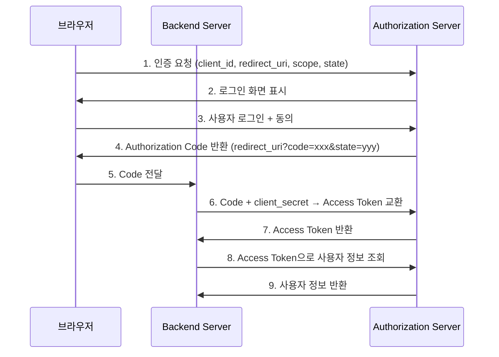
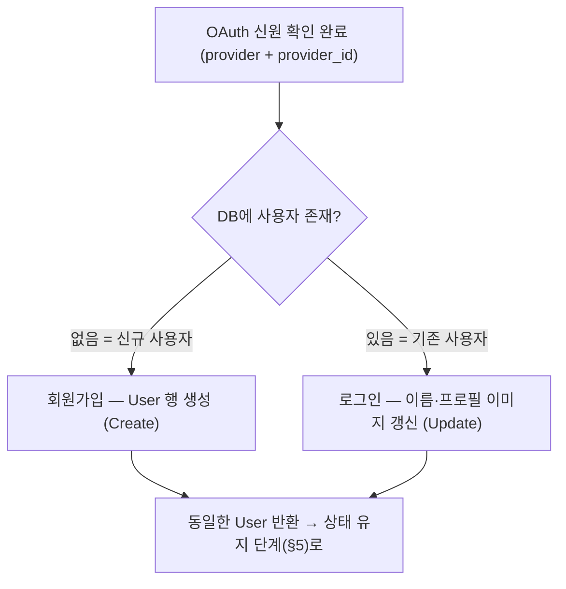
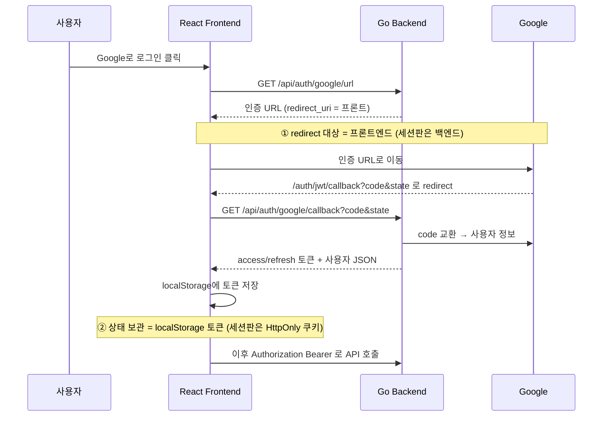
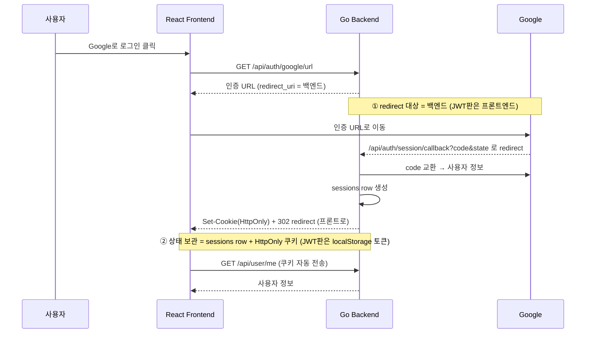
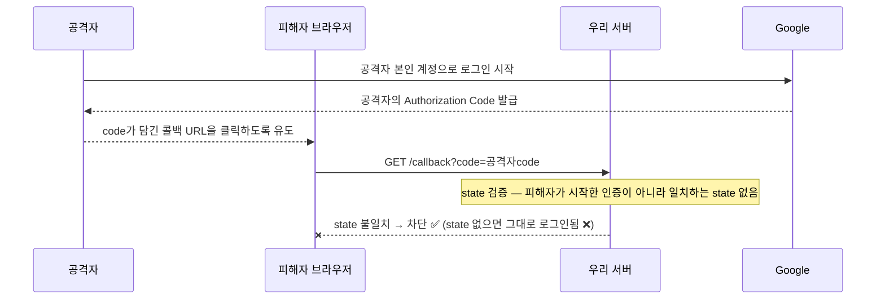
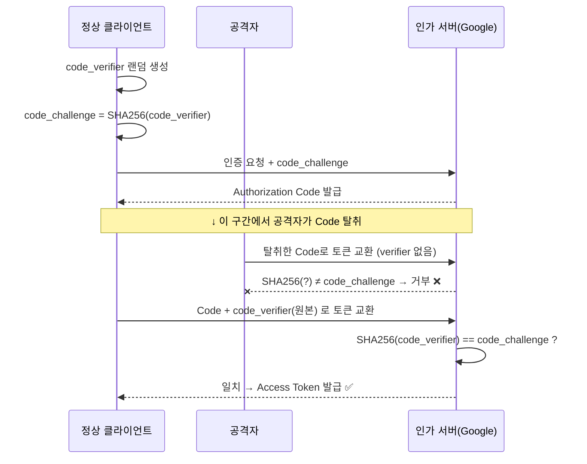
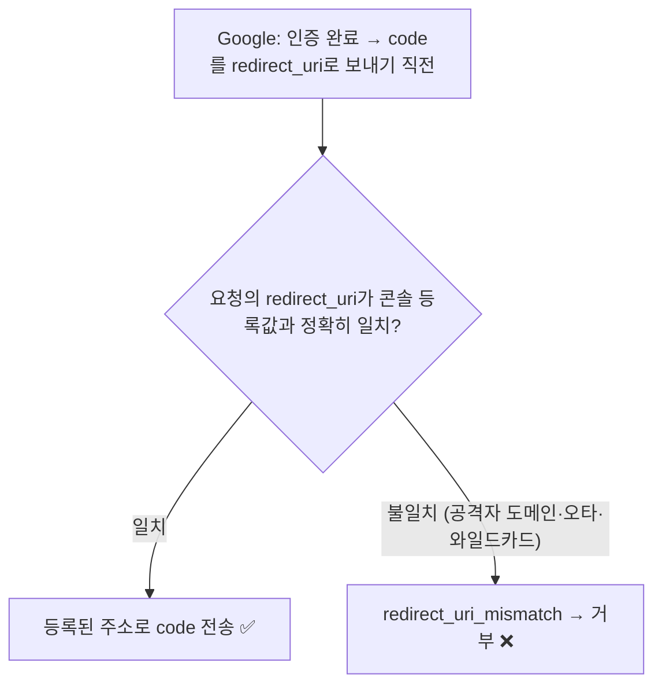

# 1. 들어가며

웹 서비스를 만들 때 회원가입/로그인 기능은 거의 필수이다. 하지만 직접 비밀번호를 관리하려면 해싱, 솔팅(비밀번호마다 무작위 값을 덧붙여 해싱해 같은 비밀번호라도 다른 해시값이 나오게 하는 기법), 비밀번호 재설정 등 신경 쓸 것이 많다. 사용자 입장에서도 서비스마다 새 계정을 만드는 것은 번거롭다.

**SNS 로그인(소셜 로그인)** 을 도입하면 이런 문제를 한 번에 해결할 수 있다:

- **보안 위임**: 비밀번호를 직접 저장하지 않고 Google, GitHub 같은 검증된 서비스에 인증을 맡긴다
- **UX 개선**: 클릭 한 번으로 로그인 완료
- **개발 부담 감소**: 비밀번호 관리 로직이 필요 없다

여기서 한 가지 중요한 점을 미리 짚고 가자. **OAuth(신원 위임)와 로그인 이후의 "상태 유지 방식"은 서로 별개의 문제이다.** OAuth는 "이 사용자가 누구인지"를 Google에 위임해 확인하는 과정이고, 그 확인이 끝난 뒤 "이 사용자가 로그인 상태임을 어떻게 계속 기억할 것인가"는 또 다른 설계 결정이다. 상태 유지 방식에는 크게 **JWT(무상태 토큰)** 와 **세션(서버 상태)** 두 가지가 있으며, 둘은 트레이드오프가 다르다.

| 구분 | JWT (무상태 토큰) | 세션 (서버 상태) |
|------|------------------|-----------------|
| **상태 저장 위치** | 클라이언트(토큰 자체에 정보 포함) | 서버(DB·Redis 등 세션 스토어) |
| **검증 방식** | 서명 검증만으로 즉시 확인 | 매 요청마다 세션 스토어 조회 |
| **즉시 무효화(로그아웃·강제 차단)** | 어려움(만료 전까지 유효) | 쉬움(세션 행 삭제로 즉시) |
| **탈취 시 영향** | 만료까지 유효, 회수 어려움 | 즉시 회수 가능 |
| **저장 위치 보안** | localStorage(XSS 주의) | HttpOnly 쿠키 |
| **수평 확장(scale-out)** | 유리(공유 상태 불필요) | 세션 스토어 공유 필요 |
| **적합한 경우** | FE/BE 분리·MSA·무상태 API | 단일/소규모·즉시 무효화 중요 |

간단히 정리하면, **여러 서비스로 수평 확장하거나 모바일 등 다양한 클라이언트에 무상태 API를 제공한다면 JWT**가, **단일/소규모 백엔드에서 "로그아웃 즉시 차단"이나 "특정 사용자 강제 로그아웃" 같은 서버측 즉시 무효화가 중요하다면 세션**이 잘 맞는다.

> **OAuth = JWT가 아니다.** SNS 로그인이나 SPA를 만든다고 해서 반드시 JWT를 써야 하는 것은 아니다. 오히려 단일 백엔드 + 웹 프론트라면 서버 세션이 더 단순하고, 즉시 로그아웃 같은 요구사항도 자연스럽게 충족한다. OAuth는 신원 위임이고, JWT/세션은 그 이후 상태 유지 방식 중 하나의 선택지일 뿐이다.

이 글에서는 **Go(Echo) 백엔드 + React 프론트엔드** 조합으로 Google OAuth 2.0 로그인을 처음부터 구현한다. OAuth 공통 흐름을 한 번 설명한 뒤, 상태 유지 방식을 **① JWT 버전**과 **② 세션 버전** 두 가지로 나눠 각각 구현하고 비교한다.

OAuth 프로토콜 자체의 표준 흐름은 §2.2에서, 실제 redirect 경로(프론트 vs 백엔드)는 버전별로 다르므로 JWT는 §5.1.1, 세션은 §5.2.1의 시퀀스 다이어그램에서 각각 확인한다.

> 전체 소스 코드는 두 저장소에서 확인할 수 있다.
> - JWT(무상태) 버전: [web/sns-login-jwt](https://github.com/kenshin579/tutorials-go/tree/master/web/sns-login-jwt)
> - 세션(서버 상태) 버전: [web/sns-login-session](https://github.com/kenshin579/tutorials-go/tree/master/web/sns-login-session)

# 2. OAuth 2.0 핵심 개념

## 2.1 OAuth 2.0이란?

OAuth 2.0은 **제3자 애플리케이션이 사용자의 리소스에 접근할 수 있도록 권한을 위임하는 표준 프로토콜**이다. 여기서 두 가지 개념을 구분해야 한다:

| 개념 | 설명 | 예시 |
|------|------|------|
| **인증(Authentication)** | "너는 누구인가?" — 신원 확인 | 로그인 |
| **인가(Authorization)** | "너는 무엇을 할 수 있는가?" — 권한 확인 | API 접근 허가 |

OAuth 2.0은 원래 **인가** 프로토콜이지만, OpenID Connect(OIDC)를 함께 사용하면 **인증**까지 처리할 수 있다. Google OAuth는 OIDC를 기본으로 지원한다.

### OAuth 2.0의 4가지 역할

| 역할 | 설명 | 이 프로젝트에서 |
|------|------|----------------|
| **Resource Owner** | 리소스 소유자 (사용자) | Google 계정을 가진 사용자 |
| **Client** | 리소스에 접근하려는 애플리케이션 | Go Backend |
| **Authorization Server** | 인증/인가를 처리하는 서버 | Google OAuth 서버 |
| **Resource Server** | 보호된 리소스를 제공하는 서버 | Google UserInfo API |

## 2.2 Authorization Code Flow

OAuth 2.0에는 여러 인증 방식(Grant Type)이 있다. 웹 애플리케이션에서는 **Authorization Code Flow**를 사용한다.

| Grant Type | 사용 환경 | 보안 수준 |
|-----------|----------|----------|
| **Authorization Code** | 서버 사이드 웹 앱 | 높음 (서버에서 Code → Token 교환) |
| Implicit | SPA (더 이상 권장하지 않음) | 낮음 (Token이 URL에 노출) |
| Client Credentials | 서버 간 통신 (사용자 없음) | 높음 |
| Resource Owner Password | 신뢰할 수 있는 자체 앱 | 낮음 (비밀번호 직접 전달) |

Authorization Code Flow의 핵심은 **Authorization Code를 중간 매개체로 사용**한다는 것이다. 브라우저에는 일회성 Code만 노출되고, 실제 Access Token은 백엔드 서버에서 안전하게 교환한다.



OAuth 흐름에는 `state`, PKCE, Redirect URI 검증 같은 보안 요소가 함께 따라온다. 다만 이들은 흐름을 한 번 구현해 본 뒤에 보는 편이 이해가 빠르므로, **구현을 모두 마친 §6(보안 심화)에서 한데 모아** 다룬다.

# 3. Google Cloud Console 설정

실제 구현에 앞서 Google Cloud Console에서 OAuth 클라이언트를 생성해야 한다.

## 3.1 프로젝트 생성

1. [Google Cloud Console](https://console.cloud.google.com/)에 접속한다
2. 상단의 프로젝트 선택기에서 **새 프로젝트**를 클릭한다
3. 프로젝트 이름을 입력하고 **만들기**를 클릭한다


## 3.2 OAuth 동의 화면 구성

1. 왼쪽 메뉴에서 **API 및 서비스 > OAuth 동의 화면**을 선택한다
2. User Type: **외부**를 선택한다
3. 앱 이름, 사용자 지원 이메일을 입력한다
4. 범위(Scope)에서 `openid`, `email`, `profile`을 추가한다


> **테스트 사용자 등록**: 앱이 "테스트 중" 상태인 외부 앱은 **콘솔에 등록한 테스트 사용자만 로그인**할 수 있다. 등록하지 않은 계정으로 로그인하면 `403 access_denied`가 발생하므로, **대상(Audience) > 테스트 사용자**에 본인 Google 계정을 추가해 둔다.
>
> 

## 3.3 OAuth 2.0 클라이언트 ID 생성

1. **API 및 서비스 > 사용자 인증 정보**에서 **사용자 인증 정보 만들기 > OAuth 클라이언트 ID**를 선택한다
2. 애플리케이션 유형: **웹 애플리케이션**
3. 승인된 리다이렉션 URI에 **두 개**를 모두 추가한다:
   - `http://localhost:3000/auth/jwt/callback` — **JWT 버전(SPA 토큰 플로우)** 용
   - `http://localhost:8080/api/auth/session/callback` — **세션 버전(서버 redirect 플로우)** 용
4. **만들기**를 클릭하면 **Client ID**와 **Client Secret**이 발급된다


생성하면 **Client ID**와 **Client Secret**이 발급된다.


> **왜 redirect URI가 두 개인가?** 이 글은 같은 OAuth 클라이언트를 두 구현이 함께 쓴다. Google은 인증이 끝난 뒤 **redirect URI로 Authorization Code를 돌려보내는데, 그 목적지가 두 플로우에서 다르다.**
>
> - **JWT 버전(SPA 토큰 플로우)**: Google이 **프론트엔드 라우트**(`http://localhost:3000/auth/jwt/callback`)로 redirect한다. 프론트가 URL에서 `code`를 꺼내 백엔드 API로 다시 전달한다.
> - **세션 버전(서버 redirect 플로우)**: Google이 **백엔드 콜백 엔드포인트**(`http://localhost:8080/api/auth/session/callback`)로 직접 redirect한다. 백엔드가 그 자리에서 쿠키를 설정하고 프론트로 다시 보낸다.
>
> 각 버전은 자신에게 맞는 한 개의 URI만 사용하지만, 두 버전을 모두 실습하려면 콘솔에 둘 다 등록해 둬야 한다.

> Client Secret은 절대 클라이언트(브라우저)에 노출하면 안 된다. 반드시 백엔드 환경변수로 관리한다.

# 4. 공통 구현 (두 버전 동일)

JWT 버전과 세션 버전은 **OAuth code 교환과 회원가입까지 완전히 동일**하다. 차이는 "인증이 끝난 뒤 상태를 어떻게 유지하느냐"에만 있다. 이 장에서는 두 버전이 공유하는 부분을 먼저 정리한다.

## 4.1 백엔드 프로젝트 구조

```
backend/
├── main.go                  # 서버 엔트리포인트
├── config/
│   └── config.go            # 환경변수 로드
├── provider/
│   ├── oauth_provider.go    # Provider 인터페이스
│   └── google.go            # Google OAuth 구현
├── handler/
│   ├── auth_handler.go      # 인증 API 핸들러
│   └── user_handler.go      # 사용자 API 핸들러
├── middleware/              # 인증 미들웨어 (버전별로 다름)
├── model/
│   └── user.go              # User 모델 (GORM)
├── repository/
│   └── user_repository.go   # DB 접근 계층
├── service/
│   └── auth_service.go      # 인증 비즈니스 로직
└── data/
    └── app.db               # SQLite 파일 (자동 생성)
```

Echo v4를 HTTP 프레임워크로, GORM + SQLite를 데이터 저장소로 사용한다.

## 4.2 Provider Interface 설계

다른 SNS(GitHub, Kakao 등)를 쉽게 추가할 수 있도록 **Provider 인터페이스**를 정의한다.

```go
// provider/oauth_provider.go
type OAuthProvider interface {
    GetAuthURL(state string) string
    ExchangeCode(ctx context.Context, code string) (*UserInfo, error)
    Name() string
}

type UserInfo struct {
    Email      string
    Name       string
    AvatarURL  string
    Provider   string
    ProviderID string
}
```

새로운 SNS를 추가하려면 이 인터페이스를 구현하기만 하면 된다.

## 4.3 Google OAuth Provider 구현

`golang.org/x/oauth2` 패키지를 사용하여 Google OAuth를 구현한다. 사용자 정보 응답을 읽고 파싱할 때 **에러를 무시하지 않고 모두 처리**하는 것이 중요하다.

```go
// provider/google.go
func NewGoogleProvider(clientID, clientSecret, redirectURL string) *GoogleProvider {
    return &GoogleProvider{
        config: &oauth2.Config{
            ClientID:     clientID,
            ClientSecret: clientSecret,
            RedirectURL:  redirectURL,
            Scopes:       []string{"openid", "email", "profile"},
            Endpoint:     google.Endpoint,
        },
    }
}

func (g *GoogleProvider) ExchangeCode(ctx context.Context, code string) (*UserInfo, error) {
    // 1. Authorization Code → Access Token 교환
    token, err := g.config.Exchange(ctx, code)
    if err != nil {
        return nil, fmt.Errorf("code 교환 실패: %w", err)
    }

    // 2. Access Token으로 사용자 정보 조회
    client := g.config.Client(ctx, token)
    resp, err := client.Get("https://www.googleapis.com/oauth2/v2/userinfo")
    if err != nil {
        return nil, fmt.Errorf("사용자 정보 조회 실패: %w", err)
    }
    defer resp.Body.Close()

    // 3. 응답 본문 읽기 (에러 처리)
    body, err := io.ReadAll(resp.Body)
    if err != nil {
        return nil, fmt.Errorf("응답 읽기 실패: %w", err)
    }

    // 4. JSON 파싱 (에러 처리)
    var googleUser struct {
        ID      string `json:"id"`
        Email   string `json:"email"`
        Name    string `json:"name"`
        Picture string `json:"picture"`
    }
    if err := json.Unmarshal(body, &googleUser); err != nil {
        return nil, fmt.Errorf("JSON 파싱 실패: %w", err)
    }

    return &UserInfo{
        Email:      googleUser.Email,
        Name:       googleUser.Name,
        AvatarURL:  googleUser.Picture,
        Provider:   "google",
        ProviderID: googleUser.ID,
    }, nil
}
```

핵심 포인트:

- `oauth2.Config.Exchange()`: Authorization Code를 Access Token으로 교환한다
- `config.Client()`: Access Token이 자동으로 포함된 HTTP 클라이언트를 반환한다
- Google UserInfo API(`/oauth2/v2/userinfo`)에서 이메일, 이름, 프로필 이미지를 가져온다
- `io.ReadAll`로 본문을 읽고 `json.Unmarshal`로 파싱하되, **두 단계의 에러를 모두 처리**한다. 디코딩 에러를 무시하면 응답이 깨졌을 때 빈 사용자 정보가 그대로 흘러가 버린다

## 4.4 회원가입: findOrCreateUser

OAuth로 신원이 확인되면, DB에서 사용자를 조회하고 없으면 **자동으로 회원가입**시킨다. 이미 가입된 사용자라면 재로그인 시 이름/프로필 이미지를 최신 값으로 갱신한다.

여기서 중요한 점은 **회원가입과 로그인이 별도의 흐름이 아니라는 것**이다. 진입점은 똑같고, `provider` + `provider_id`로 조회한 결과가 **없으면 회원가입(Create), 있으면 로그인(Update)** 으로 갈라질 뿐 이후 단계는 완전히 동일하다.



아래 `findOrCreateUser`가 바로 이 분기를 구현한다.

```go
// service/auth_service.go
func (s *AuthService) findOrCreateUser(info *provider.UserInfo) (*model.User, error) {
    user, err := s.userRepo.FindByProviderID(info.Provider, info.ProviderID)
    if err == nil {
        // 재로그인: 프로필 최신화
        user.Name = info.Name
        user.AvatarURL = info.AvatarURL
        if err := s.userRepo.Update(user); err != nil {
            return nil, err
        }
        return user, nil
    }

    if !errors.Is(err, gorm.ErrRecordNotFound) {
        return nil, err
    }

    newUser := &model.User{
        Email:      info.Email,
        Name:       info.Name,
        AvatarURL:  info.AvatarURL,
        Provider:   info.Provider,
        ProviderID: info.ProviderID,
    }
    if err := s.userRepo.Create(newUser); err != nil {
        return nil, err
    }
    return newUser, nil
}
```

`User` 모델(GORM)은 위 코드에 쓰인 필드(`Email`, `Name`, `AvatarURL`, `Provider`, `ProviderID`)에 ID·타임스탬프를 더한 평범한 구조체이며, **`provider` + `provider_id` 조합으로 사용자를 식별**한다. 전체 정의는 저장소의 `model/user.go`를 참고한다.

## 4.5 state 저장과 CSRF 검증

`state`는 발급할 때 서버에 저장해 두고, 콜백에서 **그 값이 우리가 발급한 것인지** 확인해야 한다. 이 예제에서는 간단히 `sync.Map`에 저장한다. 인증 URL을 만들 때 `Store`로 넣고, 콜백에서 `LoadAndDelete`로 꺼내면서 동시에 삭제한다(일회성 보장).

```go
// service/auth_service.go
type AuthService struct {
    providers map[string]provider.OAuthProvider
    userRepo  *repository.UserRepository
    // ...상태 유지 의존성(버전별로 다름)...
    states    sync.Map // state 파라미터 저장 (CSRF 방지)
}

// GetAuthURL은 OAuth 인증 URL과 state를 반환한다
func (s *AuthService) GetAuthURL(providerName string) (string, error) {
    p, ok := s.providers[providerName]
    if !ok {
        return "", errors.New("지원하지 않는 provider: " + providerName)
    }

    state := generateState()
    s.states.Store(state, true) // 발급한 state 저장

    return p.GetAuthURL(state), nil
}

func generateState() string {
    b := make([]byte, 16)
    _, _ = rand.Read(b)
    return hex.EncodeToString(b)
}
```

콜백 처리에서는 `LoadAndDelete`로 state를 검증한다.

```go
// state 검증 (CSRF 방지) — 콜백 진입 직후
if _, ok := s.states.LoadAndDelete(state); !ok {
    return nil, nil, errors.New("유효하지 않은 state")
}
```

> `sync.Map` 저장은 단일 인스턴스 데모용이다. 프로덕션에서 서버가 여러 대라면 발급한 state를 Redis 같은 공유 저장소나 서명된 쿠키에 보관해야 한다.

여기까지가 두 버전의 공통부다. 이제 "인증 이후 상태 유지"가 갈라진다.

# 5. 상태 유지 방식 구현

OAuth code 교환과 회원가입까지는 두 버전이 동일하다(§4). 여기서부터 "인증 이후 상태를 어떻게 유지하느냐"가 **① JWT(무상태)** 와 **② 세션(서버 상태)** 으로 갈라진다. 각각을 차례로 구현한다.

## 5.1 JWT (무상태)

JWT 버전은 로그인에 성공하면 **서명된 토큰(access/refresh)을 클라이언트에 발급**한다. 서버는 별도의 세션 상태를 저장하지 않고, 요청마다 토큰 서명만 검증한다(무상태).

> 전체 코드: [web/sns-login-jwt](https://github.com/kenshin579/tutorials-go/tree/master/web/sns-login-jwt)

### 5.1.1 SPA 토큰 플로우

JWT 버전은 **프론트엔드가 콜백을 받는 SPA 토큰 플로우**를 쓴다. Google이 프론트 라우트(`/auth/jwt/callback`)로 redirect하고, 프론트가 URL의 `code`를 백엔드 API로 전달해 토큰을 받는다.



따라서 이 버전은 `config/config.go`에서 `redirect_uri`(`GOOGLE_REDIRECT_URL`)를 **프론트엔드 주소**(`http://localhost:3000/auth/jwt/callback`)로 두고, 토큰 서명용 `JWT_SECRET`을 환경변수로 받는다.

> `JWT_SECRET`의 로컬 기본값은 개발 전용이다. 프로덕션에서는 반드시 충분히 긴 랜덤 값으로 교체한다.

### 5.1.2 토큰 타입 구분 (access vs refresh)

**Access Token**(15분)과 **Refresh Token**(7일)을 발급하되, 각 토큰에 `token_type` 클레임을 넣어 **용도를 구분**한다. 이렇게 하면 refresh 토큰으로 보호 API를 호출하는 것을 미들웨어에서 차단할 수 있다.

```go
// service/token_service.go
const (
    TokenTypeAccess  = "access"
    TokenTypeRefresh = "refresh"
)

type Claims struct {
    UserID    uint   `json:"user_id"`
    TokenType string `json:"token_type"`
    jwt.RegisteredClaims
}

func (s *TokenService) GenerateTokenPair(userID uint) (*TokenPair, error) {
    accessToken, err := s.generateToken(userID, TokenTypeAccess, s.accessExpiry)
    if err != nil {
        return nil, err
    }
    refreshToken, err := s.generateToken(userID, TokenTypeRefresh, s.refreshExpiry)
    if err != nil {
        return nil, err
    }
    return &TokenPair{AccessToken: accessToken, RefreshToken: refreshToken}, nil
}
```

| 토큰 | 만료 시간 | `token_type` | 용도 |
|------|----------|--------------|------|
| Access Token | 15분 | `access` | 보호 API 요청 인증 |
| Refresh Token | 7일 | `refresh` | Access Token 갱신 전용 |

### 5.1.3 인증 미들웨어 — access 토큰만 허용

보호 API에 접근할 때 JWT를 검증하는 Echo 미들웨어이다. 토큰 서명을 검증한 뒤 **`token_type`이 `access`인지 추가로 확인**해서, 수명이 긴 refresh 토큰으로 API를 호출하는 것을 막는다.

```go
// middleware/auth_middleware.go
func JWTAuth(tokenService *service.TokenService) echo.MiddlewareFunc {
    return func(next echo.HandlerFunc) echo.HandlerFunc {
        return func(c echo.Context) error {
            token := bearerToken(c) // "Authorization: Bearer <token>" 헤더 파싱 (생략)

            claims, err := tokenService.ValidateToken(token)
            if err != nil {
                return echo.NewHTTPError(http.StatusUnauthorized, "유효하지 않은 토큰")
            }

            // 핵심: access 토큰만 보호 API 접근 허용 (refresh 토큰 차단)
            if claims.TokenType != service.TokenTypeAccess {
                return echo.NewHTTPError(http.StatusUnauthorized, "access 토큰이 필요합니다")
            }

            c.Set("user_id", claims.UserID)
            return next(c)
        }
    }
}
```

대칭적으로, 토큰 갱신 엔드포인트(`POST /api/auth/refresh`)는 **반드시 refresh 토큰**이어야 한다. access 토큰으로 갱신을 시도하면 거부한다.

```go
// service/auth_service.go
func (s *AuthService) RefreshToken(refreshToken string) (*TokenPair, error) {
    claims, err := s.tokenService.ValidateToken(refreshToken)
    if err != nil {
        return nil, errors.New("유효하지 않은 refresh token")
    }

    if claims.TokenType != TokenTypeRefresh {
        return nil, errors.New("refresh token이 아닙니다")
    }

    return s.tokenService.GenerateTokenPair(claims.UserID)
}
```

### 5.1.4 콜백 핸들러

콜백 핸들러는 `code` 누락을 먼저 검증하고, code를 토큰으로 교환해 JSON으로 응답한다.

```go
// handler/auth_handler.go
func (h *AuthHandler) HandleCallback(c echo.Context) error {
    providerName := c.Param("provider")
    code := c.QueryParam("code")
    state := c.QueryParam("state")

    if code == "" {
        return echo.NewHTTPError(http.StatusBadRequest, "code 파라미터가 필요합니다")
    }

    tokens, user, err := h.authService.HandleCallback(c.Request().Context(), providerName, code, state)
    if err != nil {
        return echo.NewHTTPError(http.StatusInternalServerError, err.Error())
    }

    return c.JSON(http.StatusOK, map[string]interface{}{
        "tokens": tokens,
        "user":   user,
    })
}
```

| Method | Path | 설명 | 인증 |
|--------|------|------|------|
| GET | `/api/auth/:provider/url` | OAuth 인증 URL 반환 | 불필요 |
| GET | `/api/auth/:provider/callback` | Authorization Code로 로그인/가입 | 불필요 |
| POST | `/api/auth/refresh` | Access Token 갱신 (refresh 토큰 필요) | 불필요 |
| POST | `/api/auth/logout` | 로그아웃 (클라이언트가 토큰 삭제) | 불필요 |
| GET | `/api/user/me` | 현재 사용자 정보 | 필요 (access 토큰) |

> **"인증" 컬럼의 의미**: 여기서 "인증"은 **access 토큰 미들웨어(`JWTAuth`) 통과 필요 여부**를 뜻한다. `/api/auth/refresh`는 access 미들웨어를 거치지 않으므로 "불필요"지만, 본문에는 유효한 refresh 토큰이 필요하다 — 따라서 "불필요"와 "(refresh 토큰 필요)"는 서로 모순이 아니다.

> **JWT 로그아웃은 클라이언트측이다**: JWT는 서버에 세션 상태가 없으므로, 로그아웃은 클라이언트가 보관한 토큰을 삭제하는 것으로 끝난다(서버측 무효화는 세션 방식의 §5.2.6 참고).

### 5.1.5 프론트엔드 연동

Axios 인터셉터로 **모든 요청에 access 토큰을 자동 첨부**하고, 401 응답 시 refresh 토큰으로 갱신을 시도한다. 다만 localStorage에 저장한 토큰은 XSS에 노출될 수 있다. JWT와 세션의 비교는 §1, HttpOnly 쿠키 등 보안 대안은 §6에서 다룬다.

```typescript
// services/authService.ts
const api = axios.create({ baseURL: API_URL });

// 요청 인터셉터: JWT 토큰 자동 첨부
api.interceptors.request.use((config) => {
  const token = localStorage.getItem('access_token');
  if (token) {
    config.headers.Authorization = `Bearer ${token}`;
  }
  return config;
});

// 응답 인터셉터: 401 시 토큰 갱신
api.interceptors.response.use(
  (response) => response,
  async (error) => {
    const originalRequest = error.config;
    if (error.response?.status === 401 && !originalRequest._retry) {
      originalRequest._retry = true;
      try {
        const tokens = await refreshToken();
        localStorage.setItem('access_token', tokens.access_token);
        localStorage.setItem('refresh_token', tokens.refresh_token);
        originalRequest.headers.Authorization = `Bearer ${tokens.access_token}`;
        return api(originalRequest);
      } catch {
        localStorage.removeItem('access_token');
        localStorage.removeItem('refresh_token');
        window.location.href = '/login';
      }
    }
    return Promise.reject(error);
  }
);
```

Google이 프론트 라우트로 돌려주면, 콜백 컴포넌트가 URL에서 `code`/`state`를 꺼내 백엔드로 전달하고 받은 토큰을 저장한다.

```tsx
// components/OAuthCallback.tsx
export function OAuthCallback({ onLogin }: Props) {
  const [searchParams] = useSearchParams();
  const navigate = useNavigate();

  useEffect(() => {
    const code = searchParams.get('code');
    const state = searchParams.get('state');

    if (!code || !state) {
      setError('인증 정보가 없습니다');
      return;
    }

    handleCallback(code, state)
      .then((res) => {
        onLogin(res.user, res.tokens.access_token, res.tokens.refresh_token);
        navigate('/');
      })
      .catch(() => {
        setError('로그인에 실패했습니다');
      });
  }, [searchParams, onLogin, navigate]);

  return <p>로그인 처리 중...</p>;
}
```

## 5.2 세션 (서버 상태 + SQLite)

세션 버전은 로그인에 성공하면 서버가 **`sessions` 테이블에 세션 행(row)을 만들고**, 그 세션 ID를 **HttpOnly 쿠키**로 내려준다. 이후 요청마다 쿠키의 세션 ID로 DB를 조회해 유효성을 확인한다(서버 상태).

> 전체 코드: [web/sns-login-session](https://github.com/kenshin579/tutorials-go/tree/master/web/sns-login-session)

### 5.2.1 서버 redirect 플로우

세션 버전은 **백엔드가 콜백을 직접 받는** 클래식 서버 세션 플로우다. Google이 백엔드 콜백으로 redirect하면, 백엔드가 그 자리에서 쿠키를 설정하고 프론트로 302 redirect한다. 프론트는 토큰을 직접 다루지 않는다.



따라서 이 버전은 `config/config.go`에서 `redirect_uri`(`GOOGLE_REDIRECT_URL`)를 **백엔드 주소**(`http://localhost:8080/api/auth/session/callback`)로 둔다. JWT 시크릿은 필요 없으므로 config에도 없다.

### 5.2.2 Session 모델과 저장소

세션은 SQLite의 `sessions` 테이블에 저장한다. ID는 랜덤 토큰을 PK로 쓰고, 만료 시각을 함께 보관한다.

```go
// model/session.go
type Session struct {
    ID        string    `gorm:"primarykey" json:"id"` // 랜덤 세션 토큰
    UserID    uint      `gorm:"index;not null" json:"user_id"`
    ExpiresAt time.Time `gorm:"not null" json:"expires_at"`
    CreatedAt time.Time `json:"created_at"`
}
```

저장소(`repository/session_repository.go`)는 GORM 위에 `Create` / `FindByID` / `Delete`만 감싼 단순 CRUD라 본문에서는 생략한다(전체 코드는 저장소 참고).

### 5.2.3 Session 서비스 — 생성/검증/삭제

서비스는 랜덤 세션 ID를 만들어 저장하고, 검증 시 **만료를 확인**한다. 만료된 세션은 조회 시점에 정리한다.

```go
// service/session_service.go
func (s *SessionService) Create(userID uint) (*model.Session, error) {
    sess := &model.Session{
        ID:        generateSessionID(), // crypto/rand 32바이트 hex
        UserID:    userID,
        ExpiresAt: time.Now().Add(s.expiry),
    }
    if err := s.repo.Create(sess); err != nil {
        return nil, err
    }
    return sess, nil
}

// Validate는 세션 ID로 사용자 ID를 반환한다. 만료/없음이면 에러.
func (s *SessionService) Validate(id string) (uint, error) {
    sess, err := s.repo.FindByID(id)
    if err != nil {
        return 0, err
    }
    if time.Now().After(sess.ExpiresAt) {
        _ = s.repo.Delete(id) // 만료 세션 정리
        return 0, errors.New("만료된 세션")
    }
    return sess.UserID, nil
}

func (s *SessionService) Delete(id string) error {
    return s.repo.Delete(id)
}
```

### 5.2.4 세션 미들웨어 — 쿠키 검증

보호 API에서는 Authorization 헤더 대신 **쿠키의 세션 ID**를 읽어 `Validate`로 검증한다.

```go
// middleware/session_middleware.go
const SessionCookieName = "session_id"

// SessionAuth는 세션 쿠키를 검증하는 미들웨어
func SessionAuth(sessionService *service.SessionService) echo.MiddlewareFunc {
    return func(next echo.HandlerFunc) echo.HandlerFunc {
        return func(c echo.Context) error {
            cookie, err := c.Cookie(SessionCookieName)
            if err != nil {
                return echo.NewHTTPError(http.StatusUnauthorized, "세션 쿠키가 필요합니다")
            }
            userID, err := sessionService.Validate(cookie.Value)
            if err != nil {
                return echo.NewHTTPError(http.StatusUnauthorized, "유효하지 않은 세션")
            }
            c.Set("user_id", userID)
            return next(c)
        }
    }
}
```

### 5.2.5 콜백에서 쿠키 설정 + redirect

콜백 핸들러는 세션을 만든 뒤 **HttpOnly 세션 쿠키**를 설정하고 프론트로 302 redirect한다.

```go
// handler/auth_handler.go
// GET /api/auth/session/callback — Google이 직접 redirect (redirect_uri = 백엔드)
func (h *AuthHandler) HandleCallback(c echo.Context) error {
    const providerName = "google" // 세션 버전은 Google 전용 서버 redirect 콜백
    code := c.QueryParam("code")
    state := c.QueryParam("state")
    if code == "" {
        return echo.NewHTTPError(http.StatusBadRequest, "code 파라미터가 필요합니다")
    }

    sess, _, err := h.authService.HandleCallback(c.Request().Context(), providerName, code, state)
    if err != nil {
        return echo.NewHTTPError(http.StatusInternalServerError, err.Error())
    }

    // HttpOnly 세션 쿠키 설정 후 프론트로 redirect
    c.SetCookie(&http.Cookie{
        Name:     customMiddleware.SessionCookieName,
        Value:    sess.ID,
        Path:     "/",
        Expires:  sess.ExpiresAt,
        HttpOnly: true,
        SameSite: http.SameSiteLaxMode,
        // 개발(동일 사이트, localhost)에서는 Lax로 충분.
        // 프로덕션에서 프론트/백엔드가 다른 사이트면 SameSite=None + Secure 필요 (HTTPS).
        // Secure: true,
    })
    return c.Redirect(http.StatusFound, h.frontendURL)
}
```

> **SameSite 주의**: 개발 환경처럼 프론트/백엔드가 같은 사이트(localhost)면 `SameSite=Lax`로 충분하다. 하지만 프로덕션에서 프론트와 백엔드가 **다른 사이트(cross-site)** 라면, 브라우저가 redirect 후 쿠키를 보내도록 `SameSite=None` + `Secure`(HTTPS 필수) 조합을 써야 한다.

### 5.2.6 로그아웃 = 세션 삭제 (서버측 무효화)

세션 방식의 **가장 큰 차별점**이다. 로그아웃은 단순히 클라이언트 쿠키만 지우는 게 아니라, **서버의 세션 행 자체를 삭제**한다. 행이 사라지면 그 세션 ID는 즉시 무효가 되어, 설령 쿠키가 어딘가에 남아 있어도 더 이상 통하지 않는다(서버측 즉시 무효화). 삭제에 실패하면 500을 반환해 무효화가 누락되지 않도록 한다.

```go
// handler/auth_handler.go
func (h *AuthHandler) Logout(c echo.Context) error {
    if cookie, err := c.Cookie(customMiddleware.SessionCookieName); err == nil {
        if err := h.authService.Logout(cookie.Value); err != nil {
            c.Logger().Error(err)
            return echo.NewHTTPError(http.StatusInternalServerError, "로그아웃 처리 실패")
        }
    }
    c.SetCookie(&http.Cookie{
        Name:     customMiddleware.SessionCookieName,
        Value:    "",
        Path:     "/",
        Expires:  time.Unix(0, 0),
        MaxAge:   -1,
        HttpOnly: true,
        SameSite: http.SameSiteLaxMode,
    })
    return c.JSON(http.StatusOK, map[string]string{"message": "로그아웃 성공"})
}
```

`AuthService.Logout`은 세션 서비스에 삭제를 위임할 뿐이다.

```go
// service/auth_service.go
func (s *AuthService) Logout(sessionID string) error {
    return s.sessionService.Delete(sessionID)
}
```

### 5.2.7 프론트엔드 연동 (토큰 보관 없음)

프론트는 토큰을 다루지 않는다. axios에 `withCredentials: true`만 주면 쿠키가 자동으로 오간다. 로그인 상태 확인은 `/api/user/me` 호출로 대신한다.

```typescript
// services/authService.ts
// withCredentials: 쿠키를 교차 출처 요청에 포함
const api = axios.create({ baseURL: API_URL, withCredentials: true });

export async function getGoogleAuthURL(): Promise<string> {
  const { data } = await api.get<{ url: string }>('/api/auth/google/url');
  return data.url;
}

export async function getMe(): Promise<User> {
  const { data } = await api.get<User>('/api/user/me');
  return data;
}

export async function logout(): Promise<void> {
  await api.post('/api/auth/logout');
}
```

`useAuth` 훅은 앱 로드 시 `getMe`를 호출해 쿠키 기반으로 사용자 정보를 복원한다. 별도의 콜백 페이지가 필요 없다(Google → 백엔드 → 프론트 `/`로 자연스럽게 돌아온다).

```typescript
// hooks/useAuth.ts
export function useAuth() {
  const [user, setUser] = useState<User | null>(null);
  const [loading, setLoading] = useState(true);

  const refresh = useCallback(() => {
    getMe()
      .then(setUser)
      .catch(() => setUser(null))
      .finally(() => setLoading(false));
  }, []);

  useEffect(() => {
    refresh();
  }, [refresh]);

  const logout = useCallback(async () => {
    await logoutApi();
    setUser(null);
  }, []);

  return { user, loading, isAuthenticated: !!user, logout };
}
```

> CORS 주의: 쿠키를 주고받으려면 백엔드 CORS에서 `AllowCredentials: true`와 함께 `AllowOrigins`를 **정확한 프론트 주소**로 지정해야 한다. 와일드카드 `*`와 credentials는 함께 쓸 수 없다.

## 5.3 실행 화면

두 버전 모두 프론트엔드(`http://localhost:3000`)에서 "Google로 로그인" 버튼을 누르는 것으로 시작한다.


로그인에 성공하면 Google 프로필(이름·이메일·아바타·provider)을 표시한다. JWT 버전은 토큰을 localStorage에, 세션 버전은 세션 ID를 HttpOnly 쿠키에 보관하지만, 화면상 동작은 동일하다.


# 6. 보안 심화

앞의 구현은 "동작하는 최소 버전"이다. 실제 서비스에 올리기 전, OAuth 로그인에서 반드시 짚어야 할 보안 요소를 한데 모아 정리한다. 흐름을 한 번 구현해 본 지금이 이 요소들이 **각각 어떤 공격을 막는지** 이해하기 가장 좋은 시점이다.

## 6.1 state 파라미터 — CSRF 방지

> **CSRF(Cross-Site Request Forgery, 사이트 간 요청 위조)란?**
> 사용자가 어떤 사이트에 **이미 로그인된 상태**라는 점을 악용해, 공격자가 **사용자가 의도하지 않은 요청을 대신 보내게** 만드는 공격이다. 브라우저는 특정 사이트로 요청을 보낼 때 그 사이트의 쿠키·세션을 자동으로 붙이는데, 공격자는 피해자가 악성 링크·이미지·폼을 건드리게 해 "정상 사용자가 보낸 것처럼 보이는" 요청을 위조한다. 예컨대 은행에 로그인된 피해자가 공격자의 페이지를 열면, 그 페이지가 몰래 "계좌 이체" 요청을 피해자 브라우저로 발사하는 식이다.

OAuth 로그인에서는 이 CSRF가 조금 변형된 **"로그인 CSRF"** 형태로 나타나며, 이를 막는 장치가 `state`다. `state`는 인증 요청을 시작할 때 서버가 만드는 **일회성 랜덤 문자열**이다. 인증 URL에 함께 실어 보내고, Google이 콜백으로 돌려준 `state`가 **내가 발급한 값과 일치하는지** 확인한다.

```
인증 요청: state=abc123 → Google → 콜백: state=abc123 ✅ (일치 → 정상)
공격자 콜백: state=없음/위조 → ❌ (검증 실패 → 거부)
```

이게 막는 공격이 바로 **로그인 CSRF**다. state가 없으면 공격자가 *자신의* Authorization Code가 담긴 콜백 URL을 피해자에게 클릭하게 만들어, **피해자가 자기도 모르게 공격자 계정으로 로그인**되도록 할 수 있다. 이후 피해자가 입력한 정보(결제 수단, 개인 메모 등)가 고스란히 공격자 계정에 쌓인다.



발급 측과 콜백 측의 `state`를 대조하면 "이 콜백이 정말 내가 시작한 인증인지"를 보장한다. 피해자는 애초에 인증을 시작한 적이 없어 **저장된 state가 없으므로** 공격자의 콜백은 검증에서 걸러진다.

핵심은 두 가지다 — **(1) 추측 불가능한 랜덤 값**일 것, **(2) 한 번 쓰면 폐기(일회성)**할 것. 이 글은 §4.5에서 `sync.Map`에 저장했다가 콜백에서 `LoadAndDelete`로 꺼내며 동시에 삭제해 일회성을 보장한다. 단, `sync.Map`은 단일 인스턴스 메모리이므로 **다중 인스턴스 환경에서는 한 서버가 발급한 state를 다른 서버가 검증하지 못한다.** 이때는 Redis 같은 공유 저장소에 두거나, state를 서명 쿠키(HMAC)에 담아 서버가 무상태로 검증하도록 바꿔야 한다.

## 6.2 PKCE — Authorization Code 가로채기 방지

PKCE(Proof Key for Code Exchange)는 **redirect 과정에서 Authorization Code가 탈취되더라도 그 Code를 쓸 수 없게** 만드는 장치다. 동작은 이렇다.

1. 클라이언트가 매 요청마다 랜덤한 `code_verifier`를 만든다
2. 그 해시 `code_challenge = BASE64URL(SHA256(code_verifier))`를 **인증 요청**에 실어 보낸다
3. 토큰을 교환할 때 원본 `code_verifier`를 **함께** 보낸다
4. 인가 서버는 `SHA256(code_verifier)`가 앞서 받은 `code_challenge`와 같은지 확인한다



Code를 가로챈 공격자는 `code_verifier`(원본)를 모르므로 토큰 교환에 실패한다. 그래서 **`client_secret`을 안전하게 보관할 수 없는 퍼블릭 클라이언트(모바일 앱·순수 SPA)** 에서 특히 중요하다. 이 글처럼 백엔드가 `client_secret`을 쥐고 Code를 교환하는 **컨피덴셜 클라이언트**는 secret이 1차 방어선이 되지만, 최신 권장안(OAuth 2.1)은 **클라이언트 종류와 무관하게 PKCE 적용을 기본값**으로 본다. `golang.org/x/oauth2`는 `AuthCodeURL`/`Exchange`에 PKCE 옵션을 지원한다.

## 6.3 Redirect URI 검증

Google은 **Cloud Console에 사전 등록된 Redirect URI와 정확히 일치(exact match)** 하는 곳으로만 Authorization Code를 돌려보낸다(§3.3). 부분 일치나 와일드카드는 허용되지 않는다.



이 검증이 없으면 공격자가 `redirect_uri`를 자신의 도메인으로 바꿔 **Code를 가로채는 open redirect 공격**이 가능해진다. 따라서 운영 도메인이 늘어나면 그때마다 콘솔에 정확한 URI를 추가해야 한다. 더불어 **`Client Secret`은 절대 브라우저(프론트엔드)에 노출하지 말고** 반드시 백엔드 환경변수로만 다룬다.

## 6.4 프로덕션 추가 점검 항목

| 항목 | 설명 |
|------|------|
| **Refresh Token Rotation** | (JWT) Refresh Token을 쓸 때마다 새 토큰을 발급하고 이전 토큰을 폐기. 탈취된 refresh 토큰의 재사용을 감지·차단 |
| **Rate Limiting** | 로그인·토큰 갱신 API에 요청 횟수 제한을 둬 브루트포스·토큰 추측 공격을 완화 |
| **Secure Cookie** | 쿠키에 `HttpOnly` + `Secure` + `SameSite` 적용 (세션 쿠키, 또는 JWT를 쿠키에 담는 경우). XSS로 인한 탈취와 CSRF를 함께 줄인다 |
| **HTTPS** | OAuth 리다이렉트와 토큰·쿠키 전송 전 구간을 TLS로 보호해 중간자 공격(MITM) 방지. 운영에서는 사실상 필수 |

# 7. 마무리

이 글에서는 OAuth 2.0 Authorization Code Flow로 Google 소셜 로그인을 구현하고, 인증 이후 상태 유지 방식을 JWT와 세션 두 가지로 나눠 비교했다. 핵심 포인트:

- **OAuth와 상태 유지는 별개**: OAuth는 신원 위임, JWT/세션은 그 이후의 상태 유지 방식
- **Authorization Code Flow**: 브라우저에는 일회성 Code만 노출, Access Token은 서버에서 안전하게 교환
- **Provider 패턴**: 인터페이스를 정의하여 새로운 SNS 추가가 용이한 구조
- **JWT 토큰 타입 구분**: `token_type` 클레임으로 access/refresh를 구분, 미들웨어에서 access만 허용
- **세션 = 서버측 무효화**: 로그아웃이 세션 행 삭제로 즉시 반영
- **보안 요소**: `state`(CSRF), PKCE(Code 가로채기), Redirect URI 검증과 프로덕션 점검 항목은 §6에 정리

> **한계(범위 밖)**: 이 글의 `findOrCreateUser`는 `provider` + `provider_id`로 사용자를 식별한다. **같은 이메일을 다른 provider(예: Google과 GitHub)로 가입하면** User 모델의 `Email uniqueIndex`에서 충돌이 날 수 있고, 이 경우 "여러 SNS 계정을 한 사용자로 연결(account linking)"하는 설계가 필요하다. 이는 별도 주제로 범위가 커서 이 글에서는 다루지 않는다.

# 8. 참고

- [Google OAuth 2.0 공식 문서](https://developers.google.com/identity/protocols/oauth2)
- [OAuth 2.0 RFC 6749](https://datatracker.ietf.org/doc/html/rfc6749)
- [golang.org/x/oauth2 패키지](https://pkg.go.dev/golang.org/x/oauth2)
- [golang-jwt/jwt 패키지](https://github.com/golang-jwt/jwt)
- [Echo 프레임워크 공식 문서](https://echo.labstack.com/)
- [JWT.io](https://jwt.io/)
- 샘플 코드: [web/sns-login-jwt](https://github.com/kenshin579/tutorials-go/tree/master/web/sns-login-jwt) · [web/sns-login-session](https://github.com/kenshin579/tutorials-go/tree/master/web/sns-login-session)
