# 1. Introduction

Sign-up/login is almost mandatory when building a web service. But managing passwords yourself involves a lot to worry about — hashing, salting (a technique that appends a random value to each password before hashing so that even identical passwords produce different hash values), password reset, and more. From the user's perspective, creating a new account for every service is tedious.

Introducing **SNS login (social login)** solves these problems at once:

- **Delegated security**: instead of storing passwords yourself, you delegate authentication to a vetted service like Google or GitHub
- **Better UX**: login completes in a single click
- **Less development burden**: no password-management logic needed

There's one important point to settle up front. **OAuth (identity delegation) and the post-login "state-keeping strategy" are separate problems.** OAuth is the process of confirming "who this user is" by delegating to Google, and once that confirmation is done, "how do we keep remembering that this user is logged in" is another design decision. There are two main state-keeping strategies — **JWT (stateless token)** and **session (server state)** — and the two have different trade-offs.

| Aspect | JWT (stateless token) | Session (server state) |
|------|------------------|-----------------|
| **Where state is stored** | Client (info embedded in the token itself) | Server (session store such as DB·Redis) |
| **Verification method** | Confirmed instantly by signature verification | A session-store lookup on every request |
| **Immediate invalidation (logout·force block)** | Hard (valid until expiry) | Easy (immediate, by deleting the session row) |
| **Impact if stolen** | Valid until expiry, hard to revoke | Revocable immediately |
| **Storage-location security** | localStorage (watch out for XSS) | HttpOnly cookie |
| **Horizontal scaling (scale-out)** | Favorable (no shared state needed) | Requires a shared session store |
| **When it fits** | FE/BE split·MSA·stateless API | Single/small-scale·when immediate invalidation matters |

In short, **JWT** fits when you scale horizontally across many services or provide a stateless API to diverse clients such as mobile, while **session** fits when server-side immediate invalidation — like "block instantly on logout" or "force-logout a specific user" — matters in a single/small-scale backend.

> **OAuth ≠ JWT.** Building SNS login or an SPA doesn't mean you must use JWT. On the contrary, for a single backend + web frontend, a server session is simpler and naturally satisfies requirements like instant logout. OAuth is identity delegation, and JWT/session is just one of the choices for keeping state afterward.

In this post we implement Google OAuth 2.0 login from scratch using a **Go (Echo) backend + React frontend** combination. After explaining the common OAuth flow once, we split the state-keeping strategy into two — **① the JWT version** and **② the session version** — implementing and comparing each.

The standard flow of the OAuth protocol itself is in §2.2, and since the actual redirect path (frontend vs backend) differs by version, check the sequence diagram for JWT in §5.1.1 and for session in §5.2.1 respectively.

> The full source code is available in two repositories.
> - JWT (stateless) version: [web/sns-login-jwt](https://github.com/kenshin579/tutorials-go/tree/master/web/sns-login-jwt)
> - Session (server state) version: [web/sns-login-session](https://github.com/kenshin579/tutorials-go/tree/master/web/sns-login-session)

# 2. OAuth 2.0 Core Concepts

## 2.1 What is OAuth 2.0?

OAuth 2.0 is **a standard protocol that delegates authorization so a third-party application can access a user's resources**. Two concepts must be distinguished here:

| Concept | Description | Example |
|------|------|------|
| **Authentication** | "Who are you?" — identity verification | Login |
| **Authorization** | "What are you allowed to do?" — permission check | Granting API access |

OAuth 2.0 is originally an **authorization** protocol, but combined with OpenID Connect (OIDC) it can also handle **authentication**. Google OAuth supports OIDC by default.

### 2.1.1 The 4 roles of OAuth 2.0

| Role | Description | In this project |
|------|------|----------------|
| **Resource Owner** | The resource owner (user) | A user with a Google account |
| **Client** | The application that wants to access the resource | Go Backend |
| **Authorization Server** | The server that handles authentication/authorization | Google OAuth server |
| **Resource Server** | The server that serves protected resources | Google UserInfo API |

## 2.2 Authorization Code Flow

OAuth 2.0 has several grant types. Web applications use the **Authorization Code Flow**.

| Grant Type | Environment | Security level |
|-----------|----------|----------|
| **Authorization Code** | Server-side web app | High (Code → Token exchange on the server) |
| Implicit | SPA (no longer recommended) | Low (Token exposed in the URL) |
| Client Credentials | Server-to-server (no user) | High |
| Resource Owner Password | A trusted first-party app | Low (password passed directly) |

The key idea of the Authorization Code Flow is that it **uses the Authorization Code as an intermediary**. Only a one-time Code is exposed to the browser, and the actual Access Token is exchanged securely on the backend server.

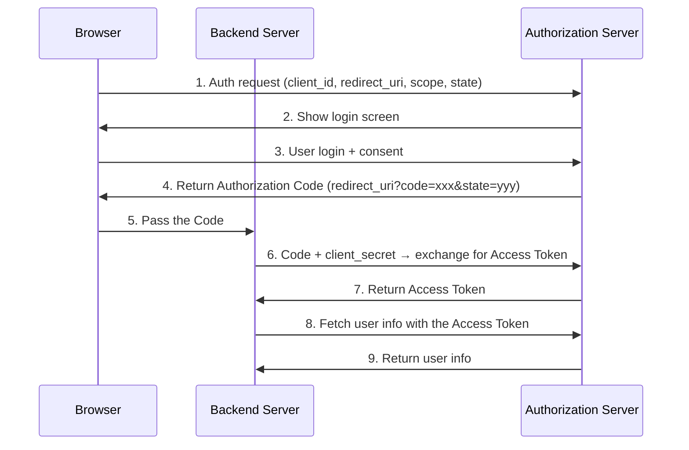
```mermaid
sequenceDiagram
    participant B as Browser
    participant S as Backend Server
    participant A as Authorization Server

    B->>A: 1. Auth request (client_id, redirect_uri, scope, state)
    A->>B: 2. Show login screen
    B->>A: 3. User login + consent
    A->>B: 4. Return Authorization Code (redirect_uri?code=xxx&state=yyy)
    B->>S: 5. Pass the Code
    S->>A: 6. Code + client_secret → exchange for Access Token
    A->>S: 7. Return Access Token
    S->>A: 8. Fetch user info with the Access Token
    A->>S: 9. Return user info
```

The OAuth flow comes with security elements such as `state`, PKCE, and Redirect URI validation. However, these are easier to understand after implementing the flow once, so we gather them all in **§6 (Security Deep Dive) after finishing the implementation**.

# 3. Google Cloud Console Setup

Before the actual implementation, you must create an OAuth client in the Google Cloud Console.

## 3.1 Create a project

1. Go to the [Google Cloud Console](https://console.cloud.google.com/)
2. Click **New Project** in the project picker at the top
3. Enter a project name and click **Create**

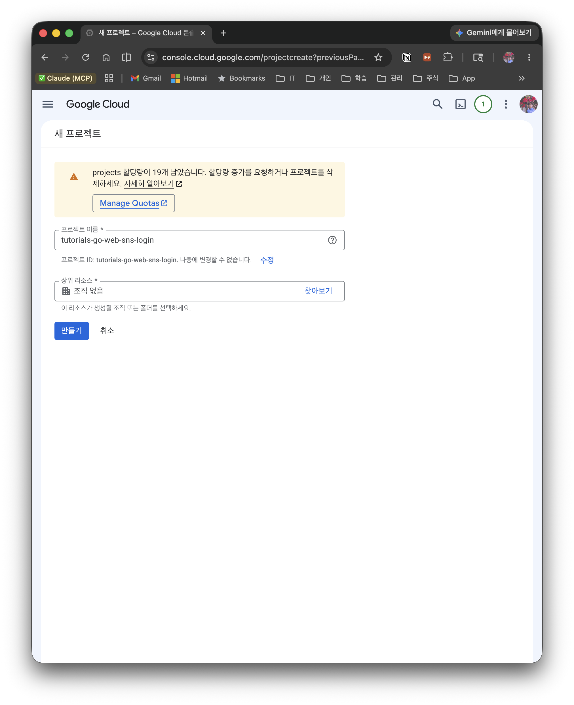

## 3.2 Configure the OAuth consent screen

1. In the left menu, select **APIs & Services > OAuth consent screen**
2. User Type: select **External**
3. Enter the app name and the user support email
4. Add `openid`, `email`, and `profile` under Scopes

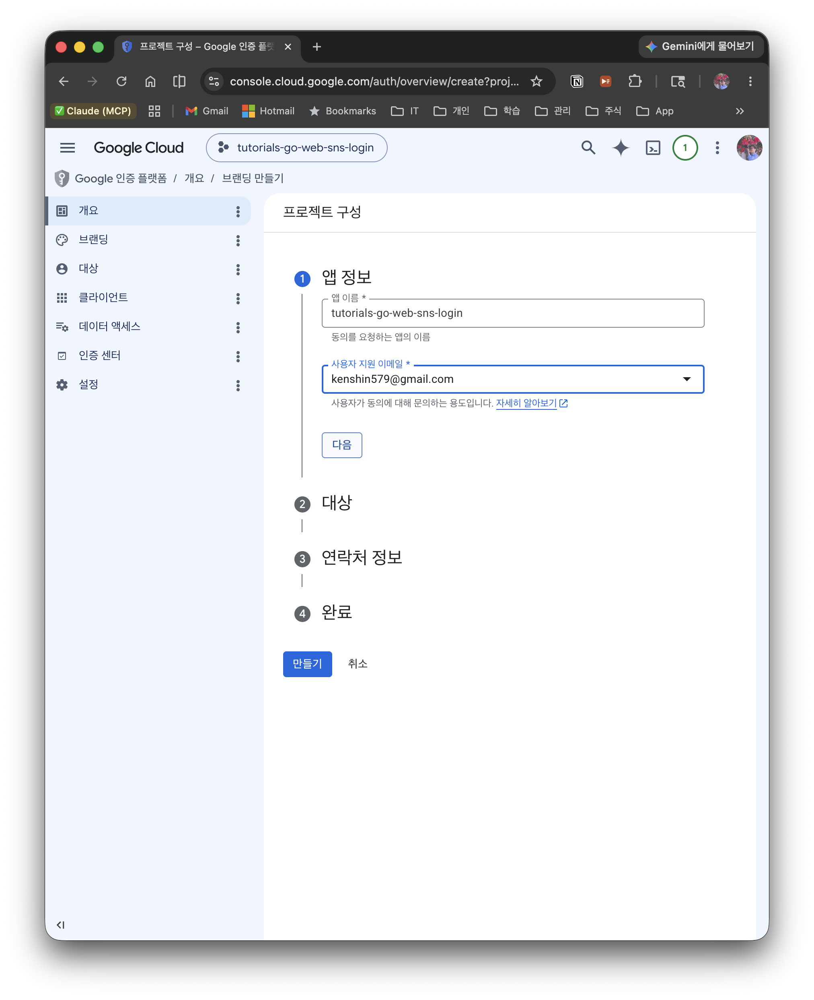

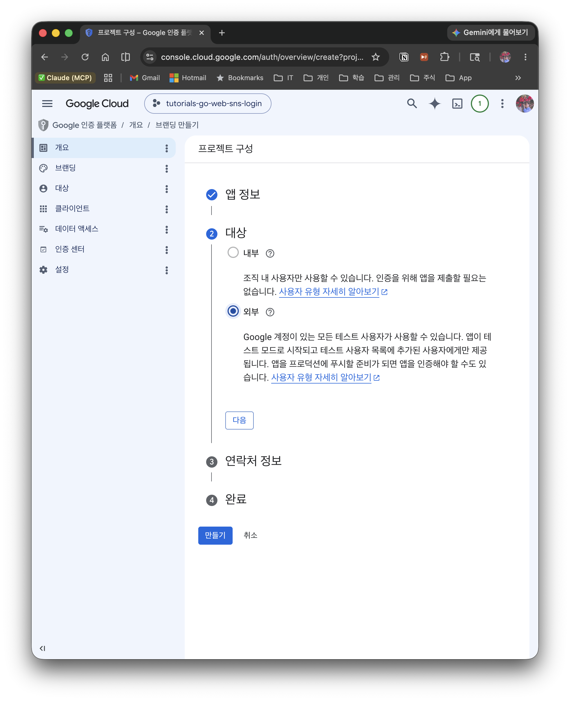

> **Registering test users**: an External app in "Testing" status only allows **test users registered in the console** to log in. Logging in with an unregistered account triggers `403 access_denied`, so add your own Google account under **Audience > Test users**.
>
> 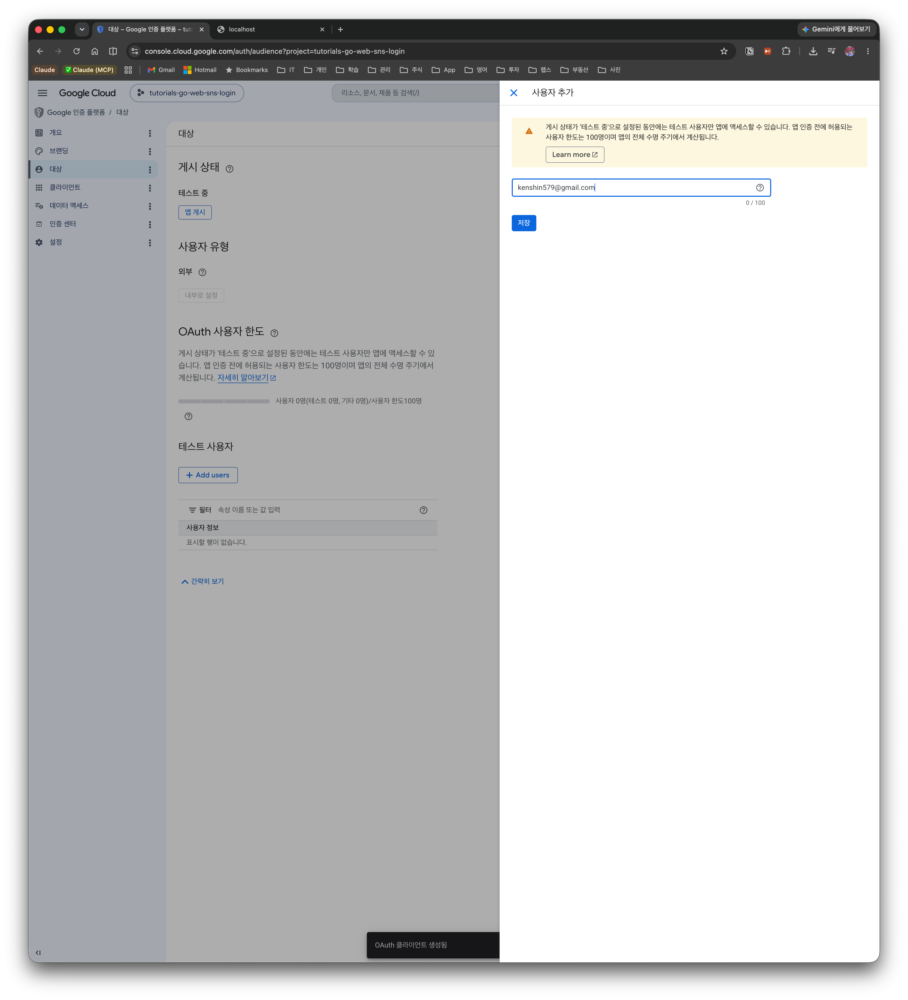

## 3.3 Create an OAuth 2.0 Client ID

1. In **APIs & Services > Credentials**, select **Create credentials > OAuth client ID**
2. Application type: **Web application**
3. Add **both** of these to the authorized redirect URIs:
   - `http://localhost:3000/auth/jwt/callback` — for the **JWT version (SPA token flow)**
   - `http://localhost:8080/api/auth/session/callback` — for the **session version (server redirect flow)**
4. Click **Create** to be issued a **Client ID** and **Client Secret**

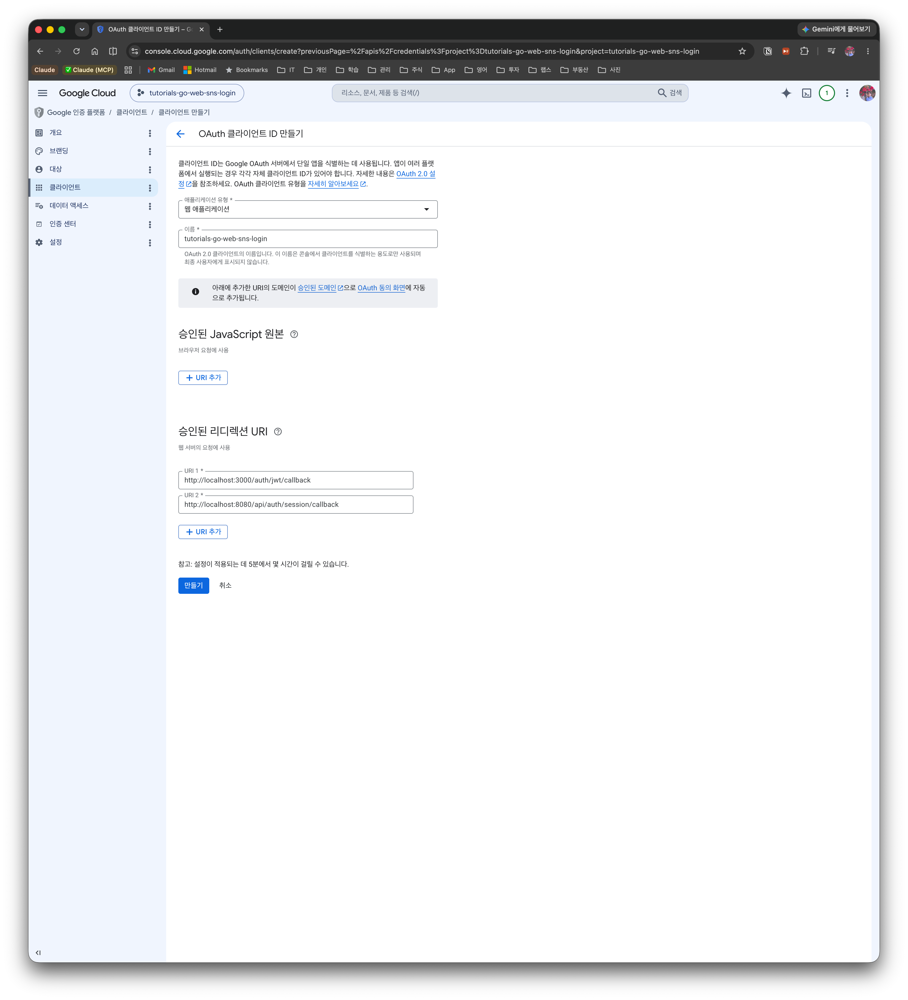

Once created, a **Client ID** and **Client Secret** are issued.

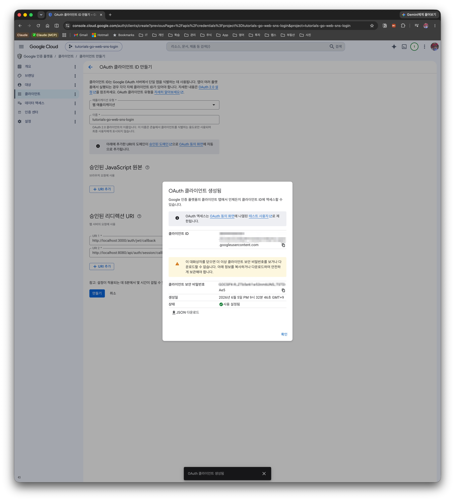

> **Why two redirect URIs?** In this post the same OAuth client is shared by both implementations. After authentication finishes, Google **sends the Authorization Code back to the redirect URI, and that destination differs between the two flows.**
>
> - **JWT version (SPA token flow)**: Google redirects to a **frontend route** (`http://localhost:3000/auth/jwt/callback`). The frontend extracts the `code` from the URL and forwards it back to the backend API.
> - **Session version (server redirect flow)**: Google redirects directly to a **backend callback endpoint** (`http://localhost:8080/api/auth/session/callback`). The backend sets a cookie right there and sends the user back to the frontend.
>
> Each version uses only the single URI that fits it, but to try out both versions you must register both in the console.

> Never expose the Client Secret to the client (browser). Always manage it as a backend environment variable.

# 4. Common Implementation (identical for both versions)

The JWT version and the session version are **completely identical up through the OAuth code exchange and sign-up**. The difference lies only in "how state is kept after authentication finishes." This chapter first organizes the parts shared by both versions.

## 4.1 Backend project structure

```
backend/
├── main.go                  # Server entry point
├── config/
│   └── config.go            # Load environment variables
├── provider/
│   ├── oauth_provider.go    # Provider interface
│   └── google.go            # Google OAuth implementation
├── handler/
│   ├── auth_handler.go      # Auth API handlers
│   └── user_handler.go      # User API handlers
├── middleware/              # Auth middleware (differs per version)
├── model/
│   └── user.go              # User model (GORM)
├── repository/
│   └── user_repository.go   # DB access layer
├── service/
│   └── auth_service.go      # Auth business logic
└── data/
    └── app.db               # SQLite file (auto-generated)
```

It uses Echo v4 as the HTTP framework and GORM + SQLite as the data store.

## 4.2 Designing the Provider Interface

To make it easy to add other SNS providers (GitHub, Kakao, etc.), we define a **Provider interface**.

```go
// provider/oauth_provider.go
type OAuthProvider interface {
    GetAuthURL(state string) string
    ExchangeCode(ctx context.Context, code string) (*UserInfo, error)
    Name() string
}

type UserInfo struct {
    Email      string
    Name       string
    AvatarURL  string
    Provider   string
    ProviderID string
}
```

To add a new SNS provider, you only need to implement this interface.

## 4.3 Implementing the Google OAuth Provider

We implement Google OAuth using the `golang.org/x/oauth2` package. When reading and parsing the user-info response, it is important to **handle all errors rather than ignore them**.

```go
// provider/google.go
func NewGoogleProvider(clientID, clientSecret, redirectURL string) *GoogleProvider {
    return &GoogleProvider{
        config: &oauth2.Config{
            ClientID:     clientID,
            ClientSecret: clientSecret,
            RedirectURL:  redirectURL,
            Scopes:       []string{"openid", "email", "profile"},
            Endpoint:     google.Endpoint,
        },
    }
}

func (g *GoogleProvider) ExchangeCode(ctx context.Context, code string) (*UserInfo, error) {
    // 1. Exchange Authorization Code → Access Token
    token, err := g.config.Exchange(ctx, code)
    if err != nil {
        return nil, fmt.Errorf("code exchange failed: %w", err)
    }

    // 2. Fetch user info with the Access Token
    client := g.config.Client(ctx, token)
    resp, err := client.Get("https://www.googleapis.com/oauth2/v2/userinfo")
    if err != nil {
        return nil, fmt.Errorf("failed to fetch user info: %w", err)
    }
    defer resp.Body.Close()

    // 3. Read the response body (handle the error)
    body, err := io.ReadAll(resp.Body)
    if err != nil {
        return nil, fmt.Errorf("failed to read response: %w", err)
    }

    // 4. Parse JSON (handle the error)
    var googleUser struct {
        ID      string `json:"id"`
        Email   string `json:"email"`
        Name    string `json:"name"`
        Picture string `json:"picture"`
    }
    if err := json.Unmarshal(body, &googleUser); err != nil {
        return nil, fmt.Errorf("JSON parsing failed: %w", err)
    }

    return &UserInfo{
        Email:      googleUser.Email,
        Name:       googleUser.Name,
        AvatarURL:  googleUser.Picture,
        Provider:   "google",
        ProviderID: googleUser.ID,
    }, nil
}
```

Key points:

- `oauth2.Config.Exchange()`: exchanges the Authorization Code for an Access Token
- `config.Client()`: returns an HTTP client that automatically includes the Access Token
- The Google UserInfo API (`/oauth2/v2/userinfo`) provides the email, name, and profile image
- Read the body with `io.ReadAll` and parse with `json.Unmarshal`, but **handle the errors of both steps**. Ignoring a decoding error lets empty user info flow through unchanged when the response is malformed

## 4.4 Sign-up: findOrCreateUser

Once identity is confirmed via OAuth, we look up the user in the DB and, if absent, **automatically sign them up**. For an already-registered user, on re-login we update the name/profile image to the latest values.

The important point here is that **sign-up and login are not separate flows**. The entry point is identical; the result of looking up by `provider` + `provider_id` simply branches into **sign-up (Create) if absent, login (Update) if present**, and every step afterward is completely the same.

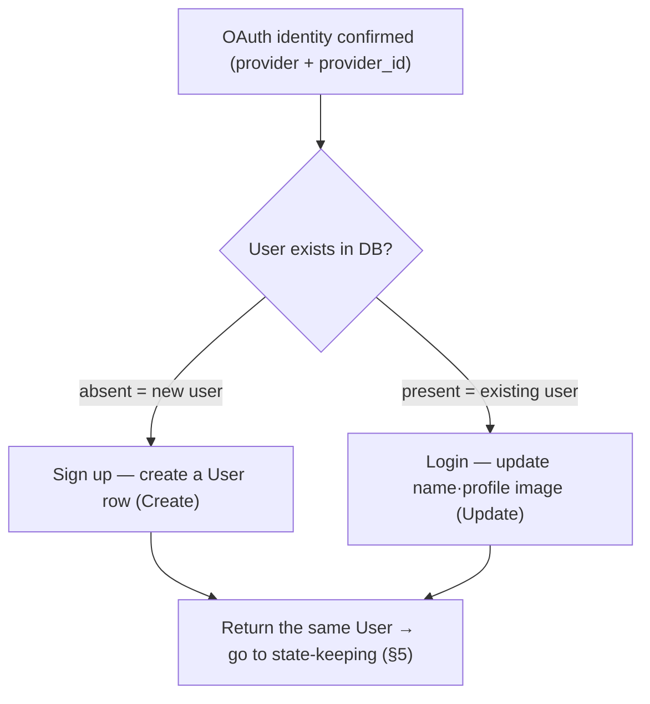
```mermaid
flowchart TD
    A["OAuth identity confirmed (provider + provider_id)"] --> B{"User exists in DB?"}
    B -->|"absent = new user"| C["Sign up — create a User row (Create)"]
    B -->|"present = existing user"| D["Login — update name·profile image (Update)"]
    C --> E["Return the same User → go to state-keeping (§5)"]
    D --> E
```

The `findOrCreateUser` below implements exactly this branch.

```go
// service/auth_service.go
func (s *AuthService) findOrCreateUser(info *provider.UserInfo) (*model.User, error) {
    user, err := s.userRepo.FindByProviderID(info.Provider, info.ProviderID)
    if err == nil {
        // Re-login: refresh the profile
        user.Name = info.Name
        user.AvatarURL = info.AvatarURL
        if err := s.userRepo.Update(user); err != nil {
            return nil, err
        }
        return user, nil
    }

    if !errors.Is(err, gorm.ErrRecordNotFound) {
        return nil, err
    }

    newUser := &model.User{
        Email:      info.Email,
        Name:       info.Name,
        AvatarURL:  info.AvatarURL,
        Provider:   info.Provider,
        ProviderID: info.ProviderID,
    }
    if err := s.userRepo.Create(newUser); err != nil {
        return nil, err
    }
    return newUser, nil
}
```

The `User` model (GORM) is an ordinary struct with the fields used in the code above (`Email`, `Name`, `AvatarURL`, `Provider`, `ProviderID`) plus an ID and timestamps, and it **identifies a user by the `provider` + `provider_id` combination**. See `model/user.go` in the repository for the full definition.

## 4.5 Storing state and verifying CSRF

You should store `state` on the server when issuing it, and in the callback verify **whether that value is the one we issued**. This example simply stores it in a `sync.Map`. We `Store` it when building the auth URL, and in the callback we pull it out with `LoadAndDelete`, deleting it at the same time (guaranteeing one-time use).

```go
// service/auth_service.go
type AuthService struct {
    providers map[string]provider.OAuthProvider
    userRepo  *repository.UserRepository
    // ...state-keeping dependency (differs per version)...
    states    sync.Map // store the state parameter (CSRF prevention)
}

// GetAuthURL returns the OAuth auth URL and the state
func (s *AuthService) GetAuthURL(providerName string) (string, error) {
    p, ok := s.providers[providerName]
    if !ok {
        return "", errors.New("unsupported provider: " + providerName)
    }

    state := generateState()
    s.states.Store(state, true) // store the issued state

    return p.GetAuthURL(state), nil
}

func generateState() string {
    b := make([]byte, 16)
    _, _ = rand.Read(b)
    return hex.EncodeToString(b)
}
```

In the callback handling, we verify the state with `LoadAndDelete`.

```go
// Verify state (CSRF prevention) — right after entering the callback
if _, ok := s.states.LoadAndDelete(state); !ok {
    return nil, nil, errors.New("invalid state")
}
```

> Storing in a `sync.Map` is for a single-instance demo. In production with multiple servers, you must keep the issued state in a shared store such as Redis, or in a signed cookie.

That's everything common to both versions. Now "post-authentication state keeping" diverges.

# 5. Implementing the State-Keeping Strategies

The two versions are identical up through the OAuth code exchange and sign-up (§4). From here, "how state is kept after authentication" splits into **① JWT (stateless)** and **② session (server state)**. We implement each in turn.

## 5.1 JWT (stateless)

On successful login, the JWT version **issues signed tokens (access/refresh) to the client**. The server stores no separate session state and only verifies the token signature on each request (stateless).

> Full code: [web/sns-login-jwt](https://github.com/kenshin579/tutorials-go/tree/master/web/sns-login-jwt)

### 5.1.1 SPA token flow

The JWT version uses an **SPA token flow where the frontend receives the callback**. Google redirects to a frontend route (`/auth/jwt/callback`), and the frontend forwards the URL's `code` to the backend API to receive tokens.

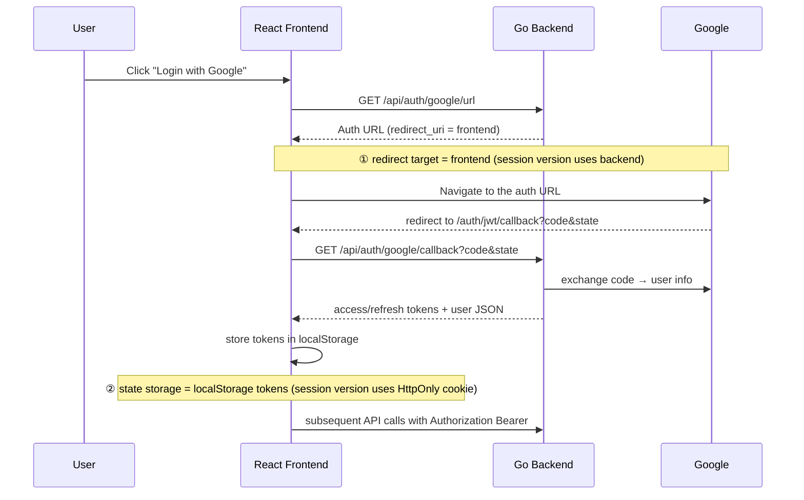
```mermaid
sequenceDiagram
    participant U as User
    participant FE as React Frontend
    participant BE as Go Backend
    participant G as Google

    U->>FE: Click "Login with Google"
    FE->>BE: GET /api/auth/google/url
    BE-->>FE: Auth URL (redirect_uri = frontend)
    Note over FE,G: ① redirect target = frontend (session version uses backend)
    FE->>G: Navigate to the auth URL
    G-->>FE: redirect to /auth/jwt/callback?code&state
    FE->>BE: GET /api/auth/google/callback?code&state
    BE->>G: exchange code → user info
    BE-->>FE: access/refresh tokens + user JSON
    FE->>FE: store tokens in localStorage
    Note over FE: ② state storage = localStorage tokens (session version uses HttpOnly cookie)
    FE->>BE: subsequent API calls with Authorization Bearer
```

So this version sets `redirect_uri` (`GOOGLE_REDIRECT_URL`) in `config/config.go` to the **frontend address** (`http://localhost:3000/auth/jwt/callback`) and receives the token-signing `JWT_SECRET` as an environment variable.

> The local default for `JWT_SECRET` is for development only. In production you must replace it with a sufficiently long random value.

### 5.1.2 Distinguishing token types (access vs refresh)

We issue an **Access Token** (15 minutes) and a **Refresh Token** (7 days), and put a `token_type` claim into each token to **distinguish their purpose**. This lets the middleware block calling a protected API with a refresh token.

```go
// service/token_service.go
const (
    TokenTypeAccess  = "access"
    TokenTypeRefresh = "refresh"
)

type Claims struct {
    UserID    uint   `json:"user_id"`
    TokenType string `json:"token_type"`
    jwt.RegisteredClaims
}

func (s *TokenService) GenerateTokenPair(userID uint) (*TokenPair, error) {
    accessToken, err := s.generateToken(userID, TokenTypeAccess, s.accessExpiry)
    if err != nil {
        return nil, err
    }
    refreshToken, err := s.generateToken(userID, TokenTypeRefresh, s.refreshExpiry)
    if err != nil {
        return nil, err
    }
    return &TokenPair{AccessToken: accessToken, RefreshToken: refreshToken}, nil
}
```

| Token | Expiry | `token_type` | Purpose |
|------|----------|--------------|------|
| Access Token | 15 min | `access` | Authenticating protected-API requests |
| Refresh Token | 7 days | `refresh` | Renewing the Access Token only |

### 5.1.3 Auth middleware — allow access tokens only

This is the Echo middleware that verifies the JWT when accessing a protected API. After verifying the token signature, it **additionally checks that `token_type` is `access`**, preventing the long-lived refresh token from being used to call APIs.

```go
// middleware/auth_middleware.go
func JWTAuth(tokenService *service.TokenService) echo.MiddlewareFunc {
    return func(next echo.HandlerFunc) echo.HandlerFunc {
        return func(c echo.Context) error {
            token := bearerToken(c) // parse the "Authorization: Bearer <token>" header (omitted)

            claims, err := tokenService.ValidateToken(token)
            if err != nil {
                return echo.NewHTTPError(http.StatusUnauthorized, "invalid token")
            }

            // Key point: only access tokens may access protected APIs (refresh tokens blocked)
            if claims.TokenType != service.TokenTypeAccess {
                return echo.NewHTTPError(http.StatusUnauthorized, "an access token is required")
            }

            c.Set("user_id", claims.UserID)
            return next(c)
        }
    }
}
```

Symmetrically, the token-renewal endpoint (`POST /api/auth/refresh`) **must** receive a refresh token. If you try to renew with an access token, it is rejected.

```go
// service/auth_service.go
func (s *AuthService) RefreshToken(refreshToken string) (*TokenPair, error) {
    claims, err := s.tokenService.ValidateToken(refreshToken)
    if err != nil {
        return nil, errors.New("invalid refresh token")
    }

    if claims.TokenType != TokenTypeRefresh {
        return nil, errors.New("not a refresh token")
    }

    return s.tokenService.GenerateTokenPair(claims.UserID)
}
```

### 5.1.4 Callback handler

The callback handler first validates that `code` is not missing, then exchanges the code for tokens and responds with JSON.

```go
// handler/auth_handler.go
func (h *AuthHandler) HandleCallback(c echo.Context) error {
    providerName := c.Param("provider")
    code := c.QueryParam("code")
    state := c.QueryParam("state")

    if code == "" {
        return echo.NewHTTPError(http.StatusBadRequest, "the code parameter is required")
    }

    tokens, user, err := h.authService.HandleCallback(c.Request().Context(), providerName, code, state)
    if err != nil {
        return echo.NewHTTPError(http.StatusInternalServerError, err.Error())
    }

    return c.JSON(http.StatusOK, map[string]interface{}{
        "tokens": tokens,
        "user":   user,
    })
}
```

| Method | Path | Description | Auth |
|--------|------|------|------|
| GET | `/api/auth/:provider/url` | Return the OAuth auth URL | Not required |
| GET | `/api/auth/:provider/callback` | Login/sign-up with the Authorization Code | Not required |
| POST | `/api/auth/refresh` | Renew the Access Token (refresh token required) | Not required |
| POST | `/api/auth/logout` | Logout (client deletes the tokens) | Not required |
| GET | `/api/user/me` | Current user info | Required (access token) |

> **Meaning of the "Auth" column**: here "Auth" means **whether passing the access-token middleware (`JWTAuth`) is required**. `/api/auth/refresh` does not go through the access middleware, so it is "Not required", but it does need a valid refresh token in the body — so "Not required" and "(refresh token required)" are not contradictory.

> **JWT logout is client-side**: since JWT keeps no session state on the server, logout ends with the client deleting the tokens it holds (for server-side invalidation, see §5.2.6 of the session approach).

### 5.1.5 Frontend integration

An Axios interceptor **automatically attaches the access token to every request**, and on a 401 response it attempts renewal with the refresh token. Note that tokens stored in localStorage may be exposed to XSS. The JWT-vs-session comparison is in §1, and security alternatives such as HttpOnly cookies are covered in §6.

```typescript
// services/authService.ts
const api = axios.create({ baseURL: API_URL });

// Request interceptor: automatically attach the JWT token
api.interceptors.request.use((config) => {
  const token = localStorage.getItem('access_token');
  if (token) {
    config.headers.Authorization = `Bearer ${token}`;
  }
  return config;
});

// Response interceptor: renew the token on a 401
api.interceptors.response.use(
  (response) => response,
  async (error) => {
    const originalRequest = error.config;
    if (error.response?.status === 401 && !originalRequest._retry) {
      originalRequest._retry = true;
      try {
        const tokens = await refreshToken();
        localStorage.setItem('access_token', tokens.access_token);
        localStorage.setItem('refresh_token', tokens.refresh_token);
        originalRequest.headers.Authorization = `Bearer ${tokens.access_token}`;
        return api(originalRequest);
      } catch {
        localStorage.removeItem('access_token');
        localStorage.removeItem('refresh_token');
        window.location.href = '/login';
      }
    }
    return Promise.reject(error);
  }
);
```

When Google redirects back to the frontend route, the callback component extracts `code`/`state` from the URL, forwards them to the backend, and stores the received tokens.

```tsx
// components/OAuthCallback.tsx
export function OAuthCallback({ onLogin }: Props) {
  const [searchParams] = useSearchParams();
  const navigate = useNavigate();

  useEffect(() => {
    const code = searchParams.get('code');
    const state = searchParams.get('state');

    if (!code || !state) {
      setError('missing authentication info');
      return;
    }

    handleCallback(code, state)
      .then((res) => {
        onLogin(res.user, res.tokens.access_token, res.tokens.refresh_token);
        navigate('/');
      })
      .catch(() => {
        setError('login failed');
      });
  }, [searchParams, onLogin, navigate]);

  return <p>Processing login...</p>;
}
```

## 5.2 Session (server state + SQLite)

On successful login, the session version has the server **create a session row in the `sessions` table** and return that session ID as an **HttpOnly cookie**. On each subsequent request, it looks up the DB by the cookie's session ID to confirm validity (server state).

> Full code: [web/sns-login-session](https://github.com/kenshin579/tutorials-go/tree/master/web/sns-login-session)

### 5.2.1 Server redirect flow

The session version is the classic server-session flow where **the backend receives the callback directly**. When Google redirects to the backend callback, the backend sets a cookie right there and does a 302 redirect to the frontend. The frontend never handles tokens directly.

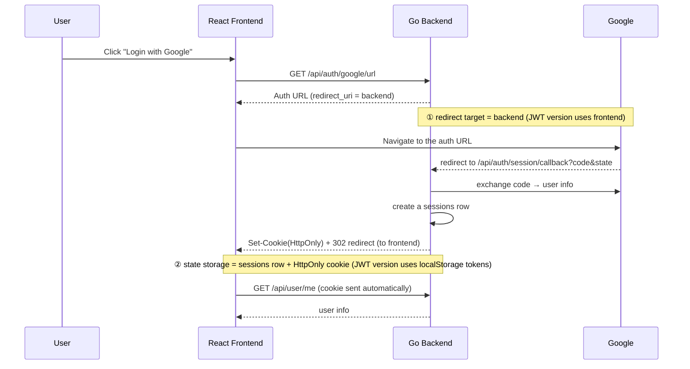
```mermaid
sequenceDiagram
    participant U as User
    participant FE as React Frontend
    participant BE as Go Backend
    participant G as Google

    U->>FE: Click "Login with Google"
    FE->>BE: GET /api/auth/google/url
    BE-->>FE: Auth URL (redirect_uri = backend)
    Note over BE,G: ① redirect target = backend (JWT version uses frontend)
    FE->>G: Navigate to the auth URL
    G-->>BE: redirect to /api/auth/session/callback?code&state
    BE->>G: exchange code → user info
    BE->>BE: create a sessions row
    BE-->>FE: Set-Cookie(HttpOnly) + 302 redirect (to frontend)
    Note over BE,FE: ② state storage = sessions row + HttpOnly cookie (JWT version uses localStorage tokens)
    FE->>BE: GET /api/user/me (cookie sent automatically)
    BE-->>FE: user info
```

So this version sets `redirect_uri` (`GOOGLE_REDIRECT_URL`) in `config/config.go` to the **backend address** (`http://localhost:8080/api/auth/session/callback`). No JWT secret is needed, so it is also absent from the config.

### 5.2.2 Session model and repository

Sessions are stored in SQLite's `sessions` table. The ID uses a random token as the PK and also keeps the expiry time.

```go
// model/session.go
type Session struct {
    ID        string    `gorm:"primarykey" json:"id"` // random session token
    UserID    uint      `gorm:"index;not null" json:"user_id"`
    ExpiresAt time.Time `gorm:"not null" json:"expires_at"`
    CreatedAt time.Time `json:"created_at"`
}
```

The repository (`repository/session_repository.go`) is simple CRUD wrapping only `Create` / `FindByID` / `Delete` over GORM, so it is omitted from the body (see the repository for the full code).

### 5.2.3 Session service — create/validate/delete

The service creates and stores a random session ID, and on validation it **checks expiry**. Expired sessions are cleaned up at lookup time.

```go
// service/session_service.go
func (s *SessionService) Create(userID uint) (*model.Session, error) {
    sess := &model.Session{
        ID:        generateSessionID(), // crypto/rand 32-byte hex
        UserID:    userID,
        ExpiresAt: time.Now().Add(s.expiry),
    }
    if err := s.repo.Create(sess); err != nil {
        return nil, err
    }
    return sess, nil
}

// Validate returns the user ID for a session ID. Errors if expired/missing.
func (s *SessionService) Validate(id string) (uint, error) {
    sess, err := s.repo.FindByID(id)
    if err != nil {
        return 0, err
    }
    if time.Now().After(sess.ExpiresAt) {
        _ = s.repo.Delete(id) // clean up the expired session
        return 0, errors.New("expired session")
    }
    return sess.UserID, nil
}

func (s *SessionService) Delete(id string) error {
    return s.repo.Delete(id)
}
```

### 5.2.4 Session middleware — cookie verification

For protected APIs, instead of the Authorization header it reads **the session ID from the cookie** and verifies it with `Validate`.

```go
// middleware/session_middleware.go
const SessionCookieName = "session_id"

// SessionAuth is the middleware that verifies the session cookie
func SessionAuth(sessionService *service.SessionService) echo.MiddlewareFunc {
    return func(next echo.HandlerFunc) echo.HandlerFunc {
        return func(c echo.Context) error {
            cookie, err := c.Cookie(SessionCookieName)
            if err != nil {
                return echo.NewHTTPError(http.StatusUnauthorized, "a session cookie is required")
            }
            userID, err := sessionService.Validate(cookie.Value)
            if err != nil {
                return echo.NewHTTPError(http.StatusUnauthorized, "invalid session")
            }
            c.Set("user_id", userID)
            return next(c)
        }
    }
}
```

### 5.2.5 Setting the cookie + redirect in the callback

The callback handler creates the session, then sets an **HttpOnly session cookie** and does a 302 redirect to the frontend.

```go
// handler/auth_handler.go
// GET /api/auth/session/callback — Google redirects here directly (redirect_uri = backend)
func (h *AuthHandler) HandleCallback(c echo.Context) error {
    const providerName = "google" // the session version is a Google-only server redirect callback
    code := c.QueryParam("code")
    state := c.QueryParam("state")
    if code == "" {
        return echo.NewHTTPError(http.StatusBadRequest, "the code parameter is required")
    }

    sess, _, err := h.authService.HandleCallback(c.Request().Context(), providerName, code, state)
    if err != nil {
        return echo.NewHTTPError(http.StatusInternalServerError, err.Error())
    }

    // Set the HttpOnly session cookie, then redirect to the frontend
    c.SetCookie(&http.Cookie{
        Name:     customMiddleware.SessionCookieName,
        Value:    sess.ID,
        Path:     "/",
        Expires:  sess.ExpiresAt,
        HttpOnly: true,
        SameSite: http.SameSiteLaxMode,
        // In development (same site, localhost), Lax is sufficient.
        // In production with frontend/backend on different sites, SameSite=None + Secure is required (HTTPS).
        // Secure: true,
    })
    return c.Redirect(http.StatusFound, h.frontendURL)
}
```

> **A note on SameSite**: if the frontend/backend are the same site (localhost), like in a development environment, `SameSite=Lax` is sufficient. But in production where the frontend and backend are **different sites (cross-site)**, you must use the `SameSite=None` + `Secure` (HTTPS required) combination so the browser sends the cookie after the redirect.

### 5.2.6 Logout = deleting the session (server-side invalidation)

This is the **biggest differentiator** of the session approach. Logout doesn't merely clear the client cookie — it **deletes the server's session row itself**. Once the row is gone, that session ID is immediately invalid, so even if a cookie lingers somewhere it no longer works (immediate server-side invalidation). If deletion fails it returns 500 so that invalidation is not skipped.

```go
// handler/auth_handler.go
func (h *AuthHandler) Logout(c echo.Context) error {
    if cookie, err := c.Cookie(customMiddleware.SessionCookieName); err == nil {
        if err := h.authService.Logout(cookie.Value); err != nil {
            c.Logger().Error(err)
            return echo.NewHTTPError(http.StatusInternalServerError, "failed to process logout")
        }
    }
    c.SetCookie(&http.Cookie{
        Name:     customMiddleware.SessionCookieName,
        Value:    "",
        Path:     "/",
        Expires:  time.Unix(0, 0),
        MaxAge:   -1,
        HttpOnly: true,
        SameSite: http.SameSiteLaxMode,
    })
    return c.JSON(http.StatusOK, map[string]string{"message": "logout successful"})
}
```

`AuthService.Logout` simply delegates deletion to the session service.

```go
// service/auth_service.go
func (s *AuthService) Logout(sessionID string) error {
    return s.sessionService.Delete(sessionID)
}
```

### 5.2.7 Frontend integration (no token storage)

The frontend handles no tokens. Just give axios `withCredentials: true` and the cookie travels automatically. Checking the login state is done via a `/api/user/me` call instead.

```typescript
// services/authService.ts
// withCredentials: include cookies in cross-origin requests
const api = axios.create({ baseURL: API_URL, withCredentials: true });

export async function getGoogleAuthURL(): Promise<string> {
  const { data } = await api.get<{ url: string }>('/api/auth/google/url');
  return data.url;
}

export async function getMe(): Promise<User> {
  const { data } = await api.get<User>('/api/user/me');
  return data;
}

export async function logout(): Promise<void> {
  await api.post('/api/auth/logout');
}
```

The `useAuth` hook calls `getMe` on app load to restore user info based on the cookie. No separate callback page is needed (Google → backend → frontend `/` returns naturally).

```typescript
// hooks/useAuth.ts
export function useAuth() {
  const [user, setUser] = useState<User | null>(null);
  const [loading, setLoading] = useState(true);

  const refresh = useCallback(() => {
    getMe()
      .then(setUser)
      .catch(() => setUser(null))
      .finally(() => setLoading(false));
  }, []);

  useEffect(() => {
    refresh();
  }, [refresh]);

  const logout = useCallback(async () => {
    await logoutApi();
    setUser(null);
  }, []);

  return { user, loading, isAuthenticated: !!user, logout };
}
```

> A note on CORS: to exchange cookies, the backend CORS must specify `AllowCredentials: true` together with `AllowOrigins` set to the **exact frontend address**. The wildcard `*` and credentials cannot be used together.

## 5.3 Running the app

Both versions start by clicking the "Login with Google" button on the frontend (`http://localhost:3000`).

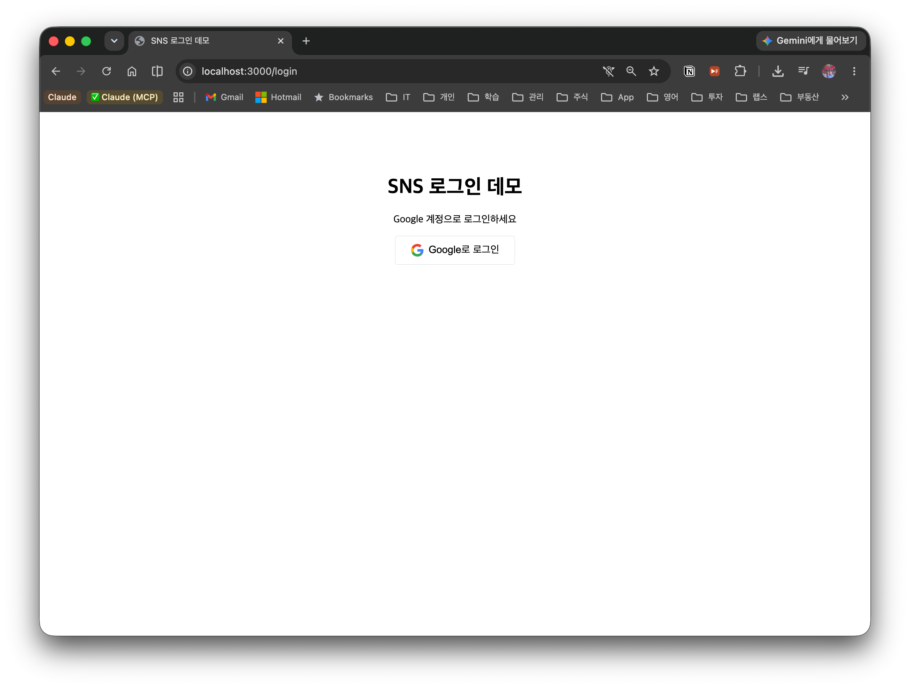

On successful login, the Google profile (name·email·avatar·provider) is displayed. The JWT version keeps the token in localStorage and the session version keeps the session ID in an HttpOnly cookie, but the on-screen behavior is identical.

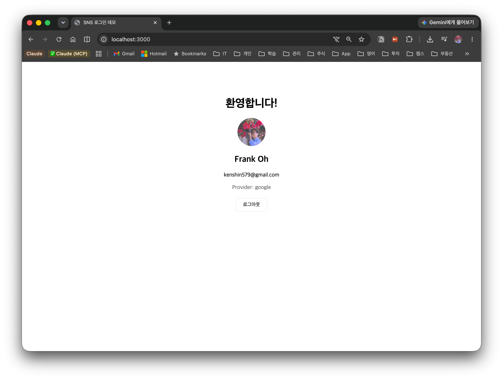

# 6. Security Deep Dive

The implementation above is "a minimal working version." Before shipping to a real service, we gather and organize the security elements you must address in OAuth login. Now that you've implemented the flow once is the best time to understand **what attack each of these prevents**.

## 6.1 The state parameter — CSRF prevention

> **What is CSRF (Cross-Site Request Forgery)?**
> It is an attack that exploits the fact that a user is **already logged in** to some site to **make the attacker send a request the user did not intend** on their behalf. When the browser sends a request to a particular site, it automatically attaches that site's cookies/session, so the attacker tricks the victim into touching a malicious link·image·form, forging a request that "looks like it came from a legitimate user." For example, if a victim logged into their bank opens the attacker's page, that page secretly fires a "wire transfer" request through the victim's browser.

In OAuth login, this CSRF appears in a slightly altered form called **"login CSRF"**, and the mechanism that prevents it is `state`. `state` is a **one-time random string** the server creates when starting an auth request. It is carried along in the auth URL, and we verify that the `state` Google returns in the callback **matches the value we issued**.

```
auth request: state=abc123 → Google → callback: state=abc123 ✅ (match → legitimate)
attacker callback: state=missing/forged → ❌ (verification fails → rejected)
```

The attack this prevents is exactly **login CSRF**. Without state, an attacker can make the victim click a callback URL containing *the attacker's own* Authorization Code, causing **the victim to be unknowingly logged into the attacker's account**. Afterward the information the victim enters (payment methods, personal notes, etc.) accumulates intact in the attacker's account.

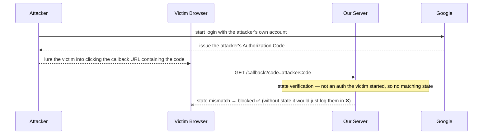
```mermaid
sequenceDiagram
    participant A as Attacker
    participant V as Victim Browser
    participant S as Our Server
    participant G as Google

    A->>G: start login with the attacker's own account
    G-->>A: issue the attacker's Authorization Code
    A-->>V: lure the victim into clicking the callback URL containing the code
    V->>S: GET /callback?code=attackerCode
    Note over S: state verification — not an auth the victim started, so no matching state
    S--xV: state mismatch → blocked ✅ (without state it would just log them in ❌)
```

Comparing the `state` on the issuing side and the callback side guarantees "whether this callback really belongs to an auth I started." The victim never started an auth in the first place, so **there is no stored state**, and the attacker's callback is filtered out at verification.

There are two key points — **(1) it must be an unguessable random value**, and **(2) it must be discarded after one use (one-time)**. This post stores it in a `sync.Map` in §4.5 and pulls it out with `LoadAndDelete` in the callback, deleting it at the same time to guarantee one-time use. However, `sync.Map` is single-instance memory, so **in a multi-instance environment one server cannot verify the state another server issued.** In that case you must keep it in a shared store such as Redis, or change it so the state is carried in a signed cookie (HMAC) and the server verifies it statelessly.

## 6.2 PKCE — preventing Authorization Code interception

PKCE (Proof Key for Code Exchange) is a mechanism that **makes an Authorization Code unusable even if it is stolen during the redirect**. It works like this.

1. The client generates a random `code_verifier` on each request
2. It sends its hash `code_challenge = BASE64URL(SHA256(code_verifier))` in the **auth request**
3. When exchanging the token, it sends the original `code_verifier` **together**
4. The authorization server checks whether `SHA256(code_verifier)` equals the `code_challenge` it received earlier

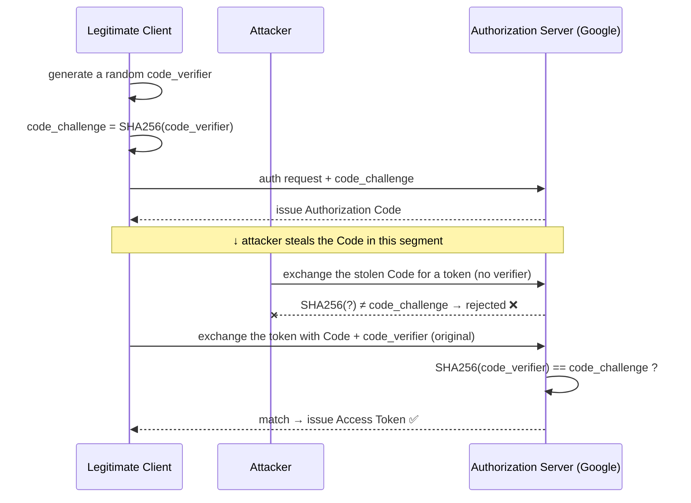
```mermaid
sequenceDiagram
    participant C as Legitimate Client
    participant A as Attacker
    participant G as Authorization Server (Google)

    C->>C: generate a random code_verifier
    C->>C: code_challenge = SHA256(code_verifier)
    C->>G: auth request + code_challenge
    G-->>C: issue Authorization Code
    Note over C,G: ↓ attacker steals the Code in this segment
    A->>G: exchange the stolen Code for a token (no verifier)
    G--xA: SHA256(?) ≠ code_challenge → rejected ❌
    C->>G: exchange the token with Code + code_verifier (original)
    G->>G: SHA256(code_verifier) == code_challenge ?
    G-->>C: match → issue Access Token ✅
```

An attacker who intercepted the Code does not know the (original) `code_verifier`, so the token exchange fails. That's why it is especially important for **public clients that cannot safely keep a `client_secret` (mobile apps·pure SPAs)**. A confidential client like this post, where the backend holds the `client_secret` and exchanges the Code, has the secret as a first line of defense, but the latest recommendation (OAuth 2.1) treats **applying PKCE as the default regardless of client type**. `golang.org/x/oauth2` supports PKCE options on `AuthCodeURL`/`Exchange`.

## 6.3 Redirect URI validation

Google only sends the Authorization Code to a place that **exactly matches a Redirect URI pre-registered in the Cloud Console** (§3.3). Partial matches or wildcards are not allowed.

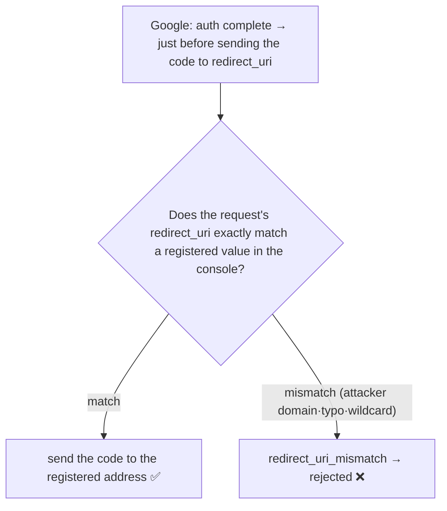
```mermaid
flowchart TD
    A["Google: auth complete → just before sending the code to redirect_uri"] --> B{"Does the request's redirect_uri exactly match a registered value in the console?"}
    B -->|"match"| C["send the code to the registered address ✅"]
    B -->|"mismatch (attacker domain·typo·wildcard)"| D["redirect_uri_mismatch → rejected ❌"]
```

Without this validation, an attacker could change `redirect_uri` to their own domain, enabling an **open redirect attack that intercepts the Code**. So whenever your production domains increase, you must add the exact URI to the console each time. In addition, **never expose the `Client Secret` to the browser (frontend)** — always handle it only as a backend environment variable.

## 6.4 Additional production checklist

| Item | Description |
|------|------|
| **Refresh Token Rotation** | (JWT) Issue a new token each time a Refresh Token is used and discard the previous one. Detect·block reuse of a stolen refresh token |
| **Rate Limiting** | Put a request-count limit on the login·token-renewal APIs to mitigate brute-force·token-guessing attacks |
| **Secure Cookie** | Apply `HttpOnly` + `Secure` + `SameSite` to cookies (session cookies, or when putting a JWT in a cookie). Reduces XSS-based theft and CSRF together |
| **HTTPS** | Protect the entire path of OAuth redirects and token·cookie transmission with TLS to prevent man-in-the-middle (MITM) attacks. Practically mandatory in production |

# 7. Conclusion

In this post we implemented Google social login with the OAuth 2.0 Authorization Code Flow, and compared two post-authentication state-keeping strategies — JWT and session. Key points:

- **OAuth and state keeping are separate**: OAuth is identity delegation; JWT/session is the state-keeping strategy that follows
- **Authorization Code Flow**: only a one-time Code is exposed to the browser; the Access Token is exchanged securely on the server
- **Provider pattern**: a structure that makes adding new SNS providers easy by defining an interface
- **JWT token-type distinction**: distinguish access/refresh with the `token_type` claim and allow only access in the middleware
- **Session = server-side invalidation**: logout takes effect immediately by deleting the session row
- **Security elements**: `state` (CSRF), PKCE (Code interception), Redirect URI validation, and the production checklist are organized in §6

> **Limitation (out of scope)**: this post's `findOrCreateUser` identifies a user by `provider` + `provider_id`. **If the same email signs up with a different provider (e.g., Google and GitHub)**, it can collide on the User model's `Email uniqueIndex`, in which case you need a design that "links multiple SNS accounts to one user (account linking)." This is a separate, large topic and is not covered in this post.

# 8. References

- [Google OAuth 2.0 official docs](https://developers.google.com/identity/protocols/oauth2)
- [OAuth 2.0 RFC 6749](https://datatracker.ietf.org/doc/html/rfc6749)
- [golang.org/x/oauth2 package](https://pkg.go.dev/golang.org/x/oauth2)
- [golang-jwt/jwt package](https://github.com/golang-jwt/jwt)
- [Echo framework official docs](https://echo.labstack.com/)
- [JWT.io](https://jwt.io/)
- Sample code: [web/sns-login-jwt](https://github.com/kenshin579/tutorials-go/tree/master/web/sns-login-jwt) · [web/sns-login-session](https://github.com/kenshin579/tutorials-go/tree/master/web/sns-login-session)
