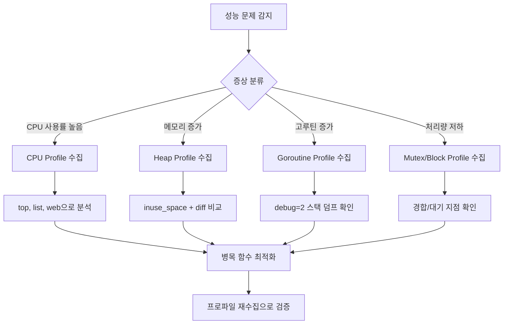

# 1. 개요

## 1.1 프로파일링이란?

프로파일링(Profiling)은 프로그램이 실행되는 동안 CPU, 메모리, I/O 등 자원 사용 패턴을 측정하고 분석하는 기법이다. 프로파일링을 통해 성능 병목(bottleneck) 지점을 정확하게 식별하고, 최적화가 필요한 코드 영역을 찾아낼 수 있다.

프로파일링 없이 "느린 것 같다"는 감에 의존하면, 실제 병목과 무관한 코드를 최적화하느라 시간을 낭비하게 된다. **"측정 없이 최적화하지 마라(Don't optimize without measuring)"** 는 소프트웨어 성능 분석의 기본 원칙이다.

## 1.2 Go에서 프로파일링이 중요한 이유

Go는 고루틴(goroutine), 가비지 컬렉터(GC), 채널(channel) 등 런타임 고유의 동시성 메커니즘을 갖고 있다. 이러한 특성은 강력하지만, 동시에 성능 문제의 원인을 파악하기 어렵게 만들기도 한다.

- **고루틴 누수**: 종료되지 않는 고루틴이 계속 쌓여 메모리를 소모
- **GC 오버헤드**: 과도한 힙 할당으로 인한 GC 부하
- **뮤텍스 경합**: 여러 고루틴이 같은 Lock을 두고 경쟁하여 성능 저하
- **채널 블로킹**: 채널 대기로 인한 고루틴 정체

Go는 이런 문제를 진단하기 위한 프로파일링 도구를 **표준 라이브러리에 내장**하고 있어, 별도 설치 없이 바로 사용할 수 있다.

## 1.3 pprof 도구 소개

Go에서 프로파일링은 크게 두 가지 패키지로 제공된다.

| 패키지 | 설명 | 사용 시나리오 |
|--------|------|-------------|
| `runtime/pprof` | 프로파일 데이터를 파일로 저장 | CLI 프로그램, 배치 작업 |
| `net/http/pprof` | HTTP 엔드포인트로 프로파일링 노출 | 웹 서버, 상주 프로세스 |

`net/http/pprof`는 내부적으로 `runtime/pprof`를 사용하며, HTTP 핸들러를 등록하여 실행 중인 프로그램에 원격으로 접속해 프로파일 데이터를 수집할 수 있다. 프로덕션 환경에서도 안전하게 사용할 수 있을 만큼 오버헤드가 낮다.

# 2. pprof 기본 설정

## 2.1 net/http/pprof - HTTP 엔드포인트 방식

가장 간단한 방법은 `net/http/pprof` 패키지를 import하는 것이다. 블랭크 import(`_`) 한 줄이면 프로파일링 HTTP 엔드포인트가 자동 등록된다.

```go
package main

import (
	"fmt"
	"log"
	"net/http"
	"sync"
	"time"

	_ "net/http/pprof" // pprof 엔드포인트 자동 등록
)

func main() {
	// pprof용 HTTP 서버 시작
	go func() {
		log.Println(http.ListenAndServe("localhost:6060", nil))
	}()

	fmt.Println("hello world")
	var wg sync.WaitGroup
	wg.Add(1)
	go leakyFunction(wg)
	wg.Wait()
}

// leakyFunction은 슬라이스에 문자열을 계속 추가하여 메모리 누수를 발생시킨다.
// append()가 반복되면서 슬라이스의 내부 배열이 계속 재할당되고,
// 이전 배열은 GC 대상이 되지만 새로운 할당이 더 빠르게 증가하여 메모리 사용량이 지속적으로 늘어난다.
func leakyFunction(wg sync.WaitGroup) {
	defer wg.Done()
	s := make([]string, 3)
	for i := 0; i < 10000000; i++ {
		s = append(s, "magical pandas") // 슬라이스가 무한히 커지며 메모리 누수 발생
		if (i % 100000) == 0 {
			time.Sleep(500 * time.Millisecond)
		}
	}
}
```

프로그램을 실행한 후 브라우저에서 `http://localhost:6060/debug/pprof/`에 접속하면 아래와 같은 프로파일 목록을 확인할 수 있다.

| 엔드포인트 | 설명 |
|-----------|------|
| `/debug/pprof/` | 프로파일 인덱스 페이지 |
| `/debug/pprof/profile` | CPU 프로파일 (기본 30초) |
| `/debug/pprof/heap` | 힙 메모리 프로파일 |
| `/debug/pprof/goroutine` | 고루틴 스택 트레이스 |
| `/debug/pprof/allocs` | 메모리 할당 프로파일 |
| `/debug/pprof/block` | 블로킹 프로파일 |
| `/debug/pprof/mutex` | 뮤텍스 경합 프로파일 |
| `/debug/pprof/threadcreate` | 스레드 생성 프로파일 |
| `/debug/pprof/trace` | 실행 트레이스 |

## 2.2 runtime/pprof - 파일 출력 방식

HTTP 서버가 없는 CLI 프로그램이나 배치 작업에서는 `runtime/pprof` 패키지를 사용하여 프로파일 데이터를 파일로 직접 저장할 수 있다.

### 2.2.1 CPU 프로파일 파일 저장

```go
package main

import (
	"log"
	"os"
	"runtime/pprof"
)

func main() {
	// CPU 프로파일 파일 생성
	f, err := os.Create("cpu.prof")
	if err != nil {
		log.Fatal(err)
	}
	defer f.Close()

	// CPU 프로파일링 시작
	if err := pprof.StartCPUProfile(f); err != nil {
		log.Fatal(err)
	}
	defer pprof.StopCPUProfile()

	// 프로파일링할 코드 실행
	heavyComputation()
}

func heavyComputation() {
	result := 0
	for i := 0; i < 100000000; i++ {
		result += i * i
	}
}
```

### 2.2.2 힙 메모리 프로파일 파일 저장

```go
func writeHeapProfile() {
	f, err := os.Create("mem.prof")
	if err != nil {
		log.Fatal(err)
	}
	defer f.Close()

	// 힙 프로파일 저장
	if err := pprof.WriteHeapProfile(f); err != nil {
		log.Fatal(err)
	}
}
```

저장된 프로파일 파일은 `go tool pprof` 명령어로 분석한다.

```bash
# CPU 프로파일 분석
go tool pprof cpu.prof

# 메모리 프로파일 분석
go tool pprof mem.prof
```

## 2.3 go test -bench와 함께 사용

벤치마크 테스트를 실행하면서 동시에 프로파일 데이터를 수집할 수 있다. 특정 함수의 성능을 분석할 때 유용하다.

```bash
# CPU 프로파일 수집
go test -bench=. -cpuprofile=cpu.prof

# 메모리 프로파일 수집
go test -bench=. -memprofile=mem.prof

# 블로킹 프로파일 수집
go test -bench=. -blockprofile=block.prof

# 뮤텍스 프로파일 수집
go test -bench=. -mutexprofile=mutex.prof
```

수집된 프로파일 파일을 분석하는 방법은 동일하다.

```bash
# 벤치마크 CPU 프로파일 분석
go tool pprof cpu.prof

# 웹 UI로 열기
go tool pprof -http=:8080 cpu.prof
```

# 3. 프로파일 유형별 분석

Go pprof는 다양한 유형의 프로파일을 제공한다. 이 장에서는 각 프로파일 유형의 특성과 수집 방법, 그리고 실제 예제를 살펴본다.

종합 예제 프로그램은 아래와 같이 모든 유형의 프로파일을 동시에 수집할 수 있도록 구성되어 있다.

```go
package main

import (
	"log"
	"net/http"
	_ "net/http/pprof"
	"os"
	"os/signal"
	"runtime"
	"syscall"

	"example.com/profiling/pkg/block"
	"example.com/profiling/pkg/cpu"
	"example.com/profiling/pkg/memory"
	"example.com/profiling/pkg/mutex"
	"example.com/profiling/pkg/threadcreate"
)

func main() {
	// pprof HTTP 서버 시작
	go func() {
		log.Println(http.ListenAndServe("localhost:6060", nil))
	}()

	// 블로킹/뮤텍스 프로파일은 기본 비활성화이므로 명시적으로 활성화해야 한다
	runtime.SetBlockProfileRate(1)     // 모든 블로킹 이벤트 기록 (1 = 나노초 임계값)
	runtime.SetMutexProfileFraction(1) // 모든 뮤텍스 경합 기록 (1 = 1/1 확률로 샘플링)

	// 각 유형별 부하를 생성하는 고루틴 시작
	go cpu.IncreaseInt()                  // CPU 부하 (무한 루프 연산)
	go cpu.IncreaseIntGoroutine()         // CPU 부하 (중첩 고루틴)
	go memory.AllocMemory()               // 힙 메모리 할당
	go block.PrintHello()                 // stdout 블로킹 (I/O Lock 경합)
	go block.PrintWorld()                 // stdout 블로킹 (I/O Lock 경합)
	go threadcreate.CreateGoroutine1000() // 대량 고루틴 생성 → OS 스레드 생성 유발
	go mutex.Mutex01()                    // 뮤텍스 경합
	go mutex.Mutex02()                    // 뮤텍스 경합
	go mutex.Mutex03()                    // 뮤텍스 경합

	// 종료 시그널 대기
	log.Println("프로파일링 서버 시작: http://localhost:6060/debug/pprof/")
	termSignal := make(chan os.Signal, 1)
	signal.Notify(termSignal, syscall.SIGTERM, syscall.SIGINT)
	<-termSignal
}
```

## 3.1 CPU 프로파일

CPU 프로파일은 프로그램이 CPU 시간을 가장 많이 소비하는 함수를 식별한다. 기본적으로 초당 100회 샘플링하여, 해당 시점에 실행 중인 함수의 스택 트레이스를 기록한다.

### 수집 방법

```bash
# 30초간 CPU 프로파일 수집
go tool pprof http://localhost:6060/debug/pprof/profile?seconds=30

# 10초간 수집
go tool pprof http://localhost:6060/debug/pprof/profile?seconds=10
```

### CPU 부하 예제 코드

```go
package cpu

func IncreaseInt() {
	i := 0
	for {
		i = increase1000(i)
		i = increase2000(i)
	}
}

func IncreaseIntGoroutine() {
	go func() {
		i := 0
		for {
			i = increase1000(i)
			i = increase2000(i)
		}
	}()
}

func increase1000(n int) int {
	for n := 0; n < 1000; n++ {
		n = n + 1
	}
	return n
}

func increase2000(n int) int {
	for n := 0; n < 2000; n++ {
		n = n + 1
	}
	return n
}
```

### 분석 결과 예시

```bash
(pprof) top10
Showing nodes accounting for 5.20s, 98.11% of 5.30s total
Showing top 10 nodes out of 23
      flat  flat%   sum%        cum   cum%
     2.08s 39.25% 39.25%      2.08s 39.25%  main.increase2000
     1.52s 28.68% 67.92%      1.52s 28.68%  main.increase1000
     0.80s 15.09% 83.02%      3.60s 67.92%  main.IncreaseInt
     0.60s 11.32% 94.34%      2.12s 40.00%  main.IncreaseIntGoroutine
     ...
```

`increase2000` 함수가 CPU 시간의 약 39%를 차지하고, `increase1000`이 약 29%를 차지하는 것을 확인할 수 있다. 루프 반복 횟수 차이(1000 vs 2000)가 CPU 시간에 그대로 반영된다.

## 3.2 힙 메모리 프로파일 (heap)

힙 프로파일은 현재 메모리 할당 상태를 보여준다. 메모리 누수를 찾거나, 메모리를 많이 사용하는 함수를 식별할 때 사용한다.

### 수집 방법

```bash
# 힙 프로파일 수집
go tool pprof http://localhost:6060/debug/pprof/heap
```

### 메모리 할당 예제 코드

```go
package memory

import "time"

func AllocMemory() {
	bytes1000 := alloc1000()
	bytes1000[0] = '0'

	for {
		time.Sleep(1 * time.Second)
	}
}

func alloc1000() []byte {
	return make([]byte, 1000)
}
```

### inuse_space vs alloc_space

힙 프로파일은 두 가지 관점으로 분석할 수 있다.

| 옵션 | 설명 | 용도 |
|------|------|------|
| `inuse_space` | 현재 사용 중인 메모리 | 메모리 누수 탐지 |
| `inuse_objects` | 현재 사용 중인 객체 수 | 객체 수 기반 분석 |
| `alloc_space` | 프로그램 시작 이후 총 할당된 메모리 | 할당 빈도 분석 |
| `alloc_objects` | 프로그램 시작 이후 총 할당된 객체 수 | 할당 횟수 분석 |

```bash
# 현재 사용 중인 메모리 기준 (기본값)
go tool pprof -inuse_space http://localhost:6060/debug/pprof/heap

# 총 할당 메모리 기준
go tool pprof -alloc_space http://localhost:6060/debug/pprof/heap
```

`inuse_space`는 현재 GC에 의해 해제되지 않고 남아있는 메모리를 보여주므로 **메모리 누수를 탐지**할 때 주로 사용한다. `alloc_space`는 이미 해제된 메모리까지 포함하여 **할당이 빈번한 코드**를 찾을 때 유용하다.

### 힙 프로파일 비교 (diff)

두 시점의 힙 프로파일을 비교하면 메모리 누수를 더 명확하게 확인할 수 있다.

```bash
# 기준 프로파일 수집
curl -o base.prof http://localhost:6060/debug/pprof/heap

# 잠시 후 두 번째 프로파일 수집
curl -o current.prof http://localhost:6060/debug/pprof/heap

# 두 프로파일 비교
go tool pprof -base=base.prof current.prof
```

## 3.3 고루틴 프로파일 (goroutine)

고루틴 프로파일은 현재 실행 중인 모든 고루틴의 스택 트레이스를 보여준다. 고루틴 누수를 탐지하거나, 어떤 고루틴이 어디에서 블로킹되어 있는지 확인할 때 사용한다.

### 수집 방법

```bash
# 고루틴 프로파일 수집
go tool pprof http://localhost:6060/debug/pprof/goroutine

# 전체 스택 덤프 (브라우저에서 확인)
curl http://localhost:6060/debug/pprof/goroutine?debug=2
```

`debug=2` 파라미터를 사용하면 모든 고루틴의 전체 스택 트레이스를 텍스트 형태로 확인할 수 있어, 고루틴이 어디에서 대기 중인지 한눈에 파악할 수 있다.

### 고루틴 누수 예제 코드

고루틴 누수는 생성된 고루틴이 종료되지 않고 계속 쌓이는 현상이다.

```go
package main

import (
	"fmt"
	"log"
	"net/http"
	"time"

	_ "net/http/pprof"
)

func main() {
	go func() {
		log.Println(http.ListenAndServe("localhost:6060", nil))
	}()

	// 고루틴 누수: 닫히지 않는 채널 대기
	for i := 0; i < 100; i++ {
		go leakyGoroutine(i)
	}

	// 메인 고루틴은 계속 실행
	select {}
}

func leakyGoroutine(id int) {
	ch := make(chan struct{}) // 아무도 닫지 않는 채널
	<-ch                     // 영원히 대기 -> 고루틴 누수!
	fmt.Println("never reached", id)
}
```

위 코드에서 `leakyGoroutine`은 아무도 닫지 않는 채널을 대기하므로, 100개의 고루틴이 영원히 종료되지 않고 메모리를 점유한다.

### 고루틴 누수 방지 패턴

```go
func safeGoroutine(ctx context.Context, id int) {
	ch := make(chan struct{})
	select {
	case <-ch:
		fmt.Println("received", id)
	case <-ctx.Done():
		fmt.Println("cancelled", id)
		return // context 취소 시 정상 종료
	}
}
```

`context.Context`를 사용하면 외부에서 고루틴을 취소할 수 있어 누수를 방지할 수 있다.

## 3.4 블로킹 프로파일 (block)

블로킹 프로파일은 고루틴이 대기 상태(blocking)에 머무는 시간을 분석한다. 채널 수신 대기, Mutex Lock 대기, I/O 대기 등이 포함된다.

### 활성화 및 수집 방법

블로킹 프로파일은 기본적으로 비활성화되어 있으므로, 명시적으로 활성화해야 한다.

```go
// 블로킹 프로파일 활성화 (프로그램 시작 시)
runtime.SetBlockProfileRate(1) // 1 = 모든 블로킹 이벤트 기록
```

`SetBlockProfileRate`의 인자는 나노초 단위의 임계값이다. `1`로 설정하면 모든 블로킹 이벤트를 기록하고, 값이 클수록 짧은 블로킹은 무시한다. 프로덕션에서는 오버헤드를 줄이기 위해 적절한 값을 설정한다.

```bash
# 블로킹 프로파일 수집
go tool pprof http://localhost:6060/debug/pprof/block
```

### 블로킹 예제 코드

```go
package block

import "fmt"

func PrintHello() {
	for {
		fmt.Printf("Hello\n")
	}
}

func PrintWorld() {
	for {
		fmt.Printf("World\n")
	}
}
```

`fmt.Printf`는 내부적으로 stdout에 대한 Lock을 획득하므로, `PrintHello`와 `PrintWorld`가 동시에 실행되면 stdout Lock을 두고 블로킹이 발생한다.

## 3.5 뮤텍스 프로파일 (mutex)

뮤텍스 프로파일은 Mutex 경합(contention)을 분석한다. 여러 고루틴이 같은 Mutex를 두고 경쟁할 때, 각 고루틴이 Lock을 획득하기 위해 대기한 시간을 측정한다.

### 활성화 및 수집 방법

```go
// 뮤텍스 프로파일 활성화
runtime.SetMutexProfileFraction(1) // 1 = 모든 뮤텍스 경합 기록
```

`SetMutexProfileFraction`의 인자는 샘플링 비율이다. `1`이면 모든 경합 이벤트를 기록하고, `N`이면 1/N의 확률로 기록한다.

```bash
# 뮤텍스 프로파일 수집
go tool pprof http://localhost:6060/debug/pprof/mutex
```

### 뮤텍스 경합 예제 코드

```go
package mutex

import (
	"fmt"
	"sync"
)

var mu = sync.Mutex{}

func Mutex01() {
	for {
		mu.Lock()
		fmt.Printf("Mutex01\n")
		mu.Unlock()
	}
}

func Mutex02() {
	for {
		mu.Lock()
		fmt.Printf("Mutex02\n")
		mu.Unlock()
	}
}

func Mutex03() {
	for {
		mu.Lock()
		fmt.Printf("Mutex03\n")
		mu.Unlock()
	}
}
```

3개의 고루틴이 같은 `mu` Mutex를 두고 경쟁하므로, 뮤텍스 프로파일에서 각 함수의 대기 시간이 기록된다.

## 3.6 스레드 생성 프로파일 (threadcreate)

스레드 생성 프로파일은 프로그램이 생성한 OS 스레드의 패턴을 보여준다. 과도한 스레드 생성은 시스템 자원을 낭비하므로, 이를 모니터링할 때 사용한다.

### 대량 고루틴 생성 예제 코드

Go 런타임은 고루틴을 OS 스레드 위에서 다중화(multiplexing)하여 실행한다. 고루틴이 시스템 콜 등으로 블로킹되면 런타임이 새로운 OS 스레드를 생성하여 다른 고루틴이 계속 실행될 수 있도록 한다. 대량의 고루틴을 동시에 실행하면 이러한 스레드 생성 패턴을 프로파일에서 확인할 수 있다.

```go
package threadcreate

// CreateGoroutine1000은 100,000개의 고루틴을 생성하여 대량 동시 실행을 시뮬레이션한다.
// 고루틴 수가 GOMAXPROCS보다 훨씬 많으므로 스케줄링 오버헤드가 발생한다.
func CreateGoroutine1000() {
	for i := 0; i < 100000; i++ {
		go innerFunc()
	}
}

func innerFunc() {
	n := 0
	for i := 0; i < 1000000; i++ {
		n++
	}
}
```

```bash
# 스레드 생성 프로파일 수집
go tool pprof http://localhost:6060/debug/pprof/threadcreate
```

# 4. pprof 분석 도구 활용법

프로파일 데이터를 수집했다면, 이제 분석 도구를 활용하여 성능 문제의 원인을 찾아야 한다. Go는 강력한 CLI 도구와 웹 기반 시각화 도구를 제공한다.

## 4.1 go tool pprof CLI 인터랙티브 모드

`go tool pprof`를 실행하면 인터랙티브 셸에 진입한다.

```bash
go tool pprof http://localhost:6060/debug/pprof/profile?seconds=10
```

수집이 완료되면 `(pprof)` 프롬프트가 나타나고, 다양한 명령어로 프로파일 데이터를 분석할 수 있다.

### 주요 명령어

| 명령어 | 설명 | 예시 |
|--------|------|------|
| `top [N]` | 상위 N개 리소스 소비 함수 | `top10` |
| `list <func>` | 소스코드 라인별 프로파일 정보 | `list IncreaseInt` |
| `tree` | 호출 트리 형태로 표시 | `tree` |
| `web` | 콜 그래프를 브라우저에서 시각화 | `web` |
| `peek <func>` | 호출자/피호출자 확인 | `peek increase1000` |
| `disasm <func>` | 어셈블리 수준 프로파일 | `disasm increase2000` |
| `svg` | SVG 파일로 콜 그래프 저장 | `svg` |
| `png` | PNG 이미지로 콜 그래프 저장 | `png` |

### top 명령어

```bash
(pprof) top10
Showing nodes accounting for 5.20s, 98.11% of 5.30s total
      flat  flat%   sum%        cum   cum%
     2.08s 39.25% 39.25%      2.08s 39.25%  main.increase2000
     1.52s 28.68% 67.92%      1.52s 28.68%  main.increase1000
     0.80s 15.09% 83.02%      3.60s 67.92%  main.IncreaseInt
```

### flat vs cum 차이

프로파일 분석에서 가장 중요한 두 가지 지표이다.

- **flat**: 해당 함수 **자체**에서 직접 소비한 시간 (하위 함수 호출 제외)
- **cum** (cumulative): 해당 함수 + **호출한 모든 하위 함수**까지 포함한 시간

```
예시:
func A() {        // flat=1s, cum=3s
    doWork(1s)    // A 자체에서 1초 소비
    B()           // B 호출에 2초 소비
}

func B() {        // flat=2s, cum=2s
    doWork(2s)    // B 자체에서 2초 소비
}
```

- 함수 A: `flat=1s` (자체 작업), `cum=3s` (자체 1s + B 호출 2s)
- 함수 B: `flat=2s` (자체 작업), `cum=2s` (하위 호출 없음)

**`flat`이 높은 함수**는 직접 최적화 대상이고, **`cum`이 높은 함수**는 호출 체인 전체를 살펴봐야 한다.

### list 명령어

특정 함수의 소스코드를 라인별로 프로파일 정보와 함께 볼 수 있다.

```bash
(pprof) list increase2000
Total: 5.30s
ROUTINE ======================== main.increase2000
     2.08s      2.08s (flat, cum) 39.25% of Total
         .          .     27: func increase2000(n int) int {
     2.08s      2.08s     28:     for n := 0; n < 2000; n++ {
         .          .     29:         n = n + 1
         .          .     30:     }
         .          .     31:     return n
         .          .     32: }
```

28번 라인의 for 루프에서 CPU 시간의 대부분이 소비되는 것을 정확히 확인할 수 있다.

## 4.2 웹 UI 시각화

`go tool pprof`에 `-http` 플래그를 사용하면 브라우저 기반 인터랙티브 분석 도구를 열 수 있다.

```bash
# 프로파일 파일을 웹 UI로 열기
go tool pprof -http=:8080 cpu.prof

# HTTP 엔드포인트에서 직접 웹 UI 열기
go tool pprof -http=:8080 http://localhost:6060/debug/pprof/profile?seconds=10
```

웹 UI에서는 다음과 같은 뷰를 제공한다.

### Graph 뷰

콜 그래프를 시각화한다. 노드(사각형)가 함수를 나타내고, 노드의 크기와 색상이 리소스 소비량에 비례한다. 화살표는 함수 호출 관계를 나타내며, 화살표의 두께가 호출 빈도에 비례한다.

- **큰 노드** → 리소스를 많이 소비하는 함수
- **두꺼운 화살표** → 빈번한 호출 경로
- **빨간색** → 높은 리소스 소비

### Flame Graph (플레임 그래프)

Flame Graph 뷰에서 플레임 그래프를 확인할 수 있다. 플레임 그래프는 콜 스택을 시각적으로 표현하며, 성능 병목을 직관적으로 파악할 수 있다.

### Top 뷰

CLI의 `top` 명령어와 동일한 정보를 테이블 형태로 보여준다. 정렬 기준을 변경하거나 필터링할 수 있다.

### Source 뷰

소스코드 라인별로 프로파일링 결과를 보여준다. CLI의 `list` 명령어와 유사하지만, 전체 소스 파일을 탐색할 수 있다.

## 4.3 Flame Graph (플레임 그래프) 읽는 법

플레임 그래프는 성능 분석에서 가장 직관적인 시각화 도구이다.

```
┌──────────────────────────────────────────────────────┐
│                     main.main                        │ ← 루트 (프로그램 진입점)
├────────────────────────┬─────────────────────────────┤
│    main.IncreaseInt    │  main.IncreaseIntGoroutine  │ ← 하위 함수
├───────────┬────────────┼──────────┬──────────────────┤
│increase1000│increase2000│increase1000│  increase2000  │ ← 리프 함수
└───────────┴────────────┴──────────┴──────────────────┘
```

- **X축**: 샘플 수 비율 (넓을수록 해당 함수에서 많은 시간 소비)
- **Y축**: 콜 스택 깊이 (아래가 루트, 위가 리프)
- **넓은 블록**: 해당 함수(와 하위 함수)에서 많은 시간을 소비
- **색상**: 일반적으로 랜덤이며 구분을 위한 용도 (빨간색이 문제를 의미하지 않음)

**분석 포인트**: 플레임 그래프에서 가장 넓은 "고원(plateau)"을 찾는다. 고원이 넓은 함수가 성능 병목의 후보이다.

# 5. 실전 예제: 성능 문제 진단 워크플로우

실제 성능 문제를 진단하는 과정을 단계별로 살펴보자.

## 5.1 시나리오: CPU 병목 진단

### 문제 상황

웹 서버의 특정 API 응답이 느리다. 원인을 찾아야 한다.

### 진단 단계

**Step 1: CPU 프로파일 수집**

```bash
# 30초간 CPU 프로파일 수집
go tool pprof http://localhost:6060/debug/pprof/profile?seconds=30
```

**Step 2: top으로 핫스팟 확인**

```bash
(pprof) top10
Showing nodes accounting for 5.20s, 98.11% of 5.30s total
      flat  flat%   sum%        cum   cum%
     2.08s 39.25% 39.25%      2.08s 39.25%  main.increase2000
     1.52s 28.68% 67.92%      1.52s 28.68%  main.increase1000
```

→ `increase2000` 함수가 CPU 시간의 39%를 차지

**Step 3: list로 라인별 분석**

```bash
(pprof) list increase2000
```

→ for 루프가 병목임을 확인

**Step 4: web으로 콜 그래프 확인**

```bash
(pprof) web
```

→ 호출 체인을 시각적으로 확인하여 어떤 경로에서 해당 함수가 호출되는지 파악

### 최적화 후 검증

최적화 후 동일한 프로파일링을 수행하여 개선 효과를 측정한다.

```bash
# 최적화 전후 프로파일 비교
go tool pprof -base=before.prof after.prof
```

## 5.2 시나리오: 메모리 누수 진단

### 문제 상황

서비스 운영 중 메모리 사용량이 시간이 지남에 따라 지속적으로 증가한다.

### 진단 단계

**Step 1: 두 시점의 힙 프로파일 수집**

```bash
# 시점 1: 서비스 시작 직후
curl -o heap_t1.prof http://localhost:6060/debug/pprof/heap

# 시점 2: 일정 시간 경과 후
curl -o heap_t2.prof http://localhost:6060/debug/pprof/heap
```

**Step 2: 두 프로파일 비교**

```bash
# t1을 기준으로 t2에서 증가한 메모리 확인
go tool pprof -base=heap_t1.prof heap_t2.prof
```

**Step 3: inuse_space로 누수 지점 식별**

```bash
(pprof) top10 -inuse_space
```

→ 시간이 지나도 해제되지 않는 메모리를 할당하는 함수를 찾는다

**Step 4: 소스코드 확인 및 수정**

```bash
(pprof) list leakyFunction
```

→ 슬라이스가 무한히 append되는 등의 패턴을 확인하고 수정

## 5.3 시나리오: 고루틴 누수 진단

### 문제 상황

시간이 지남에 따라 고루틴 수가 계속 증가한다.

### 진단 단계

**Step 1: 현재 고루틴 수 확인**

```bash
# 고루틴 수 확인
curl http://localhost:6060/debug/pprof/goroutine?debug=1 | head -1
```

**Step 2: 고루틴 스택 트레이스 확인**

```bash
# 전체 고루틴 스택 덤프
curl http://localhost:6060/debug/pprof/goroutine?debug=2
```

**Step 3: 동일한 위치에서 대기 중인 고루틴 식별**

```
goroutine 18 [chan receive]:
main.leakyGoroutine(0x0)
    /app/main.go:25 +0x34
...

goroutine 19 [chan receive]:
main.leakyGoroutine(0x1)
    /app/main.go:25 +0x34
```

→ 같은 위치(`main.go:25`)에서 채널 수신 대기 중인 고루틴이 다수 발견되면 누수 의심

**Step 4: context.Context로 고루틴 생명주기 관리**

```go
// 수정 전: 고루틴 누수
go func() {
    <-ch // 영원히 대기
}()

// 수정 후: context로 취소 가능
go func(ctx context.Context) {
    select {
    case <-ch:
        // 정상 처리
    case <-ctx.Done():
        return // 정상 종료
    }
}(ctx)
```

# 6. Echo 프레임워크와 pprof 통합

프로덕션 웹 서버에서 pprof를 사용하려면, 프레임워크와 통합하는 방법을 알아야 한다. Echo 프레임워크를 사용하는 경우 `echo-pprof` 라이브러리를 활용할 수 있다.

```go
package main

import (
	"fmt"
	"net/http"
	"time"

	"github.com/labstack/echo/v4"
	echopprof "github.com/sevenNt/echo-pprof"
)

func main() {
	e := echo.New()
	echopprof.Wrap(e) // pprof 엔드포인트 등록

	e.GET("/hello", helloHandler)
	e.POST("/stress/cpu", cpuHandler)
	e.POST("/stress/memory", memoryHandler)

	e.Logger.Fatal(e.Start(":8080"))
}

func helloHandler(ctx echo.Context) error {
	return ctx.JSON(http.StatusOK, map[string]string{
		"message": "Hello World",
	})
}
```

`echopprof.Wrap(e)` 한 줄로 Echo 서버에 pprof 엔드포인트가 등록되며, `http://localhost:8080/debug/pprof/`에서 접근할 수 있다.

### 프로덕션에서의 보안 고려사항

pprof 엔드포인트는 프로그램의 내부 상태를 노출하므로, 프로덕션 환경에서는 별도 포트로 분리하여 외부 접근을 차단해야 한다.

```go
func main() {
	// 메인 서버 (외부 공개)
	e := echo.New()
	e.GET("/api/hello", helloHandler)
	go e.Start(":8080")

	// pprof 서버 (내부 전용, 별도 포트)
	pprofMux := http.NewServeMux()
	pprofMux.HandleFunc("/debug/pprof/", http.DefaultServeMux.ServeHTTP)
	go http.ListenAndServe("localhost:6060", nil) // localhost만 바인딩
}
```

# 7. 유용한 보조 도구

## 7.1 gops

[gops](https://github.com/google/gops)는 실행 중인 Go 프로세스를 모니터링하는 도구이다.

```bash
# gops 설치
go install github.com/google/gops@latest
```

프로그램에 gops agent를 추가한다.

```go
import "github.com/google/gops/agent"

func main() {
	if err := agent.Listen(agent.Options{}); err != nil {
		log.Fatal(err)
	}
	// ...
}
```

gops로 프로세스 정보를 조회할 수 있다.

```bash
# 실행 중인 Go 프로세스 목록
gops

# 특정 프로세스 정보 조회
gops <pid>

# GC 통계 확인
gops gc <pid>

# 메모리 통계
gops memstats <pid>

# 현재 스택 트레이스
gops stack <pid>

# pprof CPU 프로파일 수집
gops pprof-cpu <pid>

# pprof 힙 프로파일 수집
gops pprof-heap <pid>
```

## 7.2 go tool trace

`go tool trace`는 프로그램의 실행 흐름을 시간축으로 추적하는 도구이다. pprof가 "어디에서 시간을 소비했는가"에 초점을 맞춘다면, trace는 "시간 순서대로 무슨 일이 일어났는가"에 초점을 맞춘다.

### 트레이스 데이터 수집

```bash
# HTTP 엔드포인트에서 5초간 트레이스 수집
curl -o trace.out http://localhost:6060/debug/pprof/trace?seconds=5

# 트레이스 뷰어 열기
go tool trace trace.out
```

### 코드에서 트레이스 수집

기본적인 트레이스 수집은 `trace.Start`와 `trace.Stop`으로 간단하게 구현할 수 있다.

```go
package main

import (
	"os"
	"runtime/trace"
)

func main() {
	f, _ := os.Create("trace.out")
	defer f.Close()

	trace.Start(f)
	defer trace.Stop()

	// 프로그램 코드...
}
```

### Task와 Region을 활용한 구간별 트레이스

`trace.NewTask`와 `trace.WithRegion`을 사용하면 트레이스 뷰어에서 특정 작업 구간을 논리적으로 구분하여 확인할 수 있다. 복잡한 프로그램에서 어떤 작업이 어느 구간에서 시간을 소비하는지 파악할 때 유용하다.

```go
func worker(ctx context.Context, id int) {
	// Task: 논리적 작업 단위를 정의한다 (트레이스 뷰어에서 그룹화되어 표시)
	ctx, task := trace.NewTask(ctx, fmt.Sprintf("worker-%d", id))
	defer task.End()

	// Region: Task 내의 세부 구간을 정의한다
	trace.WithRegion(ctx, "compute", func() {
		// CPU 연산 작업...
	})

	trace.WithRegion(ctx, "channel-work", func() {
		// 채널 통신 작업...
	})

	// Log: 트레이스에 사용자 정의 로그를 기록한다
	trace.Log(ctx, "status", fmt.Sprintf("worker-%d completed", id))
}
```

### 트레이스 뷰어에서 확인할 수 있는 정보

- **Goroutine analysis**: 고루틴별 실행/대기 시간 분포
- **Network/Sync blocking**: 네트워크 및 동기화 블로킹 이벤트
- **Syscall blocking**: 시스템 콜 블로킹
- **Scheduler latency**: 스케줄러 지연 시간
- **GC events**: 가비지 컬렉션 이벤트 타임라인

## 7.3 benchstat

[benchstat](https://pkg.go.dev/golang.org/x/perf/cmd/benchstat)은 Go 벤치마크 결과를 통계적으로 비교하는 도구이다.

```bash
# benchstat 설치
go install golang.org/x/perf/cmd/benchstat@latest

# 최적화 전 벤치마크 실행 (10회 반복)
go test -bench=. -count=10 > old.txt

# 코드 최적화 수행...

# 최적화 후 벤치마크 실행 (10회 반복)
go test -bench=. -count=10 > new.txt

# 결과 비교
benchstat old.txt new.txt
```

출력 예시:

```
name          old time/op  new time/op  delta
Increase-8    1.23µs ± 2%  0.45µs ± 1%  -63.41% (p=0.000 n=10+10)
```

`delta` 컬럼에서 성능 개선 비율을 확인할 수 있다. `p` 값이 0.05 미만이면 통계적으로 유의미한 차이이다.

# 8. 프로덕션 환경에서의 pprof 사용 팁

## 8.1 오버헤드

| 프로파일 유형 | 오버헤드 | 항시 활성화 가능 여부 |
|-------------|---------|-------------------|
| CPU | 약 5% 성능 영향 (수집 중만) | 필요 시에만 수집 |
| Heap | 매우 낮음 | 항시 활성화 가능 |
| Goroutine | 매우 낮음 | 항시 활성화 가능 |
| Block | 설정에 따라 다름 | 샘플링 비율 조절 필요 |
| Mutex | 설정에 따라 다름 | 샘플링 비율 조절 필요 |

`net/http/pprof`를 import하는 것 자체는 성능에 영향을 주지 않는다. 실제로 프로파일 데이터를 수집할 때만 오버헤드가 발생한다.

## 8.2 보안

- pprof 엔드포인트를 **별도 포트**로 분리하여 외부 접근 차단
- `localhost`에만 바인딩하여 로컬 접근만 허용
- 필요 시 인증 미들웨어 추가
- 쿠버네티스 환경에서는 `port-forward`로 접근

```bash
# 쿠버네티스에서 pprof 접근
kubectl port-forward pod/my-app-xxx 6060:6060

# 로컬에서 프로파일링
go tool pprof http://localhost:6060/debug/pprof/heap
```

## 8.3 지속적 프로파일링 (Continuous Profiling)

프로덕션 환경에서 간헐적으로 발생하는 성능 문제를 포착하려면, 지속적으로 프로파일을 수집하는 도구가 필요하다.

- **[Pyroscope](https://pyroscope.io/)**: 오픈소스 지속적 프로파일링 플랫폼
- **[Google Cloud Profiler](https://cloud.google.com/profiler)**: GCP 기반 프로파일링 서비스
- **[Datadog Continuous Profiler](https://www.datadoghq.com/product/code-profiling/)**: 모니터링 도구와 통합

이러한 도구는 백그래운드에서 주기적으로 프로파일을 수집하고, 시계열 데이터로 저장하여 과거 시점의 성능 상태를 비교 분석할 수 있게 해준다.

# 9. 정리

## 프로파일 유형별 사용 시나리오

| 증상 | 의심 원인 | 사용할 프로파일 | 분석 포인트 |
|------|----------|---------------|------------|
| API 응답 느림 | CPU 병목 | CPU profile | `top`, `list`로 핫스팟 확인 |
| 메모리 사용량 증가 | 메모리 누수 | Heap profile | `inuse_space` + diff 비교 |
| 고루틴 수 증가 | 고루틴 누수 | Goroutine profile | `debug=2`로 스택 덤프 확인 |
| 처리량 저하 | Lock 경합 | Mutex profile | 경합 지점 확인 |
| 간헐적 지연 | 블로킹 | Block profile | 대기 시간 분석 |
| 스레드 과다 | 과도한 스레드 생성 | Threadcreate profile | 생성 패턴 확인 |
| 전체 흐름 파악 | 스케줄링/GC 이슈 | Trace | 타임라인 분석 |

## 진단 워크플로우 요약



본 포스팅에서 작성한 코드는 [github](https://github.com/kenshin579/tutorials-go/tree/master/golang/profiling)에서 확인할 수 있다.

# 10. 참고

- https://pkg.go.dev/net/http/pprof
- https://pkg.go.dev/runtime/pprof
- https://go.dev/blog/pprof
- https://go.dev/doc/diagnostics
- https://github.com/google/pprof
- https://github.com/google/gops
- https://jvns.ca/blog/2017/09/24/profiling-go-with-pprof/
- https://www.practical-go-lessons.com/chap-36-program-profiling
