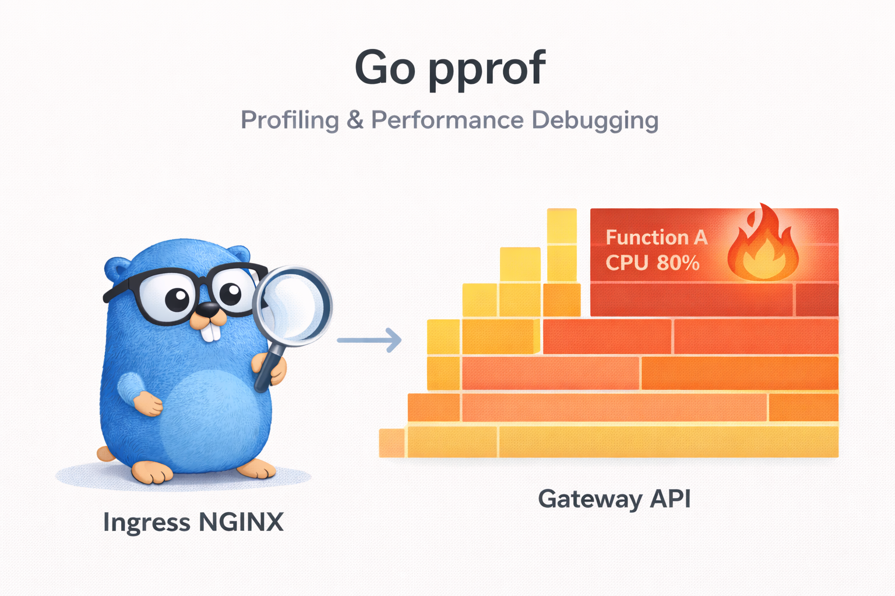
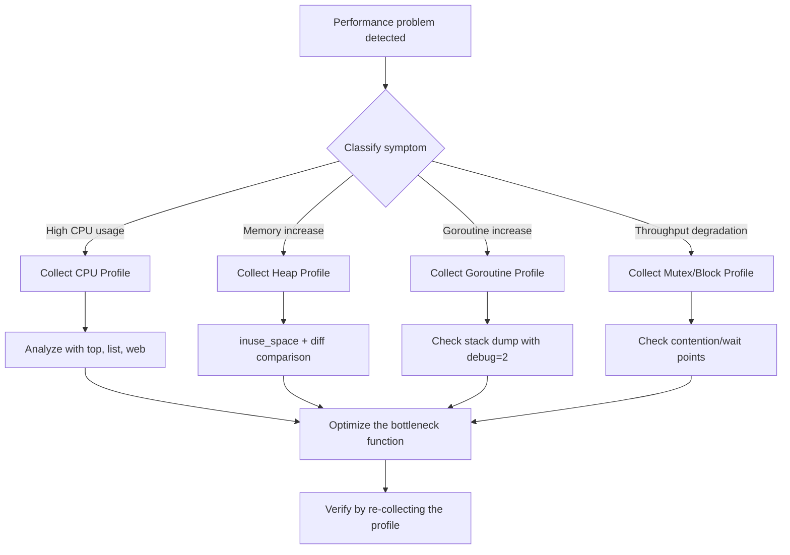

# 1. Overview



## 1.1 What Is Profiling?

Profiling is a technique for measuring and analyzing resource usage patterns — CPU, memory, I/O, and so on — while a program runs. Through profiling, you can accurately identify performance bottlenecks and find the code regions that need optimization.

Without profiling, if you rely on a gut feeling that "it seems slow," you'll waste time optimizing code unrelated to the actual bottleneck. **"Don't optimize without measuring"** is a fundamental principle of software performance analysis.

## 1.2 Why Profiling Matters in Go

Go has runtime-specific concurrency mechanisms such as goroutines, the garbage collector (GC), and channels. These characteristics are powerful, but they can also make it hard to pinpoint the cause of performance problems.

- **Goroutine leaks**: goroutines that never terminate keep piling up and consume memory
- **GC overhead**: GC load caused by excessive heap allocation
- **Mutex contention**: multiple goroutines competing over the same lock, degrading performance
- **Channel blocking**: goroutine stalls caused by waiting on channels

Go has profiling tools to diagnose these problems **built into the standard library**, so you can use them right away without any extra installation.

## 1.3 Introducing the pprof Tools

In Go, profiling is provided mainly through two packages.

| Package | Description | Use Scenario |
|--------|------|-------------|
| `runtime/pprof` | Save profile data to a file | CLI programs, batch jobs |
| `net/http/pprof` | Expose profiling via HTTP endpoints | web servers, long-running processes |

`net/http/pprof` uses `runtime/pprof` internally, and by registering HTTP handlers it lets you connect remotely to a running program to collect profile data. Its overhead is low enough to use safely even in production environments.

# 2. pprof Basic Setup

## 2.1 net/http/pprof - HTTP Endpoint Approach

The simplest method is to import the `net/http/pprof` package. A single blank import (`_`) line automatically registers the profiling HTTP endpoints.

```go
package main

import (
	"fmt"
	"log"
	"net/http"
	"sync"
	"time"

	_ "net/http/pprof" // automatically register pprof endpoints
)

func main() {
	// start the HTTP server for pprof
	go func() {
		log.Println(http.ListenAndServe("localhost:6060", nil))
	}()

	fmt.Println("hello world")
	var wg sync.WaitGroup
	wg.Add(1)
	go leakyFunction(wg)
	wg.Wait()
}

// leakyFunction keeps appending strings to a slice, causing a memory leak.
// As append() repeats, the slice's internal array is reallocated again and again,
// and the previous arrays become GC candidates, but new allocations grow faster, so memory usage keeps increasing.
func leakyFunction(wg sync.WaitGroup) {
	defer wg.Done()
	s := make([]string, 3)
	for i := 0; i < 10000000; i++ {
		s = append(s, "magical pandas") // the slice grows without bound, causing a memory leak
		if (i % 100000) == 0 {
			time.Sleep(500 * time.Millisecond)
		}
	}
}
```

After running the program, if you open `http://localhost:6060/debug/pprof/` in a browser, you can see a profile list like the one below.

| Endpoint | Description |
|-----------|------|
| `/debug/pprof/` | profile index page |
| `/debug/pprof/profile` | CPU profile (default 30 seconds) |
| `/debug/pprof/heap` | heap memory profile |
| `/debug/pprof/goroutine` | goroutine stack traces |
| `/debug/pprof/allocs` | memory allocation profile |
| `/debug/pprof/block` | blocking profile |
| `/debug/pprof/mutex` | mutex contention profile |
| `/debug/pprof/threadcreate` | thread creation profile |
| `/debug/pprof/trace` | execution trace |

## 2.2 runtime/pprof - File Output Approach

In a CLI program or batch job that has no HTTP server, you can use the `runtime/pprof` package to save profile data directly to a file.

### 2.2.1 Saving a CPU Profile File

```go
package main

import (
	"log"
	"os"
	"runtime/pprof"
)

func main() {
	// create the CPU profile file
	f, err := os.Create("cpu.prof")
	if err != nil {
		log.Fatal(err)
	}
	defer f.Close()

	// start CPU profiling
	if err := pprof.StartCPUProfile(f); err != nil {
		log.Fatal(err)
	}
	defer pprof.StopCPUProfile()

	// run the code to be profiled
	heavyComputation()
}

func heavyComputation() {
	result := 0
	for i := 0; i < 100000000; i++ {
		result += i * i
	}
}
```

### 2.2.2 Saving a Heap Memory Profile File

```go
func writeHeapProfile() {
	f, err := os.Create("mem.prof")
	if err != nil {
		log.Fatal(err)
	}
	defer f.Close()

	// save the heap profile
	if err := pprof.WriteHeapProfile(f); err != nil {
		log.Fatal(err)
	}
}
```

The saved profile files are analyzed with the `go tool pprof` command.

```bash
# analyze the CPU profile
go tool pprof cpu.prof

# analyze the memory profile
go tool pprof mem.prof
```

## 2.3 Using with go test -bench

You can collect profile data while running benchmark tests at the same time. This is useful when analyzing the performance of a specific function.

```bash
# collect a CPU profile
go test -bench=. -cpuprofile=cpu.prof

# collect a memory profile
go test -bench=. -memprofile=mem.prof

# collect a blocking profile
go test -bench=. -blockprofile=block.prof

# collect a mutex profile
go test -bench=. -mutexprofile=mutex.prof
```

The way to analyze the collected profile files is the same.

```bash
# analyze the benchmark CPU profile
go tool pprof cpu.prof

# open in the web UI
go tool pprof -http=:8080 cpu.prof
```

# 3. Analysis by Profile Type

Go pprof provides various types of profiles. This chapter looks at the characteristics of each profile type, how to collect it, and concrete examples.

The comprehensive example program below is structured so that all types of profiles can be collected simultaneously.

```go
package main

import (
	"log"
	"net/http"
	_ "net/http/pprof"
	"os"
	"os/signal"
	"runtime"
	"syscall"

	"example.com/profiling/pkg/block"
	"example.com/profiling/pkg/cpu"
	"example.com/profiling/pkg/memory"
	"example.com/profiling/pkg/mutex"
	"example.com/profiling/pkg/threadcreate"
)

func main() {
	// start the pprof HTTP server
	go func() {
		log.Println(http.ListenAndServe("localhost:6060", nil))
	}()

	// blocking/mutex profiles are disabled by default, so they must be explicitly enabled
	runtime.SetBlockProfileRate(1)     // record all blocking events (1 = nanosecond threshold)
	runtime.SetMutexProfileFraction(1) // record all mutex contention (1 = sample with probability 1/1)

	// start goroutines that generate load for each type
	go cpu.IncreaseInt()                  // CPU load (infinite loop computation)
	go cpu.IncreaseIntGoroutine()         // CPU load (nested goroutine)
	go memory.AllocMemory()               // heap memory allocation
	go block.PrintHello()                 // stdout blocking (I/O lock contention)
	go block.PrintWorld()                 // stdout blocking (I/O lock contention)
	go threadcreate.CreateGoroutine1000() // mass goroutine creation → triggers OS thread creation
	go mutex.Mutex01()                    // mutex contention
	go mutex.Mutex02()                    // mutex contention
	go mutex.Mutex03()                    // mutex contention

	// wait for a termination signal
	log.Println("profiling server started: http://localhost:6060/debug/pprof/")
	termSignal := make(chan os.Signal, 1)
	signal.Notify(termSignal, syscall.SIGTERM, syscall.SIGINT)
	<-termSignal
}
```

## 3.1 CPU Profile

A CPU profile identifies the functions that consume the most CPU time in a program. By default it samples 100 times per second, recording the stack trace of the function running at that moment.

### How to Collect

```bash
# collect a CPU profile for 30 seconds
go tool pprof http://localhost:6060/debug/pprof/profile?seconds=30

# collect for 10 seconds
go tool pprof http://localhost:6060/debug/pprof/profile?seconds=10
```

### CPU Load Example Code

```go
package cpu

func IncreaseInt() {
	i := 0
	for {
		i = increase1000(i)
		i = increase2000(i)
	}
}

func IncreaseIntGoroutine() {
	go func() {
		i := 0
		for {
			i = increase1000(i)
			i = increase2000(i)
		}
	}()
}

func increase1000(n int) int {
	for n := 0; n < 1000; n++ {
		n = n + 1
	}
	return n
}

func increase2000(n int) int {
	for n := 0; n < 2000; n++ {
		n = n + 1
	}
	return n
}
```

### Example Analysis Result

```bash
(pprof) top10
Showing nodes accounting for 5.20s, 98.11% of 5.30s total
Showing top 10 nodes out of 23
      flat  flat%   sum%        cum   cum%
     2.08s 39.25% 39.25%      2.08s 39.25%  main.increase2000
     1.52s 28.68% 67.92%      1.52s 28.68%  main.increase1000
     0.80s 15.09% 83.02%      3.60s 67.92%  main.IncreaseInt
     0.60s 11.32% 94.34%      2.12s 40.00%  main.IncreaseIntGoroutine
     ...
```

You can see that the `increase2000` function accounts for about 39% of CPU time, and `increase1000` accounts for about 29%. The difference in loop iteration count (1000 vs 2000) is directly reflected in the CPU time.

## 3.2 Heap Memory Profile (heap)

A heap profile shows the current memory allocation state. It is used to find memory leaks or to identify functions that use a lot of memory.

### How to Collect

```bash
# collect a heap profile
go tool pprof http://localhost:6060/debug/pprof/heap
```

### Memory Allocation Example Code

```go
package memory

import "time"

func AllocMemory() {
	bytes1000 := alloc1000()
	bytes1000[0] = '0'

	for {
		time.Sleep(1 * time.Second)
	}
}

func alloc1000() []byte {
	return make([]byte, 1000)
}
```

### inuse_space vs alloc_space

A heap profile can be analyzed from two perspectives.

| Option | Description | Use |
|------|------|------|
| `inuse_space` | memory currently in use | detecting memory leaks |
| `inuse_objects` | number of objects currently in use | object-count-based analysis |
| `alloc_space` | total memory allocated since program start | allocation frequency analysis |
| `alloc_objects` | total number of objects allocated since program start | allocation count analysis |

```bash
# based on memory currently in use (default)
go tool pprof -inuse_space http://localhost:6060/debug/pprof/heap

# based on total allocated memory
go tool pprof -alloc_space http://localhost:6060/debug/pprof/heap
```

`inuse_space` shows memory that has not been freed by GC and remains in use, so it is mainly used to **detect memory leaks**. `alloc_space` includes already-freed memory as well, so it is useful for finding **code that allocates frequently**.

### Comparing Heap Profiles (diff)

Comparing heap profiles from two points in time makes a memory leak even clearer.

```bash
# collect the base profile
curl -o base.prof http://localhost:6060/debug/pprof/heap

# collect a second profile a little later
curl -o current.prof http://localhost:6060/debug/pprof/heap

# compare the two profiles
go tool pprof -base=base.prof current.prof
```

## 3.3 Goroutine Profile (goroutine)

A goroutine profile shows the stack traces of all currently running goroutines. It is used to detect goroutine leaks or to check which goroutine is blocked where.

### How to Collect

```bash
# collect a goroutine profile
go tool pprof http://localhost:6060/debug/pprof/goroutine

# full stack dump (view in browser)
curl http://localhost:6060/debug/pprof/goroutine?debug=2
```

Using the `debug=2` parameter, you can view the full stack traces of all goroutines in text form, making it easy to see at a glance where each goroutine is waiting.

### Goroutine Leak Example Code

A goroutine leak is the phenomenon where created goroutines never terminate and keep piling up.

```go
package main

import (
	"fmt"
	"log"
	"net/http"
	"time"

	_ "net/http/pprof"
)

func main() {
	go func() {
		log.Println(http.ListenAndServe("localhost:6060", nil))
	}()

	// goroutine leak: waiting on a channel that is never closed
	for i := 0; i < 100; i++ {
		go leakyGoroutine(i)
	}

	// the main goroutine keeps running
	select {}
}

func leakyGoroutine(id int) {
	ch := make(chan struct{}) // a channel nobody closes
	<-ch                     // waits forever -> goroutine leak!
	fmt.Println("never reached", id)
}
```

In the code above, `leakyGoroutine` waits on a channel that nobody closes, so 100 goroutines never terminate and keep occupying memory.

### Goroutine Leak Prevention Pattern

```go
func safeGoroutine(ctx context.Context, id int) {
	ch := make(chan struct{})
	select {
	case <-ch:
		fmt.Println("received", id)
	case <-ctx.Done():
		fmt.Println("cancelled", id)
		return // terminate normally when context is canceled
	}
}
```

Using `context.Context`, you can cancel a goroutine from the outside, which prevents leaks.

## 3.4 Blocking Profile (block)

A blocking profile analyzes the time goroutines spend in a blocking state. It includes channel receive waits, mutex lock waits, I/O waits, and so on.

### How to Enable and Collect

The blocking profile is disabled by default, so it must be explicitly enabled.

```go
// enable the blocking profile (at program startup)
runtime.SetBlockProfileRate(1) // 1 = record all blocking events
```

The argument to `SetBlockProfileRate` is a threshold in nanoseconds. Setting it to `1` records all blocking events; larger values ignore short blocking. In production, set an appropriate value to reduce overhead.

```bash
# collect the blocking profile
go tool pprof http://localhost:6060/debug/pprof/block
```

### Blocking Example Code

```go
package block

import "fmt"

func PrintHello() {
	for {
		fmt.Printf("Hello\n")
	}
}

func PrintWorld() {
	for {
		fmt.Printf("World\n")
	}
}
```

`fmt.Printf` internally acquires a lock on stdout, so when `PrintHello` and `PrintWorld` run simultaneously, blocking occurs over the stdout lock.

## 3.5 Mutex Profile (mutex)

A mutex profile analyzes mutex contention. When multiple goroutines compete over the same mutex, it measures the time each goroutine waited to acquire the lock.

### How to Enable and Collect

```go
// enable the mutex profile
runtime.SetMutexProfileFraction(1) // 1 = record all mutex contention
```

The argument to `SetMutexProfileFraction` is the sampling rate. `1` records all contention events; `N` records with probability 1/N.

```bash
# collect the mutex profile
go tool pprof http://localhost:6060/debug/pprof/mutex
```

### Mutex Contention Example Code

```go
package mutex

import (
	"fmt"
	"sync"
)

var mu = sync.Mutex{}

func Mutex01() {
	for {
		mu.Lock()
		fmt.Printf("Mutex01\n")
		mu.Unlock()
	}
}

func Mutex02() {
	for {
		mu.Lock()
		fmt.Printf("Mutex02\n")
		mu.Unlock()
	}
}

func Mutex03() {
	for {
		mu.Lock()
		fmt.Printf("Mutex03\n")
		mu.Unlock()
	}
}
```

Three goroutines compete over the same `mu` mutex, so the mutex profile records the wait time of each function.

## 3.6 Thread Creation Profile (threadcreate)

A thread creation profile shows the pattern of OS threads the program created. Excessive thread creation wastes system resources, so this is used to monitor it.

### Mass Goroutine Creation Example Code

The Go runtime multiplexes goroutines on top of OS threads to run them. When a goroutine blocks on a system call and the like, the runtime creates a new OS thread so that other goroutines can keep running. Running a large number of goroutines simultaneously lets you observe this thread creation pattern in the profile.

```go
package threadcreate

// CreateGoroutine1000 creates 100,000 goroutines to simulate massive concurrent execution.
// Since the number of goroutines is far greater than GOMAXPROCS, scheduling overhead occurs.
func CreateGoroutine1000() {
	for i := 0; i < 100000; i++ {
		go innerFunc()
	}
}

func innerFunc() {
	n := 0
	for i := 0; i < 1000000; i++ {
		n++
	}
}
```

```bash
# collect the thread creation profile
go tool pprof http://localhost:6060/debug/pprof/threadcreate
```

# 4. Using the pprof Analysis Tools

Once you've collected profile data, you now need to use the analysis tools to find the cause of the performance problem. Go provides a powerful CLI tool and web-based visualization tools.

## 4.1 go tool pprof CLI Interactive Mode

Running `go tool pprof` enters an interactive shell.

```bash
go tool pprof http://localhost:6060/debug/pprof/profile?seconds=10
```

When collection finishes, a `(pprof)` prompt appears, and you can analyze the profile data with various commands.

### Key Commands

| Command | Description | Example |
|--------|------|------|
| `top [N]` | top N resource-consuming functions | `top10` |
| `list <func>` | per-source-line profile info | `list IncreaseInt` |
| `tree` | display as a call tree | `tree` |
| `web` | visualize the call graph in a browser | `web` |
| `peek <func>` | check callers/callees | `peek increase1000` |
| `disasm <func>` | assembly-level profile | `disasm increase2000` |
| `svg` | save the call graph as an SVG file | `svg` |
| `png` | save the call graph as a PNG image | `png` |

### The top Command

```bash
(pprof) top10
Showing nodes accounting for 5.20s, 98.11% of 5.30s total
      flat  flat%   sum%        cum   cum%
     2.08s 39.25% 39.25%      2.08s 39.25%  main.increase2000
     1.52s 28.68% 67.92%      1.52s 28.68%  main.increase1000
     0.80s 15.09% 83.02%      3.60s 67.92%  main.IncreaseInt
```

### The Difference Between flat and cum

These are the two most important metrics in profile analysis.

- **flat**: the time the function spent **directly itself** (excluding calls to lower-level functions)
- **cum** (cumulative): the time including the function + **all the lower-level functions it called**

```
Example:
func A() {        // flat=1s, cum=3s
    doWork(1s)    // 1 second spent in A itself
    B()           // 2 seconds spent calling B
}

func B() {        // flat=2s, cum=2s
    doWork(2s)    // 2 seconds spent in B itself
}
```

- Function A: `flat=1s` (its own work), `cum=3s` (own 1s + B call 2s)
- Function B: `flat=2s` (its own work), `cum=2s` (no lower-level calls)

A **function with high `flat`** is a direct optimization target, while a **function with high `cum`** requires examining the entire call chain.

### The list Command

You can view the source code of a specific function line by line, along with profile information.

```bash
(pprof) list increase2000
Total: 5.30s
ROUTINE ======================== main.increase2000
     2.08s      2.08s (flat, cum) 39.25% of Total
         .          .     27: func increase2000(n int) int {
     2.08s      2.08s     28:     for n := 0; n < 2000; n++ {
         .          .     29:         n = n + 1
         .          .     30:     }
         .          .     31:     return n
         .          .     32: }
```

You can pinpoint that most of the CPU time is spent in the for loop on line 28.

## 4.2 Web UI Visualization

Using the `-http` flag with `go tool pprof`, you can open a browser-based interactive analysis tool.

```bash
# open a profile file in the web UI
go tool pprof -http=:8080 cpu.prof

# open the web UI directly from an HTTP endpoint
go tool pprof -http=:8080 http://localhost:6060/debug/pprof/profile?seconds=10
```

The web UI provides the following views.

### Graph View

Visualizes the call graph. Nodes (rectangles) represent functions, and the size and color of a node are proportional to its resource consumption. Arrows represent call relationships, and the thickness of an arrow is proportional to call frequency.

- **Large node** → a function that consumes a lot of resources
- **Thick arrow** → a frequent call path
- **Red** → high resource consumption

### Flame Graph

You can view the flame graph in the Flame Graph view. A flame graph visually represents the call stack, letting you grasp performance bottlenecks intuitively.

### Top View

Shows the same information as the CLI `top` command, in table form. You can change the sort criterion or filter.

### Source View

Shows profiling results per source line. It's similar to the CLI `list` command, but you can navigate the entire source file.

## 4.3 How to Read a Flame Graph

A flame graph is the most intuitive visualization tool in performance analysis.

```
┌──────────────────────────────────────────────────────┐
│                     main.main                        │ ← root (program entry point)
├────────────────────────┬─────────────────────────────┤
│    main.IncreaseInt    │  main.IncreaseIntGoroutine  │ ← lower-level functions
├───────────┬────────────┼──────────┬──────────────────┤
│increase1000│increase2000│increase1000│  increase2000  │ ← leaf functions
└───────────┴────────────┴──────────┴──────────────────┘
```

- **X-axis**: proportion of samples (the wider, the more time spent in that function)
- **Y-axis**: call stack depth (root at the bottom, leaf at the top)
- **Wide block**: a lot of time spent in that function (and its lower-level functions)
- **Color**: usually random and just for distinction (red does not mean a problem)

**Analysis point**: in a flame graph, find the widest "plateau." A function with a wide plateau is a candidate for a performance bottleneck.

# 5. Hands-On Example: A Performance Problem Diagnosis Workflow

Let's look step by step at the process of diagnosing a real performance problem.

## 5.1 Scenario: Diagnosing a CPU Bottleneck

### The Problem

A particular API response of a web server is slow. We need to find the cause.

### Diagnosis Steps

**Step 1: Collect a CPU profile**

```bash
# collect a CPU profile for 30 seconds
go tool pprof http://localhost:6060/debug/pprof/profile?seconds=30
```

**Step 2: Check hot spots with top**

```bash
(pprof) top10
Showing nodes accounting for 5.20s, 98.11% of 5.30s total
      flat  flat%   sum%        cum   cum%
     2.08s 39.25% 39.25%      2.08s 39.25%  main.increase2000
     1.52s 28.68% 67.92%      1.52s 28.68%  main.increase1000
```

→ the `increase2000` function accounts for 39% of CPU time

**Step 3: Per-line analysis with list**

```bash
(pprof) list increase2000
```

→ confirm that the for loop is the bottleneck

**Step 4: Check the call graph with web**

```bash
(pprof) web
```

→ visually check the call chain to figure out which path calls the function

### Verification After Optimization

After optimization, run the same profiling to measure the improvement.

```bash
# compare the profiles before and after optimization
go tool pprof -base=before.prof after.prof
```

## 5.2 Scenario: Diagnosing a Memory Leak

### The Problem

While the service runs in production, memory usage keeps increasing over time.

### Diagnosis Steps

**Step 1: Collect heap profiles from two points in time**

```bash
# point 1: right after service start
curl -o heap_t1.prof http://localhost:6060/debug/pprof/heap

# point 2: after some time has passed
curl -o heap_t2.prof http://localhost:6060/debug/pprof/heap
```

**Step 2: Compare the two profiles**

```bash
# check the memory that increased in t2 relative to t1
go tool pprof -base=heap_t1.prof heap_t2.prof
```

**Step 3: Identify the leak point with inuse_space**

```bash
(pprof) top10 -inuse_space
```

→ find the function that allocates memory that is never freed over time

**Step 4: Check and fix the source code**

```bash
(pprof) list leakyFunction
```

→ identify and fix patterns such as a slice being appended without bound

## 5.3 Scenario: Diagnosing a Goroutine Leak

### The Problem

The number of goroutines keeps increasing over time.

### Diagnosis Steps

**Step 1: Check the current goroutine count**

```bash
# check the goroutine count
curl http://localhost:6060/debug/pprof/goroutine?debug=1 | head -1
```

**Step 2: Check goroutine stack traces**

```bash
# full goroutine stack dump
curl http://localhost:6060/debug/pprof/goroutine?debug=2
```

**Step 3: Identify goroutines waiting at the same location**

```
goroutine 18 [chan receive]:
main.leakyGoroutine(0x0)
    /app/main.go:25 +0x34
...

goroutine 19 [chan receive]:
main.leakyGoroutine(0x1)
    /app/main.go:25 +0x34
```

→ if many goroutines are found waiting on a channel receive at the same location (`main.go:25`), suspect a leak

**Step 4: Manage the goroutine lifecycle with context.Context**

```go
// before: goroutine leak
go func() {
    <-ch // waits forever
}()

// after: cancelable with context
go func(ctx context.Context) {
    select {
    case <-ch:
        // normal processing
    case <-ctx.Done():
        return // normal termination
    }
}(ctx)
```

# 6. Integrating pprof with the Echo Framework

To use pprof in a production web server, you need to know how to integrate it with your framework. When using the Echo framework, you can use the `echo-pprof` library.

```go
package main

import (
	"fmt"
	"net/http"
	"time"

	"github.com/labstack/echo/v4"
	echopprof "github.com/sevenNt/echo-pprof"
)

func main() {
	e := echo.New()
	echopprof.Wrap(e) // register pprof endpoints

	e.GET("/hello", helloHandler)
	e.POST("/stress/cpu", cpuHandler)
	e.POST("/stress/memory", memoryHandler)

	e.Logger.Fatal(e.Start(":8080"))
}

func helloHandler(ctx echo.Context) error {
	return ctx.JSON(http.StatusOK, map[string]string{
		"message": "Hello World",
	})
}
```

A single `echopprof.Wrap(e)` line registers pprof endpoints on the Echo server, accessible at `http://localhost:8080/debug/pprof/`.

### Security Considerations in Production

The pprof endpoints expose the internal state of the program, so in production environments you should separate them onto a dedicated port and block external access.

```go
func main() {
	// main server (publicly exposed)
	e := echo.New()
	e.GET("/api/hello", helloHandler)
	go e.Start(":8080")

	// pprof server (internal only, separate port)
	pprofMux := http.NewServeMux()
	pprofMux.HandleFunc("/debug/pprof/", http.DefaultServeMux.ServeHTTP)
	go http.ListenAndServe("localhost:6060", nil) // bind to localhost only
}
```

# 7. Useful Auxiliary Tools

## 7.1 gops

[gops](https://github.com/google/gops) is a tool for monitoring running Go processes.

```bash
# install gops
go install github.com/google/gops@latest
```

Add the gops agent to your program.

```go
import "github.com/google/gops/agent"

func main() {
	if err := agent.Listen(agent.Options{}); err != nil {
		log.Fatal(err)
	}
	// ...
}
```

You can query process information with gops.

```bash
# list running Go processes
gops

# query information about a specific process
gops <pid>

# check GC stats
gops gc <pid>

# memory stats
gops memstats <pid>

# current stack trace
gops stack <pid>

# collect a pprof CPU profile
gops pprof-cpu <pid>

# collect a pprof heap profile
gops pprof-heap <pid>
```

## 7.2 go tool trace

`go tool trace` is a tool that traces a program's execution flow along a time axis. If pprof focuses on "where time was spent," trace focuses on "what happened in chronological order."

### Collecting Trace Data

```bash
# collect a trace for 5 seconds from an HTTP endpoint
curl -o trace.out http://localhost:6060/debug/pprof/trace?seconds=5

# open the trace viewer
go tool trace trace.out
```

### Collecting a Trace in Code

Basic trace collection can be implemented simply with `trace.Start` and `trace.Stop`.

```go
package main

import (
	"os"
	"runtime/trace"
)

func main() {
	f, _ := os.Create("trace.out")
	defer f.Close()

	trace.Start(f)
	defer trace.Stop()

	// program code...
}
```

### Per-Section Tracing with Task and Region

Using `trace.NewTask` and `trace.WithRegion`, you can logically separate specific work sections in the trace viewer. This is useful in complex programs for figuring out which work spends time in which section.

```go
func worker(ctx context.Context, id int) {
	// Task: defines a logical unit of work (grouped and displayed in the trace viewer)
	ctx, task := trace.NewTask(ctx, fmt.Sprintf("worker-%d", id))
	defer task.End()

	// Region: defines a detailed section within a Task
	trace.WithRegion(ctx, "compute", func() {
		// CPU computation work...
	})

	trace.WithRegion(ctx, "channel-work", func() {
		// channel communication work...
	})

	// Log: records a user-defined log into the trace
	trace.Log(ctx, "status", fmt.Sprintf("worker-%d completed", id))
}
```

### Information You Can See in the Trace Viewer

- **Goroutine analysis**: distribution of execution/wait time per goroutine
- **Network/Sync blocking**: network and synchronization blocking events
- **Syscall blocking**: system call blocking
- **Scheduler latency**: scheduler delay time
- **GC events**: garbage collection event timeline

## 7.3 benchstat

[benchstat](https://pkg.go.dev/golang.org/x/perf/cmd/benchstat) is a tool that statistically compares Go benchmark results.

```bash
# install benchstat
go install golang.org/x/perf/cmd/benchstat@latest

# run benchmarks before optimization (10 repetitions)
go test -bench=. -count=10 > old.txt

# perform code optimization...

# run benchmarks after optimization (10 repetitions)
go test -bench=. -count=10 > new.txt

# compare the results
benchstat old.txt new.txt
```

Example output:

```
name          old time/op  new time/op  delta
Increase-8    1.23µs ± 2%  0.45µs ± 1%  -63.41% (p=0.000 n=10+10)
```

You can check the performance improvement ratio in the `delta` column. If the `p` value is below 0.05, the difference is statistically significant.

# 8. Tips for Using pprof in Production

## 8.1 Overhead

| Profile Type | Overhead | Can Be Always-On? |
|-------------|---------|-------------------|
| CPU | about 5% performance impact (only during collection) | collect only when needed |
| Heap | very low | can be always-on |
| Goroutine | very low | can be always-on |
| Block | depends on settings | sampling rate adjustment needed |
| Mutex | depends on settings | sampling rate adjustment needed |

Importing `net/http/pprof` itself has no performance impact. Overhead occurs only when you actually collect profile data.

## 8.2 Security

- Separate the pprof endpoints onto a **dedicated port** and block external access
- Bind only to `localhost` to allow local access only
- Add authentication middleware if needed
- In Kubernetes environments, access via `port-forward`

```bash
# access pprof in Kubernetes
kubectl port-forward pod/my-app-xxx 6060:6060

# profile locally
go tool pprof http://localhost:6060/debug/pprof/heap
```

## 8.3 Continuous Profiling

To catch intermittent performance problems in production, you need a tool that continuously collects profiles.

- **[Pyroscope](https://pyroscope.io/)**: an open-source continuous profiling platform
- **[Google Cloud Profiler](https://cloud.google.com/profiler)**: a GCP-based profiling service
- **[Datadog Continuous Profiler](https://www.datadoghq.com/product/code-profiling/)**: integrated with monitoring tools

These tools periodically collect profiles in the background and store them as time-series data, letting you compare and analyze the performance state at past points in time.

# 9. Summary

## Use Scenarios by Profile Type

| Symptom | Suspected Cause | Profile to Use | Analysis Point |
|------|----------|---------------|------------|
| Slow API response | CPU bottleneck | CPU profile | check hot spots with `top`, `list` |
| Increasing memory usage | memory leak | Heap profile | `inuse_space` + diff comparison |
| Increasing goroutine count | goroutine leak | Goroutine profile | check stack dump with `debug=2` |
| Throughput degradation | lock contention | Mutex profile | check contention points |
| Intermittent latency | blocking | Block profile | analyze wait times |
| Too many threads | excessive thread creation | Threadcreate profile | check creation pattern |
| Understand the overall flow | scheduling/GC issues | Trace | timeline analysis |

## Diagnosis Workflow Summary



The code written in this post is available on [github](https://github.com/kenshin579/tutorials-go/tree/master/golang/profiling).

# 10. References

- https://pkg.go.dev/net/http/pprof
- https://pkg.go.dev/runtime/pprof
- https://go.dev/blog/pprof
- https://go.dev/doc/diagnostics
- https://github.com/google/pprof
- https://github.com/google/gops
- https://jvns.ca/blog/2017/09/24/profiling-go-with-pprof/
- https://www.practical-go-lessons.com/chap-36-program-profiling
