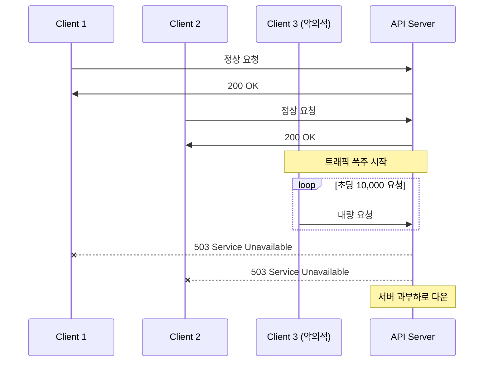
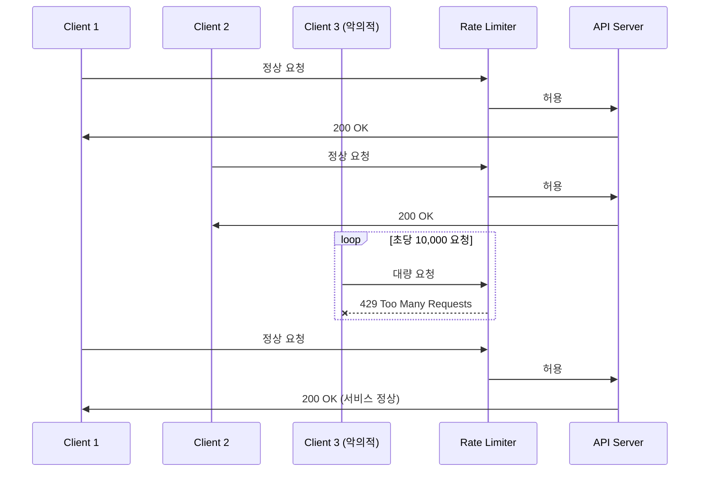
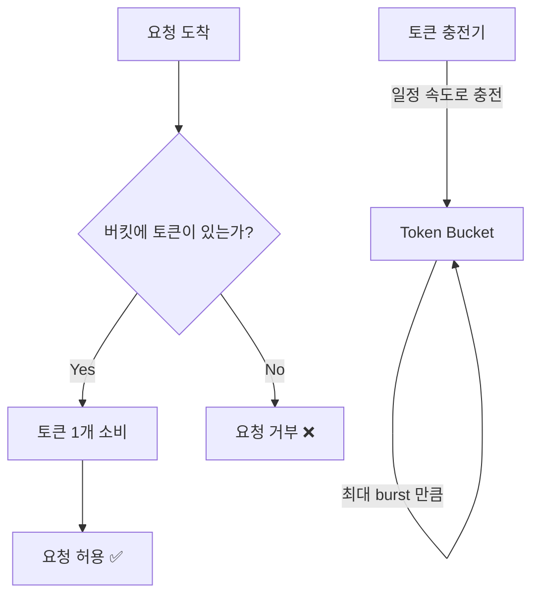
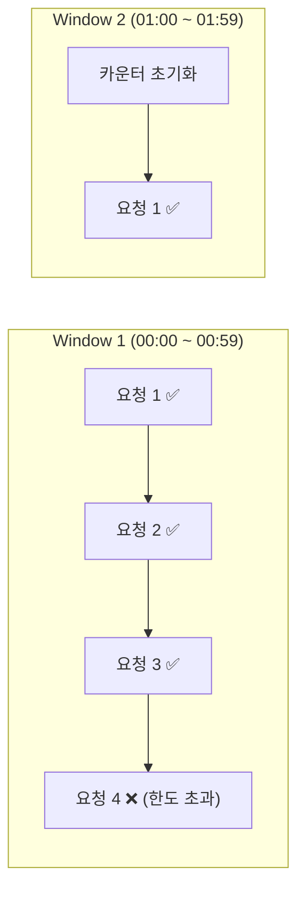
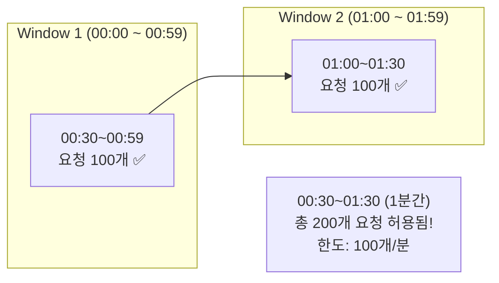
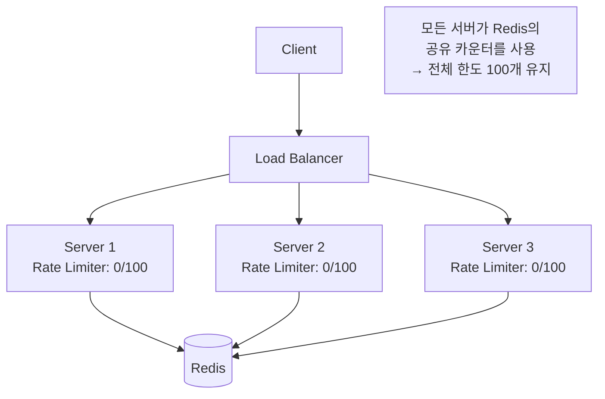
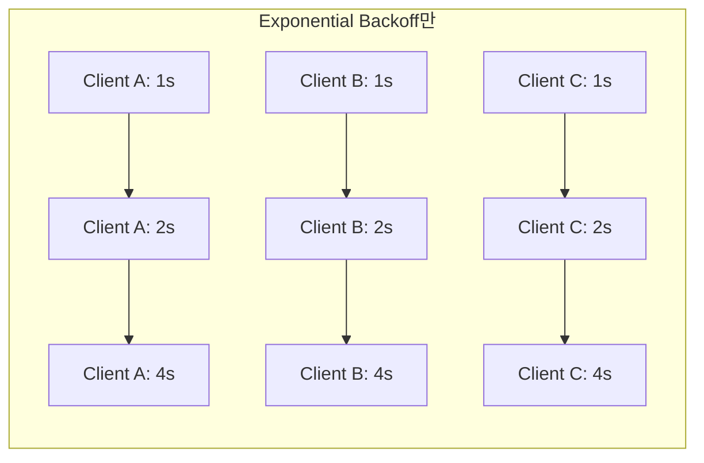
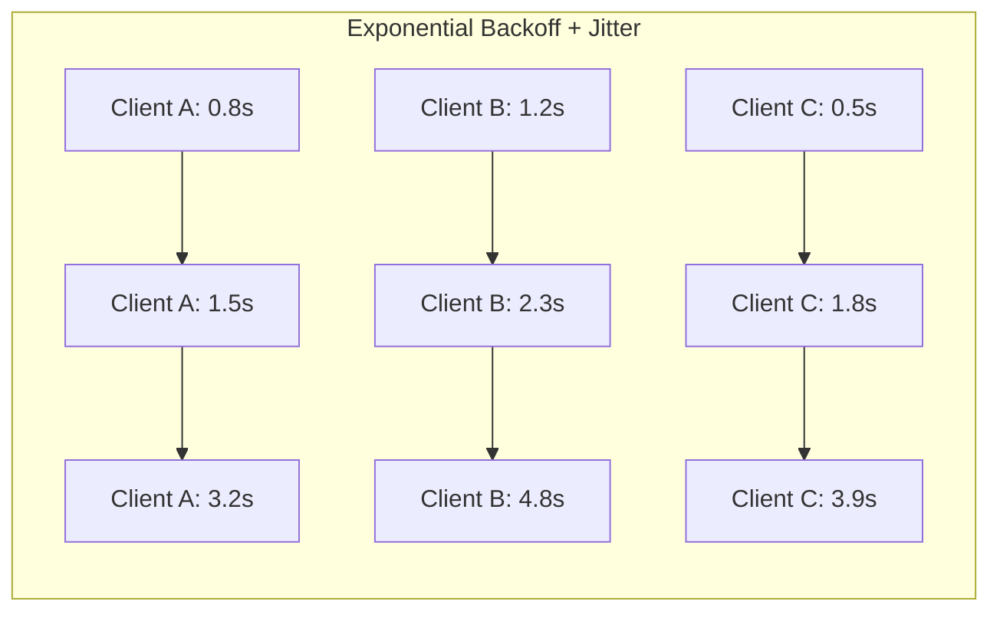

API 서버를 운영하다 보면 예상치 못한 트래픽 폭주로 서비스가 다운되는 상황을 겪게 된다. Rate Limiting은 이런 상황을 방지하는 첫 번째 방어선이다. 이 글에서는 Rate Limiting의 주요 알고리즘을 이론 중심으로 살펴보고, Go로 구현하는 방법을 단일 인스턴스부터 분산 환경까지 다룬다. 마지막으로 Rate Limit 응답을 받은 클라이언트의 Retry 전략도 함께 알아본다.

# 1. Rate Limiting이란?

Rate Limiting은 일정 시간 동안 허용되는 요청 수를 제한하는 기술이다. 서버가 처리할 수 있는 용량을 초과하는 요청이 들어오면, 나머지 요청을 거부하거나 대기시켜 서비스 안정성을 확보한다.

## 1.1 왜 필요한가?

- **DDoS 방어**: 악의적인 대량 트래픽을 차단한다
- **API 남용 방지**: 특정 사용자가 API를 독점하는 것을 막는다
- **공정한 리소스 분배**: 모든 사용자에게 균등한 서비스 품질을 보장한다
- **비용 제어**: 클라우드 환경에서 과도한 리소스 사용을 방지한다

## 1.2 Rate Limiting이 없으면?

Rate Limiting이 없는 서버는 트래픽 폭주 시 모든 요청을 처리하려다 과부하로 전체 서비스가 다운된다.



반면 Rate Limiting이 적용된 서버는 과도한 요청을 거부하면서도 정상 사용자에게는 서비스를 유지한다.



# 2. Rate Limiting 알고리즘

Rate Limiting을 구현하는 대표적인 알고리즘 5가지를 살펴보자.

## 2.1 Token Bucket

가장 널리 사용되는 알고리즘이다. 버킷에 토큰이 일정 속도로 충전되고, 요청마다 토큰을 하나씩 소비한다. 토큰이 없으면 요청을 거부한다.



**핵심 파라미터:**
- **Rate**: 초당 토큰 충전 속도 (예: 10 tokens/sec)
- **Burst**: 버킷 최대 용량 (예: 20 tokens)

**장점**: 구현이 간단하고, burst 트래픽을 허용한다.
**단점**: 단일 파라미터로 세밀한 제어가 어렵다.

## 2.2 Leaky Bucket

물이 새는 양동이처럼, 요청을 큐에 넣고 일정 속도로만 처리한다. 큐가 가득 차면 새 요청은 버린다.

Token Bucket이 **입력**을 제어한다면, Leaky Bucket은 **출력** 속도를 제어한다.

| 비교 항목 | Token Bucket | Leaky Bucket |
|----------|-------------|-------------|
| 버스트 허용 | O (버킷 용량만큼) | X (일정 속도만) |
| 출력 속도 | 가변적 | 일정 |
| 주요 용도 | API Rate Limiting | 트래픽 쉐이핑 |
| 구현 복잡도 | 낮음 | 낮음 |

**장점**: 출력 속도가 균일하여 downstream 서비스 보호에 적합하다.
**단점**: 버스트 트래픽을 허용하지 않아, 순간적인 트래픽 처리가 비효율적이다.

## 2.3 Fixed Window Counter

고정된 시간 창(예: 1분) 내에서 요청 수를 카운트한다. 시간 창이 바뀌면 카운터를 초기화한다.



**장점**: 구현이 가장 간단하고 메모리 효율적이다.
**단점**: **경계 문제(boundary problem)** 가 있다.

### 2.3.1 경계 문제

윈도우 경계 시점에 요청이 집중되면, 실질적으로 한도의 2배까지 허용될 수 있다.



## 2.4 Sliding Window Log

각 요청의 타임스탬프를 로그로 기록하고, 현재 시점에서 윈도우 크기만큼 뒤를 확인하여 요청 수를 계산한다. Fixed Window의 경계 문제를 해결한다.

**동작 방식:**
1. 새 요청이 오면 타임스탬프를 로그에 추가
2. 윈도우 범위 밖의 오래된 로그를 삭제
3. 남은 로그 수가 한도 이내인지 확인

**장점**: 가장 정확한 제한이 가능하다.
**단점**: 모든 요청의 타임스탬프를 저장하므로 메모리 사용량이 많다.

## 2.5 Sliding Window Counter

Fixed Window Counter와 Sliding Window Log의 장점을 결합한 하이브리드 방식이다. 이전 윈도우의 가중치를 현재 윈도우에 반영하여 경계 문제를 완화한다.

**계산 공식:**

```
현재 요청 수 = 이전 윈도우 카운터 × 겹치는 비율 + 현재 윈도우 카운터
```

**예시:** 한도 100개/분, 현재 시각 01:15
- 이전 윈도우(00:00~00:59): 84개
- 현재 윈도우(01:00~01:59): 36개
- 겹치는 비율: (60-15)/60 = 0.75
- 추정 요청 수: 84 × 0.75 + 36 = **99개** → 허용

**장점**: 정확하면서도 메모리 효율적이다. 실무에서 가장 많이 사용한다.
**단점**: 정확한 값이 아닌 근사치를 사용한다.

## 2.6 알고리즘 비교 요약표

| 알고리즘 | 정확도 | 메모리 | 버스트 허용 | 구현 복잡도 | 실무 추천 |
|---------|-------|--------|-----------|-----------|---------|
| Token Bucket | 중 | 낮음 | O | 낮음 | ⭐⭐⭐ |
| Leaky Bucket | 중 | 낮음 | X | 낮음 | ⭐⭐ |
| Fixed Window Counter | 낮음 | 매우 낮음 | X | 매우 낮음 | ⭐ |
| Sliding Window Log | 높음 | 높음 | X | 중간 | ⭐⭐ |
| Sliding Window Counter | 중상 | 낮음 | X | 중간 | ⭐⭐⭐ |

# 3. Go로 Rate Limiting 구현하기

## 3.1 golang.org/x/time/rate (표준 확장 라이브러리)

Go의 준표준 라이브러리인 `x/time/rate`는 **Token Bucket** 알고리즘을 구현한다. `rate.NewLimiter(r, b)`로 생성하며, `r`은 초당 토큰 충전 속도, `b`는 최대 버스트 크기이다.

3가지 사용 방식을 제공한다:

### 3.1.1 Allow() - 즉시 판단 (비차단)

토큰이 있으면 `true`, 없으면 `false`를 즉시 반환한다. 빠른 거부가 필요한 경우에 사용한다.

```go
type RateLimiter struct {
    limiter *rate.Limiter
}

func NewRateLimiter(r rate.Limit, burst int) *RateLimiter {
    return &RateLimiter{limiter: rate.NewLimiter(r, burst)}
}

func (rl *RateLimiter) Allow() bool {
    return rl.limiter.Allow()
}
```

```go
// 초당 10개, 버스트 3
rl := NewRateLimiter(rate.Limit(10), 3)

if rl.Allow() {
    // 요청 처리
} else {
    // 429 Too Many Requests
}
```

### 3.1.2 Wait(ctx) - 대기 후 처리 (차단)

토큰이 가용할 때까지 블로킹한다. 큐잉 처리가 필요한 경우에 사용한다.

```go
func (rl *RateLimiter) Wait(ctx context.Context) error {
    return rl.limiter.Wait(ctx)
}
```

```go
ctx, cancel := context.WithTimeout(context.Background(), 5*time.Second)
defer cancel()

if err := rl.Wait(ctx); err != nil {
    // 타임아웃 또는 컨텍스트 취소
    return
}
// 요청 처리
```

### 3.1.3 Reserve() - 예약 후 대기 시간 확인

토큰을 예약하고 대기 시간을 반환한다. 세밀한 제어가 필요한 경우에 사용한다.

```go
func (rl *RateLimiter) Reserve() *rate.Reservation {
    return rl.limiter.Reserve()
}
```

```go
r := rl.Reserve()
if !r.OK() {
    return // 허용 불가
}
time.Sleep(r.Delay()) // 필요한 만큼 대기
// 요청 처리
```

## 3.2 HTTP 미들웨어로 적용

실무에서는 Rate Limiter를 HTTP 미들웨어로 적용한다. Echo 프레임워크 기준으로 IP별 Rate Limiting을 구현하는 예제이다.

```go
type RateLimitConfig struct {
    Rate    rate.Limit
    Burst   int
    Skipper middleware.Skipper
}

func RateLimitMiddleware(config RateLimitConfig) echo.MiddlewareFunc {
    var clients sync.Map

    return func(next echo.HandlerFunc) echo.HandlerFunc {
        return func(c echo.Context) error {
            if config.Skipper != nil && config.Skipper(c) {
                return next(c)
            }

            ip := c.RealIP()
            v, _ := clients.LoadOrStore(ip, rate.NewLimiter(config.Rate, config.Burst))
            limiter := v.(*rate.Limiter)

            if !limiter.Allow() {
                return c.JSON(http.StatusTooManyRequests, map[string]string{
                    "error": "rate limit exceeded",
                })
            }

            return next(c)
        }
    }
}
```

**핵심 포인트:**
- `sync.Map`으로 IP별 리미터를 관리한다 (동시성 안전)
- `LoadOrStore`로 첫 요청 시 리미터를 생성하고, 이후에는 기존 리미터를 재사용한다
- 한도 초과 시 `429 Too Many Requests`를 반환한다
- `Skipper`로 특정 경로(예: health check)를 제외할 수 있다

사용 예시:

```go
e := echo.New()
e.Use(RateLimitMiddleware(RateLimitConfig{
    Rate:  rate.Limit(10), // 초당 10개
    Burst: 20,             // 버스트 20개
    Skipper: func(c echo.Context) bool {
        return c.Path() == "/health"
    },
}))
```

# 4. 분산 Rate Limiting

## 4.1 왜 분산 Rate Limiting인가?

단일 인스턴스 Rate Limiter는 서버 한 대에서만 동작한다. 서버를 여러 대로 수평 확장(scale-out)하면 각 서버가 독립적으로 Rate Limiting을 수행하므로, 실제 한도의 N배(서버 수)만큼 요청이 허용될 수 있다.



Redis를 중앙 저장소로 사용하면 모든 서버가 하나의 카운터를 공유하여, 전체 시스템 차원의 Rate Limiting이 가능하다.

## 4.2 go-redis/redis_rate

`go-redis/redis_rate` 라이브러리는 **GCRA(Generic Cell Rate Algorithm)** 를 기반으로 Redis에서 분산 Rate Limiting을 구현한다.

```go
type DistributedRateLimiter struct {
    limiter *redis_rate.Limiter
}

func NewDistributedRateLimiter(rdb *redis.Client) *DistributedRateLimiter {
    return &DistributedRateLimiter{
        limiter: redis_rate.NewLimiter(rdb),
    }
}

func (d *DistributedRateLimiter) Allow(ctx context.Context, key string, limit redis_rate.Limit) (*redis_rate.Result, error) {
    return d.limiter.Allow(ctx, key, limit)
}
```

사용 예시:

```go
rdb := redis.NewClient(&redis.Options{Addr: "localhost:6379"})
limiter := NewDistributedRateLimiter(rdb)

// 초당 10개 허용
result, err := limiter.Allow(ctx, "rate:user:123", redis_rate.PerSecond(10))
if err != nil {
    return err
}

if result.Allowed > 0 {
    // 요청 처리
} else {
    // 429 + Retry-After 헤더
    retryAfter := result.RetryAfter
}
```

**GCRA란?**

GCRA(Generic Cell Rate Algorithm)는 ATM 네트워크에서 유래한 알고리즘으로, 가상의 스케줄링 시간(TAT: Theoretical Arrival Time)을 기반으로 요청 허용 여부를 결정한다. Token Bucket의 변형으로 볼 수 있으며, Redis의 단일 키만으로 상태를 관리할 수 있어 분산 환경에 적합하다.

## 4.3 Redis Lua Script 기반 Sliding Window

`redis_rate` 외에 Lua 스크립트를 직접 작성하여 Sliding Window Counter를 구현할 수도 있다. Redis의 Lua 스크립트는 원자적으로 실행되므로 race condition이 발생하지 않는다.

```lua
-- Sliding Window Rate Limiter (Lua Script)
local key = KEYS[1]
local window = tonumber(ARGV[1])  -- 윈도우 크기 (초)
local limit = tonumber(ARGV[2])   -- 최대 허용 수
local now = tonumber(ARGV[3])     -- 현재 타임스탬프

-- 윈도우 밖의 오래된 항목 제거
redis.call('ZREMRANGEBYSCORE', key, 0, now - window)

-- 현재 윈도우 내 요청 수 확인
local count = redis.call('ZCARD', key)

if count < limit then
    -- 허용: 현재 타임스탬프를 추가
    redis.call('ZADD', key, now, now .. '-' .. math.random())
    redis.call('EXPIRE', key, window)
    return 1  -- allowed
else
    return 0  -- denied
end
```

**동작 방식:**
1. `ZREMRANGEBYSCORE`로 윈도우 밖의 오래된 요청을 제거한다
2. `ZCARD`로 현재 윈도우 내 요청 수를 확인한다
3. 한도 이내면 `ZADD`로 새 요청을 추가한다
4. 모든 연산이 Lua 스크립트 내에서 원자적으로 실행된다

# 5. Retry 패턴

## 5.1 왜 Retry가 필요한가?

분산 시스템에서는 일시적 장애(transient fault)가 불가피하다. 네트워크 타임아웃, Rate Limit 응답(429), 서버 과부하(503) 등은 잠시 후 재시도하면 성공할 수 있다.

하지만 단순히 즉시 재시도하면 **Thundering Herd** 문제가 발생한다. 수많은 클라이언트가 동시에 재시도하여 서버에 더 큰 부하를 가하는 것이다. 이를 방지하기 위해 Backoff 전략이 필요하다.

## 5.2 Backoff 전략

### 5.2.1 Fixed Delay

일정 간격으로 재시도한다. 가장 단순하지만, Thundering Herd에 취약하다.

```
시도 1 → 1초 대기 → 시도 2 → 1초 대기 → 시도 3
```

### 5.2.2 Exponential Backoff

대기 시간을 지수적으로 증가시킨다. Google, AWS 등 대부분의 클라우드 서비스가 권장하는 방식이다.

```
시도 1 → 1초 대기 → 시도 2 → 2초 대기 → 시도 3 → 4초 대기 → 시도 4 → 8초 대기
```

### 5.2.3 Exponential Backoff + Jitter

Exponential Backoff에 랜덤 요소(Jitter)를 추가하여, 여러 클라이언트의 재시도 시점을 분산시킨다.





**Jitter 종류:**
- **Full Jitter**: `sleep = random(0, base * 2^attempt)` - 가장 많이 사용
- **Equal Jitter**: `sleep = base * 2^attempt / 2 + random(0, base * 2^attempt / 2)`
- **Decorrelated Jitter**: `sleep = random(base, prev_sleep * 3)`

## 5.3 Go 구현

### 5.3.1 cenkalti/backoff/v5

Exponential Backoff을 깔끔하게 구현한 라이브러리다. v5에서 제네릭을 지원한다.

```go
func RetryWithExponentialBackoff(ctx context.Context, operation func() error, maxElapsed time.Duration) error {
    _, err := backoff.Retry(ctx, func() (struct{}, error) {
        return struct{}{}, operation()
    },
        backoff.WithBackOff(backoff.NewExponentialBackOff()),
        backoff.WithMaxElapsedTime(maxElapsed),
    )
    return err
}
```

사용 예시:

```go
err := RetryWithExponentialBackoff(ctx, func() error {
    resp, err := http.Get("https://api.example.com/data")
    if err != nil {
        return err // 재시도
    }
    if resp.StatusCode == 429 {
        return fmt.Errorf("rate limited") // 재시도
    }
    return nil // 성공
}, 30*time.Second)
```

### 5.3.2 avast/retry-go/v4

더 풍부한 옵션을 제공하는 Retry 라이브러리다. Jitter, RetryIf 조건, OnRetry 콜백 등을 지원한다.

```go
func RetryWithJitter(ctx context.Context, fn retry.RetryableFunc, maxAttempts uint, opts ...retry.Option) error {
    defaultOpts := []retry.Option{
        retry.Attempts(maxAttempts),
        retry.DelayType(retry.BackOffDelay),
        retry.Context(ctx),
        retry.MaxJitter(1 * time.Second),
    }
    return retry.Do(fn, append(defaultOpts, opts...)...)
}
```

사용 예시:

```go
err := RetryWithJitter(ctx, func() error {
    return callExternalAPI()
}, 5,
    retry.RetryIf(func(err error) bool {
        // 일시적 오류만 재시도
        return errors.Is(err, ErrTransient)
    }),
    retry.OnRetry(func(n uint, err error) {
        log.Printf("retry #%d: %v", n, err)
    }),
)
```

# 6. 테스트

## 6.1 Rate Limiter 테스트

Rate Limiter는 시간에 의존하는 코드이므로, 테스트 시 주의가 필요하다.

```go
func TestRateLimiter_Allow(t *testing.T) {
    // 1 token/sec, burst 3
    rl := NewRateLimiter(rate.Limit(1), 3)

    // Burst 3개까지는 즉시 허용
    assert.True(t, rl.Allow())
    assert.True(t, rl.Allow())
    assert.True(t, rl.Allow())

    // Burst 소진 후 거부
    assert.False(t, rl.Allow())
}
```

## 6.2 Retry 테스트

실패 후 성공하는 시나리오를 `atomic.Int32`로 시도 횟수를 추적하여 테스트한다.

```go
func TestRetryWithExponentialBackoff_Success(t *testing.T) {
    var attempts atomic.Int32

    err := RetryWithExponentialBackoff(context.Background(), func() error {
        if attempts.Add(1) < 3 {
            return errTransient
        }
        return nil // 3번째에 성공
    }, 5*time.Second)

    require.NoError(t, err)
    assert.Equal(t, int32(3), attempts.Load())
}
```

## 6.3 동시성 테스트

goroutine으로 동시 요청을 시뮬레이션하여 Rate Limiter의 동시성 안전성을 검증한다.

```go
func TestRateLimiter_Concurrency(t *testing.T) {
    // 100 tokens/sec, burst 10
    rl := NewRateLimiter(rate.Limit(100), 10)

    var allowed atomic.Int64
    done := make(chan struct{})

    for i := 0; i < 50; i++ {
        go func() {
            if rl.Allow() {
                allowed.Add(1)
            }
            done <- struct{}{}
        }()
    }

    for i := 0; i < 50; i++ {
        <-done
    }

    // Burst 10이므로 최대 10개 허용
    assert.True(t, allowed.Load() <= 10)
    assert.True(t, allowed.Load() > 0)
}
```

# 7. 마무리

이 글에서 다룬 내용을 정리하면:

- **Rate Limiting 알고리즘**: Token Bucket, Leaky Bucket, Fixed Window, Sliding Window Log, Sliding Window Counter - 각각의 장단점과 사용 시나리오가 다르다
- **Go 구현**: `x/time/rate`로 단일 인스턴스, `go-redis/redis_rate`로 분산 환경의 Rate Limiting을 구현할 수 있다
- **HTTP 미들웨어**: IP별 Rate Limiting을 미들웨어로 적용하여 비즈니스 로직과 분리한다
- **Retry 패턴**: Exponential Backoff + Jitter로 Thundering Herd를 방지하면서 안전하게 재시도한다

실무에서는 단일 인스턴스로 시작하여, 서비스가 확장됨에 따라 Redis 기반 분산 Rate Limiting으로 전환하는 것을 권장한다.

> 전체 샘플 코드: [GitHub - tutorials-go/golang/resilience/](https://github.com/kenshin579/tutorials-go/tree/master/golang/resilience)

# 8. 참고

- [Token bucket - Wikipedia](https://en.wikipedia.org/wiki/Token_bucket)
- [Rate Limiting - System Design](https://bytebytego.com/courses/system-design-interview/design-a-rate-limiter)
- [golang.org/x/time/rate](https://pkg.go.dev/golang.org/x/time/rate)
- [go-redis/redis_rate](https://github.com/go-redis/redis_rate)
- [cenkalti/backoff](https://github.com/cenkalti/backoff)
- [avast/retry-go](https://github.com/avast/retry-go)
- [Exponential Backoff And Jitter - AWS Architecture Blog](https://aws.amazon.com/blogs/architecture/exponential-backoff-and-jitter/)
