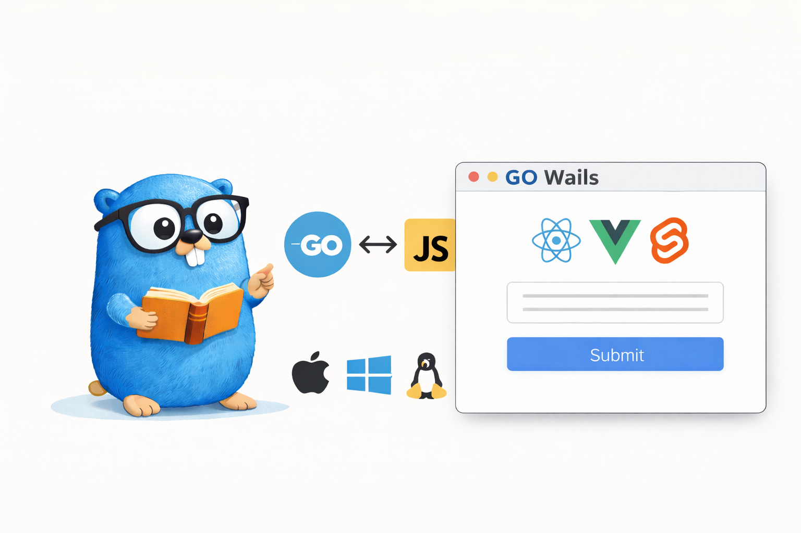
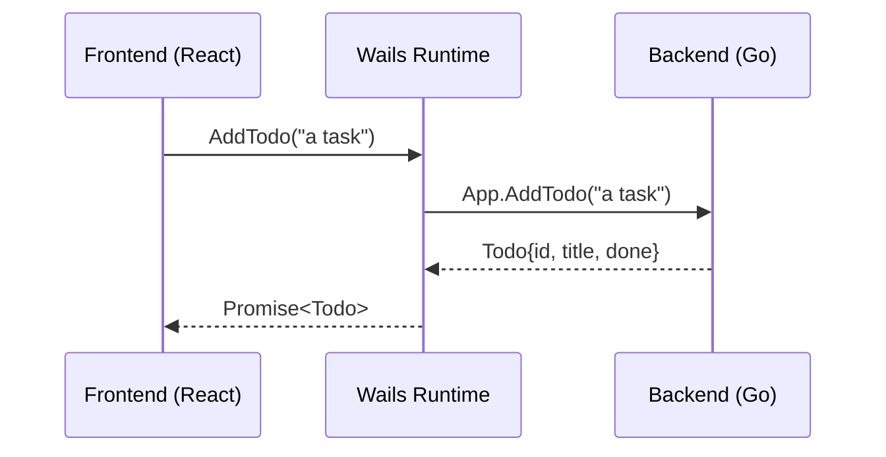
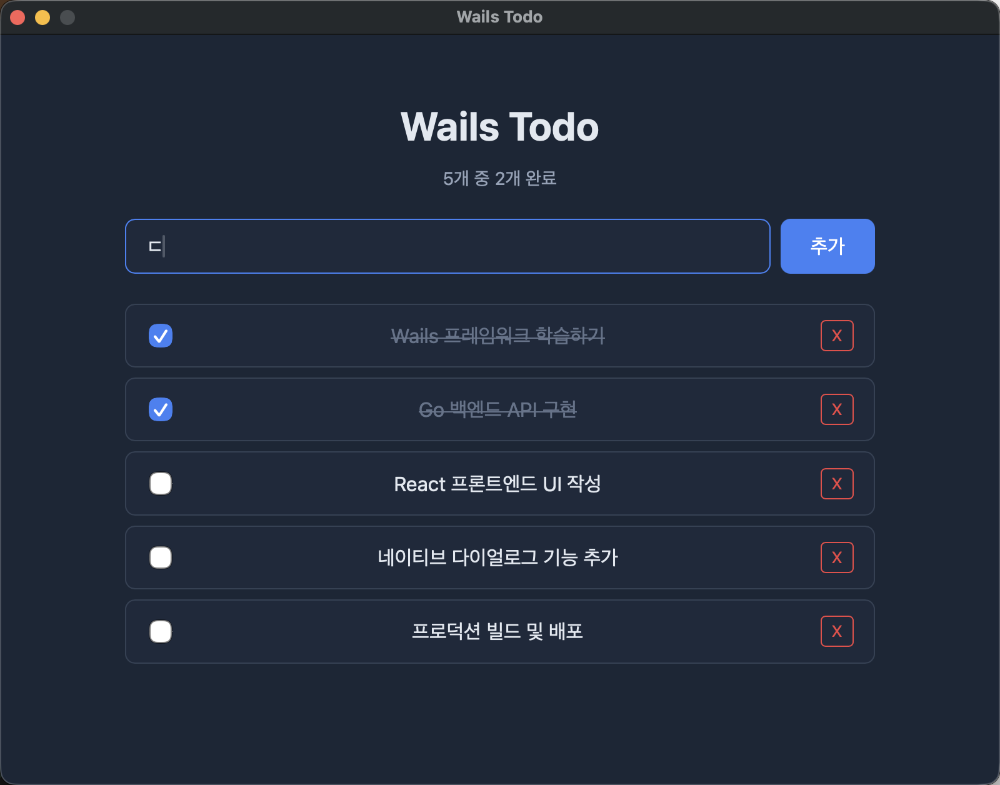

> One of our teammates built an internal debugging tool with Wails. It turned out so clean, and it was built in Golang — which we're already comfortable with — that I thought this would be a good opportunity to study Wails and write it up on the blog.

Building web servers or CLI tools in Go is familiar, but what about **desktop apps**? [Wails](https://wails.io/) is a framework that lets you build cross-platform desktop applications by combining a Go backend with a web frontend (React, Vue, Svelte, etc.).

Unlike Electron, which bundles Chromium, it uses the **OS's native WebView**, so the binary size is small and memory usage is low. What's appealing is that you can build native-level desktop apps while leveraging the web technologies Go developers already know.

In this article, we'll build a **Todo app** with Wails v2, covering the whole process — from project creation to Go-JavaScript binding, using native features, and building.

> The full example code is available on [GitHub](https://github.com/kenshin579/tutorials-go/tree/master/desktop/wails-todo).

# 1. Introduction



## 1.1 What Is Wails?

Wails is a framework that lets you build desktop apps in Go. The core idea is simple:

- **Backend**: write business logic in Go
- **Frontend**: write the UI with web technologies such as React, Vue, Svelte
- **Binding**: call Go methods directly from JavaScript

The Go code and the web frontend are compiled into a single **single binary**, and the frontend assets are embedded into the binary with `go:embed`.

## 1.2 Comparison with Electron and Tauri

When choosing a desktop app framework, you often end up comparing Wails, Electron, and Tauri.

| Item | Wails | Electron | Tauri |
|---|---|---|---|
| Backend language | Go | Node.js | Rust |
| Rendering | OS WebView | bundled Chromium | OS WebView |
| Binary size | ~10MB | ~150MB+ | ~5MB |
| Memory usage | low | high (100-200MB) | low |
| Learning curve | low (Go + Web) | low (JS) | high (Rust) |
| Ecosystem | small | very large | moderate |

> An **OS WebView** is the web browser component the operating system provides by default. macOS uses WKWebView (Safari engine), Windows uses WebView2 (Edge engine), and Linux uses WebKitGTK. Electron bundles all of Chromium into the app, but Wails and Tauri reuse the WebView already installed on the OS, making them much lighter.

Tauri is Rust-based and has the smallest binary, but Rust has a steep learning curve. If you're already using Go, Wails is the option with the lowest barrier to entry.

## 1.3 Wails v2 vs v3

Currently Wails exists in two versions: **v2 (stable)** and **v3 (Alpha)**.

| Item | v2 (stable) | v3 (Alpha) |
|---|---|---|
| Status | production-ready | under development |
| Multi-window | not supported | supported |
| System tray | not supported | supported |
| Frontend | React, Vue, Svelte, etc. | same + improvements |

This article uses **v2**. v3's API may still change, so if you need stability, v2 is recommended.

# 2. Environment Setup

## 2.1 Prerequisites

To use Wails, you need the following:

- **Go** 1.20 or higher
- **Node.js** 15 or higher + npm
- **Platform-specific dependencies**:
  - macOS: Xcode Command Line Tools
  - Linux: `gtk3`, `webkit2gtk` packages
  - Windows: WebView2 Runtime (included by default on Windows 11)

## 2.2 Installing the Wails CLI

```bash
go install github.com/wailsapp/wails/v2/cmd/wails@latest
```

After installation, check your environment with `wails doctor`:

```bash
$ wails doctor

# System
┌──────────────────────────────────────────────────────────────────┐
| OS           | Darwin                                           |
| Version      | 15.5.0                                           |
| ID           | macOS Sequoia                                    |
| Go Version   | go1.24.0                                         |
| Platform     | darwin                                           |
| Architecture | arm64                                            |
├──────────────────────────────────────────────────────────────────┤
| Wails CLI    | v2.11.0                                          |
└──────────────────────────────────────────────────────────────────┘
# Dependencies
┌──────────────────────────────────────────────────────────────────┐
| Dependency | Package Name | Status    | Version                 |
| Xcode CLI  | N/A          | Installed | 2508                    |
| npm        | N/A          | Installed | 11.4.1                  |
| node       | N/A          | Installed | 24.1.0                  |
└──────────────────────────────────────────────────────────────────┘
```

## 2.3 Creating a Project

Create a new project with the `wails init` command. You can specify the frontend template with the `-t` option.

```bash
$ wails init -n wails-todo -t react-ts

Wails CLI v2.11.0

# Initialising Project 'wails-todo'
Project Name      | wails-todo
Project Directory | /path/to/wails-todo
Template          | React + Vite (Typescript)
Template Source   | https://wails.io

Initialised project 'wails-todo' in 264ms.
```

Available templates: `react`, `react-ts`, `vue`, `vue-ts`, `svelte`, `svelte-ts`, `vanilla`, etc.

You can run the generated project right away:

```bash
$ cd wails-todo
$ wails dev

Wails CLI v2.11.0

Executing: go mod tidy
  • Generating bindings: Done.
  • Installing frontend dependencies: Done.
  • Compiling frontend: Done.

> frontend@0.0.0 dev
> vite

  VITE v3.2.11  ready in 144 ms

Vite Server URL: http://localhost:5173/
  ➜  Local:   http://localhost:5173/
  ➜  Network: use --host to expose
Running frontend DevWatcher command: 'npm run dev'
Building application for development...
  • Generating bindings: Done.
  • Compiling application: Done.
  • Packaging application: Done.

Using DevServer URL: http://localhost:34115
Using Frontend DevServer URL: http://localhost:5173/
Watching (sub)/directory: /path/to/wails-todo

To develop in the browser and call your bound Go methods from Javascript, navigate to: http://localhost:34115
```

`wails dev` is a development mode that supports frontend HMR (Hot Module Replacement) and automatic Go rebuilds at the same time.

# 3. Project Structure

## 3.1 Directory Layout

The Todo app in this article has the following structure:

```
wails-todo/
├── build/                  # build settings (icon, app info)
│   ├── appicon.png
│   └── darwin/             # macOS-specific settings
├── backend/                # Go backend logic
│   ├── app.go              # App struct, Wails binding methods
│   ├── todo.go             # Todo struct, JSON file storage
│   └── menu.go             # system menu settings
├── frontend/               # web frontend (React + TypeScript)
│   ├── src/
│   │   ├── App.tsx         # main component
│   │   ├── components/     # UI components
│   │   └── App.css         # styles
│   ├── index.html
│   ├── package.json
│   └── wailsjs/            # auto-generated Go bindings
│       ├── go/backend/     # JS/TS for calling Go methods
│       └── runtime/        # Wails runtime API
├── main.go                 # app entry point
├── wails.json              # Wails project settings
└── go.mod
```

## 3.2 Embedding the Frontend with go:embed

One of Wails's core mechanisms is embedding frontend assets using `go:embed`. You declare it in `main.go` like this:

```go
//go:embed all:frontend/dist
var assets embed.FS
```

At build time, the frontend build output generated in `frontend/dist/` is included in the Go binary. So when deploying, you can ship a **single executable** without needing separate static files.

## 3.3 wails.json Settings

```json
{
  "$schema": "https://wails.io/schemas/config.v2.json",
  "name": "wails-todo",
  "outputfilename": "wails-todo",
  "frontend:install": "npm install",
  "frontend:build": "npm run build",
  "frontend:dev:watcher": "npm run dev",
  "frontend:dev:serverUrl": "auto",
  "author": {
    "name": "Frank Oh",
    "email": "kenshin579@hotmail.com"
  }
}
```

Key settings:
- `frontend:install`: command to install frontend dependencies
- `frontend:build`: command to build the frontend
- `frontend:dev:watcher`: command to run the frontend dev server in development mode
- `frontend:dev:serverUrl`: when set to `auto`, Wails auto-detects the dev server URL

# 4. Go-JavaScript Binding

The core feature of Wails is that you can **call Go methods directly from JavaScript**.

## 4.1 How It Works



The binding works as follows:

**Step 1: Register the Go struct with `Bind`**

In `main.go`, register the Go struct you want to expose to the frontend.

```go
// main.go
err := wails.Run(&options.App{
    Bind: []interface{}{
        app,  // register the backend.App struct
    },
})
```

**Step 2: Wails auto-generates the JS/TS binding code**

When you run `wails dev` or `wails build`, Wails analyzes the public methods of the registered struct and generates binding code in the `frontend/wailsjs/go/` directory. For example, for the `App.AddTodo()` method, the following JS code is auto-generated:

```js
// frontend/wailsjs/go/backend/App.js (auto-generated)
export function AddTodo(arg1) {
  return window['go']['backend']['App']['AddTodo'](arg1);
}

export function GetTodos() {
  return window['go']['backend']['App']['GetTodos']();
}
```

The key is the `window['go']` object. The Wails runtime injects this global object into the WebView at app startup, and when you call a Go method from JS through this object, it is passed to the Go backend internally via IPC (inter-process communication). TypeScript type definitions are also generated, so you can call them in a type-safe manner:

```ts
// frontend/wailsjs/go/backend/App.d.ts (auto-generated)
export function AddTodo(arg1:string):Promise<backend.Todo>;
export function GetTodos():Promise<Array<backend.Todo>>;
export function DeleteTodo(arg1:string):Promise<Array<backend.Todo>>;
```

**Step 3: Import and call from the frontend**

Once you import the auto-generated bindings, you can call Go methods just like regular async functions.

```tsx
import { GetTodos, AddTodo } from "../wailsjs/go/backend/App";

const handleAdd = async (title: string) => {
    await AddTodo(title);  // call Go's App.AddTodo()
    loadTodos();
};
```

> Without having to implement an HTTP API or WebSocket yourself, Wails analyzes the Go method signatures and handles everything automatically — generating the binding code → injecting the `window['go']` object → the IPC communication.

## 4.2 Event System

You can send events from Go to the frontend, or receive events on the frontend.

**Go → JavaScript event emit:**

```go
// emit an event from Go
runtime.EventsEmit(a.ctx, "todos:reload")
```

**Receiving an event in JavaScript:**

```tsx
import { EventsOn } from "../wailsjs/runtime/runtime";

useEffect(() => {
    // receive the event sent from Go
    EventsOn("todos:reload", loadTodos);
}, []);
```

The event system is useful for **one-way notifications** that are hard to handle with binding calls (e.g. refreshing the UI after loading a file from the menu).

# 5. Hands-On Example: Todo App

This is the running screen of the finished Todo app. You can add Todo items, mark them complete with a checkbox, and delete them.



## 5.1 Backend Implementation (Go)

### 5.1.1 Todo Struct and Store

Define a simple struct that saves and loads Todo data as a JSON file.

```go
// backend/todo.go
type Todo struct {
    ID        string    `json:"id"`
    Title     string    `json:"title"`
    Done      bool      `json:"done"`
    CreatedAt time.Time `json:"createdAt"`
}

type TodoStore struct {
    filePath string
    Todos    []Todo `json:"todos"`
}
```

`TodoStore` is a simple store that reads and writes a JSON file with `os.ReadFile`/`os.WriteFile`. The full code is available on [GitHub](https://github.com/kenshin579/tutorials-go/blob/master/desktop/wails-todo/backend/todo.go).

### 5.1.2 CRUD Methods

The public methods of the `App` struct are exposed to the frontend through Wails binding. Taking `AddTodo` as an example, you write it just like a regular Go method.

```go
// backend/app.go
func (a *App) AddTodo(title string) Todo {
    todo := Todo{
        ID:        fmt.Sprintf("%d", time.Now().UnixNano()),
        Title:     title,
        Done:      false,
        CreatedAt: time.Now(),
    }
    a.store.Todos = append(a.store.Todos, todo)
    a.store.Save()
    return todo
}
```

Once you write this method, you can call it directly from the frontend as `AddTodo("a task")`. For the parameter (`string`) and return value (`Todo`), Wails handles JSON serialization/deserialization automatically. The remaining `GetTodos`, `ToggleTodo`, and `DeleteTodo` methods work the same way. The full code is available on [GitHub](https://github.com/kenshin579/tutorials-go/blob/master/desktop/wails-todo/backend/app.go).

## 5.2 Frontend Implementation (React + TypeScript)

On the frontend, you import the auto-generated bindings and call Go methods. The difference from a typical React app is that instead of API calls, you **call the binding functions directly**.

```tsx
// frontend/src/App.tsx
import { GetTodos, AddTodo, ToggleTodo, DeleteTodo } from "../wailsjs/go/backend/App";
import { EventsOn } from "../wailsjs/runtime/runtime";

function App() {
    const [todos, setTodos] = useState<Todo[]>([]);

    useEffect(() => {
        loadTodos();
        EventsOn("todos:reload", loadTodos);  // receive Go events
    }, []);

    const handleAdd = async (title: string) => {
        await AddTodo(title);  // call the Go method
        loadTodos();
    };
    // ...
}
```

Without an HTTP call like `fetch('/api/todos')`, calling a function directly like `AddTodo(title)` lets the Wails runtime communicate with the Go backend on its own. The UI components (`TodoInput`, `TodoItem`, etc.) are the same as regular React components. The full frontend code is available on [GitHub](https://github.com/kenshin579/tutorials-go/tree/master/desktop/wails-todo/frontend/src).

## 5.3 App Entry Point

In `main.go`, configure and run the Wails app.

```go
// main.go
package main

import (
    "embed"

    "wails-todo/backend"

    "github.com/wailsapp/wails/v2"
    "github.com/wailsapp/wails/v2/pkg/options"
    "github.com/wailsapp/wails/v2/pkg/options/assetserver"
)

//go:embed all:frontend/dist
var assets embed.FS

func main() {
    app := backend.NewApp()

    err := wails.Run(&options.App{
        Title:  "Wails Todo",
        Width:  800,
        Height: 600,
        AssetServer: &assetserver.Options{
            Assets: assets,
        },
        BackgroundColour: &options.RGBA{R: 27, G: 38, B: 54, A: 1},
        OnStartup:        app.Startup,
        Menu:              app.CreateMenu(),
        Bind: []interface{}{
            app,
        },
    })
    if err != nil {
        println("Error:", err.Error())
    }
}
```

Key options:
- `Title`, `Width`, `Height`: window title and size
- `AssetServer`: frontend assets (go:embed-ed files)
- `OnStartup`: callback invoked at app startup (passes context)
- `Menu`: system menu settings
- `Bind`: list of Go structs to expose to the frontend

## 5.4 Development Mode and Hot Reload

```bash
wails dev
```

`wails dev` runs the following two things simultaneously:
- **Frontend**: Vite dev server (with HMR support)
- **Backend**: automatic rebuild when Go source changes are detected

When you modify frontend code, it is reflected immediately without a browser refresh, and when you modify Go code, the app restarts automatically.

# 6. Using Native Features

Wails provides various native features through the `runtime` package.

## 6.1 File Dialog

You can use the OS's native file dialog to open or save files.

```go
// backend/app.go

// Export: save dialog
func (a *App) ExportTodos() error {
    path, err := runtime.SaveFileDialog(a.ctx, runtime.SaveDialogOptions{
        Title:           "Export Todo list",
        DefaultFilename: "todos.json",
        Filters: []runtime.FileFilter{
            {DisplayName: "JSON Files", Pattern: "*.json"},
        },
    })
    if err != nil || path == "" {
        return err
    }
    return a.store.ExportToFile(path)
}

// Import: open dialog
func (a *App) ImportTodos() ([]Todo, error) {
    path, err := runtime.OpenFileDialog(a.ctx, runtime.OpenDialogOptions{
        Title: "Import Todo list",
        Filters: []runtime.FileFilter{
            {DisplayName: "JSON Files", Pattern: "*.json"},
        },
    })
    if err != nil || path == "" {
        return a.store.Todos, err
    }
    if err := a.store.LoadFromFile(path); err != nil {
        return a.store.Todos, err
    }
    return a.store.Todos, nil
}
```

With `SaveDialogOptions` and `OpenDialogOptions`, you can set the title, default filename, file filters, and more.

## 6.2 System Menu

Define the system menu displayed at the top of the app in Go code.

```go
// backend/menu.go
func (a *App) CreateMenu() *menu.Menu {
    appMenu := menu.NewMenu()

    fileMenu := appMenu.AddSubmenu("File")
    fileMenu.AddText("Import...", keys.CmdOrCtrl("o"), func(_ *menu.CallbackData) {
        a.ImportTodos()
        runtime.EventsEmit(a.ctx, "todos:reload")
    })
    fileMenu.AddText("Export...", keys.CmdOrCtrl("s"), func(_ *menu.CallbackData) {
        a.ExportTodos()
    })
    fileMenu.AddSeparator()
    fileMenu.AddText("Quit", keys.CmdOrCtrl("q"), func(_ *menu.CallbackData) {
        runtime.Quit(a.ctx)
    })

    return appMenu
}
```

- `keys.CmdOrCtrl("o")`: Cmd+O on macOS, Ctrl+O on Windows/Linux
- `AddSeparator()`: a divider between menu items
- after importing, emit a reload event to the frontend with `EventsEmit`

## 6.3 Dialogs

You can display a native dialog with `runtime.MessageDialog`.

```go
result, err := runtime.MessageDialog(a.ctx, runtime.MessageDialogOptions{
    Type:          runtime.QuestionDialog,
    Title:         "Confirm deletion",
    Message:       fmt.Sprintf("Do you want to delete '%s'?", t.Title),
    DefaultButton: "No",
})
if err == nil && result == "Yes" {
    // handle deletion
}
```

Dialog types:
- `runtime.InfoDialog`: information notice
- `runtime.WarningDialog`: warning
- `runtime.ErrorDialog`: error
- `runtime.QuestionDialog`: yes/no confirmation

## 6.4 Window Control

You can dynamically control window properties with the `runtime` package.

```go
// change the window title
runtime.WindowSetTitle(a.ctx, "New title")

// change the window size
runtime.WindowSetSize(a.ctx, 1024, 768)

// minimize/maximize the window
runtime.WindowMinimise(a.ctx)
runtime.WindowMaximise(a.ctx)

// fullscreen
runtime.WindowFullscreen(a.ctx)
```

# 7. Build and Distribution

## 7.1 Production Build

```bash
$ wails build

Wails CLI v2.11.0

# Build Options
Platform(s)        | darwin/arm64
Compiler           | /usr/local/go/bin/go
Build Mode         | production
Frontend Directory | /path/to/wails-todo/frontend
Package            | true

# Building target: darwin/arm64
  • Generating bindings: Done.
  • Installing frontend dependencies: Done.
  • Compiling frontend: Done.
  • Compiling application: Done.
  • Packaging application: Done.
Built 'build/bin/wails-todo.app/Contents/MacOS/wails-todo' in 3.506s.
```

When the build finishes, an executable is created in the `build/bin/` directory:
- **macOS**: `wails-todo.app` (app bundle)
- **Windows**: `wails-todo.exe`
- **Linux**: `wails-todo` (binary)

```bash
$ ls -lh build/bin/wails-todo.app/Contents/MacOS/wails-todo
-rwxr-xr-x  1 user  staff   7.5M  Mar  7 13:30 wails-todo

$ du -sh build/bin/wails-todo.app
7.7M	build/bin/wails-todo.app
```

The actual binary size is about **7.5MB**, which is very small compared to an Electron app (~150MB+).

## 7.2 Per-Platform Builds

Wails builds for the current OS by default. When you need cross-compilation:

```bash
# build for Windows on macOS
GOOS=windows wails build

# debug build (developer tools enabled)
wails build -debug
```

Note that cross-compilation may require the target platform's C compiler. Building for Windows on macOS requires `mingw-w64`.

## 7.3 Optimizing Binary Size

```bash
# UPX compression (optional)
wails build -upx

# remove debug info with build flags
wails build -ldflags "-s -w"
```

# 8. FAQ

## 8.1 What's the Scope of What You Can Build with Wails?

Wails is suitable for building **single-window desktop applications**. Specifically:

- **Suitable cases**: window-based desktop apps such as internal tools, data viewers, settings management apps, file-processing utilities, dashboards
- **Possible but limited cases**: v2 does not support multi-window or system tray (planned for v3)
- **Unsuitable cases**: games, high-performance graphics apps, system-level utilities (cases that need direct access to OS APIs)

Since the frontend is WebView-based, most things you can do on the web are possible. On top of that, you can add native features through the Go backend, such as file system access, network communication, and database connections.

## 8.2 Can I Also Build macOS Desktop Widgets?

**No.** macOS widgets (Notification Center, desktop widgets) can only be built with Apple's **WidgetKit + SwiftUI**, and they use a separate architecture called App Extension. Wails is a WebView-based standalone window app, so it does not support widget development.

If you need a feature that stays resident on the desktop, you can use the **system tray** (menu bar icon) planned for v3.

# 9. Wrapping Up

In this article, we looked at the process of building a Go + React based Todo desktop app using Wails v2. To summarize:

| Item | Content |
|---|---|
| Go-JS binding | Go public methods → automatically converted to JS Promise functions |
| Event system | two-way communication with `EventsEmit` / `EventsOn` |
| Native features | file dialog, system menu, confirmation dialog |
| Asset embedding | include the frontend in a single binary with `go:embed` |
| Binary size | ~7.5MB (1/20 of Electron) |
| Developer experience | HMR + automatic Go rebuild with `wails dev` |

Wails is a great option for Go developers to build lightweight, fast desktop apps using web technologies. If Electron's heavy binary is a burden and learning Rust from scratch is daunting, Wails is worth considering.

# 10. References

- [Wails Official Docs](https://wails.io/ko/docs/introduction)
- [Wails v2 API Reference](https://wails.io/ko/docs/reference/runtime/intro)
- [Wails GitHub](https://github.com/wailsapp/wails)
- [Go embed package](https://pkg.go.dev/embed)
- [Full example code - GitHub](https://github.com/kenshin579/tutorials-go/tree/master/desktop/wails-todo)
