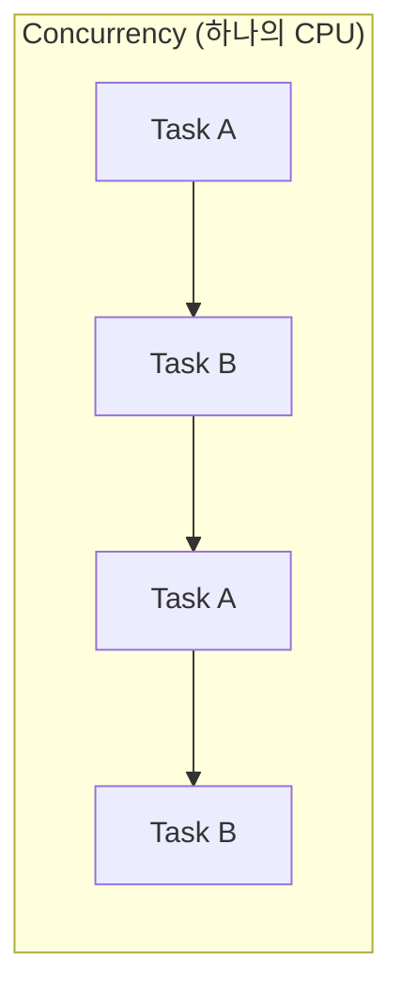
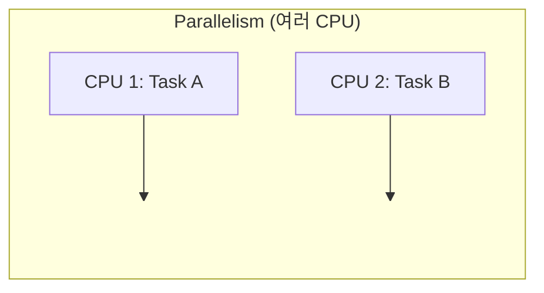
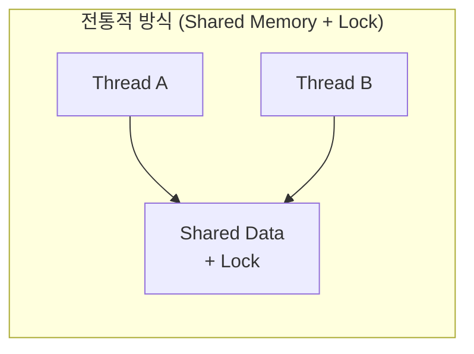
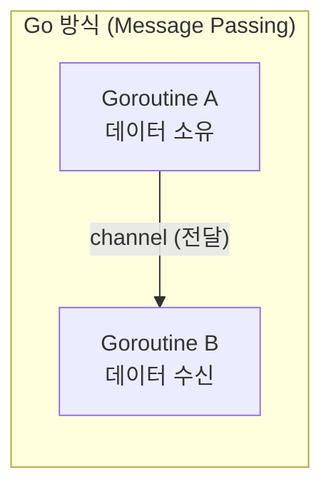
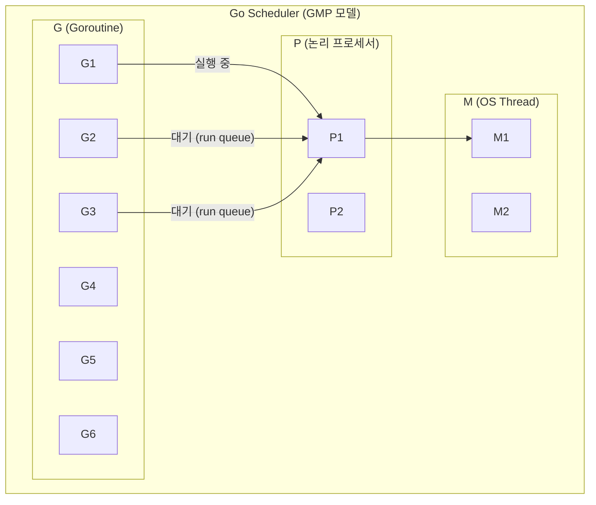

Go 언어가 다른 언어와 차별화되는 가장 큰 특징 중 하나는 **동시성(Concurrency)** 지원이다. Go는 언어 차원에서 goroutine과 channel을 제공하여, 복잡한 동시성 프로그래밍을 간결하고 안전하게 작성할 수 있도록 설계되었다.

이 시리즈에서는 Go의 Concurrency를 기초부터 실전까지 단계별로 다룬다. 첫 번째 편에서는 Concurrency의 기본 개념과 Go의 핵심 실행 단위인 **Goroutine**에 대해 알아본다.

## 1. Concurrency vs Parallelism

Concurrency와 Parallelism은 자주 혼동되지만 서로 다른 개념이다.


| 구분 | Concurrency (동시성)       | Parallelism (병렬성)     |
| ---- |-------------------------|-----------------------|
| 정의 | 여러 작업을 **동시에 다루는** 구조   | 여러 작업을 **동시에 실행하는** 것 |
| 핵심 | 작업의 **구성(composition)** | 작업의 **실행(execution)** |
| CPU  | 1개의 CPU에서도 가능           | 여러 CPU 필요             |
| 비유 | 한 사람이 여러 일을 번갈아 처리      | 여러 사람이 각자 일을 동시에 처리   |





Go의 창시자 Rob Pike는 이렇게 설명한다:

> **"Concurrency is about dealing with lots of things at once. Parallelism is about doing lots of things at once."**
> — Rob Pike

Go에서 concurrency는 프로그램의 **구조**에 관한 것이다. 코드를 독립적으로 실행 가능한 단위로 분리하는 것이 concurrency이고, 이를 실제로 여러 CPU에서 동시에 실행하는 것이 parallelism이다. Go 프로그램은 concurrent하게 설계하면, runtime이 알아서 parallelism을 활용한다.

## 2. 왜 Go는 Concurrency에 강한가

### CSP 모델

Go의 concurrency 모델은 **CSP(Communicating Sequential Processes)** 에 기반한다. 1978년 Tony Hoare가 제안한 이 모델의 핵심은 독립적인 프로세스들이 **메시지 전달(message passing)** 을 통해 통신하는 것이다.

Go에서는 이를 **goroutine**(독립적인 실행 단위)과 **channel**(메시지 전달 수단)로 구현했다.

### Go 동시성 철학

> **"Do not communicate by sharing memory; instead, share memory by communicating."**
> — Go Proverb

전통적인 멀티스레드 프로그래밍에서는 공유 메모리에 대한 접근을 lock(mutex)으로 보호한다. 이 방식은 deadlock, race condition 등의 문제가 발생하기 쉽다.

Go는 **channel을 통한 데이터 전달**을 권장한다. 데이터의 소유권이 channel을 통해 이전되므로, 한 시점에 하나의 goroutine만 데이터에 접근하게 된다.





## 3. 언제 Concurrency를 사용해야 하는가

### 사용이 적합한 경우

- **I/O 대기가 많은 작업**: HTTP 요청, DB 쿼리, 파일 읽기/쓰기
- **독립적인 작업의 병렬 처리**: 여러 API를 동시에 호출
- **이벤트 기반 처리**: 웹 서버의 요청 처리
- **파이프라인 처리**: 데이터 변환 스테이지 체이닝

### 사용하면 안 되는 경우 (오버엔지니어링)

- **단순 순차 처리로 충분한 경우**: 간단한 데이터 변환
- **CPU-bound 작업에서 goroutine을 과도하게 생성하는 경우**
- **공유 상태가 많아 lock이 복잡해지는 경우**: 이 경우 설계를 다시 고려
- **디버깅이 어려워질 정도로 복잡한 경우**: concurrency는 복잡성을 추가한다

## 4. Goroutine 기초

### Goroutine이란?

Goroutine은 Go runtime이 관리하는 **경량 실행 단위**이다. `go` 키워드를 함수 호출 앞에 붙이면 새로운 goroutine이 생성된다.

```go
// goroutine 생성 - go 키워드 사용
go func() {
    fmt.Println("goroutine 실행됨")
}()

// 이름 있는 함수도 가능
go sayHello("World")
```

### Goroutine vs OS Thread


| 구분            | Goroutine                | OS Thread            |
| --------------- | ------------------------ | -------------------- |
| 초기 스택 크기  | ~2KB (동적으로 증가)     | ~1MB (고정)          |
| 생성 비용       | 매우 저렴                | 상대적으로 비쌈      |
| 스케줄링        | Go runtime (사용자 공간) | OS 커널              |
| 동시 실행 수    | 수십만 개 가능           | 수천 개 수준         |
| 컨텍스트 스위칭 | 빠름 (레지스터 3개)      | 느림 (전체 레지스터) |

goroutine은 OS thread 위에서 **멀티플렉싱**된다. 수천~수만 개의 goroutine이 소수의 OS thread에서 효율적으로 실행된다.

### 실행 순서는 비결정적

goroutine의 실행 순서는 **보장되지 않는다**. 아래 코드에서 숫자가 순서대로 출력되리라 기대하면 안 된다.

```go
func TestGoroutineNonDeterministicOrder(t *testing.T) {
    var mu sync.Mutex
    var order []int
    var wg sync.WaitGroup

    const numGoroutines = 10
    wg.Add(numGoroutines)

    for i := range numGoroutines {
        go func() {
            defer wg.Done()
            mu.Lock()
            order = append(order, i)
            mu.Unlock()
        }()
    }

    wg.Wait()
    t.Logf("실행 순서: %v", order)
    // 출력 예: 실행 순서: [1 4 2 3 5 9 8 0 6 7]
}
```

### main goroutine과 lifecycle

Go 프로그램에서 `main()` 함수는 **main goroutine**에서 실행된다. main goroutine이 종료되면, 다른 goroutine의 완료 여부와 관계없이 **프로그램 전체가 종료**된다.

```go
func TestMainExitKillsGoroutines(t *testing.T) {
    var completed atomic.Bool

    go func() {
        time.Sleep(100 * time.Millisecond) // 시간이 걸리는 작업
        completed.Store(true)
    }()

    // 기다리지 않으면 goroutine은 완료되지 않는다
    assert.False(t, completed.Load())
}
```

goroutine이 완료될 때까지 기다리려면 `sync.WaitGroup`이나 `channel`을 사용해야 한다.

```go
func TestWaitGroupSolution(t *testing.T) {
    var completed atomic.Bool
    var wg sync.WaitGroup

    wg.Add(1)
    go func() {
        defer wg.Done()
        time.Sleep(50 * time.Millisecond)
        completed.Store(true)
    }()

    wg.Wait() // goroutine이 완료될 때까지 대기
    assert.True(t, completed.Load())
}
```

### 수만 개의 goroutine 생성

goroutine은 매우 가벼워서 수만 개를 생성해도 문제없다.

```go
func TestGoroutineLightweight(t *testing.T) {
    const numGoroutines = 10000
    var counter atomic.Int64
    var wg sync.WaitGroup
    wg.Add(numGoroutines)

    for range numGoroutines {
        go func() {
            defer wg.Done()
            counter.Add(1)
        }()
    }

    wg.Wait()
    assert.Equal(t, int64(numGoroutines), counter.Load())
    // 10000개의 goroutine이 모두 완료됨
}
```

## 5. 다른 언어와의 비교

goroutine의 특징을 더 잘 이해하기 위해 Kotlin Coroutine, Java Thread와 비교해 보자.

### 전체 비교

| 구분 | Go Goroutine | Kotlin Coroutine | Java Platform Thread | Java Virtual Thread (21+) |
|------|-------------|------------------|---------------------|--------------------------|
| 스택 크기 | ~2KB (동적 증가) | stackless (힙 객체) | ~1MB (고정) | ~수KB (동적) |
| 스케줄링 | Go runtime (preemptive) | 협력적 (suspend/resume) | OS 커널 | JVM (cooperative) |
| 생성 비용 | 매우 저렴 | 매우 저렴 | 비쌈 | 저렴 |
| 동시 실행 수 | 수십만 개 | 수십만 개 | 수천 개 | 수백만 개 |
| 통신 방식 | Channel (CSP) | Flow, Channel | synchronized, Lock | synchronized, Lock |

### Goroutine vs Kotlin Coroutine

**가장 큰 차이는 스케줄링 방식이다.**

Go의 goroutine은 **preemptive(선점형)** 스케줄링을 사용한다. goroutine이 CPU를 오래 점유하면 Go runtime이 강제로 전환한다 (Go 1.14+). 반면 Kotlin coroutine은 **cooperative(협력적)** 스케줄링으로, `suspend` 지점에서만 전환이 일어난다.

```kotlin
// Kotlin - suspend 함수에서만 중단점이 발생
suspend fun fetchData() {
    delay(1000)  // 여기서 양보
    // suspend 없는 CPU 작업은 양보하지 않음
}
```

```go
// Go - 별도 키워드 없이 runtime이 자동 전환
func fetchData() {
    time.Sleep(time.Second)
    // CPU-bound 작업도 runtime이 강제 전환
}
```

**함수 색칠 문제(Function Coloring)** 도 중요한 차이다.

- **Kotlin**: `suspend` 함수는 `suspend` 함수 또는 coroutine 내에서만 호출 가능하다. 기존 동기 코드를 비동기로 바꾸려면 호출 체인 전체에 `suspend`를 전파해야 할 수 있다
- **Go**: 모든 함수가 동일하다. goroutine에서 아무 함수나 호출할 수 있고, `async/suspend` 같은 구분이 없다

반면 Kotlin이 더 나은 점도 있다:
- **Structured Concurrency** 내장 — 부모 coroutine 취소 시 자식도 자동 취소
- **에러 전파**가 체계적 — `CoroutineExceptionHandler`로 일관된 처리 가능

### Goroutine vs Java Thread

전통적인 Java Platform Thread는 OS thread와 1:1로 매핑되어 ~1MB의 스택을 차지한다. 수천 개 이상 생성하면 메모리와 context switching 비용이 급증한다.

```java
// Java Platform Thread - OS thread 1:1 매핑
new Thread(() -> doWork()).start(); // ~1MB 스택 할당
```

Java 21에서 도입된 **Virtual Thread**는 goroutine과 개념적으로 유사한 경량 스레드이다.

```java
// Java Virtual Thread - goroutine과 유사
Thread.startVirtualThread(() -> doWork());
```

다만 Java는 Channel 같은 통신 메커니즘이 언어에 내장되지 않아, `BlockingQueue`나 `CompletableFuture` 등 별도 도구를 사용해야 한다.

### Goroutine의 핵심 강점 요약

1. **언어 내장**: `go` + `chan`이 키워드로 제공되어 별도 라이브러리 불필요
2. **함수 색칠 문제 없음**: `async/await/suspend` 같은 구분 없이 모든 함수가 동일
3. **Preemptive 스케줄링**: CPU-bound goroutine도 runtime이 자동 전환
4. **일관된 생태계**: 표준 라이브러리 전체가 goroutine 기반으로 설계

**약점**으로는 structured concurrency 부재(수동으로 `Context`/`WaitGroup` 관리 필요)와 goroutine에서 `panic` 발생 시 프로그램 전체가 종료될 수 있다는 점이 있다.

## 6. Goroutine Scheduling 개념

### GMP 모델

Go runtime은 **GMP 모델**로 goroutine을 스케줄링한다. OS가 직접 goroutine을 관리하는 것이 아니라, Go runtime이 사용자 공간에서 자체적으로 스케줄링을 수행한다. 이 덕분에 OS thread보다 훨씬 적은 비용으로 컨텍스트 스위칭이 가능하다.



위 다이어그램에서 P1은 M1(OS thread)에 바인딩되어 G1을 실행 중이고, G2와 G3는 P1의 로컬 run queue에서 대기하고 있다. G1이 I/O 대기 등으로 blocking되면, P1은 즉시 run queue에서 G2를 꺼내 실행한다.

| 구성 요소         | 역할                                                 |
| ----------------- | ---------------------------------------------------- |
| **G (Goroutine)** | 실행할 함수와 스택 정보를 담은 경량 실행 단위        |
| **M (Machine)**   | OS thread. 실제로 CPU에서 코드를 실행                |
| **P (Processor)** | 논리 프로세서. goroutine의 실행 큐(run queue)를 관리 |

스케줄링 동작 흐름을 정리하면 다음과 같다:

1. 새로운 goroutine(`G`)이 생성되면 현재 `P`의 **로컬 run queue**에 추가된다
2. `P`는 바인딩된 `M`(OS thread)에서 run queue의 goroutine을 하나씩 꺼내 실행한다
3. 실행 중인 goroutine이 I/O 대기, channel 대기, `time.Sleep` 등으로 blocking되면 `P`는 다음 goroutine으로 전환한다
4. 로컬 run queue가 비면 **work stealing**으로 다른 `P`의 queue에서 goroutine을 가져온다

### runtime.GOMAXPROCS

`runtime.GOMAXPROCS(n)`는 동시에 goroutine을 실행할 수 있는 **P(Processor)의 최대 개수**를 설정한다. 기본값은 CPU 코어 수이다. 즉, 4코어 머신이면 최대 4개의 goroutine이 물리적으로 동시에 실행될 수 있다.

```go
func TestGOMAXPROCS(t *testing.T) {
    currentProcs := runtime.GOMAXPROCS(0) // 0을 전달하면 현재 값을 변경하지 않고 반환
    numCPU := runtime.NumCPU()

    t.Logf("CPU 수: %d", numCPU)           // ex) CPU 수: 12
    t.Logf("현재 GOMAXPROCS: %d", currentProcs) // ex) 현재 GOMAXPROCS: 12

    // GOMAXPROCS를 1로 설정하면 P가 1개만 생성된다
    // → 모든 goroutine이 하나의 OS thread에서 번갈아 실행 (true parallelism 없음)
    runtime.GOMAXPROCS(1)
}
```

- `GOMAXPROCS=1`: P가 1개이므로 goroutine이 concurrent하게 구성되지만, 한 번에 하나만 실행된다. 디버깅이나 race condition 재현 시 유용하다
- `GOMAXPROCS=N`: 최대 N개의 goroutine이 동시에 실행 가능. 일반적으로 기본값(CPU 코어 수)을 그대로 사용하는 것이 권장된다

## 7. Goroutine Leak

### Goroutine Leak이란?

goroutine이 더 이상 필요하지 않지만 **종료되지 않고 계속 살아있는 상태**를 goroutine leak이라 한다. 메모리를 점유하고 GC 대상이 되지 않으므로, 시간이 지남에 따라 메모리 사용량이 계속 증가한다.

### 대표적인 원인

1. **Channel 대기**: 아무도 receive/send하지 않는 channel에서 영원히 blocking
2. **무한 루프**: 종료 조건 없는 goroutine
3. **Context 미사용**: 취소 신호 없이 실행되는 goroutine

### Leak 예시

아래 코드에서 `leakyFunc`는 unbuffered channel을 생성하고, goroutine에서 값을 send한다. 하지만 호출하는 쪽에서 channel을 receive하지 않으면, goroutine은 `ch <- 42`에서 **영원히 blocking**된다. 이 goroutine은 GC로도 회수되지 않는다.

```go
func TestGoroutineLeak(t *testing.T) {
    initialCount := runtime.NumGoroutine()

    leakyFunc := func() <-chan int {
        ch := make(chan int)
        go func() {
            ch <- 42 // 아무도 receive하지 않으므로 영원히 blocking
        }()
        return ch
    }

    _ = leakyFunc() // channel을 반환받지만 사용하지 않음 → leak!

    time.Sleep(50 * time.Millisecond)
    leakedCount := runtime.NumGoroutine()
    // 초기: 2, leak 후: 3 → goroutine이 증가했다
}
```

이런 패턴이 반복 호출되면 goroutine이 계속 쌓여 메모리 사용량이 무한히 증가하게 된다.

### Context로 Leak 방지

위 문제를 해결하려면, goroutine이 **외부 신호를 받아 스스로 종료**할 수 있어야 한다. `context.Context`의 취소 메커니즘을 활용하면 goroutine에게 종료 신호를 보낼 수 있다.

```go
func TestGoroutineLeakPrevention_WithContext(t *testing.T) {
    safeFunc := func(ctx context.Context) <-chan int {
        ch := make(chan int, 1) // buffered channel로 변경 → send가 blocking되지 않음
        go func() {
            defer close(ch)
            select {
            case ch <- 42:       // 정상적으로 값 전달
            case <-ctx.Done():   // context 취소 시 goroutine 종료
                return
            }
        }()
        return ch
    }

    ctx, cancel := context.WithCancel(context.Background())
    ch := safeFunc(ctx)
    _ = ch

    cancel() // context를 취소하면 goroutine이 정리된다
}
```

개선된 점을 정리하면 다음과 같다:

- **buffered channel** (`make(chan int, 1)`): 수신자가 없어도 send가 blocking되지 않아 goroutine이 멈추지 않는다
- **`select` + `ctx.Done()`**: context가 취소되면 `ctx.Done()` channel이 닫히면서 goroutine이 `return`으로 종료된다
- **`defer close(ch)`**: goroutine 종료 시 channel도 함께 정리된다

**핵심 원칙**: goroutine을 생성할 때는 항상 **종료 경로**를 확보해야 한다. `context`, `done channel`, `close` 등을 활용하자.

## 8. 정리


| 개념                       | 핵심                                                   |
| -------------------------- | ------------------------------------------------------ |
| Concurrency vs Parallelism | Concurrency는 구조, Parallelism은 실행                 |
| CSP 모델                   | 독립 프로세스 + 메시지 전달                            |
| Goroutine                  | `go` 키워드로 생성, ~2KB 스택, 수만 개 가능            |
| GMP 모델                   | G(goroutine) + M(OS thread) + P(프로세서)              |
| GOMAXPROCS                 | 동시 실행 가능한 P의 수 (기본값 = CPU 코어 수)         |
| 다른 언어와의 비교         | 언어 내장, 함수 색칠 문제 없음, preemptive 스케줄링   |
| Goroutine Leak             | 종료되지 않는 goroutine → context/done channel로 방지 |

다음 편에서는 goroutine 간 **데이터를 주고받는 핵심 메커니즘**인 Channel에 대해 알아본다.

## 참고

- [Effective Go - Concurrency](https://go.dev/doc/effective_go#concurrency)
- [Go Blog - Concurrency is not parallelism](https://go.dev/blog/waza-talk)
- [Go Blog - Share Memory By Communicating](https://go.dev/blog/codelab-share)
