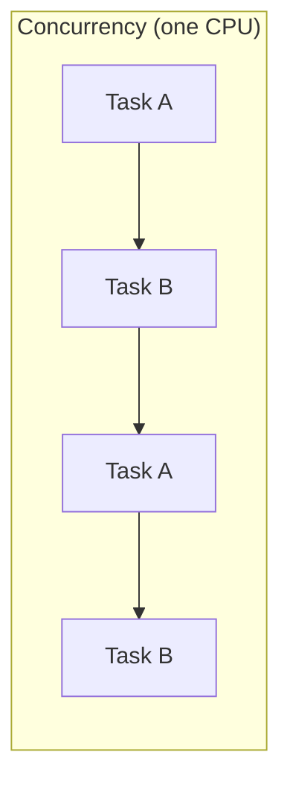
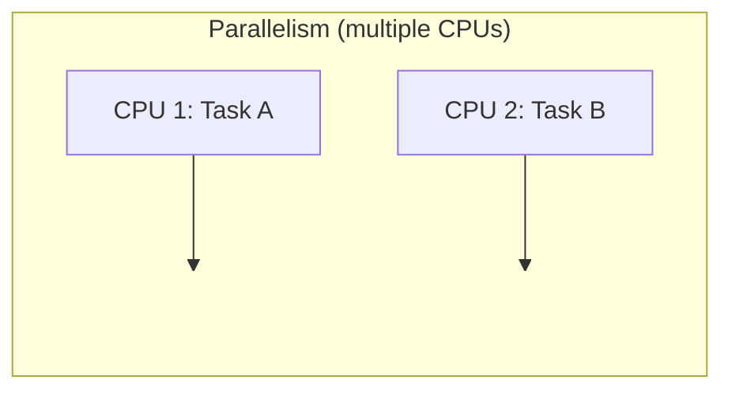
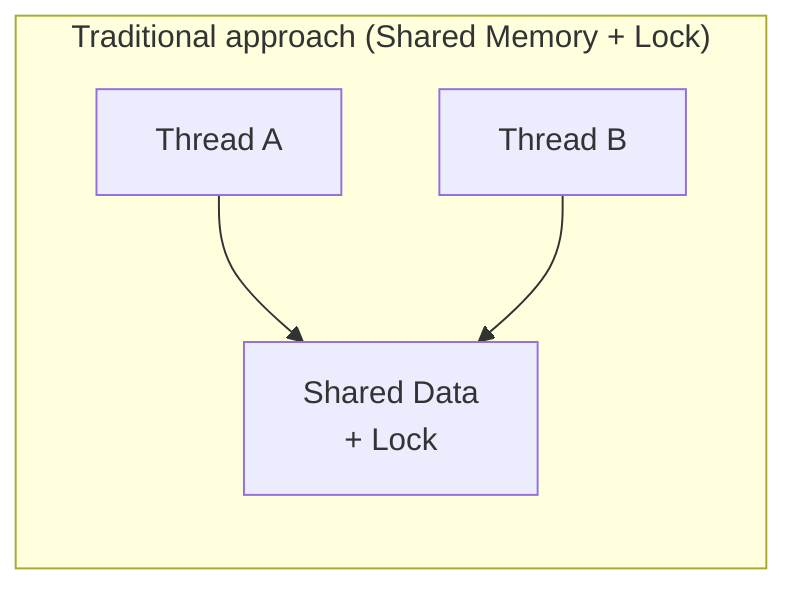
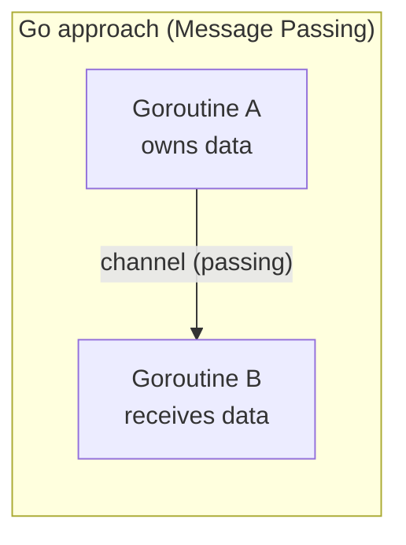
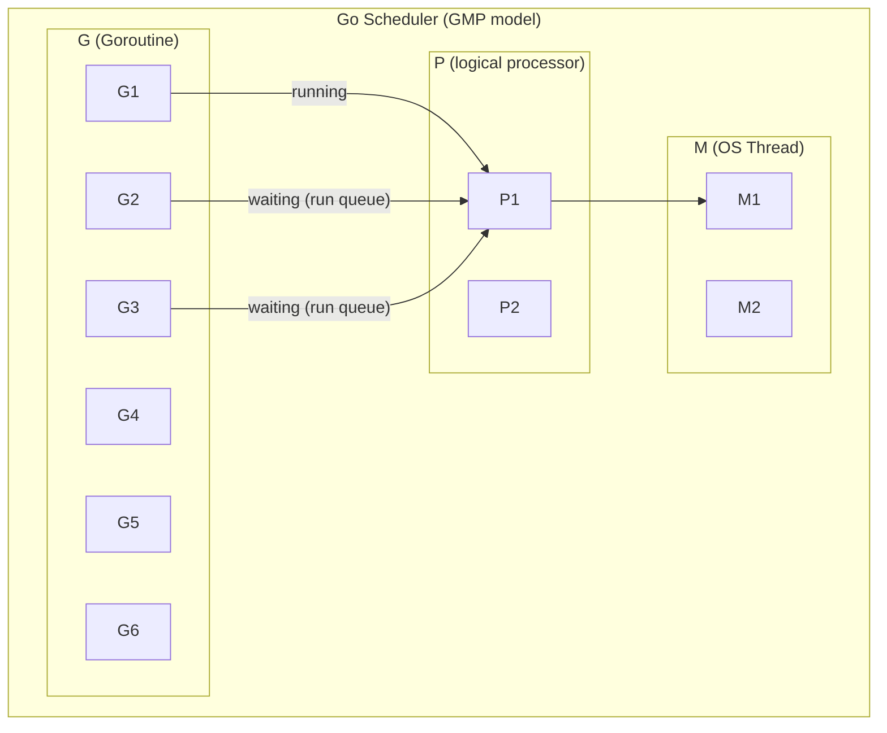

One of the biggest features that sets Go apart from other languages is its support for **concurrency**. Go provides goroutines and channels at the language level, designed so that you can write complex concurrent programming concisely and safely.

In this series, we cover Go concurrency step by step, from the basics to real-world use. In this first part, we look at the basic concepts of concurrency and Go's core unit of execution, the **goroutine**.

# 1. Concurrency vs Parallelism


Concurrency and parallelism are often confused, but they are different concepts.


| Aspect | Concurrency | Parallelism |
| ---- |-------------------------|-----------------------|
| Definition | a structure for **dealing with** multiple tasks at once | **executing** multiple tasks at the same time |
| Core | task **composition** | task **execution** |
| CPU  | possible even on a single CPU | requires multiple CPUs |
| Analogy | one person alternating between several tasks | several people each doing their task simultaneously |





Go's creator Rob Pike explains it this way:

> **"Concurrency is about dealing with lots of things at once. Parallelism is about doing lots of things at once."**
> — Rob Pike

In Go, concurrency is about the **structure** of a program. Separating code into independently executable units is concurrency, and actually running them simultaneously on multiple CPUs is parallelism. If you design a Go program to be concurrent, the runtime takes care of leveraging parallelism.

<!-- slides -->

# 2. Why Is Go Strong at Concurrency?

## 2.1 The CSP Model

Go's concurrency model is based on **CSP (Communicating Sequential Processes)**. The core of this model, proposed by Tony Hoare in 1978, is that independent processes communicate through **message passing**.

In Go, this is implemented with **goroutines** (independent units of execution) and **channels** (the means of message passing).

## 2.2 Go's Concurrency Philosophy

> **"Do not communicate by sharing memory; instead, share memory by communicating."**
> — Go Proverb

In traditional multithreaded programming, access to shared memory is protected with locks (mutexes). This approach is prone to problems such as deadlocks and race conditions.

Go recommends **passing data through channels**. Because ownership of the data is transferred through the channel, only one goroutine accesses the data at a given moment.





# 3. When Should You Use Concurrency?

## 3.1 Cases Where It's a Good Fit

- **I/O-heavy work**: HTTP requests, DB queries, file read/write
- **Parallel processing of independent tasks**: calling multiple APIs simultaneously
- **Event-based processing**: handling requests in a web server
- **Pipeline processing**: chaining data transformation stages

## 3.2 Cases Where You Shouldn't Use It (Over-Engineering)

- **When simple sequential processing is enough**: simple data transformations
- **When you create excessive goroutines for CPU-bound work**
- **When there's so much shared state that locks become complex**: in this case, reconsider the design
- **When it becomes so complex that debugging is hard**: concurrency adds complexity

# 4. Goroutine Basics

## 4.1 What Is a Goroutine?

A goroutine is a **lightweight unit of execution** managed by the Go runtime. Putting the `go` keyword in front of a function call creates a new goroutine.

```go
// create a goroutine - using the go keyword
go func() {
    fmt.Println("goroutine ran")
}()

// named functions work too
go sayHello("World")
```

## 4.2 Goroutine vs OS Thread


| Aspect            | Goroutine                | OS Thread            |
| --------------- | ------------------------ | -------------------- |
| Initial stack size  | ~2KB (grows dynamically)     | ~1MB (fixed)          |
| Creation cost       | very cheap                | relatively expensive      |
| Scheduling        | Go runtime (user space) | OS kernel              |
| Concurrent count    | hundreds of thousands possible           | thousands range         |
| Context switching | fast (3 registers)      | slow (all registers) |

Goroutines are **multiplexed** on top of OS threads. Thousands to tens of thousands of goroutines run efficiently on a small number of OS threads.

## 4.3 Execution Order Is Non-Deterministic

The execution order of goroutines is **not guaranteed**. In the code below, you should not expect the numbers to be printed in order.

```go
func TestGoroutineNonDeterministicOrder(t *testing.T) {
    var mu sync.Mutex
    var order []int
    var wg sync.WaitGroup

    const numGoroutines = 10
    wg.Add(numGoroutines)

    for i := range numGoroutines {
        go func() {
            defer wg.Done()
            mu.Lock()
            order = append(order, i)
            mu.Unlock()
        }()
    }

    wg.Wait()
    t.Logf("execution order: %v", order)
    // example output: execution order: [1 4 2 3 5 9 8 0 6 7]
}
```

## 4.4 main goroutine and lifecycle

In a Go program, the `main()` function runs in the **main goroutine**. When the main goroutine terminates, **the entire program terminates** regardless of whether other goroutines have finished.

```go
func TestMainExitKillsGoroutines(t *testing.T) {
    var completed atomic.Bool

    go func() {
        time.Sleep(100 * time.Millisecond) // time-consuming work
        completed.Store(true)
    }()

    // if you don't wait, the goroutine won't complete
    assert.False(t, completed.Load())
}
```

To wait until a goroutine completes, you need to use `sync.WaitGroup` or a `channel`.

```go
func TestWaitGroupSolution(t *testing.T) {
    var completed atomic.Bool
    var wg sync.WaitGroup

    wg.Add(1)
    go func() {
        defer wg.Done()
        time.Sleep(50 * time.Millisecond)
        completed.Store(true)
    }()

    wg.Wait() // wait until the goroutine completes
    assert.True(t, completed.Load())
}
```

## 4.5 Creating Tens of Thousands of Goroutines

Goroutines are so lightweight that creating tens of thousands of them is no problem.

```go
func TestGoroutineLightweight(t *testing.T) {
    const numGoroutines = 10000
    var counter atomic.Int64
    var wg sync.WaitGroup
    wg.Add(numGoroutines)

    for range numGoroutines {
        go func() {
            defer wg.Done()
            counter.Add(1)
        }()
    }

    wg.Wait()
    assert.Equal(t, int64(numGoroutines), counter.Load())
    // all 10000 goroutines completed
}
```

# 5. Comparison with Other Languages

To better understand the characteristics of goroutines, let's compare them with Kotlin Coroutines and Java Threads.

## 5.1 Overall Comparison

| Aspect | Go Goroutine | Kotlin Coroutine | Java Platform Thread | Java Virtual Thread (21+) |
|------|-------------|------------------|---------------------|--------------------------|
| Stack size | ~2KB (grows dynamically) | stackless (heap object) | ~1MB (fixed) | ~a few KB (dynamic) |
| Scheduling | Go runtime (preemptive) | cooperative (suspend/resume) | OS kernel | JVM (cooperative) |
| Creation cost | very cheap | very cheap | expensive | cheap |
| Concurrent count | hundreds of thousands | hundreds of thousands | thousands | millions |
| Communication | Channel (CSP) | Flow, Channel | synchronized, Lock | synchronized, Lock |

## 5.2 Goroutine vs Kotlin Coroutine

**The biggest difference is the scheduling method.**

Go's goroutines use **preemptive** scheduling. If a goroutine holds the CPU for a long time, the Go runtime forcibly switches it (Go 1.14+). In contrast, Kotlin coroutines use **cooperative** scheduling, where switching happens only at `suspend` points.

```kotlin
// Kotlin - suspension points occur only in suspend functions
suspend fun fetchData() {
    delay(1000)  // yields here
    // CPU work without suspend does not yield
}
```

```go
// Go - the runtime switches automatically with no special keyword
func fetchData() {
    time.Sleep(time.Second)
    // the runtime forcibly switches even CPU-bound work
}
```

The **function coloring problem** is another important difference.

- **Kotlin**: a `suspend` function can only be called within a `suspend` function or a coroutine. To convert existing synchronous code to asynchronous, you may have to propagate `suspend` throughout the entire call chain
- **Go**: all functions are the same. You can call any function from a goroutine, and there's no `async/suspend` distinction

On the other hand, Kotlin has some advantages too:
- **Structured Concurrency** built in — when a parent coroutine is canceled, its children are automatically canceled too
- **Error propagation** is systematic — consistent handling is possible with `CoroutineExceptionHandler`

## 5.3 Goroutine vs Java Thread

A traditional Java Platform Thread maps 1:1 to an OS thread and takes up a ~1MB stack. Creating thousands or more causes memory and context-switching costs to spike.

```java
// Java Platform Thread - 1:1 mapping to an OS thread
new Thread(() -> doWork()).start(); // allocates a ~1MB stack
```

The **Virtual Thread** introduced in Java 21 is a lightweight thread conceptually similar to a goroutine.

```java
// Java Virtual Thread - similar to a goroutine
Thread.startVirtualThread(() -> doWork());
```

However, Java does not have a communication mechanism like Channel built into the language, so you have to use separate tools such as `BlockingQueue` or `CompletableFuture`.

## 5.4 Summary of Goroutine's Core Strengths

1. **Language built-in**: `go` + `chan` are provided as keywords, so no separate library is needed
2. **No function coloring problem**: there's no `async/await/suspend` distinction — all functions are the same
3. **Preemptive scheduling**: the runtime automatically switches even CPU-bound goroutines
4. **Consistent ecosystem**: the entire standard library is designed around goroutines

As **weaknesses**, there's the lack of structured concurrency (you need to manually manage `Context`/`WaitGroup`) and the fact that a `panic` in a goroutine can terminate the entire program.

# 6. Goroutine Scheduling Concepts

## 6.1 The GMP Model

The Go runtime schedules goroutines with the **GMP model**. Rather than the OS directly managing goroutines, the Go runtime performs scheduling itself in user space. Thanks to this, context switching is possible at a much lower cost than OS threads.



In the diagram above, P1 is bound to M1 (an OS thread) and is running G1, while G2 and G3 are waiting in P1's local run queue. When G1 blocks on I/O waiting and the like, P1 immediately pulls G2 from the run queue and runs it.

| Component         | Role                                                 |
| ----------------- | ---------------------------------------------------- |
| **G (Goroutine)** | a lightweight unit of execution holding the function to run and stack info        |
| **M (Machine)**   | OS thread. actually runs code on the CPU                |
| **P (Processor)** | logical processor. manages the goroutine run queue |

The scheduling flow can be summarized as follows:

1. When a new goroutine (`G`) is created, it is added to the current `P`'s **local run queue**
2. `P` pulls goroutines from the run queue one by one and runs them on the bound `M` (OS thread)
3. When a running goroutine blocks on I/O waiting, channel waiting, `time.Sleep`, etc., `P` switches to the next goroutine
4. When the local run queue is empty, it fetches a goroutine from another `P`'s queue via **work stealing**

## 6.2 runtime.GOMAXPROCS

`runtime.GOMAXPROCS(n)` sets the **maximum number of Ps (Processors)** that can run goroutines simultaneously. The default is the number of CPU cores. That is, on a 4-core machine, up to 4 goroutines can run physically at the same time.

```go
func TestGOMAXPROCS(t *testing.T) {
    currentProcs := runtime.GOMAXPROCS(0) // passing 0 returns the current value without changing it
    numCPU := runtime.NumCPU()

    t.Logf("number of CPUs: %d", numCPU)           // e.g. number of CPUs: 12
    t.Logf("current GOMAXPROCS: %d", currentProcs) // e.g. current GOMAXPROCS: 12

    // setting GOMAXPROCS to 1 creates only one P
    // → all goroutines run alternately on a single OS thread (no true parallelism)
    runtime.GOMAXPROCS(1)
}
```

- `GOMAXPROCS=1`: since there is one P, goroutines are configured concurrently but only one runs at a time. Useful for debugging or reproducing race conditions
- `GOMAXPROCS=N`: up to N goroutines can run simultaneously. Generally it's recommended to keep the default (number of CPU cores)

# 7. Goroutine Leak

## 7.1 What Is a Goroutine Leak?

A state where a goroutine is no longer needed but **stays alive without terminating** is called a goroutine leak. It occupies memory and is not subject to GC, so memory usage keeps increasing over time.

## 7.2 Common Causes

1. **Channel waiting**: blocking forever on a channel that nobody receives from / sends to
2. **Infinite loop**: a goroutine with no termination condition
3. **Not using context**: a goroutine that runs without a cancellation signal

## 7.3 Leak Example

In the code below, `leakyFunc` creates an unbuffered channel and sends a value from a goroutine. But if the caller does not receive from the channel, the goroutine **blocks forever** at `ch <- 42`. This goroutine is not reclaimed even by GC.

```go
func TestGoroutineLeak(t *testing.T) {
    initialCount := runtime.NumGoroutine()

    leakyFunc := func() <-chan int {
        ch := make(chan int)
        go func() {
            ch <- 42 // blocks forever because nobody receives
        }()
        return ch
    }

    _ = leakyFunc() // receives the channel but doesn't use it → leak!

    time.Sleep(50 * time.Millisecond)
    leakedCount := runtime.NumGoroutine()
    // initial: 2, after leak: 3 → the goroutine count increased
}
```

If this pattern is called repeatedly, goroutines keep piling up and memory usage increases without bound.

## 7.4 Preventing Leaks with Context

To solve the problem above, a goroutine must be able to **terminate itself upon receiving an external signal**. Using `context.Context`'s cancellation mechanism, you can send a termination signal to the goroutine.

```go
func TestGoroutineLeakPrevention_WithContext(t *testing.T) {
    safeFunc := func(ctx context.Context) <-chan int {
        ch := make(chan int, 1) // changed to a buffered channel → send does not block
        go func() {
            defer close(ch)
            select {
            case ch <- 42:       // deliver the value normally
            case <-ctx.Done():   // terminate the goroutine when context is canceled
                return
            }
        }()
        return ch
    }

    ctx, cancel := context.WithCancel(context.Background())
    ch := safeFunc(ctx)
    _ = ch

    cancel() // canceling the context cleans up the goroutine
}
```

The improvements can be summarized as follows:

- **buffered channel** (`make(chan int, 1)`): send doesn't block even without a receiver, so the goroutine doesn't get stuck
- **`select` + `ctx.Done()`**: when the context is canceled, the `ctx.Done()` channel closes and the goroutine terminates via `return`
- **`defer close(ch)`**: the channel is cleaned up together when the goroutine terminates

**Key principle**: when creating a goroutine, always secure a **termination path**. Use `context`, a `done channel`, `close`, and the like.

# 8. Summary


| Concept                       | Core                                                   |
| -------------------------- | ------------------------------------------------------ |
| Concurrency vs Parallelism | Concurrency is structure, Parallelism is execution                 |
| CSP model                   | independent processes + message passing                            |
| Goroutine                  | created with the `go` keyword, ~2KB stack, tens of thousands possible            |
| GMP model                   | G(goroutine) + M(OS thread) + P(processor)              |
| GOMAXPROCS                 | the number of Ps that can run simultaneously (default = number of CPU cores)         |
| Comparison with other languages         | language built-in, no function coloring problem, preemptive scheduling   |
| Goroutine Leak             | a goroutine that doesn't terminate → prevent with context/done channel |

In the next part, we'll look at the **core mechanism for exchanging data** between goroutines: the Channel.

# 9. References

- [Effective Go - Concurrency](https://go.dev/doc/effective_go#concurrency)
- [Go Blog - Concurrency is not parallelism](https://go.dev/blog/waza-talk)
- [Go Blog - Share Memory By Communicating](https://go.dev/blog/codelab-share)
