Concurrency bugs are hard to diagnose with `fmt.Println` alone. Debugging gets far easier when you can **see with your own eyes** when a goroutine runs and when it blocks, and in what order data flows through channels. This article walks through Go's concurrency visualization and analysis tools with hands-on examples.

# 1. Why Visualize Concurrency Code


## 1.1 The Limits of fmt.Println Debugging

In sequential code, you can trace the execution flow by adding log lines one at a time. But in concurrent code, this approach often breaks down.

- **Output order is not guaranteed**: The execution order of goroutines is determined by the runtime scheduler, so the order in which logs are printed may differ from the order in which things actually happened.
- **Heisenbug**: Adding `fmt.Println` triggers internal synchronization that shifts execution timing, which can make the bug disappear (a Heisenbug).
- **No causality**: Logs alone make it hard to pin down a causal relationship like "goroutine A sent a value on the channel, and then goroutine B received it."

## 1.2 Comparing the Roles of Each Tool

| Tool | Type | Purpose | Overhead |
|------|------|------|---------|
| `go tool trace` | built-in | Full timeline, GC, blocking analysis | 1-2% CPU (Go 1.21+) |
| `GODEBUG=schedtrace` | built-in | Quick check of scheduler state | Almost none |
| `gotraceui` | third-party | Large traces, detailed goroutine analysis | None (viewer) |
| `divan/gotrace` | third-party | Educational 3D visualization | High |
| Flight Recorder | built-in (Go 1.25) | Capturing anomalies in production | 2-10 MB/s memory |

# 2. go tool trace Basics

The `runtime/trace` package collects execution events of a Go program (goroutine creation/termination, scheduling, GC, syscalls, and so on). The collected data can be visualized in a browser with `go tool trace`.

## 2.1 Three Ways to Collect a trace

**Method 1: Insert directly into the code**

Use `trace.Start` and `trace.Stop` to precisely collect only the section you care about.

```go
func TestBasicTrace_Start_Stop(t *testing.T) {
    // Persist to the tmp folder (unlike t.TempDir(), it survives after the test so go tool trace can analyze it)
    err := os.MkdirAll("tmp", 0o755)
    assert.NoError(t, err)

    f, err := os.Create("tmp/trace_basic.out")
    assert.NoError(t, err)
    defer func() { _ = f.Close() }()

    // Start collecting the trace
    err = rttrace.Start(f)
    assert.NoError(t, err)

    // Run concurrent work across several goroutines
    var wg sync.WaitGroup
    for i := range 5 {
        wg.Add(1)
        go func() {
            defer wg.Done()
            sum := 0
            for range 1_000_000 {
                sum++
            }
            t.Logf("goroutine %d: sum=%d", i, sum)
        }()
    }
    wg.Wait()

    // Stop collecting the trace
    rttrace.Stop()

    // Verify the trace file was created
    info, err := f.Stat()
    assert.NoError(t, err)
    assert.Positive(t, info.Size(), "the trace file should not be empty")
}
```

> Using an alias with `import rttrace "runtime/trace"` avoids a package-name collision with the standard library's `runtime/trace`.

**Method 2: the go test -trace flag**

You can collect a trace during a test run without modifying any code.

```bash
go test -v -trace=trace.out ./golang/concurrency/trace/...
go tool trace trace.out
```

**Method 3: HTTP endpoint (net/http/pprof)**

Collect a trace from a running server via an HTTP request.

```go
import _ "net/http/pprof"

// The pprof handlers are automatically registered on the default HTTP server
// curl -o trace.out http://localhost:6060/debug/pprof/trace?seconds=5
```

## 2.2 Analyzing a trace

You can open the collected trace file in a browser with the following command.

```bash
go tool trace tmp/trace_basic.out
```

Running the command starts a local web server (e.g. `http://127.0.0.1:52022`) and displays links to several analysis views in the browser. The actual screens and how to interpret each view are covered in detail in the next section.

# 3. Interpreting the Key Views of go tool trace

The screens in this section come from actually opening the trace of the earlier `TestBasicTrace_Start_Stop` (a CPU-bound workload where 5 goroutines each count to one million). We'll look at **how to read** each view based on this example.

> **First, the basics — Go's GMP scheduler model**
>
> To read the trace views you need to know the three components that make up the Go runtime scheduler. To run thousands of goroutines on a small number of OS threads, Go combines the following three.
>
> | Abbr. | Full name | What it is |
> |------|----------|------|
> | **G** | Goroutine | A lightweight unit of execution managed by Go (created with `go func()`). The *work* to be done |
> | **M** | Machine | An actual OS thread. The *worker* that physically runs the code |
> | **P** | Processor | A logical processor. The scheduling context that distributes G's to M's (holds a local run queue). The *workbench* that hands out work |
>
> For a goroutine (G) to run, **an M acquires a P**, takes a G off the P's local queue, and runs it on the M. The number of P's is set by `GOMAXPROCS` (defaults to the number of CPU cores), and this becomes the upper bound on the number of goroutines that can actually run code simultaneously. This G/M/P concept is used again later when interpreting the `schedtrace`/`scheddetail` output in Section 5.

## 3.1 View Trace (Timeline)

The timeline view is the central view that shows every event in the program along the time axis. The overall trend graphs appear at the top, and bars per execution entity appear at the bottom.

- **Heap**: Memory allocation patterns. You can see the heap shrinking after GC
- **Goroutines**: the count of running vs. runnable (ready to run but waiting). A high runnable count means P's are scarce or there is scheduling contention
- **OS Threads**: the number of active threads. Many threads blocked on syscalls may indicate a network/disk I/O bottleneck
- **PROCS**: goroutine execution per P (Processor). GC STW (Stop-The-World) events are also visible here

The bottom of the timeline can be viewed **by P (logical processor)** or **by OS thread (M)**.

**View by proc — timeline per P**

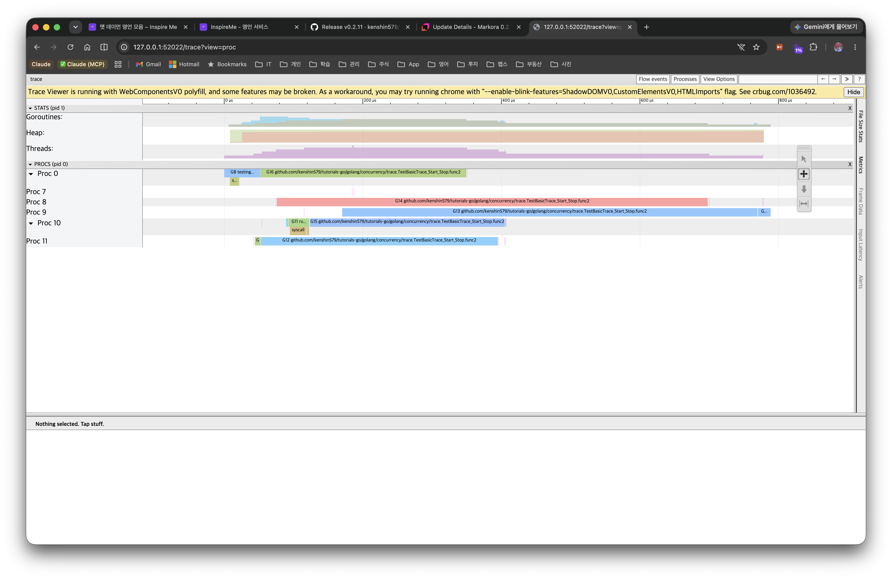

- The 5 `TestBasicTrace_Start_Stop.func2` bars are **spread across different P's and run almost simultaneously** → meaning multi-core parallelism is being used well.
- The bars end quickly without being interrupted in the middle because the counting loop only uses the CPU without blocking.
- If bars pile up on a single P, or there are long empty (idle) gaps between bars, suspect load imbalance or scheduling contention.

**View by thread — timeline per OS thread (M)**

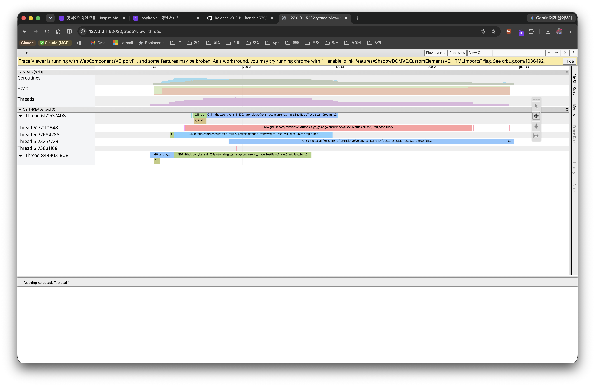

- This is the same execution viewed by OS thread (M) rather than by P (e.g. `Thread 6171537408`). The segments marked `syscall` are the time the thread was tied up in a system call.
- Many long `syscall` segments suggest a network/disk I/O bottleneck, and a sudden surge in the number of threads (M) is a sign that the runtime is creating extra threads because of blocking syscalls. This example is pure CPU work, so there are almost no syscall segments.

## 3.2 Goroutine Analysis

This groups goroutines by type and shows their time distribution. First a summary table by start location appears, and clicking a group leads to a per-goroutine breakdown.

**Summary — grouped by start location**

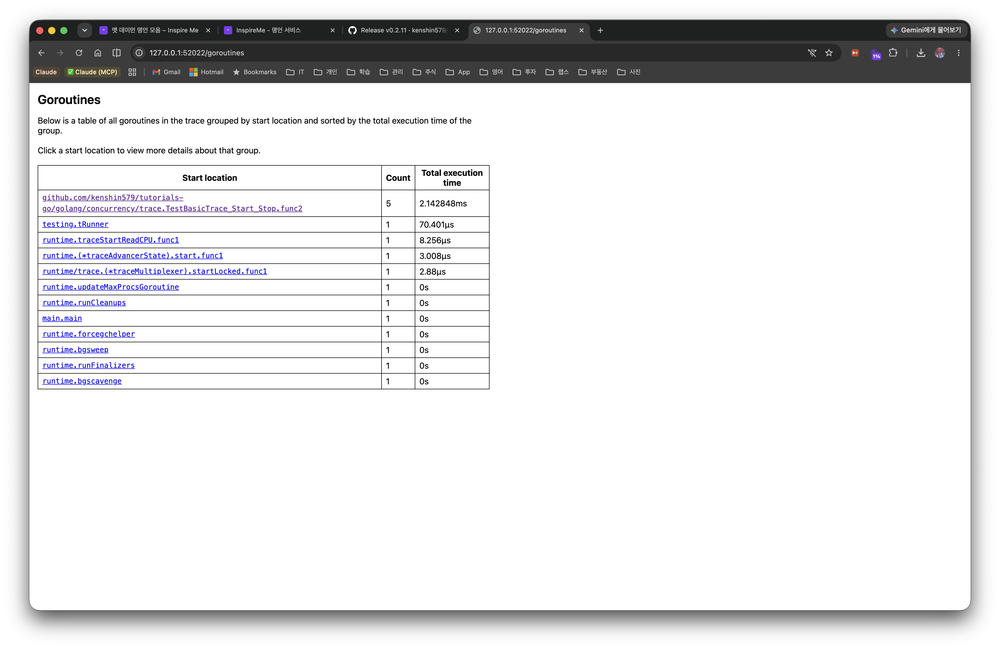

- Goroutines are grouped by **start location**, showing the count and total execution time.
- In this example, `...TestBasicTrace_Start_Stop.func2` takes the largest share at **Count 5, total 2.14ms** → meaning the 5 workers we launched did most of the work. The remaining `testing.tRunner` and `runtime.*` are helper goroutines created by the test harness and the Go runtime.
- Use which function's goroutines consume the most time to narrow down bottleneck candidates.

**Detail — time breakdown per group**

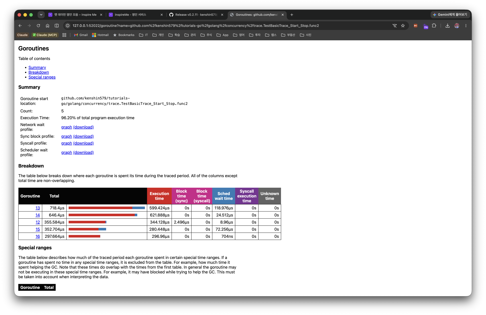

Clicking a group in the summary table breaks down, per goroutine, **where the time was spent** by category. This group accounts for **86.20%** of the entire program's execution time.

- **Execution**: actual CPU execution time (here an overwhelming 86% → a textbook CPU-bound workload)
- **Network wait**: waiting on network I/O
- **Sync block**: waiting on synchronization such as mutexes and channels (close to 0 here — no contention beyond `WaitGroup`)
- **Blocking syscall**: blocking on a system call
- **Scheduler wait**: time spent runnable but waiting for a P (a large value means P scarcity or scheduling contention)

A high Execution share is a target for computation/algorithm optimization, a large Sync block calls for rethinking the lock design, and a large Scheduler wait suggests tuning `GOMAXPROCS` or the number of goroutines.

## 3.3 Blocking Profiles

This shows blocking profiles by Network / Synchronization / Syscall as pprof-style graphs. You can see which functions cause the most blocking, in the form of a call graph.

## 3.4 Scheduler Latency Profile

This shows the distribution of wait time from when a goroutine becomes runnable until it actually runs on a P. If scheduler latency is high, consider increasing GOMAXPROCS or reducing the number of goroutines.

# 4. User-Defined Tasks and Regions

The basic trace alone enables goroutine-level analysis, but for business-logic-level analysis you need **Task**, **Region**, and **Log**. Before diving in, here is a quick summary of the three terms.

- **Task**: a logical unit of work spanning multiple goroutines. A container that ties one flow together, like "order processing". (`trace.NewTask`)
- **Region**: a unit that measures the execution time of a specific section within a single goroutine. Inside a Task it carves out sub-sections such as "DB lookup" or "validation". (`trace.WithRegion` / `trace.StartRegion`)
- **Log**: a marking that records an event in key-value form at a specific point on the trace timeline. It is not a measurement but a record of "what happened at this moment". (`trace.Log`)

To summarize all three in one sentence: **a Task ties work together, a Region measures a section, and a Log marks a moment.**

## 4.1 Task: a Logical Unit of Work

A Task ties a logical task spanning multiple goroutines into one. For example, even if the DB lookup, payment, and notification within an "order processing" Task each run in different goroutines, they can be tracked as a single Task.

```go
ctx, task := rttrace.NewTask(ctx, "order-process")
defer task.End()
rttrace.Log(ctx, "orderID", "ORD-0001")
```

In `go tool trace` you can see a latency histogram per Task, making it easy to identify which kind of work is slow.

## 4.2 Region: Measuring a Section

A Region measures the time of a specific section within a single goroutine. You can use it in two ways.

**WithRegion (closure style)**

```go
rttrace.WithRegion(ctx, "fetch-data", func() {
    // The execution time of this section is recorded in the trace
    time.Sleep(2 * time.Millisecond)
    result = 42
})
```

**StartRegion/End (manual style)**

You can control a Region outside a closure as well, and it can be nested.

```go
region := rttrace.StartRegion(ctx, "validation")
// Do the work
region.End()
```

## 4.3 Log: Marking Events

`trace.Log` records the state at a specific point on the trace timeline.

```go
rttrace.Log(ctx, "request", "GET /api/users")
rttrace.Log(ctx, "cache", "HIT user-list")
```

## 4.4 How Task/Region/Log Work Together

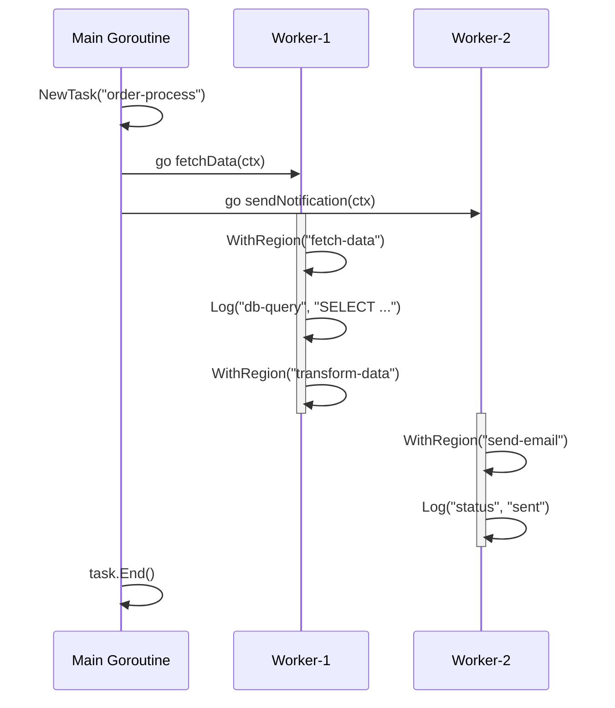

# 5. GODEBUG Scheduler Tracing

`go tool trace` enables precise analysis, but sometimes you want a quick look at the **macro state of the scheduler**. For that, use `GODEBUG=schedtrace`.

## 5.1 Basic Usage

```bash
GODEBUG=schedtrace=1000 ./myapp
```

The scheduler state is printed to stderr every 1 second (1000ms).

```
SCHED 0ms: gomaxprocs=12 idleprocs=10 threads=3 spinningthreads=1
  needspinning=0 idlethreads=0 runqueue=0
  [0 0 0 0 0 0 0 0 0 0 0 0]
```

## 5.2 Interpreting the Output Fields

| Field | Meaning |
|------|------|
| `gomaxprocs` | the GOMAXPROCS value (number of P's) |
| `idleprocs` | the number of idle P's |
| `threads` | the number of OS threads (M) |
| `spinningthreads` | the number of M's looking for a goroutine to run |
| `runqueue` | the number of goroutines in the global run queue |
| `[...]` | the number of goroutines in each P's local run queue |

## 5.3 scheddetail=1 Detailed Output

```bash
GODEBUG=schedtrace=1000,scheddetail=1 ./myapp
```

The detailed state of each P, M, and G is printed.

- **P line**: `status` (idle/running/syscall), `schedtick`, `syscalltick`, local queue size
- **M line**: P binding state, whether spinning, whether blocked
- **G line**: goroutine state, reason for waiting

## 5.4 Goroutine State Codes

| Code | Name | Meaning |
|------|------|------|
| 0 | `_Gidle` | just created, not yet initialized |
| 1 | `_Grunnable` | runnable, waiting in the queue |
| 2 | `_Grunning` | running on an M |
| 3 | `_Gsyscall` | executing a system call |
| 4 | `_Gwaiting` | blocked on a channel, mutex, etc. |

## 5.5 Testing with a subprocess

Since the `GODEBUG` environment variable is only applied at process startup, tests verify it by launching a subprocess via `os/exec`.

```go
func TestSchedtrace_GODEBUG_출력_파싱(t *testing.T) {
    if os.Getenv("SCHEDTRACE_HELPER") == "1" {
        // helper process: create goroutines to trigger scheduler activity
        var wg sync.WaitGroup
        for range 50 {
            wg.Add(1)
            go func() {
                defer wg.Done()
                sum := 0
                for range 100_000 {
                    sum++
                }
            }()
        }
        wg.Wait()
        return
    }

    // main test: run the helper as a subprocess
    cmd := exec.Command(os.Args[0],
        "-test.run=TestSchedtrace_GODEBUG_출력_파싱",
        "-test.v",
    )
    cmd.Env = append(os.Environ(),
        "SCHEDTRACE_HELPER=1",
        "GODEBUG=schedtrace=100",
    )

    output, err := cmd.CombinedOutput()
    outputStr := string(output)

    assert.NoError(t, err, "failed to run the subprocess")
    assert.Contains(t, outputStr, "SCHED", "schedtrace output should be present")
    assert.Contains(t, outputStr, "gomaxprocs=", "the gomaxprocs field should be present")
}
```

This is a pattern where, instead of `t.Skip()`, the test naturally branches into the subprocess-launch path when the `SCHEDTRACE_HELPER=1` environment variable is absent. The helper process performs the actual workload only when `SCHEDTRACE_HELPER=1` is set.

# 6. Flight Recorder (Go 1.25)

## 6.1 The Evolution of Go trace

Go's execution trace has been continuously improved.

| Version | Change |
|------|---------|
| Go 1.21 | trace overhead reduced dramatically from 10-20% to **1-2%** |
| Go 1.22 | new trace format introduced (partitioning, streaming, per-M batching) |
| Go 1.25 | `runtime/trace.FlightRecorder` **officially included** |

## 6.2 What the FlightRecorder Is

The FlightRecorder is a "black box recorder" that continuously collects a trace into a **ring buffer** and saves a snapshot when an anomaly occurs. Like an airplane's black box, it lets you analyze, after the fact, the situation **just before** a problem occurred.

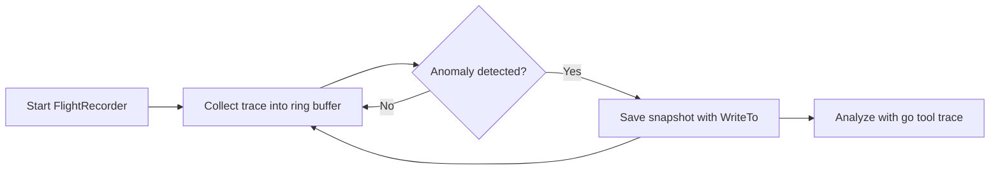

## 6.3 The Basic API

```go
fr := rttrace.NewFlightRecorder(rttrace.FlightRecorderConfig{
    MinAge:   200 * time.Millisecond,  // minimum retention time
    MaxBytes: 1 << 20,                 // maximum 1 MiB
})

fr.Start()
defer fr.Stop()

// Save a snapshot when an anomaly occurs
if latency > threshold {
    var buf bytes.Buffer
    fr.WriteTo(&buf)
}
```

- `MinAge`: keep at least this much trace data in the ring buffer
- `MaxBytes`: the maximum size of the ring buffer. When exceeded, the oldest data is dropped first

## 6.4 Hands-on Example: Detecting HTTP Server Latency

The following example automatically captures a FlightRecorder snapshot when an HTTP server's response time exceeds a threshold.

```go
func TestFlightRecorder_HTTP서버_Latency_감지(t *testing.T) {
    const latencyThreshold = 50 * time.Millisecond

    fr := rttrace.NewFlightRecorder(rttrace.FlightRecorderConfig{
        MinAge:   200 * time.Millisecond,
        MaxBytes: 1 << 20,
    })

    err := fr.Start()
    assert.NoError(t, err)
    defer fr.Stop()

    // server with variable response time
    requestCount := 0
    var mu sync.Mutex
    server := httptest.NewServer(http.HandlerFunc(func(w http.ResponseWriter, r *http.Request) {
        mu.Lock()
        count := requestCount
        requestCount++
        mu.Unlock()

        // simulate a slow response on every 5th request
        if count%5 == 4 {
            time.Sleep(80 * time.Millisecond)
        } else {
            time.Sleep(5 * time.Millisecond)
        }
        fmt.Fprintf(w, "request-%d", count)
    }))
    defer server.Close()

    // client: capture a snapshot when latency is exceeded
    var snapshots []int64
    client := server.Client()

    for i := range 10 {
        start := time.Now()
        resp, err := client.Get(server.URL)
        assert.NoError(t, err)
        io.Copy(io.Discard, resp.Body)
        resp.Body.Close()

        elapsed := time.Since(start)
        if elapsed > latencyThreshold {
            var buf bytes.Buffer
            n, _ := fr.WriteTo(&buf)
            snapshots = append(snapshots, n)
            t.Logf("snapshot captured! (size: %d bytes, latency: %v)", n, elapsed)
        }
    }

    assert.NotEmpty(t, snapshots, "a snapshot should be captured when latency is exceeded")
}
```

In production, save the result of `fr.WriteTo` to a file or upload it to object storage so you can analyze it later with `go tool trace`.

## 6.5 A Guide to Setting MinAge/MaxBytes

| Scenario | MinAge | MaxBytes | Description |
|---------|--------|----------|------|
| Fast request analysis | 200ms | 1 MiB | a detailed trace of a single request |
| Batch job analysis | 5s | 10 MiB | tracking the full flow of a long job |
| Memory-constrained environment | 100ms | 512 KiB | minimal memory usage |

# 7. Third-Party Visualization Tools

## 7.1 gotraceui (dominikh/gotraceui)

The web-based viewer of `go tool trace` depends on Chrome and can be slow with large traces. `gotraceui` is a native GUI viewer that replaces it.

**Advantages:**
- No Chrome dependency (a native app built on the Gio framework)
- Efficient handling of large traces
- Per-goroutine timeline, heatmaps, flame graphs
- CPU sample overlay

**Installation and usage:**

```bash
go install honnef.co/go/gotraceui/cmd/gotraceui@latest
gotraceui trace.out
```

When you actually open a worker pool trace, the per-Processor and per-goroutine timelines and execution states (sync, blocked, inactive) are visible at a glance.

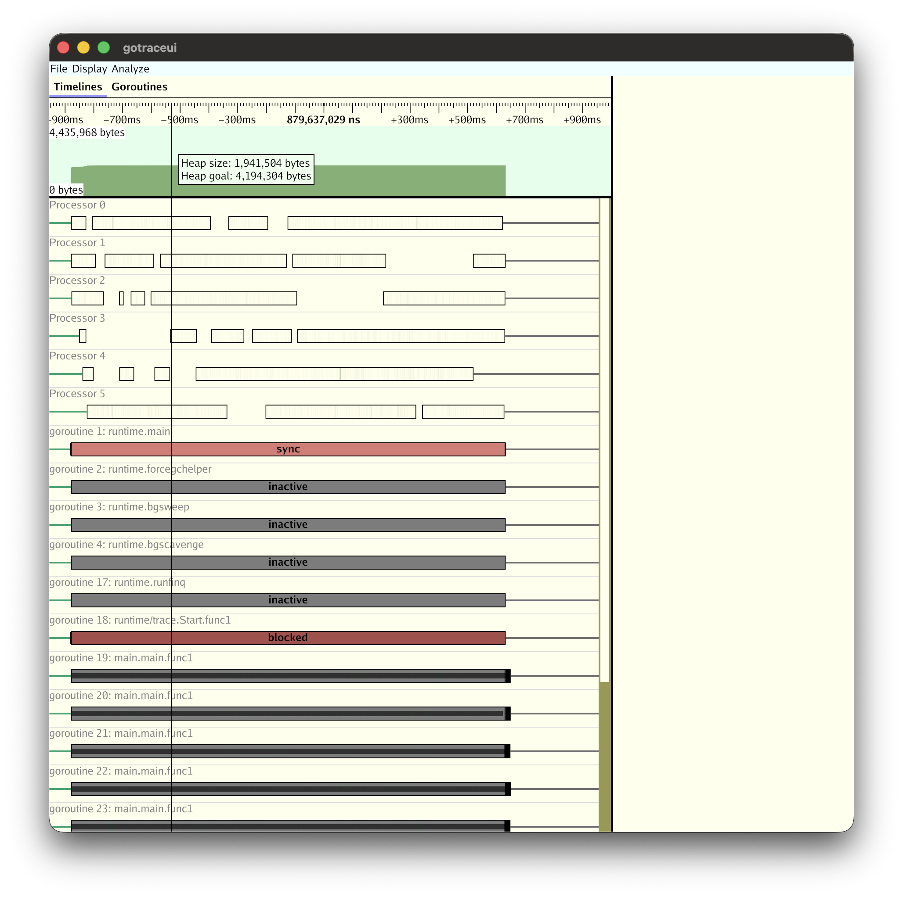

In the `Goroutines` tab you can see each goroutine's start/end times and execution time in a table.

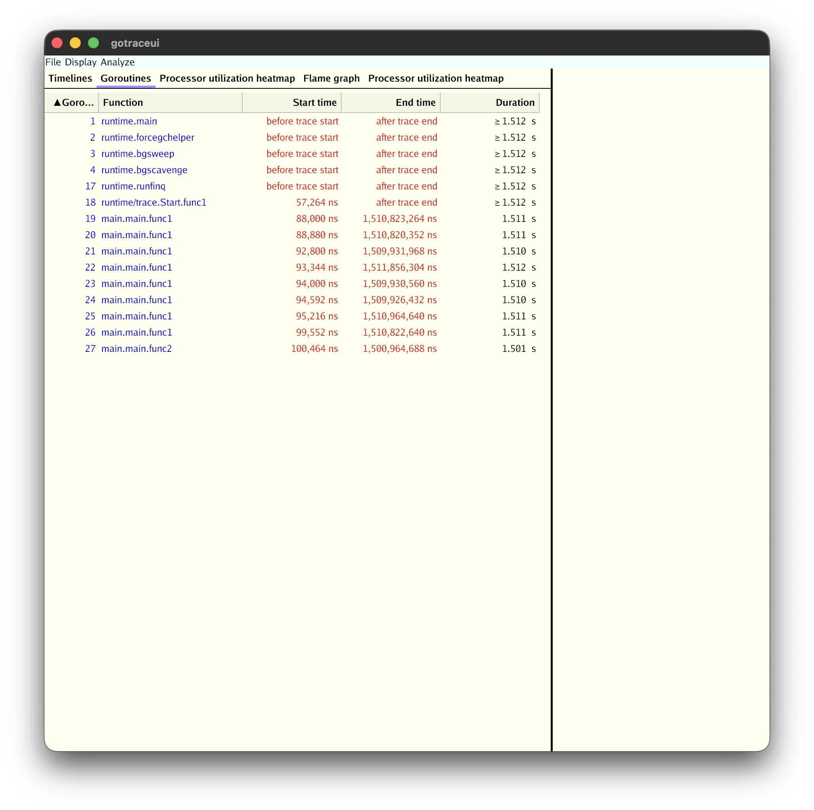

> Memory requirement: about 30x the trace file size. A 100MB trace → about 3GB of RAM needed.

> ⚠️ **Caution about trace format version compatibility**: The latest gotraceui release (v0.4.0) supports **only the old trace format of Go 1.21 and earlier**. As discussed in [Section 2](#2-go-tool-trace-basics), the trace format was redesigned in Go 1.22, but gotraceui cannot yet read this new format, so opening a trace generated with a recent Go produces an `unsupported trace file version` error. It also rejects short traces that end after a few milliseconds with `trace too short`. So to analyze with gotraceui you need a **trace from a program built with Go 1.21 that runs for at least a few hundred ms**. If you use a recent Go, use the official viewer `go tool trace`, which supports the new format, or wait for a gotraceui release that supports the new format.

## 7.2 divan/gotrace (Educational 3D Visualization)

This visualizes goroutines and channel communication as WebGL-based 3D animations.

- blue lines = goroutine lifecycles
- red arrows = message passing over channels

It is suitable for **educational purposes** because you can intuitively understand concurrency patterns like fan-in, fan-out, and worker pools. However, it requires a **patched old Go runtime** (a Docker image) modified to also record channel events, and it can only visualize short programs.

> ⚠️ **Currently not runnable**: maintenance stopped after 2016, so it does not work in today's environment. The Go version of the official Docker image (1.8) and the trace parser built into the tool (which only handles the `go 1.5 trace` format) are mismatched, producing a `not a trace file` error, and binaries built with the old runtime also do not run on recent macOS. So treat the content below as a conceptual reference only, and if you need actual visualization, use `go tool trace` or gotraceui.

# 8. Combining pprof and trace

## 8.1 pprof vs trace

| Aspect | pprof | trace |
|------|-------|-------|
| Question | "What consumes resources?" | "What happened, and in what order?" |
| Method | sampling (statistical) | full recording (precise) |
| Overhead | CPU profile ~5% | 1-2% (Go 1.21+) |
| Output | flame graph, top N | timeline, goroutine analysis |
| Strength | identifying CPU/memory hotspots | causality, timing, concurrency analysis |

## 8.2 The Combined Workflow

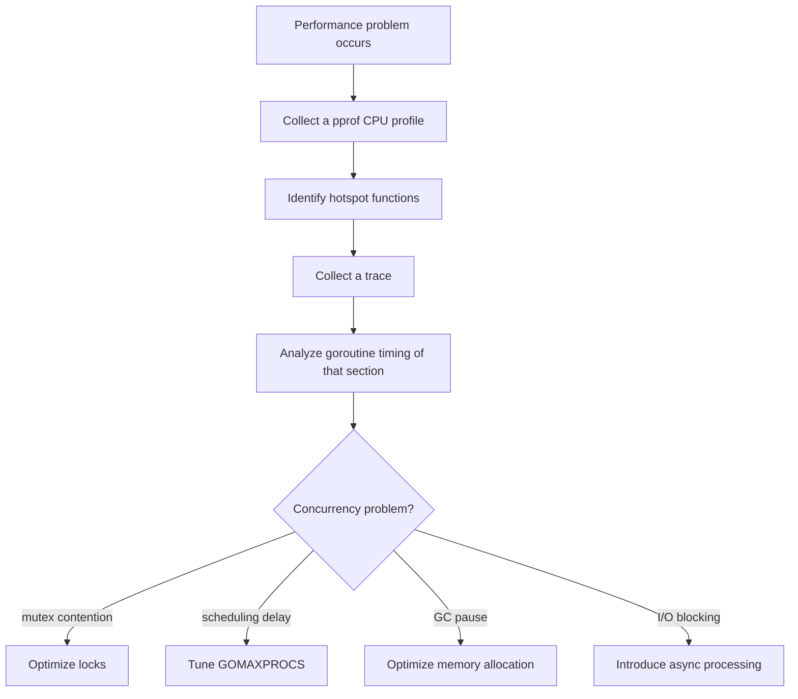

## 8.3 When trace Is Better Than pprof

- **mutex contention between goroutines**: pprof's mutex profile shows only the total contention time, but trace shows exactly which goroutine waited for a lock at which point in time
- **scheduling latency**: time spent runnable but waiting for a P is not visible in pprof
- **impact of GC pauses**: trace can show which goroutine's execution was halted by a GC STW
- **channel communication patterns**: data flow through channels and the possibility of deadlock can only be analyzed in trace

## 8.4 Concurrent Collection Example

You can collect a pprof CPU profile and a trace simultaneously.

```go
func TestPprof_Trace_동시수집(t *testing.T) {
    _ = os.MkdirAll("tmp", 0o755)
    traceFile, _ := os.Create("tmp/trace_combo.out")
    defer traceFile.Close()

    cpuFile, _ := os.Create("tmp/cpu_combo.prof")
    defer cpuFile.Close()

    // start the trace + CPU profile simultaneously
    rttrace.Start(traceFile)
    pprof.StartCPUProfile(cpuFile)

    // run the workload...

    // stop collecting
    rttrace.Stop()
    pprof.StopCPUProfile()

    // analyze:
    // go tool trace tmp/trace_combo.out
    // go tool pprof tmp/cpu_combo.prof
}
```

## 8.5 HTTP pprof Endpoints

Adding `import _ "net/http/pprof"` automatically registers profiling endpoints on the default HTTP server.

| Endpoint | Description |
|-----------|------|
| `/debug/pprof/` | index (list of available profiles) |
| `/debug/pprof/profile` | CPU profile (default 30 seconds) |
| `/debug/pprof/trace` | execution trace (default 1 second) |
| `/debug/pprof/heap` | memory allocation profile |
| `/debug/pprof/goroutine` | goroutine stack dump |
| `/debug/pprof/block` | blocking profile |
| `/debug/pprof/mutex` | mutex contention profile |

# 9. Hands-on Example: Tracing a Concurrent Web Crawler

Finally, we'll apply Task/Region/Log instrumentation to a simple web crawler based on the Worker Pool pattern and see what information we can get from the trace.

## 9.1 Crawler Structure

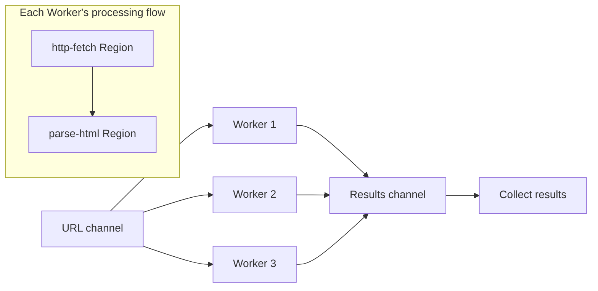

## 9.2 Instrumentation Code

```go
func TestCrawler_Task_Region_계측(t *testing.T) {
    _ = os.MkdirAll("tmp", 0o755)
    f, _ := os.Create("tmp/trace_crawler.out")
    defer f.Close()

    rttrace.Start(f)
    defer rttrace.Stop()

    // build a test with no external dependency using an httptest server
    pages := map[string]string{
        "/":        `<a href="/about">About</a><a href="/blog">Blog</a>`,
        "/about":   `<h1>About Us</h1><a href="/contact">Contact</a>`,
        "/blog":    `<h1>Blog</h1><a href="/blog/post1">Post 1</a>`,
        "/contact": `<h1>Contact</h1>`,
    }
    server := httptest.NewServer(http.HandlerFunc(func(w http.ResponseWriter, r *http.Request) {
        time.Sleep(time.Duration(len(r.URL.Path)) * time.Millisecond)
        if body, ok := pages[r.URL.Path]; ok {
            fmt.Fprint(w, body)
        } else {
            http.NotFound(w, r)
        }
    }))
    defer server.Close()

    ctx := context.Background()
    ctx, mainTask := rttrace.NewTask(ctx, "web-crawler")
    defer mainTask.End()

    results := crawl(ctx, server.URL, server.Client(), 3)
    assert.NotEmpty(t, results, "there should be crawling results")
}
```

Each Worker creates a Task whenever it receives a URL, and wraps the HTTP request and the parsing each in a Region.

```go
for url := range urls {
    taskCtx, task := rttrace.NewTask(ctx, "crawl-page")
    rttrace.Log(taskCtx, "url", url)
    rttrace.Log(taskCtx, "worker", workerName)

    // instrument each step with a Region
    rttrace.WithRegion(taskCtx, "http-fetch", func() {
        // HTTP request...
    })
    rttrace.WithRegion(taskCtx, "parse-html", func() {
        // HTML parsing...
    })

    task.End()
}
```

## 9.3 Running the Example

The code above is included as a test in the [tutorials-go repository](https://github.com/kenshin579/tutorials-go/blob/master/golang/concurrency/trace/crawler_trace_test.go). The process of running it yourself to collect a trace and open it in the viewer is as follows.

```bash
# 1. Clone the repository and move into the trace example directory
git clone https://github.com/kenshin579/tutorials-go.git
cd tutorials-go/golang/concurrency/trace

# 2. Run the crawler test → creates tmp/trace_crawler.out
go test -v -run TestCrawler_Task_Region_계측

# 3. Open the collected trace in the official viewer (launches the browser automatically)
go tool trace tmp/trace_crawler.out
```

When the test passes, the `tmp/trace_crawler.out` file is created, and `go tool trace` starts a local web server and opens the trace viewer in the browser. If the browser does not open automatically, you can specify a port and connect directly.

```bash
go tool trace -http=:6060 tmp/trace_crawler.out   # connect to http://localhost:6060
```

> This example uses an `httptest` server, so it works without an external network. When you are done viewing the trace, stop `go tool trace` with `Ctrl+C`.

## 9.4 Analysis Points in the trace

When you open the collected trace with `go tool trace`, the **User-defined tasks** and **User-defined regions** links on the index page give you direct access to business-logic-level analysis.

**① Latency per Task** — the `User-defined tasks` page shows a latency histogram per Task type.

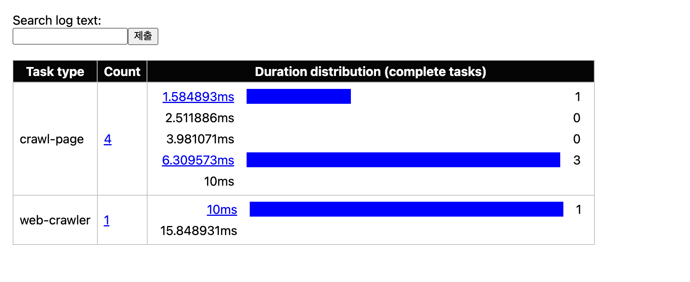

The `crawl-page` Task ran 4 times; one of them was around 1.5ms and three were clustered in the 6.3–10ms range. Because the test server in this example was built to delay responses in proportion to the URL path length, pages with longer paths appear slower. The `web-crawler` Task wrapping the entire crawl ran once and took 10–15.8ms.

**② Comparing time per Region** — on the `User-defined regions` page you can compare the `http-fetch` and `parse-html` sections side by side.

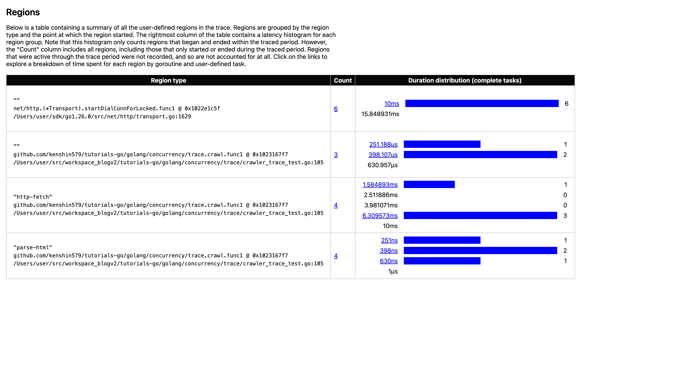

The result is clear. `http-fetch` is 1.5–10ms, whereas `parse-html` is only **251ns–1µs**. In other words, almost all of the crawling time is spent on network I/O (`http-fetch`) and the parsing cost is negligible — you can conclude this just by looking at the trace. The conclusion follows immediately: if you optimize, you should work on the network side, such as the number of concurrent requests or connection reuse, not the parsing.

Beyond this, the following views are useful.

- **Worker utilization**: in `Goroutine analysis`, check the ratio of time a Worker goroutine spends running versus waiting on a channel
- **Scheduling efficiency**: in `Scheduler latency profile`, check how long a Worker is runnable but waiting for a P

# 10. Summary

| Tool/Technique | Core idea | When to use |
|-----------|------|----------|
| `trace.Start/Stop` | precise section collection via code insertion | analyzing a specific section during development/testing |
| `go test -trace` | collect a test trace without modifying code | quickly checking a trace from an existing test |
| `net/http/pprof` | collect a runtime trace over HTTP | analyzing a running server |
| Task/Region/Log | business-logic-level instrumentation | analyzing the latency of a logical task |
| `GODEBUG=schedtrace` | print the scheduler's macro state | a quick check of the scheduler state |
| Flight Recorder | automatic snapshot on an anomaly | debugging production tail latency |
| gotraceui | a GUI for analyzing large traces | analyzing large traces without Chrome |
| pprof + trace combo | CPU hotspots + concurrency causality | analyzing compound performance problems |

The performance problems and bugs in concurrent code are hard to solve with logs and guesswork alone. Make it a habit to analyze **based on data** using `go tool trace`. Now that trace overhead has dropped dramatically to 1-2% since Go 1.21, you can freely collect and inspect a trace whenever you suspect a bottleneck during the development and testing phases.

> You can find the example code on [GitHub](https://github.com/kenshin579/tutorials-go/tree/master/golang/concurrency/trace).

# 11. References

- [More powerful Go execution traces (Go Blog, 2024)](https://go.dev/blog/execution-traces-2024)
- [Flight Recorder in Go 1.25 (Go Blog)](https://go.dev/blog/flight-recorder)
- [runtime/trace official docs](https://pkg.go.dev/runtime/trace)
- [Execution tracer overhaul design proposal (#60773)](https://go.googlesource.com/proposal/+/ac09a140c3d26f8bb62cbad8969c8b154f93ead6/design/60773-execution-tracer-overhaul.md)
- [Scheduler Tracing In Go (Ardan Labs)](https://www.ardanlabs.com/blog/2015/02/scheduler-tracing-in-go.html)
- [gotraceui (GitHub)](https://github.com/dominikh/gotraceui)
- [divan/gotrace (GitHub)](https://github.com/divan/gotrace)
- [Visualizing Concurrency in Go (divan blog)](https://divan.dev/posts/go_concurrency_visualize/)
