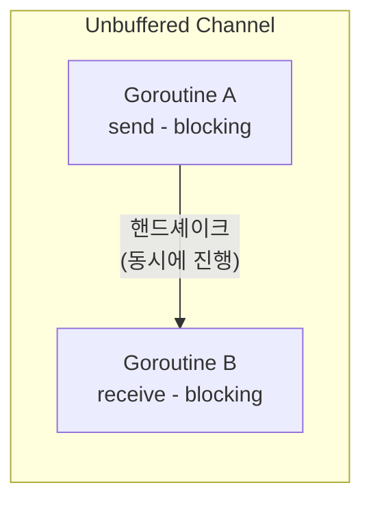
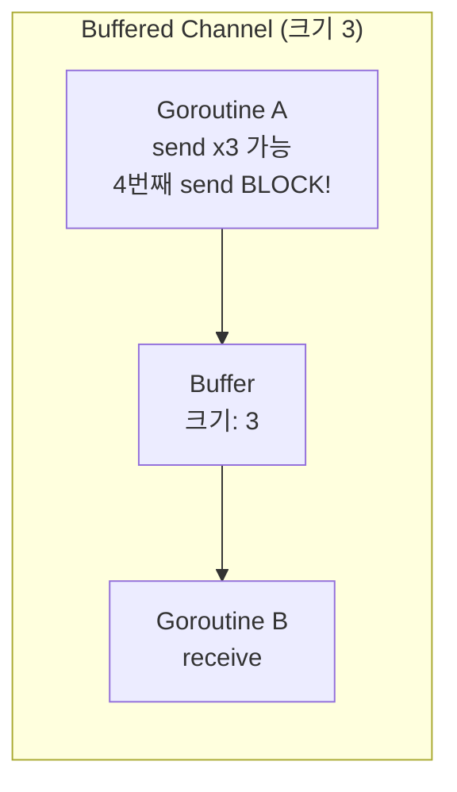

Channel은 goroutine 간 **데이터를 주고받는 통신 수단**이다. Go의 동시성 철학인 "메모리를 공유하지 말고, 통신으로 메모리를 공유하라"를 실현하는 핵심 메커니즘이다.

이번 편에서는 Channel의 기본 동작부터 buffered/unbuffered 차이, 방향 제한, close 규칙까지 완전히 다룬다.

## 1. Channel 개념과 생성


Channel은 `make` 함수로 생성한다. 타입이 지정된 파이프라고 생각하면 된다.

```go
ch := make(chan int)       // unbuffered channel (int 타입)
ch := make(chan string, 5) // buffered channel (string 타입, 버퍼 크기 5)
```

## 2. Send / Receive 동작

Channel에 값을 보내려면 `<-` 연산자를 사용한다.

```go
ch <- 42    // send: channel에 42를 보냄
val := <-ch // receive: channel에서 값을 받음
```

```go
func TestChannelSendReceive(t *testing.T) {
    ch := make(chan int)

    go func() {
        ch <- 42 // send
    }()

    value := <-ch // receive (send될 때까지 blocking)
    assert.Equal(t, 42, value)
}
```

Channel은 다양한 타입을 지원한다. struct를 전달하면 결과와 에러를 함께 보낼 수 있다.

```go
func TestChannelStructType(t *testing.T) {
    type Result struct {
        Value int
        Err   error
    }

    ch := make(chan Result)

    go func() {
        ch <- Result{Value: 100, Err: nil}
    }()

    result := <-ch
    assert.Equal(t, 100, result.Value)
    assert.NoError(t, result.Err)
}
```

## 3. Blocking 동작 이해

Channel의 가장 중요한 특성은 **blocking**이다.

- **Unbuffered channel**: send와 receive가 **동시에 준비**되어야 진행된다
- **Buffered channel**: 버퍼가 가득 차면 send가 blocking, 버퍼가 비면 receive가 blocking





## 4. Unbuffered vs Buffered Channel

### Unbuffered Channel

```go
ch := make(chan int) // 버퍼 크기 0
```

- send하면 **receiver가 receive할 때까지** blocking
- 동기적(synchronous) 통신: 양쪽이 모두 준비되어야 진행

```go
func TestUnbufferedChannel(t *testing.T) {
    ch := make(chan int)

    go func() {
        ch <- 42 // receiver가 준비될 때까지 여기서 blocking
    }()

    time.Sleep(100 * time.Millisecond) // sender는 이미 blocking 중
    value := <-ch                       // receive하는 순간 sender도 진행
    assert.Equal(t, 42, value)
}
```

### Buffered Channel

```go
ch := make(chan int, 3) // 버퍼 크기 3
```

- 버퍼에 빈 공간이 있으면 send가 **즉시** 완료
- 버퍼가 가득 차면 send가 blocking
- 비동기적(asynchronous) 통신

```go
func TestBufferedChannel(t *testing.T) {
    ch := make(chan int, 3)

    // receiver 없이도 3개까지 send 가능
    ch <- 1
    ch <- 2
    ch <- 3
    // ch <- 4 → blocking (버퍼 가득 참)

    assert.Equal(t, 1, <-ch)
    assert.Equal(t, 2, <-ch)
    assert.Equal(t, 3, <-ch)
}
```

### cap과 len

```go
func TestBufferedChannelCapLen(t *testing.T) {
    ch := make(chan string, 5)

    assert.Equal(t, 5, cap(ch)) // 버퍼 용량
    assert.Equal(t, 0, len(ch)) // 현재 대기 중인 값 수

    ch <- "a"
    ch <- "b"

    assert.Equal(t, 5, cap(ch))
    assert.Equal(t, 2, len(ch))
}
```

### 언제 어떤 것을 쓸까?

| 상황 | 선택 |
|------|------|
| goroutine 간 동기화(핸드셰이크) 필요 | Unbuffered |
| 신호 전달 (done, quit) | Unbuffered |
| 생산 속도와 소비 속도 차이 완충 | Buffered |
| Producer/Consumer 패턴 | Buffered |
| 성능이 중요한 대량 데이터 전달 | Buffered |

## 5. Channel 방향 제한

함수 파라미터에서 channel의 방향을 제한할 수 있다.

```go
chan<- int  // send-only (보내기만 가능)
<-chan int  // receive-only (받기만 가능)
```

이를 통해 **컴파일 타임에** channel의 잘못된 사용을 방지할 수 있다.

```go
// producer: send-only channel
func produce(ch chan<- int, values []int) {
    for _, v := range values {
        ch <- v
    }
    close(ch)
}

// consumer: receive-only channel
func consume(ch <-chan int) []int {
    var results []int
    for v := range ch {
        results = append(results, v)
    }
    return results
}

func TestChannelDirection(t *testing.T) {
    ch := make(chan int, 5)
    go produce(ch, []int{1, 2, 3, 4, 5})
    results := consume(ch)
    assert.Equal(t, []int{1, 2, 3, 4, 5}, results)
}
```

양방향 channel은 send-only 또는 receive-only로 **암묵적 변환**된다. 반대 방향으로의 변환은 컴파일 에러가 발생한다.

```go
var sendOnly chan<- int = ch  // OK: 양방향 → send-only
var recvOnly <-chan int = ch  // OK: 양방향 → receive-only
```

## 6. Channel Close

### close의 의미

`close(ch)`는 "이 channel에 **더 이상 값을 보내지 않겠다**"는 선언이다.

### 닫힌 Channel에서 Receive

```go
func TestReceiveFromClosedChannel(t *testing.T) {
    ch := make(chan int, 1)
    ch <- 42
    close(ch)

    // 버퍼에 값이 있으면 정상 반환
    val, ok := <-ch
    assert.Equal(t, 42, val)
    assert.True(t, ok)       // 유효한 값

    // 버퍼가 비고 닫힌 channel → zero value + false
    val, ok = <-ch
    assert.Equal(t, 0, val)  // int의 zero value
    assert.False(t, ok)      // 닫힘 표시
}
```

### Close 규칙

| 규칙 | 설명 |
|------|------|
| **Sender가 close** | receiver가 아닌 **sender**가 close 책임 |
| **두 번 close 금지** | 이미 닫힌 channel을 다시 닫으면 **panic** |
| **닫힌 channel에 send 금지** | 닫힌 channel에 값을 보내면 **panic** |
| **닫힌 channel에서 receive 가능** | zero value + false 반환 |

### Close 책임 패턴

```go
// 패턴: sender가 channel을 생성하고, 보내고, close한다
func generator() <-chan int {
    ch := make(chan int)
    go func() {
        defer close(ch)   // sender가 close 책임
        for i := range 5 {
            ch <- i
        }
    }()
    return ch // receive-only로 반환
}
```

## 7. Range over Channel

`range`를 사용하면 channel이 **닫힐 때까지** 자동으로 값을 수신한다.

```go
func TestRangeOverChannel(t *testing.T) {
    ch := make(chan int, 5)

    go func() {
        for i := 1; i <= 5; i++ {
            ch <- i
        }
        close(ch) // range가 종료되려면 close 필수!
    }()

    var results []int
    for v := range ch {
        results = append(results, v)
    }

    assert.Equal(t, []int{1, 2, 3, 4, 5}, results)
}
```

> `range ch`가 종료되려면 반드시 `close(ch)`가 호출되어야 한다. close하지 않으면 range는 영원히 blocking된다.

### 신호용 Channel

데이터 전달이 아닌 **완료 신호**만 보내려면 `chan struct{}`를 사용한다. struct{}는 메모리를 차지하지 않는다.

```go
func TestChannelSignaling(t *testing.T) {
    done := make(chan struct{})

    go func() {
        // 작업 수행...
        close(done) // 완료 신호 (모든 receiver에게 전달)
    }()

    <-done // 완료 대기
}
```

`close(done)`은 **모든** receiver에게 동시에 신호를 보낸다. 이것이 단순히 `done <- struct{}{}`와의 차이점이다.

> `struct{}`와 `struct{}{}`의 차이가 헷갈린다면 [FAQ](#q-struct와-struct의-차이는)를 참고하자.

## 8. 실습: Producer / Consumer 패턴

```go
func TestProducerConsumer(t *testing.T) {
    ch := make(chan int, 10)
    var results []int

    // Producer: 제곱수 생성
    go func() {
        for i := 1; i <= 10; i++ {
            ch <- i * i
        }
        close(ch)
    }()

    // Consumer: 결과 수집
    for val := range ch {
        results = append(results, val)
    }

    expected := []int{1, 4, 9, 16, 25, 36, 49, 64, 81, 100}
    assert.Equal(t, expected, results)
}
```

### 여러 Producer

```go
func TestMultipleProducers(t *testing.T) {
    ch := make(chan int, 20)
    var wg sync.WaitGroup

    // 3개의 producer
    for p := range 3 {
        wg.Add(1)
        go func() {
            defer wg.Done()
            for i := range 5 {
                ch <- p*100 + i
            }
        }()
    }

    // producer가 모두 끝나면 channel close
    go func() {
        wg.Wait()
        close(ch)
    }()

    var results []int
    for val := range ch {
        results = append(results, val)
    }

    assert.Len(t, results, 15) // 3 x 5 = 15개
}
```

## 9. 정리

| 개념 | 핵심 |
|------|------|
| Channel | goroutine 간 타입 안전한 통신 수단 |
| Unbuffered | 동기적 핸드셰이크, send/receive 동시 준비 필요 |
| Buffered | 비동기적 큐, 버퍼 크기만큼 send 가능 |
| 방향 제한 | `chan<-` (send-only), `<-chan` (receive-only) |
| Close | sender가 책임, 닫힌 channel은 zero value 반환 |
| Range | channel 닫힐 때까지 자동 수신 |
| `chan struct{}` | 신호 전달용 (메모리 0) |

다음 편에서는 여러 channel을 동시에 처리하는 **select**문과 **fan-in/fan-out** 등 channel 심화 패턴을 다룬다.

## FAQ

### Q. `struct{}`와 `struct{}{}`의 차이는?

`struct{}`는 **타입**이고, `struct{}{}`는 **값(인스턴스)**이다.

일반 구조체로 비유하면 이해하기 쉽다:

```go
type Person struct {
    Name string
    Age  int
}

p := Person{Name: "Frank", Age: 30}
//   ^^^^^^ 타입
//         ^^^^^^^^^^^^^^^^^^^^^^^^ 값
```

마찬가지로 빈 구조체도 동일한 구조다:

```go
v := struct{}{}
//   ^^^^^^^^ 타입: struct{} (필드가 없는 구조체)
//           ^^ 값: {} (빈 리터럴)
```

| 표현 | 의미 | 비유 |
|------|------|------|
| `int` | int 타입 | 설계도 |
| `42` | int 값 | 실물 |
| `struct{}` | 빈 구조체 타입 | 설계도 (필드 없음) |
| `struct{}{}` | 빈 구조체 값 | 실물 (내용 없음) |

Channel에서 사용할 때:

```go
// channel 생성 — 타입을 지정
done := make(chan struct{})  // struct{} 타입의 channel

// 값을 보냄 — struct{}{} 인스턴스를 send
done <- struct{}{}

// close — 값 대신 "닫힘" 신호를 모든 receiver에게 전달
close(done)
```

`struct{}`는 메모리를 0바이트 차지하므로, 데이터 없이 **신호만 전달**할 때 가장 효율적인 선택이다.

## 참고

- [Go Tour - Channels](https://go.dev/tour/concurrency/2)
- [Effective Go - Channels](https://go.dev/doc/effective_go#channels)
- [Go Blog - Pipelines and cancellation](https://go.dev/blog/pipelines)
