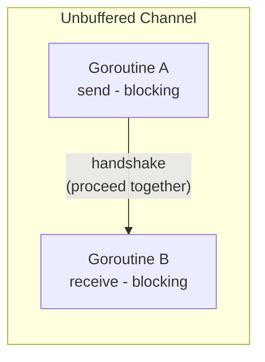
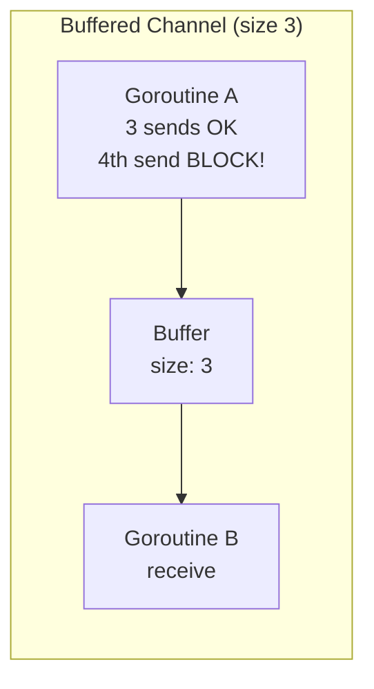

A channel is the **means of communication for exchanging data** between goroutines. It is the core mechanism that realizes Go's concurrency philosophy: "do not communicate by sharing memory; instead, share memory by communicating."

In this part, we fully cover channels — from basic behavior to the buffered/unbuffered difference, direction restrictions, and close rules.

# 1. Channel Concept and Creation


A channel is created with the `make` function. Think of it as a typed pipe.

```go
ch := make(chan int)       // unbuffered channel (int type)
ch := make(chan string, 5) // buffered channel (string type, buffer size 5)
```

<!-- slides -->

# 2. Send / Receive Behavior

To send a value to a channel, use the `<-` operator.

```go
ch <- 42    // send: send 42 to the channel
val := <-ch // receive: receive a value from the channel
```

```go
func TestChannelSendReceive(t *testing.T) {
    ch := make(chan int)

    go func() {
        ch <- 42 // send
    }()

    value := <-ch // receive (blocks until sent)
    assert.Equal(t, 42, value)
}
```

Channels support various types. Passing a struct lets you send a result and an error together.

```go
func TestChannelStructType(t *testing.T) {
    type Result struct {
        Value int
        Err   error
    }

    ch := make(chan Result)

    go func() {
        ch <- Result{Value: 100, Err: nil}
    }()

    result := <-ch
    assert.Equal(t, 100, result.Value)
    assert.NoError(t, result.Err)
}
```

# 3. Understanding Blocking Behavior

The most important characteristic of a channel is **blocking**.

- **Unbuffered channel**: send and receive must be **ready at the same time** to proceed
- **Buffered channel**: send blocks when the buffer is full; receive blocks when the buffer is empty





# 4. Unbuffered vs Buffered Channel

## 4.1 Unbuffered Channel

```go
ch := make(chan int) // buffer size 0
```

- when you send, it blocks **until the receiver receives**
- synchronous communication: both sides must be ready to proceed

```go
func TestUnbufferedChannel(t *testing.T) {
    ch := make(chan int)

    go func() {
        ch <- 42 // blocks here until the receiver is ready
    }()

    time.Sleep(100 * time.Millisecond) // the sender is already blocking
    value := <-ch                       // the moment we receive, the sender proceeds too
    assert.Equal(t, 42, value)
}
```

## 4.2 Buffered Channel

```go
ch := make(chan int, 3) // buffer size 3
```

- if there's free space in the buffer, send completes **immediately**
- send blocks when the buffer is full
- asynchronous communication

```go
func TestBufferedChannel(t *testing.T) {
    ch := make(chan int, 3)

    // can send up to 3 even without a receiver
    ch <- 1
    ch <- 2
    ch <- 3
    // ch <- 4 → blocking (buffer full)

    assert.Equal(t, 1, <-ch)
    assert.Equal(t, 2, <-ch)
    assert.Equal(t, 3, <-ch)
}
```

## 4.3 cap and len

```go
func TestBufferedChannelCapLen(t *testing.T) {
    ch := make(chan string, 5)

    assert.Equal(t, 5, cap(ch)) // buffer capacity
    assert.Equal(t, 0, len(ch)) // number of values currently waiting

    ch <- "a"
    ch <- "b"

    assert.Equal(t, 5, cap(ch))
    assert.Equal(t, 2, len(ch))
}
```

## 4.4 When to Use Which?

| Situation | Choice |
|------|------|
| synchronization (handshake) between goroutines needed | Unbuffered |
| signaling (done, quit) | Unbuffered |
| buffering the difference between production and consumption speeds | Buffered |
| Producer/Consumer pattern | Buffered |
| high-throughput data transfer where performance matters | Buffered |

# 5. Channel Direction Restrictions

You can restrict a channel's direction in a function parameter.

```go
chan<- int  // send-only (can only send)
<-chan int  // receive-only (can only receive)
```

This lets you prevent incorrect use of a channel **at compile time**.

```go
// producer: send-only channel
func produce(ch chan<- int, values []int) {
    for _, v := range values {
        ch <- v
    }
    close(ch)
}

// consumer: receive-only channel
func consume(ch <-chan int) []int {
    var results []int
    for v := range ch {
        results = append(results, v)
    }
    return results
}

func TestChannelDirection(t *testing.T) {
    ch := make(chan int, 5)
    go produce(ch, []int{1, 2, 3, 4, 5})
    results := consume(ch)
    assert.Equal(t, []int{1, 2, 3, 4, 5}, results)
}
```

A bidirectional channel is **implicitly converted** to send-only or receive-only. Conversion in the opposite direction causes a compile error.

```go
var sendOnly chan<- int = ch  // OK: bidirectional → send-only
var recvOnly <-chan int = ch  // OK: bidirectional → receive-only
```

# 6. Channel Close

## 6.1 The Meaning of close

`close(ch)` is a declaration that "**no more values will be sent** to this channel."

## 6.2 Receiving from a Closed Channel

```go
func TestReceiveFromClosedChannel(t *testing.T) {
    ch := make(chan int, 1)
    ch <- 42
    close(ch)

    // if there's a value in the buffer, it returns normally
    val, ok := <-ch
    assert.Equal(t, 42, val)
    assert.True(t, ok)       // a valid value

    // empty buffer and closed channel → zero value + false
    val, ok = <-ch
    assert.Equal(t, 0, val)  // int's zero value
    assert.False(t, ok)      // closed indicator
}
```

## 6.3 Close Rules

| Rule | Description |
|------|------|
| **Sender closes** | the **sender**, not the receiver, is responsible for closing |
| **No double close** | closing an already-closed channel causes a **panic** |
| **No send on a closed channel** | sending a value to a closed channel causes a **panic** |
| **Receive from a closed channel is OK** | returns zero value + false |

## 6.4 Close Responsibility Pattern

```go
// pattern: the sender creates the channel, sends, and closes
func generator() <-chan int {
    ch := make(chan int)
    go func() {
        defer close(ch)   // the sender is responsible for closing
        for i := range 5 {
            ch <- i
        }
    }()
    return ch // return as receive-only
}
```

# 7. Range over Channel

Using `range`, values are automatically received **until the channel is closed**.

```go
func TestRangeOverChannel(t *testing.T) {
    ch := make(chan int, 5)

    go func() {
        for i := 1; i <= 5; i++ {
            ch <- i
        }
        close(ch) // close is required for range to terminate!
    }()

    var results []int
    for v := range ch {
        results = append(results, v)
    }

    assert.Equal(t, []int{1, 2, 3, 4, 5}, results)
}
```

> For `range ch` to terminate, `close(ch)` must be called. Without close, range blocks forever.

## 7.1 Signaling Channel

To send only a **completion signal** rather than data, use `chan struct{}`. struct{} takes up no memory.

```go
func TestChannelSignaling(t *testing.T) {
    done := make(chan struct{})

    go func() {
        // do work...
        close(done) // completion signal (delivered to all receivers)
    }()

    <-done // wait for completion
}
```

`close(done)` sends a signal to **all** receivers simultaneously. This is the difference from simply doing `done <- struct{}{}`.

> If you're confused about the difference between `struct{}` and `struct{}{}`, see the [FAQ](#q-whats-the-difference-between-struct-and-struct).

# 8. Practice: Producer / Consumer Pattern

```go
func TestProducerConsumer(t *testing.T) {
    ch := make(chan int, 10)
    var results []int

    // Producer: generate squares
    go func() {
        for i := 1; i <= 10; i++ {
            ch <- i * i
        }
        close(ch)
    }()

    // Consumer: collect results
    for val := range ch {
        results = append(results, val)
    }

    expected := []int{1, 4, 9, 16, 25, 36, 49, 64, 81, 100}
    assert.Equal(t, expected, results)
}
```

## 8.1 Multiple Producers

```go
func TestMultipleProducers(t *testing.T) {
    ch := make(chan int, 20)
    var wg sync.WaitGroup

    // 3 producers
    for p := range 3 {
        wg.Add(1)
        go func() {
            defer wg.Done()
            for i := range 5 {
                ch <- p*100 + i
            }
        }()
    }

    // close the channel once all producers finish
    go func() {
        wg.Wait()
        close(ch)
    }()

    var results []int
    for val := range ch {
        results = append(results, val)
    }

    assert.Len(t, results, 15) // 3 x 5 = 15 items
}
```

# 9. Quiz

If you've read this far, these are questions you can answer. Pick an answer and the explanation shows up right away.

```quiz
- type: mcq
  q: "Which correctly describes the difference between an unbuffered and a buffered channel?"
  choices: ["Buffered lets you send up to its size with no receiver", "Unbuffered needs at least one buffer slot before a send", "Buffered never blocks on a send even when the buffer is full", "Unbuffered does not wait for a receiver after it has sent"]
  answer: 0
  explain: "A buffered channel completes a send immediately while there is free space in the buffer, so you can send up to the buffer size even with no receiver; once the buffer is full the send blocks. An unbuffered channel has buffer size 0, so a send blocks until the receiver receives — synchronous communication. (Sections 4.1, 4.2)"

- type: code
  q: "If you run this code as is, what happens at (1)?"
  lang: go
  code: |
    ch := make(chan int)

    ch <- 42      // (1)
    value := <-ch // (2)
    _ = value
  choices: ["The value lands in the buffer and the next line runs", "Being unbuffered, the send itself is a compile error", "The make above it hands the channel a buffer of 1", "With no receiver, it blocks there and makes no progress"]
  answer: 3
  explain: "make(chan int) creates an unbuffered channel with buffer size 0. An unbuffered channel proceeds only when send and receive are ready at the same time, but the receive at (2) sits on the next line of the same goroutine and never gets a chance to run. So it stops at (1). (Sections 3, 4.1)"

- type: ox
  q: "close(done) delivers the completion signal to all waiting receivers simultaneously."
  answer: true
  explain: "Correct. close(done) signals all receivers at once, which is the difference from done <- struct{}{}, which hands a single value to one receiver. That is why close is used to broadcast a completion signal. (Section 7.1)"

- type: blank
  q: "The direction notation that restricts a function parameter to receiving only is ___ int, and converting in the opposite direction is a compile error."
  answer: ["<-chan", "<- chan"]
  explain: "Receive-only is written <-chan int. A bidirectional channel is implicitly converted to send-only (chan<-) or receive-only (<-chan), but not the other way around. Restricting the direction blocks incorrect use at compile time. (Section 5)"

- type: mcq
  q: "Which of the following is a correct rule about closing a channel?"
  choices: ["The receiver, not the sender, is responsible for closing", "Closing an already-closed channel is harmless and a no-op", "Sending a value to a closed channel causes a panic", "Receiving a value from a closed channel causes a panic"]
  answer: 2
  explain: "Sending on a closed channel panics. Responsibility for closing belongs to the sender, and closing an already-closed channel panics too. Receiving from a closed channel, by contrast, is allowed and returns the zero value plus false. (Section 6.3)"

- type: code
  q: "What values end up in v2 and ok2 in this code?"
  lang: go
  code: |
    ch := make(chan int, 1)
    ch <- 42
    close(ch)

    v1, ok1 := <-ch
    v2, ok2 := <-ch
    _, _, _, _ = v1, ok1, v2, ok2
  choices: ["v2 comes out as 42 and ok2 comes out as true", "v2 comes out as 0 and ok2 comes out as false", "The second receive panics on the closed channel", "The second receive blocks right there on that line"]
  answer: 1
  explain: "The first receive takes the 42 left in the buffer along with true. After that the buffer is empty and the channel is closed, so the second receive does not block: it returns int's zero value 0 and false, the closed indicator, right away. (Section 6.2)"

- type: ox
  q: "Once the sender has sent every value it has, range ch terminates on its own without a close."
  answer: false
  explain: "No. For range ch to terminate, close(ch) must be called. Even if every value has been sent, without a close the range keeps waiting for the next value and blocks forever. (Section 7)"

- type: blank
  q: "To exchange only a completion signal without data, use the chan ___{} type, which takes up 0 bytes of memory."
  answer: ["struct", "struct{}"]
  explain: "It is chan struct{}. struct{} is an empty struct type with no fields and takes up 0 bytes, making it the most efficient choice for delivering a signal without data. To send a value you use the instance struct{}{}. (Section 7.1)"

- type: mcq
  q: "By the article's selection criteria, when is an unbuffered channel recommended?"
  choices: ["When goroutines need handshake-style synchronization", "When you want to buffer a production/consumption gap", "When the Producer/Consumer pattern drives throughput", "When performance-critical bulk data has to be passed"]
  answer: 0
  explain: "Unbuffered is for synchronization (handshakes) between goroutines and for signals such as done and quit. Buffering a production/consumption speed gap, the Producer/Consumer pattern, and performance-critical bulk transfer all belong to buffered. (Section 4.4)"

- type: code
  q: "Which line in this code fails to compile?"
  lang: go
  code: |
    ch := make(chan int, 5)

    var sendOnly chan<- int = ch // (1)
    var recvOnly <-chan int = ch // (2)
    var both chan int = recvOnly // (3)
    _, _, _ = sendOnly, recvOnly, both
  choices: ["(1) — a bidirectional channel cannot become send-only", "(2) — a bidirectional channel cannot go receive-only", "None of them: all three lines compile just fine", "(3) — a direction-restricted one cannot go bidirectional"]
  answer: 3
  explain: "A bidirectional channel is implicitly converted to send-only or receive-only, so (1) and (2) are fine. The opposite direction is not allowed: turning a direction-restricted channel back into a bidirectional one at (3) is a compile error. (Section 5)"
```

# 10. Summary

| Concept | Core |
|------|------|
| Channel | a type-safe means of communication between goroutines |
| Unbuffered | synchronous handshake, requires simultaneous send/receive readiness |
| Buffered | asynchronous queue, can send up to the buffer size |
| Direction restriction | `chan<-` (send-only), `<-chan` (receive-only) |
| Close | the sender is responsible; a closed channel returns the zero value |
| Range | automatically receives until the channel is closed |
| `chan struct{}` | for signaling (0 memory) |

In the next part, we'll cover advanced channel patterns such as the **select** statement, which handles multiple channels simultaneously, and **fan-in/fan-out**.

# 11. FAQ

## 11.1 Q. What's the difference between `struct{}` and `struct{}{}`?

`struct{}` is a **type**, and `struct{}{}` is a **value (instance)**.

It's easier to understand by analogy with a regular struct:

```go
type Person struct {
    Name string
    Age  int
}

p := Person{Name: "Frank", Age: 30}
//   ^^^^^^ type
//         ^^^^^^^^^^^^^^^^^^^^^^^^ value
```

Likewise, an empty struct has the same structure:

```go
v := struct{}{}
//   ^^^^^^^^ type: struct{} (a struct with no fields)
//           ^^ value: {} (empty literal)
```

| Expression | Meaning | Analogy |
|------|------|------|
| `int` | int type | blueprint |
| `42` | int value | physical object |
| `struct{}` | empty struct type | blueprint (no fields) |
| `struct{}{}` | empty struct value | physical object (no content) |

When used with a channel:

```go
// create a channel — specify the type
done := make(chan struct{})  // a channel of type struct{}

// send a value — send a struct{}{} instance
done <- struct{}{}

// close — deliver a "closed" signal to all receivers instead of a value
close(done)
```

Since `struct{}` takes up 0 bytes of memory, it's the most efficient choice when you want to **only deliver a signal** without data.

# 12. References

- [Go Tour - Channels](https://go.dev/tour/concurrency/2)
- [Effective Go - Channels](https://go.dev/doc/effective_go#channels)
- [Go Blog - Pipelines and cancellation](https://go.dev/blog/pipelines)
