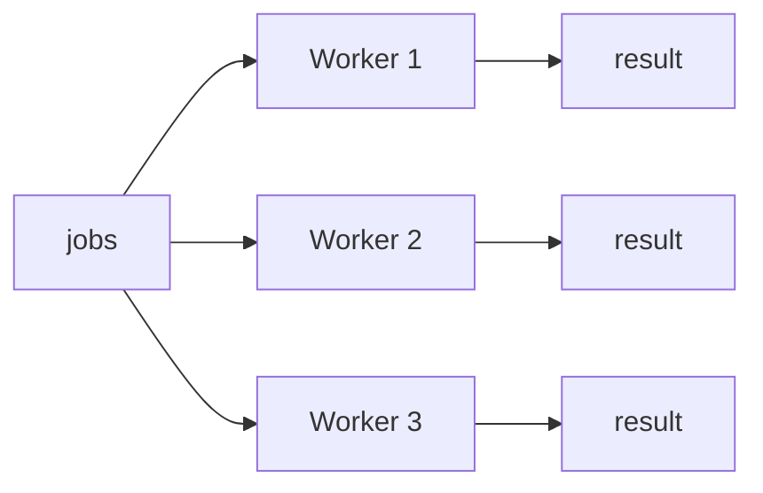
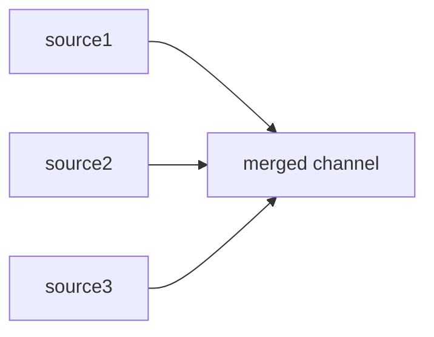
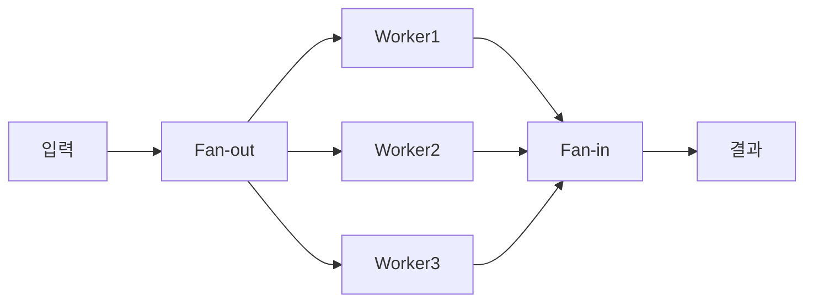

`select`문은 **여러 channel을 동시에 기다리는** Go만의 강력한 제어 구조다. 이를 활용하면 timeout, fan-in/fan-out, 동적 channel 관리 등 다양한 동시성 패턴을 구현할 수 있다.

# 1. Select 문 기본


`select`는 switch와 비슷하지만 **channel 연산**에 특화되어 있다. 여러 case 중 **준비된 것 하나**를 실행한다.

```go
select {
case msg := <-ch1: // ch1에서 먼저 데이터가 오면 실행
    fmt.Println("ch1:", msg)
case msg := <-ch2: // ch2에서 먼저 데이터가 오면 실행
    fmt.Println("ch2:", msg)
}
```

## 1.1 랜덤 선택 특성

여러 case가 동시에 준비되면 Go runtime이 **무작위로** 하나를 선택한다. 이를 통해 특정 channel이 우선되는 **starvation** 문제를 방지한다.

```go
func TestSelectMultipleReady(t *testing.T) {
    ch1 := make(chan int, 1) // 버퍼 1짜리 channel
    ch2 := make(chan int, 1)

    ch1Count, ch2Count := 0, 0
    for range 1000 { // 1000번 반복하여 선택 비율 확인
        ch1 <- 1 // 두 channel에 동시에 값을 넣어 둘 다 준비 상태로 만듦
        ch2 <- 2

        select {
        case <-ch1: // 두 case 모두 준비됐으므로 runtime이 무작위 선택
            ch1Count++
        case <-ch2:
            ch2Count++
        }
        // 선택되지 않은 channel의 남은 값 비우기
        select {
        case <-ch1:
        case <-ch2:
        default:
        }
    }

    t.Logf("ch1: %d, ch2: %d", ch1Count, ch2Count)
    // 출력 예: ch1: 516, ch2: 484 (대략 50:50)
}
```

<!-- slides -->

# 2. Default Case 활용

`default` case를 추가하면 **non-blocking** 동작이 된다. 모든 channel이 준비되지 않았을 때 즉시 default가 실행된다.

## 2.1 Non-blocking Receive

```go
select {
case val := <-ch:
    fmt.Println("received:", val)
default:
    fmt.Println("no data available") // channel이 비어있으면 즉시 실행
}
```

## 2.2 Non-blocking Send

```go
ch := make(chan int, 1)
ch <- 1 // 버퍼 가득 참

select {
case ch <- 2:
    fmt.Println("sent")
default:
    fmt.Println("buffer full") // 버퍼가 가득 차면 즉시 실행
}
```

> default는 polling이나 busy-wait에 유용하지만, 루프에서 남용하면 CPU를 과도하게 사용할 수 있다.

# 3. Timeout 처리

## 3.1 time.After

`time.After`는 지정된 시간 후에 값을 보내는 channel을 반환한다. select와 조합하면 간단히 timeout을 구현할 수 있다.

```go
func TestTimeoutWithTimeAfter(t *testing.T) {
    ch := make(chan string)

    go func() {
        time.Sleep(200 * time.Millisecond) // 200ms 걸리는 느린 작업 시뮬레이션
        ch <- "result"
    }()

    select {
    case msg := <-ch: // 작업 결과가 먼저 오면 정상 처리
        t.Log("received:", msg)
    case <-time.After(50 * time.Millisecond): // 50ms 초과 시 timeout channel에서 값 수신
        t.Log("timeout!")
    }
}
```

## 3.2 context.WithTimeout

실무에서는 `context.WithTimeout`을 더 많이 사용한다. context는 취소 전파가 가능하고, 여러 goroutine에 걸쳐 timeout을 관리할 수 있다.

```go
// simulateAPICall - context 기반 timeout이 적용된 API 호출 시뮬레이션
func simulateAPICall(ctx context.Context, delay time.Duration) (string, error) {
    ch := make(chan string, 1) // 버퍼 1: goroutine이 결과를 보내고 바로 종료 가능

    go func() {
        time.Sleep(delay) // API 호출 지연 시뮬레이션
        ch <- "api response"
    }()

    select {
    case result := <-ch: // API 응답이 먼저 오면 정상 반환
        return result, nil
    case <-ctx.Done(): // context timeout 초과 시 에러 반환
        return "", ctx.Err() // context.DeadlineExceeded
    }
}

func TestSimulateAPICallTimeout(t *testing.T) {
    // 50ms timeout 설정 — API는 200ms 걸리므로 timeout 발생
    ctx, cancel := context.WithTimeout(context.Background(), 50*time.Millisecond)
    defer cancel() // 리소스 해제를 위해 반드시 cancel 호출

    result, err := simulateAPICall(ctx, 200*time.Millisecond)
    assert.ErrorIs(t, err, context.DeadlineExceeded)
    assert.Empty(t, result)
}
```

# 4. Fan-in / Fan-out 패턴

## 4.1 Fan-out

하나의 입력을 **여러 worker에게 분배**하는 패턴이다. 여러 goroutine이 같은 channel에서 작업을 가져간다.



```go
func TestFanOut(t *testing.T) {
    jobs := make(chan int, 10)  // 작업을 분배할 공유 channel
    numWorkers := 3

    workerResults := make([]chan int, numWorkers) // worker별 결과 channel
    for i := range numWorkers {
        workerResults[i] = make(chan int, 10)
    }

    var wg sync.WaitGroup
    for i := range numWorkers {
        wg.Add(1)
        go func() { // 각 worker가 같은 jobs channel에서 작업을 가져감
            defer wg.Done()
            for job := range jobs { // jobs가 close되면 루프 종료
                workerResults[i] <- job * job // 제곱 연산 후 결과 전송
            }
            close(workerResults[i])
        }()
    }

    for i := 1; i <= 9; i++ { // 9개의 작업을 channel에 전송
        jobs <- i
    }
    close(jobs) // 모든 작업 전송 완료 → worker들이 루프 종료
    wg.Wait()
}
```

## 4.2 Fan-in

여러 channel의 결과를 **하나의 channel로 합치는** 패턴이다.



```go
// fanIn - 여러 channel의 값을 하나의 channel로 합치는 함수
func fanIn(channels ...<-chan string) <-chan string {
    var wg sync.WaitGroup
    merged := make(chan string) // 모든 결과가 모이는 단일 channel

    for _, ch := range channels {
        wg.Add(1)
        go func() { // 각 source channel마다 goroutine이 값을 merged로 전달
            defer wg.Done()
            for v := range ch { // source channel이 close되면 루프 종료
                merged <- v
            }
        }()
    }

    go func() {
        wg.Wait()   // 모든 source가 완료될 때까지 대기
        close(merged) // 모든 source 완료 후 merged channel 닫기
    }()

    return merged
}
```

**fanIn 호출 예시:**

```go
func TestFanIn(t *testing.T) {
    // 3개의 독립적인 데이터 소스
    source1 := make(chan string, 3)
    source2 := make(chan string, 3)

    go func() {
        for _, s := range []string{"a1", "a2", "a3"} {
            source1 <- s
        }
        close(source1) // 데이터 전송 완료 후 반드시 close
    }()

    go func() {
        for _, s := range []string{"b1", "b2"} {
            source2 <- s
        }
        close(source2)
    }()

    // Fan-in: 2개 channel을 하나로 합침
    merged := fanIn(source1, source2)

    for v := range merged { // merged channel이 close되면 루프 종료
        fmt.Println(v)
    }
    // 출력 (순서는 비결정적): a1, b1, a2, b2, a3
}
```

## 4.3 Fan-out + Fan-in 조합

실전에서는 두 패턴을 조합하여 **병렬 처리 파이프라인**을 구성한다.



# 5. Nil Channel 트릭

nil channel의 특성:
- nil channel에 **send하면 영원히 blocking**
- nil channel에서 **receive하면 영원히 blocking**
- select에서 nil channel case는 **무시**된다

이를 활용하면 select의 case를 **동적으로 활성화/비활성화**할 수 있다.

```go
func TestNilChannelDisable(t *testing.T) {
    ch1 := make(chan int, 3)
    ch2 := make(chan int, 3)

    ch1 <- 1; ch1 <- 2; ch1 <- 3; close(ch1) // ch1에 3개 값 전송 후 닫기
    ch2 <- 10; ch2 <- 20; close(ch2)           // ch2에 2개 값 전송 후 닫기

    var results []int
    // receive 전용 channel 변수로 선언 — nil 할당으로 비활성화 가능
    var active1, active2 = (<-chan int)(ch1), (<-chan int)(ch2)

    for active1 != nil || active2 != nil { // 둘 다 nil이 되면 모든 데이터 소진
        select {
        case v, ok := <-active1:
            if !ok {
                active1 = nil // 닫힌 channel → nil로 설정하면 select에서 무시됨
                continue
            }
            results = append(results, v)
        case v, ok := <-active2:
            if !ok {
                active2 = nil // 같은 방식으로 ch2도 비활성화
                continue
            }
            results = append(results, v)
        }
    }

    assert.Len(t, results, 5) // ch1: 3개 + ch2: 2개 = 총 5개
}
```

**활용 예시**:
- 여러 데이터 소스를 merge할 때, 각 소스가 완료되면 비활성화
- 조건에 따라 특정 channel 처리를 on/off

# 6. 퀴즈

여기까지 읽었으면 풀 수 있는 문제들이다. 답을 고르면 바로 해설이 나온다.

```quiz
- type: mcq
  q: "여러 case가 동시에 준비되면 select는 어떻게 동작하나?"
  choices: ["case에 적힌 순서대로 위에서부터 하나를 고른다", "가장 먼저 준비된 case를 기억해 두었다가 고른다", "runtime이 그중 하나를 무작위로 고른다", "준비된 case를 모두 실행한 뒤 select를 빠져나온다"]
  answer: 2
  explain: "여러 case가 동시에 준비되면 Go runtime이 무작위로 하나를 고른다. 적힌 순서대로 고르거나 먼저 준비된 것을 기억해 두는 방식이 아니고, 준비된 case를 모두 실행하지도 않는다. 무작위 선택 덕분에 특정 channel만 계속 선택되는 starvation을 막을 수 있다. (1.1절)"

- type: code
  q: "이 코드를 실행하면 어떻게 되나?"
  lang: go
  code: |
    ch := make(chan int, 1)

    select {
    case val := <-ch:
        fmt.Println("received:", val)
    default:
        fmt.Println("no data")
    }
  choices: ["값이 올 때까지 첫 번째 case에서 blocking된다", "default가 실행되어 no data가 출력된다", "버퍼가 있어 zero value인 0을 받아 출력한다", "준비된 case가 없어 deadlock으로 멈춘다"]
  answer: 1
  explain: "default가 붙은 select는 non-blocking이다. ch에는 아직 값이 없어 첫 번째 case가 준비되지 않았으므로 blocking하지 않고 곧바로 default가 실행되어 no data가 출력된다. 버퍼 공간이 있는 것과 받을 값이 있는 것은 다른 이야기다. (2.1절)"

- type: ox
  q: "nil channel에서 receive하면 잠깐 blocking됐다가 zero value를 돌려준다."
  answer: false
  explain: "아니다. nil channel에서 receive하면 영원히 blocking되고, send 역시 영원히 blocking된다. 다만 select 안의 case일 때는 그 case가 무시되어 다른 case가 선택될 뿐이다. (5장)"

- type: mcq
  q: "Fan-out과 Fan-in 패턴을 바르게 설명한 것은?"
  choices: ["Fan-out은 하나의 입력을 여러 worker에게 분배한다", "Fan-out은 여러 channel의 결과를 하나로 합친다", "Fan-in은 하나의 작업을 여러 goroutine에 나눠 준다", "Fan-in은 source마다 별도의 결과 channel을 남긴다"]
  answer: 0
  explain: "Fan-out은 하나의 입력을 여러 worker에게 분배하는 패턴이고, Fan-in은 여러 channel의 결과를 하나의 channel로 합치는 패턴이다. 두 설명을 뒤집거나 합치는 쪽을 나누는 쪽으로 바꿔 놓은 나머지 보기는 모두 틀렸다. (4.1절, 4.2절)"

- type: blank
  q: "지정한 시간이 지나면 값을 보내는 channel을 돌려주는 함수는 ___이고, select와 조합하면 timeout을 간단히 구현할 수 있다."
  answer: ["time.After"]
  explain: "time.After다. 지정한 시간이 지나면 값을 보내는 channel을 반환하므로, select의 한 case로 두면 다른 case가 그 안에 준비되지 않았을 때 timeout 분기를 타게 된다. 타임아웃 외에 더 필요한 것이 있으면 context 패키지를 함께 본다. (3.1절)"

- type: code
  q: "이 select가 실행하는 case는?"
  lang: go
  code: |
    ch := make(chan int, 1)
    ch <- 7

    var active <-chan int = nil

    select {
    case v := <-active:
        fmt.Println("active:", v)
    case v := <-ch:
        fmt.Println("ch:", v)
    }
  choices: ["active의 case — nil channel은 즉시 준비 상태다", "두 case가 모두 준비되어 무작위로 하나를 고른다", "어느 case도 못 골라 deadlock으로 멈춘다", "ch의 case — nil인 active는 무시되기 때문이다"]
  answer: 3
  explain: "active가 nil이므로 그 case는 select에서 무시된다. 남은 것은 버퍼에 7이 들어 있는 ch의 case뿐이라 그쪽이 선택된다. nil channel은 준비 상태가 되는 일이 없고, 그래서 case를 동적으로 꺼 두는 트릭으로 쓸 수 있다. (5장)"

- type: mcq
  q: "본문에서 실무에 context.WithTimeout을 더 많이 쓴다고 한 이유는?"
  choices: ["다른 방법보다 훨씬 짧은 시간을 지정할 수 있어서", "취소 전파가 가능하고 여러 goroutine에 걸쳐 관리돼서", "select 없이도 timeout 처리를 끝낼 수 있기 때문에", "channel을 새로 만들지 않고 timeout을 걸 수 있어서"]
  answer: 1
  explain: "context는 취소 전파가 가능하고 여러 goroutine에 걸쳐 timeout을 관리할 수 있어서 실무에서 더 많이 쓴다. 시간을 더 짧게 줄 수 있어서가 아니고, context를 써도 timeout 분기는 여전히 select의 ctx.Done() case로 처리하며 결과를 받을 channel도 그대로 필요하다. (3.2절)"

- type: ox
  q: "default가 있는 select를 루프에서 남용하면 CPU를 과도하게 사용할 수 있다."
  answer: true
  explain: "맞다. default는 polling이나 busy-wait에 유용하지만, 루프 안에서 남용하면 준비되지 않은 channel을 쉬지 않고 확인하게 되어 CPU를 과도하게 사용할 수 있다. (2장)"

- type: code
  q: "이 코드가 출력하는 것은?"
  lang: go
  code: |
    ch := make(chan int, 1)
    ch <- 1

    select {
    case ch <- 2:
        fmt.Println("sent")
    default:
        fmt.Println("buffer full")
    }
  choices: ["sent — 버퍼가 하나 더 늘어나 값이 들어간다", "sent — 앞서 넣은 1을 덮어쓰고 2가 들어간다", "buffer full — 버퍼가 차 있어 default가 실행된다", "아무것도 출력되지 않고 send에서 blocking된다"]
  answer: 2
  explain: "버퍼 크기가 1인 channel에 이미 1이 들어 있어 두 번째 send는 준비되지 않는다. default가 있으므로 blocking하지 않고 즉시 default로 넘어가 buffer full이 출력된다. 버퍼가 저절로 늘거나 기존 값을 덮어쓰는 일은 없다. (2.2절)"

- type: ox
  q: "context.WithTimeout으로 만든 context는 timeout 시간이 지나면 정리 함수를 호출하지 않아도 리소스가 알아서 정리된다."
  answer: false
  explain: "아니다. 본문 예제도 context.WithTimeout을 부른 바로 다음 줄에 defer cancel()을 둔다. 리소스 해제를 위해 정리 함수는 반드시 호출해야 하며, timeout이 지났다고 해서 생략해도 되는 것이 아니다. (3.2절)"
```

# 7. 마무리

| 개념 | 핵심 |
|------|------|
| select | 여러 channel을 동시에 대기, 준비된 case 하나 실행 |
| 랜덤 선택 | 여러 case 준비 시 무작위 선택 (starvation 방지) |
| default | non-blocking 동작, channel이 준비되지 않으면 즉시 실행 |
| time.After | 간단한 timeout 처리 |
| context.WithTimeout | 실무용 timeout (취소 전파 가능) |
| Fan-out | 하나의 입력을 여러 worker로 분배 |
| Fan-in | 여러 channel 결과를 하나로 합침 |
| Nil channel | select case 동적 비활성화 |

다음 편에서는 goroutine 간 **공유 자원을 안전하게 관리**하는 `sync` 패키지를 다룬다.

# 8. 참고

- [Go Tour - Select](https://go.dev/tour/concurrency/5)
- [Go Blog - Pipelines and cancellation](https://go.dev/blog/pipelines)
