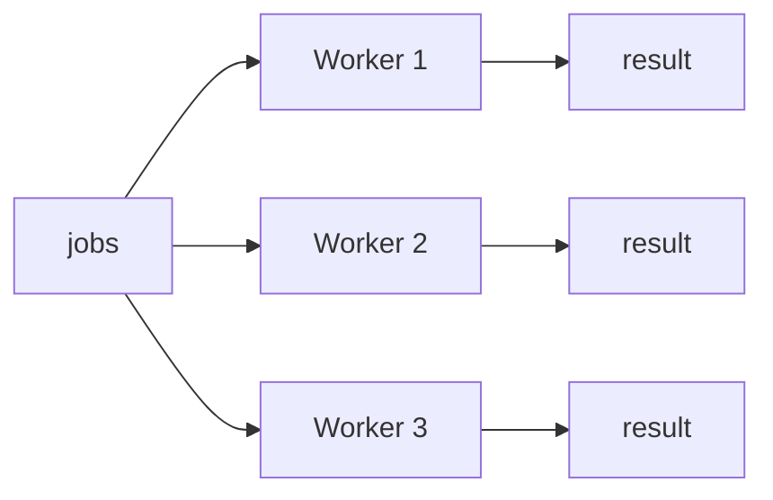
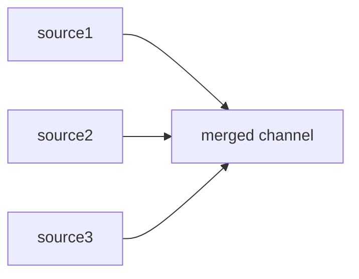
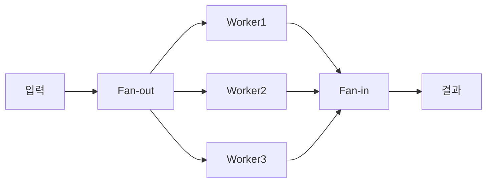

`select`문은 **여러 channel을 동시에 기다리는** Go만의 강력한 제어 구조다. 이를 활용하면 timeout, fan-in/fan-out, 동적 channel 관리 등 다양한 동시성 패턴을 구현할 수 있다.

# 1. Select 문 기본


`select`는 switch와 비슷하지만 **channel 연산**에 특화되어 있다. 여러 case 중 **준비된 것 하나**를 실행한다.

```go
select {
case msg := <-ch1: // ch1에서 먼저 데이터가 오면 실행
    fmt.Println("ch1:", msg)
case msg := <-ch2: // ch2에서 먼저 데이터가 오면 실행
    fmt.Println("ch2:", msg)
}
```

## 1.1 랜덤 선택 특성

여러 case가 동시에 준비되면 Go runtime이 **무작위로** 하나를 선택한다. 이를 통해 특정 channel이 우선되는 **starvation** 문제를 방지한다.

```go
func TestSelectMultipleReady(t *testing.T) {
    ch1 := make(chan int, 1) // 버퍼 1짜리 channel
    ch2 := make(chan int, 1)

    ch1Count, ch2Count := 0, 0
    for range 1000 { // 1000번 반복하여 선택 비율 확인
        ch1 <- 1 // 두 channel에 동시에 값을 넣어 둘 다 준비 상태로 만듦
        ch2 <- 2

        select {
        case <-ch1: // 두 case 모두 준비됐으므로 runtime이 무작위 선택
            ch1Count++
        case <-ch2:
            ch2Count++
        }
        // 선택되지 않은 channel의 남은 값 비우기
        select {
        case <-ch1:
        case <-ch2:
        default:
        }
    }

    t.Logf("ch1: %d, ch2: %d", ch1Count, ch2Count)
    // 출력 예: ch1: 516, ch2: 484 (대략 50:50)
}
```

# 2. Default Case 활용

`default` case를 추가하면 **non-blocking** 동작이 된다. 모든 channel이 준비되지 않았을 때 즉시 default가 실행된다.

## 2.1 Non-blocking Receive

```go
select {
case val := <-ch:
    fmt.Println("received:", val)
default:
    fmt.Println("no data available") // channel이 비어있으면 즉시 실행
}
```

## 2.2 Non-blocking Send

```go
ch := make(chan int, 1)
ch <- 1 // 버퍼 가득 참

select {
case ch <- 2:
    fmt.Println("sent")
default:
    fmt.Println("buffer full") // 버퍼가 가득 차면 즉시 실행
}
```

> default는 polling이나 busy-wait에 유용하지만, 루프에서 남용하면 CPU를 과도하게 사용할 수 있다.

# 3. Timeout 처리

## 3.1 time.After

`time.After`는 지정된 시간 후에 값을 보내는 channel을 반환한다. select와 조합하면 간단히 timeout을 구현할 수 있다.

```go
func TestTimeoutWithTimeAfter(t *testing.T) {
    ch := make(chan string)

    go func() {
        time.Sleep(200 * time.Millisecond) // 200ms 걸리는 느린 작업 시뮬레이션
        ch <- "result"
    }()

    select {
    case msg := <-ch: // 작업 결과가 먼저 오면 정상 처리
        t.Log("received:", msg)
    case <-time.After(50 * time.Millisecond): // 50ms 초과 시 timeout channel에서 값 수신
        t.Log("timeout!")
    }
}
```

## 3.2 context.WithTimeout

실무에서는 `context.WithTimeout`을 더 많이 사용한다. context는 취소 전파가 가능하고, 여러 goroutine에 걸쳐 timeout을 관리할 수 있다.

```go
// simulateAPICall - context 기반 timeout이 적용된 API 호출 시뮬레이션
func simulateAPICall(ctx context.Context, delay time.Duration) (string, error) {
    ch := make(chan string, 1) // 버퍼 1: goroutine이 결과를 보내고 바로 종료 가능

    go func() {
        time.Sleep(delay) // API 호출 지연 시뮬레이션
        ch <- "api response"
    }()

    select {
    case result := <-ch: // API 응답이 먼저 오면 정상 반환
        return result, nil
    case <-ctx.Done(): // context timeout 초과 시 에러 반환
        return "", ctx.Err() // context.DeadlineExceeded
    }
}

func TestSimulateAPICallTimeout(t *testing.T) {
    // 50ms timeout 설정 — API는 200ms 걸리므로 timeout 발생
    ctx, cancel := context.WithTimeout(context.Background(), 50*time.Millisecond)
    defer cancel() // 리소스 해제를 위해 반드시 cancel 호출

    result, err := simulateAPICall(ctx, 200*time.Millisecond)
    assert.ErrorIs(t, err, context.DeadlineExceeded)
    assert.Empty(t, result)
}
```

# 4. Fan-in / Fan-out 패턴

## 4.1 Fan-out

하나의 입력을 **여러 worker에게 분배**하는 패턴이다. 여러 goroutine이 같은 channel에서 작업을 가져간다.



```go
func TestFanOut(t *testing.T) {
    jobs := make(chan int, 10)  // 작업을 분배할 공유 channel
    numWorkers := 3

    workerResults := make([]chan int, numWorkers) // worker별 결과 channel
    for i := range numWorkers {
        workerResults[i] = make(chan int, 10)
    }

    var wg sync.WaitGroup
    for i := range numWorkers {
        wg.Add(1)
        go func() { // 각 worker가 같은 jobs channel에서 작업을 가져감
            defer wg.Done()
            for job := range jobs { // jobs가 close되면 루프 종료
                workerResults[i] <- job * job // 제곱 연산 후 결과 전송
            }
            close(workerResults[i])
        }()
    }

    for i := 1; i <= 9; i++ { // 9개의 작업을 channel에 전송
        jobs <- i
    }
    close(jobs) // 모든 작업 전송 완료 → worker들이 루프 종료
    wg.Wait()
}
```

## 4.2 Fan-in

여러 channel의 결과를 **하나의 channel로 합치는** 패턴이다.



```go
// fanIn - 여러 channel의 값을 하나의 channel로 합치는 함수
func fanIn(channels ...<-chan string) <-chan string {
    var wg sync.WaitGroup
    merged := make(chan string) // 모든 결과가 모이는 단일 channel

    for _, ch := range channels {
        wg.Add(1)
        go func() { // 각 source channel마다 goroutine이 값을 merged로 전달
            defer wg.Done()
            for v := range ch { // source channel이 close되면 루프 종료
                merged <- v
            }
        }()
    }

    go func() {
        wg.Wait()   // 모든 source가 완료될 때까지 대기
        close(merged) // 모든 source 완료 후 merged channel 닫기
    }()

    return merged
}
```

**fanIn 호출 예시:**

```go
func TestFanIn(t *testing.T) {
    // 3개의 독립적인 데이터 소스
    source1 := make(chan string, 3)
    source2 := make(chan string, 3)

    go func() {
        for _, s := range []string{"a1", "a2", "a3"} {
            source1 <- s
        }
        close(source1) // 데이터 전송 완료 후 반드시 close
    }()

    go func() {
        for _, s := range []string{"b1", "b2"} {
            source2 <- s
        }
        close(source2)
    }()

    // Fan-in: 2개 channel을 하나로 합침
    merged := fanIn(source1, source2)

    for v := range merged { // merged channel이 close되면 루프 종료
        fmt.Println(v)
    }
    // 출력 (순서는 비결정적): a1, b1, a2, b2, a3
}
```

## 4.3 Fan-out + Fan-in 조합

실전에서는 두 패턴을 조합하여 **병렬 처리 파이프라인**을 구성한다.



# 5. Nil Channel 트릭

nil channel의 특성:
- nil channel에 **send하면 영원히 blocking**
- nil channel에서 **receive하면 영원히 blocking**
- select에서 nil channel case는 **무시**된다

이를 활용하면 select의 case를 **동적으로 활성화/비활성화**할 수 있다.

```go
func TestNilChannelDisable(t *testing.T) {
    ch1 := make(chan int, 3)
    ch2 := make(chan int, 3)

    ch1 <- 1; ch1 <- 2; ch1 <- 3; close(ch1) // ch1에 3개 값 전송 후 닫기
    ch2 <- 10; ch2 <- 20; close(ch2)           // ch2에 2개 값 전송 후 닫기

    var results []int
    // receive 전용 channel 변수로 선언 — nil 할당으로 비활성화 가능
    var active1, active2 = (<-chan int)(ch1), (<-chan int)(ch2)

    for active1 != nil || active2 != nil { // 둘 다 nil이 되면 모든 데이터 소진
        select {
        case v, ok := <-active1:
            if !ok {
                active1 = nil // 닫힌 channel → nil로 설정하면 select에서 무시됨
                continue
            }
            results = append(results, v)
        case v, ok := <-active2:
            if !ok {
                active2 = nil // 같은 방식으로 ch2도 비활성화
                continue
            }
            results = append(results, v)
        }
    }

    assert.Len(t, results, 5) // ch1: 3개 + ch2: 2개 = 총 5개
}
```

**활용 예시**:
- 여러 데이터 소스를 merge할 때, 각 소스가 완료되면 비활성화
- 조건에 따라 특정 channel 처리를 on/off

# 6. 마무리

| 개념 | 핵심 |
|------|------|
| select | 여러 channel을 동시에 대기, 준비된 case 하나 실행 |
| 랜덤 선택 | 여러 case 준비 시 무작위 선택 (starvation 방지) |
| default | non-blocking 동작, channel이 준비되지 않으면 즉시 실행 |
| time.After | 간단한 timeout 처리 |
| context.WithTimeout | 실무용 timeout (취소 전파 가능) |
| Fan-out | 하나의 입력을 여러 worker로 분배 |
| Fan-in | 여러 channel 결과를 하나로 합침 |
| Nil channel | select case 동적 비활성화 |

다음 편에서는 goroutine 간 **공유 자원을 안전하게 관리**하는 `sync` 패키지를 다룬다.

# 7. 참고

- [Go Tour - Select](https://go.dev/tour/concurrency/5)
- [Go Blog - Pipelines and cancellation](https://go.dev/blog/pipelines)
