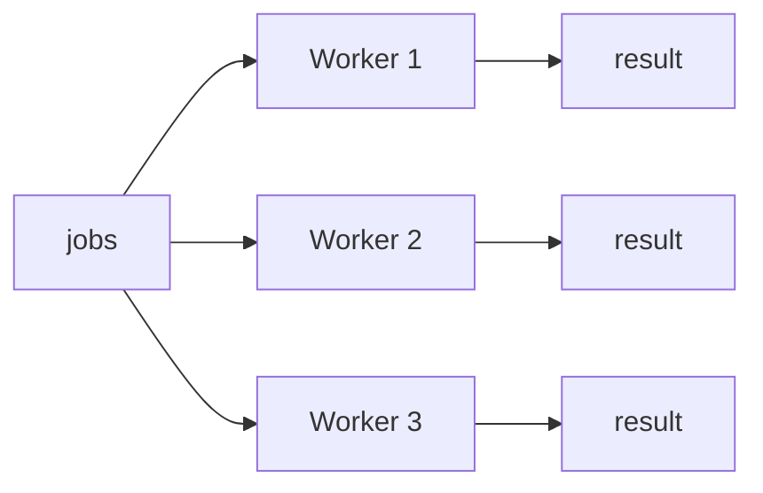
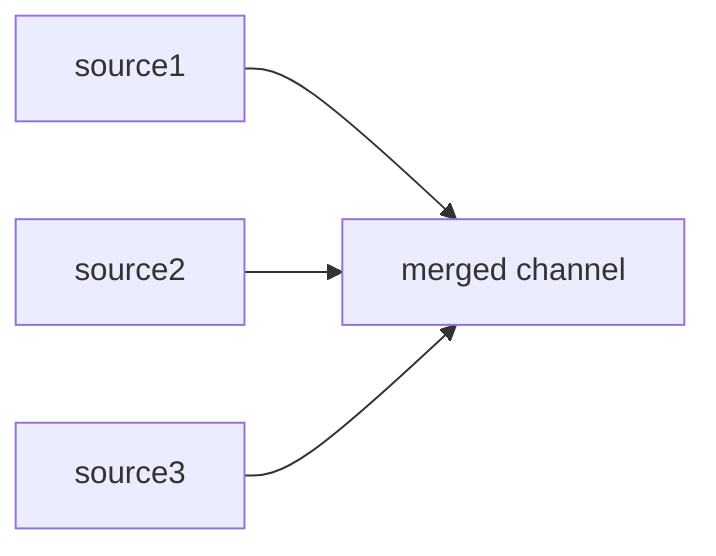
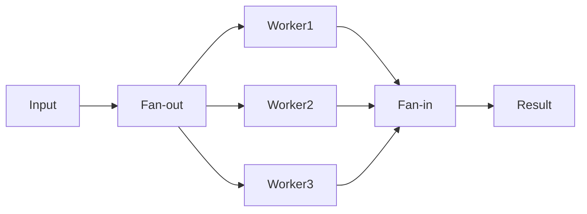

The `select` statement is a powerful control structure unique to Go that **waits on multiple channels at once**. Using it, you can implement various concurrency patterns such as timeout, fan-in/fan-out, and dynamic channel management.

# 1. select Statement Basics


`select` is similar to switch but specialized for **channel operations**. It runs **one of the cases that is ready**.

```go
select {
case msg := <-ch1: // runs if data arrives from ch1 first
    fmt.Println("ch1:", msg)
case msg := <-ch2: // runs if data arrives from ch2 first
    fmt.Println("ch2:", msg)
}
```

## 1.1 Random Selection Characteristic

When multiple cases are ready at the same time, the Go runtime picks one **at random**. This prevents the **starvation** problem where a particular channel is always prioritized.

```go
func TestSelectMultipleReady(t *testing.T) {
    ch1 := make(chan int, 1) // channel with buffer 1
    ch2 := make(chan int, 1)

    ch1Count, ch2Count := 0, 0
    for range 1000 { // repeat 1000 times to check the selection ratio
        ch1 <- 1 // put values into both channels at once so both are ready
        ch2 <- 2

        select {
        case <-ch1: // both cases are ready, so the runtime picks at random
            ch1Count++
        case <-ch2:
            ch2Count++
        }
        // drain the remaining value from the channel that wasn't selected
        select {
        case <-ch1:
        case <-ch2:
        default:
        }
    }

    t.Logf("ch1: %d, ch2: %d", ch1Count, ch2Count)
    // example output: ch1: 516, ch2: 484 (roughly 50:50)
}
```

<!-- slides -->

# 2. Using the default Case

Adding a `default` case makes it **non-blocking**. When no channel is ready, default runs immediately.

## 2.1 Non-blocking Receive

```go
select {
case val := <-ch:
    fmt.Println("received:", val)
default:
    fmt.Println("no data available") // runs immediately if the channel is empty
}
```

## 2.2 Non-blocking Send

```go
ch := make(chan int, 1)
ch <- 1 // buffer full

select {
case ch <- 2:
    fmt.Println("sent")
default:
    fmt.Println("buffer full") // runs immediately if the buffer is full
}
```

> default is useful for polling or busy-wait, but overusing it in a loop can use excessive CPU.

# 3. Handling Timeouts

## 3.1 time.After

`time.After` returns a channel that sends a value after the specified duration. Combined with select, you can implement a timeout simply.

```go
func TestTimeoutWithTimeAfter(t *testing.T) {
    ch := make(chan string)

    go func() {
        time.Sleep(200 * time.Millisecond) // simulate a slow task taking 200ms
        ch <- "result"
    }()

    select {
    case msg := <-ch: // handle normally if the task result arrives first
        t.Log("received:", msg)
    case <-time.After(50 * time.Millisecond): // receive from the timeout channel if 50ms is exceeded
        t.Log("timeout!")
    }
}
```

## 3.2 context.WithTimeout

In practice, `context.WithTimeout` is used more often. context allows cancellation propagation and lets you manage a timeout across multiple goroutines.

```go
// simulateAPICall - simulates an API call with a context-based timeout
func simulateAPICall(ctx context.Context, delay time.Duration) (string, error) {
    ch := make(chan string, 1) // buffer 1: the goroutine can send the result and terminate right away

    go func() {
        time.Sleep(delay) // simulate API call latency
        ch <- "api response"
    }()

    select {
    case result := <-ch: // return normally if the API response arrives first
        return result, nil
    case <-ctx.Done(): // return an error if the context timeout is exceeded
        return "", ctx.Err() // context.DeadlineExceeded
    }
}

func TestSimulateAPICallTimeout(t *testing.T) {
    // set a 50ms timeout — the API takes 200ms, so a timeout occurs
    ctx, cancel := context.WithTimeout(context.Background(), 50*time.Millisecond)
    defer cancel() // always call cancel to release resources

    result, err := simulateAPICall(ctx, 200*time.Millisecond)
    assert.ErrorIs(t, err, context.DeadlineExceeded)
    assert.Empty(t, result)
}
```

# 4. Fan-in / Fan-out Patterns

## 4.1 Fan-out

A pattern that **distributes a single input to multiple workers**. Multiple goroutines take work from the same channel.



```go
func TestFanOut(t *testing.T) {
    jobs := make(chan int, 10)  // shared channel for distributing work
    numWorkers := 3

    workerResults := make([]chan int, numWorkers) // result channel per worker
    for i := range numWorkers {
        workerResults[i] = make(chan int, 10)
    }

    var wg sync.WaitGroup
    for i := range numWorkers {
        wg.Add(1)
        go func() { // each worker takes work from the same jobs channel
            defer wg.Done()
            for job := range jobs { // the loop ends when jobs is closed
                workerResults[i] <- job * job // square and send the result
            }
            close(workerResults[i])
        }()
    }

    for i := 1; i <= 9; i++ { // send 9 jobs to the channel
        jobs <- i
    }
    close(jobs) // all jobs sent → workers end their loop
    wg.Wait()
}
```

## 4.2 Fan-in

A pattern that **merges the results of multiple channels into a single channel**.



```go
// fanIn - merges values from multiple channels into a single channel
func fanIn(channels ...<-chan string) <-chan string {
    var wg sync.WaitGroup
    merged := make(chan string) // the single channel where all results collect

    for _, ch := range channels {
        wg.Add(1)
        go func() { // a goroutine per source channel forwards values to merged
            defer wg.Done()
            for v := range ch { // the loop ends when the source channel is closed
                merged <- v
            }
        }()
    }

    go func() {
        wg.Wait()   // wait until all sources complete
        close(merged) // close the merged channel after all sources complete
    }()

    return merged
}
```

**Example of calling fanIn:**

```go
func TestFanIn(t *testing.T) {
    // 3 independent data sources
    source1 := make(chan string, 3)
    source2 := make(chan string, 3)

    go func() {
        for _, s := range []string{"a1", "a2", "a3"} {
            source1 <- s
        }
        close(source1) // always close after sending data
    }()

    go func() {
        for _, s := range []string{"b1", "b2"} {
            source2 <- s
        }
        close(source2)
    }()

    // Fan-in: merge 2 channels into one
    merged := fanIn(source1, source2)

    for v := range merged { // the loop ends when the merged channel is closed
        fmt.Println(v)
    }
    // output (order is non-deterministic): a1, b1, a2, b2, a3
}
```

## 4.3 Combining Fan-out + Fan-in

In practice, you combine the two patterns to build a **parallel processing pipeline**.



# 5. The Nil Channel Trick

Characteristics of a nil channel:
- **sending** to a nil channel **blocks forever**
- **receiving** from a nil channel **blocks forever**
- a nil channel case in a select is **ignored**

Using this, you can **dynamically enable/disable** cases in a select.

```go
func TestNilChannelDisable(t *testing.T) {
    ch1 := make(chan int, 3)
    ch2 := make(chan int, 3)

    ch1 <- 1; ch1 <- 2; ch1 <- 3; close(ch1) // send 3 values to ch1 then close
    ch2 <- 10; ch2 <- 20; close(ch2)           // send 2 values to ch2 then close

    var results []int
    // declare as receive-only channel variables — can be disabled by assigning nil
    var active1, active2 = (<-chan int)(ch1), (<-chan int)(ch2)

    for active1 != nil || active2 != nil { // when both become nil, all data is consumed
        select {
        case v, ok := <-active1:
            if !ok {
                active1 = nil // closed channel → setting to nil makes select ignore it
                continue
            }
            results = append(results, v)
        case v, ok := <-active2:
            if !ok {
                active2 = nil // disable ch2 the same way
                continue
            }
            results = append(results, v)
        }
    }

    assert.Len(t, results, 5) // ch1: 3 + ch2: 2 = 5 total
}
```

**Use cases**:
- when merging multiple data sources, disable each source as it completes
- turn processing of a particular channel on/off depending on a condition

# 6. Quiz

If you've read this far, these are questions you can answer. Pick an answer and the explanation shows up right away.

```quiz
- type: mcq
  q: "When several cases are ready at the same time, what does select do?"
  choices: ["It picks one from the top in the order the cases are written", "It remembers which case became ready first and picks that", "The Go runtime picks one of them completely at random", "It runs every ready case and then leaves the select"]
  answer: 2
  explain: "When several cases are ready at once, the Go runtime picks one at random. It does not go in written order, it does not remember which one became ready first, and it does not run every ready case. That random pick is what prevents starvation, where one channel would always win. (Section 1.1)"

- type: code
  q: "What does this code do when you run it?"
  lang: go
  code: |
    ch := make(chan int, 1)

    select {
    case val := <-ch:
        fmt.Println("received:", val)
    default:
        fmt.Println("no data")
    }
  choices: ["It blocks at the first case until a value arrives", "default runs and prints \"no data\" right away", "The buffer hands back the zero value 0 and prints it", "With no case ready it stops in a deadlock right there"]
  answer: 1
  explain: "A select with a default is non-blocking. ch holds no value yet, so the first case is not ready; instead of blocking, default runs immediately and prints \"no data\". Having free buffer space is not the same as having a value to receive. (Section 2.1)"

- type: ox
  q: "Receiving from a nil channel blocks briefly and then returns the zero value."
  answer: false
  explain: "No. Receiving from a nil channel blocks forever, and so does sending to one. Only inside a select is a nil channel case ignored, so that another case gets picked instead. (Section 5)"

- type: mcq
  q: "Which statement about the fan-out and fan-in patterns is correct?"
  choices: ["Fan-out distributes one input across multiple workers", "Fan-out merges the results of several channels into one", "Fan-in hands one job out to several goroutines to run", "Fan-in leaves a separate result channel per source"]
  answer: 0
  explain: "Fan-out is the pattern that distributes a single input across multiple workers, and fan-in is the pattern that merges the results of several channels into one channel. The other options either swap the two descriptions or turn the merging side into a splitting side. (Sections 4.1, 4.2)"

- type: blank
  q: "The function that returns a channel that fires once a given duration elapses is ___, and combining it with select gives you a simple timeout."
  answer: ["time.After", "After"]
  explain: "It is time.After. It returns a channel that fires once the given duration passes, so putting it in one case of a select takes the timeout branch whenever the other case is not ready in time. When you need more than a plain timeout, look at the context package as well. (Section 3.1)"

- type: code
  q: "Which case does this select run?"
  lang: go
  code: |
    ch := make(chan int, 1)
    ch <- 7

    var active <-chan int = nil

    select {
    case v := <-active:
        fmt.Println("active:", v)
    case v := <-ch:
        fmt.Println("ch:", v)
    }
  choices: ["The active case — a nil channel is ready immediately", "Both cases are ready, so one is picked at random", "No case can be chosen, so it stops in a deadlock", "The ch case — the nil active case is simply ignored"]
  answer: 3
  explain: "active is nil, so that case is ignored by the select. The only one left is the ch case, which has 7 sitting in its buffer, so that one is picked. A nil channel never becomes ready, which is exactly what makes it useful for switching a case off dynamically. (Section 5)"

- type: mcq
  q: "Why does the article say context.WithTimeout is used more in practice?"
  choices: ["It can specify a far shorter duration than other ways", "It propagates cancellation and spans several goroutines", "It finishes timeout handling without any select at all", "It sets a timeout without creating any new channel"]
  answer: 1
  explain: "context is used more in practice because it propagates cancellation and lets you manage a timeout across multiple goroutines. It is not about specifying shorter durations, and even with context the timeout branch is still handled by a select case on ctx.Done(), with a result channel still needed. (Section 3.2)"

- type: ox
  q: "Overusing a select with default inside a loop can use excessive CPU."
  answer: true
  explain: "Correct. default is useful for polling or busy-wait, but overusing it inside a loop means checking channels that are not ready without a pause, which can use excessive CPU. (Section 2)"

- type: code
  q: "What does this code print?"
  lang: go
  code: |
    ch := make(chan int, 1)
    ch <- 1

    select {
    case ch <- 2:
        fmt.Println("sent")
    default:
        fmt.Println("buffer full")
    }
  choices: ["sent — the buffer grows by one and the value goes in", "sent — the 2 overwrites the 1 that was sent before", "buffer full — the buffer is full so default runs", "Nothing is printed and the send blocks right there"]
  answer: 2
  explain: "The channel has buffer size 1 and already holds 1, so the second send is not ready. Because a default is present it does not block: it goes straight to default and prints buffer full. The buffer never grows on its own and never overwrites the existing value. (Section 2.2)"

- type: ox
  q: "A context made with context.WithTimeout releases its resources on its own once the timeout passes, even if the cleanup function is never called."
  answer: false
  explain: "No. The article's example puts defer cancel() on the line right after the call to context.WithTimeout. The cleanup function must always be called to release resources; the timeout passing does not make it optional. (Section 3.2)"
```

# 7. Wrapping Up

| Concept | Core |
|------|------|
| select | wait on multiple channels at once, run one ready case |
| random selection | random pick when multiple cases are ready (prevents starvation) |
| default | non-blocking behavior, runs immediately when no channel is ready |
| time.After | simple timeout handling |
| context.WithTimeout | production timeout (supports cancellation propagation) |
| Fan-out | distribute one input to multiple workers |
| Fan-in | merge the results of multiple channels into one |
| Nil channel | dynamically disable a select case |

In the next part, we'll cover the `sync` package, which **safely manages shared resources** between goroutines.

# 8. References

- [Go Tour - Select](https://go.dev/tour/concurrency/5)
- [Go Blog - Pipelines and cancellation](https://go.dev/blog/pipelines)
