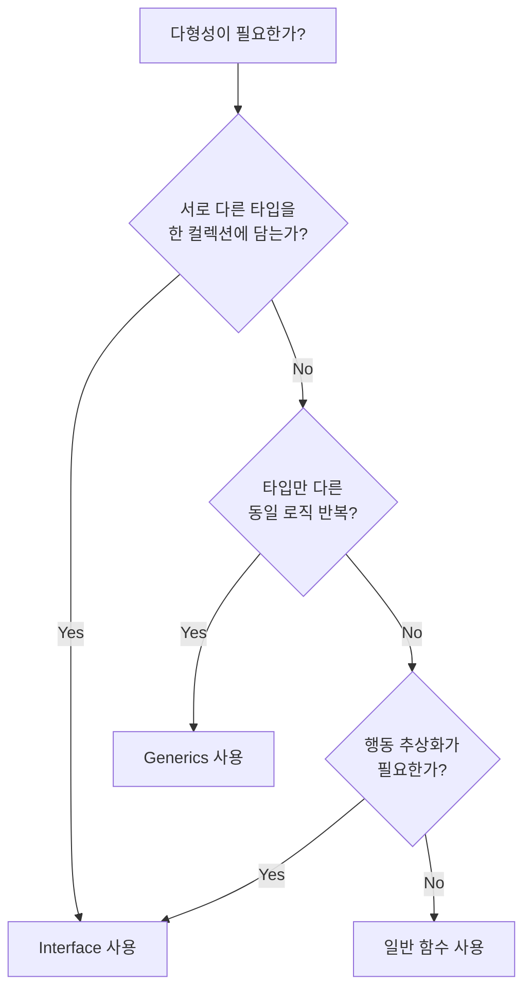
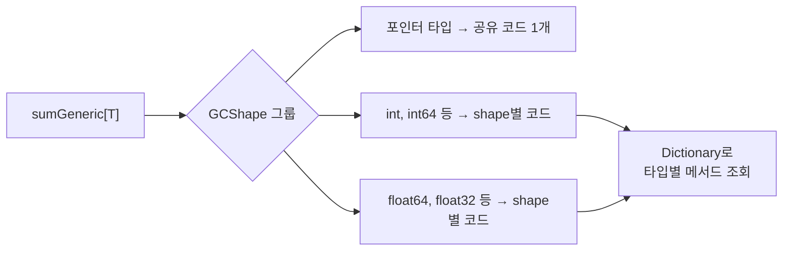

# 1. Generics vs Interface 비교

Go에서 다형성(polymorphism)을 구현하는 두 가지 주요 방법이 있다.

- **Interface**: 런타임 다형성 (dynamic dispatch)
- **Generics**: 컴파일 타임 다형성 (static dispatch)

이 두 방식은 각각 장단점이 있으며, 상황에 따라 적절한 선택이 다르다.

## 1.1 다형성 관점 비교

| 비교 항목 | Interface | Generics |
|-----------|-----------|----------|
| 다형성 시점 | 런타임 (dynamic dispatch) | 컴파일 타임 (static dispatch) |
| 타입 안전성 | 타입 단언 필요 (런타임 에러 가능) | 컴파일 타임 검증 (런타임 에러 없음) |
| 이종 타입 컬렉션 | 가능 (`[]Shape`에 Circle, Rectangle 혼합) | 불가 (동일 타입만 허용) |
| 코드 재사용 | 메서드 기반 (행동 추상화) | 타입 파라미터 기반 (알고리즘 추상화) |

## 1.2 Interface 기반 구현 - 런타임 다형성

Interface 방식은 타입마다 메서드를 구현하고, 타입 단언(type assertion)으로 구체 타입에 접근한다.

```go
// Adder 인터페이스 - 메서드 기반 다형성
type Adder interface {
    Add(other Adder) Adder
    Value() string
}

// IntVal - Adder 구현
type IntVal struct {
    val int
}

func (i IntVal) Add(other Adder) Adder {
    o := other.(IntVal) // 타입 단언 필요 (런타임 체크)
    return IntVal{val: i.val + o.val}
}

func (i IntVal) Value() string {
    return fmt.Sprintf("%d", i.val)
}

// FloatVal - Adder 구현
type FloatVal struct {
    val float64
}

func (f FloatVal) Add(other Adder) Adder {
    o := other.(FloatVal) // 타입 단언 필요
    return FloatVal{val: f.val + o.val}
}

func (f FloatVal) Value() string {
    return fmt.Sprintf("%.1f", f.val)
}
```

Interface 기반 합산 함수는 `[]Adder` 슬라이스를 받아 처리한다.

```go
func sumInterface(items []Adder) Adder {
    result := items[0]
    for _, item := range items[1:] {
        result = result.Add(item)
    }
    return result
}

func Example_interfaceApproach() {
    ints := []Adder{IntVal{1}, IntVal{2}, IntVal{3}}
    result := sumInterface(ints)
    fmt.Println(result.Value()) // 6

    floats := []Adder{FloatVal{1.1}, FloatVal{2.2}, FloatVal{3.3}}
    result = sumInterface(floats)
    fmt.Println(result.Value()) // 6.6
}
```

**문제점**: `other.(IntVal)`처럼 타입 단언이 필요하다. 만약 `FloatVal`을 넘기면 런타임에 패닉이 발생한다.

## 1.3 Generics 기반 구현 - 컴파일 타임 다형성

Generics 방식은 타입 파라미터로 제약을 걸어, 타입 단언 없이 안전하게 연산한다.

```go
func sumGeneric[T constraints.Integer | constraints.Float](items []T) T {
    var result T
    for _, item := range items {
        result += item
    }
    return result
}

func Example_genericApproach() {
    ints := []int{1, 2, 3}
    fmt.Println(sumGeneric(ints)) // 6

    floats := []float64{1.1, 2.2, 3.3}
    fmt.Printf("%.1f\n", sumGeneric(floats)) // 6.6
}
```

**장점**:
- 타입 단언이 불필요하다
- 잘못된 타입을 넘기면 **컴파일 에러**가 발생한다
- 코드가 간결하고 직관적이다

## 1.4 Interface가 적합한 경우 - 이종 타입 컬렉션

**서로 다른 구체 타입**을 하나의 슬라이스에 담아야 할 때는 interface가 적합하다.

```go
type Shape interface {
    Area() float64
}

type Circle struct {
    Radius float64
}

func (c Circle) Area() float64 {
    return 3.14159 * c.Radius * c.Radius
}

type Rectangle struct {
    Width, Height float64
}

func (r Rectangle) Area() float64 {
    return r.Width * r.Height
}

func totalArea(shapes []Shape) float64 {
    var total float64
    for _, s := range shapes {
        total += s.Area()
    }
    return total
}

func Example_interfaceMixedTypes() {
    shapes := []Shape{
        Circle{Radius: 5},
        Rectangle{Width: 3, Height: 4},
        Circle{Radius: 2},
    }
    fmt.Printf("%.2f\n", totalArea(shapes)) // 103.11
}
```

Generics는 **동일한 타입**의 슬라이스만 처리할 수 있으므로, `Circle`과 `Rectangle`을 한 슬라이스에 담을 수 없다.

## 1.5 Generics가 적합한 경우 - 타입 안전한 유틸리티

동일 타입의 슬라이스에 대한 범용 유틸리티 함수는 generics가 적합하다.

```go
func indexOf[T comparable](s []T, target T) int {
    for i, v := range s {
        if v == target {
            return i
        }
    }
    return -1
}

func Example_genericTypeSafe() {
    fmt.Println(indexOf([]int{10, 20, 30}, 20))         // 1
    fmt.Println(indexOf([]string{"a", "b", "c"}, "c"))   // 2
    fmt.Println(indexOf([]string{"a", "b", "c"}, "d"))   // -1

    // 컴파일 에러: 서로 다른 타입은 혼합 불가
    // indexOf([]int{1, 2, 3}, "hello") → 컴파일 에러
}
```

## 1.6 결정 기준 요약



| 상황 | 선택 |
|------|------|
| 서로 다른 타입을 한 슬라이스에 담기 | Interface |
| 런타임에 구체 타입이 결정됨 | Interface |
| 타입만 다른 동일 로직 반복 | Generics |
| 타입 안전한 유틸리티 함수 | Generics |
| 외부 라이브러리/플러그인 구조 | Interface |
| 컬렉션/알고리즘 추상화 | Generics |

# 2. Generics 내부 동작 원리

## 2.1 GCShape Stenciling + Dictionary 방식

Go의 generics는 **GCShape Stenciling** 방식으로 구현되어 있다. 이는 Rust의 완전한 monomorphization과 Java의 type erasure 사이의 절충안이다.



### 핵심 개념

1. **GCShape**: GC(가비지 컬렉터) 관점에서 동일한 메모리 레이아웃을 가진 타입 그룹
   - 모든 포인터 타입은 같은 GCShape (포인터 크기가 동일)
   - `int`, `int64` 등 같은 크기의 정수는 같은 GCShape

2. **Stenciling**: 각 GCShape별로 함수 코드를 생성
   - Rust처럼 모든 구체 타입마다 코드를 생성하지 않음
   - 같은 GCShape에 속하는 타입들은 **하나의 코드를 공유**

3. **Dictionary**: 공유 코드에서 타입별 연산이 필요할 때 dictionary를 통해 조회
   - 숨겨진 첫 번째 인자로 dictionary 포인터가 전달됨
   - dictionary에는 타입별 메서드, 크기 등의 정보가 담겨 있음

## 2.2 다른 언어와의 비교

| 특성 | Go (GCShape) | Rust (Monomorphization) | Java (Type Erasure) |
|------|-------------|------------------------|-------------------|
| 코드 생성 | GCShape별 생성 | 타입별 완전 생성 | 생성 없음 |
| 바이너리 크기 | 중간 | 큼 (code bloat) | 작음 |
| 런타임 성능 | 좋음 (dictionary 오버헤드) | 최고 (인라이닝 가능) | 보통 (boxing/unboxing) |
| 컴파일 속도 | 빠름 | 느림 | 빠름 |
| 타입 정보 런타임 유지 | 부분적 (dictionary) | 없음 (정적 디스패치) | 없음 (erasure) |

### Rust - Monomorphization

Rust는 제네릭 함수를 호출하는 **모든 구체 타입마다** 별도의 함수를 생성한다.

```rust
fn sum<T: Add<Output=T> + Default>(items: &[T]) -> T { ... }

// sum::<i32>(), sum::<f64>() 등 각각 별도 함수 생성
```

- 장점: 인라이닝 가능, 런타임 오버헤드 없음
- 단점: 바이너리 크기 증가 (code bloat), 컴파일 시간 증가

### Java - Type Erasure

Java는 컴파일 후 제네릭 타입 정보를 **삭제**(erase)한다.

```java
List<Integer> list = new ArrayList<>();
// 컴파일 후: List list = new ArrayList(); (타입 정보 소실)
```

- 장점: 바이너리 크기 증가 없음, 하위 호환성
- 단점: 런타임에 타입 정보 없음, primitive 타입 사용 불가 (boxing 필요)

### C++ - Templates

C++은 Rust와 유사하게 각 타입마다 코드를 생성하지만, 더 강력한 메타프로그래밍을 지원한다.

- 템플릿 특수화(template specialization) 가능
- SFINAE, Concepts(C++20) 등 복잡한 제약 표현 가능
- 컴파일 시간이 매우 길 수 있음

# 3. 성능 비교 벤치마크

실제 벤치마크를 통해 interface와 generics의 성능 차이를 확인해보자.

## 3.1 합산 연산 벤치마크 (Sum)

10,000개 요소에 대한 합산 연산을 비교한다.

**Interface 기반**:

```go
type IntAdder int

func (a IntAdder) add(other interface{}) interface{} {
    return a + other.(IntAdder)
}

func sumWithInterface(items []interface{}) interface{} {
    var result IntAdder
    for _, item := range items {
        result = result.add(item).(IntAdder)
    }
    return result
}
```

**Generics 기반**:

```go
func sumWithGenerics[T constraints.Integer | constraints.Float](items []T) T {
    var result T
    for _, item := range items {
        result += item
    }
    return result
}
```

**벤치마크 코드**:

```go
const benchSize = 10000

func BenchmarkSumInterface(b *testing.B) {
    items := make([]interface{}, benchSize)
    for i := 0; i < benchSize; i++ {
        items[i] = IntAdder(i)
    }

    b.ResetTimer()
    for i := 0; i < b.N; i++ {
        sumWithInterface(items)
    }
}

func BenchmarkSumGenerics(b *testing.B) {
    items := make([]int, benchSize)
    for i := 0; i < benchSize; i++ {
        items[i] = i
    }

    b.ResetTimer()
    for i := 0; i < b.N; i++ {
        sumWithGenerics(items)
    }
}
```

**결과** (Apple M4 Pro):

| 벤치마크 | ns/op | 차이 |
|----------|-------|------|
| BenchmarkSumInterface | ~2,496 | 기준 |
| BenchmarkSumGenerics | ~2,323 | **~7% 빠름** |

합산 연산에서는 generics가 약 7% 빠르다. 타입 단언과 interface 메서드 호출 오버헤드가 그만큼 발생하는 것이다.

## 3.2 검색 연산 벤치마크 (Contains)

10,000개 요소에서 마지막 요소(worst case)를 검색하는 벤치마크이다.

```go
func containsInterface(s []interface{}, target interface{}) bool {
    for _, v := range s {
        if v == target {
            return true
        }
    }
    return false
}

func containsGeneric[T comparable](s []T, target T) bool {
    for _, v := range s {
        if v == target {
            return true
        }
    }
    return false
}
```

**결과**:

| 벤치마크 | ns/op | 차이 |
|----------|-------|------|
| BenchmarkContainsInterface | ~17,682 | 기준 |
| BenchmarkContainsGenerics | ~2,369 | **~7.5배 빠름** |

Contains 연산에서 **generics가 약 7.5배 빠르다**. `interface{}` 비교는 런타임에 동적 타입 비교를 수행해야 하므로, 단순 `int` 비교보다 훨씬 느리다.

## 3.3 메모리 할당 벤치마크

1,000개 요소 슬라이스 생성 시 메모리 할당을 비교한다.

```go
func BenchmarkAllocInterface(b *testing.B) {
    b.ReportAllocs()
    for i := 0; i < b.N; i++ {
        items := make([]interface{}, 1000)
        for j := 0; j < 1000; j++ {
            items[j] = j
        }
    }
}

func BenchmarkAllocGenerics(b *testing.B) {
    b.ReportAllocs()
    for i := 0; i < b.N; i++ {
        items := make([]int, 1000)
        for j := 0; j < 1000; j++ {
            items[j] = j
        }
    }
}
```

**결과**:

| 벤치마크 | ns/op | B/op | allocs/op | 차이 |
|----------|-------|------|-----------|------|
| BenchmarkAllocInterface | ~4,492 | 5,952 | 744 | 기준 |
| BenchmarkAllocGenerics | ~243 | 0 | 0 | **~18배 빠름, 제로 할당** |

가장 극적인 차이가 나타난다. `interface{}`에 `int` 값을 담으면 boxing이 발생하여 **힙 메모리 할당**이 필요하다. 반면 `[]int`는 연속된 메모리 블록 하나로 할당되어 추가 할당이 없다.

## 3.4 벤치마크 결과 요약

| 항목 | Interface | Generics | 개선율 |
|------|-----------|----------|--------|
| Sum (10K) | ~2,496 ns | ~2,323 ns | 7% |
| Contains (10K) | ~17,682 ns | ~2,369 ns | 7.5x |
| Alloc (1K) | ~4,492 ns, 744 allocs | ~243 ns, 0 allocs | 18x |

**핵심**: 성능 차이의 주요 원인은 다음과 같다.
- **Boxing/Unboxing**: `interface{}`에 값 타입을 담을 때 힙 할당 발생
- **Dynamic dispatch**: interface 메서드 호출 시 vtable 조회
- **타입 비교 오버헤드**: `interface{}` 동등성 비교는 런타임 타입 체크 포함
- **캐시 친화성**: `[]int`는 연속 메모리, `[]interface{}`는 포인터를 통한 간접 접근

# 4. 정리

## 4.1 Generics를 선택해야 하는 경우

- 타입만 다르고 로직이 동일한 함수/자료구조
- 타입 안전성이 중요한 유틸리티 함수
- 성능이 중요한 핫 패스(hot path) 코드
- 컬렉션 라이브러리 (Sort, Filter, Map 등)

## 4.2 Interface를 선택해야 하는 경우

- 서로 다른 구체 타입을 하나의 컬렉션에 담아야 할 때
- 런타임에 동적으로 타입이 결정되는 경우
- 플러그인/확장 구조가 필요한 경우
- 행동(behavior) 기반 추상화가 목적인 경우

## 4.3 Interface + Generics 조합

실무에서는 두 방식을 조합하여 사용하는 경우도 많다.

```go
// constraint로 interface를 사용하면서 generics의 타입 안전성을 확보
func PrintAll[T fmt.Stringer](items []T) {
    for _, item := range items {
        fmt.Println(item.String())
    }
}
```

이 방식은 interface의 행동 추상화와 generics의 타입 안전성을 동시에 활용한다.

본 포스팅에서 작성한 코드는 [GitHub](https://github.com/kenshin579/tutorials-go/tree/master/golang/generics)를 참고해주세요.

# 참고

- https://go.dev/blog/intro-generics
- https://go.dev/doc/tutorial/generics
- https://planetscale.com/blog/generics-can-make-your-go-code-slower
- https://colobu.com/2022/03/20/some-bugs-in-erta-of-Mo-Generics/
- https://go.googlesource.com/proposal/+/refs/heads/master/design/generics-implementation-dictionaries-go1.18.md
