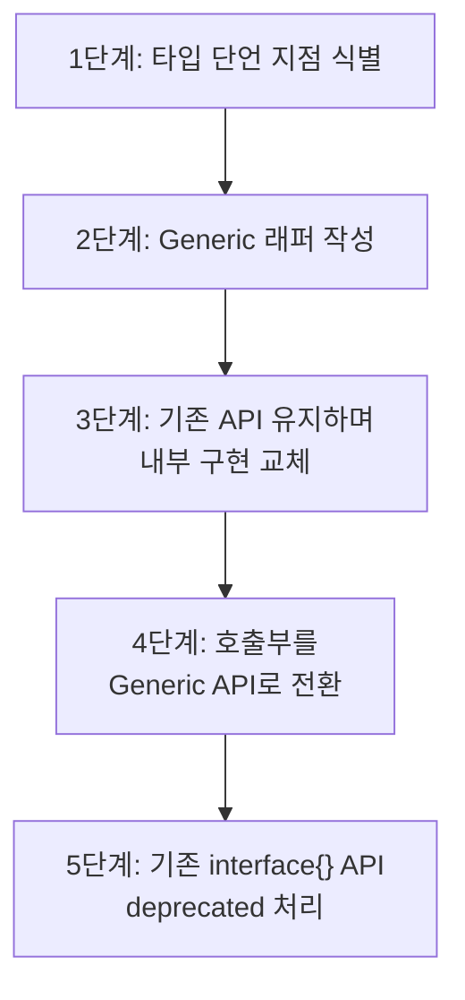

# 1. 실무 설계 패턴

## 1.1 Generic Repository 패턴

데이터 접근 계층(Repository)에서 generics를 활용하면, 엔티티 타입마다 반복적으로 CRUD 코드를 작성하지 않아도 된다.

먼저 모든 엔티티가 구현해야 하는 인터페이스를 정의한다.

```go
// Identifiable - 모든 엔티티가 구현해야 하는 인터페이스
type Identifiable interface {
    GetID() string
}
```

그 다음, 이 인터페이스를 constraint로 사용하는 Generic Repository를 구현한다.

```go
// MemoryStore - Generic in-memory repository
type MemoryStore[T Identifiable] struct {
    mu   sync.RWMutex
    data map[string]T
}

func NewMemoryStore[T Identifiable]() *MemoryStore[T] {
    return &MemoryStore[T]{
        data: make(map[string]T),
    }
}

func (s *MemoryStore[T]) Save(entity T) {
    s.mu.Lock()
    defer s.mu.Unlock()
    s.data[entity.GetID()] = entity
}

func (s *MemoryStore[T]) FindByID(id string) (T, error) {
    s.mu.RLock()
    defer s.mu.RUnlock()
    entity, ok := s.data[id]
    if !ok {
        var zero T
        return zero, errors.New("not found")
    }
    return entity, nil
}

func (s *MemoryStore[T]) FindAll() []T {
    s.mu.RLock()
    defer s.mu.RUnlock()
    result := make([]T, 0, len(s.data))
    for _, v := range s.data {
        result = append(result, v)
    }
    return result
}

func (s *MemoryStore[T]) Delete(id string) bool {
    s.mu.Lock()
    defer s.mu.Unlock()
    if _, ok := s.data[id]; !ok {
        return false
    }
    delete(s.data, id)
    return true
}
```

이제 어떤 엔티티든 `Identifiable`만 구현하면 동일한 Repository를 재사용할 수 있다.

```go
type UserEntity struct {
    ID    string
    Name  string
    Email string
}

func (u UserEntity) GetID() string { return u.ID }

type ProductEntity struct {
    ID    string
    Name  string
    Price int
}

func (p ProductEntity) GetID() string { return p.ID }

func Example_genericRepository() {
    // 사용자 저장소
    userStore := NewMemoryStore[UserEntity]()
    userStore.Save(UserEntity{ID: "u1", Name: "Alice", Email: "alice@example.com"})
    userStore.Save(UserEntity{ID: "u2", Name: "Bob", Email: "bob@example.com"})

    user, _ := userStore.FindByID("u1")
    fmt.Println(user.Name, user.Email) // Alice alice@example.com

    // 상품 저장소 - 동일한 MemoryStore를 재사용
    productStore := NewMemoryStore[ProductEntity]()
    productStore.Save(ProductEntity{ID: "p1", Name: "Laptop", Price: 1500})
    productStore.Save(ProductEntity{ID: "p2", Name: "Mouse", Price: 30})

    product, _ := productStore.FindByID("p2")
    fmt.Println(product.Name, product.Price) // Mouse 30
}
```

**핵심 포인트**:
- `Identifiable` constraint로 엔티티의 최소 요구사항을 정의
- `MemoryStore[T]`는 타입 파라미터만 바꿔서 재사용 가능
- 실제 프로덕션에서는 DB 드라이버(GORM, sqlx 등)와 연동하여 확장

## 1.2 타입 안전 컬렉션: Generic Set

Go 표준 라이브러리에는 Set이 없다. generics로 타입 안전한 Set을 구현할 수 있다.

```go
type Set[T comparable] struct {
    items map[T]struct{}
}

func NewSet[T comparable]() *Set[T] {
    return &Set[T]{items: make(map[T]struct{})}
}

func (s *Set[T]) Add(item T)       { s.items[item] = struct{}{} }
func (s *Set[T]) Has(item T) bool  { _, ok := s.items[item]; return ok }
func (s *Set[T]) Remove(item T)    { delete(s.items, item) }
func (s *Set[T]) Size() int        { return len(s.items) }
```

```go
tags := NewSet[string]()
tags.Add("go")
tags.Add("generics")
tags.Add("go")            // 중복 무시
fmt.Println(tags.Has("go"))   // true
fmt.Println(tags.Size())      // 2
```

## 1.3 Generic Utility 패키지

### Result 타입

성공/실패를 명시적으로 표현하는 `Result[T]` 타입이다.

```go
type Result[T any] struct {
    value T
    err   error
}

func OK[T any](value T) Result[T] {
    return Result[T]{value: value}
}

func Fail[T any](err error) Result[T] {
    return Result[T]{err: err}
}

func (r Result[T]) IsOK() bool        { return r.err == nil }
func (r Result[T]) Unwrap() (T, error) { return r.value, r.err }

// MapResult - Result 값을 변환
func MapResult[T, U any](r Result[T], f func(T) U) Result[U] {
    if r.err != nil {
        return Fail[U](r.err)
    }
    return OK(f(r.value))
}
```

```go
r1 := OK(42)
r2 := MapResult(r1, func(n int) string {
    return fmt.Sprintf("value=%d", n)
})
str, _ := r2.Unwrap()
fmt.Println(str) // value=42
```

### Pair와 Zip

두 슬라이스를 하나로 합치는 `Zip` 함수이다.

```go
type Pair[K, V any] struct {
    Key   K
    Value V
}

func Zip[K, V any](keys []K, values []V) []Pair[K, V] {
    n := len(keys)
    if len(values) < n {
        n = len(values)
    }
    result := make([]Pair[K, V], n)
    for i := 0; i < n; i++ {
        result[i] = Pair[K, V]{Key: keys[i], Value: values[i]}
    }
    return result
}
```

```go
names := []string{"Alice", "Bob", "Charlie"}
scores := []int{95, 87, 92}
pairs := Zip(names, scores)
// [{Alice 95} {Bob 87} {Charlie 92}]
```

### GroupBy

슬라이스를 키 함수로 그룹핑하는 함수이다.

```go
func GroupBy[T any, K comparable](items []T, keyFn func(T) K) map[K][]T {
    result := make(map[K][]T)
    for _, item := range items {
        key := keyFn(item)
        result[key] = append(result[key], item)
    }
    return result
}
```

```go
words := []string{"apple", "banana", "avocado", "blueberry", "cherry"}
groups := GroupBy(words, func(s string) string {
    return string(s[0]) // 첫 글자로 그룹핑
})
// a: [apple avocado], b: [banana blueberry], c: [cherry]
```

### ChunkSlice

슬라이스를 지정 크기로 분할하는 함수이다.

```go
func ChunkSlice[T any](items []T, size int) [][]T {
    if size <= 0 {
        return nil
    }
    var chunks [][]T
    for i := 0; i < len(items); i += size {
        end := i + size
        if end > len(items) {
            end = len(items)
        }
        chunks = append(chunks, items[i:end])
    }
    return chunks
}
```

```go
nums := []int{1, 2, 3, 4, 5, 6, 7}
chunks := ChunkSlice(nums, 3)
// [[1 2 3] [4 5 6] [7]]
```

# 2. 언제 Generics를 사용해야 하는가

## 2.1 사용 체크리스트

다음 질문에 **Yes**가 많을수록 generics를 사용하기 적합하다.

| 질문 | Yes → Generics |
|------|---------------|
| 타입만 다른 동일 로직이 반복되는가? | 코드 중복 제거 |
| 컴파일 타임 타입 안전성이 필요한가? | 런타임 에러 방지 |
| 자료구조/알고리즘 라이브러리인가? | 범용 재사용 가능 |
| `interface{}` + 타입 단언이 많은가? | 마이그레이션 대상 |
| 성능이 중요한 코드인가? | boxing 오버헤드 제거 |

## 2.2 사용하지 말아야 하는 경우

| 상황 | 이유 |
|------|------|
| 서로 다른 타입을 한 컬렉션에 담아야 함 | Interface 사용 |
| 메서드 기반 다형성(행동 추상화)이 목적 | Interface 사용 |
| 타입 하나만 사용 | Generics 불필요 |
| 코드가 더 복잡해짐 | 과도한 추상화 |

# 3. Anti-patterns

## 3.1 과도한 추상화 (Unnecessary Generic)

```go
// Bad: generics가 불필요한 경우
func PrintString[T ~string](s T) {
    fmt.Println(s)
}

// Good: 일반 함수로 충분
func PrintString2(s string) {
    fmt.Println(s)
}
```

타입이 하나만 사용되거나 `string`, `int` 같은 구체 타입으로 충분한 경우, generics를 사용하면 오히려 가독성만 떨어진다.

## 3.2 Constraint 과설계

```go
// Bad: 필요 이상으로 복잡한 constraint
type SuperConstraint interface {
    ~int | ~int8 | ~int16 | ~int32 | ~int64 |
    ~uint | ~uint8 | ~uint16 | ~uint32 | ~uint64 |
    ~float32 | ~float64
}

// Good: 표준 constraint 활용
import "golang.org/x/exp/constraints"

func Sum[T constraints.Integer | constraints.Float](items []T) T { ... }
```

`golang.org/x/exp/constraints` 패키지나 Go 1.21+의 `cmp.Ordered`를 활용하자.

## 3.3 Interface + Generics 혼합 남용

```go
// Bad: interface와 generics를 불필요하게 혼합
func Process[T any](items []T, handler func(interface{})) {
    for _, item := range items {
        handler(item) // T → interface{} 변환 발생
    }
}

// Good: generics로 통일
func Process2[T any](items []T, handler func(T)) {
    for _, item := range items {
        handler(item)
    }
}
```

Generics를 사용하면서도 내부에서 `interface{}`를 사용하면 generics의 장점이 사라진다.

## 3.4 가독성 저하

```go
// Bad: 타입 파라미터가 너무 많아 읽기 어려움
func Transform[S any, T any, K comparable, V any, R any](
    source []S, keyFn func(S) K, valueFn func(S) V, combineFn func(K, V) R,
) []R { ... }

// Good: 단계를 나누어 가독성 확보
func ExtractKeys[S any, K comparable](items []S, keyFn func(S) K) []K { ... }
func MapValues2[K comparable, V any](keys []K, valueFn func(K) V) map[K]V { ... }
```

타입 파라미터가 3개를 넘어가면, 함수를 분리하는 것이 좋다.

# 4. 기존 코드 마이그레이션 전략

## 4.1 Config 저장소 마이그레이션

### Before: `interface{}` 기반

```go
type ConfigOld struct {
    data map[string]interface{}
}

func (c *ConfigOld) Set(key string, value interface{}) {
    c.data[key] = value
}

func (c *ConfigOld) Get(key string) (interface{}, bool) {
    v, ok := c.data[key]
    return v, ok
}

// 사용: 타입 단언 필요
if v, ok := cfg.Get("port"); ok {
    port := v.(int) // 런타임 에러 위험
}
```

### After: Generics 기반

```go
type TypedConfig[T any] struct {
    key          string
    defaultValue T
}

func NewTypedConfig[T any](key string, defaultValue T) *TypedConfig[T] {
    return &TypedConfig[T]{key: key, defaultValue: defaultValue}
}

func SetConfig[T any](store *ConfigStore, cfg *TypedConfig[T], value T) {
    store.data[cfg.Key()] = value
}

func GetConfig[T any](store *ConfigStore, cfg *TypedConfig[T]) T {
    if v, ok := store.data[cfg.Key()]; ok {
        return v.(T)
    }
    return cfg.Default()
}

// 사용: 타입 단언 불필요
portCfg := NewTypedConfig("port", 3000)
SetConfig(store, portCfg, 8080)
port := GetConfig(store, portCfg) // int 타입 보장
```

**개선 포인트**: 설정 항목을 `TypedConfig[T]`로 정의함으로써, 읽을 때 타입 단언이 불필요해진다.

## 4.2 이벤트 핸들러 마이그레이션

### Before: `interface{}` 기반

```go
type EventBusOld struct {
    handlers map[string][]func(interface{})
}

func (bus *EventBusOld) On(event string, handler func(interface{})) {
    bus.handlers[event] = append(bus.handlers[event], handler)
}

func (bus *EventBusOld) Emit(event string, data interface{}) {
    for _, handler := range bus.handlers[event] {
        handler(data)
    }
}

// 사용: 타입 단언 필요
bus.On("user.created", func(data interface{}) {
    name := data.(string) // 런타임 에러 위험
})
```

### After: Generics 기반

```go
type TypedHandler[T any] struct {
    handlers []func(T)
}

func (h *TypedHandler[T]) On(handler func(T)) {
    h.handlers = append(h.handlers, handler)
}

func (h *TypedHandler[T]) Emit(data T) {
    for _, handler := range h.handlers {
        handler(data)
    }
}

type UserCreatedEvent struct {
    Name  string
    Email string
}

// 사용: 타입 안전
handler := NewTypedHandler[UserCreatedEvent]()
handler.On(func(e UserCreatedEvent) {
    fmt.Printf("created: %s (%s)\n", e.Name, e.Email)
})
handler.Emit(UserCreatedEvent{Name: "Alice", Email: "alice@example.com"})
// handler.Emit("wrong type") → 컴파일 에러!
```

**개선 포인트**: 이벤트 데이터가 타입 파라미터로 고정되어, 잘못된 타입을 전달하면 컴파일 시 차단된다.

## 4.3 단계적 리팩토링 가이드

실무에서 `interface{}` 코드를 generics로 마이그레이션할 때는 단계적으로 진행하는 것이 안전하다.



| 단계 | 내용 | 위험도 |
|------|------|--------|
| 1단계 | `.(type)`, `.(Type)` 패턴을 코드에서 검색 | 낮음 |
| 2단계 | Generic 함수/타입을 별도로 작성 | 낮음 |
| 3단계 | 기존 함수 내부에서 Generic 함수 호출 | 중간 |
| 4단계 | 호출부를 직접 Generic 함수로 변경 | 중간 |
| 5단계 | 기존 `interface{}` 기반 코드 제거 | 높음 |

# 5. 결론

## 5.1 Go에서 Generics의 역할

Go의 generics는 **단순함(simplicity)** 이라는 Go 철학을 유지하면서도 타입 안전한 코드 재사용을 가능하게 한다.

| 역할 | 설명 |
|------|------|
| 코드 중복 제거 | 타입만 다른 동일 로직을 하나로 통합 |
| 타입 안전성 강화 | 런타임 타입 단언 대신 컴파일 타임 검증 |
| 성능 개선 | `interface{}` boxing/unboxing 오버헤드 제거 |
| 표준 라이브러리 활용 | `slices`, `maps`, `cmp` 패키지로 생산성 향상 |

## 5.2 시리즈 요약

| 편 | 주제 | 핵심 내용 |
|----|------|-----------|
| 1편 | 개요와 기본 문법 | Type parameter, Generic 함수/struct, 타입 추론 |
| 2편 | Type Constraint | any, comparable, union, ~tilde, 커스텀 constraint |
| 3편 | 실전 예제 모음 | Stack, Queue, Filter/Map/Reduce, 표준 라이브러리 |
| 4편 | Interface 비교와 성능 | 런타임 vs 컴파일 타임, 벤치마크, GCShape |
| 5편 | 실무 패턴과 Best Practices | Repository, Utility, Anti-patterns, 마이그레이션 |

## 5.3 추천 학습 순서

1. **기본 문법** (1편) → 2. **Constraint 이해** (2편) → 3. **예제로 연습** (3편) → 4. **성능 이해** (4편) → 5. **실무 적용** (5편)

Go 1.21 이상을 사용한다면, 직접 유틸리티를 구현하기 전에 `slices`, `maps`, `cmp` 표준 패키지를 먼저 확인하자. 대부분의 일반적인 유틸리티가 이미 구현되어 있다.

본 포스팅에서 작성한 코드는 [GitHub](https://github.com/kenshin579/tutorials-go/tree/master/golang/generics)를 참고해주세요.

# 참고

- https://go.dev/blog/intro-generics
- https://go.dev/doc/tutorial/generics
- https://go.dev/ref/spec#Type_parameter_declarations
- https://pkg.go.dev/golang.org/x/exp/constraints
- https://pkg.go.dev/slices
- https://pkg.go.dev/maps
- https://pkg.go.dev/cmp
