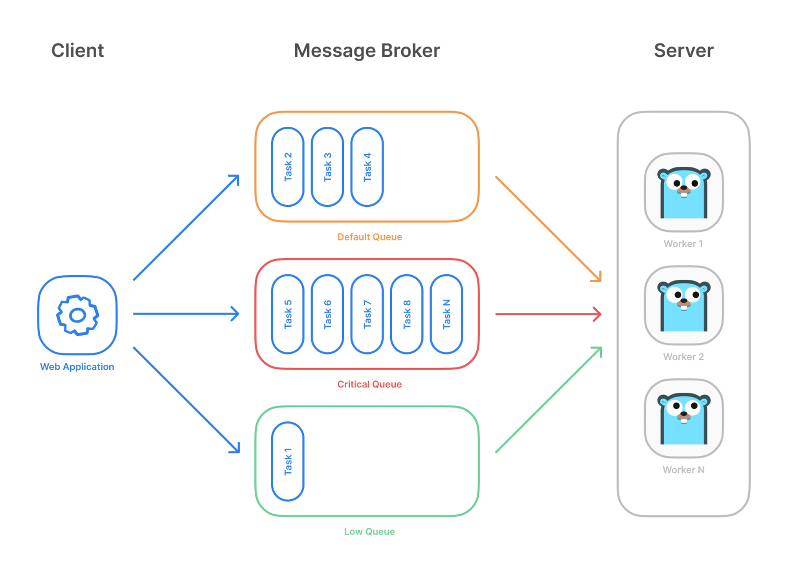
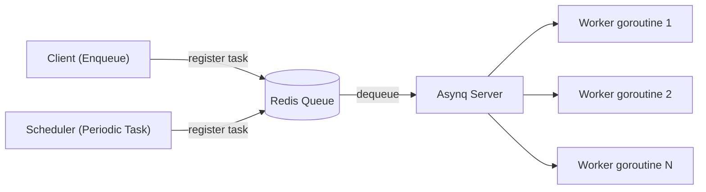
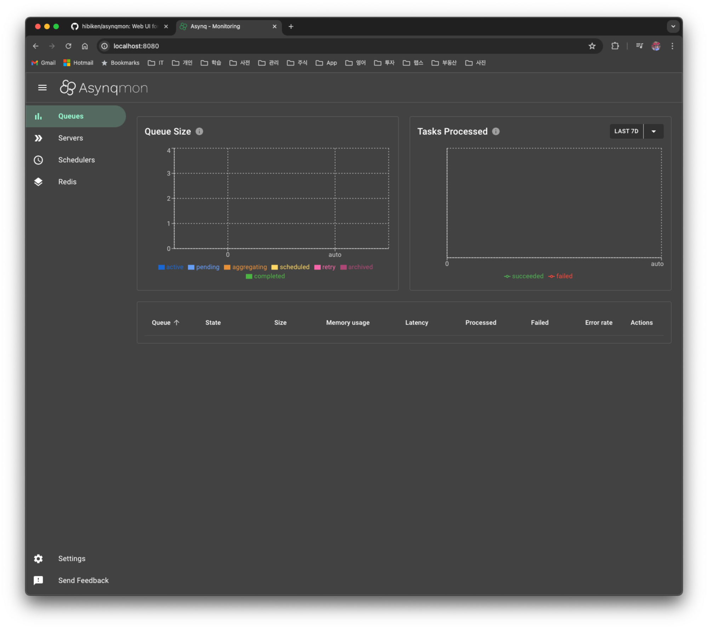
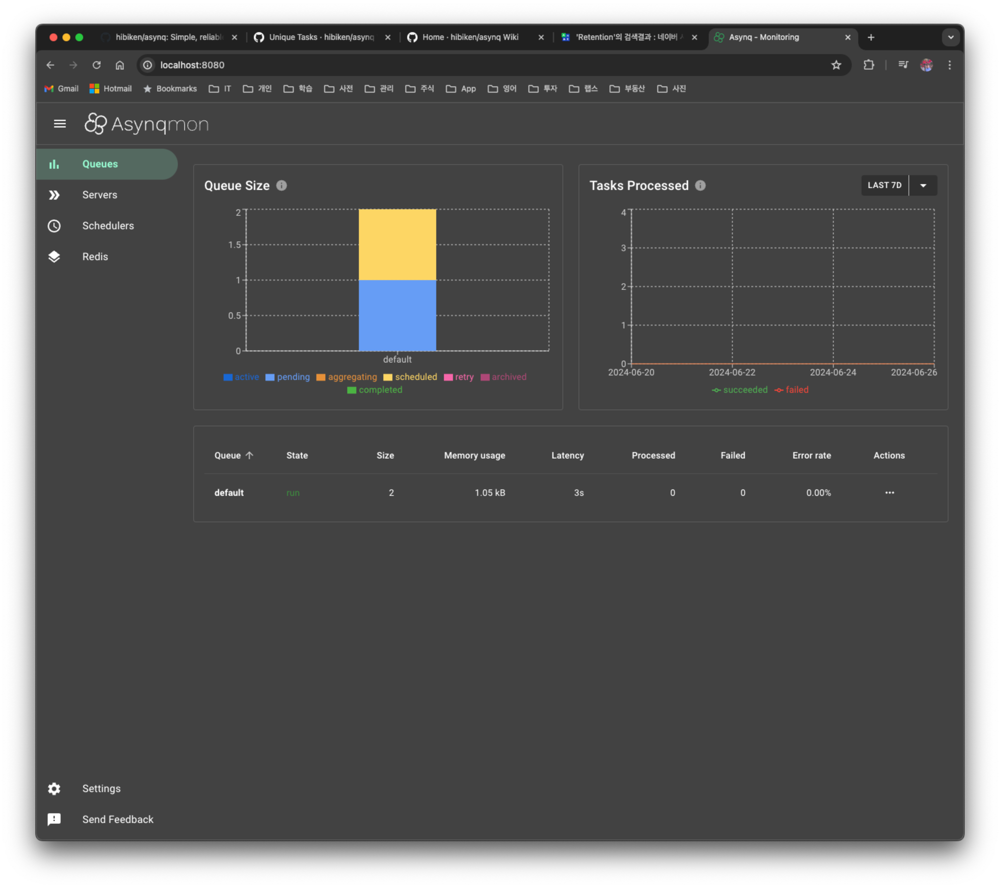
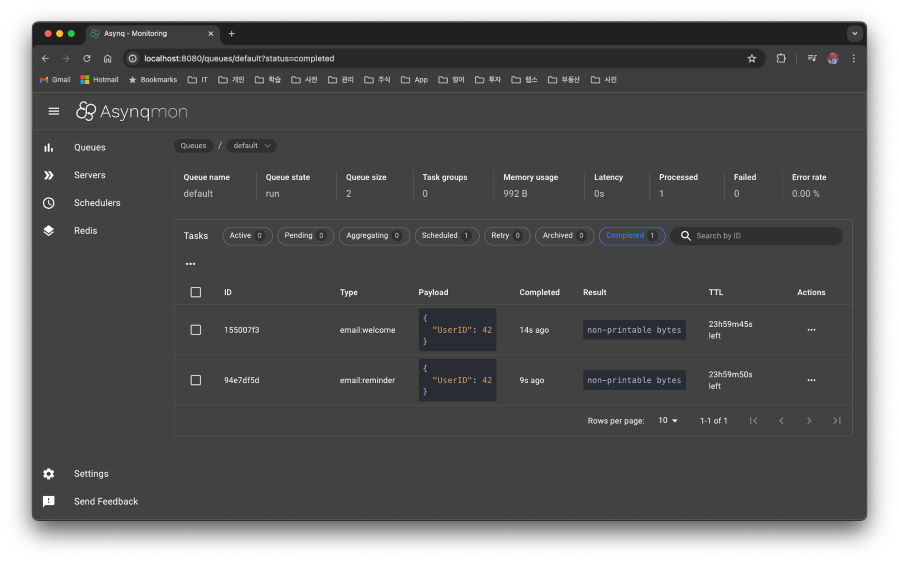
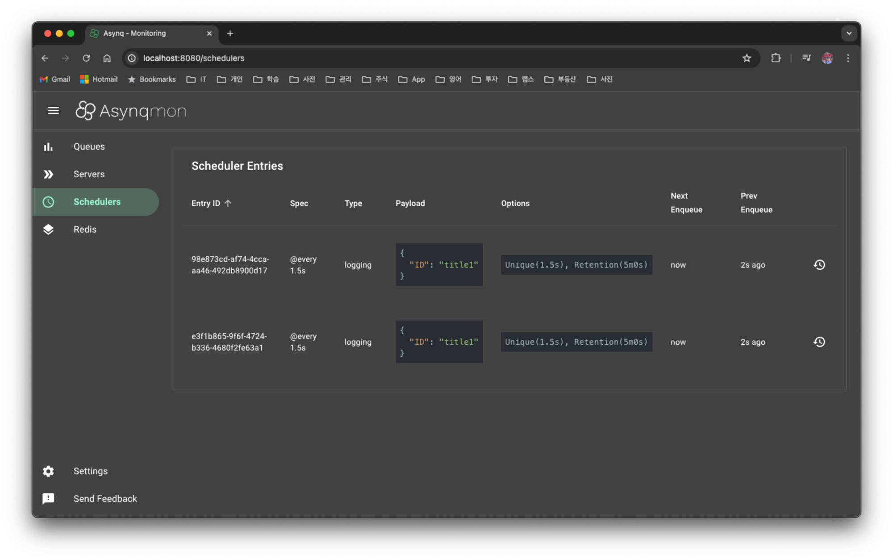

# 1. Overview

When developing a server, situations often arise where you need to process various tasks in the background. Such tasks run periodically or in reaction to specific events. For this reason, a scheduler is also an essential feature in server development. In addition, for server redundancy, scheduling must be able to work smoothly even across multiple servers in a distributed environment.

If you're developing with Spring, you can use Quartz, which Spring provides. Quartz is a fairly old project, so it's used as the de facto standard in Spring. Since I also needed to develop a distributed scheduler for a server written in Golang, I reviewed which one would be good to use.

## 1.1 golang Schedulers

- `Asynq`
  - It stores job information on a redis server, and even if you run multiple instances, there's no issue of the triggering interval becoming shorter
- `go-cron`
  - It uses Redislock to allow execution on a single server, but as the number of servers grows, there's an issue where the triggering interval becomes shorter
- `quartz`
  - It's a version that started inspired by the Spring Quartz implementation, but it does not support distributed scheduling
- `dcron`
  - It runs atomically using Redis commands, but it has the same trigger issue that go-cron has
- `work`
  - Judging by the lack of recent updates, it appears to be unmaintained
- I reviewed other schedulers too, but there wasn't much point, so I'll skip them

After investigating, I thought `Asynq` was still the best scheduler, so I'm organizing what I researched a bit further.

Reference

- https://awesome-go.com/job-scheduler/

# 2. A Summary of `Asynq`'s Features

`Asynq` is a library that puts tasks into a queue and processes tasks asynchronously with workers. The information it uses internally (e.g. tasks, scheduler) is stored in redis.

## 2.1 Basic Operation

- `Asynq` does not use a distributed lock; internally it puts tasks into a queue, and the server takes tasks from the queue and processes them in each worker goroutine
- Tasks can be added in two ways (stored in redis)
  - Put a task into the queue with the `Asynq` client, or
  - Register it as a periodic task (cron) so that it runs periodically
- You can also set priorities across multiple queues



To summarize the overall flow, it can be divided into the **enqueue** stage where the client puts a task into the queue, and the **dequeue** stage where the server (worker) takes a task from the queue and runs it. Since dequeue is handled automatically by the `asynq` server internally, there is no API like `Dequeue()` that the user calls directly.



> The `Asynq Server` takes the tasks enqueued by the `Client`/`Scheduler` from the queue (dequeue) and distributes them to as many worker goroutines as the `Concurrency` setting for processing.

## 2.2 Main Features

There are many features provided, but I've mainly organized the ones I think are needed for the application I'm currently developing.

- It guarantees at-least-once task execution
  - Even as the number of server instances grows, the triggering interval does not change
- You can register periodic tasks
  - Periodic tasks are implemented using the golang [cron](https://github.com/robfig/cron) library
  - Information about periodic tasks is written to redis periodically every 5 seconds
- It supports configuration for duplicate task registration
- It supports Redis
  - redis cluster, sentinel
- It supports Prometheus integration, so you can collect and visualize metrics about the queue
- It also supports a Web UI, [asynqmon](https://github.com/hibiken/asynqmon)
- It supports a CLI so you can check queue information

## 2.3 Sample Code

Since `Async` uses Redis as its DB, run the redis server with the command below.

```bash
> cd cloud/docker/redis
> make redis-create
```

> The code is written as unit tests, so you could run redis with testcontainers, but I didn't bother refactoring it ^^

### 2.3.1 Running the asynqmon UI

Since you can easily check the information stored in redis from the `asynqmon` UI, let's run `asynqmon` first.

```bash
> git clone <https://github.com/hibiken/asynqmon>
> cd asynqmon
> make docker
```

If you connect to http://localhost:8080, you'll see it as below.



### 2.3.2 Defining a Task and Handler

In `asynq`, a task consists of a **type** (a string that distinguishes what kind of work it is) and a **payload** (bytes that serialize the data needed for processing). You create a task with `asynq.NewTask()`, and you define how to process each type with a handler function.

```go
// A list of task types.
const (
	TypeWelcomeEmail  = "email:welcome"
	TypeReminderEmail = "email:reminder"
)

type EmailTaskPayload struct {
	UserID int
}

// Create a task: type + payload (JSON serialization)
func NewWelcomeEmailTask(id int) (*asynq.Task, error) {
	payload, err := json.Marshal(EmailTaskPayload{UserID: id})
	if err != nil {
		return nil, err
	}
	return asynq.NewTask(TypeWelcomeEmail, payload), nil
}

// handler: deserialize the payload and process the actual work
func HandleWelcomeEmailTask(ctx context.Context, t *asynq.Task) error {
	var p EmailTaskPayload
	if err := json.Unmarshal(t.Payload(), &p); err != nil {
		return err
	}
	log.Printf(" [*] Send Welcome Email to User %d", p.UserID)
	return nil
}
```

> If the handler returns `nil`, the task is treated as successful, and if it returns an `error`, it's considered a failure and is automatically **retried**. The retry behavior is covered in [2.3.4 Retry and Failure Handling](#234-retry-and-failure-handling).

### 2.3.3 Running Only Once

The code below does not actually run the task; it simply stores the task in redis. When registering a task with `Enqueue()`, you can give it several options. I'll only mention the frequently used options and move on.

- `asynq.Queue("queue1")`
  - An option to specify the queue name; if not specified, the queue is created with the `default` value

- `asynq.ProcessIn(2*time.Second)`
  - It means the task will run 2 seconds from the current time

- `asynq.Retention(24*time.Hour)`
  - An option that determines how long the result is retained after the task runs

- `asynq.Unique(1*time.Second)`
  - An option that holds a lock during this time so that other tasks cannot run

- `asynq.TaskID("task1")`

  - You can specify the task id with `TaskID`. If not specified, a random value is used
  - If the same taskID is registered, an `ErrDuplicateTask` error is returned

```go
func Test_Async_Client(t *testing.T) {
	client := asynq.NewClient(asynq.RedisClientOpt{Addr: "localhost:6379"})

	t1, err := tasks.NewWelcomeEmailTask(42)
	if err != nil {
		log.Fatal(err)
	}

	t2, err := tasks.NewReminderEmailTask(42)
	if err != nil {
		log.Fatal(err)
	}

	// Process the task immediately.
	info, err := client.Enqueue(t1, asynq.Retention(24*time.Hour))
	if err != nil {
		log.Fatal(err)
	}
	log.Printf(" [*] Successfully enqueued task: %+v", info)

	// Process the task 24 hours later.
	info, err = client.Enqueue(t2, asynq.ProcessIn(2*time.Second), asynq.Retention(24*time.Hour))
	if err != nil {
		log.Fatal(err)
	}
	log.Printf(" [*] Successfully enqueued task: %+v", info)
}
```

When you run the code, you can see that 2 tasks have been added to the default queue.



The code above only performed up to enqueue, so to actually take the tasks accumulated in the queue (dequeue) and run them, you need to run the `asynq` server. If you create a server with `asynq.NewServer`, register a handler per task type on the `ServeMux`, and then call `srv.Run(mux)`, the server dequeues tasks from the queue and distributes them to as many worker goroutines as the `Concurrency` value for processing.

```go
func Test_Workers2a(t *testing.T) {
	srv := asynq.NewServer(
		asynq.RedisClientOpt{Addr: "localhost:6379"},
		asynq.Config{Concurrency: 5},
	)

	mux := asynq.NewServeMux()
	mux.HandleFunc(tasks.TypeWelcomeEmail, tasks.HandleWelcomeEmailTask)
	mux.HandleFunc(tasks.TypeReminderEmail, tasks.HandleReminderEmailTask)
	mux.HandleFunc(tasks.TypeLogging, tasks.HandleLoggingTask)

	if err := srv.Run(mux); err != nil {
		log.Fatal(err)
	}
}
```

You can easily check whether it ran well in `asynqmon`.

> Since the task was registered with the `Retention` option, you can check the execution result in the Completed section.



### 2.3.4 Retry and Failure Handling

One of the reasons I recommend asynq as a distributed scheduler is that it supports retries for failed tasks by default. It works as follows.

- If the handler returns an `error`, that task is considered a failure and is automatically **retried**.
- The default retry count (`MaxRetry`) is **25**, and an **exponential backoff** with gradually increasing retry intervals is applied.
- You can adjust the count with the `asynq.MaxRetry(n)` option at enqueue time.
- When all retries are exhausted, the task moves to the **archived queue** (dead queue), and you can check failed tasks in the `Archived` tab of `asynqmon`.
- For a permanent error that can never succeed on retry, such as invalid input, you can return `asynq.SkipRetry` from the handler to send it to the archived queue immediately.

```go
// Specify the maximum retry count at enqueue time (default 25)
client.Enqueue(task, asynq.MaxRetry(3))

// In the handler, immediately stop errors where retrying is pointless with SkipRetry
func HandleWelcomeEmailTask(ctx context.Context, t *asynq.Task) error {
	var p EmailTaskPayload
	if err := json.Unmarshal(t.Payload(), &p); err != nil {
		// a payload parsing failure will fail the same way on retry, so skip
		return fmt.Errorf("json.Unmarshal failed: %v: %w", err, asynq.SkipRetry)
	}
	log.Printf(" [*] Send Welcome Email to User %d", p.UserID)
	return nil
}
```

> If you use retries together with result retention (`Retention`), you can track the processing history of successful/failed tasks in `asynqmon`, which is useful in operations.

### 2.3.5 Running Periodic Tasks

To run something periodically, create an `asynq.Scheduler` object with `asynq.NewScheduler` and register tasks with the `Register()` method. The time to register a periodic task is at the point of starting the server. However, when running the scheduler on multiple servers in a distributed environment, there's an issue where it gets registered redundantly and ends up running multiple times against your intention.

> In `asynq`, there's no way to register the same task only once across multiple servers

```go
func Test_Periodic_Tasks(t *testing.T) {
	redisOpt := asynq.RedisClientOpt{Addr: redisAddr}
	ctx := context.Background()
	redisClient := newRedisClient()
	defer func() {
		redisClient.Close()
	}()

	maxGoroutine := 2

	type schedulerInfo struct {
		scheduler *asynq.Scheduler
		entryID   string
	}

	schedulerInfoMap := make(map[int]schedulerInfo)

	for i := 1; i <= maxGoroutine; i++ {
		go func(i int) {
			scheduler := asynq.NewScheduler(redisOpt, nil)
			// schedulers = append(schedulers, scheduler)

			// You can use cron spec string to specify the schedule.
			loggingTask, err := tasks.NewLoggingTask("title1")
			assert.NoError(t, err)

			// 2 instances: confirmed that the trigger also works well
			entryID, err := scheduler.Register("@every 1.5s", loggingTask, asynq.Unique(1500*time.Millisecond), asynq.Retention(5*time.Minute))
			if err != nil {
				log.Fatal(err)
			}
			log.Printf("registered an entry: %q\\n", entryID)

			schedulerInfoMap[i] = schedulerInfo{scheduler: scheduler, entryID: entryID}

			if err := scheduler.Start(); err != nil {
				log.Fatal(err)
			}
			log.Printf("running scheduler...")

			// Once a periodic task is registered, it runs via the cron library, and the periodic task info is written to redis every 5 seconds
			time.Sleep(1 * time.Second)
			keys := redisClient.Keys(ctx, "asynq:schedulers*")
			assert.NoError(t, err)
			fmt.Printf("keys: %v\\n", keys)

		}(i)
	}

	time.Sleep(60 * time.Second)

	for _, schedulerInfo := range schedulerInfoMap {
		assert.NoError(t, schedulerInfo.scheduler.Unregister(schedulerInfo.entryID))
		schedulerInfo.scheduler.Shutdown()
	}

}
```

Even if the same task is registered multiple times, there's a solution presented in an `asynq` GitHub Issue for running it only once, so I applied it.

### 2.3.6 A Solution to Prevent Duplicate Execution

1. Use these two options: `asynq.TaskID` and `asynq.Retention`
   - In my experiments, the interval was not consistent. I told it to run every 2 seconds, but there was an issue where it ran at 3 or 4 seconds

2. Unique Tasks ← I chose this one
   - If you use the `asynq.Unique(1500*time.Millisecond)` option when registering a task, it uses a RedisLock during execution, so even as server instances grow, it doesn't run multiple times redundantly and runs at the consistent interval you set

Reference

- [How to prevent duplicate scheduler task registe across multiple Asynq server nodes](https://github.com/hibiken/asynq/issues/653)
- [FEATURE REQUEST Distributed Scheduler](https://github.com/hibiken/asynq/issues/395)

When you run it with 2 instances, you can see that 2 periodic tasks have been registered.



> When is a periodic task written to redis?
>
> - Registration of a periodic task runs via the cron library (it's written to memory)
> - When you start the scheduler, `runHeartBeater()` is set to write to redis periodically every 5 seconds at that point

# 3. Summary

If you don't need to consider a distributed environment, there are usable schedulers among Golang libraries too, but in a production environment you have to consider a distributed scheduler, and in that case I recommend using asynq.

> You can find the code written in this post [here](https://github.com/kenshin579/tutorials-go/tree/master/scheduler/asynq).

# 4. References

- https://github.com/hibiken/asynq/wiki
- https://github.com/hibiken/asynq
