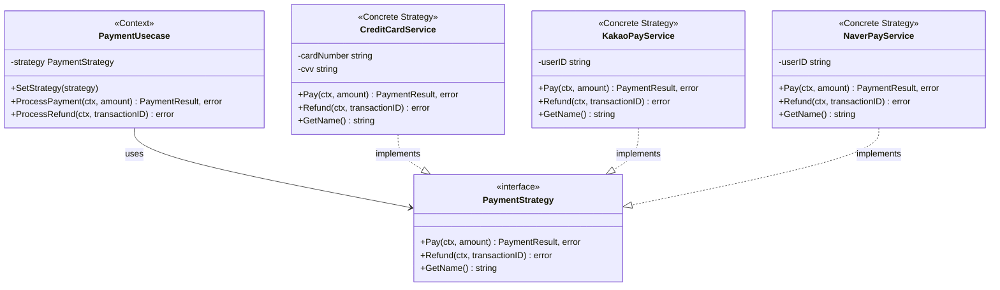
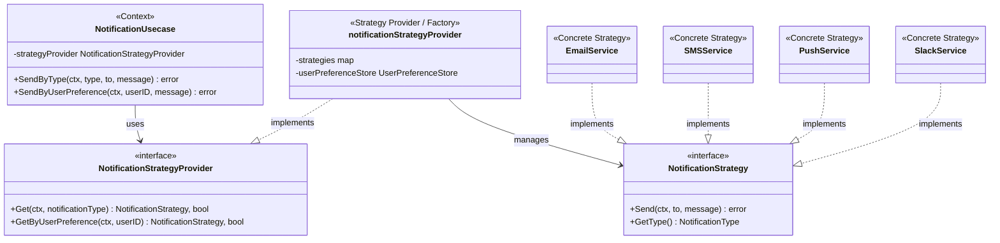

# 1. 개요

## 1.1 Strategy 패턴이란?

Strategy 패턴은 **행위(Behavioral) 디자인 패턴**으로, 알고리즘 군을 정의하고 각각을 캡슐화하여 런타임에 교체 가능하게 만드는 패턴이다.

핵심 아이디어는 간단하다:
- **변하는 로직을 분리**한다
- **행위를 인터페이스로 추상화**한다
- **런타임에 전략을 교체**할 수 있다

## 1.2 왜 Go에서 Strategy 패턴이 중요한가?

Go는 명시적인 상속이 없고, **인터페이스 기반의 다형성**을 지원한다. 이러한 특성은 Strategy 패턴과 매우 잘 어울린다.

- Go의 인터페이스는 **암묵적 구현(implicit implementation)**을 지원
- 작은 인터페이스를 선호하는 Go 철학과 일치
- 상속 대신 **합성(composition)**을 사용하는 Go 스타일에 적합

> 이 포스트에서 사용된 샘플 코드는 [GitHub](https://github.com/kenshin579/tutorials-go/tree/master/golang/pattern)에서 확인할 수 있습니다.

## 1.3 Strategy 패턴이 필요한 상황

요구사항이 추가될 때마다 조건문이 계속 늘어나는 코드를 살펴보자.

```go
// 안티패턴: 조건문이 계속 늘어나는 구조
func ProcessPayment(paymentType string, amount int) error {
    switch paymentType {
    case "credit_card":
        fmt.Printf("Processing credit card payment: %d won\n", amount)
        return nil
    case "kakao_pay":
        fmt.Printf("Processing KakaoPay payment: %d won\n", amount)
        return nil
    case "naver_pay":
        fmt.Printf("Processing NaverPay payment: %d won\n", amount)
        return nil
    // 새로운 결제 방식이 추가될 때마다 case가 늘어난다...
    default:
        return fmt.Errorf("unsupported payment type: %s", paymentType)
    }
}
```

**문제점:**
- 새로운 결제 방식 추가 시 기존 코드 수정 필요 (OCP 위반)
- 함수가 점점 비대해짐
- 테스트하기 어려움
- 팀 협업 시 같은 파일에서 충돌 발생

# 2. Go에서의 Strategy 패턴 구현

## 2.1 핵심 구성 요소

Strategy 패턴은 세 가지 핵심 구성 요소로 이루어진다. 각 구성 요소는 명확한 역할을 가지며, 이를 통해 알고리즘의 정의와 사용을 분리할 수 있다.

| 구성 요소 | 역할 |
|----------|------|
| **Strategy 인터페이스** | 모든 전략이 구현해야 할 공통 메서드 정의 |
| **Concrete Strategy** | 실제 알고리즘을 구현하는 구체적인 전략들 |
| **Context** | 전략 객체를 참조하고, 인터페이스를 통해 전략을 실행 |

> 여기서 **Context**라는 용어는 "전략이 실행되는 **맥락/환경**"이라는 의미다. GoF 원서에서도 Context를 *"the environment in which the algorithm is configured and executed"* (알고리즘이 설정되고 실행되는 환경)로 설명하고 있다.
>  식당으로 비유하면, 셰프(Strategy)가 요리를 직접 하고 식당(Context)은 주문 접수와 서빙을 관리하면서 실제 요리는 셰프에게 위임하는 구조다.
> Context는 어떤 전략이 설정되어 있는지 알고 있고, 요청이 오면 전략에게 실행을 위임하지만, 알고리즘을 직접 수행하지는 않는다.



이제 위 결제 시스템 예제를 Go로 구현해보자. 각 결제 방식을 독립적인 구조체로 분리하고, 공통 인터페이스를 통해 일관된 방식으로 호출할 수 있도록 설계한다.

## 2.2 디렉토리 구조

전략별로 파일을 분리하면 팀원들이 서로 다른 전략을 동시에 개발할 때 충돌을 줄일 수 있다.

```
strategy/
├── main.go                    # 실행 예제
└── payment/
    ├── domain.go              # Strategy 인터페이스 정의
    ├── credit_card_service.go # 신용카드 결제 전략
    ├── kakao_pay_service.go   # 카카오페이 결제 전략
    ├── naver_pay_service.go   # 네이버페이 결제 전략
    ├── payment_usecase.go     # Context (Usecase)
    └── helper.go              # 헬퍼 함수
```

## 2.3 Strategy 인터페이스 정의

Strategy 인터페이스는 모든 결제 전략이 반드시 구현해야 하는 계약(contract)을 정의한다. `Pay`, `Refund`, `GetName` 세 가지 메서드를 통해 결제와 환불 처리, 전략 식별이 가능하도록 설계했다.

```go
// domain.go
package payment

import "context"

// PaymentStrategy 는 결제 처리를 위한 전략 인터페이스입니다.
type PaymentStrategy interface {
    Pay(ctx context.Context, amount int) (PaymentResult, error)
    Refund(ctx context.Context, transactionID string) error
    GetName() string
}

type PaymentResult struct {
    TransactionID string
    Status        string
    Message       string
}
```

## 2.4 Concrete Strategy 구현

각 결제 방식은 `PaymentStrategy` 인터페이스를 구현하는 독립적인 구조체로 만든다. Go에서는 인터페이스를 명시적으로 선언(`implements`)할 필요 없이, 메서드 시그니처만 맞추면 자동으로 인터페이스를 만족하게 된다.

### 신용카드 결제 서비스

```go
// credit_card_service.go
package payment

import (
    "context"
    "fmt"
)

// CreditCardService 는 신용카드 결제 서비스입니다.
type CreditCardService struct {
    cardNumber string
    cvv        string
}

func NewCreditCardService(cardNumber, cvv string) *CreditCardService {
    return &CreditCardService{
        cardNumber: cardNumber,
        cvv:        cvv,
    }
}

func (s *CreditCardService) Pay(ctx context.Context, amount int) (PaymentResult, error) {
    fmt.Printf("[CreditCard] Processing payment of %d won with card %s\n", amount, s.maskCardNumber())
    return PaymentResult{
        TransactionID: "CC-" + generateID(),
        Status:        "SUCCESS",
        Message:       "Credit card payment completed",
    }, nil
}

func (s *CreditCardService) Refund(ctx context.Context, transactionID string) error {
    fmt.Printf("[CreditCard] Refunding transaction %s\n", transactionID)
    return nil
}

func (s *CreditCardService) GetName() string {
    return "credit_card"
}

func (s *CreditCardService) maskCardNumber() string {
    if len(s.cardNumber) < 4 {
        return "****"
    }
    return "****-****-****-" + s.cardNumber[len(s.cardNumber)-4:]
}
```

`KakaoPayService`, `NaverPayService`도 동일한 구조로 `PaymentStrategy` 인터페이스를 구현한다. 각 서비스는 자신만의 결제 처리 로직과 트랜잭션 ID 접두사(`KP-`, `NP-`)를 가지며, 전체 코드는 [GitHub](https://github.com/kenshin579/tutorials-go/tree/master/golang/pattern/strategy/payment)에서 확인할 수 있다.

## 2.5 Context 구현 (Usecase)

Context는 Strategy 인터페이스에 대한 참조를 가지고 있으며, 구체적인 전략이 무엇인지 알 필요 없이 인터페이스를 통해 결제를 처리한다. `SetStrategy` 메서드를 통해 런타임에 전략을 자유롭게 교체할 수 있다.

```go
// payment_usecase.go
package payment

import (
    "context"
    "fmt"
)

// PaymentUsecase 는 결제 유스케이스입니다.
// Strategy 를 주입받아 결제를 처리합니다.
type PaymentUsecase struct {
    strategy PaymentStrategy
}

func NewPaymentUsecase(strategy PaymentStrategy) *PaymentUsecase {
    return &PaymentUsecase{strategy: strategy}
}

// SetStrategy 는 런타임에 전략을 변경합니다.
func (u *PaymentUsecase) SetStrategy(strategy PaymentStrategy) {
    u.strategy = strategy
}

// ProcessPayment 는 설정된 전략으로 결제를 처리합니다.
func (u *PaymentUsecase) ProcessPayment(ctx context.Context, amount int) (PaymentResult, error) {
    fmt.Printf("Processing payment with strategy: %s\n", u.strategy.GetName())
    return u.strategy.Pay(ctx, amount)
}

// ProcessRefund 는 설정된 전략으로 환불을 처리합니다.
func (u *PaymentUsecase) ProcessRefund(ctx context.Context, transactionID string) error {
    return u.strategy.Refund(ctx, transactionID)
}
```

## 2.6 사용 예제

아래 예제에서 하나의 `PaymentUsecase` 인스턴스가 신용카드, 카카오페이, 네이버페이 전략을 런타임에 순서대로 교체하며 결제를 처리하는 것을 확인할 수 있다.

```go
// main.go
package main

import (
    "context"
    "fmt"

    "github.com/kenshin579/tutorials-go/golang/pattern/strategy/payment"
)

func main() {
    ctx := context.Background()

    // 1. 신용카드 결제 서비스로 시작
    creditCardService := payment.NewCreditCardService("1234567890123456", "123")
    paymentUsecase := payment.NewPaymentUsecase(creditCardService)

    fmt.Println("--- 신용카드로 결제 ---")
    result, _ := paymentUsecase.ProcessPayment(ctx, 50000)
    fmt.Printf("Result: %+v\n\n", result)

    // 2. 런타임에 카카오페이 서비스로 전략 변경
    kakaoPayService := payment.NewKakaoPayService("user123")
    paymentUsecase.SetStrategy(kakaoPayService)

    fmt.Println("--- 카카오페이로 결제 ---")
    result, _ = paymentUsecase.ProcessPayment(ctx, 30000)
    fmt.Printf("Result: %+v\n\n", result)

    // 3. 네이버페이 서비스로 전략 변경
    naverPayService := payment.NewNaverPayService("user456")
    paymentUsecase.SetStrategy(naverPayService)

    fmt.Println("--- 네이버페이로 결제 ---")
    result, _ = paymentUsecase.ProcessPayment(ctx, 25000)
    fmt.Printf("Result: %+v\n\n", result)
}
```

**실행 결과:**

```
--- 신용카드로 결제 ---
Processing payment with strategy: credit_card
[CreditCard] Processing payment of 50000 won with card ****-****-****-3456
Result: {TransactionID:CC-12345678 Status:SUCCESS Message:Credit card payment completed}

--- 카카오페이로 결제 ---
Processing payment with strategy: kakao_pay
[KakaoPay] Processing payment of 30000 won for user user123
Result: {TransactionID:KP-12345678 Status:SUCCESS Message:KakaoPay payment completed}

--- 네이버페이로 결제 ---
Processing payment with strategy: naver_pay
[NaverPay] Processing payment of 25000 won for user user456
Result: {TransactionID:NP-12345678 Status:SUCCESS Message:NaverPay payment completed}
```

# 3. Factory + Strategy 패턴

실무에서는 "어떤 전략을 사용할지" 선택하는 로직 자체도 복잡해질 수 있다. 예를 들어 사용자 설정, 비즈니스 규칙, 또는 외부 조건에 따라 전략이 결정되는 경우다. 이때 Factory 패턴을 결합하면 전략 선택 로직을 별도의 Provider로 분리하여 더 깔끔한 구조를 만들 수 있다. 알림 시스템을 예로 들어보자.

## 3.1 핵심 구성 요소

기본 Strategy 패턴과 비교했을 때, **Strategy Provider**가 추가되는 것이 핵심이다. Context(Usecase)가 전략을 직접 참조하는 대신, Provider에게 적절한 전략을 요청하는 구조다.

| 구성 요소 | 역할 |
|----------|------|
| **Strategy 인터페이스** | 모든 알림 전략이 구현해야 할 공통 메서드 정의 |
| **Concrete Strategy** | 실제 알림 전송을 구현하는 구체적인 서비스들 |
| **Strategy Provider** | 조건에 따라 적절한 전략을 선택하여 제공 (Factory 역할) |
| **Context** | Provider로부터 전략을 받아 실행 |



## 3.2 디렉토리 구조

```
factory/
├── main.go                        # 실행 예제
└── notification/
    ├── domain.go                  # Strategy 인터페이스 + Provider 인터페이스
    ├── provider.go                # Strategy Provider (Factory 역할)
    ├── notification_usecase.go    # Context (Usecase)
    ├── email_service.go           # Email 전략
    ├── sms_service.go             # SMS 전략
    ├── push_service.go            # Push 전략
    ├── slack_service.go           # Slack 전략
    └── user_preference_store.go   # 사용자 설정 저장소
```

## 3.3 Strategy 인터페이스와 Provider 인터페이스

여기서 핵심은 `NotificationStrategyProvider` 인터페이스다. 알림 타입을 직접 지정하거나(`Get`), 사용자 설정을 기반으로 적절한 전략을 자동 선택(`GetByUserPreference`)하는 두 가지 방식을 지원한다.

```go
// domain.go
package notification

import "context"

// NotificationStrategy 는 알림 전송을 위한 전략 인터페이스입니다.
type NotificationStrategy interface {
    Send(ctx context.Context, to string, message string) error
    GetType() NotificationType
}

type NotificationType string

const (
    NotificationTypeEmail NotificationType = "email"
    NotificationTypeSMS   NotificationType = "sms"
    NotificationTypePush  NotificationType = "push"
    NotificationTypeSlack NotificationType = "slack"
)

// NotificationStrategyProvider 는 알림 타입에 따라 적절한 Strategy 를 제공합니다.
type NotificationStrategyProvider interface {
    Get(ctx context.Context, notificationType NotificationType) (NotificationStrategy, bool)
    GetByUserPreference(ctx context.Context, userID string) (NotificationStrategy, bool)
}

// UserPreferenceStore 는 사용자 알림 설정을 조회하는 인터페이스입니다.
type UserPreferenceStore interface {
    GetPreferredNotificationType(ctx context.Context, userID string) (NotificationType, error)
}
```

## 3.4 Strategy Provider 구현 (Factory)

Provider는 내부적으로 `map[NotificationType]NotificationStrategy`를 관리하며, 요청된 타입에 맞는 전략을 O(1)로 조회한다. 새로운 알림 채널이 추가되더라도 Provider 생성자에 전략을 하나 더 등록하기만 하면 된다.

```go
// provider.go
package notification

import (
    "context"
    "fmt"
)

// notificationStrategyProvider 는 NotificationStrategyProvider 의 구현체입니다.
type notificationStrategyProvider struct {
    strategies          map[NotificationType]NotificationStrategy
    userPreferenceStore UserPreferenceStore
}

// NewNotificationStrategyProvider 는 Provider 를 생성합니다.
func NewNotificationStrategyProvider(
    emailService *EmailService,
    smsService *SMSService,
    pushService *PushService,
    slackService *SlackService,
    userPreferenceStore UserPreferenceStore,
) NotificationStrategyProvider {
    strategies := map[NotificationType]NotificationStrategy{
        NotificationTypeEmail: emailService,
        NotificationTypeSMS:   smsService,
        NotificationTypePush:  pushService,
        NotificationTypeSlack: slackService,
    }

    return &notificationStrategyProvider{
        strategies:          strategies,
        userPreferenceStore: userPreferenceStore,
    }
}

// Get 은 알림 타입에 해당하는 Strategy 를 반환합니다.
func (p *notificationStrategyProvider) Get(ctx context.Context, notificationType NotificationType) (NotificationStrategy, bool) {
    strategy, ok := p.strategies[notificationType]
    return strategy, ok
}

// GetByUserPreference 는 사용자 설정에 따른 Strategy 를 반환합니다.
func (p *notificationStrategyProvider) GetByUserPreference(ctx context.Context, userID string) (NotificationStrategy, bool) {
    preferredType, err := p.userPreferenceStore.GetPreferredNotificationType(ctx, userID)
    if err != nil {
        fmt.Printf("Failed to get user preference: %v\n", err)
        return nil, false
    }

    strategy, ok := p.strategies[preferredType]
    return strategy, ok
}
```

## 3.5 Usecase (Context)

`NotificationUsecase`는 어떤 알림 전략이 선택되는지 전혀 관여하지 않는다. Provider에게 전략 조회를 위임하고, 반환된 전략의 `Send` 메서드를 호출할 뿐이다. 이렇게 하면 Usecase의 코드는 전략이 몇 개가 되든 변경할 필요가 없다.

```go
// notification_usecase.go
package notification

import (
    "context"
    "fmt"
)

// NotificationUsecase 는 알림 유스케이스입니다.
// Provider 를 통해 적절한 Strategy 를 얻어 알림을 전송합니다.
type NotificationUsecase struct {
    strategyProvider NotificationStrategyProvider
}

func NewNotificationUsecase(provider NotificationStrategyProvider) *NotificationUsecase {
    return &NotificationUsecase{strategyProvider: provider}
}

// SendByType 은 지정된 타입으로 알림을 전송합니다.
func (u *NotificationUsecase) SendByType(ctx context.Context, notificationType NotificationType, to, message string) error {
    strategy, ok := u.strategyProvider.Get(ctx, notificationType)
    if !ok {
        return fmt.Errorf("notification strategy not found for type: %s", notificationType)
    }

    return strategy.Send(ctx, to, message)
}

// SendByUserPreference 는 사용자 설정에 따라 알림을 전송합니다.
func (u *NotificationUsecase) SendByUserPreference(ctx context.Context, userID, message string) error {
    strategy, ok := u.strategyProvider.GetByUserPreference(ctx, userID)
    if !ok {
        return fmt.Errorf("notification strategy not found for user: %s", userID)
    }

    fmt.Printf("Sending notification with strategy: %s\n", strategy.GetType())
    return strategy.Send(ctx, userID, message)
}
```

## 3.6 사용 예제

아래 예제에서는 타입을 직접 지정하는 방식과, 사용자 설정에 따라 Provider가 자동으로 전략을 선택하는 방식 두 가지를 모두 보여준다.

```go
// main.go
package main

import (
    "context"
    "fmt"

    "github.com/kenshin579/tutorials-go/golang/pattern/factory/notification"
)

func main() {
    ctx := context.Background()

    // 1. 각 Service 생성
    emailService := notification.NewEmailService("smtp.gmail.com", 587)
    smsService := notification.NewSMSService("api-key-123", "010-1234-5678")
    pushService := notification.NewPushService("fcm-token-abc")
    slackService := notification.NewSlackService("https://hooks.slack.com/xxx")

    // 2. UserPreferenceStore 생성 (사용자 설정 저장소)
    userPrefStore := notification.NewUserPreferenceStore()

    // 3. Strategy Provider(Factory) 생성
    provider := notification.NewNotificationStrategyProvider(
        emailService,
        smsService,
        pushService,
        slackService,
        userPrefStore,
    )

    // 4. NotificationUsecase 생성
    notificationUsecase := notification.NewNotificationUsecase(provider)

    // 5. 타입을 직접 지정하여 알림 전송
    fmt.Println("--- 타입 직접 지정 방식 ---")
    _ = notificationUsecase.SendByType(ctx, notification.NotificationTypeSlack, "#general", "Hello Slack!")
    fmt.Println()

    // 6. 사용자별 설정에 따라 자동으로 Strategy 선택
    fmt.Println("--- 사용자 설정 기반 방식 (Factory Pattern 핵심) ---")
    fmt.Println()

    users := []string{"user001", "user002", "user003", "user004"}
    for _, userID := range users {
        fmt.Printf("Sending notification to %s:\n", userID)
        err := notificationUsecase.SendByUserPreference(ctx, userID, "Your order has been shipped!")
        if err != nil {
            fmt.Printf("Error: %v\n", err)
        }
        fmt.Println()
    }
}
```

> **Note:** Factory + Strategy 조합의 핵심은 **전략 선택 로직을 Provider에 위임**하는 것이다. Usecase는 어떤 전략이 선택되는지 알 필요 없이, Provider에게 적절한 전략을 요청하기만 하면 된다.

# 4. Strategy vs State 패턴

두 패턴은 구조적으로 유사하지만 의도가 다르다. Strategy 패턴은 클라이언트가 외부에서 알고리즘을 선택하여 주입하는 반면, State 패턴은 객체 내부 상태가 변경되면서 행동이 자동으로 바뀐다. 예를 들어, 결제 방식을 사용자가 선택하는 것은 Strategy이고, 주문 상태(접수 → 배송 중 → 완료)에 따라 처리 로직이 달라지는 것은 State 패턴에 해당한다.

| 비교 항목 | Strategy 패턴 | State 패턴 |
|----------|---------------|-----------|
| **목적** | 알고리즘 교체 | 상태에 따른 행동 변경 |
| **전환 주체** | 클라이언트가 전략 선택 | 상태 객체가 스스로 전환 |
| **상태 인식** | 전략끼리 서로 모름 | 상태끼리 서로 알 수 있음 |
| **사용 시점** | "어떻게" 할지 선택 | "무엇"에 따라 행동 변경 |

# 5. Strategy 패턴 적용 기준

Strategy 패턴은 강력하지만, 모든 곳에 적용할 필요는 없다. 과도한 추상화는 오히려 코드를 이해하기 어렵게 만들 수 있으므로, 아래 기준을 참고하여 적용 여부를 판단하자.

## 적용하면 좋은 경우

- 런타임에 알고리즘을 전환해야 할 때
- 유사한 클래스들이 실행 방식만 다를 때
- 비즈니스 로직을 알고리즘 구현에서 분리하고 싶을 때
- 대규모 조건문으로 알고리즘을 선택하는 코드가 있을 때

## 적용하지 않아도 되는 경우

- 알고리즘이 2-3개 이하이고 변경 가능성이 낮을 때
- 간단한 조건 분기로 충분할 때
- 과도한 추상화가 오히려 복잡성을 증가시킬 때

# 6. 마무리

이 글에서는 Go에서 Strategy 패턴을 인터페이스 기반으로 구현하는 방법을 살펴보았다. 런타임에 알고리즘을 자유롭게 교체할 수 있는 기본 Strategy 패턴부터, 사용자 설정에 따라 전략을 자동으로 선택하는 Factory + Strategy 조합까지 단계별로 알아보았다. Go의 암묵적 인터페이스 구현 덕분에 별도의 상속 없이도 깔끔하게 패턴을 적용할 수 있다.

## 핵심 포인트

1. **변하는 것을 분리하라**: 알고리즘을 인터페이스로 추상화
2. **상속보다 합성**: Go 스타일에 맞는 설계
3. **런타임 유연성**: 실행 중 전략 교체 가능
4. **OCP 준수**: 새 전략 추가 시 기존 코드 수정 불필요
5. **테스트 용이성**: Mock 전략으로 쉽게 테스트 가능

## Go에서 Strategy 패턴을 쓰는 기준

- 3개 이상의 알고리즘 변형이 있을 때
- 런타임에 알고리즘을 교체할 필요가 있을 때
- 알고리즘별로 독립적인 테스트가 필요할 때
- 팀에서 각 알고리즘을 독립적으로 개발해야 할 때

# 7. 참고

- [Refactoring Guru - Strategy Pattern](https://refactoring.guru/design-patterns/strategy)
- [Go Patterns - Strategy](https://github.com/tmrts/go-patterns/blob/master/behavioral/strategy.md)
- [Leapcell - Design Patterns in Go](https://leapcell.io/blog/best-practices-design-patterns-go)
- [예제 코드 - GitHub](https://github.com/kenshin579/tutorials-go/tree/master/golang/pattern)
