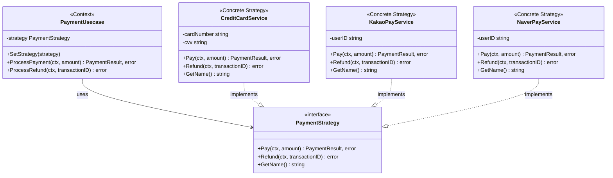
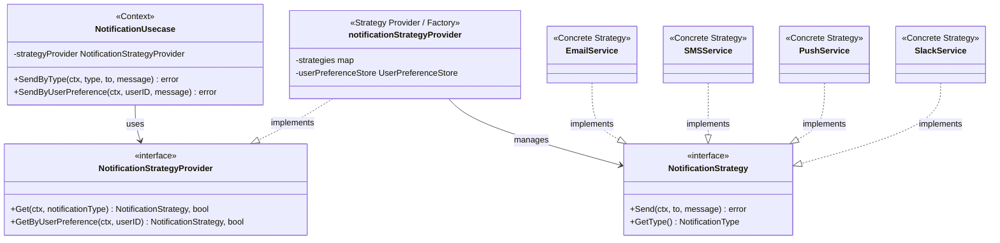

# 1. Overview

## 1.1 What Is the Strategy Pattern?

The Strategy pattern is a **behavioral design pattern** that defines a family of algorithms, encapsulates each one, and makes them interchangeable at runtime.

The core idea is simple:
- **Separate the logic that changes**
- **Abstract the behavior into an interface**
- **Swap strategies at runtime**

## 1.2 Why Is the Strategy Pattern Important in Go?

Go has no explicit inheritance and supports **interface-based polymorphism**. This characteristic pairs very well with the Strategy pattern.

- Go's interfaces support **implicit implementation**
- It aligns with the Go philosophy of preferring small interfaces
- It suits the Go style of using **composition** instead of inheritance

> The sample code used in this post can be found on [GitHub](https://github.com/kenshin579/tutorials-go/tree/master/golang/pattern).

## 1.3 Situations Where the Strategy Pattern Is Needed

Let's look at code where conditionals keep growing every time a requirement is added.

```go
// Anti-pattern: a structure where conditionals keep growing
func ProcessPayment(paymentType string, amount int) error {
    switch paymentType {
    case "credit_card":
        fmt.Printf("Processing credit card payment: %d won\n", amount)
        return nil
    case "kakao_pay":
        fmt.Printf("Processing KakaoPay payment: %d won\n", amount)
        return nil
    case "naver_pay":
        fmt.Printf("Processing NaverPay payment: %d won\n", amount)
        return nil
    // Every time a new payment method is added, a case grows...
    default:
        return fmt.Errorf("unsupported payment type: %s", paymentType)
    }
}
```

**Problems:**
- Adding a new payment method requires modifying existing code (OCP violation)
- The function gets more and more bloated
- Hard to test
- Conflicts in the same file during team collaboration

# 2. Implementing the Strategy Pattern in Go

## 2.1 Core Components

The Strategy pattern consists of three core components. Each component has a clear role, which lets you separate the definition and the use of an algorithm.

| Component | Role |
|----------|------|
| **Strategy interface** | Defines the common method that all strategies must implement |
| **Concrete Strategy** | The concrete strategies that implement the actual algorithm |
| **Context** | References a strategy object and executes the strategy through the interface |

> The term **Context** here means "the **context/environment** in which the strategy is executed." The GoF book also describes Context as *"the environment in which the algorithm is configured and executed."*
>  As a restaurant analogy, it's a structure where the chef (Strategy) does the cooking directly, and the restaurant (Context) manages taking orders and serving while delegating the actual cooking to the chef.
> The Context knows which strategy is set and delegates execution to the strategy when a request comes in, but does not perform the algorithm itself.



Now let's implement the payment system example above in Go. We separate each payment method into an independent struct and design it so that it can be called consistently through a common interface.

## 2.2 Directory Structure

Separating files by strategy reduces conflicts when team members develop different strategies at the same time.

```
strategy/
├── main.go                    # execution example
└── payment/
    ├── domain.go              # Strategy interface definition
    ├── credit_card_service.go # credit card payment strategy
    ├── kakao_pay_service.go   # KakaoPay payment strategy
    ├── naver_pay_service.go   # NaverPay payment strategy
    ├── payment_usecase.go     # Context (Usecase)
    └── helper.go              # helper functions
```

## 2.3 Defining the Strategy Interface

The Strategy interface defines the contract that all payment strategies must implement. It's designed so that payment, refund processing, and strategy identification are possible through the three methods `Pay`, `Refund`, and `GetName`.

```go
// domain.go
package payment

import "context"

// PaymentStrategy is the strategy interface for processing payments.
type PaymentStrategy interface {
    Pay(ctx context.Context, amount int) (PaymentResult, error)
    Refund(ctx context.Context, transactionID string) error
    GetName() string
}

type PaymentResult struct {
    TransactionID string
    Status        string
    Message       string
}
```

## 2.4 Implementing Concrete Strategies

Each payment method is made into an independent struct that implements the `PaymentStrategy` interface. In Go, you don't need to explicitly declare that you `implement` an interface; as long as the method signatures match, the interface is automatically satisfied.

### Credit Card Payment Service

```go
// credit_card_service.go
package payment

import (
    "context"
    "fmt"
)

// CreditCardService is the credit card payment service.
type CreditCardService struct {
    cardNumber string
    cvv        string
}

func NewCreditCardService(cardNumber, cvv string) *CreditCardService {
    return &CreditCardService{
        cardNumber: cardNumber,
        cvv:        cvv,
    }
}

func (s *CreditCardService) Pay(ctx context.Context, amount int) (PaymentResult, error) {
    fmt.Printf("[CreditCard] Processing payment of %d won with card %s\n", amount, s.maskCardNumber())
    return PaymentResult{
        TransactionID: "CC-" + generateID(),
        Status:        "SUCCESS",
        Message:       "Credit card payment completed",
    }, nil
}

func (s *CreditCardService) Refund(ctx context.Context, transactionID string) error {
    fmt.Printf("[CreditCard] Refunding transaction %s\n", transactionID)
    return nil
}

func (s *CreditCardService) GetName() string {
    return "credit_card"
}

func (s *CreditCardService) maskCardNumber() string {
    if len(s.cardNumber) < 4 {
        return "****"
    }
    return "****-****-****-" + s.cardNumber[len(s.cardNumber)-4:]
}
```

`KakaoPayService` and `NaverPayService` also implement the `PaymentStrategy` interface with the same structure. Each service has its own payment processing logic and transaction ID prefix (`KP-`, `NP-`), and the full code can be found on [GitHub](https://github.com/kenshin579/tutorials-go/tree/master/golang/pattern/strategy/payment).

## 2.5 Implementing the Context (Usecase)

The Context holds a reference to the Strategy interface and processes payments through the interface without needing to know what the concrete strategy is. Through the `SetStrategy` method, you can freely swap strategies at runtime.

```go
// payment_usecase.go
package payment

import (
    "context"
    "fmt"
)

// PaymentUsecase is the payment use case.
// It receives a Strategy via injection and processes payments.
type PaymentUsecase struct {
    strategy PaymentStrategy
}

func NewPaymentUsecase(strategy PaymentStrategy) *PaymentUsecase {
    return &PaymentUsecase{strategy: strategy}
}

// SetStrategy changes the strategy at runtime.
func (u *PaymentUsecase) SetStrategy(strategy PaymentStrategy) {
    u.strategy = strategy
}

// ProcessPayment processes a payment with the configured strategy.
func (u *PaymentUsecase) ProcessPayment(ctx context.Context, amount int) (PaymentResult, error) {
    fmt.Printf("Processing payment with strategy: %s\n", u.strategy.GetName())
    return u.strategy.Pay(ctx, amount)
}

// ProcessRefund processes a refund with the configured strategy.
func (u *PaymentUsecase) ProcessRefund(ctx context.Context, transactionID string) error {
    return u.strategy.Refund(ctx, transactionID)
}
```

## 2.6 Usage Example

In the example below, you can see a single `PaymentUsecase` instance processing payments while swapping the credit card, KakaoPay, and NaverPay strategies in order at runtime.

```go
// main.go
package main

import (
    "context"
    "fmt"

    "github.com/kenshin579/tutorials-go/golang/pattern/strategy/payment"
)

func main() {
    ctx := context.Background()

    // 1. Start with the credit card payment service
    creditCardService := payment.NewCreditCardService("1234567890123456", "123")
    paymentUsecase := payment.NewPaymentUsecase(creditCardService)

    fmt.Println("--- Pay with Credit Card ---")
    result, _ := paymentUsecase.ProcessPayment(ctx, 50000)
    fmt.Printf("Result: %+v\n\n", result)

    // 2. Change the strategy to the KakaoPay service at runtime
    kakaoPayService := payment.NewKakaoPayService("user123")
    paymentUsecase.SetStrategy(kakaoPayService)

    fmt.Println("--- Pay with KakaoPay ---")
    result, _ = paymentUsecase.ProcessPayment(ctx, 30000)
    fmt.Printf("Result: %+v\n\n", result)

    // 3. Change the strategy to the NaverPay service
    naverPayService := payment.NewNaverPayService("user456")
    paymentUsecase.SetStrategy(naverPayService)

    fmt.Println("--- Pay with NaverPay ---")
    result, _ = paymentUsecase.ProcessPayment(ctx, 25000)
    fmt.Printf("Result: %+v\n\n", result)
}
```

**Execution result:**

```
--- Pay with Credit Card ---
Processing payment with strategy: credit_card
[CreditCard] Processing payment of 50000 won with card ****-****-****-3456
Result: {TransactionID:CC-12345678 Status:SUCCESS Message:Credit card payment completed}

--- Pay with KakaoPay ---
Processing payment with strategy: kakao_pay
[KakaoPay] Processing payment of 30000 won for user user123
Result: {TransactionID:KP-12345678 Status:SUCCESS Message:KakaoPay payment completed}

--- Pay with NaverPay ---
Processing payment with strategy: naver_pay
[NaverPay] Processing payment of 25000 won for user user456
Result: {TransactionID:NP-12345678 Status:SUCCESS Message:NaverPay payment completed}
```

# 3. Factory + Strategy Pattern

In practice, the logic of "which strategy to use" can itself become complex. For example, when the strategy is determined by user settings, business rules, or external conditions. In this case, combining the Factory pattern lets you separate the strategy selection logic into a dedicated Provider for a cleaner structure. Let's take a notification system as an example.

## 3.1 Core Components

Compared to the basic Strategy pattern, the key is that a **Strategy Provider** is added. Instead of the Context (Usecase) referencing the strategy directly, it requests an appropriate strategy from the Provider.

| Component | Role |
|----------|------|
| **Strategy interface** | Defines the common method that all notification strategies must implement |
| **Concrete Strategy** | The concrete services that implement the actual notification sending |
| **Strategy Provider** | Selects and provides the appropriate strategy based on conditions (Factory role) |
| **Context** | Receives a strategy from the Provider and executes it |



## 3.2 Directory Structure

```
factory/
├── main.go                        # execution example
└── notification/
    ├── domain.go                  # Strategy interface + Provider interface
    ├── provider.go                # Strategy Provider (Factory role)
    ├── notification_usecase.go    # Context (Usecase)
    ├── email_service.go           # Email strategy
    ├── sms_service.go             # SMS strategy
    ├── push_service.go            # Push strategy
    ├── slack_service.go           # Slack strategy
    └── user_preference_store.go   # user preference store
```

## 3.3 The Strategy Interface and the Provider Interface

The key here is the `NotificationStrategyProvider` interface. It supports two ways: specifying the notification type directly (`Get`), or automatically selecting the appropriate strategy based on user settings (`GetByUserPreference`).

```go
// domain.go
package notification

import "context"

// NotificationStrategy is the strategy interface for sending notifications.
type NotificationStrategy interface {
    Send(ctx context.Context, to string, message string) error
    GetType() NotificationType
}

type NotificationType string

const (
    NotificationTypeEmail NotificationType = "email"
    NotificationTypeSMS   NotificationType = "sms"
    NotificationTypePush  NotificationType = "push"
    NotificationTypeSlack NotificationType = "slack"
)

// NotificationStrategyProvider provides the appropriate Strategy based on the notification type.
type NotificationStrategyProvider interface {
    Get(ctx context.Context, notificationType NotificationType) (NotificationStrategy, bool)
    GetByUserPreference(ctx context.Context, userID string) (NotificationStrategy, bool)
}

// UserPreferenceStore is the interface for looking up a user's notification settings.
type UserPreferenceStore interface {
    GetPreferredNotificationType(ctx context.Context, userID string) (NotificationType, error)
}
```

## 3.4 Implementing the Strategy Provider (Factory)

The Provider internally manages a `map[NotificationType]NotificationStrategy` and looks up the strategy matching the requested type in O(1). Even when a new notification channel is added, you just register one more strategy in the Provider constructor.

```go
// provider.go
package notification

import (
    "context"
    "fmt"
)

// notificationStrategyProvider is the implementation of NotificationStrategyProvider.
type notificationStrategyProvider struct {
    strategies          map[NotificationType]NotificationStrategy
    userPreferenceStore UserPreferenceStore
}

// NewNotificationStrategyProvider creates a Provider.
func NewNotificationStrategyProvider(
    emailService *EmailService,
    smsService *SMSService,
    pushService *PushService,
    slackService *SlackService,
    userPreferenceStore UserPreferenceStore,
) NotificationStrategyProvider {
    strategies := map[NotificationType]NotificationStrategy{
        NotificationTypeEmail: emailService,
        NotificationTypeSMS:   smsService,
        NotificationTypePush:  pushService,
        NotificationTypeSlack: slackService,
    }

    return &notificationStrategyProvider{
        strategies:          strategies,
        userPreferenceStore: userPreferenceStore,
    }
}

// Get returns the Strategy corresponding to the notification type.
func (p *notificationStrategyProvider) Get(ctx context.Context, notificationType NotificationType) (NotificationStrategy, bool) {
    strategy, ok := p.strategies[notificationType]
    return strategy, ok
}

// GetByUserPreference returns the Strategy based on the user's settings.
func (p *notificationStrategyProvider) GetByUserPreference(ctx context.Context, userID string) (NotificationStrategy, bool) {
    preferredType, err := p.userPreferenceStore.GetPreferredNotificationType(ctx, userID)
    if err != nil {
        fmt.Printf("Failed to get user preference: %v\n", err)
        return nil, false
    }

    strategy, ok := p.strategies[preferredType]
    return strategy, ok
}
```

## 3.5 The Usecase (Context)

`NotificationUsecase` is not involved at all in which notification strategy is selected. It delegates strategy lookup to the Provider and simply calls the `Send` method of the returned strategy. This way, the Usecase code doesn't need to change no matter how many strategies there are.

```go
// notification_usecase.go
package notification

import (
    "context"
    "fmt"
)

// NotificationUsecase is the notification use case.
// It obtains the appropriate Strategy through the Provider and sends notifications.
type NotificationUsecase struct {
    strategyProvider NotificationStrategyProvider
}

func NewNotificationUsecase(provider NotificationStrategyProvider) *NotificationUsecase {
    return &NotificationUsecase{strategyProvider: provider}
}

// SendByType sends a notification with the specified type.
func (u *NotificationUsecase) SendByType(ctx context.Context, notificationType NotificationType, to, message string) error {
    strategy, ok := u.strategyProvider.Get(ctx, notificationType)
    if !ok {
        return fmt.Errorf("notification strategy not found for type: %s", notificationType)
    }

    return strategy.Send(ctx, to, message)
}

// SendByUserPreference sends a notification according to the user's settings.
func (u *NotificationUsecase) SendByUserPreference(ctx context.Context, userID, message string) error {
    strategy, ok := u.strategyProvider.GetByUserPreference(ctx, userID)
    if !ok {
        return fmt.Errorf("notification strategy not found for user: %s", userID)
    }

    fmt.Printf("Sending notification with strategy: %s\n", strategy.GetType())
    return strategy.Send(ctx, userID, message)
}
```

## 3.6 Usage Example

The example below shows both ways: specifying the type directly, and having the Provider automatically select the strategy based on user settings.

```go
// main.go
package main

import (
    "context"
    "fmt"

    "github.com/kenshin579/tutorials-go/golang/pattern/factory/notification"
)

func main() {
    ctx := context.Background()

    // 1. Create each Service
    emailService := notification.NewEmailService("smtp.gmail.com", 587)
    smsService := notification.NewSMSService("api-key-123", "010-1234-5678")
    pushService := notification.NewPushService("fcm-token-abc")
    slackService := notification.NewSlackService("https://hooks.slack.com/xxx")

    // 2. Create the UserPreferenceStore (user preference store)
    userPrefStore := notification.NewUserPreferenceStore()

    // 3. Create the Strategy Provider (Factory)
    provider := notification.NewNotificationStrategyProvider(
        emailService,
        smsService,
        pushService,
        slackService,
        userPrefStore,
    )

    // 4. Create the NotificationUsecase
    notificationUsecase := notification.NewNotificationUsecase(provider)

    // 5. Send a notification by specifying the type directly
    fmt.Println("--- Direct Type Specification ---")
    _ = notificationUsecase.SendByType(ctx, notification.NotificationTypeSlack, "#general", "Hello Slack!")
    fmt.Println()

    // 6. Automatically select the Strategy based on per-user settings
    fmt.Println("--- User-Preference-Based Approach (the core of the Factory Pattern) ---")
    fmt.Println()

    users := []string{"user001", "user002", "user003", "user004"}
    for _, userID := range users {
        fmt.Printf("Sending notification to %s:\n", userID)
        err := notificationUsecase.SendByUserPreference(ctx, userID, "Your order has been shipped!")
        if err != nil {
            fmt.Printf("Error: %v\n", err)
        }
        fmt.Println()
    }
}
```

> **Note:** The core of the Factory + Strategy combination is **delegating the strategy selection logic to the Provider**. The Usecase doesn't need to know which strategy is selected; it just requests an appropriate strategy from the Provider.

# 4. Strategy vs State Pattern

The two patterns are structurally similar but differ in intent. In the Strategy pattern, the client selects and injects an algorithm from the outside, whereas in the State pattern, the behavior changes automatically as the object's internal state changes. For example, the user selecting a payment method is Strategy, while the processing logic changing according to the order state (received → shipping → completed) corresponds to the State pattern.

| Comparison | Strategy Pattern | State Pattern |
|----------|---------------|-----------|
| **Purpose** | swapping algorithms | changing behavior based on state |
| **Transition driver** | the client selects the strategy | the state object transitions on its own |
| **State awareness** | strategies are unaware of each other | states can be aware of each other |
| **When to use** | choosing "how" to do something | changing behavior based on "what" |

# 5. Criteria for Applying the Strategy Pattern

The Strategy pattern is powerful, but it doesn't need to be applied everywhere. Excessive abstraction can actually make code harder to understand, so use the criteria below to judge whether to apply it.

## When It's Good to Apply

- When you need to switch algorithms at runtime
- When similar classes differ only in how they execute
- When you want to separate business logic from the algorithm implementation
- When you have code that selects an algorithm with large conditionals

## When You Don't Need to Apply It

- When there are 2-3 or fewer algorithms and the likelihood of change is low
- When a simple conditional branch is enough
- When excessive abstraction actually increases complexity

# 6. Conclusion

In this post, we looked at how to implement the Strategy pattern in Go based on interfaces. We went step by step from the basic Strategy pattern, which lets you freely swap algorithms at runtime, to the Factory + Strategy combination, which automatically selects a strategy based on user settings. Thanks to Go's implicit interface implementation, you can apply the pattern cleanly without any inheritance.

## Key Points

1. **Separate what changes**: abstract the algorithm into an interface
2. **Composition over inheritance**: a design that fits the Go style
3. **Runtime flexibility**: strategies can be swapped during execution
4. **OCP compliance**: no need to modify existing code when adding a new strategy
5. **Testability**: easy to test with mock strategies

## Criteria for Using the Strategy Pattern in Go

- When there are 3 or more algorithm variants
- When you need to swap algorithms at runtime
- When each algorithm needs independent testing
- When the team needs to develop each algorithm independently

# 7. References

- [Refactoring Guru - Strategy Pattern](https://refactoring.guru/design-patterns/strategy)
- [Go Patterns - Strategy](https://github.com/tmrts/go-patterns/blob/master/behavioral/strategy.md)
- [Leapcell - Design Patterns in Go](https://leapcell.io/blog/best-practices-design-patterns-go)
- [Example code - GitHub](https://github.com/kenshin579/tutorials-go/tree/master/golang/pattern)
