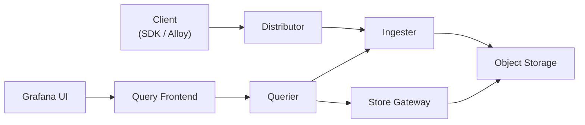
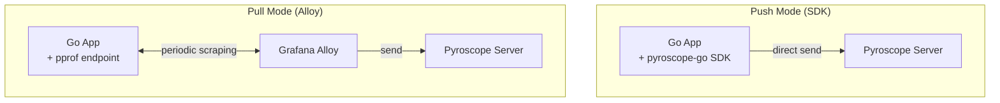

# 1. Introduction

When doing performance analysis in Go, we mainly use `net/http/pprof` or `runtime/pprof`. These are sufficient for checking the CPU usage or memory allocation at a specific point in time as a snapshot in a development environment, but in a production environment they have a few limitations.

- You have to collect profiles **manually at the moment** a problem occurs
- The collected profiles remain only as **local files**, making comparison over time difficult
- You cannot **centrally manage** profile data distributed across multiple instances

**Continuous Profiling** solves these limitations. It collects profile data with consistently low overhead in production, stores it in a central repository, and lets you query historical data anytime.

In this post, we'll get hands-on with how to integrate **Grafana Pyroscope**, a Continuous Profiling platform, into a Go application. We'll cover both collection methods — **Push mode (SDK)** and **Pull mode (Alloy)** — and walk through analyzing performance bottlenecks with flame graphs.

> The full code used in this post can be found on [GitHub](https://github.com/kenshin579/tutorials-go/tree/master/golang/profiling/pyroscope).

# 2. Continuous Profiling Overview

## 2.1 Traditional Profiling vs Continuous Profiling

| Category | Traditional Profiling | Continuous Profiling |
|------|-------------------|---------------------|
| Collection time | manual execution during development/debugging | always-on automatic collection in production |
| Overhead | high (used only in development environments) | low (~2-5% CPU) |
| Data range | snapshot at a specific point in time | continuous data over time |
| Analysis approach | post-hoc analysis (reactive) | proactive analysis |
| Storage | local files | centralized DB (long-term retention) |

Traditional profiling collects data manually after a problem occurs, whereas Continuous Profiling always collects data, so you can immediately check the profile at the moment a problem occurs.

## 2.2 Profile Types (Go)

The main profile types you can collect in Go are as follows.

| Profile Type | Description | How to Enable |
|--------------|------|------------|
| CPU | CPU time used per function | enabled by default |
| Alloc (Objects/Space) | number/size of memory allocations | enabled by default |
| Inuse (Objects/Space) | currently used memory | enabled by default |
| Goroutine | number of active goroutines and stacks | optionally enabled |
| Mutex (Count/Duration) | mutex contention count/time | `runtime.SetMutexProfileFraction()` |
| Block (Count/Duration) | blocking wait count/time | `runtime.SetBlockProfileRate()` |

> The Mutex and Block profiles are disabled by default, so you have to enable them explicitly. In Push mode, set them before SDK initialization; in Pull mode, set them at application startup.

# 3. Grafana Pyroscope Architecture

## 3.1 Core Components

Pyroscope consists of the following microservice components, and runs as a single process in Monolithic mode.



| Component | Role |
|----------|------|
| **Distributor** | receives and routes profile data from clients |
| **Ingester** | temporarily stores in memory, then writes to Object Storage |
| **Querier** | queries and merges profile data |
| **Query Frontend** | query caching and optimization |
| **Store Gateway** | accesses long-term storage (Object Storage) |

## 3.2 Data Collection Methods: Push vs Pull

Pyroscope can collect profile data in two ways. **Once the data reaches the Pyroscope server, the storage, querying, and flame graph analysis are completely identical regardless of which collection method you use.** The only difference is the collection path.



| Criteria | Push (SDK) | Pull (Alloy) |
|------|-----------|--------------|
| **Code change** | requires adding the SDK | none (just expose `pprof`) |
| **Infrastructure** | none added | requires installing Alloy |
| **Profiling Labels** | fine-grained label tagging possible with `TagWrapper` | only the default pprof labels |
| **Leveraging existing pprof** | requires separate coexistence setup | used as-is |
| **K8s environment** | SDK setup per Pod | bulk collection with an Alloy DaemonSet |
| **Recommended for** | new projects, when fine-grained analysis is needed | existing services, when code changes are difficult |

> **Practical tip**: In a Kubernetes environment, if you already have many services that expose pprof, Pull mode is efficient. On the other hand, if you need fine-grained analysis like per-endpoint profiling, Push mode's `TagWrapper` is advantageous.

# 4. Setting Up a Local Environment

With Docker Compose, you can run the Pyroscope server, Grafana, and the Push/Pull mode sample applications all at once.

## 4.1 Docker Compose Configuration

```yaml
services:
  # --- common infrastructure ---
  pyroscope:
    image: grafana/pyroscope:latest
    ports:
      - "4040:4040"
    networks:
      - pyroscope-net

  grafana:
    image: grafana/grafana:latest
    ports:
      - "3000:3000"
    environment:
      - GF_AUTH_ANONYMOUS_ENABLED=true
      - GF_AUTH_ANONYMOUS_ORG_ROLE=Admin
    volumes:
      - ./grafana/provisioning:/etc/grafana/provisioning
    depends_on:
      - pyroscope
    networks:
      - pyroscope-net

  # --- Push mode ---
  app-http:
    build:
      context: .
      dockerfile: http-server/Dockerfile
    ports:
      - "8080:8080"
    depends_on:
      - pyroscope
    environment:
      - PYROSCOPE_SERVER=http://pyroscope:4040
      - PORT=8080
    networks:
      - pyroscope-net

  # --- Pull mode ---
  app-pull:
    build:
      context: .
      dockerfile: pull-server/Dockerfile
    ports:
      - "6060:6060"
    environment:
      - PORT=6060
    networks:
      - pyroscope-net

  alloy:
    image: grafana/alloy:latest
    volumes:
      - ./alloy/config.alloy:/etc/alloy/config.alloy
    command: ["run", "/etc/alloy/config.alloy"]
    depends_on:
      - pyroscope
      - app-pull
    networks:
      - pyroscope-net

networks:
  pyroscope-net:
    driver: bridge
```

```bash
> docker compose up -d
```

## 4.2 Connecting the Grafana Data Source

You can automatically register the Pyroscope data source with Grafana provisioning settings.

```yaml
# grafana/provisioning/datasources/pyroscope.yml
apiVersion: 1

datasources:
  - name: Pyroscope
    type: grafana-pyroscope-datasource
    url: http://pyroscope:4040
    isDefault: true
    editable: true
```

## 4.3 Access URLs

| Service | URL | Description |
|--------|-----|------|
| Pyroscope | http://localhost:4040 | Pyroscope UI |
| Grafana | http://localhost:3000 | Grafana dashboard (anonymous access) |
| App (Push) | http://localhost:8080 | Echo HTTP server (Push mode) |
| App (Pull) | http://localhost:6060 | pprof server (Pull mode) |

In Grafana, select the **Explore** menu → Pyroscope data source, and you can check the collected profile data as a flame graph. The Push mode app is shown as `echo.server`, and the Pull mode app as `pull.golang.app`.

# 5. Data Collection

## 5.1 Push Mode: SDK Integration

Push mode is a method where you add the **Pyroscope Go SDK** to the application and send profile data directly to the Pyroscope server.

### 5.1.1 Installing and Basic Setup of the SDK

```bash
> go get github.com/grafana/pyroscope-go
```

When you initialize the profiler with `pyroscope.Start()`, it continuously sends data of the configured profile types to the Pyroscope server while the application is running.

```go
package main

import (
	"log"
	"os"
	"runtime"

	"github.com/grafana/pyroscope-go"
)

func main() {
	// mutex/blocking profiles are disabled by default, so enable them explicitly
	runtime.SetMutexProfileFraction(5)
	runtime.SetBlockProfileRate(5)

	profiler, err := pyroscope.Start(pyroscope.Config{
		ApplicationName: "simple.golang.app",       // the name shown in the Pyroscope UI
		ServerAddress:   "http://localhost:4040",    // the Pyroscope server address
		Logger:          pyroscope.StandardLogger,
		Tags:            map[string]string{"hostname": os.Getenv("HOSTNAME")},
		ProfileTypes: []pyroscope.ProfileType{
			pyroscope.ProfileCPU,           // CPU profile
			pyroscope.ProfileAllocObjects,  // memory allocation count
			pyroscope.ProfileAllocSpace,    // memory allocation size
			pyroscope.ProfileInuseObjects,  // number of objects currently in use
			pyroscope.ProfileInuseSpace,    // size of memory currently in use
			pyroscope.ProfileGoroutines,    // goroutines
			pyroscope.ProfileMutexCount,    // mutex contention count
			pyroscope.ProfileMutexDuration, // mutex contention time
			pyroscope.ProfileBlockCount,    // blocking count
			pyroscope.ProfileBlockDuration, // blocking time
		},
	})
	if err != nil {
		log.Fatalf("failed to start pyroscope: %v", err)
	}
	defer profiler.Stop() // send the last profile data on shutdown
}
```

### 5.1.2 Key Configuration Items

| Field | Description | Default |
|------|------|--------|
| `ApplicationName` | the application name shown in the Pyroscope UI | (required) |
| `ServerAddress` | the Pyroscope server URL | (required) |
| `Tags` | metadata tags to add to the profile data | `nil` |
| `ProfileTypes` | the list of profile types to collect | CPU + Alloc + Inuse |
| `Logger` | the logging interface | `nil` |
| `DisableGCRuns` | disable GC runs (reduces CPU overhead) | `false` |

### 5.1.3 Profiling Labels (TagWrapper)

> **Note**: Profiling Labels can be used **only in Push mode**. In Pull mode, only the default stack traces provided by pprof are collected, so custom label tagging is impossible. This is the biggest functional difference between Push/Pull mode.

Using Pyroscope's `TagWrapper`, you can tag a specific code path with a label. Tagged profile data can be filtered by label in the flame graph, so you can answer questions like "which endpoint uses a lot of CPU?"

```go
pyroscope.TagWrapper(ctx,
	pyroscope.Labels("workload", "cpu"),
	func(c context.Context) {
		cpuWork() // tag the profile data of this block with the workload=cpu label
	})
```

### 5.1.4 Per-Endpoint Profiling

In an Echo HTTP server, if you wrap each handler with `TagWrapper`, you can analyze the performance of each endpoint individually.

```go
func handleSlow(c echo.Context) error {
	start := time.Now()

	pyroscope.TagWrapper(c.Request().Context(),
		pyroscope.Labels("endpoint", "/slow"),
		func(ctx context.Context) {
			fibonacci(38) // CPU-intensive computation
		})

	return c.JSON(http.StatusOK, response{
		Message: "slow response (CPU intensive)",
		Elapsed: time.Since(start).String(),
	})
}

func handleMemory(c echo.Context) error {
	start := time.Now()

	pyroscope.TagWrapper(c.Request().Context(),
		pyroscope.Labels("endpoint", "/memory"),
		func(ctx context.Context) {
			allocateMemory() // large memory allocation
		})

	return c.JSON(http.StatusOK, response{
		Message: "memory response (heap allocation)",
		Elapsed: time.Since(start).String(),
	})
}
```

When you query the Pyroscope data source in Grafana, you can filter the profiles of the `/slow` and `/memory` requests respectively by the `endpoint` label.

Below is the CPU profile flame graph of Push mode (echo.server). You can see at a glance that `main.fibonacci` takes up most of the CPU time.


In the memory profile, you can check the memory allocation pattern of `main.allocateMemory`.


## 5.2 Pull Mode: Alloy Integration

Pull mode is a method where, without changing the application code, **Grafana Alloy** periodically scrapes the existing `net/http/pprof` endpoint. It's the same concept as Prometheus's Pull method.

### 5.2.1 Application-Side Setup

In Pull mode, the application only needs to expose the pprof endpoint. There's no need to add the Pyroscope SDK.

```go
import (
	"net/http"
	_ "net/http/pprof" // automatically registers the /debug/pprof/* endpoints
)

func main() {
	http.ListenAndServe(":6060", nil)
}
```

### 5.2.2 Grafana Alloy Configuration

Alloy is a telemetry collector made by Grafana, and it handles Pyroscope's Pull mode collection. Define the scrape targets in the `config.alloy` file.

```hcl
// config.alloy
pyroscope.scrape "default" {
  targets = [
    {"__address__" = "app-pull:6060", "service_name" = "pull.golang.app"},
  ]

  scrape_interval = "15s"  // scrape every 15 seconds

  profiling_config {
    profile.process_cpu { enabled = true }           // CPU profile
    profile.memory {                                  // memory profile
      enabled = true
      path    = "/debug/pprof/allocs"
    }
    profile.goroutine { enabled = true }              // goroutine profile
    profile.mutex { enabled = true }                  // mutex profile
    profile.block { enabled = true }                  // blocking profile
  }

  forward_to = [pyroscope.write.endpoint.receiver]    // target to send the collected data
}

pyroscope.write "endpoint" {
  endpoint {
    url = "http://pyroscope:4040"                     // the Pyroscope server address
  }
}
```

Since Alloy scrapes the pprof endpoint every 15 seconds, if you generate load and wait a moment, you can query the profile data as the `pull.golang.app` application in Grafana.

Below is the CPU profile of Pull mode (pull.golang.app). Just like Push mode, `main.fibonacci` is shown as the CPU bottleneck, but `TagWrapper`-based label filtering cannot be used.


## 5.3 Load Testing

Both Push/Pull modes can generate load with the same endpoints.

```bash
# --- Push mode (http://localhost:8080) ---
> curl http://localhost:8080/fast       # fast response (baseline)
> curl http://localhost:8080/slow       # CPU load
> curl http://localhost:8080/memory     # memory load

# --- Pull mode (http://localhost:6060) ---
> curl http://localhost:6060/fast       # fast response
> curl http://localhost:6060/slow       # CPU load
> curl http://localhost:6060/memory     # memory load

# Directly check the Pull mode pprof endpoint
> curl http://localhost:6060/debug/pprof/
```

# 6. Grafana Profiles Drilldown

**Regardless of which collection method you use**, the profile data stored on the Pyroscope server can be analyzed the same way. After generating load, you can check the collected profile data in Grafana's **Drilldown > Profiles** menu. Profiles Drilldown lets you progressively narrow the analysis scope in the order of service list → profile type → flame graph → labels.

## 6.1 All Services (Service List)

The first screen shows the profile data of all services registered in Pyroscope in a grid view.


| Service Name | Description | Collection Method |
|----------|------|-----------|
| **echo.server** | Echo HTTP server (per-endpoint profiling) | Push (SDK) |
| **pull.golang.app** | a server exposing pprof endpoints | Pull (Alloy) |
| **pyroscope** | the profile of the Pyroscope server itself | Push (self-collection) |
| **simple.golang.app** | basic SDK integration example | Push (SDK) |

In the **Profile type** dropdown at the top, you can switch profile types such as `process_cpu/cpu` and `memory`, and you can also filter by searching for a service name.

## 6.2 Profile Types (Status by Profile Type)

When you select a service, you can see at a glance all the profile types being collected from that service. Below is the Profile Types screen of `echo.server`.


Time-series graphs of each profile type — CPU, memory, goroutine, mutex, block, etc. — are displayed, so you can quickly grasp which resource has an anomaly. Clicking the **Flame graph** link on each card takes you to the detailed flame graph of that profile type.

## 6.3 Flame Graph (Detailed Analysis)

When you select a specific profile type, a flame graph is displayed along with a symbol table. In the symbol table, you can sort the Self time and Total time of each function to quickly identify the performance bottleneck function.


A flame graph is a graph that visualizes profiling data based on stack traces.

- **Horizontal axis**: the proportion of total time taken by that function (the wider, the more resources used)
- **Vertical axis**: the function call hierarchy (calls get deeper from top to bottom)
- **Root node**: 100% of the total application time

```
[              root (100%)                ]
[     funcA (60%)      ][   funcB (40%)   ]
[  funcC (30%) ][ funcD (30%) ]
```

The points to note when analyzing a flame graph are as follows.

- **Wide block** = a performance bottleneck candidate (much time is spent in that function)
- **Deep stack** = the call chain is deep (it doesn't necessarily mean a problem)
- **Self time vs Total time**: its own execution time vs the total time including subordinate functions

The main analysis features are as follows.

- **Time range selection**: analyze only the profile of a specific time interval
- **Function click**: filter centered on that function for detailed inspection
- **Labels filtering**: analyze only a specific code path with `endpoint=/slow`, etc. (when label tagging was done in Push mode)

## 6.4 Labels (Classification by Label)

In the **Labels** tab, you can view profile data grouped by label. You can separate and compare time series by labels tagged with `TagWrapper` in Push mode (e.g. `hostname`, `pyroscope_spy`).


## 6.5 Diff Flame Graph (Comparative Analysis)

In the **Diff flame graph** tab, you can compare the profiles of two time intervals side by side. When you select the Baseline and Comparison intervals respectively, it visualizes the performance difference before and after the change with colors (red=increase, green=decrease).


# 7. Practical Tips

## 7.1 Precautions When Applying in Production

- **Overhead management**: The CPU overhead of the Pyroscope SDK is about 2-5%. You can reduce GC-related overhead with the `DisableGCRuns: true` option
- **Choosing profile types**: Enabling all profiles increases overhead, so it's recommended to enable only CPU and memory profiles by default and add Mutex/Block when needed
- **`SetMutexProfileFraction` and `SetBlockProfileRate` values**: The smaller the value, the more events are recorded. In production, control overhead with a value of `5` or higher

## 7.2 Coexistence with Existing pprof Code

The Pyroscope Go SDK internally uses `runtime/pprof`. If you're already using `net/http/pprof`, you can use it together with the Pyroscope SDK.

```go
import _ "net/http/pprof" // keep the existing pprof HTTP endpoints

// Add the Pyroscope SDK - also send the same profile data to the Pyroscope server
profiler, _ := pyroscope.Start(pyroscope.Config{...})
defer profiler.Stop()
```

A hybrid configuration is possible where you keep the existing pprof endpoints for ad-hoc debugging while collecting always-on profiling data with Pyroscope.

## 7.3 Push/Pull Mode Migration

You can add Push mode to a service already operating in Pull mode, or vice versa.

- **Pull → Push transition**: Add the SDK and remove that target from the Alloy configuration. Transition when you need fine-grained label tagging with `TagWrapper`.
- **Push + Pull coexistence**: You can expose pprof endpoints while pushing with the SDK. However, if Alloy scrapes the same service, the **data will be duplicated**, so it's recommended to enable only one collection method.

# 8. Conclusion

In this post, we covered Continuous Profiling for Go applications using Grafana Pyroscope.

- **Continuous Profiling** collects profiles continuously in production, solving the "manual collection after a problem occurs" limitation of traditional pprof
- **Push mode (SDK)** can be integrated with a single line, `pyroscope.Start()`, and enables fine-grained per-endpoint analysis with `TagWrapper`
- **Pull mode (Alloy)** leverages existing pprof endpoints without code changes, which is especially advantageous for bulk-collecting multiple services as a DaemonSet in a K8s environment
- Through **flame graphs**, you can quickly grasp performance bottlenecks visually, and check the performance difference before and after a change with the comparison/Diff view

The full code can be found on [GitHub](https://github.com/kenshin579/tutorials-go/tree/master/golang/profiling/pyroscope).

# 9. References

- [Grafana Pyroscope official documentation](https://grafana.com/docs/pyroscope/latest/)
- [Pyroscope Go SDK (Push mode)](https://grafana.com/docs/pyroscope/latest/configure-client/language-sdks/go_push/)
- [Grafana Alloy (Pull mode)](https://grafana.com/docs/pyroscope/latest/configure-client/grafana-alloy/)
- [Pyroscope GitHub repository](https://github.com/grafana/pyroscope)
- [pyroscope-go Go client](https://github.com/grafana/pyroscope-go)
- [What is Continuous Profiling?](https://grafana.com/docs/pyroscope/latest/introduction/continuous-profiling/)
- [Flame Graph guide](https://grafana.com/docs/pyroscope/latest/introduction/flamegraphs/)
