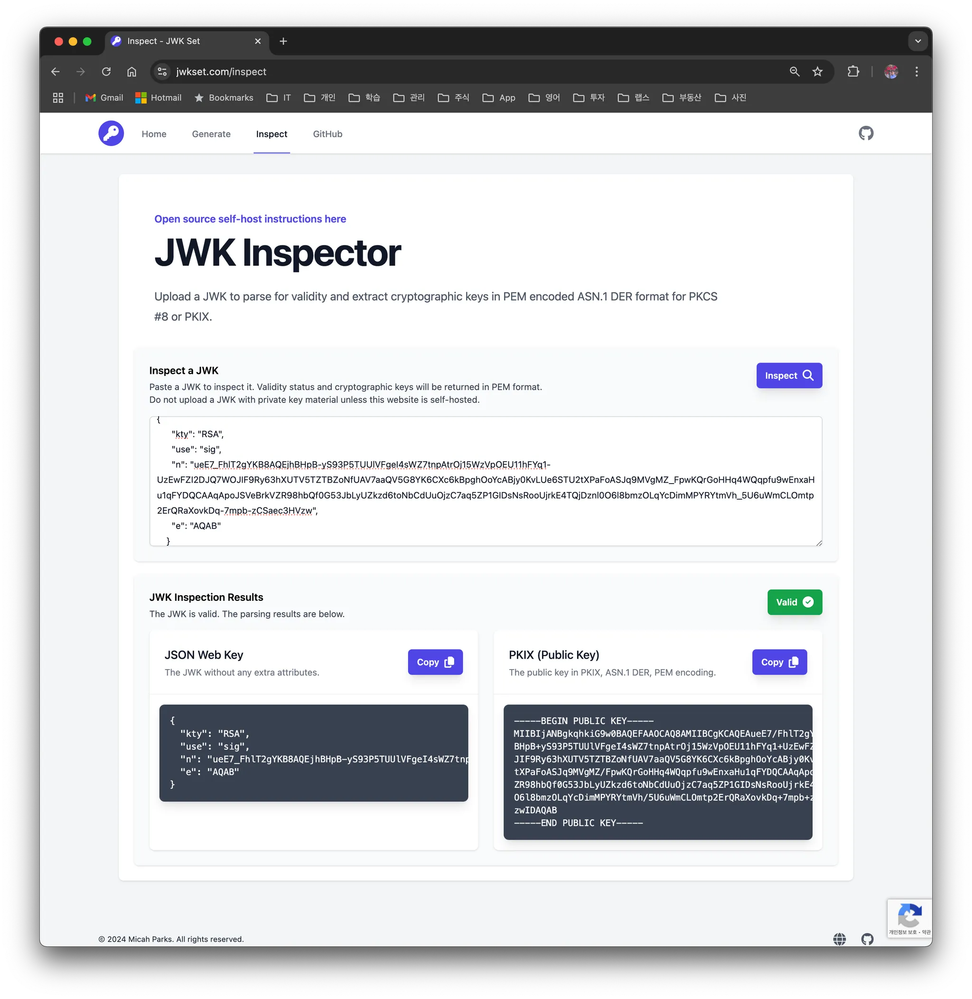

# 1. Overview

`JWT` (JSON Web Token) is used to securely perform authentication and information exchange in web applications. A `JWT` contains information by itself and generally includes user identification and authorization information. A `JWT` is usually used for user authentication and user information, and it's a tool that can be used for secure authentication in web applications.

The core of `JWT` is guaranteeing the integrity of the token through a signature. JWT signatures can use symmetric encryption (`HMAC`) and asymmetric encryption (`RSA`, `EC`) methods.

- Symmetric encryption (`HMAC`, e.g. `HS256`): uses the same secret key to perform signing and verification
- Asymmetric encryption (`RSA`, `EC`, e.g. RS256, ES256): signs with a private key and verifies with a public key

When using asymmetric encryption, a `JWK` endpoint is sometimes provided to share the public key so that the client can verify the `JWT`'s signature. What's used here is `JWKS` (JSON Web Key Set).

`JWKS` is a standard specification that provides public keys in `JSON` format, and through it, a client can verify the `JWT`'s signature. In this post, we'll look at the concept, structure, implementation method, and practical use cases of `JWKS`.

# 2. Let's Learn About `JWKS`

## 2.1 `JWK` vs `JWKS`

- `JWK` (JSON Web Key)
  - It's a single key (the public key of an asymmetric key pair, or a symmetric key) represented in JSON format
  - A JWK includes metadata such as the key's identifier, key type, and algorithm

- `JWKS` (JSON Web Key Set)
  - JWKS is a set of keys containing multiple JWKs
  - It's usually provided at an endpoint exposed over HTTPS, and the client verifies the JWT through it.

## 2.2 `JWKS` Structure

> Example. JWKS response structure

```json
{
  "keys": [
    {
      "kty": "EC",
      "crv": "P-256",
      "x": "MKBCTNIcKUSDii11ySs3526iDZ8AiTo7Tu6KPAqv7D4",
      "y": "4Etl6SRW2YiLUrN5vfvVHuhp7x8PxltmWWlbbM4IFyM",
      "use": "enc",
      "kid": "1"
    },
    {
      "kty": "RSA",
      "n": "0vx7agoebGcQSuuPiLJXZptN9nndrQmbXEps2aiAFbWhM78LhWx4cbbfAAtVT86zwu1RK7aPFFxuhDR1L6tSoc_BJECPebWKRXjBZCiFV4n3oknjhMstn64tZ_2W-5JsGY4Hc5n9yBXArwl93lqt7_RN5w6Cf0h4QyQ5v-65YGjQR0_FDW2QvzqY368QQMicAtaSqzs8KJZgnYb9c7d0zgdAZHzu6qMQvRL5hajrn1n91CbOpbISD08qNLyrdkt-bFTWhAI4vMQFh6WeZu0fM4lFd2NcRwr3XPksINHaQ-G_xBniIqbw0Ls1jF44-csFCur-kEgU8awapJzKnqDKgw",
      "e": "AQAB",
      "alg": "RS256",
      "kid": "2011-04-29"
    }
  ]
}
```

`JWKS` represents a set of `JWK`s in the form of a `JSON` array. Each `JWK` object can have the following fields.

- `kty` (key type)
  - This parameter is used to identify the cryptographic algorithm. It has values like `RSA`, `EC`
  - `REQUIRED`
- `use` (public key use)
  - This parameter identifies the intended use of the public key. It has values like `sig` (signature), `enc` (encryption)
  - `OPTIONAL`
- `alg` (algorithm)
  - This parameter is used to identify the algorithm information used with the key
  - `OPTIONAL`
- `kid` (key id)
  - The JWK objects contained in a JWKS object must have different `kid` values so they can distinguish themselves
  - `OPTIONAL`
- Additional properties
  - The additional property values needed differ depending on `kty` and `alg`
  - For an RSA key type, `n` (public key modulus) and `e` (exponent) are additionally needed, and they are Base64URL-encoded values
  - For an EC key type, `crv` (curve type), `x`, `y` (coordinates)
  - `OPTIONAL`

## 2.3 JWKS Endpoint

`JWKS` is usually provided over `HTTPS`, and the client uses it to verify the `JWT`. Generally, the `URL` format is as follows.

> JWKS API address format
>
> ```
> https://<server_domain>/.well-known/jwks.json
> ```

### 2.3.1 How to Generate RSA Public and Private Keys

Here we use RSA for asymmetric encryption. We use the `openssl` command to generate the public key and private key.

```bash
> openssl genpkey -algorithm RSA -out private.key -pkeyopt rsa_keygen_bits:2048
```

- **File name**: `private.key`
- **Key size**: 2048 bits (can be increased to 4096 bits depending on security requirements)

The private key has been generated, and we extract the public key from the private key with the following command.

```bash
> openssl rsa -pubout -in private.key -out public.key
```

- **File name**: `public.key`
- Extracts the public key from the private key and saves it to a file

### 2.3.2 Generating JWKS

Generating JWKS can be easily implemented using the [JWKSet (MicahParks)](https://github.com/MicahParks/jwkset) library. We didn't actually implement it as an API endpoint, but wrote it as a simple example in unit test form.

```bash
func (suite *jwksTestSuite) generateJWKS() (jwkset.JWKSMarshal, error) {
	pubKey, err := parsePublicKey(suite.publicKey)
	if err != nil {
		return jwkset.JWKSMarshal{}, err
	}

	jwk, err := jwkset.NewJWKFromKey(pubKey, jwkset.JWKOptions{
		Marshal: jwkset.JWKMarshalOptions{
			Private: false,
		},
		Metadata: jwkset.JWKMetadataOptions{
			USE: jwkset.UseSig,
		},
	})
	if err != nil {
		return jwkset.JWKSMarshal{}, err
	}

	if err := suite.jwkCache.KeyWrite(suite.ctx, jwk); err != nil {
		return jwkset.JWKSMarshal{}, err
	}

	jwkMarshal, err := suite.jwkCache.Marshal(suite.ctx)
	if err != nil {
		return jwkset.JWKSMarshal{}, err
	}
	return jwkMarshal, nil
}
```

This is code that creates a `JWK` from the parsed public key using the `jwkset.NewJWKFromKey` function, stores the generated `JWKS` in an in-memory JWK cache, and `marshal`s it to return the data.

```json
{
  "keys": [
    {
      "kty": "RSA",
      "use": "sig",
      "n": "ueE7_FhlT2gYKB8AQEjhBHpB-yS93P5TUUlVFgeI4sWZ7tnpAtrOj15WzVpOEU11hFYq1-UzEwFZI2DJQ7WOJIF9Ry63hXUTV5TZTBZoNfUAV7aaQV5G8YK6CXc6kBpghOoYcABjy0KvLUe6STU2tXPaFoASJq9MVgMZ_FpwKQrGoHHq4WQqpfu9wEnxaHu1qFYDQCAAqApoJSVeBrkVZR98hbQf0G53JbLyUZkzd6toNbCdUuOjzC7aq5ZP1GIDsNsRooUjrkE4TQjDznl0O6l8bmzOLqYcDimMPYRYtmVh_5U6uWmCLOmtp2ErQRaXovkDq-7mpb-zCSaec3HVzw",
      "e": "AQAB"
    }
  ]
}
```

The generated `JWKS` data looks like the above.

### 2.3.3 Introducing [jwset.com](http://jwset.com)

This is also a site additionally created by the developer who built the `JWKSet` library. It's a site where you can directly generate and test `JWKS` on the web.

- JWK Generator
- JWK Inspector



# 3. FAQ

## 3.1 When and how are the public key and private key each used?

- Signature
  - To generate a signature, use the private key
  - To verify a signature, use the public key
  - e.g. a `JWT` can also be encrypted with the private key and verified with the public key
- Encryption
  - When sending data, encrypt with the public key
  - When decrypting data, use the private key

# 4. Conclusion

`JWS` and `JWKS` are essential components in an authentication system using `JWT`. In particular, through `JWKS`, you can efficiently handle key management and signature verification. I hope this post helps you understand and implement `JWS` and `JWKS`.

# 5. References
- [Understanding JWKS: JSON Web Key Set Explained](https://stytch.com/blog/understanding-jwks/)
