WebRTC(Web Real-Time Communication)는 브라우저와 모바일 앱에서 **플러그인 없이** 실시간 음성, 영상, 데이터 통신을 가능하게 하는 기술이다. Google Meet, Discord, Facebook Messenger 등 우리가 매일 사용하는 서비스 뒤에는 WebRTC가 있다.

이 글에서는 WebRTC의 개념부터 프로토콜 스택, 핵심 프로토콜, 연결 흐름, 네트워크 토폴로지까지 **기초 이론을 한 편으로** 정리한다.

# 1. WebRTC란 무엇인가

## 1.1 API이자 프로토콜

WebRTC는 **API이자 프로토콜**이다. 이 두 가지를 구분하는 것이 중요하다.

- **WebRTC 프로토콜**: 두 에이전트(Agent) 간 실시간 양방향 보안 통신을 위한 규칙의 집합이다. IETF의 `rtcweb` 작업 그룹에서 관리한다.
- **WebRTC API**: 개발자가 WebRTC 프로토콜을 사용할 수 있게 해주는 JavaScript API이다. W3C에서 관리한다.

HTTP와 Fetch API의 관계를 생각하면 이해하기 쉽다. HTTP가 프로토콜이고 Fetch API가 이를 사용하는 JavaScript API인 것처럼, WebRTC도 동일한 구조이다.

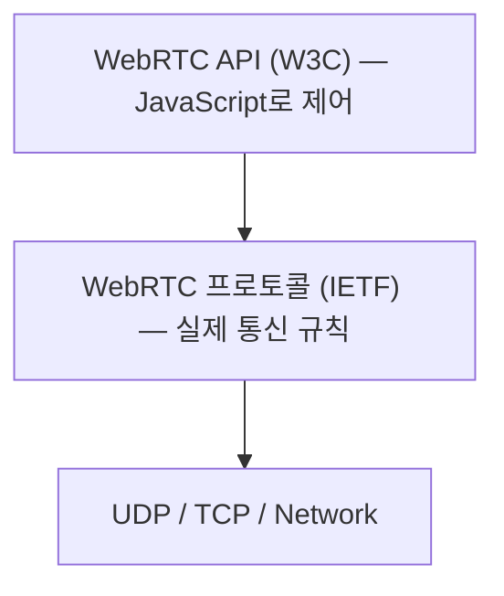

WebRTC 프로토콜은 JavaScript 외에도 다양한 언어로 구현되어 있다. 대표적으로 Go 언어의 [Pion](https://github.com/pion/webrtc), C/C++의 [libwebrtc](https://webrtc.googlesource.com/src/), Rust의 [webrtc-rs](https://github.com/webrtc-rs/webrtc) 등이 있다. 어떤 구현체를 사용하든 프로토콜이 동일하기 때문에 **상호운용성이 보장**된다.

## 1.2 왜 WebRTC를 사용하는가

### 1.2.1 기존 통신 기술의 한계

실시간 통신을 구현할 때 흔히 떠올리는 HTTP와 WebSocket은 실시간 미디어 전송에 근본적인 한계가 있다.

| 항목 | WebSocket | WebRTC |
|------|-----------|--------|
| 연결 방식 | 클라이언트 → 서버 (항상 서버 경유) | P2P 직접 연결 가능 |
| 지연 시간 | 서버 경유로 인한 추가 지연 | 직접 연결로 최소 지연 |
| 미디어 지원 | 직접 구현 필요 | 내장 (코덱, 혼잡 제어 등) |
| NAT 통과 | 별도 처리 없음 (서버 경유이므로) | ICE/STUN/TURN으로 자동 처리 |
| 암호화 | 선택 (wss://) | 필수 (DTLS/SRTP) |
| 프로토콜 | TCP 기반 | UDP 기반 (실시간에 유리) |

WebSocket은 채팅, 알림 같은 텍스트 기반 실시간 통신에는 충분하다. 하지만 영상/음성 같은 미디어 스트리밍에서는 TCP의 재전송 메커니즘이 오히려 지연을 증가시키는 문제가 있다.

### 1.2.2 WebRTC의 장점

WebRTC는 이러한 한계를 해결하기 위해 설계되었다.

- **개방형 표준**: IETF와 W3C에 의해 관리되는 공개 표준. 특정 벤더에 종속되지 않는다
- **P2P 직접 연결**: 중앙 서버 없이 두 에이전트가 직접 통신. 지연 최소화, 서버 비용 절감
- **1초 미만의 초저지연**: UDP 기반 전송으로 수백 밀리초 수준의 지연 달성
- **의무적 암호화**: DTLS/SRTP로 모든 통신을 암호화. 선택이 아닌 필수
- **NAT 자동 통과**: ICE/STUN/TURN으로 NAT/방화벽 문제를 자동 해결
- **혼잡 제어**: 네트워크 상태에 따라 비트레이트와 해상도를 자동 조절
- **기존 기술 재활용**: SDP, ICE, STUN, TURN, RTP, SRTP, SCTP 등 이미 검증된 프로토콜 조합

## 1.3 WebRTC가 해결하는 핵심 문제

### 1.3.1 실시간성 (Latency)

일반적인 비디오 스트리밍 서비스(YouTube, Netflix 등)는 HLS나 DASH 프로토콜로 **3~30초의 지연**이 발생한다. WebRTC는 UDP 기반의 RTP 프로토콜로 미디어를 전송하여 1초 미만의 지연을 달성한다.

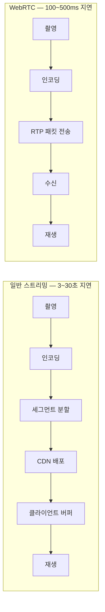

### 1.3.2 NAT / 방화벽 통과

인터넷에 연결된 대부분의 기기는 NAT(Network Address Translation) 뒤에 있다. NAT 뒤에 있는 기기는 외부에서 직접 접근할 수 없다.

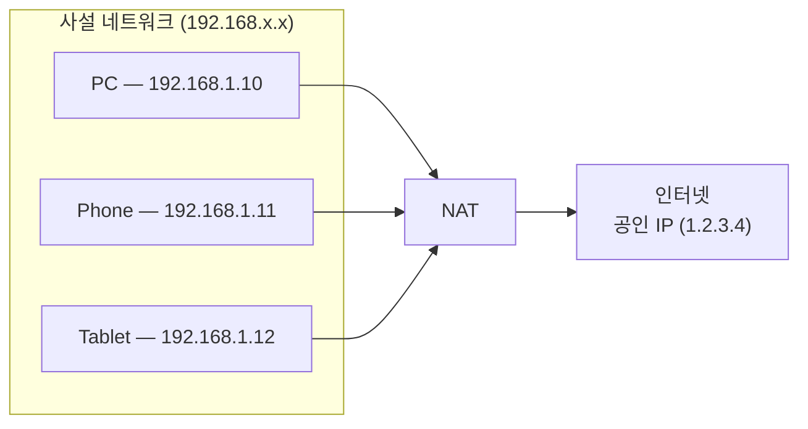

WebRTC는 이 문제를 ICE 프레임워크로 해결한다.

1. **STUN 서버**: 내 기기의 공인 IP와 포트를 알려준다
2. **TURN 서버**: 직접 연결이 불가능할 때 중계 서버 역할을 한다
3. **ICE**: STUN과 TURN을 조합하여 최적의 연결 경로를 찾는다

## 1.4 대표적인 사용 사례

- **화상회의**: Google Meet, Zoom, Microsoft Teams. 1:1은 P2P, 다자간은 SFU 활용
- **실시간 스트리밍**: HLS/DASH 대비 10배 이상 낮은 지연. 라이브 커머스, 실시간 경매에 적합
- **로봇 / 원격 제어**: DataChannel로 제어 명령 + Media Channel로 카메라 영상을 동시 전송
- **P2P 파일 전송**: DataChannel을 통해 서버를 거치지 않고 파일 직접 전송 (WebTorrent 등)
- **클라우드 게이밍**: 서버 렌더링 결과를 클라이언트에 실시간 전송 (NVIDIA GeForce NOW 등)

## 1.5 WebRTC를 사용하면 안 되는 경우

모든 실시간 통신에 WebRTC가 정답은 아니다.

| 상황 | 더 나은 대안 | 이유 |
|------|-------------|------|
| 채팅, 알림 | WebSocket | 텍스트 데이터에 P2P는 과하다 |
| 대규모 단방향 스트리밍 (1만+ 시청자) | HLS/DASH | CDN 활용이 효율적 |
| VOD(녹화 영상) | HLS/DASH | 실시간이 아닌 온디맨드 |
| 서버 간 통신 | gRPC, HTTP/2 | P2P/NAT 통과가 불필요 |

판단 기준은 간단하다: **"상대방의 반응이 1초 이내에 필요한가?"** Yes라면 WebRTC를, No라면 더 단순한 기술을 선택하자.

# 2. 전체 구조

## 2.1 프로토콜 스택

WebRTC는 단일 프로토콜이 아니라 **여러 프로토콜의 조합**이다.

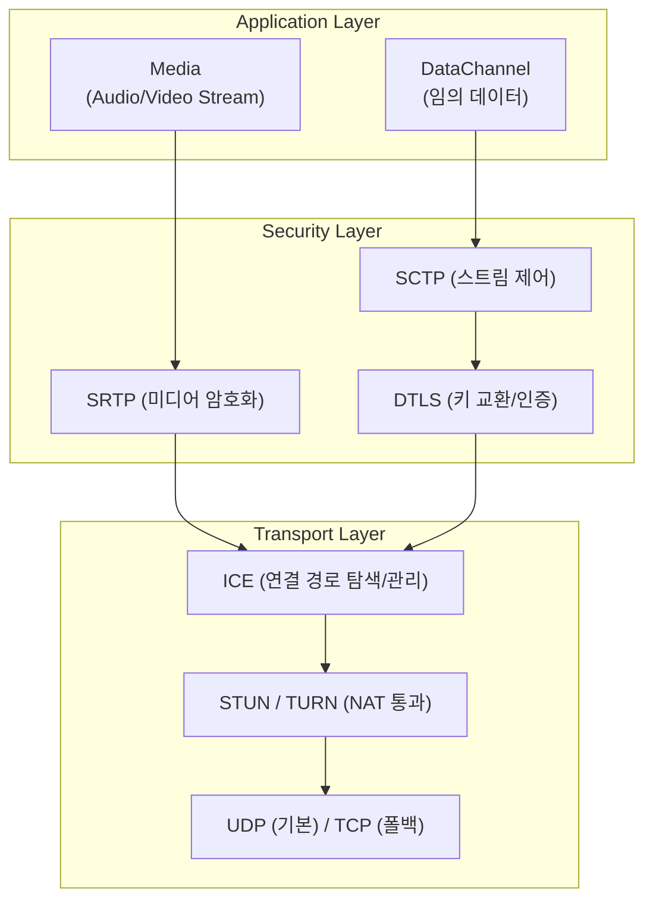

각 프로토콜의 역할을 한 줄로 요약하면 다음과 같다.

| 프로토콜 | 역할 | RFC |
|----------|------|-----|
| SDP | 세션 정보 교환 (코덱, IP, 포트 등) | RFC 8866 |
| ICE | 최적 연결 경로 탐색 | RFC 8445 |
| STUN | 공인 IP/포트 발견 | RFC 5389 |
| TURN | NAT 통과 불가 시 트래픽 중계 | RFC 5766 |
| DTLS | UDP 위 TLS (키 교환, 상호 인증) | RFC 6347 |
| SRTP | RTP 미디어 암호화 | RFC 3711 |
| RTP | 실시간 미디어 전송 | RFC 3550 |
| RTCP | RTP 전송 품질 피드백 | RFC 3550 |
| SCTP | 데이터 채널 스트림 관리 | RFC 4960 |
| DCEP | 데이터 채널 생성/협상 | RFC 8832 |

## 2.2 세 가지 구성 요소

WebRTC는 크게 **Media**, **Transport**, **Signaling** 세 가지 구성 요소로 나뉜다.

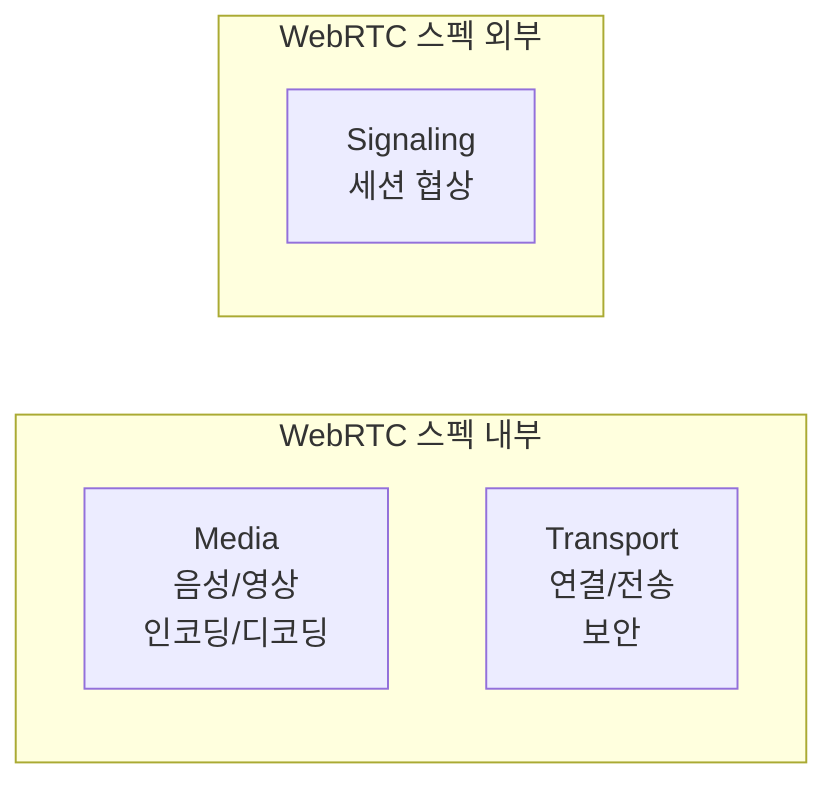

### 2.2.1 Media — 무엇을 보내는가

Media 구성 요소는 **음성과 영상 데이터의 캡처, 인코딩, 전송, 디코딩, 재생**을 담당한다.

**오디오 파이프라인:**

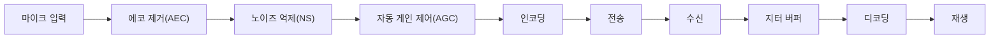

| 처리 단계 | 설명 |
|-----------|------|
| AEC (Acoustic Echo Cancellation) | 스피커 출력이 마이크로 다시 들어가는 에코 제거 |
| NS (Noise Suppression) | 배경 소음(키보드, 에어컨 등) 억제 |
| AGC (Automatic Gain Control) | 입력 볼륨을 일정 수준으로 자동 조절 |
| 지터 버퍼 (Jitter Buffer) | 패킷 도착 시간의 불규칙성을 보정 |

**주요 코덱:**

| 구분 | 코덱 | 특징 | 비고 |
|------|------|------|------|
| 오디오 | **Opus** | WebRTC 필수 코덱. 6~510 kbps 적응적 조절 | 음성+음악 모두 우수 |
| 오디오 | G.711 | 전화망 호환. 64 kbps 고정 | 대역폭 소모 큼 |
| 비디오 | **VP8** | WebRTC 필수 코덱. Google 개발 | 무료 (BSD) |
| 비디오 | VP9 | VP8 대비 30~50% 압축률 향상 | 무료 (BSD) |
| 비디오 | H.264 | 가장 널리 사용됨. 하드웨어 가속 풍부 | 특허 라이선스 |
| 비디오 | AV1 | 차세대 코덱. VP9 대비 30% 압축률 향상 | 무료 (AOM) |

**비디오 프레임 타입:**

I-Frame(키프레임)은 전체 이미지를 독립적으로 디코딩할 수 있고, P-Frame/B-Frame은 이전 프레임과의 차이만 전송하여 대역폭을 절약한다. **I-Frame이 손실되면 이후 프레임을 디코딩할 수 없기 때문에**, WebRTC는 PLI/FIR로 키프레임 재전송을 요청한다.

### 2.2.2 Transport — 어떻게 보내는가

Transport 구성 요소는 **네트워크 연결 수립, NAT 통과, 보안, 혼잡 제어**를 담당한다. ICE, DTLS, STUN, TURN 등의 프로토콜이 여기에 속한다. 각 프로토콜의 상세 동작은 [§3. 핵심 프로토콜](#3-핵심-프로토콜)에서 다룬다.

**혼잡 제어:** 네트워크 상태에 따라 전송량을 자동 조절한다.

| 신호 | 의미 | 대응 |
|------|------|------|
| 패킷 손실 증가 | 네트워크 혼잡 | 비트레이트 감소 |
| RTT 증가 | 경로 지연 증가 | 전송 속도 제한 |
| 지터 증가 | 패킷 도착 불규칙 | 지터 버퍼 크기 조정 |

대표적인 혼잡 제어 알고리즘으로 **GCC(Google Congestion Control)**가 있다. GCC는 손실 기반 컨트롤러와 지연 기반 컨트롤러를 결합하여 가용 대역폭을 실시간으로 추정한다.

### 2.2.3 Signaling — 누구와 어떻게 협상하는가

Signaling은 WebRTC의 세 가지 구성 요소 중 유일하게 **WebRTC 스펙에 포함되지 않는다**. 이것은 의도적인 설계로, 개발자가 기존 인프라를 자유롭게 활용할 수 있다.

**Signaling의 역할:** 두 피어가 WebRTC 연결을 수립하기 **전에** SDP와 ICE 후보를 교환하는 과정이다.

**전송 방식:**

| 방식 | 장점 | 적합한 경우 |
|------|------|------------|
| **WebSocket** | 양방향 실시간 전달 | 화상회의, 실시간 서비스 |
| **HTTP REST API** | 구현 간단, 인프라 활용 | 단순한 1:1 연결 |
| **MQTT** | IoT 환경에 최적화 | 로봇/IoT 시스템 |
| **Firebase/Firestore** | 서버리스, 빠른 프로토타이핑 | 프로토타입, MVP |

**Signaling 서버의 최소 요구사항:** Room 관리, Peer 등록, SDP 전달, ICE 후보 전달. 미디어를 처리하지 않고 텍스트 메시지를 중계하는 것이 전부이므로 부하가 매우 적다.

## 2.3 RTP / RTCP

### 2.3.1 RTP — 미디어 전송 프로토콜

RTP(Real-time Transport Protocol)는 미디어 패킷을 실제로 운반하는 프로토콜이다.

```
 0                   1                   2                   3
 0 1 2 3 4 5 6 7 8 9 0 1 2 3 4 5 6 7 8 9 0 1 2 3 4 5 6 7 8 9 0 1
+-+-+-+-+-+-+-+-+-+-+-+-+-+-+-+-+-+-+-+-+-+-+-+-+-+-+-+-+-+-+-+-+
|V=2|P|X|  CC   |M|     PT      |       Sequence Number         |
+-+-+-+-+-+-+-+-+-+-+-+-+-+-+-+-+-+-+-+-+-+-+-+-+-+-+-+-+-+-+-+-+
|                           Timestamp                           |
+-+-+-+-+-+-+-+-+-+-+-+-+-+-+-+-+-+-+-+-+-+-+-+-+-+-+-+-+-+-+-+-+
|                             SSRC                              |
+-+-+-+-+-+-+-+-+-+-+-+-+-+-+-+-+-+-+-+-+-+-+-+-+-+-+-+-+-+-+-+-+
|                           Payload                             |
+-+-+-+-+-+-+-+-+-+-+-+-+-+-+-+-+-+-+-+-+-+-+-+-+-+-+-+-+-+-+-+-+
```

| 필드 | 역할 |
|------|------|
| PT (Payload Type) | 코덱 식별 (예: VP8=96, Opus=111) |
| Sequence Number | 패킷 순서 번호. 손실/재정렬 판단에 사용 |
| Timestamp | 캡처 시각. 디코딩/재생 타이밍에 사용 |
| SSRC | 스트림 식별자. 하나의 연결에 여러 미디어 스트림 구분 |

### 2.3.2 RTCP — 전송 품질 피드백

RTCP(RTP Control Protocol)는 RTP와 함께 동작하며, "미디어가 잘 전달되고 있는가?"에 대한 **메타데이터를 교환**한다.

| 패킷 타입 | 이름 | 역할 |
|-----------|------|------|
| 200 | Sender Report (SR) | 송신자의 전송 통계 (보낸 패킷 수, 바이트 수) |
| 201 | Receiver Report (RR) | 수신자의 수신 통계 (손실률, 지터, RTT) |
| 192 | FIR | 키프레임(I-Frame) 재전송 요청 |
| 193 | NACK | 특정 패킷 재전송 요청 |
| 206 | PLI | 그림 손실 알림 (키프레임 요청) |
| 206 | REMB | 수신측이 허용하는 최대 비트레이트 알림 |

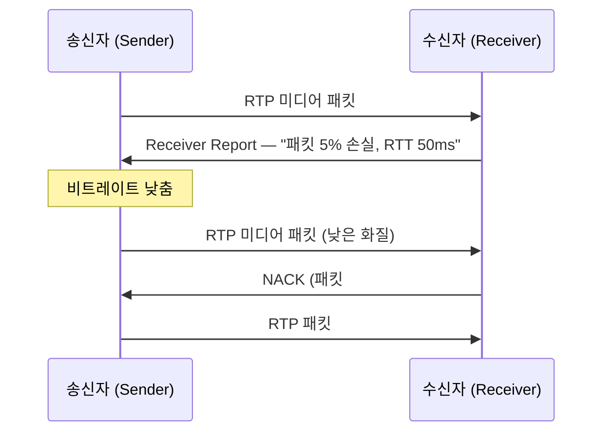

이 피드백 루프를 통해 WebRTC는 네트워크 상태에 **실시간으로 적응**한다.

## 2.4 DataChannel

DataChannel은 WebRTC에서 미디어 외에 **임의의 데이터를 전송**하는 채널이다. SCTP(Stream Control Transmission Protocol) 위에 구축되며, DTLS 위에서 동작하므로 암호화가 보장된다.

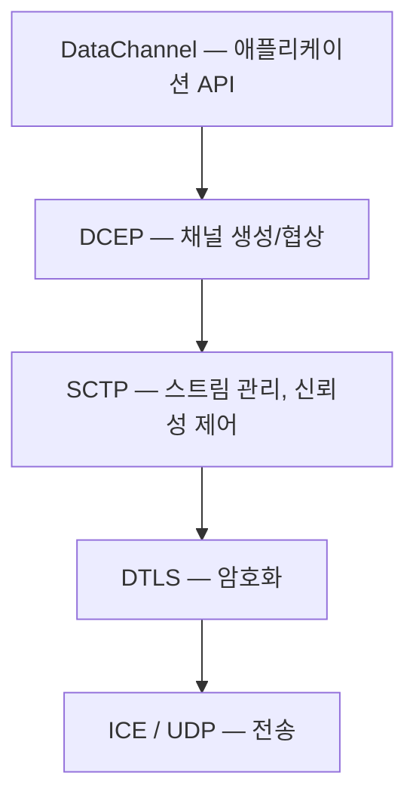

**전송 모드:** 채널마다 독립적으로 설정할 수 있으며, 하나의 WebRTC 연결에서 최대 65,534개의 채널을 열 수 있다.

| 모드 | 순서 보장 | 재전송 | 적합한 사용 사례 |
|------|----------|--------|-----------------|
| **Reliable + Ordered** | O | 무제한 | 채팅, 파일 전송 (TCP와 유사) |
| **Reliable + Unordered** | X | 무제한 | 독립적 이벤트 전송 |
| **Partial Reliable (count)** | 선택 | N회 제한 | 게임 상태 동기화 |
| **Partial Reliable (time)** | 선택 | T초 제한 | 센서 데이터 |
| **Unreliable + Unordered** | X | 없음 | 실시간 위치 데이터 (UDP와 유사) |

**DataChannel vs WebSocket:**

| 항목 | DataChannel | WebSocket |
|------|------------|-----------|
| 연결 방식 | P2P (직접 연결) | 클라이언트 → 서버 |
| 전송 프로토콜 | SCTP over DTLS over UDP | TCP |
| 지연 | 최소 (직접 전달) | 서버 경유 추가 지연 |
| 순서/신뢰성 | 채널별 독립 설정 가능 | 항상 순서 보장 + 신뢰성 |
| 서버 필요 | 시그널링 시에만 필요 | 항상 필요 |
| 암호화 | 필수 (DTLS) | 선택 (wss://) |

# 3. 핵심 프로토콜

## 3.1 SDP (Session Description Protocol)

SDP는 WebRTC 세션에 필요한 정보를 담는 **평문 텍스트 프로토콜**이다 (RFC 8866). "나는 이런 능력이 있고, 이런 방식으로 연결할 수 있다"는 정보를 교환하는 데 사용한다.

### 3.1.1 SDP 구조 — 세션/미디어 설명

SDP는 **키=값** 형태의 줄로 구성되며, 크게 **세션 설명**과 **미디어 설명** 두 부분으로 나뉜다.

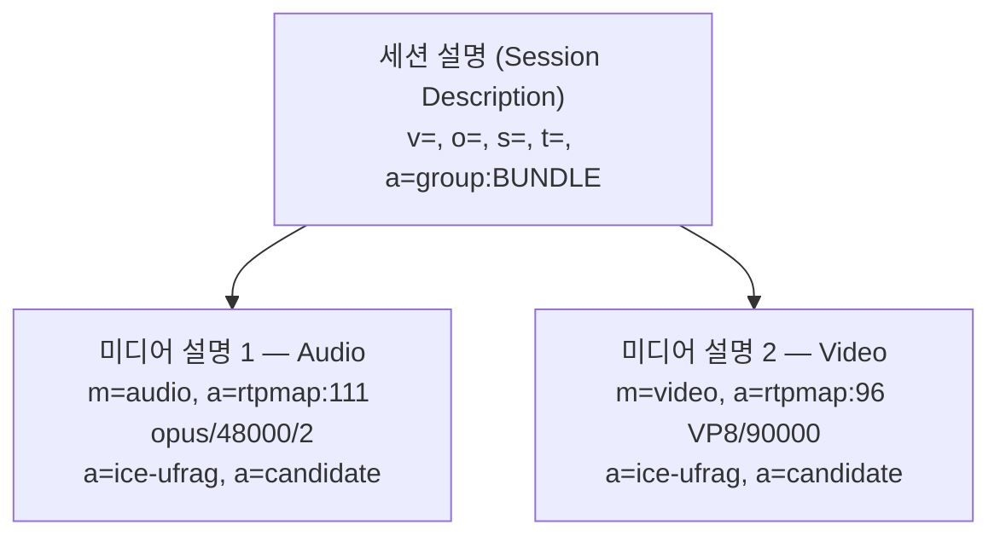

### 3.1.2 주요 SDP 키와 속성

**코덱 관련:**

```
a=rtpmap:111 opus/48000/2       ← PT 111 = Opus, 48kHz, 스테레오
a=fmtp:111 minptime=10;useinbandfec=1   ← 코덱 파라미터
a=rtcp-fb:96 nack               ← RTCP 피드백 메커니즘
```

**ICE 관련:**

```
a=ice-ufrag:EsAw                ← ICE 인증 정보
a=ice-pwd:P2uYro0UCOQ4zxjKXaWCBui1   ← ICE 패스워드
a=candidate:1 1 udp 2130706431 192.168.1.10 50000 typ host
│           │ │ │   │          │              │     │
│           │ │ │   │          │              │     └── 후보 유형
│           │ │ │   │          │              └── 포트
│           │ │ │   │          └── IP 주소
│           │ │ │   └── 우선순위 (높을수록 먼저 시도)
│           │ │ └── 프로토콜
│           │ └── 컴포넌트 ID (1=RTP, 2=RTCP)
│           └── foundation
└── ICE 후보
```

**보안 관련:**

```
a=fingerprint:sha-256 E1:AB:2C:...   ← DTLS 인증서 지문 (중간자 공격 방지)
a=setup:actpass                      ← DTLS 핸드셰이크 역할
```

**미디어 방향 및 식별:**

```
a=sendrecv           ← 양방향 송수신
a=sendonly           ← 송신만 (화면 공유 송출)
a=recvonly           ← 수신만 (시청자)
a=inactive           ← 비활성
a=mid:0              ← 미디어 설명 식별자
a=group:BUNDLE 0 1   ← 여러 미디어를 하나의 ICE/DTLS 연결로 묶음
```

### 3.1.3 실제 SDP 예시 (Offer)

```
v=0                                           # SDP 버전
o=- 4578012345 2 IN IP4 127.0.0.1            # 세션 ID
s=-                                           # 세션 이름 (미사용)
t=0 0                                         # 타이밍 (무제한)
a=group:BUNDLE 0 1                            # 오디오(0)+비디오(1) 하나의 연결

# ──── 오디오 미디어 설명 ────
m=audio 9 UDP/TLS/RTP/SAVPF 111 63 9 0 8     # 지원 코덱 PT: 111, 63, 9, 0, 8
c=IN IP4 0.0.0.0                              # ICE가 실제 주소 결정
a=mid:0                                       # 미디어 ID
a=sendrecv                                    # 양방향
a=rtpmap:111 opus/48000/2                     # Opus 코덱
a=fmtp:111 minptime=10;useinbandfec=1         # FEC 활성화
a=ice-ufrag:EsAw                              # ICE 인증 정보
a=ice-pwd:P2uYro0UCOQ4zxjKXaWCBui1
a=fingerprint:sha-256 E1:AB:2C:...            # DTLS 인증서 지문
a=setup:actpass                               # DTLS 역할
a=candidate:1 1 udp 2130706431 192.168.1.10 50000 typ host
a=candidate:2 1 udp 1694498815 203.0.113.5 60000 typ srflx raddr 192.168.1.10 rport 50000

# ──── 비디오 미디어 설명 ────
m=video 9 UDP/TLS/RTP/SAVPF 96 97
a=mid:1
a=sendrecv
a=rtpmap:96 VP8/90000
a=rtpmap:97 H264/90000
a=rtcp-fb:96 nack pli                         # PLI (키프레임 요청) 지원
a=ice-ufrag:EsAw                              # BUNDLE이므로 같은 ICE 인증
a=fingerprint:sha-256 E1:AB:2C:...
```

### 3.1.4 Offer/Answer 모델

WebRTC는 SDP를 **Offer/Answer 모델**로 교환한다. 한쪽이 Offer를 제안하고, 상대방이 Answer를 반환한다.

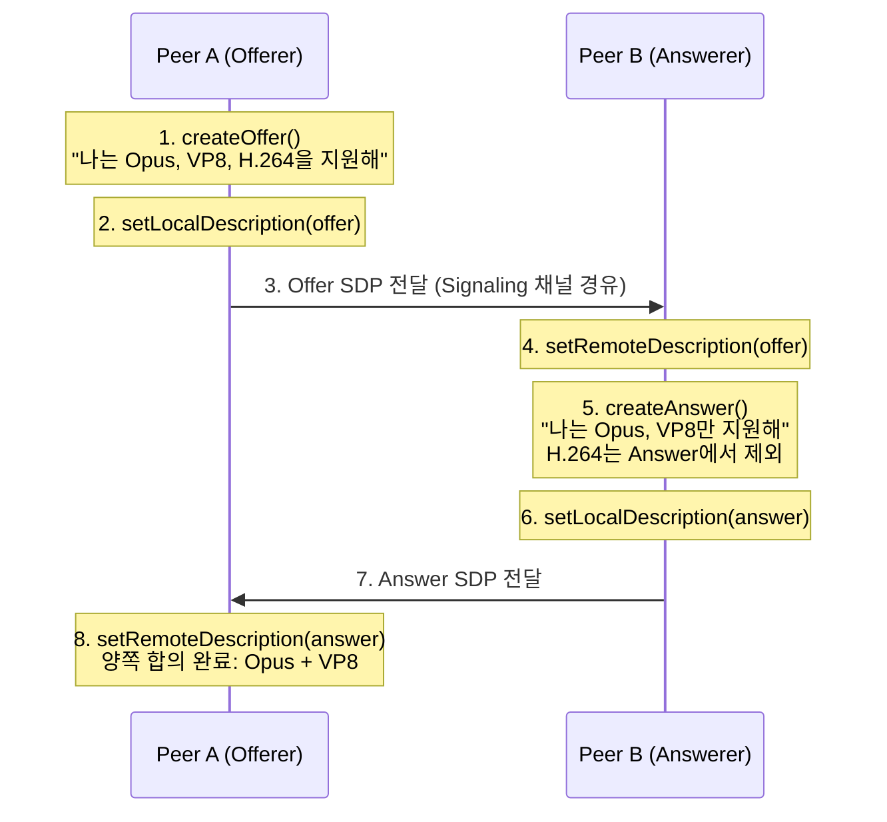

Answer에서 **지원하지 않는 코덱을 제거**할 수 있다. 양쪽이 호환 가능한 최소 공통 집합을 합의한다.

### 3.1.5 Transceiver, BUNDLE, Trickle ICE

**Transceiver:** SDP의 미디어 설명을 API로 노출한 개념이다. 하나의 Transceiver는 하나의 `m=` 줄에 대응한다.

| 방향 | 의미 | 사용 사례 |
|------|------|----------|
| `sendrecv` | 양방향 | 화상 통화 |
| `sendonly` | 송신만 | 화면 공유, 방송 |
| `recvonly` | 수신만 | 시청자, 모니터링 |
| `inactive` | 비활성 | 일시 중지 |

**BUNDLE:** 기본적으로 각 미디어 설명은 별도의 ICE/DTLS 연결이 필요하다. BUNDLE은 이를 **하나의 연결로 묶어** 효율성을 높인다.

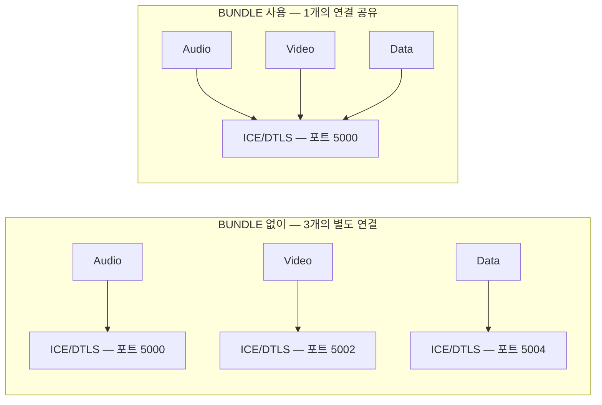

**Trickle ICE:** 초기 WebRTC(Vanilla ICE)에서는 모든 ICE 후보를 수집한 후 SDP를 전달했다. Trickle ICE는 후보를 발견할 때마다 **즉시 전달**하여 연결 수립 시간을 대폭 단축한다.

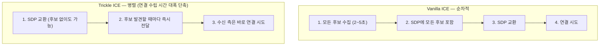

## 3.2 NAT (Network Address Translation)

ICE, STUN, TURN을 이해하려면 먼저 NAT의 동작을 알아야 한다.

IPv4 주소는 약 43억 개로 한정되어 있다. NAT은 **하나의 공인 IP를 여러 기기가 공유**할 수 있게 해주며, 아웃바운드 트래픽에 대한 매핑을 생성하고 인바운드 응답을 해당 사설 IP로 라우팅한다.

### 3.2.1 NAT 매핑 유형

NAT이 매핑을 생성하는 방식에 따라 P2P 연결 가능 여부가 달라진다.

**Endpoint Independent Mapping (가장 관대):** 외부 어디로 보내든 같은 매핑을 재사용한다. STUN으로 알아낸 매핑을 다른 피어와의 P2P 연결에 사용 가능.

**Address Dependent Mapping:** 상대 IP가 다르면 다른 매핑을 생성한다. STUN 서버용 매핑과 피어용 매핑이 달라져 직접 연결이 어려움.

**Address and Port Dependent Mapping (대칭 NAT):** 상대 IP와 포트가 모두 같아야 같은 매핑을 재사용한다. STUN으로 알아낸 매핑이 무용지물이므로 TURN 필요.

### 3.2.2 NAT 필터링 — P2P 가능성 매트릭스

NAT은 매핑 외에도 인바운드 트래픽을 필터링한다.

| 필터링 유형 | 규칙 | P2P 가능성 |
|------------|------|-----------|
| Endpoint Independent | 매핑이 있으면 누구든 보낼 수 있음 | 높음 |
| Address Dependent | 내가 먼저 보낸 IP만 응답 가능 | 중간 |
| Address and Port Dependent | 내가 먼저 보낸 IP:포트만 응답 가능 | 낮음 |

```
[NAT 유형에 따른 P2P 연결 가능성]

         Peer A NAT 유형
         │  EI    AD    APD
  ───────┼───────────────────
  EI     │  ✅    ✅    ✅
  AD     │  ✅    ⚠️    ❌
  APD    │  ✅    ❌    ❌

  EI  = Endpoint Independent
  AD  = Address Dependent
  APD = Address and Port Dependent (대칭 NAT)

  ✅ = STUN으로 직접 연결 가능
  ⚠️ = 양쪽 동시 STUN 바인딩으로 가능할 수 있음
  ❌ = TURN 필요
```

## 3.3 STUN (Session Traversal Utilities for NAT)

STUN 서버의 역할은 딱 하나이다: **"내 공인 IP와 포트가 뭐야?"**라는 질문에 답하는 것이다.

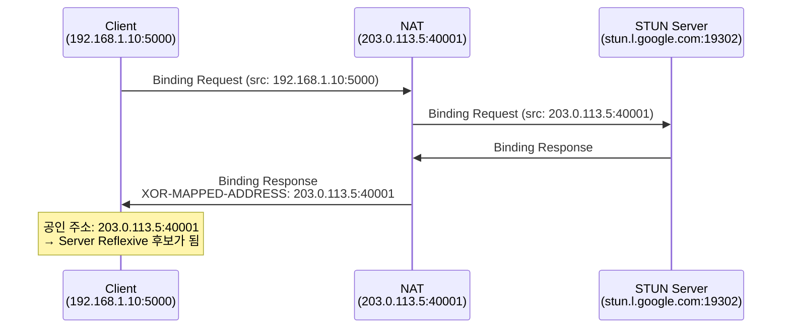

**STUN의 한계:** STUN은 Endpoint Independent Mapping NAT에서만 효과적이다. Address Dependent 또는 대칭 NAT에서는 STUN으로 알아낸 매핑이 다른 피어와 통신할 때 바뀌기 때문에 직접 연결에 사용할 수 없다. 이때 TURN이 필요하다.

## 3.4 TURN (Traversal Using Relays around NAT)

TURN은 직접 연결이 불가능할 때 **중계 서버를 통해 모든 트래픽을 전달**하는 프로토콜이다. "최후의 수단"이다.

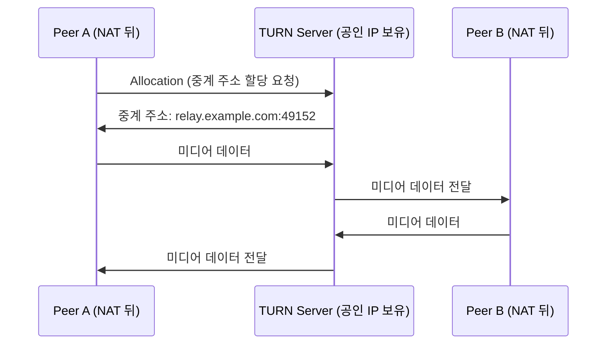

**동작 과정:**

1. **할당 (Allocation):** 클라이언트가 Allocate Request를 보내면, 서버가 중계 주소(Relayed Address)를 할당
2. **권한 생성 (CreatePermission):** 특정 피어만 중계를 허용하여 보안 유지
3. **데이터 전송:** Send Indication(36바이트 오버헤드) 또는 ChannelData(4바이트, 효율적)

**TURN 비용:** 모든 미디어 트래픽이 서버를 경유하므로 서버 대역폭이 양쪽 트래픽 합산(2배)이 된다. 영상 통화 하나가 1~2 Mbps를 사용한다면, 1,000명 동시 사용 시 2~4 Gbps가 필요하다.

**TURN 사용 비율:**

| 환경 | TURN 필요 비율 | 이유 |
|------|---------------|------|
| 같은 LAN | ~0% | 직접 연결 가능 |
| 일반 가정용 NAT | ~10~20% | 대부분 STUN으로 해결 |
| 기업 방화벽 | ~30~50% | 엄격한 NAT/방화벽 정책 |
| 대칭 NAT + 대칭 NAT | ~100% | 직접 연결 불가 |

## 3.5 ICE (Interactive Connectivity Establishment)

ICE는 STUN과 TURN을 조합하여 **두 피어 간 최적의 연결 경로를 찾는 프레임워크**이다.

### 3.5.1 후보 유형 5가지

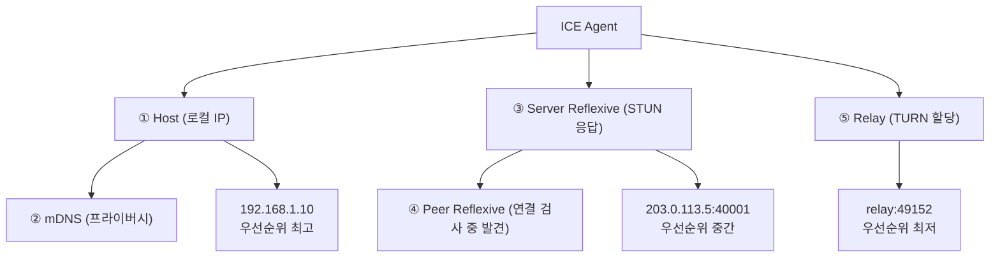

| 유형 | 설명 | 발견 방법 | 우선순위 |
|------|------|----------|---------|
| **Host** | 로컬 네트워크 인터페이스 IP | OS에서 직접 수집 | 최고 |
| **mDNS** | UUID 형태의 호스트명 (IP 노출 방지) | mDNS 프로토콜 | 높음 |
| **Server Reflexive** | NAT 외부에서 보이는 공인 IP:포트 | STUN 서버 응답 | 중간 |
| **Peer Reflexive** | 연결 검사 중 발견된 예상치 못한 주소 | 상대방의 STUN 핑 소스 | 중간 |
| **Relay** | TURN 서버의 중계 주소 | TURN Allocation | 최저 |

### 3.5.2 연결 과정 — 수집 → 페어링 → 검사 → 선택

**1단계: 후보 수집 (Gathering)**

```
[후보 수집 타임라인]

  시간 ──────────────────────────────────────────────>

  즉시:    Host 후보 수집 (OS 네트워크 인터페이스)
  ~50ms:   mDNS 후보 등록
  ~100ms:  STUN 요청 전송
  ~200ms:  STUN 응답 수신 → Server Reflexive 후보
  ~300ms:  TURN Allocate 요청 전송
  ~500ms:  TURN Allocate 응답 → Relay 후보
```

**2단계: 후보 페어링 (Pairing)**

양쪽의 후보를 모든 조합으로 후보쌍(Candidate Pair)을 만든다.

```
  Peer A 후보                    Peer B 후보
  ├── Host: 192.168.1.10:5000    ├── Host: 10.0.0.5:6000
  ├── Srflx: 203.0.113.5:40001  ├── Srflx: 198.51.100.3:50001
  └── Relay: relay-a:49152      └── Relay: relay-b:49200

  생성되는 후보쌍 (3 × 3 = 9개):
  ┌──────────────────────────────────────────────────────┐
  │  Pair 1: A:Host     ↔ B:Host      (최고 우선순위)     │
  │  Pair 2: A:Host     ↔ B:Srflx                       │
  │  ...                                                 │
  │  Pair 9: A:Relay    ↔ B:Relay    (최저 우선순위)      │
  └──────────────────────────────────────────────────────┘
```

**3단계: 연결성 검사 (Connectivity Check)**

각 후보쌍에 STUN Binding Request를 보내 실제 통신 가능 여부를 확인한다. STUN 메시지에 `ice-ufrag`와 `ice-pwd`가 포함되어 인증된 피어만 응답할 수 있다.

**4단계: 후보 선택 (Nomination)**

ICE 에이전트에는 **Controlling**(보통 Offerer)과 **Controlled**(보통 Answerer) 역할이 있다. Controlling 에이전트가 Valid Candidate Pair 중 하나를 지명하면, 이것이 Selected Candidate Pair가 되어 세션 내내 사용된다.

### 3.5.3 상태 머신, ICE Restart

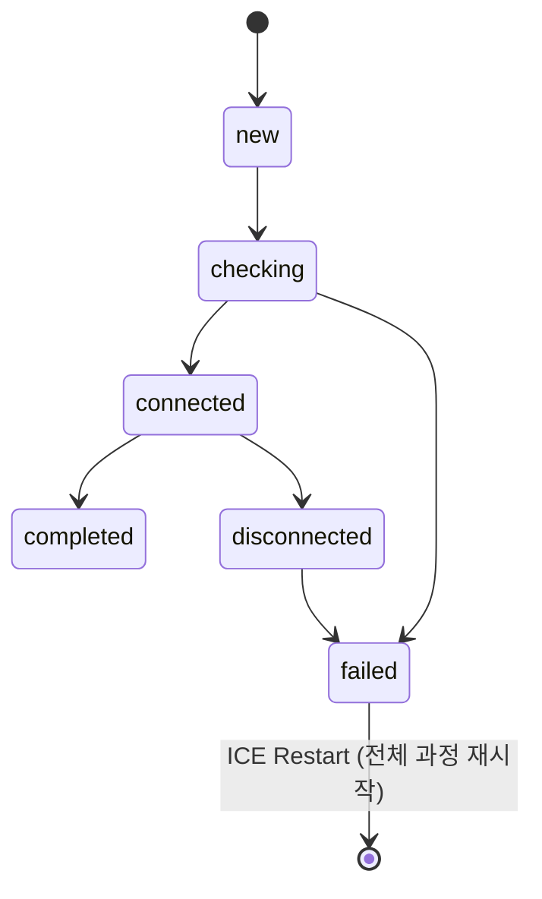

| 상태 | 의미 |
|------|------|
| `new` | 아직 후보 교환 안 됨 |
| `checking` | 연결성 검사 진행 중 |
| `connected` | 하나 이상의 후보쌍 성공 (더 나은 쌍 탐색 중) |
| `completed` | 최종 후보쌍 선택 완료 |
| `disconnected` | 패킷이 일시적으로 도착하지 않음 |
| `failed` | 모든 후보쌍 실패 또는 타임아웃 |

**ICE Restart:** Selected Candidate Pair가 동작을 멈추면(네트워크 변경, NAT 매핑 만료 등) ICE Restart를 통해 새로운 `ice-ufrag`/`ice-pwd`를 생성하고 후보 수집부터 다시 시작한다. Wi-Fi → LTE 전환, VPN 변경 시 특히 유용하다.

## 3.6 DTLS / SRTP — 보안

WebRTC는 보안이 **선택이 아니라 필수**이다. 모든 연결은 반드시 암호화되어야 한다.

**DTLS 핸드셰이크:**

DTLS는 **TLS의 UDP 버전**으로, 키 교환과 상호 인증을 수행한다.

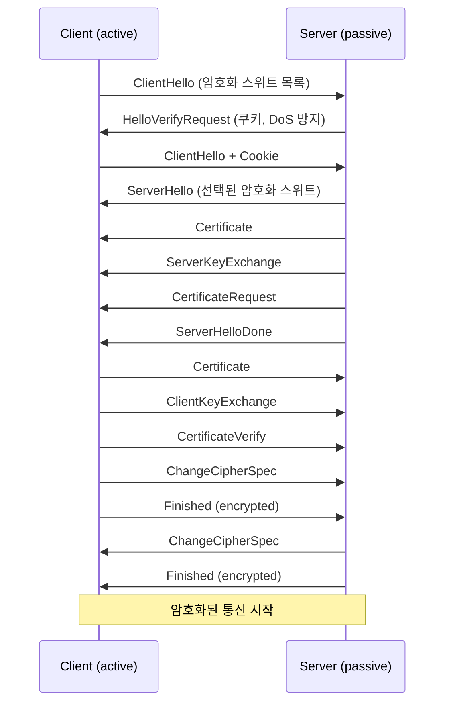

**Fingerprint 검증:** DTLS 인증서는 자체 서명(Self-Signed)이다. SDP의 `a=fingerprint` 속성에 인증서 해시가 포함되어 있고, DTLS 핸드셰이크에서 수신한 인증서의 해시와 비교하여 중간자 공격을 방지한다. 이 방식의 보안은 **시그널링 채널의 무결성에 의존**하므로, 시그널링 채널은 반드시 TLS(WSS, HTTPS)로 보호해야 한다.

**SRTP 키 도출:** DTLS 핸드셰이크에서 생성된 Master Secret으로 SRTP 키를 도출한다.

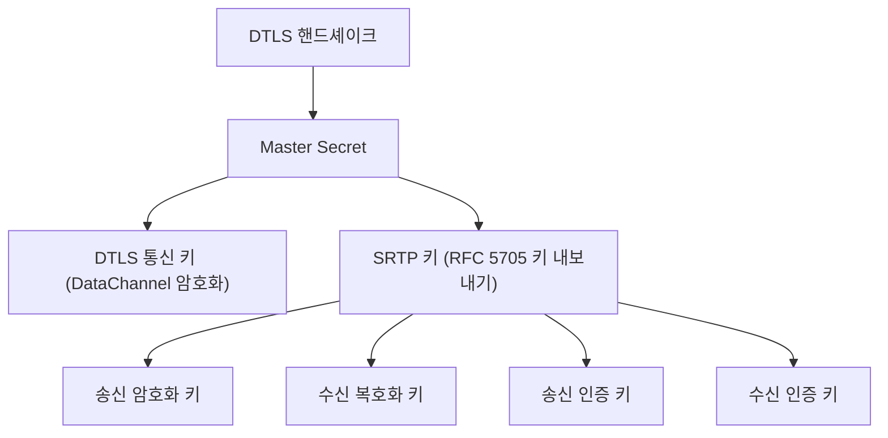

**SRTP 패킷 구조:** RTP 헤더는 라우팅을 위해 암호화하지 않고, Payload만 암호화한다. Authentication Tag로 헤더+Payload 전체의 무결성을 보장한다.

```
  ┌─────────────────────────────────────────────┐
  │  RTP Header (평문)                           │  ← 라우팅에 필요
  │  - Sequence Number, Timestamp, SSRC          │
  ├─────────────────────────────────────────────┤
  │  Encrypted Payload (암호화된 미디어 데이터)     │  ← AES 암호화
  ├─────────────────────────────────────────────┤
  │  Authentication Tag (인증 태그)               │  ← HMAC 무결성 보장
  └─────────────────────────────────────────────┘
```

# 4. 연결 흐름 Step-by-Step

## 4.1 6단계 개요

WebRTC 연결은 크게 **6단계**로 진행된다.

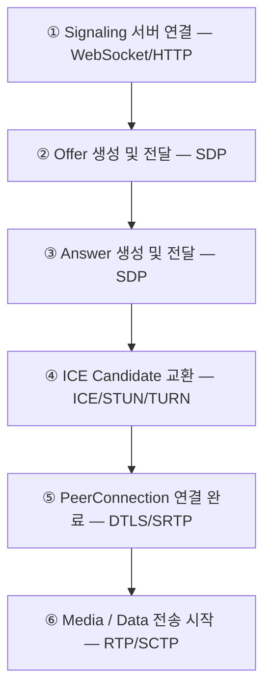

**전체 시퀀스 다이어그램:**

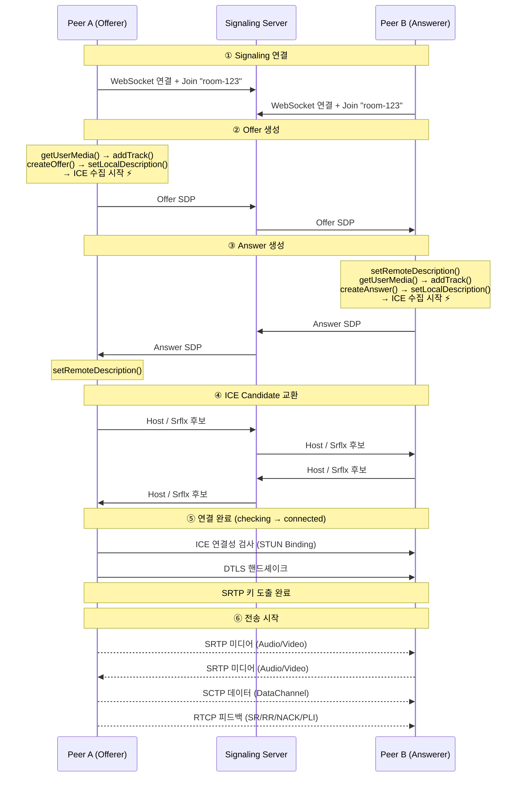

## 4.2 Signaling 서버 연결

두 피어가 서로에게 메시지를 전달할 수 있는 채널(WebSocket 등)을 먼저 확보한다.

```mermaid
sequenceDiagram
    participant A as Peer A
    participant S as Signaling Server
    participant B as Peer B
    A->>S: WebSocket 연결 (ws://signal.example.com)
    B->>S: WebSocket 연결
    A->>S: Join Room "room-123"
    B->>S: Join Room "room-123"
    S->>A: "Peer B가 입장했습니다"
```

## 4.3 Offer 생성

Peer A(Offerer)가 RTCPeerConnection을 생성하고, 미디어 트랙을 추가한 뒤 Offer SDP를 생성하여 전달한다.

**`setLocalDescription(offer)` 호출 시 두 가지가 동시에 일어난다:**

```mermaid
graph TD
    A["setLocalDescription(offer) 호출"] --> B["1. SDP Offer를 로컬에 적용<br/>'나는 이 조건으로 통신하겠다'고 확정"]
    A --> C["2. ICE Agent가 후보 수집 시작 ⚡"]
    C --> D["Host 후보 수집 (즉시)"]
    C --> E["STUN 서버에 Binding Request 전송"]
    C --> F["TURN 서버에 Allocate Request 전송"]
    C --> G["후보 발견 시 onicecandidate 이벤트 발생"]
```

이것이 **Trickle ICE**의 시작점이다.

## 4.4 Answer 생성 — 코덱 협상

Peer B는 Offer를 수신하고, 자신이 지원하는 능력 범위 내에서 Answer를 생성한다.

```mermaid
graph TD
    subgraph "Peer A — Offer"
        AA["Audio: Opus, G722, PCMU"]
        AV["Video: VP8, VP9, H.264, AV1"]
    end
    subgraph "Peer B — Answer"
        BA["Audio: Opus, PCMU"]
        BV["Video: VP8, H.264"]
    end
    AA & BA --> RA["Audio: Opus"]
    AV & BV --> RV["Video: VP8"]
    subgraph "협상 결과 — 양쪽 모두 지원하는 최우선 코덱"
        RA
        RV
    end
```

이 시점에서 양쪽 모두 `localDescription`과 `remoteDescription`이 설정된 상태이다.

## 4.5 ICE Candidate 교환

`setLocalDescription()` 호출 후 ICE 에이전트가 후보를 수집하기 시작한다. Trickle ICE에서는 발견 즉시 전달한다.

```mermaid
sequenceDiagram
    participant A as Peer A
    participant S as Signaling
    participant B as Peer B
    Note over A: setLocalDescription()
    Note over B: setLocalDescription()
    Note right of A: ~0ms
    A->>S: Host 후보
    S->>B: Host 후보
    B->>S: Host 후보
    S->>A: Host 후보
    Note right of A: ~200ms
    A->>S: Srflx 후보
    S->>B: Srflx 후보
    B->>S: Srflx 후보
    S->>A: Srflx 후보
    Note right of A: ~500ms
    A->>S: Relay 후보
    S->>B: Relay 후보
    B->>S: Relay 후보
    S->>A: Relay 후보
    A->>S: null (수집 완료)
    B->>S: null (수집 완료)
```

`addIceCandidate()`로 수신한 원격 후보를 ICE 에이전트에 추가하면, 기존 로컬 후보와 즉시 페어링되어 연결성 검사가 시작된다.

## 4.6 연결 완료 — 상태 변화

ICE 연결성 검사 완료 → Selected Candidate Pair 결정 → DTLS 핸드셰이크 → SRTP 키 도출 → `connectionState: "connected"`.

**ICE 연결 상태 (iceConnectionState):**

```mermaid
stateDiagram-v2
    [*] --> new
    new --> checking
    checking --> connected
    checking --> failed
    connected --> completed
    connected --> disconnected
    disconnected --> failed
```

**전체 연결 상태 (connectionState):** ICE와 DTLS 상태를 통합하여 제공한다.

```mermaid
stateDiagram-v2
    [*] --> new
    new --> connecting
    connecting --> connected
    connecting --> failed : ICE 또는 DTLS 실패
    connected --> disconnected
    disconnected --> failed
```

**DTLS 역할 결정:**

```
  Offer:  a=setup:actpass → "나는 어느 역할이든 가능"
  Answer: a=setup:active  → "내가 Client 할게"

  결과: Peer A (Offerer) = DTLS Server, Peer B (Answerer) = DTLS Client
```

## 4.7 전송 시작

DTLS 핸드셰이크가 완료되면 SRTP 키가 도출되고, 미디어와 데이터 전송이 시작된다.

- **미디어 전송**: Audio(Opus 인코딩 → SRTP 암호화 → UDP), Video(VP8 인코딩 → SRTP 암호화 → UDP)
- **데이터 채널 활성화**: SCTP over DTLS로 메시지 송수신
- **RTCP 피드백 루프**: SR/RR 교환, 비트레이트 자동 조절, NACK/PLI 요청

## 4.8 주요 API 메서드 정리

**RTCPeerConnection 메서드:**

| 메서드 | 사용 단계 | 역할 |
|--------|----------|------|
| `new RTCPeerConnection(config)` | ②③ | PeerConnection 생성. iceServers 설정 |
| `addTrack(track, stream)` | ②③ | 미디어 트랙 추가. Transceiver 자동 생성 |
| `createOffer()` | ② | Offer SDP 생성 |
| `createAnswer()` | ③ | Answer SDP 생성 |
| `setLocalDescription(sdp)` | ②③ | 로컬 SDP 적용. ICE 수집 시작 트리거 |
| `setRemoteDescription(sdp)` | ②③ | 원격 SDP 적용 |
| `addIceCandidate(candidate)` | ④ | 원격 ICE 후보 추가 |
| `createDataChannel(label)` | ⑥ | DataChannel 생성 |
| `getStats()` | ⑥ | 전송 통계 조회 |
| `close()` | - | 연결 종료 |

**이벤트 핸들러:**

| 이벤트 | 사용 단계 | 발생 시점 |
|--------|----------|----------|
| `onicecandidate` | ④ | ICE 후보 발견 시 |
| `onicegatheringstatechange` | ④ | ICE 수집 상태 변경 시 |
| `oniceconnectionstatechange` | ⑤ | ICE 연결 상태 변경 시 |
| `onconnectionstatechange` | ⑤ | 전체 연결 상태 변경 시 |
| `ontrack` | ⑥ | 원격 미디어 트랙 수신 시 |
| `ondatachannel` | ⑥ | 원격 DataChannel 생성 시 |
| `onnegotiationneeded` | - | 재협상 필요 시 |

**호출 순서 요약:**

```
[Offerer]                              [Answerer]
new RTCPeerConnection()                new RTCPeerConnection()
→ getUserMedia()                       → receive offer
→ addTrack()                           → setRemoteDescription(offer)
→ createOffer()                        → getUserMedia()
→ setLocalDescription(offer) ⚡        → addTrack()
→ send offer                           → createAnswer()
→ receive answer                       → setLocalDescription(answer) ⚡
→ setRemoteDescription(answer)         → send answer
→ addIceCandidate() × N               → addIceCandidate() × N
→ ontrack (원격 미디어)                 → ontrack (원격 미디어)
```

## 4.9 연결 실패와 재협상

**연결 실패 대응:**

| 실패 원인 | 증상 | 대응 |
|-----------|------|------|
| 양쪽 대칭 NAT | ICE `failed` | TURN 서버 추가 |
| 방화벽 UDP 차단 | ICE `failed` | TURN TCP/TLS 사용 |
| 시그널링 지연 | SDP 교환 타임아웃 | 시그널링 채널 안정성 확보 |
| 네트워크 전환 (Wi-Fi→LTE) | `disconnected` | ICE Restart |
| NAT 매핑 만료 | `disconnected` → `failed` | ICE Restart |

**ICE Restart 흐름:**

```mermaid
sequenceDiagram
    participant A as Peer A
    participant S as Signaling
    participant B as Peer B
    Note over A: connectionState: "disconnected"
    Note over A: createOffer({iceRestart: true})<br/>→ 새로운 ice-ufrag/pwd 생성<br/>setLocalDescription()<br/>→ 새 ICE 후보 수집 시작
    A->>S: 새 Offer SDP
    S->>B: 새 Offer SDP
    Note over B: setRemoteDescription()<br/>createAnswer()<br/>setLocalDescription()
    B->>S: 새 Answer SDP
    S->>A: 새 Answer SDP
    A->>S: 새 ICE 후보
    S->>B: 새 ICE 후보
    B->>S: 새 ICE 후보
    S->>A: 새 ICE 후보
    A->>B: 새 ICE 연결성 검사
    Note over A: connectionState: "connected" (복구됨!)
    Note over B: connectionState: "connected"
```

**재협상 (Renegotiation):** 연결이 수립된 후에도 새 트랙 추가(화면 공유), 트랙 제거(비디오 끄기), 미디어 방향 변경 등을 할 수 있다. `onnegotiationneeded` 이벤트가 자동 발생하고, 새로운 Offer/Answer 교환이 진행된다. 이때 기존 ICE 연결은 유지되며 SDP만 업데이트된다.

# 5. 네트워크 토폴로지

WebRTC 연결은 항상 P2P일까? 아니다. 참가자 수와 서비스 요구사항에 따라 세 가지 토폴로지를 선택할 수 있다.

## 5.1 P2P (Peer-to-Peer)

가장 기본적인 구조이다. 두 피어가 시그널링 서버를 통해 협상한 후, **직접 연결**하여 미디어/데이터를 교환한다.

```mermaid
graph LR
    A["Peer A"] <-->|"직접 연결"| B["Peer B"]
    S["Signaling Server"] -.->|"연결 수립 시에만 사용"| A
    S -.->|"연결 수립 시에만 사용"| B
```

- **장점**: 가장 낮은 지연, 서버 비용 최소, 구현 단순
- **단점**: 참가자 증가 시 각 피어의 업로드 대역폭 기하급수적 증가 (N명 → N-1개 연결)
- **적합**: 1:1 통화, 소규모(2~4명) 회의

## 5.2 SFU (Selective Forwarding Unit)

중앙 서버가 미디어 스트림을 **선택적으로 전달(forwarding)**하는 구조이다. 각 피어는 자신의 미디어를 SFU에 한 번만 업로드하고, SFU가 다른 피어들에게 전달한다.

```mermaid
graph TD
    SFU["SFU Server<br/>(인코딩/디코딩 없이 패킷 전달)"]
    A["Peer A"] -->|업로드| SFU
    B["Peer B"] -->|업로드| SFU
    C["Peer C"] -->|업로드| SFU
    D["Peer D"] -->|업로드| SFU
    SFU -->|다운로드| A
    SFU -->|다운로드| B
    SFU -->|다운로드| C
    SFU -->|다운로드| D
```

각 피어: 업로드 1개 + 다운로드 (N-1)개. 서버: 인코딩/디코딩 없이 패킷 전달만 수행.

- **핵심**: 미디어를 디코딩/인코딩하지 않고 RTP 패킷을 그대로 전달
- **장점**: 클라이언트 업로드 부담 대폭 감소, 서버 부하 적음, Simulcast/SVC 지원
- **단점**: 서버 인프라 필요, 다운로드 대역폭은 참가자 수에 비례
- **적합**: 5~50명 화상회의 (Google Meet, Zoom 기본 모드)

**대표 오픈소스 SFU:**

| SFU | 언어 | 특징 |
|-----|------|------|
| [Janus](https://janus.conf.meetecho.com/) | C | 플러그인 아키텍처, 높은 성능 |
| [mediasoup](https://mediasoup.org/) | C++/Node.js | Node.js API, SFU에 특화 |
| [Pion/ion-sfu](https://github.com/pion/ion-sfu) | Go | Pion 기반, Go 생태계 |
| [LiveKit](https://livekit.io/) | Go | Pion 기반, 프로덕션 레벨 |

## 5.3 MCU (Multipoint Control Unit)

SFU와 달리 서버가 모든 피어의 미디어를 **디코딩하고 합성(mixing)하여 하나의 스트림으로 인코딩**한 후 각 피어에 전달하는 구조이다.

```mermaid
graph TD
    A["Peer A"] -->|업로드| MCU
    B["Peer B"] -->|업로드| MCU
    C["Peer C"] -->|업로드| MCU
    D["Peer D"] -->|업로드| MCU
    subgraph MCU["MCU Server"]
        Dec["디코딩"] --> Mix["합성"] --> Enc["인코딩"]
    end
    MCU -->|"합성된 스트림"| A
    MCU -->|"합성된 스트림"| B
    MCU -->|"합성된 스트림"| C
    MCU -->|"합성된 스트림"| D
```

각 피어: 업로드 1개 + 다운로드 1개 (합성된 스트림). 서버: CPU 집약적 (디코딩 → 합성 → 인코딩).

- **장점**: 클라이언트 부담 최소 (다운로드 1개), 저사양 디바이스 지원 가능
- **단점**: 서버 CPU/메모리 부담 매우 큼, 추가 지연, 스케일링 비용 높음
- **적합**: 저사양 디바이스 필수 지원, 레거시 화상회의 시스템 호환

## 5.4 비교 정리

| 항목 | P2P | SFU | MCU |
|------|-----|-----|-----|
| 서버 역할 | 시그널링만 | 패킷 전달 | 미디어 합성 |
| 클라이언트 업로드 | N-1 스트림 | 1 스트림 | 1 스트림 |
| 클라이언트 다운로드 | N-1 스트림 | N-1 스트림 | 1 스트림 |
| 서버 CPU | 없음 | 낮음 | 매우 높음 |
| 지연 | 최저 | 낮음 | 높음 |
| 확장성 | 2~4명 | 5~50명 | 50명+ |
| 대표 서비스 | FaceTime (1:1) | Google Meet | 전통적 회의 시스템 |

**선택 가이드:**

```mermaid
graph LR
    P2P["P2P<br/>2~4명"] --> SFU["SFU<br/>5~50명"]
    SFU --> MCU["MCU<br/>50명+"]
    P2P ---|"전환 지점"| SFU
    SFU ---|"전환 지점"| MCU
```

실제 서비스에서는 하나의 토폴로지만 사용하지 않는다. **1:1에서는 P2P, 다자간에서는 SFU로 전환**하는 하이브리드 방식이 일반적이다.

# 6. 정리

이 글에서 다룬 WebRTC 기초 이론을 한눈에 정리하면 다음과 같다.

| 주제 | 핵심 포인트 |
|------|------------|
| **WebRTC** | API이자 프로토콜. P2P 직접 연결, 초저지연, 의무적 암호화가 핵심 차별점 |
| **구성 요소** | Media(음성/영상 처리), Transport(연결/보안), Signaling(세션 협상, 스펙 외부) |
| **RTP/RTCP** | RTP로 미디어 전송, RTCP로 품질 피드백과 네트워크 적응 |
| **DataChannel** | SCTP 기반, 채널별 신뢰성/순서 독립 설정, 최대 65,534 채널 |
| **SDP** | 평문 텍스트 프로토콜, Offer/Answer 모델로 세션 협상 |
| **NAT** | 매핑 유형에 따라 P2P 가능 여부 결정 |
| **STUN** | 공인 IP:포트 발견, EI NAT에서만 효과적 |
| **TURN** | 모든 트래픽 중계, 최후의 수단, 비용이 비쌈 |
| **ICE** | 후보 수집 → 페어링 → 검사 → 선택으로 최적 경로 탐색 |
| **DTLS/SRTP** | DTLS로 키 교환+인증, SRTP로 미디어 암호화, fingerprint로 MITM 방지 |
| **연결 흐름** | Signaling → Offer/Answer → ICE 교환 → DTLS → 전송 (6단계) |
| **토폴로지** | P2P(1:1) → SFU(패킷 전달) → MCU(미디어 합성), 참가자 수에 따라 선택 |

```mermaid
graph TD
    A["SDP 교환 (Signaling)"] --> B["ICE 후보 수집 (Host → STUN → TURN)"]
    B --> C["ICE 후보 교환 + 연결성 검사"]
    C --> D["최적 후보쌍 선택"]
    D --> E["DTLS 핸드셰이크 (키 교환 + 인증)"]
    E --> F["SRTP/SCTP 암호화 통신 시작"]
```

# 7. 참고 자료

- [WebRTC for the Curious (한국어)](https://webrtcforthecurious.com/ko/)
- [Pion WebRTC GitHub](https://github.com/pion/webrtc)
- [MDN WebRTC API](https://developer.mozilla.org/ko/docs/Web/API/WebRTC_API)
- [WebRTC 공식 사이트](https://webrtc.org/)
- [RFC 8866 - SDP](https://datatracker.ietf.org/doc/html/rfc8866)
- [RFC 8445 - ICE](https://datatracker.ietf.org/doc/html/rfc8445)
- [RFC 5389 - STUN](https://datatracker.ietf.org/doc/html/rfc5389)
- [RFC 5766 - TURN](https://datatracker.ietf.org/doc/html/rfc5766)
- [RFC 6347 - DTLS](https://datatracker.ietf.org/doc/html/rfc6347)
- [RFC 3711 - SRTP](https://datatracker.ietf.org/doc/html/rfc3711)
- [RFC 3550 - RTP/RTCP](https://datatracker.ietf.org/doc/html/rfc3550)
- [RFC 4960 - SCTP](https://datatracker.ietf.org/doc/html/rfc4960)
- [RFC 8829 - JSEP](https://datatracker.ietf.org/doc/html/rfc8829)
- [RFC 8838 - Trickle ICE](https://datatracker.ietf.org/doc/html/rfc8838)
