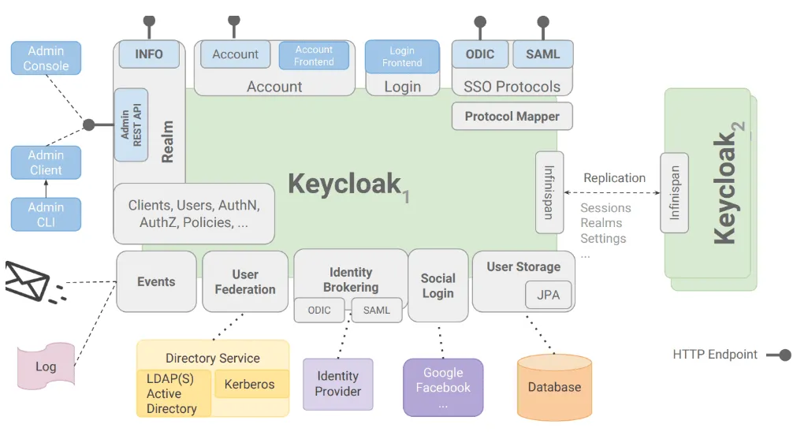
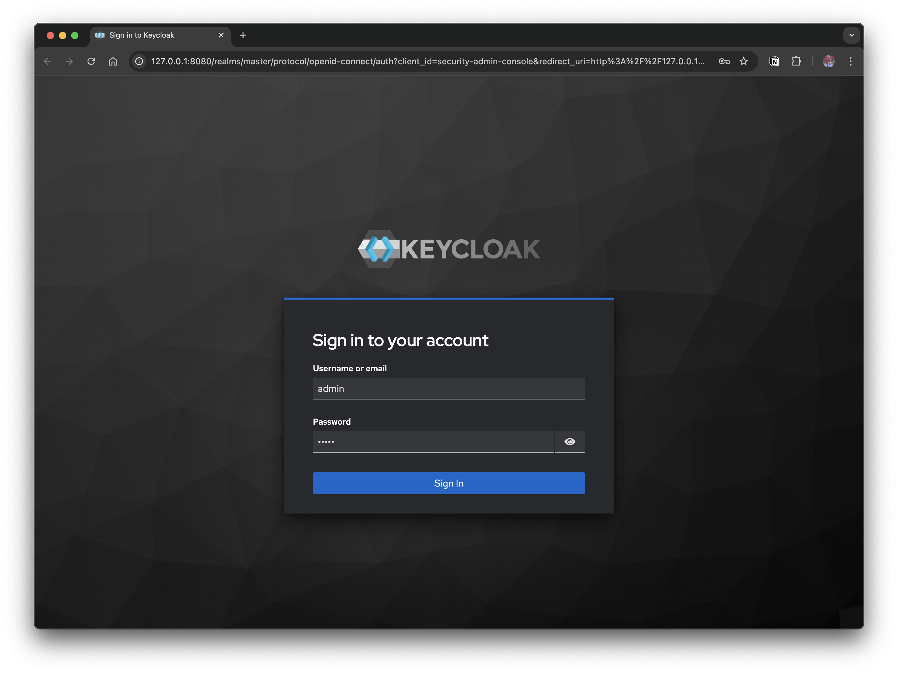
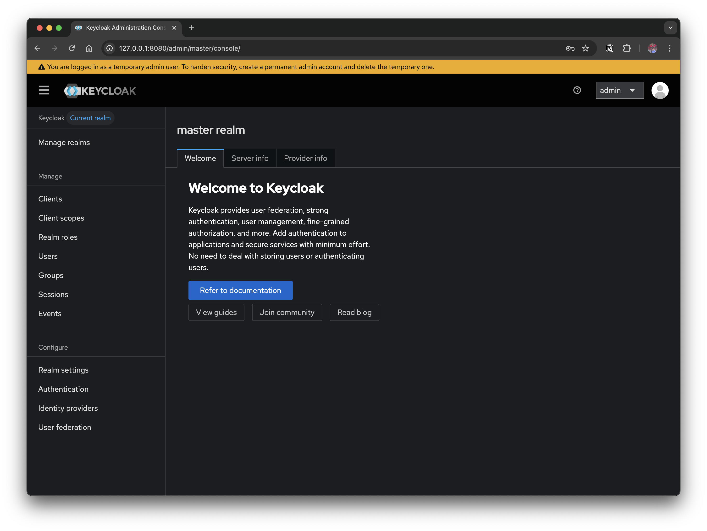
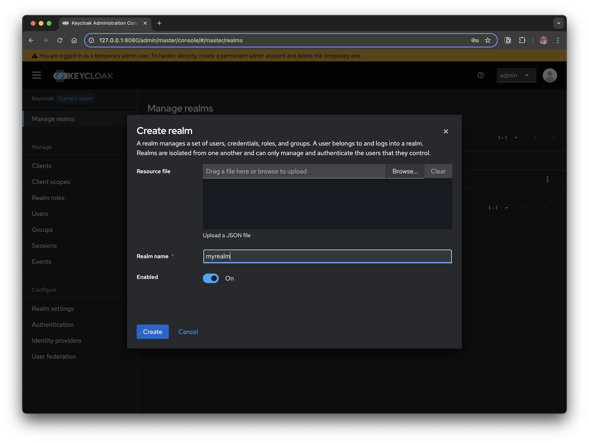
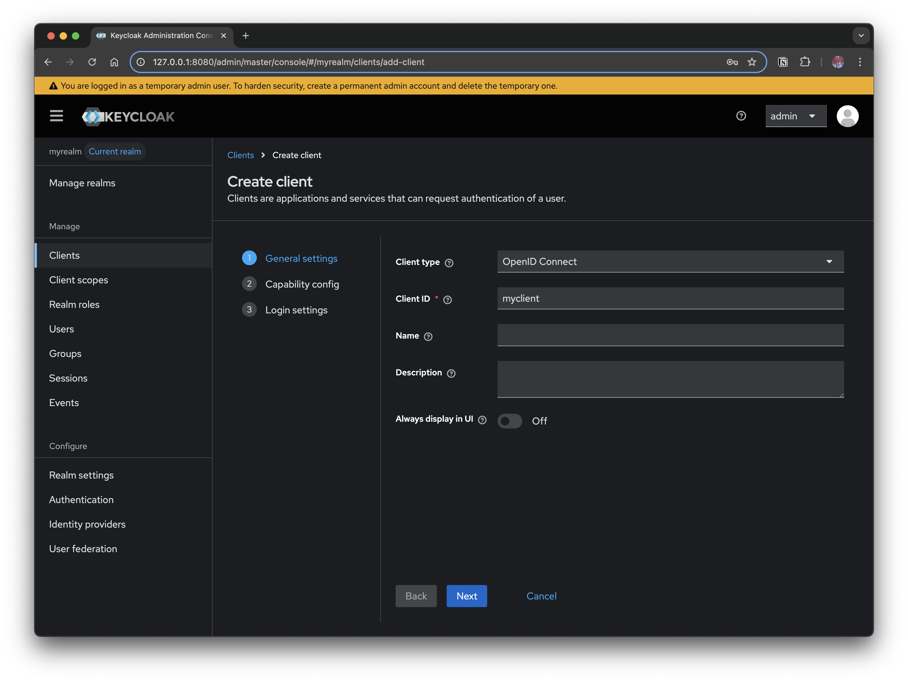
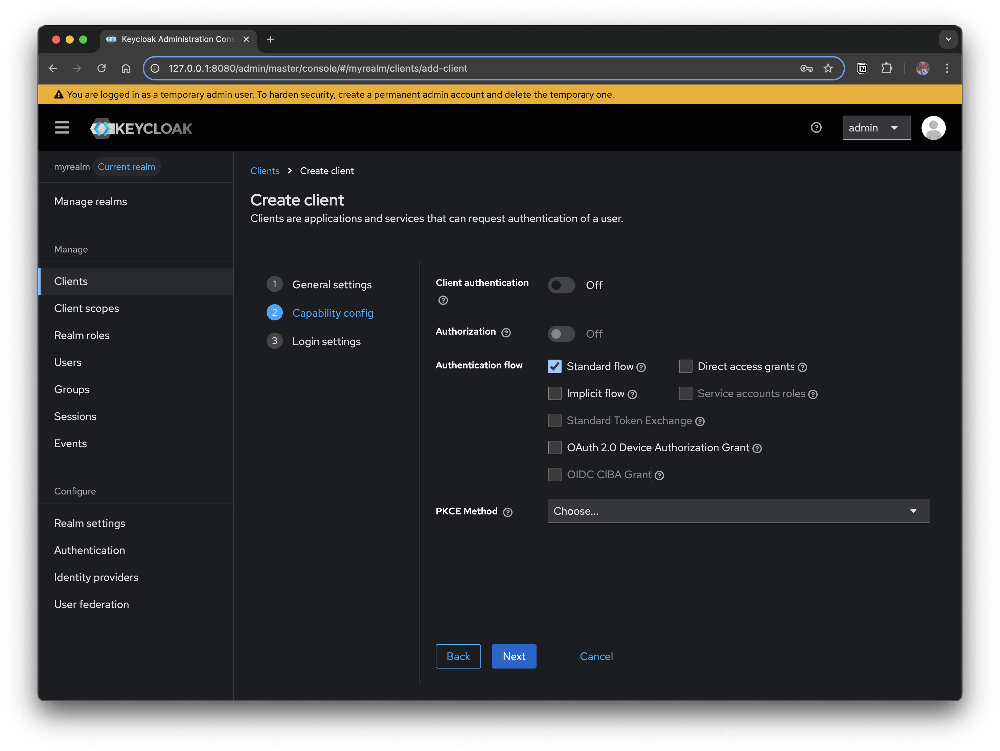
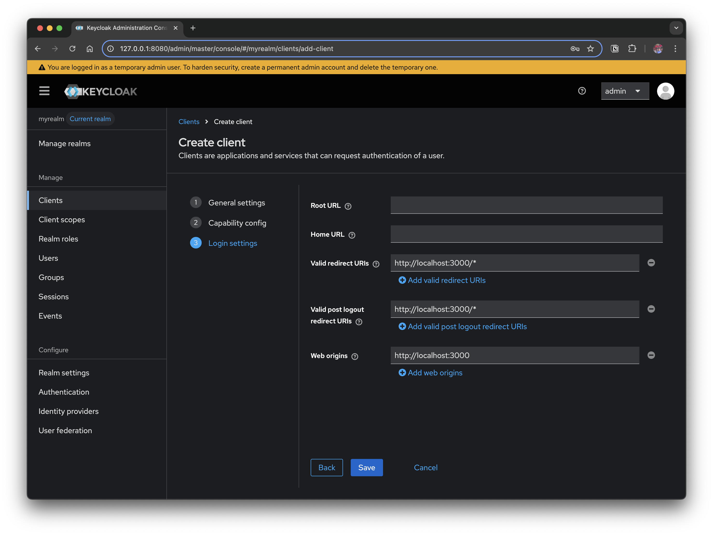
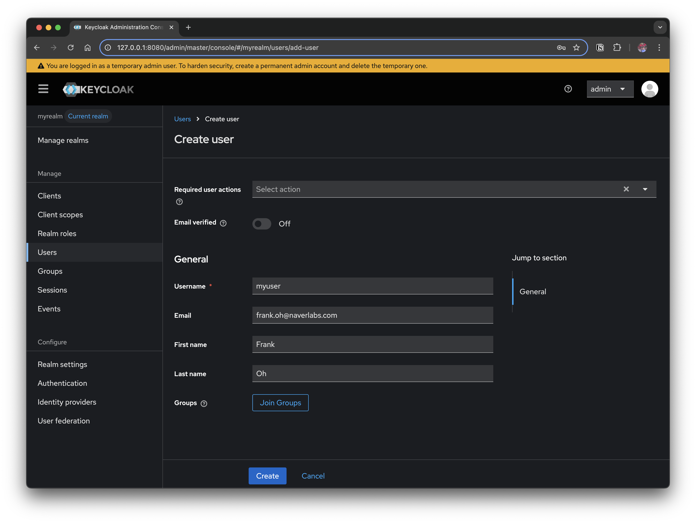
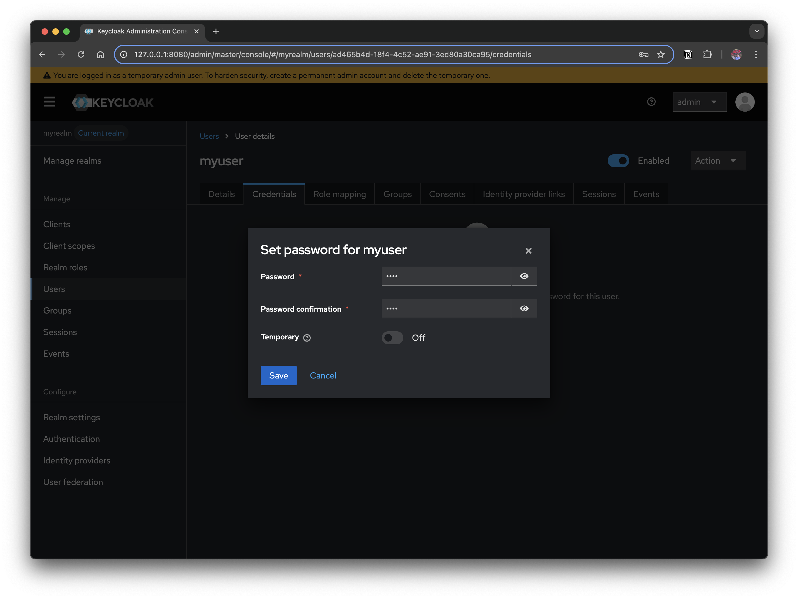

# 1. Overview

Our internal company services had been using the NCP (Naver Cloud Platform) authentication server, but we needed to apply it to other overseas sites where the NCP authentication server was not available. This left us with a choice: either implement the authentication logic ourselves or adopt a separate solution. In this process, among several IAM solutions, we ended up adopting Keycloak, a widely used open-source option.

While reviewing several IAM solutions, I came across Keycloak, a widely used open-source option, and ran a study to actually try it out. This post summarizes what I learned in that process, looking at what Keycloak is, what features it provides, and how it is structured.

## 1.1 What is Keycloak?

Keycloak is an open-source IAM (Identity and Access Management) solution led by **Red Hat**, a platform that lets you handle user authentication and authorization in an integrated way. It supports standard protocols such as OAuth 2.0, OpenID Connect, and SAML, and lets you delegate complex authentication logic such as login, logout, and session management to Keycloak instead of implementing it directly in your application.

> Why should you use it?

Modern application environments are becoming increasingly complex, with multiple microservices, web/mobile clients, and external API integrations. If you implement a separate login feature for each service, the security and maintenance costs grow. With Keycloak, you can achieve centralized authentication management, Single Sign-On (SSO), and social login integration, gaining both stronger security and development efficiency at the same time.

### 1.1.1 Key Features

- **Single Sign-On (SSO)**: Access multiple applications with a single login
- **Social login**: Integrates with Google, Facebook, GitHub, and more
- **Support for various authentication protocols**: OAuth2, OpenID Connect, SAML
- **User Federation**: Connects to external user stores (LDAP, Kerberos) to provide user authentication and synchronization
- **Admin Console / REST API**: An intuitive management UI and automation via API
- **MFA (Multi-Factor Authentication)**: Provides various authentication methods such as OTP, email, and SMS
- **User/Group/Role management**: Fine-grained access control
- [Support for various databases](https://www.keycloak.org/server/db): mysql, msqql, oracle, and more



### 1.1.2 Keycloak Components

Keycloak provides several core components to handle authentication/authorization.

- **Realm**: An isolated space/domain that groups and manages users, clients, policies, and so on
- **Client**: An application that integrates with Keycloak (web, mobile, API server, etc.)
- **User / Group / Role**: Defines the user and permission structure
- **Authentication Flow**: Defines which steps the login process goes through (e.g., ID/password + OTP)
- **Protocol Mapper**: Maps user attributes/permissions and the like into the token

# 2. Building a Keycloak Authentication Server in a Local Environment

Let's use Docker in a local environment to spin up a Keycloak authentication server in a few minutes and access the admin console.

## 2.1 Installing Keycloak

There are several ways to run a Keycloak server. You can download the Keycloak source code and run it directly, but here we use the simplest approach and run it with Docker.

### 2.1.1 Running Keycloak with Docker

```bash
> docker run -p 127.0.0.1:8080:8080 \
   -e KC_BOOTSTRAP_ADMIN_USERNAME=admin \
   -e KC_BOOTSTRAP_ADMIN_PASSWORD=admin \
   quay.io/keycloak/keycloak:26.3.3 start-dev
```

> Explanation of the options

- `-e KC_BOOTSTRAP_ADMIN_USERNAME`, `KC_BOOTSTRAP_ADMIN_PASSWORD`:
  - Specifies the initial administrator account/password used to log in to the Keycloak admin console
- `start-dev`:
  - Runs Keycloak in development mode (dev mode)
  - Operational settings such as TLS/cache/clustering are omitted, allowing a fast start
  - Best suited for practice/local testing

References

- https://www.keycloak.org/getting-started/getting-started-docker

### 2.1.2 Logging in to the Admin Console



Access http://localhost:8080 and log in with `admin` / `admin`.



When you log in as admin, the admin page where you can configure Keycloak loads. The next section covers the parts you need to configure by default in order to use it as an authentication server.


## 2.2 Configuring Keycloak

To use Keycloak as an authentication server, a minimum of basic configuration is required. The basic configuration here aims to reach a state where you can **redirect from your application to the Keycloak login screen** → **issue a token after a successful login**.

### 2.2.1 Create a Realm

- A **Realm** is Keycloak's authentication unit
  - Since users, clients, and policies are all managed per Realm, it is common to separate **Realms** by project and by environment
- Click **Manage realms** → **Create realm** to create one with a name such as myrealm



### 2.2.2 Register a Client

- A **Client** refers to an application that integrates with `Keycloak`
  - Web apps, API servers, and other targets that authenticate through `Keycloak` fall under this
- Click **Clients** → **Create client** and create a client with the following values
  - **Client ID**: `myclient`
  - **Authentication flow**: `Standard flow` (set as the default value)
  - **Access settings**
    - **Valid redirect URIs**: `http://localhost:3000/*`
    - **Valid post logout redirect URIs**: `http://localhost:3000/*`
    - **Web origins**: `http://localhost:3000`





**Authentication Flow**: By default, **Standard Flow** is enabled. This corresponds to OAuth 2.0's **Authorization Code Flow**, which is the most secure and widely used approach.

>  Explanation of the options

- **Client authentication**
  -  Whether the client must always use **credentials (client_id + client_secret)** when requesting a token
     -  `Off`: When the client is a public app (such as an SPA)
     -  `On`: When the client is a confidential app (a backend server)

- **Authorization**
  - Whether to enable Keycloak's **Authorization Services** (policy-based access control, UMA 2.0 support). Mainly used when fine-grained access control is needed

- **Authentication flow**
  - Defines which OAuth2/OIDC flow the client will use. (See the table below)

- **PKCE Method**
  - Selects how `PKCE` (Proof Key for Code Exchange) will be used
    - Recommended: `S256` (SHA-256 hash based)

  - For Public Clients (e.g., SPAs, mobile apps), **using PKCE is strongly recommended as mandatory**


### 2.2.3 Summary of Authentication flow options

| Option                                   | OAuth2 equivalent                           | Description                                                  | Use case                        |
| ---------------------------------------- | ------------------------------------------- | ------------------------------------------------------------ | ------------------------------- |
| **Standard flow**                        | Authorization Code Flow                     | The most secure and recommended approach. The server is involved in the Authorization Code → Token exchange process | Web apps (React, Vue) + backend server |
| **Implicit flow**                        | Implicit Flow (Deprecated)                  | An approach where the browser receives the token directly. Not recommended for modern apps due to token exposure risk | Legacy SPAs, testing purposes           |
| **Direct access grants**                 | Resource Owner Password Credentials         | The user enters their ID/PW directly into the app → the app requests the token. Security risk  | CLI tools, legacy environments             |
| **Service accounts roles**               | Client Credentials Flow                     | The client (app) itself authenticates without a user. Mainly used in B2B API communication | Communication between microservices          |
| **Standard Token Exchange**              | Token Exchange (RFC 8693)                   | Exchanges a received token for another token. Useful when delegating permissions between microservices | Gateway/proxy token conversion     |
| **OAuth 2.0 Device Authorization Grant** | Device Code Flow                            | Used for authentication in browser-less environments on devices (smart TVs, etc.) | IoT devices, TV apps                 |
| **OIDC CIBA Grant**                      | Client Initiated Backchannel Authentication | A flow that requests user authentication over a backchannel. For finance/security-focused environments  | Open Banking, high-security authentication       |




These are the values you must set in **Access settings**.

- **Valid Redirect URIs**
  - The list of URIs the user can be returned to once the token exchange completes after login (e.g., `http://localhost:3000/*`)
  - If it does not match a registered URI, an `invalid redirect_uri` error occurs
- **Valid post logout redirect URIs**
  - The list of URIs the user can be redirected to after completing logout (e.g., `http://localhost:3000/*`)
  - If this value is empty, after logout the user returns to Keycloak's default login screen and is not automatically redirected to the application
- **Web Origins**
  - The domains allowed for browser-based applications (CORS requests) (e.g., `http://localhost:3000`)


### 2.2.4 Create a User

For authentication testing, you need at least one user. After creating a new user, set its password.

- Click **Users** → **Create new user**
  - Username: `myuser`
  - Enter Email, First, and Last Name
- After creating the user, set a password in the **Credentials tab**





After creating the user, you must set a password directly in the **Credentials tab** for login to work. Initially, it is convenient to turn off the `Temporary` option. (If turned on, it requires a password change on first login.)

# 3. Keycloak Authentication Example Sample Code

At this point, you have **Realm + Client + User** ready. Now the client application can redirect to the `Keycloak` login screen, and once the user logs in, it can receive a token and continue the authentication flow.

The basic flow of the example code is as follows.

1. **Start login**: The user clicks the "Log in with Keycloak" button
2. **Redirect**: Automatically redirected to the Keycloak authentication server
3. **Callback handling**: Receives the Authorization Code at the `/callback` route
4. **Token exchange**: Exchanges the Code for an Access Token + Refresh Token
5. **Obtain user info**: Calls the Keycloak UserInfo API
6. **Profile page**: After authentication completes, moves to `/profile`

The full sample code is available on GitHub.

- [Keycloak example code (Go)](https://github.com/kenshin579/tutorials-go/tree/master/keycloak)

# 4. FAQ

## 4.1 OAuth 2.0 vs OpenID Connect

### 4.1.1 OAuth 2.0

- **What is it?** → An **authorization framework**

  - A mechanism by which a resource owner (the user) delegates permission to a client app to access protected resources (an API).

- **Purpose:** Solves "Should I allow this app to use my data on my behalf?"

- **Result:** → Issues an Access Token

  (Proves "this is a request the user has approved" when calling an API)

- **Limitation:** It does not provide information about **who the user is (identity)**.

  - In other words, you can know "this token can use Google Calendar," but you cannot know **who the user is**

### 4.1.2 OpenID Connect (OIDC)

- **What is it?** → An **authentication protocol** built on top of OAuth 2.0

  In addition to OAuth's authorization, it standardizes user identification (login).

- **Purpose:** "Should I confirm who this person is and deliver the authenticated user information (ID)?"

- **Result:** → Issues an Access Token + **ID Token (JWT)**

  (The ID Token includes claims such as user ID, email, and name)

- **Additional features**

  - You can look up the profile via the UserInfo Endpoint
  - Provides standardized `scope`s (`openid`, `profile`, `email`)

| Category         | OAuth 2.0                                     | OpenID Connect (OIDC)                       |
| ---------------- | --------------------------------------------- | ------------------------------------------- |
| Focus            | Authorization                                 | Authentication + Authorization              |
| Main deliverable | Access Token                                  | Access Token + **ID Token**                 |
| Provides user info | None (simple permission delegation)         | Yes (Claims such as sub, email, name)       |
| Use scenario     | When the app calls an API on your behalf (e.g., Google Calendar API) | Login/Single Sign-On (e.g., "Log in with Google") |
| Standard scopes  | Not defined                                   | `openid`, `profile`, `email`, `address`, etc. |

- OAuth 2.0 = Authorization
- OIDC = OAuth 2.0 + Authentication

So when using an IdP like Keycloak as a login server, it is common to **always layer OIDC on top of OAuth 2.0**.

## 4.2 Identity Brokering vs Identity Provider

### 4.2.1 Identity Provider (IdP)

- **Definition**: An external service that actually performs user authentication
- **The IdP from Keycloak's perspective**
  - The "target to connect to" when Keycloak integrates with another service
  - Examples: Google, GitHub, Facebook, Kakao, another Keycloak, or a SAML-based enterprise IdP
- **Role**: Confirms "who this user is" and passes the success/failure result and user profile information to Keycloak

### 4.2.2 Identity Brokering

- **Definition**: A feature where Keycloak brokers multiple **IdPs**, so that the client application authenticates through Keycloak instead of communicating directly with the external IdP
- **Flow**
  1. The user enters the Keycloak login screen
  2. Selects a button such as "Log in with Google"
  3. Keycloak forwards the authentication request to Google (the IdP)
  4. Google succeeds in authentication → redirects to Keycloak
  5. Keycloak ultimately issues an Access Token and ID Token and delivers them to the client
- **Key point**: Keycloak becomes the "broker," seamlessly connecting authentication between the external IdP and the client

------

### 4.2.3 ⚖️ Summary of Differences

| **Category**        | **Identity Provider (IdP)**            | **Identity Brokering**                                   |      |
| ------------------- | -------------------------------------- | -------------------------------------------------------- | ---- |
| **Definition**      | An external service that performs authentication | A feature where Keycloak brokers connections to multiple IdPs               |      |
| **Keycloak's position** | The IdP itself exists outside Keycloak | An internal Keycloak feature (acting as a broker between client and IdP)   |      |
| **Example**         | Google, GitHub, LDAP, another Keycloak | The "Log in with Google" button feature on the Keycloak login screen     |      |
| **Role**            | Provides user authentication results and profile | Receives external IdP authentication and ultimately issues tokens to the client |      |

Simply put, **an IdP is the entity that performs authentication**, and **Identity Brokering is the feature where Keycloak connects multiple IdPs**.

## 4.3 What is the Events feature in Keycloak?

It is a feature that records important activities occurring in Keycloak. It is very useful from an operational/security standpoint.

- A feature that logs **authentication/authorization-related events** and **administrative (admin) events** occurring within Keycloak
- For example, an event is recorded when someone succeeds/fails to log in, or when an administrator adds/deletes a user
- Events can be **viewed in real time**, **stored in a DB**, or **integrated with an external logging system**

# 5. References

- [SKT Enterprise](https://www.sktenterprise.com/bizInsight/blogDetail/dev/5710)
- [Understanding Keycloak](https://adjh54.tistory.com/645)
- [Keycloak docs](https://www.keycloak.org/guides)
- [Implementing SSO with Keycloak: #3 From Keycloak installation to configuration: The first step toward SSO](https://devocean.sk.com/blog/techBoardDetail.do?ID=166983&boardType=techBlog&searchData=&searchDataMain=&page=&subIndex=&searchText=keycloak&techType=&searchDataSub=&comment=&p=BLOG)
