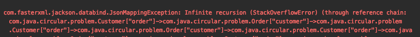
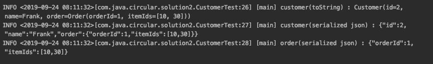
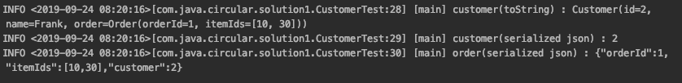
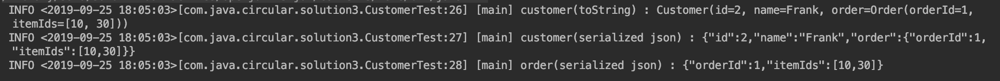

# 1. Introduction

In Jackson, objects connected by a bidirectional relationship have a problem where infinite recursion occurs. Let's look at a concrete example to see in what situations it happens and explore how it can be resolved.

## 1.1 Infinite Recursion

The Customer and Order objects have a circular reference to each other. This is the case where the Customer object holds an Order object, and the Order object holds a Customer object.

```java
@Setter
@Getter
@ToString
public class Customer {
    private int id;
    private String name;
    private Order order; //The Customer object holds an Order object
}
 
@Setter
@Getter
@ToString(exclude = "customer")
public class Order {
    private int orderId;
    private List<Integer> itemIds;
    private Customer customer; //The Order object also holds a Customer object
}
```

When you serialize the Customer object with Jackson, a JsonMappingException is thrown.

```java
@Test(expected = JsonMappingException.class)
public void infinite_recursion_이슈_발생() throws JsonProcessingException {
    Order order = new Order();
    order.setOrderId(1);
    order.setItemIds(List.of(10, 30));
 
    Customer customer = new Customer();
    customer.setId(2);
    customer.setName("Frank");
    customer.setOrder(order);
    order.setCustomer(customer);
 
    log.info("customer(toString) : {}", customer);
    log.info("customer(serialized json) : {}", objectMapper.writeValueAsString(customer)); //A JsonMappingException is thrown
}
```

This is the JsonMappingException error message.



# 2. Development Environment

For the code written in this post, please refer to the github below.

* OS : Mac OS
* IDE: Intellij
* Java : JDK 12
* Source code : [github](https://github.com/kenshin579/tutorials-java/tree/master/json-jackson)
* Software management tool : Maven

# 3. Solutions

## 3.1 Using the @JsonManagedReference and @JsonBackReference annotations

These are the annotations that were used to resolve circular references before Jackson version 2.0.

* @JsonManagedReference
    * Adding this annotation to the variable that will be referenced in the forward direction of a bidirectional relationship includes it in serialization
* @JsonBackReference
    * Adding this annotation as the back reference of a bidirectional relationship excludes it from serialization

By adding @JsonManagedReference to the Order object in the Customer object, and adding the @JsonBackReference annotation to the Customer object in Order, the Customer object is excluded from serialization.

```java
@Setter
@Getter
@ToString
public class Customer {
    private int id;
    private String name;
    @JsonManagedReference //Included when serialized
    private Order order;
}
 
@Setter
@Getter
@ToString(exclude = "customer”) //Excluded because infinite recursion also occurs when toString() runs
public class Order {
    private int orderId;
    private List<Integer> itemIds;
    @JsonBackReference //Excluded from serialization
    private Customer customer;
}
 
@Test
public void infinite_recursion_해결책_JsonManagedReference_JsonBackReference() throws JsonProcessingException {
    Order order = new Order();
    order.setOrderId(1);
    order.setItemIds(List.of(10, 30));
 
    Customer customer = new Customer();
    customer.setId(2);
    customer.setName("Frank");
    customer.setOrder(order);
    order.setCustomer(customer);
 
    log.info("customer(toString) : {}", customer);
    log.info("customer(serialized json) : {}", objectMapper.writeValueAsString(customer));
    log.info("order(serialized json) : {}", objectMapper.writeValueAsString(order)); //The customer info is excluded
}
```

**Execution screen**

Because of the @JsonBackReference annotation declaration, the information about the Customer object is left out from the Order object.



## 3.2 @JsonIdentityInfo - the recommended approach

This is an annotation newly added since Jackson 2.0. Add the @JsonIdentityInfo annotation and specify the attribute value to include in serialization in the 'property' attribute.

* @JsonIdentityInfo(generator = ObjectIdGenerators.PropertyGenerator.class)
    * The generator = ObjectIdGenerators.PropertyGenerator.class class is the class used to generate the Id used during circular references
* @JsonIdentityInfo(property = “id")
    * The property attribute specifies the name of the attribute of that class
    * In the example, id refers to Customer#id and is used as the back reference of Order#customer during serialization/deserialization

The @JsonIdentityReference annotation is frequently used together with @JsonIdentityInfo. I'll explain it in the next section.

```java
@Setter
@Getter
@ToString
@JsonIdentityInfo(generator = ObjectIdGenerators.PropertyGenerator.class,
        property = "id”) 
@JsonIdentityReference(alwaysAsId = true) //Output only as the id during serialization
public class Customer {
    private int id;
    private String name;
    private Order order;
}
 
@Test
public void infinite_recursion_해결책_JsonIdentityReference() throws JsonProcessingException {
    Order order = new Order();
    order.setOrderId(1);
    order.setItemIds(List.of(10, 30));
 
    Customer customer = new Customer();
    customer.setId(2);
    customer.setName("Frank");
    customer.setOrder(order);
    order.setCustomer(customer);
 
    log.info("customer(toString) : {}", customer);
    log.info("customer(serialized json) : {}", objectMapper.writeValueAsString(customer)); //Output only as the id
    log.info("order(serialized json) : {}", objectMapper.writeValueAsString(order));
}
```

**Execution screen**



### 3.2.1 What is @JsonIdentityReference?

The @JsonIdentityReference annotation makes an object be exposed simply as its object ID instead of being handled as a full POJO when it is serialized.

```java
@Setter
@Getter
@ToString
@JsonIdentityInfo(generator = ObjectIdGenerators.PropertyGenerator.class,
        property = "id")
@JsonIdentityReference(alwaysAsId = true)
public class Customer {
    private int id;
    private String name;
    private Order order;
}
```

When the @JsonIdentityReference annotation is not used, the entire contents of the object are serialized as shown below.

```java
@Test
public void JsonIdentityReferenceAnnotation이_없는_경우() throws JsonProcessingException {
    CustomerWithoutIdentityReference customer = new CustomerWithoutIdentityReference();
    customer.setId(1);
    customer.setName("Frank");
    String jsonOutput = objectMapper.writeValueAsString(customer);
    log.info("jsonOutput :{}", jsonOutput);
    assertThat(jsonOutput).isEqualTo("{\"id\":1,\"name\":\"Frank\",\"order\":null}");
}
```

**Execution screen**


However, when the @JsonIdentityReference annotation is used, the object is serialized only as its object ID.

```java
@Test
 public void JsonIdentityReferenceAnnotation이_있는_경우() throws JsonProcessingException {
     Customer customer = new Customer();
     customer.setId(1);
     customer.setName("Frank");
     String jsonOutput = objectMapper.writeValueAsString(customer);
     log.info("jsonOutput :{}", jsonOutput);
     assertThat(jsonOutput).isEqualTo("1");
 }
```

**Execution screen**


## 3.3 Using the @JsonIgnore annotation

Finally, the simplest way to resolve this is to add the @JsonIgnore annotation to the circularly referenced attribute during serialization, excluding it from serialization.

```java
@Setter
@Getter
@ToString(exclude = "customer")
public class Order {
    private int orderId;
    private List<Integer> itemIds;
    @JsonIgnore
    private Customer customer; //Ignored during serialization
}
 
@Slf4j
public class CustomerTest {
    private ObjectMapper objectMapper = new ObjectMapper();
 
    @Test
    public void infinite_recursion_해결책_JsonIgnore() throws JsonProcessingException {
        Order order = new Order();
        order.setOrderId(1);
        order.setItemIds(List.of(10, 30));
 
        Customer customer = new Customer();
        customer.setId(2);
        customer.setName("Frank");
        customer.setOrder(order);
        order.setCustomer(customer);
 
        log.info("customer(toString) : {}", customer);
        log.info("customer(serialized json) : {}", objectMapper.writeValueAsString(customer));
        log.info("order(serialized json) : {}", objectMapper.writeValueAsString(order)); //The customer info is excluded
    }
}
```

**Execution screen**

If you run the unit test, you can confirm that the customer information is excluded from the Order object.



# 4. Summary

When transferring data in web applications, the JSON format is generally used, and the Jackson library is widely used on the server side for JSON processing. When objects reference each other and a circular reference occurs, infinite recursion causes a StackOverflowError. We looked at three ways to resolve this.

# 5. References

* Jackson Infinite Recursion
    * [https://www.baeldung.com/jackson-bidirectional-relationships-and-infinite-recursion](https://www.baeldung.com/jackson-bidirectional-relationships-and-infinite-recursion)
    * [https://www.logicbig.com/tutorials/misc/jackson/json-identity-reference.html](https://www.logicbig.com/tutorials/misc/jackson/json-identity-reference.html)
    * [http://www.appsdeveloperblog.com/infinite-recursion-in-objects-with-bidirectional-relationships/](http://www.appsdeveloperblog.com/infinite-recursion-in-objects-with-bidirectional-relationships/)
    * [http://springquay.blogspot.com/2016/01/new-approach-to-solve-json-recursive.html](http://springquay.blogspot.com/2016/01/new-approach-to-solve-json-recursive.html)
    * [https://www.logicbig.com/tutorials/misc/jackson/json-identity-info-annotation.html](https://www.logicbig.com/tutorials/misc/jackson/json-identity-info-annotation.html)
* What is @JsonIdentityReference
    * [https://www.baeldung.com/jackson-advanced-annotations](https://www.baeldung.com/jackson-advanced-annotations)
