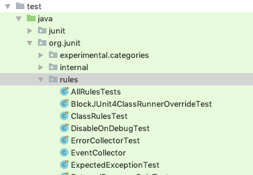
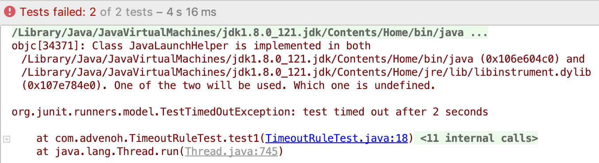
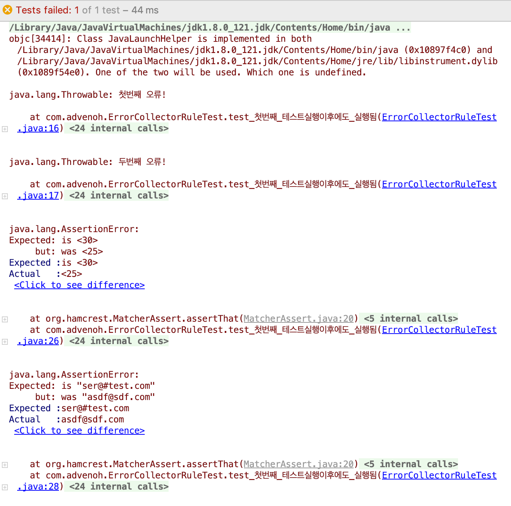
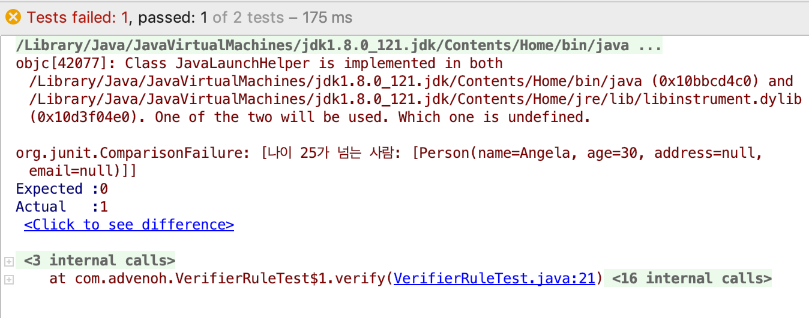
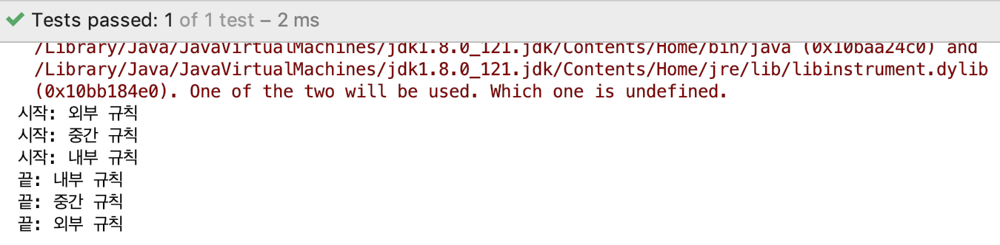
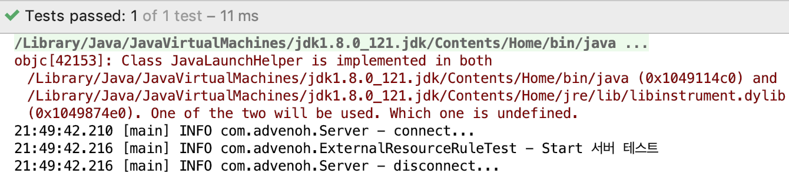
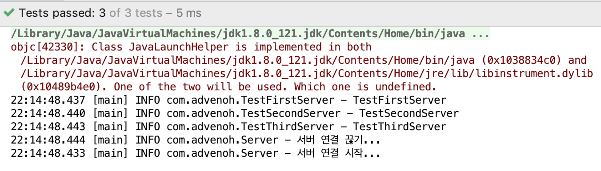
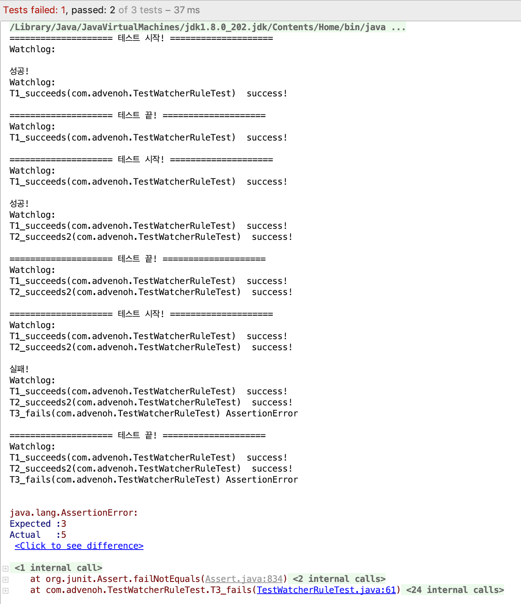
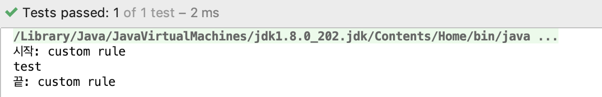

# 1. Introduction

JUnit Rules help you run additional code before and after a test case executes. You can also put pre/post processing code in methods declared with @Before and @After, but writing it as a JUnit Rule has the advantage that it can be reused or developed into more extensible functionality. The Rules that JUnit provides by default are as follows.

| Rules             | Description                                                  |
| ----------------- | ------------------------------------------------------------ |
| TemporaryFolder   | Automatically creates and deletes temporary folders and files before and after a test |
| ExternalResource  | Handles pre/post processing for external resources           |
| ExpectedException | Applies to the entire test class and lets you directly verify that exceptions occur |
| ErrorCollector    | Lets tests continue running even when multiple tests fail, collecting the errors that occur |
| Verifier          | Helps perform additional verification when a test runs.      |
| TestName          | Tells you the name of the test method being run              |
| RuleChain         | Helps you bundle and apply multiple Rules in chain form      |
| ClassRule         | A Rule that can be applied to an entire test class suite     |
| Timeout           | Sets a timeout for all tests in the test class               |

Besides the Rules provided by default, let's also look at how to create your own Rule directly.

# 2. Development Environment

- OS : Mac OS
- IDE: Intellij
- Java : JDK 1.8
- Source code : [github](https://github.com/kenshin579/tutorials-java/tree/master/junit-rule)
- Software management tool : Maven

I wrote several examples for this post, but if you want to see more diverse usage, you can find more varied examples by looking at the test cases included in the JUnit4 source code.



Add JUnit to the pom.xml file as a Maven dependency.

```xml
<dependency>
  <groupId>junit</groupId>
  <artifactId>junit</artifactId>
  <version>4.12</version>
  <scope>test</scope>
</dependency>
```

# 3. JUnit Rules

## 3.1 The Rules Provided by Default

Let's look at the most commonly used examples among JUnit Rules.

### 3.1.1 TemporaryFolder

The TemporaryFolder Rule is a Rule that automatically creates a file or folder when a test runs and automatically deletes it when the test finishes. When you create an arbitrary file, on Mac it is created in a folder like the one below.

```bash
/var/folders/f3/z3w0kdln2sn_7z0_qq6rn4dxrgwgh2/T/junit88560316993858696/test.txt
```

```java
public class TemporaryRuleTest {
   @Rule
   public TemporaryFolder tmpFolder = new TemporaryFolder();

   @Test
   public void test_임시파일_생성하기() throws IOException {
      File tmpFile = tmpFolder.newFile("test.txt");
      assertThat(tmpFile.isFile()).isTrue();
      assertThat(tmpFolder.getRoot()).isEqualTo(tmpFile.getParentFile());
   }

   @Test
   public void test_임시_폴더_생성하기() throws IOException {
      File tmpFile = tmpFolder.newFolder();
      assertThat(tmpFile.isDirectory()).isTrue();
   }
}
```

### 3.1.2 ExpectedException

The ExpectedException Rule can be used instead of @Test(expected = RunTimeException.class), and it lets you directly verify both the exception type and the exception message.

```java
public class ExpectedExceptionRuleTest {
   @Rule
   public ExpectedException exception = ExpectedException.none();

   @Test
   public void IllegalArgumentException_예외_발생_확인() {
      exception.expect(IllegalArgumentException.class);
      throw new IllegalArgumentException();
   }

   @Test
   public void RuntimeException_예외_발생시_메시지도_같이_확인() {
      exception.expect(RuntimeException.class);
      exception.expectMessage("failed!");
      throw new RuntimeException("failed!");
   }
}
```

### 3.1.3 Timeout

The Timeout Rule is a Rule that lets you set the same timeout for all tests.

```java
public class TimeoutRuleTest {
   @Rule
   public Timeout timeout = Timeout
         .builder()
         .withTimeout(2, TimeUnit.SECONDS)
         .build();

   @Test
   public void test1() {
      while (true) {
      }
   }

   @Test
   public void test2() {
      while (true) {
      }
   }
}
```

**Test result**

The timeout is set to 2 seconds, so if it runs for more than 2 seconds it throws a TimeOutException.



### 3.1.4 ErrorCollector

The ErrorCollector Rule is a feature that keeps running the test even if an assertion fails, collecting all the errors. It is useful when you want the test to continue even if there is a failure (e.g., network) occurring during test execution.

When using ErrorCollector, you use the following two methods.

- addError() : Adds an error so that when an exception occurs, the exception and its message are output together
- checkThat() : Checks whether the expected value and the actual value are the same, and continues the test even if the values differ

```java
public class ErrorCollectorRuleTest {
   @Rule
   public ErrorCollector collector = new ErrorCollector();

   @Test
   public void test_첫번째_테스트실행이후에도_실행됨() {
      collector.addError(new Throwable("First error!"));
      collector.addError(new Throwable("Second error!"));

      Person person = Person
            .builder()
            .name("Frank")
            .email("asdf@sdf.com")
            .age(25)
            .build();

      collector.checkThat(person.getAge(), is(30)); //Failure 1
      collector.checkThat(person.getName(), is("Frank")); //Success
      collector.checkThat(person.getEmail(), is("ser@#test.com")); //Failure 2
   }
}
```

**Test result**

If the expected value and the actual value differ, it just outputs the message added via addError() and continues the test for now. After the test runs, it outputs the result for each failure.



### 3.1.5 Verifier

The Verifier Rule runs every time a test executes and is used to add custom verification logic to check whether a specific condition is satisfied.

```java
public class VerifierRuleTest {
   int MAX_AGE = 25;
   List<Person> peopleWithAgeGreaterThanMaxAge = new ArrayList<>();

   @Rule
   public Verifier verifier = new Verifier() {
      @Override public void verify() {
         assertThat(peopleWithAgeGreaterThanMaxAge.size()).as("People older than age %d: %s", MAX_AGE, peopleWithAgeGreaterThanMaxAge).isEqualTo(0);
      }
   };

   @Test
   public void personTest1() {
      Person person = Person.builder()
            .name("Frank")
            .age(20)
            .build();
      if (person.getAge() > MAX_AGE) {
         peopleWithAgeGreaterThanMaxAge.add(person);
      }
   }

   @Test
   public void personTest2() {
      Person person = Person.builder()
            .name("Angela")
            .age(30)
            .build();
      if (person.getAge() > MAX_AGE) {
         peopleWithAgeGreaterThanMaxAge.add(person);
      }
   }
}
```

**Test result**

When all tests run, it additionally verifies whether a person's age is 25 or more. The second test, personTest2, failed because the age is 30.



### 3.1.6 TestName

The TestName Rule lets you retrieve the name of the method currently being run.

```java
public class TestNameRuleTest {
   @Rule
   public TestName name = new TestName();

   @Test
   public void 테스트1_이름이다() {
      assertEquals("테스트1_이름이다", name.getMethodName());
   }

   @Test
   public void 테스트2_이름이다() {
      assertEquals("테스트2_이름이다", name.getMethodName());
   }
}
```

## 3.2 RuleChain

The RuleChain Rule is a Rule that helps run multiple Rules sequentially when a test executes.

In the example, a custom-created LoggingRule is applied in chain form. You can understand LoggingRule as a Rule that outputs "start…" and "end…" log messages before and after each test; more details are covered in #3.2.

```java
public class RuleChainTest {
   @Rule
   public TestRule chain = RuleChain
         .outerRule(new LoggingRule("outer rule"))
         .around(new LoggingRule("middle rule"))
         .around(new LoggingRule("inner rule"));

   @Test
   public void test() {
   }
}
```

**Test result**



### 3.2.1 ExternalResource

The ExternalResource Rule is a Rule that connects to a resource so you can access an external resource (e.g., file, network socket, server, database connection, etc.) before the test, and automatically disconnects after the test finishes.

```java
@Slf4j
public class ExternalResourceRuleTest {
   public static Server server =  new Server();

   @Rule
   public final ExternalResource externalResource = new ExternalResource() {
      @Override protected void before() throws Throwable {
         server.connect();
      }
      @Override protected void after() {
         server.disconnect();
      }
   };

   @Test
   public void 서버테스트() throws Exception {
      log.info("Start server test");
   }
}

@Slf4j
public class Server {
   public void connect() {
      log.info("connect...");
   }

   public void disconnect() {
      log.info("disconnect...");
   }
}

```

**Test result**

It connects to the server before and after the test runs, and disconnects after it finishes.



### 3.2.2 ClassRule

When you use the ClassRule annotation together with the @Rule annotation, it integrates and runs the classes bundled as a TestSuite.

```java
@RunWith(Suite.class)
@Suite.SuiteClasses({ TestFirstServer.class, TestSecondServer.class, TestThirdServer.class })
@Slf4j
public class ExternalResourceClassRuleTest {
   public static Server server = new Server();

   @ClassRule
   @Rule
   public static final ExternalResource externalResource = new ExternalResource() {
      @Override protected void before() throws Throwable {
         server.connect();
      }
      @Override protected void after() {
         server.disconnect();
      }
   };
}

@Slf4j
public class TestFirstServer {
   @Test
   public void test() throws Exception {
      log.info("{}", this.getClass().getSimpleName());
   }
}
```

**Test result**

You can confirm that the server connection is made first before the multiple test classes start, and the server connection is closed after all tests finish.



### 3.2.3 TestWatcher

The TestWatcher Rule provides the ability to monitor the success or failure of test execution, helping you write test logs.

```java
@FixMethodOrder(MethodSorters.NAME_ASCENDING)
public class TestWatcherRuleTest {
   private static String watchedLog = "\n”;

   @Rule
   public TestRule watchman = new TestWatcher() {
      @Override
      public Statement apply(Statement base, Description description) {
         return super.apply(base, description);
      }

      @Override
      protected void succeeded(Description description) {
         watchedLog += description.getDisplayName() + " success!\n";
         System.out.println(String.format("Success!\nWatchlog: %s", watchedLog));
      }

      @Override
      protected void failed(Throwable e, Description description) {
         watchedLog += description.getDisplayName() + " " + e.getClass().getSimpleName() + "\n";
         System.out.println(String.format("Failure!\nWatchlog: %s", watchedLog));
      }

      @Override
      protected void starting(Description description) {
         super.starting(description);
         System.out.println(String.format("==================== Test start! ==================== \nWatchlog: %s", watchedLog));
      }

      @Override
      protected void finished(Description description) {
         super.finished(description);
         System.out.println(String.format("==================== Test end! ==================== \nWatchlog: %s", watchedLog));
      }
   };

   @Test
   public void T1_succeeds() {
      Assert.assertEquals(5, 5);
   }

   @Test
   public void T2_succeeds2() {
      Assert.assertEquals(2, 2);
   }

   @Test
   public void T3_fails() {
      Assert.assertEquals(3, 5);
   }
}
```

@FixMethodOrder is an annotation that determines the test execution order; in this example it is set to NAME_ASCENDING, so the tests run in the order of the method names. By overriding the starting(), finished(), succeeded(), and failed() methods defined in TestWatcher, the methods are called according to test start, end, success, and failure as their names suggest. In this example, every time it runs it stores the value into the watchedLog string in log form and outputs it to the screen.

**Test result**

The tests run in the order of the method names, and the log accumulates as each one runs.



## 3.3 Custom Rules

So far we have looked at the Rules JUnit provides by default. How to create a Rule directly is easier to understand by looking at the code introduced so far. As an example, let's look at the TemporaryFolder Rule.

```java
public class TemporaryFolder extends ExternalResource {
    private final File parentFolder;
    private File folder;
    public TemporaryFolder() {
        this(null);
    }

    public TemporaryFolder(File parentFolder) {
        this.parentFolder = parentFolder;
    }

    @Override
    protected void before() throws Throwable {
        create();
    }

    @Override
    protected void after() {
        delete();
    }
…(omitted)...
}
```

The TemporaryFolder class extends the ExternalResource class and implements the before() and after() methods. Before the test runs, the before() method runs and calls the create() method.

```java
public void create() throws IOException {
    folder = createTemporaryFolderIn(parentFolder);
}

private File createTemporaryFolderIn(File parentFolder) throws IOException {
    File createdFolder = File.createTempFile("junit", "", parentFolder);
    createdFolder.delete();
    createdFolder.mkdir();
    return createdFolder;
}
```

As you can tell from the createTemporaryFolderIn() method, it creates an arbitrary folder and returns a File class. After the test, the after() method runs and deletes the folder created in create().

```java
public abstract class ExternalResource implements TestRule {
    public Statement apply(Statement base, Description description) {
        return statement(base);
    }

    private Statement statement(final Statement base) {
        return new Statement() {
            @Override
            public void evaluate() throws Throwable {
                before();
                try {
                    base.evaluate();
                } finally {
                    after();
                }
            }
        };
    }

    protected void before() throws Throwable {
    }
    protected void after() {
    }
}

```

The ExternalResource class has the before() and after() methods we saw earlier and contains the basic pre/post processing algorithm. The apply() method is called and the pre/post processing logic runs. When the apply() method is actually called is something you can confirm in the JUnit4 source code.

Although the code is almost identical to the TemporaryFolder class, let's create a Rule that outputs 'start, end' before and after the test runs.

```java
public class LoggingRule implements TestRule {
   private String name;

   public LoggingRule(String name) {
      this.name = name;
   }
   public Statement apply(final Statement base, Description description) {
      return new Statement() {
         @Override
         public void evaluate() throws Throwable {
            try {
               System.out.println("Start: " + name);
               base.evaluate();
            } finally {
               System.out.println("End: " + name);
            }
         }
      };
   }
}
```

base.evaluate() is the point at which the test runs, and code was added to output a log before and after, together with the name passed in through the constructor.

```java
public class CustomRuleTest {
   @Rule
   public LoggingRule rule = new LoggingRule("custom rule”);

   @Test
   public void test() {
      System.out.println("test running");
   }
}

```

**Test result**



# 4. Conclusion

I learned that JUnit has various features called Rules through this study opportunity. I tend to write a lot of test code while working on projects, and I think there are parts I can apply more usefully through JUnit Rules. Let's wrap up today's post here.

# 5. References

- JUnit Rules
    - [https://github.com/junit-team/junit4/wiki/rules](https://github.com/junit-team/junit4/wiki/rules)
    - [https://www.swtestacademy.com/junit-rules/](https://www.swtestacademy.com/junit-rules/)
    - [https://www.alexecollins.com/tutorial-junit-rule/](https://www.alexecollins.com/tutorial-junit-rule/)
    - [https://stefanbirkner.github.io/system-rules/](https://stefanbirkner.github.io/system-rules/) \* [http://kwonnam.pe.kr/wiki/java/junit/rule](http://kwonnam.pe.kr/wiki/java/junit/rule)
