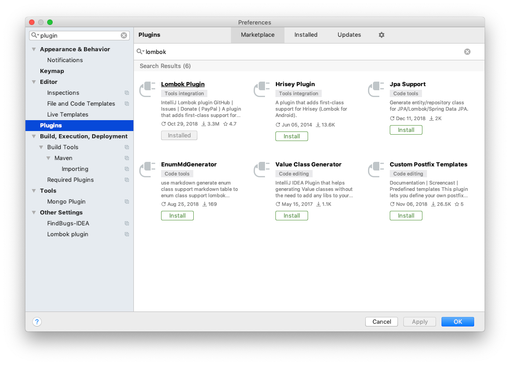
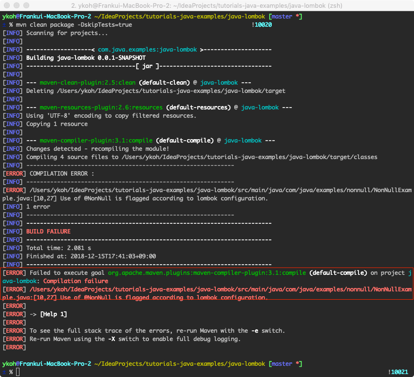

# 1. Introduction
Lombok is a library that automatically generates the boilerplate code you have to write in Java (e.g., getter/setter, constructor, toString) through declared annotations.

It has the advantage that the code itself becomes more concise, improving readability, and you can develop faster. However, there are definitely parts that require caution when using Lombok. (Reference: Lombok Pitfall)
So I recommend understanding it correctly and using it carefully. In this post, let's write mainly about the frequently used annotations.

# 2. Environment Setup

The code is written based on the environment below. You need to install the Lombok plugin in your IDE for the annotations to be recognized.

- OS: Mac OS
- IDE: Intelij
- Java : JDK 11
- Source code : [github](https://github.com/kenshin579/tutorials-java-examples/tree/master/java-lombok)
- Software management tool : Maven
- IDE Plugin :  Lombok Plugin



* Java Bytecode Decompiler : Enable - You can decompile a class file to view its source

Add the lombok dependency to the pom.xml file.

```xml
<dependency>
  <groupId>org.projectlombok</groupId>
  <artifactId>lombok</artifactId>
  <version>1.18.4</version>
</dependency>
```

# 3. Representative Examples

Let's look mainly at the frequently used annotations.

- @NonNull
- @Getter, @Setter
- @ToString
- @AllArgsConstructor, @AllArgsConstructor, @NoArgsConstructor
- @EqualsAndHashCode
- @Builder
- @Data
- @Slf4j, @Log, @Log4j, @Log4j2
- Lombok Configuration

## @NonNull

If you add the @NonNull annotation to a method or constructor argument, Lombok generates a null-check statement.

```java
//Using Lombok
public class NonNullExample extends Something {
    private String name;

    public NonNullExample(@NonNull Person person) {
        super("Hello");
        this.name = person.getName();
    }
}
```

```java
//Vanilla Java
public class NonNullExample extends Something {
    private String name;

    public NonNullExample(@NonNull Person person) {
        super("Hello");
        if (person == null) {
            throw new NullPointerException("person is marked @NonNull but is null");
        } else {
            this.name = person.getName();
        }
    }
}
```

If you want to see the vanilla version of the Java source as shown above, enable the Java Bytecode Decompiler plugin in your IDE, then click the relevant class to directly view the source code.

## @Getter, @Setter

It generates getter and setter methods for class fields, and you can auto-generate various code with several options. Setters are generated for fields that are not final.

- Apply to the entire class

- Apply to each class field

- Change the method's access modifier

    - @Setter(AccessLevel.PROTECTED)

- Method chaining (setter)

    - @Accessors(chain = true)


**Using Lombok**

```java
//Ex1 - Lombok
@Getter
@Setter
public class Person {
    String name;
    int age;
}

//Ex1 - Vanilla Java
public class Person {
    String name;
    int age;

    public Person() {
    }

    public String getName() {
        return this.name;
    }

    public int getAge() {
        return this.age;
    }

    public void setName(String name) {
        this.name = name;
    }

    public void setAge(int age) {
        this.age = age;
    }
}
```

```java
//Ex2 - Lombok
//Access modifier
public class PersonAccessLevel {
    @Getter
    @Setter
    String name;

    @Setter(AccessLevel.PROTECTED)
    int age;
}

//Ex2 - Vanilla Java
public class PersonAccessLevel {
    String name;
    int age;

    public PersonAccessLevel() {
    }

    public String getName() {
        return this.name;
    }

    public void setName(String name) {
        this.name = name;
    }

    protected void setAge(int age) {
        this.age = age;
    }
}
```

```java
//Ex3 - Lombok
//Method chaining
@Setter
@Accessors(chain = true)
public class PersonSetterChain {
    String name;

    int age;
}

//Ex3 - Vanilla Java
public class PersonSetterChain {
    String name;
    int age;

    public PersonSetterChain() {
    }

    public PersonSetterChain setName(String name) {
        this.name = name;
        return this;
    }

    public PersonSetterChain setAge(int age) {
        this.age = age;
        return this;
    }
}
```

## @ToString

It automatically generates the class's toString method, and with options you can also specify fields to exclude from toString.

- Specify fields to exclude from the method

    - @ToString.Exclude

- Specify fields you want to add to the method


```java
//Ex1 - Lombok
@ToString
public class Person {
    String name;
    int age;
}

//Ex1 - Vanilla Java
public class Person {
    String name;
    int age;

    public Person() {
    }

    public String toString() {
        return "Person(name=" + this.name + ", age=" + this.age + ")";
    }
}
```

```java
//Ex2 - Lombok
@ToString
public class PersonExclude {
    @ToString.Include
    String name;

    @ToString.Exclude
    int age;
}

//Ex2 - Vanilla Java
public class PersonExclude {
    String name;
    int age;

    public PersonExclude() {
    }

    public String toString() {
        return "PersonExclude(name=" + this.name + ")";
    }
}
```

## @EqualsAndHashCode

An annotation that automatically generates equals() and hashCode().

- Specify fields to exclude
    - @EqualsAndHashCode.Exclude

The vanilla Java code is too long, so it is omitted. For the actual code, please check the compiled class file.

```java
//Ex1 - Lombok
@EqualsAndHashCode
public class Person {
    String name;
    int age;
}

//Ex1 - Vanilla Java
public class Person {
    String name;
    int age;

    public Person() {
    }

    public boolean equals(Object o) {
        ….
    }

    protected boolean canEqual(Object other) {
        return other instanceof Person;
    }

    public int hashCode() {
        int PRIME = true;
        int result = 1;
        Object $name = this.name;
        int result = result * 59 + ($name == null ? 43 : $name.hashCode());
        result = result * 59 + this.age;
        return result;
    }
}
```

```java
//Ex2 - Lombok
@EqualsAndHashCode
public class PersonExclude {
    String name;
    @EqualsAndHashCode.Exclude
    int age;
}

//Ex2 - Vanilla Java
public class PersonExclude {
    String name;
    int age;

    public PersonExclude() {
    }

    public boolean equals(Object o) {
       ….
    }

    protected boolean canEqual(Object other) {
        return other instanceof PersonExclude;
    }

    public int hashCode() {
        int PRIME = true;
        int result = 1;
        Object $name = this.name;
        int result = result * 59 + ($name == null ? 43 : $name.hashCode());
        return result;
    }
}
```

## @NoArgsConstructor, @AllArgsConstructor, @RequiredArgsConstructor

An annotation that automatically generates constructors. The constructor arguments are determined by the order of field declaration. It is good to remember that if you refactor later, the argument order may change.

- NoArgsConstructor : A constructor with no arguments
- AllArgsConstructor : A constructor that takes all fields as arguments
- RequiredArgsConstructor(staticName=“of") : Generates a static factory method

```java
//Ex1 - Lombok
@NoArgsConstructor
public class PersonNoArgs {
    String name;
    int age;
}

//Ex1 - Vanilla Java
public class PersonNoArgs {
    String name;
    int age;

    public PersonNoArgs() {
    }
}
```

```java
//Ex2 - Lombok
@RequiredArgsConstructor(staticName = "of")
@AllArgsConstructor(access = AccessLevel.PROTECTED)
public class PersonArgs {
    String name;
    int age;
}

//Ex2 - Vanilla Java
public class PersonArgs {
    String name;
    int age;

    private PersonArgs() {
    }

    public static PersonArgs of() {
        return new PersonArgs();
    }

    protected PersonArgs(String name, int age) {
        this.name = name;
        this.age = age;
    }
}
```

## @Data

The @Data annotation is an annotation to which all of the annotations below are applied.

- @ToString
- @EqualsAndHashCode
- @Getter, @Setter
- @RequiredArgsConstructor

```java
//Using Lombok
@Data
public class Person {
    String name;
    int age;
}

//Vanilla Java
public class Person {
    String name;
    int age;

    public Person() {
    }

    public String getName() {
        return this.name;
    }

...
    public String toString() {
        return "Person(name=" + this.getName() + ", age=" + this.getAge() + ")";
    }
}
```

## @Builder

It generates the [Builder Pattern](https://en.wikipedia.org/wiki/Builder_pattern#Java) with a single annotation. The builder pattern is a pattern that configures various settings and then creates an object. For more details, please check the references below.

```java
//Using Lombok
@Builder
@ToString
public class Car {
    private int wheels;
    private String color;

    public static void main(String[] args) {
        System.out.println(Car.builder().color("red").wheels(2).build());
    }
}

/* OUTPUT
Car(wheels=2, color=red)
*/ 

//Vanilla Java
public class Car {
    private int wheels;
    private String color;

    public static void main(String[] args) {
        System.out.println(builder().color("red").wheels(2).build());
    }

    Car(int wheels, String color) {
        this.wheels = wheels;
        this.color = color;
    }

    public static Car.CarBuilder builder() {
        return new Car.CarBuilder();
    }

    public String toString() {
        return "Car(wheels=" + this.wheels + ", color=" + this.color + ")";
    }

    public static class CarBuilder {
        private int wheels;
        private String color;

        CarBuilder() {
        }

        public Car.CarBuilder wheels(int wheels) {
            this.wheels = wheels;
            return this;
        }

        public Car.CarBuilder color(String color) {
            this.color = color;
            return this;
        }

        public Car build() {
            return new Car(this.wheels, this.color);
        }

        public String toString() {
            return "Car.CarBuilder(wheels=" + this.wheels + ", color=" + this.color + ")";
        }
    }
}
```

## @Slf4j, (@Log, @Log4j, @Log4j2, etc)

You can choose and declare the logging framework you want to use logging more easily.

```java
//Using Lombok
@Builder
@ToString
public class Car {
    private int wheels;
    private String color;

    public static void main(String[] args) {
        System.out.println(Car.builder().color("red").wheels(2).build());
    }
}

/* OUTPUT
Car(wheels=2, color=red)
*/ 

//Vanilla Java
public class Car {
    private int wheels;
    private String color;

    public static void main(String[] args) {
        System.out.println(builder().color("red").wheels(2).build());
    }

    Car(int wheels, String color) {
        this.wheels = wheels;
        this.color = color;
    }

    public static Car.CarBuilder builder() {
        return new Car.CarBuilder();
    }

    public String toString() {
        return "Car(wheels=" + this.wheels + ", color=" + this.color + ")";
    }

    public static class CarBuilder {
        private int wheels;
        private String color;

        CarBuilder() {
        }

        public Car.CarBuilder wheels(int wheels) {
            this.wheels = wheels;
            return this;
        }

        public Car.CarBuilder color(String color) {
            this.color = color;
            return this;
        }

        public Car build() {
            return new Car(this.wheels, this.color);
        }

        public String toString() {
            return "Car.CarBuilder(wheels=" + this.wheels + ", color=" + this.color + ")";
        }
    }
}

```

## Lombok Configuration

You can configure things such as disabling the features Lombok provides. Create a lombok.config file in the project root and write the settings you want in key=value form. For specific settings, please refer to the [Lombok Configuration system](https://projectlombok.org/features/configuration).

Example - setting (disallow @NonNull usage)

```properties
lombok.nonNull.flagUsage=error
```

It is not shown in the IDE, but a compile error occurs.



# 4. References

- Lombok
    - [http://jnb.ociweb.com/jnb/jnbJan2010.html](http://jnb.ociweb.com/jnb/jnbJan2010.html)
    - [https://projectlombok.org/](https://projectlombok.org/)
    - [http://www.vogella.com/tutorials/Lombok/article.html](http://www.vogella.com/tutorials/Lombok/article.html)
    - [http://www.daleseo.com/lombok-popular-annotations/](http://www.daleseo.com/lombok-popular-annotations/)
    - [https://projectlombok.org/features/all](https://projectlombok.org/features/all)
    - [http://edoli.tistory.com/99](http://edoli.tistory.com/99)
    - [https://codeburst.io/how-to-write-less-and-better-code-or-project-lombok-d8d82eb3e80a](https://codeburst.io/how-to-write-less-and-better-code-or-project-lombok-d8d82eb3e80a)
    - [https://www.baeldung.com/intro-to-project-lombok](https://www.baeldung.com/intro-to-project-lombok)
- Lombok Pitfall
    - [http://kwonnam.pe.kr/wiki/java/lombok/pitfall](http://kwonnam.pe.kr/wiki/java/lombok/pitfall)
    - [https://www.popit.kr/실무에서-lombok-사용법/](https://www.popit.kr/%EC%8B%A4%EB%AC%B4%EC%97%90%EC%84%9C-lombok-%EC%82%AC%EC%9A%A9%EB%B2%95/)
- Lombok Config
    -  [https://projectlombok.org/features/configuration](https://projectlombok.org/features/configuration)
- Builder pattern
    -  [https://en.wikipedia.org/wiki/Builder_pattern#Java](https://en.wikipedia.org/wiki/Builder_pattern#Java)
