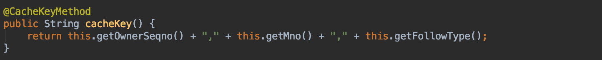

This is material where I personally jot down things I don't know and briefly organize what I come to learn.
If you know something among the unanswered questions, please leave a comment. Thank you.

# Full Q&A List

## [Answered]

## 1. What is @CacheKeyMethod?

It is an SSM-related annotation and a method that provides the key value; if there is none, it calls toString(). Additionally, if the namespace within the cache uses toString() and the same key exists, a collision occurs.

Reference
* [https://m.blog.naver.com/PostView.nhn?blogId=kbh3983&logNo=220934569378&proxyReferer=https%3A%2F%2Fwww.google.co.kr%2F](https://m.blog.naver.com/PostView.nhn?blogId=kbh3983&logNo=220934569378&proxyReferer=https%3A%2F%2Fwww.google.co.kr%2F)

## 2. Why should we cache DB data?

There is an issue where fetching data from the DB every time is very slow.

Reference
* [https://charsyam.wordpress.com/2016/07/27/입-개발-왜-cache를-사용하는가/](https://charsyam.wordpress.com/2016/07/27/%EC%9E%85-%EA%B0%9C%EB%B0%9C-%EC%99%9C-cache%EB%A5%BC-%EC%82%AC%EC%9A%A9%ED%95%98%EB%8A%94%EA%B0%80/)

- - - -
- 
## [Unanswered Questions]

### -
