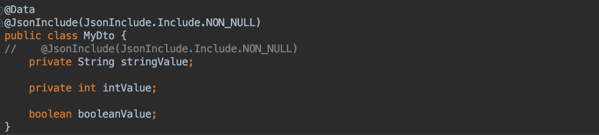
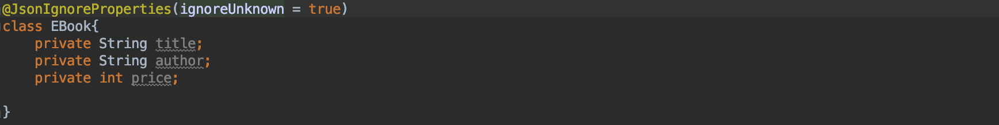
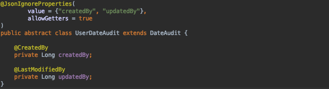
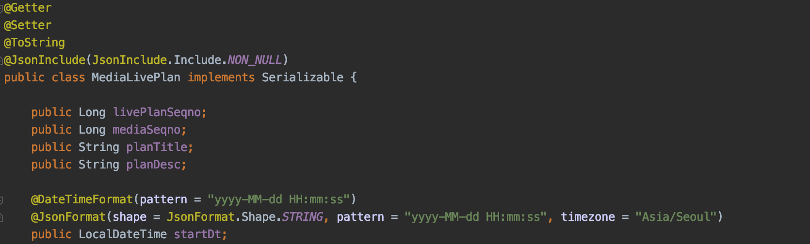
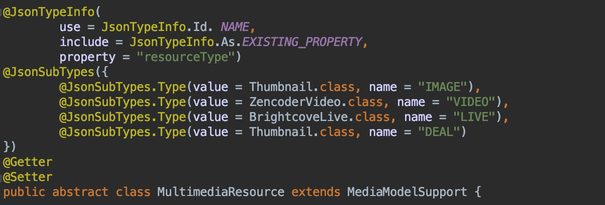
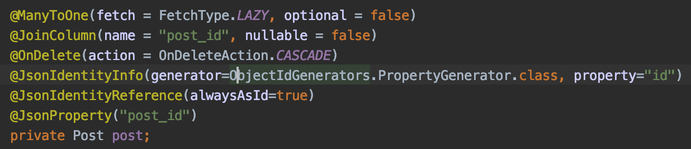

This is material where I personally jot down things I don't know and briefly organize what I come to learn.
If you know something among the unanswered questions, please leave a comment. Thank you.

# Full Q&A List

## [Answered]

## 1. @JsonInclude(Include.NON_NULL)?

This annotation excludes class fields that are null from being serialized to JSON. In the code above, the stringValue variable is not stored in the JSON.

Terminology
* The task of converting a Java object to JSON is referred to as serialize, and JSON -> object is called deserialize

Reference
* [http://multifrontgarden.tistory.com/172](http://multifrontgarden.tistory.com/172)

## 2. @JsonIgnore?

This is an annotation you declare above a variable when you don't want to include that field during serialization. In this example, the @JsonIgnore annotation was applied because the password must not be present when fetching a domain object through JPA.

Reference

* [http://eglowc.tistory.com/28](http://eglowc.tistory.com/28)

## 3. @JsonIgnoreProperties(ignoreUnknown = true)?

This is an annotation that ignores the Exception that occurs when a property that does not exist on the object is included in the JSON.

Reference
* [https://www.javacodegeeks.com/2018/01/ignore-unknown-properties-parsing-json-java-jackson-jsonignoreproperties-annotation-example.html](https://www.javacodegeeks.com/2018/01/ignore-unknown-properties-parsing-json-java-jackson-jsonignoreproperties-annotation-example.html)

## 4. What happens if you set allowGetters to true in @JsonIgnoreProperties?

When specifying the properties to ignore with @JsonIgnoreProperties, setting allowGetters to true means that the specified fields are applied for JSON serialization (Object -> JSON), but are excluded for deserialization (JSON -> Object).

Reference
* [https://www.concretepage.com/jackson-api/jackson-jsonignore-jsonignoreproperties-and-jsonignoretype#allowGetters](https://www.concretepage.com/jackson-api/jackson-jsonignore-jsonignoreproperties-and-jsonignoretype#allowGetters)

## 5. What do serialization and deserialization mean in Jackson?

- Jackson
    - Serialization
        - Converting a Java Object -> Jackson JSON.
    - Deserialization
        - Converting Jackson JSON -> Java Object
- Java (for reference)
    - Serialization
        - Java Object -> byte form
    - Deserialization
        - byte form -> Java Object

Reference

- Jackson
    - [https://homoefficio.github.io/2016/11/19/%EC%A1%B0%EA%B8%88%EC%9D%80-%EC%8B%A0%EA%B2%BD%EC%8D%A8%EC%A4%98%EC%95%BC-%ED%95%98%EB%8A%94-Jackson-Custom-Deserialization/](https://homoefficio.github.io/2016/11/19/조금은-신경써줘야-하는-Jackson-Custom-Deserialization/)
    - [https://thepracticaldeveloper.com/2018/07/31/java-and-json-jackson-serialization-with-objectmapper/](https://thepracticaldeveloper.com/2018/07/31/java-and-json-jackson-serialization-with-objectmapper/)
- Java

- https://nesoy.github.io/articles/2018-04/Java-Serialize

- - - -

## [Unanswered Questions]

### - What is the difference between @DateTimeFormat vs @JsonFormat?
* DateTimeFormat : DateTimeFormat
* JsonFormat : jackson

### - @JsonTypInfo, @JsonSubTypes?

Reference
* [https://www.slipp.net/questions/442](https://www.slipp.net/questions/442)
* [https://seongtak-yoon.tistory.com/70](https://seongtak-yoon.tistory.com/70)

### - @JsonManagedReference
### - @JsonBackReference

### - What are @JsonIdentityInfo and @JsonIdentityReference?

- When querying data from entities connected with @OneToMany, @ManyToOne, an Infinite recursion JsonMappingException occurs
- Solution
    * Jackson 1/6+
        * Use @JsonManagedReference, @JsonBackReference
    * Jackson 2.0+
        * Use @JsonIdentityInfo

