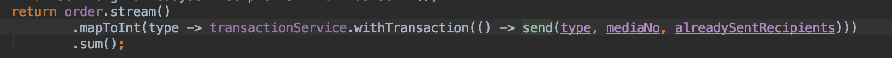
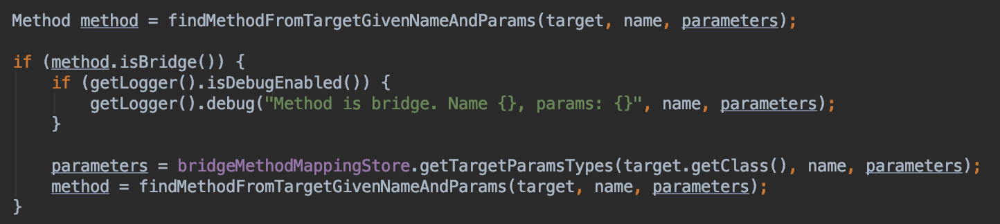
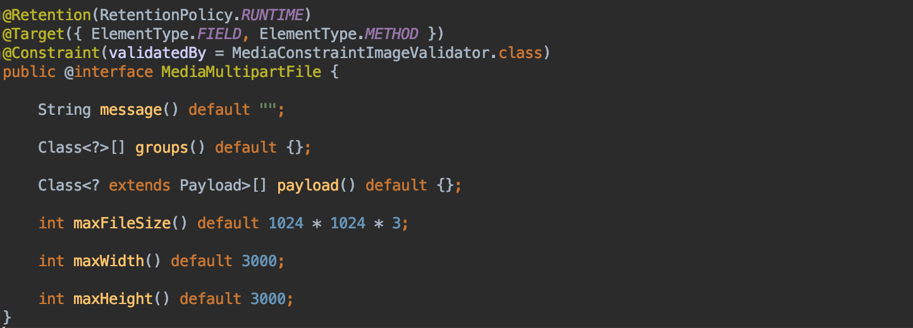
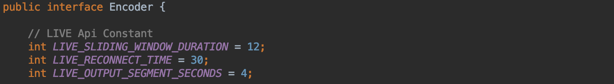
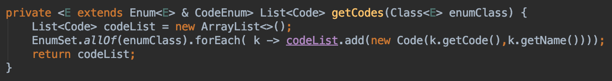
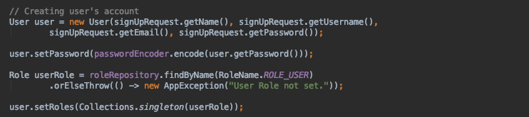

This is material where I personally jot down things I don't know and briefly organize what I come to learn.
If you know something among the unanswered questions, please leave a comment. Thank you.

# Full Q&A List

## [Unanswered Questions]

## - What is mapToInt(ToIntFunction mapper) in java8?
- As an intermediate operation, it runs the mapper on each element of the stream and returns an IntStream

Reference

* [https://www.geeksforgeeks.org/stream-maptoint-java-examples/](https://www.geeksforgeeks.org/stream-maptoint-java-examples/)

## - What is a bridge method?

## - What does this mean?
- Does it restrict what JobKey can inherit?

## - What is the facade pattern?
## - What is the strategy pattern?

## - @Constraint(validateBy…?)

### Reference

- [https://dzone.com/articles/create-your-own-constraint-with-bean-validation-20](https://dzone.com/articles/create-your-own-constraint-with-bean-validation-20)

---

## [Answered]

## 1. Why are Constants values defined in an interface? Why not in a final class?

You can also specify Constants values in an interface. This approach is mentioned as one that is not recommended. If you look, you can often find projects in open source that also define them in an interface.

Reference

* [http://www.javapractices.com/topic/TopicAction.do?Id=32](http://www.javapractices.com/topic/TopicAction.do?Id=32)
* [https://stackoverflow.com/questions/40990356/interface-constants-vs-class-constants-variables](https://stackoverflow.com/questions/40990356/interface-constants-vs-class-constants-variables)
* [https://veerasundar.com/blog/2012/04/java-constants-using-class-interface-static-imports/](https://veerasundar.com/blog/2012/04/java-constants-using-class-interface-static-imports/)

## 2. What does & mean when declaring generics in a method?

It means the incoming argument must be an Enum type and must be a type that implements the CodeEnum interface. In short, it means it must be a type that satisfies both.

Reference

* [https://stackoverflow.com/questions/21142467/generics-ambiguity-with-the-operator-and-order](https://stackoverflow.com/questions/21142467/generics-ambiguity-with-the-operator-and-order)
* [https://stackoverflow.com/questions/745756/java-generics-wildcarding-with-multiple-classes](https://stackoverflow.com/questions/745756/java-generics-wildcarding-with-multiple-classes)

## 3. What is the difference between submit and execute() in ExecutorService?

- submit : Executes a task and receives the executed result as a Future object, letting you manage the task later by calling cancel(), get().
- execute : Executes a task and does not receive a result separately

Reference

* [https://stackoverflow.com/questions/18730290/what-is-the-difference-between-executorservice-submit-and-executorservice-execut](https://stackoverflow.com/questions/18730290/what-is-the-difference-between-executorservice-submit-and-executorservice-execut)

## 4. When do you use the Collections.singleton() method?

The singleton() method is a method that returns an immutable set from a single object passed as an argument. It is used to pass only one element when a collection interface is taken as an argument, as with a list's removeAll(). Without having to create a collection and add elements one by one, you can use it easily by calling the singleton(value) method to return an object.

List<Integer> list = Arrays.asList(1, 2, 3, 4, 4);
live.removeAll(Collections.singleton(4);

- Set : Collections.singleton(T o)
- List : Collections.singleList(T o)
- Map : Collections.singleMap(K, V)

### Reference

* [https://java2free.tistory.com/entry/%EC%9E%90%EB%B0%94-Collection](https://java2free.tistory.com/entry/%EC%9E%90%EB%B0%94-Collection)
* [https://www.javatpoint.com/java-collections-singleton-method](https://www.javatpoint.com/java-collections-singleton-method)
* [https://stackoverflow.com/questions/4801794/use-of-javas-collections-singletonlist](https://stackoverflow.com/questions/4801794/use-of-javas-collections-singletonlist)
* [https://stackoverflow.com/questions/4801794/use-of-javas-collections-singletonlist](https://stackoverflow.com/questions/4801794/use-of-javas-collections-singletonlist)
