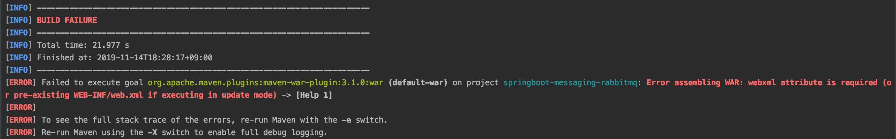

This is material where I personally jot down things I don't know and briefly organize what I come to learn.
If you know something among the unanswered questions, please leave a comment. Thank you.

# Full Q&A List


## <span style="color:orange">[Answered]</span>

## <span style="color:brown">1. How do you run the unit test of a specific class's method with maven?</span>
If you specify it in the format **package name.file name#method name** in the -Dtest= option, you can run the method you want. In Maven, the -D option is the option for specifying a system property.

```bash
$ mvn -h #See Maven options
$ mvn clean test -Dtest=com.tmoncorp.media.common.util.FileUtilTest#getFileNameBaseCurrentTimestamp -Dmaven.test.skip=true
```


## <span style="color:brown">2. webxml attribute is required... when running Maven?</span>

```java
$ mvn clean package
```
The solution for the case where the error "webxml attribute is required..." occurs during maven compilation is as follows.



1. If the servlet container is 3 or lower, you need to create WEB-INF/web.xml
2. If the servlet container is 3 or higher and there is no web.xml, configure it to be ignored by setting failOnMissingWebXml=false

```xml
<build>
    <plugins>
        <plugin>
            <groupId>org.springframework.boot</groupId>
            <artifactId>spring-boot-maven-plugin</artifactId>
        </plugin>
        <plugin>
            <groupId>org.apache.maven.plugins</groupId>
            <artifactId>maven-war-plugin</artifactId>
            <configuration>
                <failOnMissingWebXml>false</failOnMissingWebXml>
            </configuration>
        </plugin>
    </plugins>
</build>
```


## Reference

-  https://www.mkyong.com/maven/maven-webxml-attribute-is-required/

---

# <span style="color:orange">[Unanswered Questions]</span>
