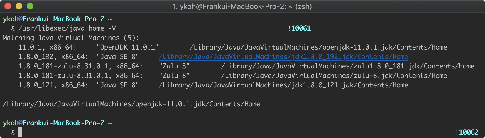
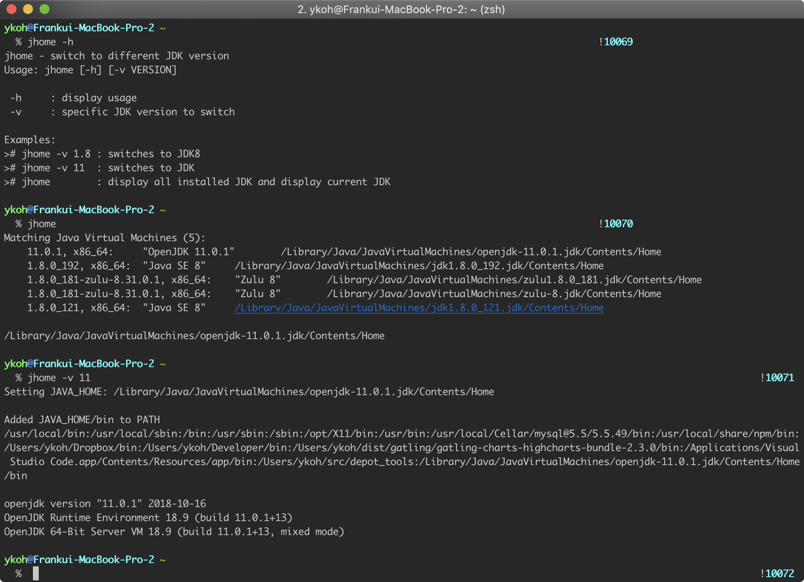

When developing in Java, you often need to install not just one JDK version but multiple versions. The JDK version you develop with may differ slightly for each project you work on, and when you want to install a newly released version to study it, multiple versions end up existing. Even though multiple versions exist on a single system, the JDK does not provide a command that lets you easily switch from one version to another. The developer has to switch manually on their own.

In this post, targeting the Mac environment, let's look at how you can easily switch between multiple JDK versions.

# 1. Installing Multiple JDK Versions

First, shall we install multiple JDK versions? Let's install three JDK versions with the brew command.

```bash
$ brew cask install java java8 zulu8
```

- java : OpenJDK 11
- java8 : Oracle JDK 8
- zulu8 : Azul Zulu Java JDK

# 2. Trying to Switch Between Versions

To check all currently installed JDKs, you can use the java_home -V command. On my Mac, a total of four JDKs are installed.

```bash
$ /usr/libexec/java_home -V
```



To compile and run a Java program with the JDK version you want, you basically need to do the following two things.

- Modify the JAVA_HOME environment variable
    - JAVA_HOME=“/Library/Java/JavaVirtualMachines/jdk1.8.0_121.jdk/Contents/Home"
- Add the JDK/bin folder to PATH as well
    - `PATH=$PATH:$JAVA_HOME/bin`

For environment variables, you can mostly just edit the environment file of the shell you use. I use the zsh shell, so I modified .zshrc as follows.

```bash
$ code ~/.zshrc
```

Insert the source code

This is the execution screen. Since this is a part that is easier to understand with the help text, I'll skip a separate explanation.



# 3. References

- Changing the default Java JDK on OS X
    - [https://stackoverflow.com/questions/21964709/how-to-set-or-change-the-default-java-jdk-version-on-os-x](https://stackoverflow.com/questions/21964709/how-to-set-or-change-the-default-java-jdk-version-on-os-x)
