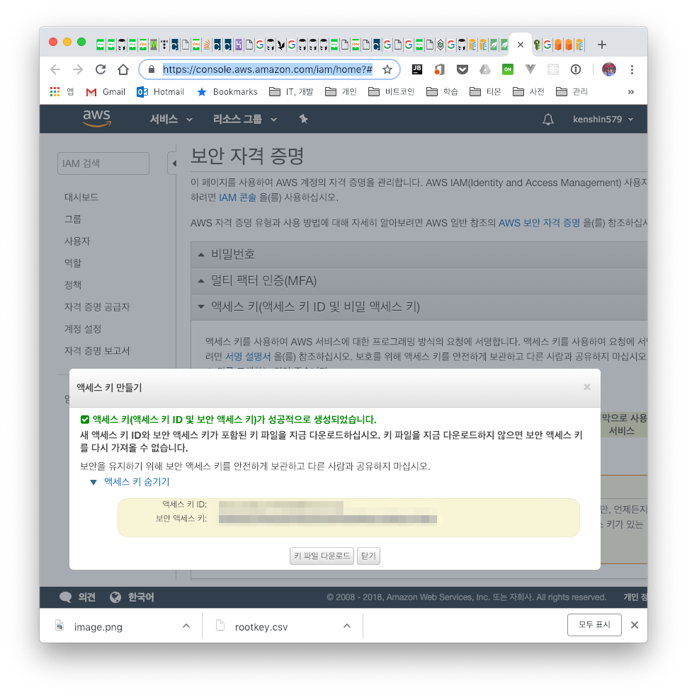

# 1. Introduction

In enterprises and elsewhere, there is now hardly any place that doesn't use Amazon services, with each company using Amazon's services a lot. The place I recently moved to also uses the S3 (Simple Storage Service) storage service, so I organized this as a way to learn the S3 API.

S3 is REST/HTTP-based storage for storing files, and it has the following characteristics, which is why many places use S3.

- S3 service characteristics
    - It supports 3-copy replication, guaranteeing data reliability (99.9999%)
    - There is no limit on capacity or the number of files (e.g., 1B ~ 5TB per file)
    - It provides versioning, so even files deleted by mistake can be restored
    - It can be easily integrated with other Amazon services (e.g., CloudFront, Glacier)

- Terminology
    - Object: The basic unit stored in S3; you can think of it as a single file
    - Key: A unique identifier used to store an object within a bucket
        - e.g., test.xls, thumbs/main.jpg
    - Bucket: A concept similar to a directory; you store objects in a bucket
        - There is no hierarchical structure of sub-buckets or sub-folders, but you can create a logical hierarchy using key name prefixes and delimiters (e.g., develop/test.xls)

# 2. Development Environment and S3 Basic Setup

Most of the source code was written while looking at the examples in the [Amazon SDK](https://docs.aws.amazon.com/ko_kr/sdk-for-java/v1/developer-guide/examples-s3.html) and [Baeldung](https://www.baeldung.com/aws-s3-java).

- OS : Mac OS
- IDE: Intellij
- Java : JDK 1.8
- Source code : [github](https://github.com/kenshin579/tutorials-java-examples/tree/master/amazon-s3)
- Software management tool : Maven

Add the Amazon SDK dependency to the pom.xml file.

```xml
<dependency>
    <groupId>com.amazonaws</groupId>
    <artifactId>aws-java-sdk</artifactId>
    <version>1.11.154</version>
</dependency>
```

## 2.1 S3 Basic Setup

To use the AWS SDK, you must complete the following three things to be able to connect to S3 and work with it in code.

- Create an AWS account
    - If you don't have an account, create an [AWS account](https://portal.aws.amazon.com/gp/aws/developer/registration/index.html)
- AWS security credentials (you need these when coding)
    - To connect to S3, you need an access key ID and a secret access key
    - Go to the [security credentials](https://console.aws.amazon.com/iam/home?#/security_credential) site to use in your code and obtain them as shown below
      

- Choose an AWS region
    - Since S3 pricing differs by region, it is good to choose the nearest region

# 3. Handling Files in an S3 Bucket

## 3.1 Client Connection

You need to create a client connection to access the S3 service. You need the KEY_ID and SECRET_ACCESS_KEY created above.

### 3.1.1 Specifying Explicitly

There is a way to get the client connection by passing KEY_ID and SECRET_ACCESS_KEY as arguments within the source code to create a BasicAWSCredentials object.

```java
AmazonS3ClientBuilder
      .standard()
      .withCredentials(new AWSStaticCredentialsProvider(new BasicAWSCredentials(
            KEY_ID,
            SECRET_ACCESS_KEY)
      ))
      .withRegion(Regions.AP_NORTHEAST_2)
      .build();
```

```java
public class S3App {
   private static final AWSCredentials credentials;
   private static final String KEY_ID = "<key_id>";


   private static final String SECRET_ACCESS_KEY = "<secret_access_key>";
   private static AmazonS3 s3client;
   static {
      credentials = new BasicAWSCredentials(
            KEY_ID,
            SECRET_ACCESS_KEY
      );
   }

   public static void main(String[] args) throws IOException, URISyntaxException {
      s3client = createConnectionWithCredentials(credentials); 
   }
}

private static AmazonS3 createConnectionWithCredentials(AWSCredentials credentials) {
   return AmazonS3ClientBuilder
         .standard()
         .withCredentials(new AWSStaticCredentialsProvider(credentials)) //#1 - Passes the value directly

         .withRegion(Regions.AP_NORTHEAST_2)
         .build();
}
```

If the KEY is exposed externally, anyone can use Amazon services, so if you're careless you could be hit with a bill bomb by others.

### 3.1.2 Specifying via Configuration

This is the second way to get a client connection. It is the approach of getting the key values stored in a configuration file.

```java
private static AmazonS3 createConnectionWithCredentials() {
   return AmazonS3ClientBuilder
         .standard()
         .withCredentials(new DefaultAWSCredentialsProviderChain()) //#1 - Reads values stored in env variables or ~/.aws

         .withRegion(Regions.AP_NORTHEAST_2)
         .build();
}
```

The AWS credentials must be configured as shown below.

```bash
$ vim ~/.aws/credentials
[default]
aws_access_key_id=EXAMPLEACCESS_KEY
aws_secret_access_key=FSDFSGSDFaZiNOzYxcfQXiKq6jwiLYB6

$ vim ~/.aws/config
[default]
region=ap-northeast-2
```

## 3.2 Handling Files in an S3 Bucket

### 3.2.1 Creating an S3 Bucket

First, let's create a bucket. It's simple. You use the createBucket() method.

```java
@Test
public void test_버킷_생성하기() {
   String[] bucketList = new String[] { BUCKET_NAME, BUCKET_NAME2 };
   for (String bucketName : bucketList) {
      if (s3client.doesBucketExist(bucketName)) {
         s3client.deleteBucket(bucketName);
      }
      s3client.createBucket(bucketName); //#1 - Create the bucket

      assertTrue(s3client.doesBucketExist(bucketName));
   }
}
```

Let's check in the unit test above whether the bucket was created.

```java
@Test
public void test_buckets_목록_프린트하기() {
   List<Bucket> buckets = s3client.listBuckets();
   for (Bucket b : buckets) {
      System.out.println("* " + b.getName());
   }
}
```

### 3.2.2 Uploading a File

To upload a file to a bucket, use putObject(). This is an example of downloading an image from the internet and uploading it to S3.

```java
@Test
public void test_bucket에_파일_올리기() throws IOException {
   String webImageUrl = "https://images-na.ssl-images-amazon.com/images/I/51ADJwz5bwL._SY355_.png";
   String filename = "/Users/ykoh/Desktop/test.png";
   downloadFileFromURL(webImageUrl, filename);
   
   String bucketKey = "image/test.png";
   s3client.putObject(BUCKET_NAME, bucketKey, new File(filename)); //#1 - This is the method that uploads the file

}

private void downloadFileFromURL(String sourceUrl, String destPath) throws IOException {
   FileUtils.copyURLToFile(new URL(sourceUrl), new File(destPath));
}
```

### 3.2.3 Downloading a File

You can download a file uploaded to a bucket to your computer. Save the file you want with the getObject() method.

```java
@Test
public void test_bucket에서_파일_다운로드하기() throws IOException {
   String destFilename = "/Users/ykoh/Desktop/test.png";
   S3Object s3object = s3client.getObject(BUCKET_NAME, "image/test.png”); //#1 - Downloads the file

   S3ObjectInputStream inputStream = s3object.getObjectContent();
   FileUtils.copyInputStreamToFile(inputStream, new File(destFilename));  //#2 - Saves the stream to a file

}}
```


### 3.2.4 Deleting a File

When deleting a single file from a bucket, use the deleteObject() method, and to delete multiple files at once, use the deleteObjects() method.

```java
@Test
public void test_bucket에서_파일_삭제하기() throws IOException {
   String webImageUrl = "https://images-na.ssl-images-amazon.com/images/I/51ADJwz5bwL._SY355_.png";
   downloadFileFromURL(webImageUrl, "image/test1.png");
   downloadFileFromURL(webImageUrl, "image/test2.png");
   downloadFileFromURL(webImageUrl, "image/test3.png");
   //delete single file
   s3client.putObject(BUCKET_NAME, "image/test1.png", new File("/Users/ykoh/Desktop/test.png"));
   s3client.deleteObject(BUCKET_NAME, "image/test1.png”); //#1 - Delete a single file


   //delete multiple files
   String objkeyArr[] = {  "image/test2.png", "image/test3.png" };
   DeleteObjectsRequest delObjReq = new DeleteObjectsRequest(BUCKET_NAME).withKeys(objkeyArr);
   s3client.deleteObjects(delObjReq); //#2 - Delete multiple files

}
```

### 3.2.5 Deleting a Bucket

To delete a bucket, you can only delete it after deleting all the files inside the bucket and the versioned objects as well.

```java
@Test
public void test_bucket_삭제하기() {
   deleteAllObjectsAndBucket(s3client, BUCKET_NAME);
}

private static void deleteAllObjectsAndBucket(AmazonS3 s3client, final String bucketName) {
   try {
      ObjectListing objectListing = s3client.listObjects(bucketName); //#1 - All objects inside the bucket

      while (true) {
         Iterator<S3ObjectSummary> objIter = objectListing.getObjectSummaries().iterator();
         while (objIter.hasNext()) {
            s3client.deleteObject(bucketName, objIter.next().getKey()); //#2 - Delete one by one

         }
         if (objectListing.isTruncated()) {
            objectListing = s3client.listNextBatchOfObjects(objectListing);
         } else {
            break;
         }
      }
      VersionListing versionList = s3client.listVersions(new ListVersionsRequest().withBucketName(bucketName)); //#3 - List of versioned objects

      while (true) {
         Iterator<S3VersionSummary> versionIter = versionList.getVersionSummaries().iterator();
         while (versionIter.hasNext()) {
            S3VersionSummary vs = versionIter.next();
            s3client.deleteVersion(bucketName, vs.getKey(), vs.getVersionId()); //#4 - Delete versioned objects too

         }
         if (versionList.isTruncated()) {
            versionList = s3client.listNextBatchOfVersions(versionList);
         } else {
            break;
         }
      }
      s3client.deleteBucket(bucketName); //#5 - Delete the bucket

   } catch (AmazonServiceException e) {
      e.printStackTrace();
   } catch (SdkClientException e) {
      e.printStackTrace();
   }
}
```

# 4. References

- Amazon S3
    - [https://www.baeldung.com/aws-s3-java](https://www.baeldung.com/aws-s3-java)
    - [https://aws.amazon.com/ko/sdk-for-java/](https://aws.amazon.com/ko/sdk-for-java/)
    - [http://bcho.tistory.com/693](http://bcho.tistory.com/693)
    - [https://opentutorials.org/course/608/3006](https://opentutorials.org/course/608/3006)
- How to set up S3 Credentials
    - [https://dwfox.tistory.com/55](https://dwfox.tistory.com/55)
    - [https://docs.aws.amazon.com/ko_kr/sdk-for-java/v2/developer-guide/setup-credentials.html](https://docs.aws.amazon.com/ko_kr/sdk-for-java/v2/developer-guide/setup-credentials.html)
