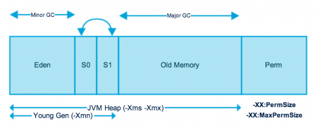
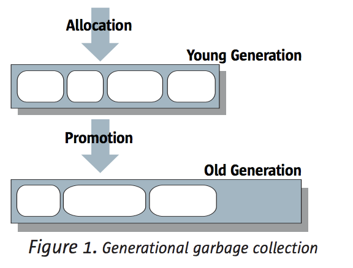
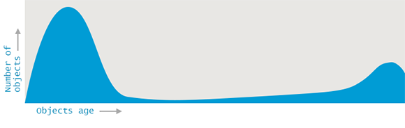
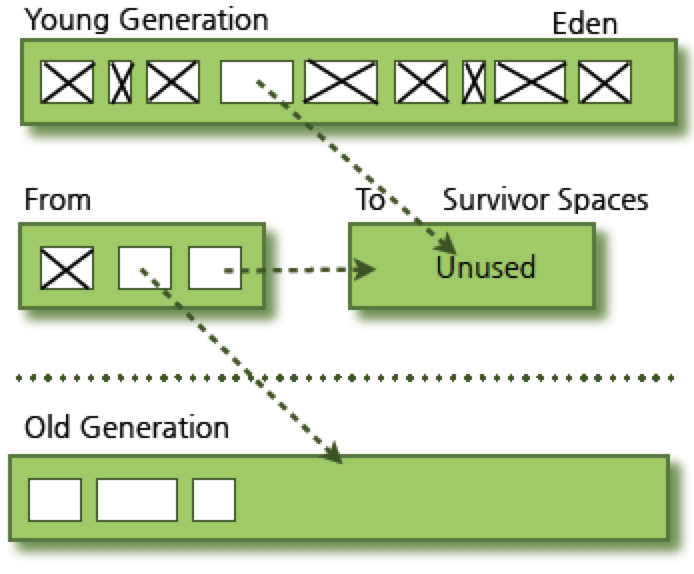
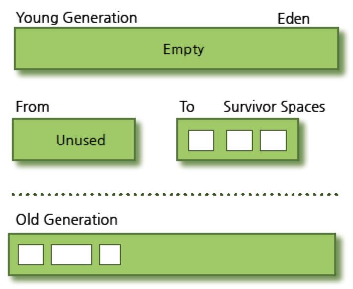
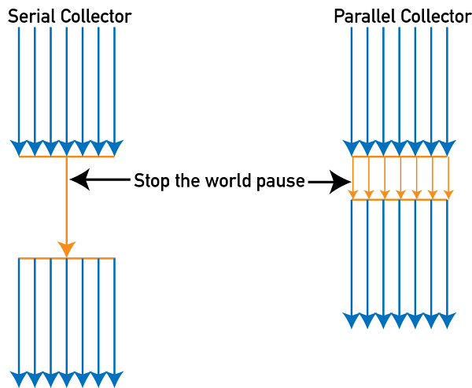
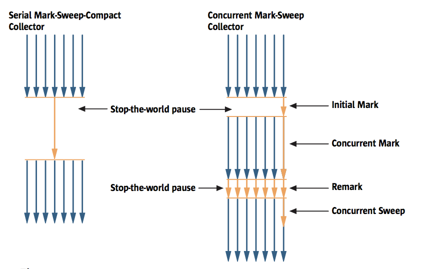
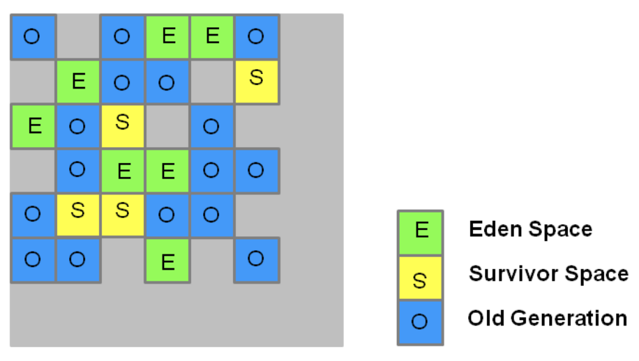
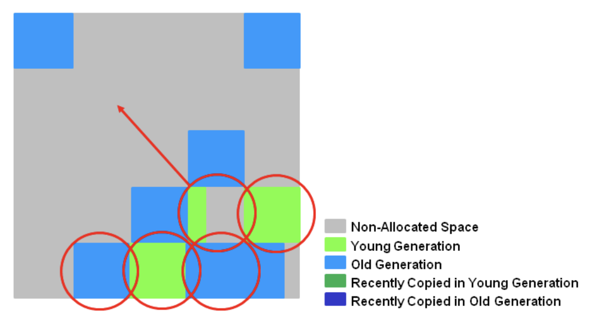
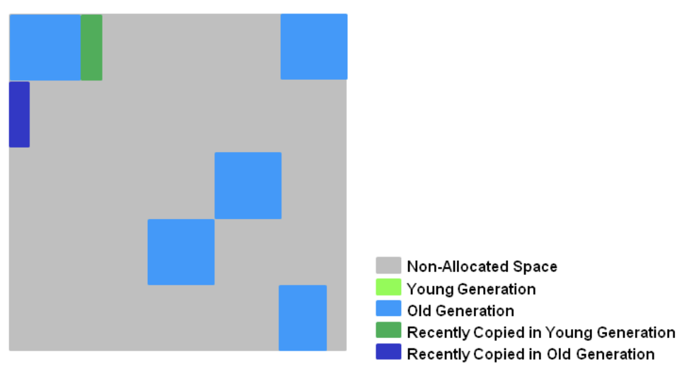

# 1. What Is Garbage Collection?

Unlike C/C++ languages, in Java the developer does not need to explicitly release objects. This is also a big advantage of the Java language. The task of removing unused objects from memory is called Garbage Collection (GC), and the JVM performs GC. Basically, the JVM's memory is divided into a total of five areas (e.g., class, stack, heap, native method, PC), and GC handles only the heap memory.

In code, when does an object become a target for garbage? Simply put, as the program runs, objects that are no longer referenced in the code become targets. Generally, an object becomes a garbage target in the following cases.

- When the object is null (e.g., String str = null)
- An object created inside a block becomes a target after the block finishes executing
- When a parent object becomes null, the child objects it contains automatically become garbage targets as well

For how the JVM determines garbage targets, please refer to link #3.

## 1.1 Structure of the Heap Area

The heap area is largely divided into two areas. The Permanent Generation area is not part of the heap area.

- Young Generation - objects with a short usage time
    - Types of areas
        - Eden
        - 2 Survivors
    - Newly created objects are placed here
    - A very large number of objects are created in the Young area and then disappear
    - When objects are reclaimed in this area, it is said that a Minor GC has occurred
- Old Generation (Tenured space) - objects used for a long time
    - Objects that survive in the Young area are copied here
    - More memory is allocated than the Young area, so GC occurs less frequently than in the Young area
    - When objects are reclaimed in this area, it is said that a Major GC (Full GC) has occurred
- (Non-heap) Permanent Generation
    - This area holds information about classes and method objects used by the JVM
    - From JDK8, PermGen is replaced by Metaspace

[https://www.journaldev.com/2856/java-jvm-memory-model-memory-management-in-java](https://www.journaldev.com/2856/java-jvm-memory-model-memory-management-in-java)

Generally, when you create an object, it is first placed in the Young area, and objects used for a long time move to the Old area through the GC process.

[https://www.oracle.com/technetwork/java/javase/memorymanagement-whitepaper-150215.pdf](https://www.oracle.com/technetwork/java/javase/memorymanagement-whitepaper-150215.pdf)

Why did the heap area come to be divided into two areas for management? According to various studies, the pattern in which objects are created and reclaimed in an application largely has two characteristics.

- Most created objects are not used for long
- Objects generally do not remain for a (very) long time (objects are used briefly)

As shown in the graph below, you can see that the life of objects is short, while the ones that remain for a long time keep accumulating. Because of these characteristics, they are managed in two divided areas, and the GC algorithms were designed based on this.

# 2. Garbage Collection Types

The GC that runs differs depending on each area. If a Minor or Major GC fails, a Full GC may occur.

- Minor GC
    - Target: Young area
    - When triggered: When Eden is full
- Major GC
    - Target: Old area
    - When triggered: When a Minor GC fails
- Full GC
    - Target: The entire Heap + MetaSpace (Permanent area)
    - When triggered: When a Minor or Major GC fails

# 3. Garbage Collection Algorithms

GC algorithms have been improved over a long time and have evolved into several types as shown below. The GC algorithm used by default in recent Java is G1 GC. Let's look at how each algorithm works.

- Serial
- Parallel
- Parallel Old (Parallel Compacting GC)
    - Provided from JDK5u6
- Concurrent Mark & Sweep (CMS)
- G1 (Garbage First)
    - Introduced from JDK7u4
    - Changed to the default GC from JDK9

A frequently used term in GC is stop-the-world. When GC runs, the JVM stops the application's execution, which is called stop-the-world. When GC occurs, all threads except the thread running the GC are stopped. This pause time greatly affects application performance. There has been great effort across various GC algorithms to improve this part.

## 3.1 Serial (-XX:+UseSerialGC)

The Serial collector operates with a single thread and performs GC on Young and Old serially. Let's look a bit more concretely at how objects are managed in the Young and Old areas.

- Young area (single thread)
    - mark and copy
- Old area (single thread)
    - mark-sweep-compact : An algorithm that marks unused objects, then deletes them and gathers them into one place

### 3.1.1 The Minor GC procedure in the Young area - mark and copy

- Objects created at first accumulate in Eden
- When Eden fills up to a certain degree, GC occurs and surviving objects move to the Survivor (Empty) area
    - One of the Survivor areas must always be empty
- When the Survivor area fills up, GC occurs and the objects in the Eden area and the full Survivor area move to the other, empty Survivor area
- Repeating this process, objects that keep surviving move to the Old area

| Before GC | After GC |
| ----- | ------- |
| | |

## 3.2 Parallel (-XX:+UseParallelGC)

The Parallel collector is similar in operation to the serial collector. The difference is that to increase GC speed, it performs GC on the Young area with multiple threads. As a result, the stop-the-world time is reduced, improving application performance.

- Young area (multi thread)
    - mark and copy
- Old area (single thread)
    - mark-sweep-compact

## 3.3 Parallel Compacting Collector (- XX:+UseParallelOldGC)

The Parallel compacting collector has been provided since JDK5u6, and from JDK7u4 it is set to -XX:+UseParallelOldGC even when using XX:+UseParallelGC. The Young and Old areas are processed in parallel. The number of threads can be adjusted with the -XX:ParallelGCThreads=n option.

- Young area (multi thread)
    - mark and copy
- Old area (multi thread)
    - mark-summary-compact
    - mark : Identifies and marks live objects
    - summary : Examines the locations of live objects in areas compacted by a previous GC
    - compact : Collects garbage objects and gathers live objects into one place

## 3.4 Concurrent Mark Sweep (CMS) (-XX:+UseConcMarkSweepGC)

The CMS collector is suitable for servers with large heap memory areas that use two or more processors. The XX:+CMSIncrementalMode option can reduce the server's latency by breaking up the Young area's GC into smaller pieces, but it may cause unexpected performance degradation. Because CMS does not perform compaction on the Old area, memory fragmentation can occur. It was decided that the CMS collector will be removed in a future release. ([JEP 291](http://openjdk.java.net/jeps/291))

- Young area (multi thread)

      	* mark and copy

- Old area (multi thread)
    - mark-sweep-remark
    - initial mark (stop-the-world) : Determines the objects directly/immediately accessible from the application code and creates an initial set
    - concurrent mark : Checks all objects transitively reachable from the objects in the set created in the initial stage
    - remark (stop-the-world) : Re-checks objects changed during the concurrent mark stage
    - concurrent sweep : Deletes the marked objects

## 3.5 G1 (-XX:+UseG1GC : set as the default from JDK9)

The G1 (Garbage First) collector is designed to target multi-core machines with large memory. G1 GC was introduced from JDK7u4 and, after a stabilization period, has now been adopted as the default GC in JDK9. In G1, as shown in the figure below, the heap memory area is divided into small regions for management. The default number of regions divides the space into 2K (2048). For example, if the Heap Size is set to 8GB, the size of each region becomes 4MB (e.g., 8192MB/2048 = 4096).

- Young area (multi thread)
    - You can adjust the number of threads with -XX:ParallelGCThreads
    - Surviving objects move (evacuation/compacting) to the survivor region
    - **When the defined aging threshold value is exceeded, old objects in the survivor region move to the Old area region**
    - Each time a Minor GC runs, the sizes of the Eden and Survivor areas are automatically calculated and determined
- Old area (multi thread)
    - You can adjust the number of GC threads used in the marking stage with -XX:ConcGCThreads
    - It does **not GC the entire heap, but performs GC only on some regions**
    - **The selection criterion for GC of the Old region area is based on liveness (live objects/objects in use)**
        - To increase GC efficiency, it judges that high-liveness ones are likely to be reused, so it GCs the low-liveness ones. Hence the **name Garbage First, G1**
    - The GC process
        - initial mark (stop-the-world)
            - When an Old GC becomes necessary, it runs together with a Young GC
            - Marks the survivor regions (root regions) that reference objects in the Old area
        - root region scanning
            - Scans the survivor areas marked in the first stage without stopping the application execution
        - concurrent mark
            - Marks the objects in use across the entire heap area
            - If a young GC occurs during this stage, it may stop
            - Calculates the live object ratio per region (the high-reuse value)
        - remark (stop-the-world)
            - Empty regions are deleted (empty regions arise as objects are moved) and made free
            - The live object ratios of all regions are calculated
        - copy/cleanup (stop-the-world)
            - Selects the regions with a low live object ratio that can be cleaned up the fastest
            - Both the Young and Old areas are cleaned up, and all selected regions are compacted into new regions
              

        - after copy/cleanup

    - Full GC
        - If even an Old GC fails to secure the necessary Young area, a Full GC is inevitably executed

# 4. References

* Garbage Collection
    * [https://d2.naver.com/helloworld/1329](https://d2.naver.com/helloworld/1329)
    * [http://icednut.github.io/2018/03/25/20180325-about-java-garbage-collection/](http://icednut.github.io/2018/03/25/20180325-about-java-garbage-collection/)
* Java memory
    * [https://www.journaldev.com/2856/java-jvm-memory-model-memory-management-in-java](https://www.journaldev.com/2856/java-jvm-memory-model-memory-management-in-java)
    * [https://www.slipp.net/wiki/pages/viewpage.action?pageId=26641949](https://www.slipp.net/wiki/pages/viewpage.action?pageId=26641949)
* Differences between Generations
    * [https://stackoverflow.com/questions/2129044/java-heap-terminology-young-old-and-permanent-generations](https://stackoverflow.com/questions/2129044/java-heap-terminology-young-old-and-permanent-generations)
* Targets of GC
    * [https://weicomes.tistory.com/121](https://weicomes.tistory.com/121)
    * [https://d2.naver.com/helloworld/329631](https://d2.naver.com/helloworld/329631)
* GC algorithms
    * [https://dzone.com/articles/java-version-upgrades-gc-overview](https://dzone.com/articles/java-version-upgrades-gc-overview)
    * G1 GC
        * [https://docs.oracle.com/javase/9/gctuning/garbage-first-garbage-collector.htm#JSGCT-GUID-0394E76A-1A8F-425E-A0D0-B48A3DC82B42](https://docs.oracle.com/javase/9/gctuning/garbage-first-garbage-collector.htm#JSGCT-GUID-0394E76A-1A8F-425E-A0D0-B48A3DC82B42)
        * [http://kwonnam.pe.kr/wiki/java/g1gc](http://kwonnam.pe.kr/wiki/java/g1gc)
        * [https://www.oracle.com/webfolder/technetwork/tutorials/obe/java/G1GettingStarted/index.html](https://www.oracle.com/webfolder/technetwork/tutorials/obe/java/G1GettingStarted/index.html)
        * [https://logonjava.blogspot.com/2015/08/java-g1-gc-full-gc.html](https://logonjava.blogspot.com/2015/08/java-g1-gc-full-gc.html)
        * [http://initproc.tistory.com/entry/G1-Garbage-Collection](http://initproc.tistory.com/entry/G1-Garbage-Collection)
* Difference between ParallelGC and ParallelOld
    * [https://sarc.io/index.php/java/478-gc-useparallelgc-useparalleloldgc](https://sarc.io/index.php/java/478-gc-useparallelgc-useparalleloldgc)
    * [https://docs.oracle.com/javacomponents/jrockit-hotspot/migration-guide/gc-tuning.htm#JRHMG143](https://docs.oracle.com/javacomponents/jrockit-hotspot/migration-guide/gc-tuning.htm#JRHMG143)
