# 1. Introduction

At work I started using the [Zencoder API](https://support.brightcove.com/zencoder) and was about to begin working with it in Java, but an SSLHandshakeException occurred as shown below, so I ended up googling what the problem was. Many people already know this, but I organized it once more.

- Zencoder API job request address \* [https://app.zencoder.com/api/v2/jobs](https://app.zencoder.com/api/v2/jobs)

**Exception occurrence screen**

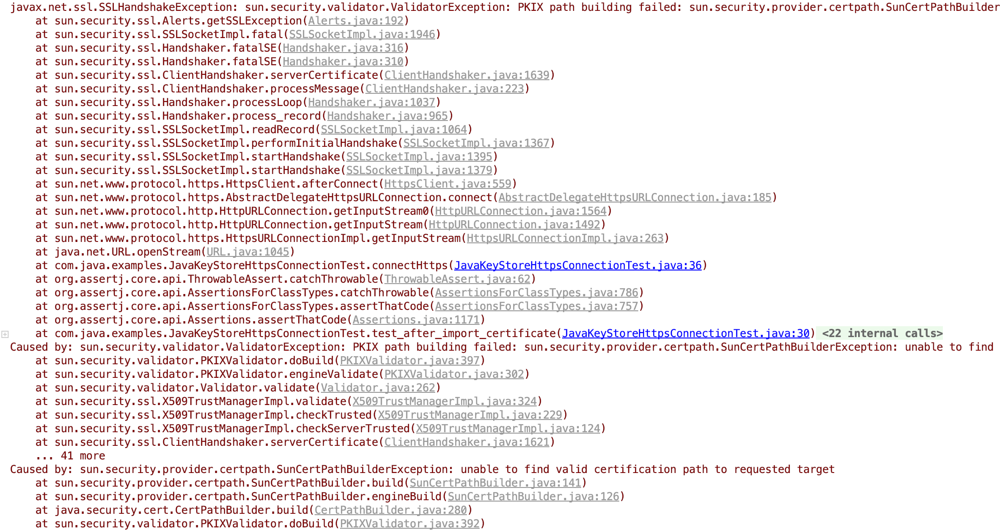

# 2. Development Environment

There isn't much actual code written; to make testing easy, I wrote it simply as a unit test. Please refer to the code uploaded to github.

- OS : Mac OS
- IDE: Intellij
- Java : JDK 1.8
- Source code : [github](https://github.com/kenshin579/tutorials-java-examples/tree/master/java-ssl-keystore-import-test)
- Software management tool : Maven

# 3. Solutions

There are largely two ways to resolve this problem.

- Not checking the certificate validity directly in the code (not recommended)
- Storing the certificate in the Java keystore (the recommended approach)

## 3.1 Not Checking the Certificate Validity Directly in the Code

This is the approach of changing the HttpsConnection settings so that Java code does not check the certificate. I'll skip a detailed explanation of the code below.

```java
@Test
public void test_disable_certificate_from_code() {
   disableCertificateCheck(); //#1

   Assertions.assertThatCode(this::connectHttps).doesNotThrowAnyException();
}

private void disableCertificateCheck() {
   // Create a trust manager that does not validate certificate chains
   TrustManager[] trustAllCerts = new TrustManager[] {
         new X509TrustManager() {
            public java.security.cert.X509Certificate[] getAcceptedIssuers() {
               return new X509Certificate[0];
            }

            public void checkClientTrusted(
                  java.security.cert.X509Certificate[] certs, String authType) {
            }

            public void checkServerTrusted(
                  java.security.cert.X509Certificate[] certs, String authType) {
            }
         }
   };

   // Install the all-trusting trust manager
   try {
      SSLContext sc = SSLContext.getInstance("SSL");
      sc.init(null, trustAllCerts, new java.security.SecureRandom());
      HttpsURLConnection.setDefaultSSLSocketFactory(sc.getSocketFactory());
   } catch (GeneralSecurityException e) {
   }
}
```

## 3.2 Storing the Certificate in the Java Keystore (the recommended approach)

There are largely two ways to register a certificate in the Java keystore. You can do it from the command line, or you can use the Portecle GUI program.

### 3.2.1 Using the Portecle GUI

If you run the unit test before registering the certificate in the Java keystore, an SSLHandshakeException occurs.

```java
@Test
public void test_after_import_certificate() {
   Assertions.assertThatCode(this::connectHttps).doesNotThrowAnyException();
}
```

[Portecle](http://portecle.sourceforge.net/) is a GUI program written in Java that manages keystores. Since it is written in Java, it can be run anywhere regardless of platform.

**1. Download and unzip**

Download the program from the link below and unzip it into the folder you want.

[https://sourceforge.net/projects/portecle/files/latest/download](https://sourceforge.net/projects/portecle/files/latest/download)

**2. Run Portecle**

Since root privileges are needed when saving after registering the certificate, run the program with sudo.

```bash
$ sudo java -jar portecle.jar
```

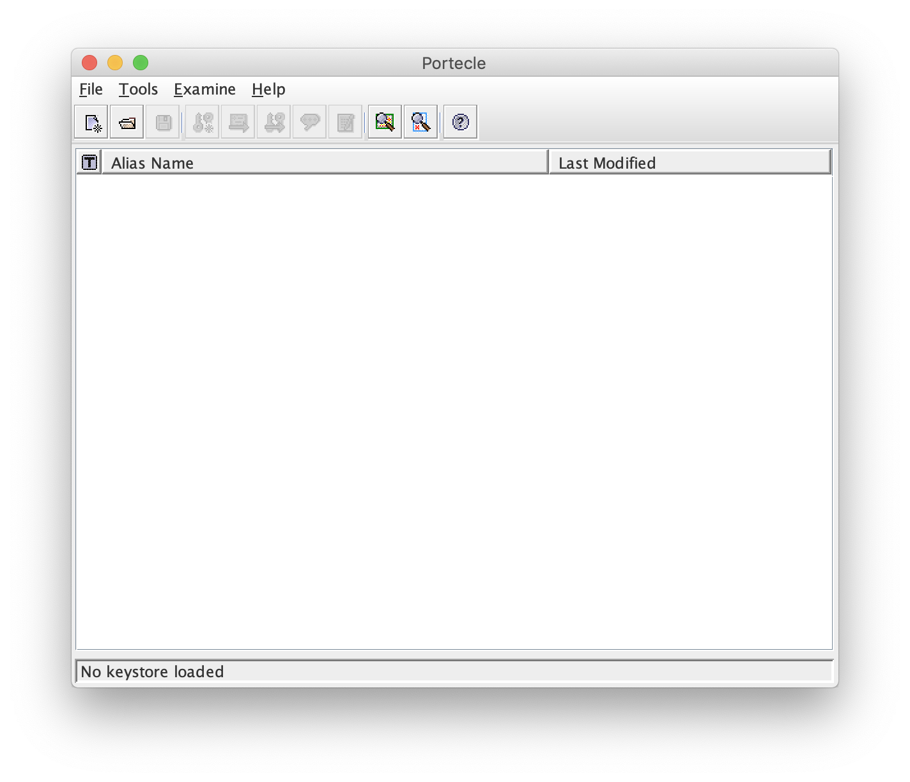

**3. Download the certificate from the site you're connecting to.**

From the menu, click **Examine > Examine SSL/TSL Connection…**, enter the address of the site you want to connect to, and click the **OK button**.

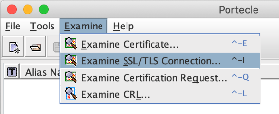

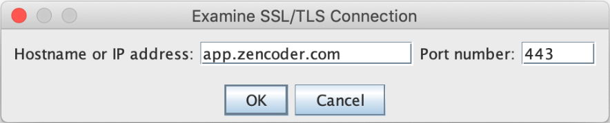

After clicking, you can view the certificate. To save this content, click the **PEM Encoding button** and then press the **Save button** to save it.

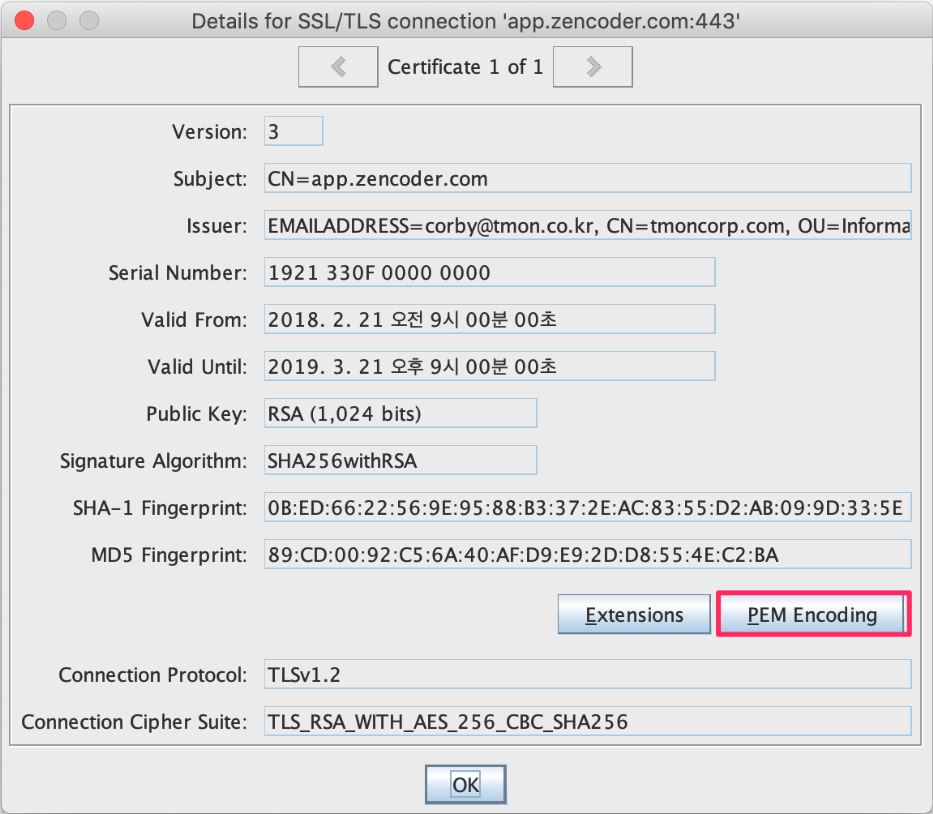

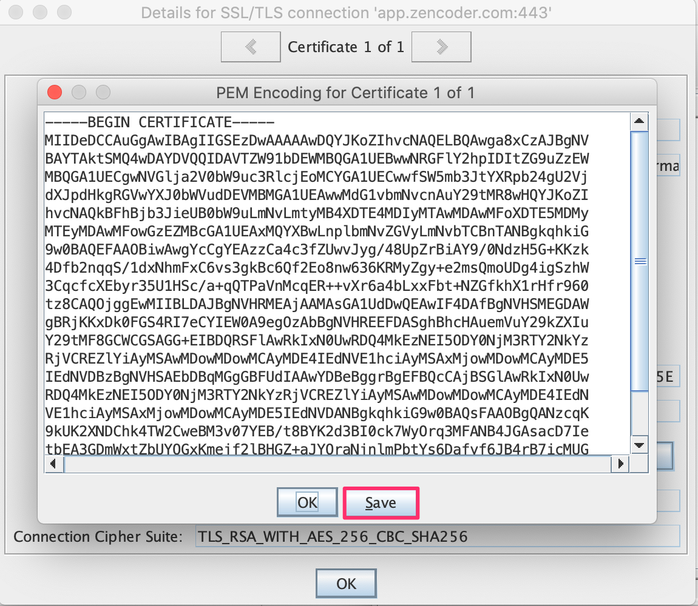

**4. Register it in the Java keystore**

Open the **\$JAVA_HOME_lib_security/cacerts** file of the Java version you want, add the new certificate, and save it—that's all.

If you want to check the installed Java home folder, you can check it with the **java_home command**.

```bash
$ /usr/libexec/java_home -V
```

Click the open button in the menu, find and open the cacerts file, and you'll be prompted to enter a password. **The default password value is changeit.**

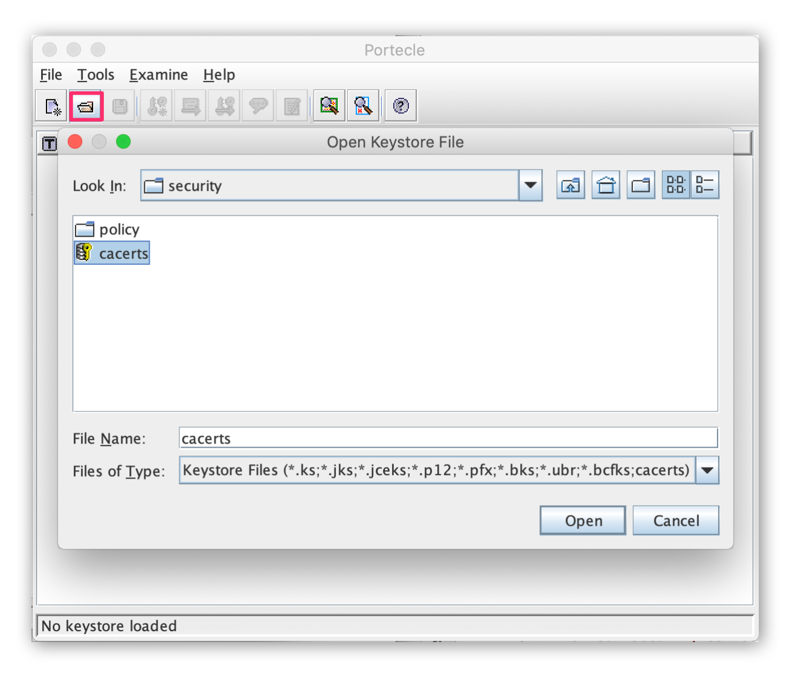

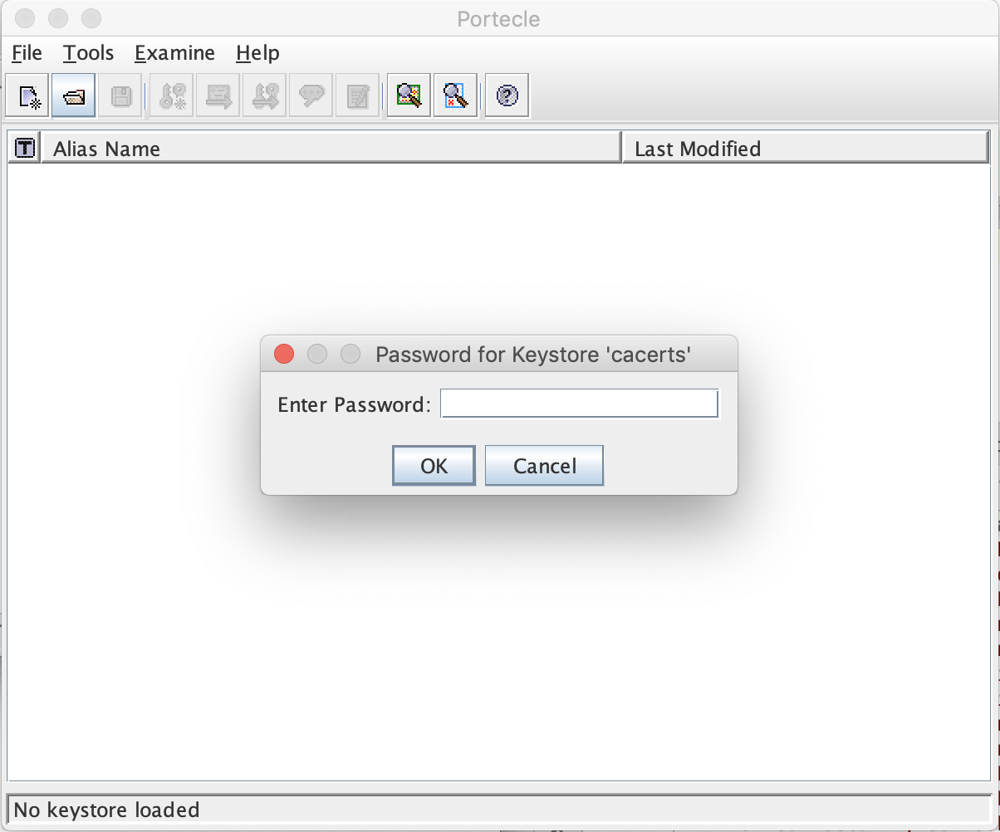

This is the list of currently registered certificates.

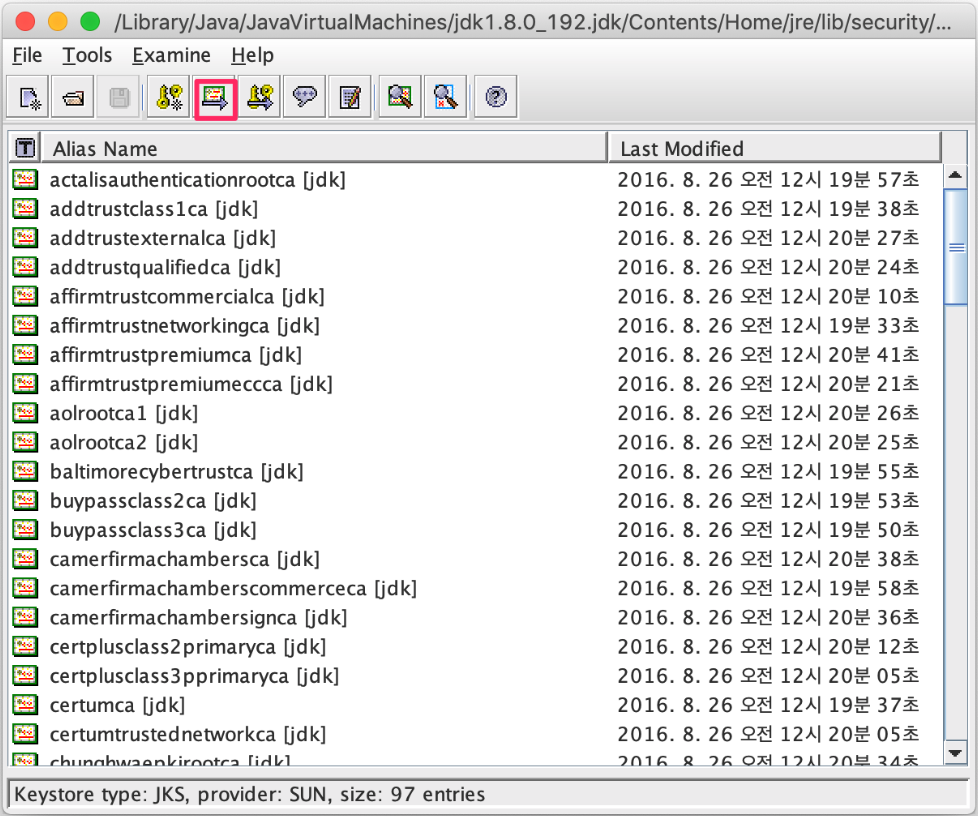

To add a new certificate, click the import button in the menu and select the downloaded certificate.

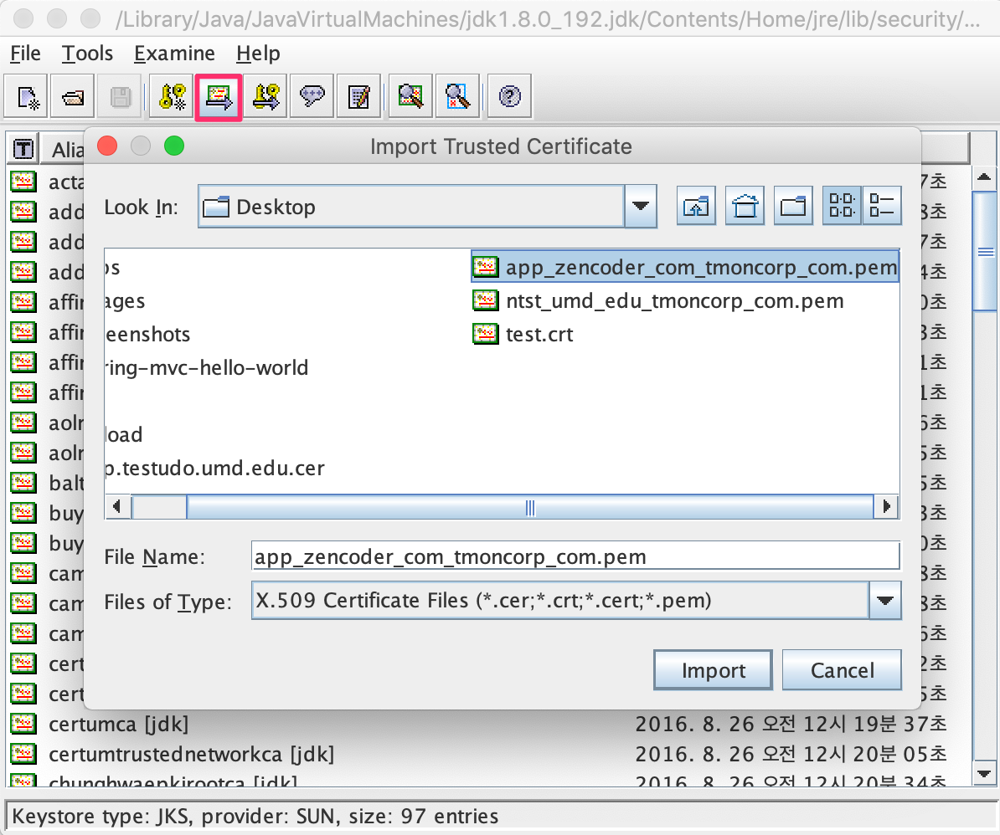

After selecting the file, if you click the **Yes button** to the various questions, you can confirm in the list that the new certificate has been added.

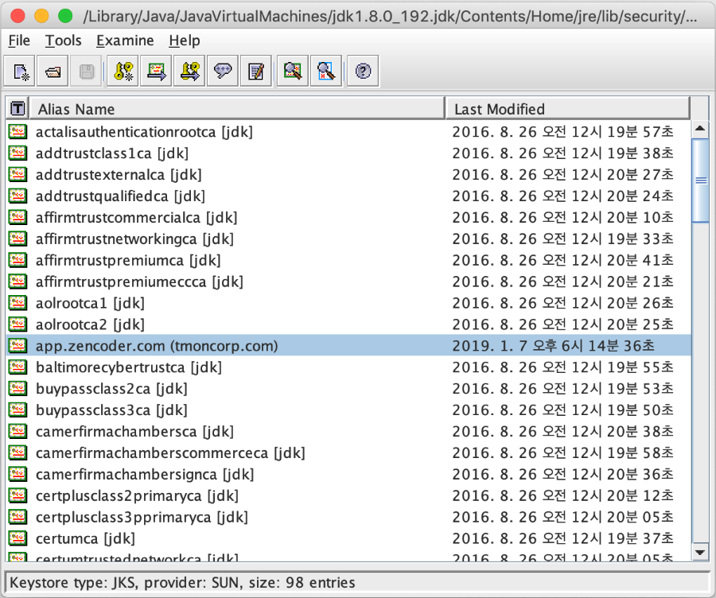

If you run the unit test again, you can confirm that it runs well without an Exception. Now then, let's look at how to register it from the command line.

### 3.2.2 Importing a Certificate into the Java Keystore from the Command Line

You can also download and register a certificate from the command line.

**1. Download the certificate**

```bash
$ openssl s_client -connect [app.zencoder.com:443](http://app.zencoder.com:443/) | tee appzencoder.certlog
$ openssl x509 -inform PEM -in appzencoder.certlog -text -out appzencoder.certdata
$ openssl x509 -inform PEM -text -in appzencoder.certdata
```

**2. Add the new certificate to the Java keystore**

```bash
$ sudo keytool -importcert -file ./appzencoder.certdata -alias [app.zencoder.com](http://app.zencoder.com/) -keystore \$JAVA_HOME/jre_lib_security/cacerts -storepass changeit
```

After entering it, when a question appears, enter yes and the registration completes.

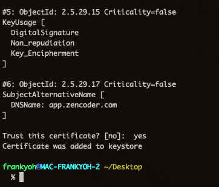

# 4. References

- Importing an SSL certificate into the Java keystore
    - [https://www.lesstif.com/pages/viewpage.action?pageId=12451848](https://www.lesstif.com/pages/viewpage.action?pageId=12451848)
    - [https://stackoverflow.com/questions/2893819/accept-servers-self-signed-ssl-certificate-in-java-client](https://stackoverflow.com/questions/2893819/accept-servers-self-signed-ssl-certificate-in-java-client)
- How to download a certificate
    - [https://www.lesstif.com/pages/viewpage.action?pageId=16744456](https://www.lesstif.com/pages/viewpage.action?pageId=16744456)
    - [https://stackoverflow.com/questions/33284588/error-when-connecting-to-url-pkix-path-building-failed](https://stackoverflow.com/questions/33284588/error-when-connecting-to-url-pkix-path-building-failed)
