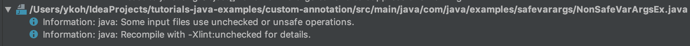
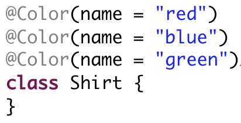

# 1. What Is an Annotation

When you use the Spring framework, you frequently use annotations. The following is an example using Spring Web MVC, where if there is a GET HTTP request (/helloworld), "Hello World" is wrapped and passed to the view. Let's look at how such annotations are internally coded and used.

```java
@Controller
public class HelloWorldController {
    
    @RequestMapping(value="/helloworld", method=RequestMethod.GET)

    public ModelAndView example() {
        return new ModelAndView("helloworld", "message", "Hello World");
    }
}
```

Java annotations are a feature added from JDK5. An annotation is metadata that provides additional information to Java source code. Annotations can be added to classes, methods, variables, and arguments. Because it is metadata, it does not directly affect business logic, but coding that can change the execution flow according to this metadata information is possible, so cleaner coding becomes possible just by adding an annotation. If you tried to code the example above without annotations, the amount of code would be longer and readability would drop a lot.

Now, let's briefly look at the basic annotation declaration and where it can be used.

The example code written in this post is available on [github](https://github.com/kenshin579/tutorials-java-examples/tree/master/custom-annotation).

# 2. Basic Use of Annotations

## 2.1 Annotation Types

There are three types of annotations.

- Marker Annotation
    - @NewAnnotation
- Single Value Annotation
    - @NewAnnotation(id=10)
- Multi Value Annotation
    - @NewAnnotation(id=10, name=“hello”, roles= {“admin”, “user"})

### 2.1.1 Marker Annotation

Like annotations such as @Override or @Deprecated, this is an annotation that just marks something. If you declare it without a method, it becomes a marker annotation.

```java
public @interface MakerAnnotation {
}
```

Add it above a class or method without additional information.

```java
@MakerAnnotation
public class UsingMakerAnnotation {
}
```

## 2.2 Single Value Annotation
This is an annotation that can take only one value as input.

```java
@SingleValueAnnotation(id = 1)
public class UsingSingleValueAnnotation {
}
```

If there is only one method in the annotation declaration, it is declared as a single value annotation.

```java
public @interface SingleValueAnnotation {
    int id();
}
```

### 2.2.1 Multi Value Annotation
You can specify multiple values in the annotation.

```java
@MultiValueAnnotation(id = 2, name = "Hello", roles = {"admin", "users"})
public class UsingMultiValueAnnotation {

@MultiValueAnnotation(id = 10) //name = user, roles = {“anonymous’} are set
public void testMethod() {
}
}
```

To take multiple values as input, you declare multiple methods. Additionally, you can declare default values with the default keyword. In line #4 of the code above, name and roles are not specified, so they are set to the default values name = "users", roles = {"anonymous"}.

```java
public @interface MultiValueAnnotation {
  int id();
  String name() default "user”; //if unspecified, user is set as the default value**
  String[] roles() default {"anonymous"};
}

```

## 2.3 Where to Place Annotations
As in the example below, annotations can be declared above a class, field variable, method argument, and local variable.

```java
@MakerAnnotation
public class AnnotationPlacement {

    @MakerAnnotation
    String field;

    @MakerAnnotation
    public void method1(@MakerAnnotation String str) {
        @MakerAnnotation
        String test;
    }
}

```

Before looking at how to create and use custom annotations, let's take a look at the annotations Java provides by default.

# 3. Built-in Annotations
These are annotations provided in the Java language.

- **Annotations applied to Java code**
    - @Override
        - Plays the role of marking a method as being overridden
        - If the method to which the annotation is added does not exist in the parent class or interface, it raises a compile error
    - @Deprecated
        - Marks a method as no longer used
        - Raises a compile warning if the method is used
    - @SuppressWarnings
        - Plays the role of telling the compiler to ignore warnings that occur during compilation

- **Annotations added from Java 7 onward**
    - @SafeVarargs
    - This is an annotation added in Java 7
        - It is an annotation that ignores warning messages that may indicate the method could be executed incorrectly when the method has varargs.
          

            * Can only be used on methods that cannot be overridden
                * final, static methods, constructors, private methods (from Java 9)
            * [See example code](https://beginnersbook.com/2018/05/java-9-safevarargs-annotation/)
        * @FunctionalInterface
            * An annotation added from Java 8, used when declaring a functional interface
        * @Repeatable
            * An annotation that allows you to declare the same annotation multiple times
              
            * [See example code](https://www.javabrahman.com/java-8/java-8-repeating-annotations-tutorial/)

- **Annotations applied to other annotations - Meta Annotations**

    - @Retention
    - @Documented
    - @Target
    - @Inherited

The meta annotations above are annotations used when writing custom annotations. Let's look at what role each one plays in the next section.

# 4. Custom Annotations

## 4.1 Meta Annotations

```java
@Retention(RetentionPolicy.RUNTIME)
@Target(ElementType.TYPE)

public @interface MyAnnotation {
    String name();
    String value();
}

@MyAnnotation(name = "someName", value = "Hello World")
public class TheClass {
}
```

This is a simple custom annotation example that can take two String values. Let's look at what meaning each meta annotation has.

- @Target
    - This annotation determines the location where the declared annotation can be applied
    - Values declared in the ElementType Enum
        - TYPE : applied to class, interface, enum.
        - FIELD : class field variables
        - METHOD : methods
        - PARAMETER : method arguments
        - CONSTRUCTOR : constructors
        - LOCAL_VARIABLE : local variables
        - ANNOTATION_TYPE : applied only to annotation types
        - PACKAGE : packages
        - TYPE_PARAMETER : a value added from Java 8, applied to generic type variables. (e.g., MyClass<T>)
        - TYPE_USE : a value added from Java 8, applied to any type (e.g., extends, implements, object creation, etc.)
        - [Java 8 type annotations](https://www.logicbig.com/tutorials/core-java-tutorial/java-8-enhancements/type-annotations.html)
        - MODULE : a value added from Java 9, applied to modules
- @Retention
    - Determines up to which level the annotation is retained.
    - Values declared in the RetentionPolicy Enum
    - SOURCE : the annotation is removed by the Java compilation
    - CLASS : the annotation remains in the .class file but is not provided at runtime; this is the default value of the Retention policy \* RUNTIME : the annotation is provided at runtime as well, so you can access the declared annotation via Java reflection
- @Inherited
    - If you declare this annotation, child classes inherit the annotation
- @Documented
    - If you declare this annotation, the newly created annotation is also included in the Java documentation when generating Java docs.
- @Repeatable
    - An annotation added in Java 8 that allows repeated declaration

## 4.2 Creating Custom Annotations

These are examples created using custom annotations.

**Example 1 - Declared on a class**

```java
@Retention(RetentionPolicy.RUNTIME)
@Target(ElementType.TYPE)
public @interface MyAnnotation {
    String name();
    String value();
}

@MyAnnotation(name = "someName", value = "Hello World")
public class TheClass {
}
```

**Example 2 - Declared on a class field**

```java
@Retention(RetentionPolicy.RUNTIME)
@Target(ElementType.FIELD)
public @interface MyAnnotation {
    String name();
    String value();
}

public class TheClass {
    @MyAnnotation(name = "someName", value = "Hello World")
    public String myField = null;
}
```

**Example 3 - Declared on a method**

```java
@Retention(RetentionPolicy.RUNTIME)
@Target(ElementType.METHOD)
public @interface MyAnnotation {
    String name();
    String value() default "default value";
}

public class TheClass {
    @MyAnnotation(name = "doThisMethod", value = "Hello World")
    public void doThis() {
    }

    @MyAnnotation(name = "doThatMethod")
    public void doThat() {
    }
}
```

## 4.3 Using Custom Annotations with Java Reflection
To obtain the places where a custom annotation is used and the values specified when the program runs, you must use Java reflection. Getting the declared annotation values using Java reflection is fairly similar, so let's explain using only example 3.

```java
public class MethodAnnotationExecutor {
    public static void main(String[] args) throws NoSuchMethodException {
        Method method = TheClass.class.getMethod("doThis”); //Get the method doThis with the Java reflection getMethod
        Annotation[] annotations = method.getDeclaredAnnotations(); //Get the annotation objects declared on the method


        for (Annotation annotation : annotations) {
            if (annotation instanceof MyAnnotation) {
                MyAnnotation myAnnotation = (MyAnnotation) annotation;
                System.out.println("name: " + myAnnotation.name()); //Print the value specified in the annotation

                System.out.println("value: " + myAnnotation.value());
            }
        }

        Annotation annotation = TheClass.class.getMethod("doThat") 
                            .getAnnotation(MyAnnotation.class); //Get the MyAnnotation annotation object declared on the method doThat


        if (annotation instanceof MyAnnotation) {
            MyAnnotation myAnnotation = (MyAnnotation) annotation;
            System.out.println("name: " + myAnnotation.name());
            System.out.println("value: " + myAnnotation.value());
        }
    }
}

```


We briefly looked at how to create and use custom annotations. Creating and using custom annotations has the advantage that you can greatly reduce the parts you have to code repeatedly and focus more on business logic. They are frequently used in Spring as well, and Lombok ([Lombok](http://wonwoo.ml/index.php/post/1607)), which has been gaining popularity recently, is also a library that supports many annotations.

If you have a project you're currently developing, it might be good to try applying custom annotations to it.

# 5. References

- Java annotations
    - [https://ko.wikipedia.org/wiki/%EC%9E%90%EB%B0%94\_%EC%96%B4%EB%85%B8%ED%85%8C%EC%9D%B4%EC%85%98](https://ko.wikipedia.org/wiki/%EC%9E%90%EB%B0%94_%EC%96%B4%EB%85%B8%ED%85%8C%EC%9D%B4%EC%85%98)
    - [http://tutorials.jenkov.com/java/annotations.html](http://tutorials.jenkov.com/java/annotations.html)
    - [https://jdm.kr/blog/216](https://jdm.kr/blog/216)
    - [https://www.javatpoint.com/custom-annotation](https://www.javatpoint.com/custom-annotation)
    - [https://elfinlas.github.io/2017/12/14/java-annotation/](https://elfinlas.github.io/2017/12/14/java-annotation/)
    - [https://howtodoinjava.com/java/annotations/complete-java-annotations-tutorial/](https://howtodoinjava.com/java/annotations/complete-java-annotations-tutorial/)
- SafeVarargs annotation
    - [https://beginnersbook.com/2018/05/java-9-safevarargs-annotation/](https://beginnersbook.com/2018/05/java-9-safevarargs-annotation/)
- Repeatable annotation
    - [https://dzone.com/articles/repeatable-annotations-in-java-8-1](https://dzone.com/articles/repeatable-annotations-in-java-8-1)
    - [https://www.javabrahman.com/java-8/java-8-repeating-annotations-tutorial/](https://www.javabrahman.com/java-8/java-8-repeating-annotations-tutorial/)
- Usage examples
    - [http://www.nextree.co.kr/p5864/](http://www.nextree.co.kr/p5864/)
    - [https://examples.javacodegeeks.com/core-java/java-9-annotations-example/](https://examples.javacodegeeks.com/core-java/java-9-annotations-example/)
    - [https://elfinlas.github.io/2017/12/14/java-custom-anotation-01/](https://elfinlas.github.io/2017/12/14/java-custom-anotation-01/)
    - [http://tutorials.jenkov.com/java-reflection/annotations.html](http://tutorials.jenkov.com/java-reflection/annotations.html)
    - [https://elfinlas.github.io/2017/12/14/devnote01/](https://elfinlas.github.io/2017/12/14/devnote01/)
