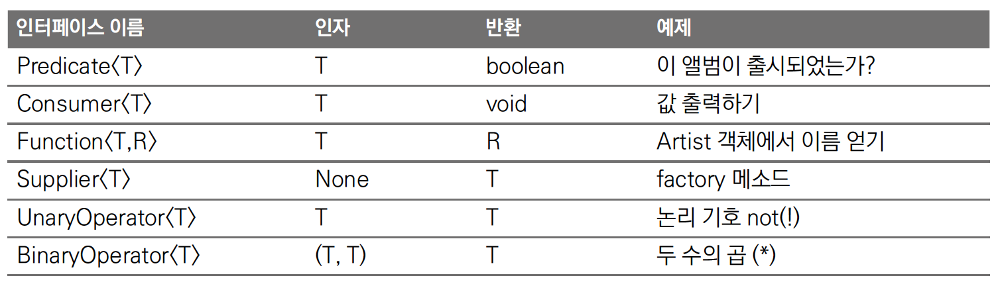

# 1. What Is Optional

Optional is a new core library data type created to replace null. The Optional class is a class that can hold either a null or a non-null value. It is a feature that already exists in other languages (e.g., Scala), and it was included in Java with JDK8. Let's look at the problems that arise when using null and how Optional improves the code.

When developing in Java, you frequently encounter NullPointerException (NPE). As in the code below, if an object is null and you try to use the null value, an NPE occurs.

```java
@Test(expected = NullPointerException.class)
public void testOldJavStyle_throw_NPE() {
    String str = null;
    System.out.println(str.charAt(0)); //NPE occurs
}
```

To resolve the NPE, you have to add a conditional statement that checks for null. Null was developed with the intent of representing the absence of a value, but by introducing null, the code became much less readable and harder to maintain. Let's see how the code changes when using the Optional class. As the null-check conditional disappears, the code becomes much cleaner.

```java
//null conditional
@Test
public void testOldJavStyle_checkNull() {
    String str = "test";
    if (str != null) {
        System.out.println(str.charAt(0));
    }
}

//Using Optional
@Test
public void testOptionalJavaStyle_checkNull() {
    String str = "test";
    Optional<String> optStr = Optional.ofNullable(str);
    optStr.ifPresent(s -> System.out.println(s.charAt(0)));
}
```

# 2. Using Optional

## 2.1 Creating an Optional Object

The Optional class provides three static factory methods.

- Optional.empty() : creates an empty Optional object
- Optional.of(value) : used when the value is not null
- Optional.ofNullable(value) : used when it is uncertain whether the value is null or not

**1. Optional.empty()**

```java
Optional<String> optStr = Optional.empty();
```

Optional.empty() creates an empty Optional object.

**2. Optional.of(value)**

```java
String str = "test";
Optional<String> optStr1 = Optional.of(str);
```

Optional.of() creates an Optional object that holds a non-null object.

Since it creates an object that is not null, passing null to create it results in an NPE.

```java
String nullStr = null;
Optional<String> optStr2 = Optional.of(nullStr); NPE occurs
```

**3. Optional.ofNullable(value)**

```java
String str = "test";
Optional<String> optStr1 = Optional.ofNullable(str);
```

When you want to hold an object that you are not sure is null or not, you create an Optional object through Optional.ofNullable().

If null is passed in, it creates an empty Optional object.

```java
Optional<String> optStr2 = Optional.ofNullable(null); //returns an empty Optional object
```

## 2.3 How to Access and Use the Object Held by Optional

Let's look at how to use the various methods for accessing the object held by an Optional.

- ifPresent(function)
- return a default value when null
    - orElse(T other) : returns the argument when empty
    - orElseGet(Supplier<? extends T> other) : returns the return value of the functional argument
- throw an exception when null
    - orElseThrow(Supplier<? extends X> exceptionSupplier) : throws the exception created by the argument function

**1. IfPresent(function)**
This is a method that runs the function passed as an argument when the Optional object is non-null. If the Optional object is null, the function passed as an argument is not executed.

```java
@Test
public void test_1_otional_usage_ifPresent() {
    String str = "test";
    Optional<String> optStr1 = Optional.ofNullable(str);
    optStr1.ifPresent(s -> System.out.println(s.charAt(0))); prints t

    Optional<String> optStr2 = Optional.ofNullable(null);
    optStr2.ifPresent(s -> System.out.println(s.charAt(0))); not printed
}
```

**2. orElse**
This is a method that returns a substitute value when the object held in the Optional is null.

```java
@Test
public void test_2_otional_usage_orElse() {
    Optional<String> optStr = Optional.ofNullable(null);
    String result = optStr.orElse("test"); //returns test if null
    System.out.println(result); //test
}
```

**3. orElseGet**
This is similar to orElse, but the difference is that it takes a method as an argument and returns the value returned by the function.

```java
@Test
public void test_2_otional_usage_orElseGet() {
    Optional<String> optStr = Optional.ofNullable(null);
    String result = optStr.orElseGet(this::getDefaultValue);
    System.out.println(result); //default
}

private String getDefaultValue() {
    LOG.info("calling getDefaultValue");
    return "default";
}
```

**4. The Difference Between orElse and orElseGet**
In terms of the end result, orElse and orElseGet appear to have no difference, but looking at the code below, you can see that in the case of orElseGet() the function passed as an argument is executed only when the value is null. You only need to be careful when using the orElse method.

```java
@Test
public void test_optional_usage_diff_orElse_orElseGet() {
    String str = "test";
    String result1 = Optional.ofNullable(str).orElse(getDefaultValue()); the getDefaultValue() function runs even when it is not null
    LOG.info("orElse result: {}", result1);

    String result2 = Optional.ofNullable(str).orElseGet(this::getDefaultValue); getDefaultValue() is not executed
    LOG.info("orElseGet result: {}", result2);
}
```


**5. orElseThrow**
Instead of returning a default value when null, you can throw an exception.

```java
@Test(expected = IllegalArgumentException.class)
public void test_3_optional_usage_orElseThrow() {
    String str = null;
    String result = Optional.ofNullable(str).orElseThrow(IllegalArgumentException::new);
    LOG.info("result {}", result);
}
```

# 3. How to Use Optional in Streams

## 3.1 filter(Predicate) : Filtering Elements Based on a Condition

filter() is a Stream API that returns, as a new stream, only the elements for which the result of the Predicate function passed as an argument is true. In other words, you can understand it as filtering only the elements that match the condition. Here is a version implemented without Optional and an example that uses Optional.

```java
//Without Optional
private boolean isLastNameFrank(Person person) {
    if (person != null && person.getLastName() != null) {
        return person.getLastName().toLowerCase().equals("frank");
    }
    return false;
}

//Using Optional
private boolean isLastNameFrank(Person person) {
    return Optional.ofNullable(person)
    .map(Person::getLastName)
    .map(String::toLowerCase)
    .filter(s -> s.equals("frank")).isPresent();
}
```

```java
@Test
public void test_1_stream_usage_filter_with_optional() {
    Map<Person, Boolean> personVsExpectedMap = new HashMap<Person, Boolean>() {{
        put(new Person("Frank", "Oh"), true); **stores the Person object and the expected result**
        put(new Person(null, "Oh"), false);
        put(new Person("David", "Oh"), false);
        put(new Person("John", "Oh"), false);
    }};

    boolean expectedResult;
    for (Person person : personVsExpectedValueMap.keySet()) {
        expectedResult = personVsExpectedValueMap.get(person);
        assertEquals(expectedResult, **isLastNameFrank** (person));
    }
}
```

To better understand the various Stream APIs, it is easier to understand how the lambda function is called internally by looking at the actual implementation code. filter takes a Predicate function as an argument, runs the function passed as the Predicate on the stream, and if the result is true it passes the stream's this, and otherwise you can see that the actual returned result is of type Optional.

```java
@Test
public void test_1_stream_usage_filter_with_optional() {
    Map<Person, Boolean> personVsExpectedMap = new HashMap<Person, Boolean>() {{
        put(new Person("Frank", "Oh"), true); **stores the Person object and the expected result**
        put(new Person(null, "Oh"), false);
        put(new Person("David", "Oh"), false);
        put(new Person("John", "Oh"), false);
    }};

    boolean expectedResult;
    for (Person person : personVsExpectedValueMap.keySet()) {
        expectedResult = personVsExpectedValueMap.get(person);
        assertEquals(expectedResult, **isLastNameFrank** (person));
    }
}
```

For reference, the meaning of Predicate<? super T> is that the Predicate's type parameter must be T or a supertype of T. The lower bound that can go into T is determined. For example, in the case of List<? super Integer>, it includes List<Integer>, List<Number>, and List<Object>. The Integer class is a child class that inherits from Number and Object. For more details on generics, please refer to [StackOverflow](https://stackoverflow.com/questions/2827585/what-is-super-t-syntax).

## 3.2 map() : Transforming the Value Form of Elements

**map(Function<? super T,? extends R> mapper)**

map() is a Stream API that transforms the form of an element's value. In the code below, a String list is wrapped in an Optional and the size is obtained via map. In the case of null, the orElse() method returns a default value.

```java
@Test
public void test_2_stream_usage_map_with_optional() {
    List<String> strArray = Arrays.asList("frank", "angela", "david");
    Optional<List<String>> optArray = Optional.of(strArray);

    int size = optArray
          .map(List::size) //in map, the list is transformed into its size
          .orElse(0);
    assertEquals(3, size);

    optArray = Optional.ofNullable(null);
    size = optArray.map(List::size).orElse(1);
    assertEquals(1, size);
}

```

In the case of the filter() function, since it is a Predicate functional interface, the result must return a boolean, but the map() function uses the Function functional interface, so it can return results in various forms. In the code, a List is converted into an int form and returned.

```java
@FunctionalInterface
public interface Function<T, R> {
    R apply(T t); //returns type R<
   ...(omitted)...
}
```

## 3.3 flatMap() : Flatten the Elements and Then Return the Value Form with map

```java
flatMap(Function<? super T,? extends Stream<? extends R>> mapper)
```

In the case of flatMap, when the element is not a primitive type but a type composed of multiple Optional<Optional>>, you must use flatMap. Besides Optional, even in the case of a Stream, data in the form of [[1,2,3], [2,3,4]] is processed using flatMap. For a more detailed explanation, please refer to the link below (Map Vs. FlatMap).

```java
@Test
public void test_3_stream_usage_flatMap() {
    PersonOpt person = new PersonOpt("Oh", "Frank");
    Optional<PersonOpt> personOpt = Optional.of(person);

    Character firstCharOfFirstName = personOpt
            .flatMap(PersonOpt::getFirstName) //since the return value of getFirstName is Optional, you must use flatMap
            .map(s -> s.charAt(0)) //since the element is a primitive type, map is used
            .orElse('0');
    assertEquals(new Character('F'), firstCharOfFirstName);
}
```

# 4. Optional Methods Added in Java 9

Three methods were added in JDK9. Let's look at how each of them is used.

- or() : returns another Optional when the Optional is empty

- ifPresentOrElse() : performs the action if a value is present in the Optional, and otherwise performs the else part

- stream() : used to convert an Optional object into a Stream object

## 4.1 or() : Returns Another Optional When the Optional Is Empty

Before JDK9, if an Optional object was empty, you used orElse() or orElseGet() to return a default value. Starting with JDK9, the or() method was added, which returns another Optional instead of a value when the Optional is empty. You can understand it more easily by looking at the example.

```java
@Test
public void test_jdk9_optional_or() {
    String str = null;
    Optional<String> defaultOpt = Optional.of("default");
    Optional<String> strOpt = Optional.ofNullable(str);

    Optional<String> result = strOpt.or(() -> defaultOpt); //returns the default optional
    assertEquals("default", result.get());
}
```

## 4.2 ifPresentOrElse() : Performs the Action If a Value Is Present in the Optional, Otherwise Performs the Else Part

Before JDK9 there was only the IfPresent method, but starting with JDK9, an Else was added for the case where the Optional is empty, which made it much more convenient.

```java
@Test
public void test_jdk9_ifPresentOrElse() {
    String str = null;
    Optional<String> strOpt = Optional.ofNullable(str);
    strOpt.ifPresentOrElse(
            s -> System.out.println("string : " + s),
            () -> System.out.println("null value”) //this part is performed when empty
    );
}}
```

# 4.3 stream() : Used to Convert an Optional Object into a Stream Object

The Stream added in JDK8 is a feature that makes it easy to manipulate collections in a functional way through various APIs. By adding stream() to Optional, you can now use the existing Stream APIs. This example shows using a Stream function after converting an Optional into a Stream.

```java
@Test
public void test_jdk9_stream() {
    String str = "frank";
    Optional<String> strOpt = Optional.of(str);
    strOpt.stream().map(String::toUpperCase).forEach(System.out::println);
}
```

# 5. References

The source code written for this post is available on [github](https://github.com/kenshin579/tutorials-java-examples/tree/master/java-optional).

- Functional interfaces



- Option in Scala
    - [https://danielwestheide.com/blog/2012/12/19/the-neophytes-guide-to-scala-part-5-the-option-type.html](https://danielwestheide.com/blog/2012/12/19/the-neophytes-guide-to-scala-part-5-the-option-type.html)
- How to use Optional
    - [http://www.daleseo.com/java8-optional-after/](http://www.daleseo.com/java8-optional-after/)
    - [https://softwareengineering.stackexchange.com/questions/364211/why-use-optional-in-java-8-instead-of-traditional-null-pointer-checks](https://softwareengineering.stackexchange.com/questions/364211/why-use-optional-in-java-8-instead-of-traditional-null-pointer-checks)
    - [https://www.baeldung.com/java-optional](https://www.baeldung.com/java-optional)
- Streams
    - [https://m.blog.naver.com/PostView.nhn?blogId=2feelus&logNo=220695347170&proxyReferer=https%3A%2F%2Fwww.google.co.kr%2F](https://m.blog.naver.com/PostView.nhn?blogId=2feelus&logNo=220695347170&proxyReferer=https%3A%2F%2Fwww.google.co.kr%2F)
- Generics syntax
    - [https://stackoverflow.com/questions/2827585/what-is-super-t-syntax](https://stackoverflow.com/questions/2827585/what-is-super-t-syntax)
- Map vs FlatMap
    - [https://code.i-harness.com/ko-kr/q/1972c92](https://code.i-harness.com/ko-kr/q/1972c92)
    - [https://jaepils.github.io/java/2018/06/27/java-time-Instant.html](https://jaepils.github.io/java/2018/06/27/java-time-Instant.html)
- JDK9 optional
    - [https://www.baeldung.com/java-9-optional](https://www.baeldung.com/java-9-optional)
    - [https://aboullaite.me/java-9-enhancements-optional-stream/](https://aboullaite.me/java-9-enhancements-optional-stream/)
</content>
</invoke>
