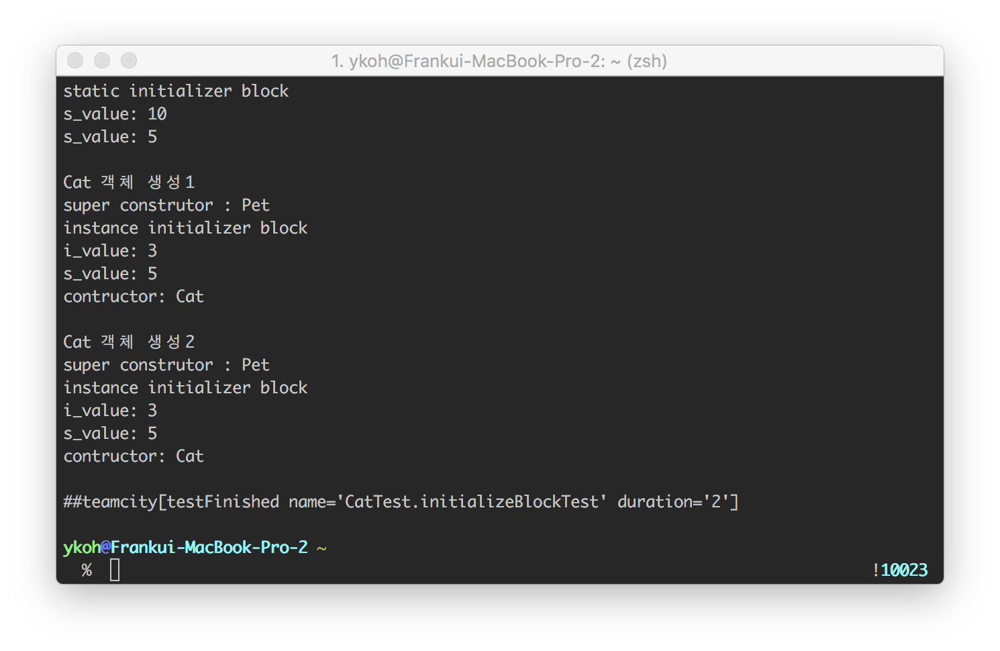

# 1. Overview

```java
final int MAX = 5;
```

When thinking of the final keyword as above, we often just think of it as a constant. When you declare final on a class, method, or variable, what you can do is restricted bit by bit. It's something quite obvious, but as time passes it fades from memory, so I put together this summary to remind myself once again.

In Java, the final keyword is used to define an entity that can be assigned only once in various contexts. ([Wikipedia](https://en.wikipedia.org/wiki/Final_%28Java%29))

The final keyword can be applied to three things in total. Let's take a detailed look at each one.

- final variable
    - primitive type
    - object type
    - class field
    - method argument
- final method
- final class

# 2. Final Variables

## 2.1 Primitive Type

When you declare a local primitive variable as final, the variable, once initialized, becomes a constant value that cannot be changed.

```java
@Test
    public void test_final_primitive_variables() {
    final int x = 1;
    x = 3; //cannot be changed once assigned.
}
```

## 2.2 Object Type

When you declare an object variable as final, you cannot assign a different reference value to that variable. Just like a primitive type, once written the variable cannot be reassigned. **However, this does not mean that the object itself is immutable**. The properties of the object can be changed.

```java
@Test
public void test_final_reference_variables() {
    final Pet pet = new Pet();
    pet = new Pet(); cannot be changed to a different object
    pet.setWeight(3); //object fields can be changed
}
```

## 2.3 Method Argument

If you attach the final keyword to a method argument, you cannot change the variable's value inside the method.

```java
public class Pet {
    int weight;
    public void setWeight(final int weight) {
        weight = 1; //a final argument cannot be changed inside the method
    }
}
```

## 2.4 Member Variable

When you declare a class member variable as final, it becomes a constant value or a write-once field that is written only once. When declared as final, the point at which it is initialized is before the constructor method finishes. However, the timing of initialization also differs depending on whether it is static or not.

- static final member variable (static final int x = 1)
    - when declared with a value
    - in a static initialization block
- instance final member variable (final int x = 1)
    - when declared with a value
    - in an instance initialization block
    - in the constructor method

### 2.4.1 Instance Initialization Block vs Static Initialization Block

Let's briefly look at the difference between a static initialization block and an instance initialization block.

| Instance initialization block                                         | Static initialization block                   |
| ------------------------------------------------------------ | ---------------------------------- |
| The block runs every time an object is created <br />Runs after the parent constructor <br />Runs before the constructor | The block runs only once when the class is loaded |


```java
@Test
public void initializeBlockTest() {
    Cat.s_value = 5; static //the initialization block is called
    System.out.println("s_value: " + Cat.s_value);

    System.out.println("");
    System.out.println("Cat object creation 1");
    Cat cat1 = new Cat();

    System.out.println("");
    System.out.println("Cat object creation 2");
    Cat cat2 = new Cat();
    }

    public class Pet {
    public Pet() {
        System.out.println("super construtor : Pet");
    }
}
```

The execution result is as follows. The static initialization block is called only once at the point when the class is loaded, and inside the static block you can initialize static member variables.



The instance initialization block is called every time an object is created, and it runs before the child object's constructor is called and after the parent constructor.

```java
public class Cat extends Pet {
    final int i_value;
    static int s_value;

    {
        System.out.println("instance initializer block");
        i_value = 3;
        System.out.println("i_value: " + i_value);
        System.out.println("s_value: " + s_value);
    }

    static {
        System.out.println("static initializer block");
//        System.out.println("i_value: " + i_value); //fields cannot be accessed in a static block
        System.out.println("s_value: " + s_value);
    }

    public Cat() {
        System.out.println("contructor: Cat");
    }
}
```

That was a long section. Next, let's look at what differences there are when you declare final on methods and classes.

# 3. Final Methods

When you declare a method as final, it cannot be overridden in an inheriting class. The Dog object cannot override Pet's makeSound() method. When is it good to use? Use it when you do not want the implemented code to be changed. In Java core libraries where there must be no side effects, you can find many parts declared as final.

```java
public class Pet {
    public final void makeSound() {
        System.out.println("ahaha");
    }
}

public class Dog extends Pet {
    //a final method cannot be overridden
    public void makeSound() {
    }
}
```

# 4. Final Classes

When you declare final on a class, inheritance itself is not possible. You have to use the class as it is. Util-style classes or Constants classes that gather various constant values are declared as final.

```java
public final class Pet {
}
```

**The Pet class is declared as a final class, so it cannot be inherited**

```java
public class Dog extends Pet {
}
```

## 4.1 Constants Class

There is no reason to bother inheriting a class that gathers constant values, right?

```java
public final class Constants {
	public static final int SIZE = 10;
}

public class SubConstants extends Constants {
}
```

## 4.2 Util-Style Class

In the JDK, String is also declared as a final class. Since it is a Java core library, there must be no side effects. If another developer inherits it to create a new SubString and uses it as a library elsewhere, maintenance and guaranteed correct execution can become difficult.

```java
public final class String
implements java.io.Serializable, Comparable<String>, CharSequence {
}
```

For the code written here, please refer to [github](https://github.com/kenshin579/tutorials-java-examples/tree/master/java-final).

# 5. References

- final
    - [https://en.wikipedia.org/wiki/Final\_(Java)](https://en.wikipedia.org/wiki/Final_%28Java%29)
    - [https://www.baeldung.com/java-final](https://www.baeldung.com/java-final)
    - [https://djkeh.github.io/articles/Why-should-final-member-variables-be-conventionally-static-in-Java-kor/](https://djkeh.github.io/articles/Why-should-final-member-variables-be-conventionally-static-in-Java-kor/)
- Initialization blocks
    - [http://freeprog.tistory.com/198](http://freeprog.tistory.com/198)
    - [https://docs.oracle.com/javase/tutorial/java/javaOO/initial.html](https://docs.oracle.com/javase/tutorial/java/javaOO/initial.html)
</content>
