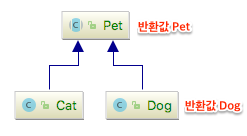
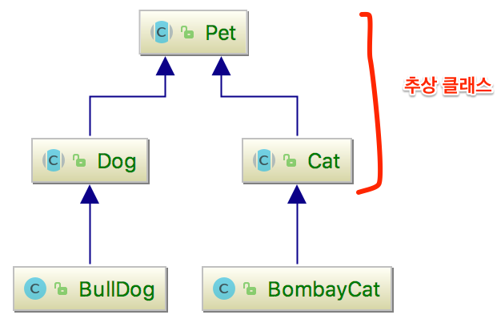
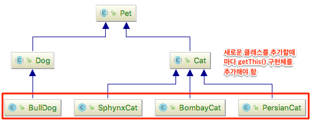

# 1. What Is Method Chaining

Method chaining refers to a syntactic form that expresses multiple method calls connected together as a single statement. (See Wikipedia #4.1)

```java
//regular method calls
@Test
public void tesWithoutMethodChaining() {
    Pet pet = new Pet();
    pet.setName("BobbyPet");
    pet.setEyeColor("red");
    pet.setHungryLevel(10);
    LOG.info("{}", pet);
}

//method chaining calls
@Test
public void testMethodChaining() {
    Pet pet = new Pet();
    pet.setName("BobbyPet")
            .setEyeColor("red")
            .setHungryLevel(10);
    LOG.info("{}", pet);
}
```


The magic of method chaining is simple. You just return this as the return value of the method you want to connect in the chain.

```java
package simple.methodChain;

public class Pet {
    private String name;
    private String eyeColor;
    private int hungryLevel;

    public Pet setName(String name) {
        this.name = name;
        return this;
    }

    public Pet setEyeColor(String eyeColor) {
        this.eyeColor = eyeColor;
        return this;
    }
….
}
```

# 2. Applying Method Chaining in Abstract Classes and Classes with Inheritance Relationships

## 2.1 One Depth : Abstract Class <--> Child Class

Applying method chaining within a single class is easy. However, in classes with an inheritance relationship, since the return value of this is either the parent class or the child class, there is the inconvenience of having to cast when doing method chaining.



```java
@Test
    public void testMethodChain() {
        Cat c1 = new Cat();
        c1.setAwesomeLevel(10) //child
                .setCutenessLevel(20) //child
                .setName("BobbyCat"); //parent
//                .setCutenessLevel(20); //child <— after calling the parent method above, you cannot call a child method (because the return value is Pet)

        LOG.info("c1 {}", c1);

        Cat c2 = new Cat();
        ((Cat)(c2.setAwesomeLevel(10) //child
                .setCutenessLevel(20) //child
                .setName("BobbyCat"))) //parent
                .setCutenessLevel(5); //child  <— if you cast to the child object you can call a child method again, but readability drops significantly.

        LOG.info("c2 {}", c2);
    }
```

The ideal way would be for method chaining to work in the form below. If a child object (which includes all the parent methods) is returned every time a method is called, there would be no need to cast.

```java
Cat c1 = new Cat();
c1.setName("BobbyCat") //parent
        .setCutenessLevel(20) //child
        .setEyeColor("black") //parent
        .setAwesomeLevel(10); //child
```

To carry out the idea above, let's solve it by adding generics and a getThis() function. Define getThis() as an abstract function in the parent class and call it in each chaining method you want, so that it returns the generic type T. Then in the child class, if you actually implement getThis() to return itself, it will work as we intended. Let's look at the actual code and confirm it. For reference, the meaning of T extends Pet is that anything of the Pet type (including subclasses) can go in the place of T.

```java
public abstract class Pet<T extends Pet<T>> {
    private String name;

    private String eyeColor;
    private int hungryLevel;

    protected abstract T getThis();

    public T setName(String name) {
        this.name = name;
        return getThis();
    }
…
}

public class Cat extends Pet<Cat> {
    private int awesomeLevel;
    private int cutenessLevel;

    @Override
    protected Cat getThis() {
        return this;
    }

    public Cat catchMice() {
        System.out.println("I caught a mouse!");
        return getThis();
    }
…
}
```

## 2.2 Two Depth : Abstract Class <—> Abstract Class <—> Child Class

Even when the depth of the abstract classes is 2 or more, it is not very different from the generic part defined in the 1-depth class. The Pet and BombayCat classes are similar to the 1-depth case, and for the Cat class you just define the generics that can be allowed for the Cat type.



```java
public abstract class Cat<T extends Cat<T>> extends Pet<T> {
    private int awesomeLevel;
    private int cutenessLevel;

    public T setAwesomeLevel(final int awesomeLevel) {
        this.awesomeLevel = awesomeLevel;
        return getThis();
    }
…
}
```

## 2.3 Two Depth : Abstract Class <—> Abstract Class <—> Child Class refactoring

Every time you add a new Cat class, there is the inconvenience of having to add the implementation of getThis() each time. Since the getThis() implementation does nothing but return this, if you extract it into an interface function, define it as a default, and contain the implementation there, the code becomes cleaner.



```java
package complex.twoDepthAbstract.solution;

public interface IPet<T> {

    @SuppressWarnings("unchecked")
    default T getThis() {
        return (T) this;
    }
}
```

# 3. Source Example

The full source code can be found on [github](https://github.com/kenshin579/tutorials-java-examples/tree/master/java-method-chain).

# 4. References

- [https://en.wikipedia.org/wiki/Method_chaining](https://en.wikipedia.org/wiki/Method_chaining)
- [https://stackoverflow.com/questions/1069528/method-chaining-inheritance-don-t-play-well-together](https://stackoverflow.com/questions/1069528/method-chaining-inheritance-don-t-play-well-together)
- [https://www.andygibson.net/blog/article/implementing-chained-methods-in-subclasses/](https://www.andygibson.net/blog/article/implementing-chained-methods-in-subclasses/)
- [https://stackoverflow.com/questions/15054237/oop-in-java-class-inheritance-with-method-chaining](https://stackoverflow.com/questions/15054237/oop-in-java-class-inheritance-with-method-chaining)
- [http://www.angelikalanger.com/GenericsFAQ/FAQSections/ProgrammingIdioms.html#FAQ206](http://www.angelikalanger.com/GenericsFAQ/FAQSections/ProgrammingIdioms.html#FAQ206)
- [https://www.baeldung.com/java-type-casting](https://www.baeldung.com/java-type-casting)
</content>
