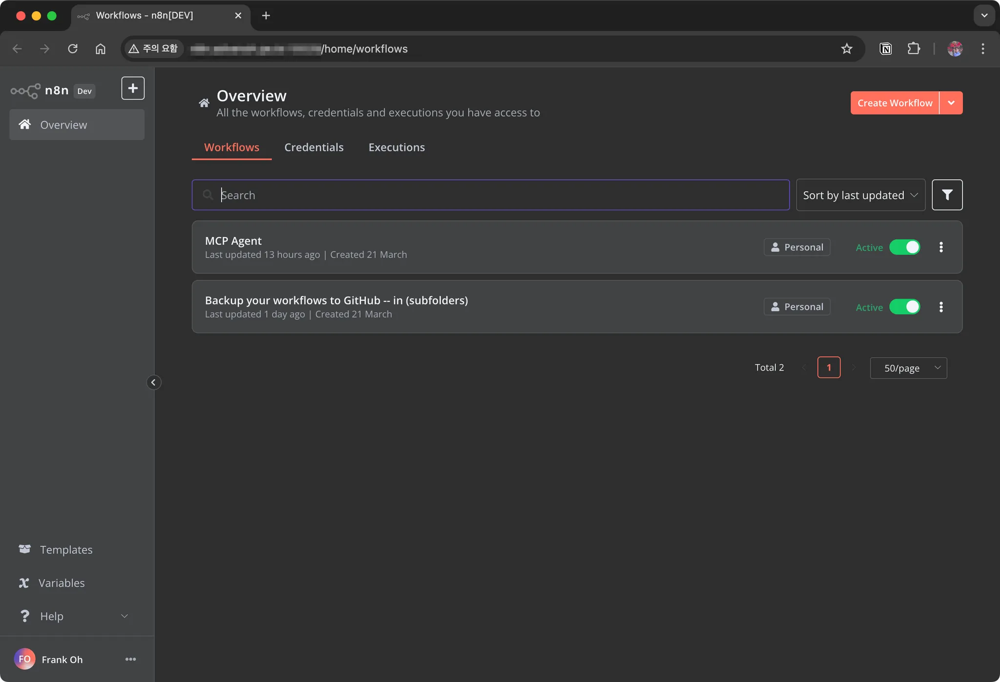

# 1. Overview

I came across `n8n` through a recommendation from a coworker. It is a workflow-based automation tool that works great for connecting various services—especially AI—and automating them. In this post, we will look at how to install and run `n8n` on a Raspberry Pi.

------

# 2. How to Install `n8n` on a Raspberry Pi

## 2.1 Prerequisites

### Update Installed Packages

Run the following command to keep the Raspberry Pi's packages up to date.

```bash
> sudo apt update && sudo apt upgrade -y
```

### Install Node.js and Check the Version

Since `n8n` runs on `Node.js`, you need to install the latest version of Node.js.

```bash
> curl -fsSL <https://deb.nodesource.com/setup_18.x> | sudo -E bash -
> sudo apt install -y nodejs
```

Check the installed `Node.js` version to confirm it was installed correctly.

```bash
> node -v
```

### Install `n8n`

Now, use npm to install `n8n` globally.

```bash
> sudo npm install -g n8n
```

------

## 2.2 Configuring the system service file for `n8n`

Registering `n8n` as a system service makes it start automatically when the Raspberry Pi boots.

### Create the Service File

```bash
sudo vi /etc/systemd/system/n8n.service
```

Add the following content.

```
[Unit]
Description=n8n Automation Tool
After=network.target

[Service]
ExecStart=/usr/bin/n8n
Restart=always
User=pi
Environment=PATH=/usr/bin:/usr/local/bin
Environment=NODE_ENV=production
Environment=N8N_COMMUNITY_PACKAGES_ALLOW_TOOL_USAGE=true
Environment=N8N_BASIC_AUTH_ACTIVE=false
Environment=N8N_SECURE_COOKIE=false
Environment=N8N_LICENSE_ACTIVATION_KEY=ba0ffeb7...omitted
WorkingDirectory=/home/pi/

[Install]
WantedBy=multi-user.target
```

- `PATH=/usr/bin:/usr/local/bin` → Sets the executable binary path to ensure `n8n` can run
- `NODE_ENV=production` → Configures `n8n` to run in a production environment
- `N8N_COMMUNITY_PACKAGES_ALLOW_TOOL_USAGE=true` → Allows community-provided packages to be used
- `N8N_BASIC_AUTH_ACTIVE=false` → Disables basic authentication so anyone can access it (change to true if you need security)
- `N8N_SECURE_COOKIE=false` → Disables the secure cookie feature (it is common to leave this false if you are not in an HTTPS environment)
- `N8N_LICENSE_ACTIVATION_KEY` → The license activation key for `n8n` (required when using a paid plan)

## 2.3 Enabling and Starting the Service

Register and enable the service.

```bash
> sudo systemctl daemon-reload
> sudo systemctl enable n8n
> sudo systemctl start n8n
```

Check whether it is running correctly.

```bash
> sudo systemctl status n8n
```

------

# 2.4 Connecting to `n8n`

Once `n8n` is running correctly, you can access it from a web browser at `http://localhost:5678` to verify.



------

# 3. Conclusion

We successfully installed `n8n` on the Raspberry Pi and registered it as a system service so it can run reliably. With this, you can build and make use of automated workflows. Additionally, if you need security, it is a good idea to enable basic authentication and consider setting up HTTPS.

> Personally, since I wanted to access and work on it from outside as well, I set up port forwarding on my home iptime router and have been using it that way.
