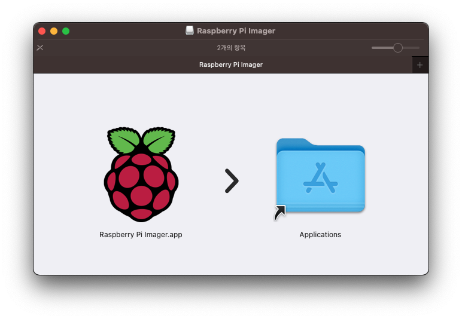
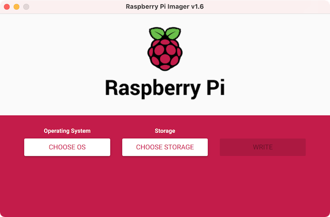
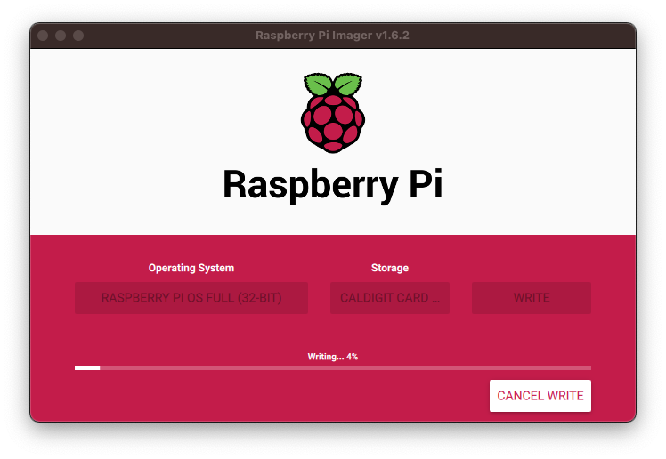
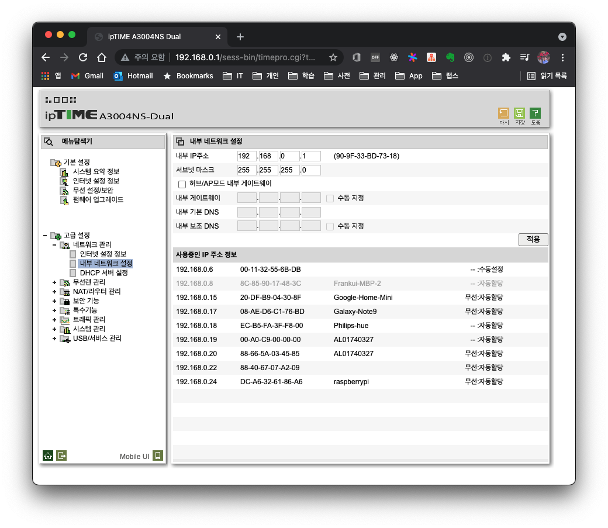
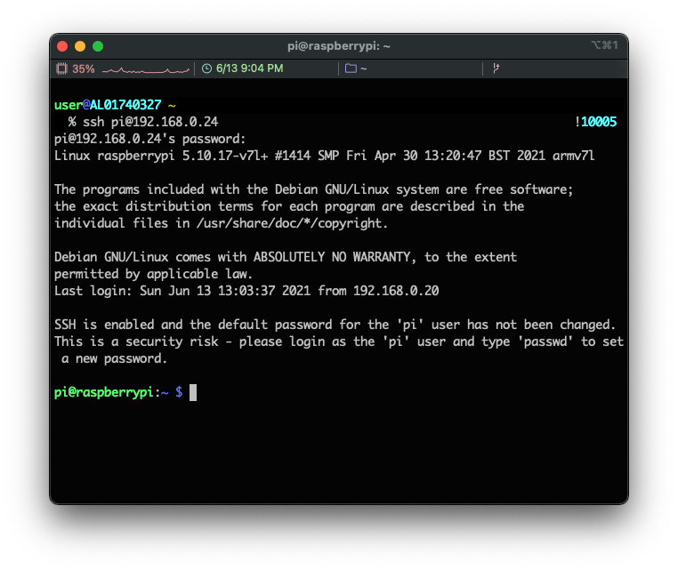
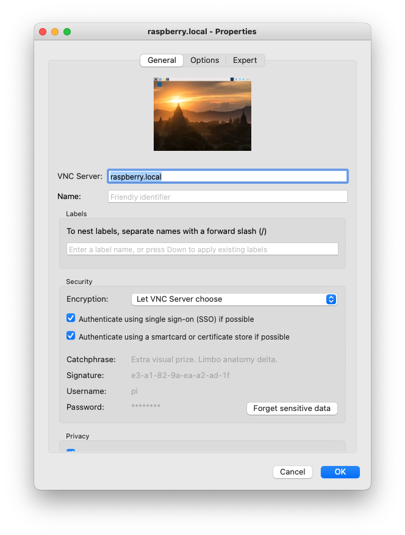
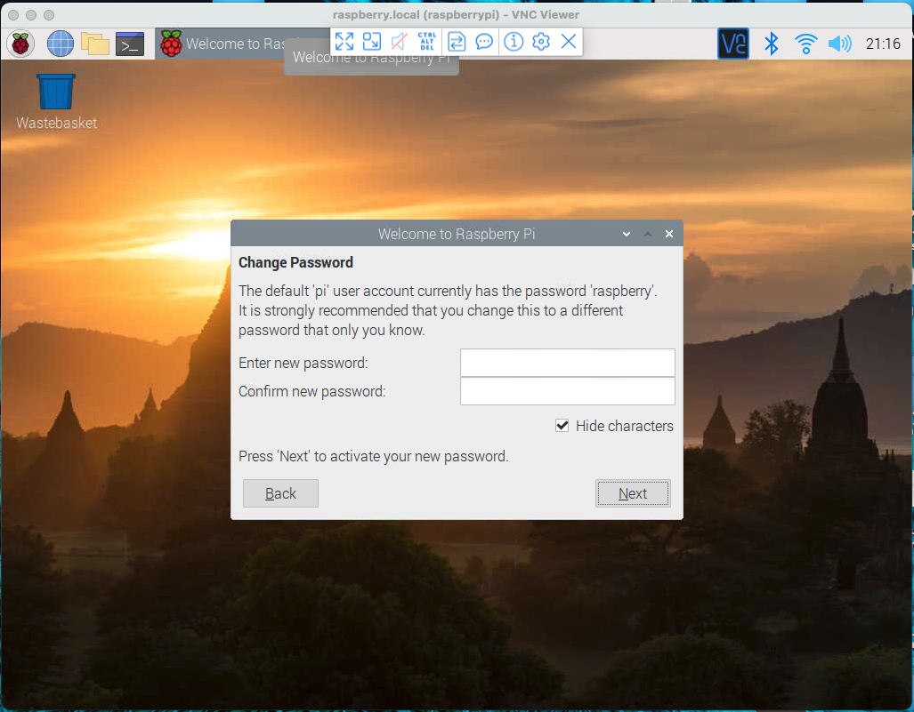
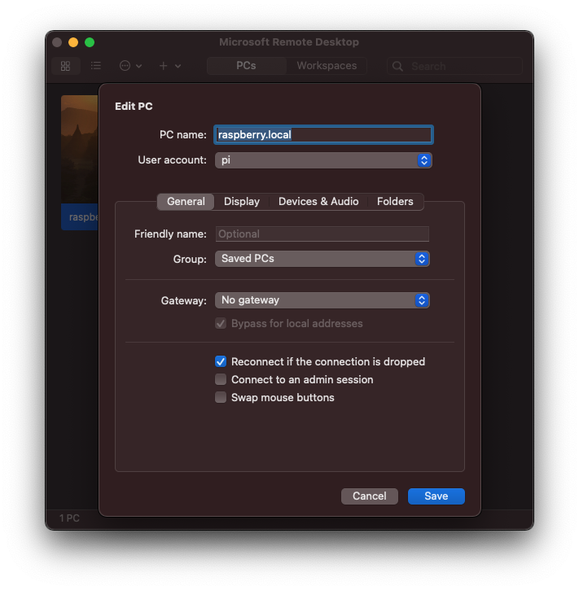
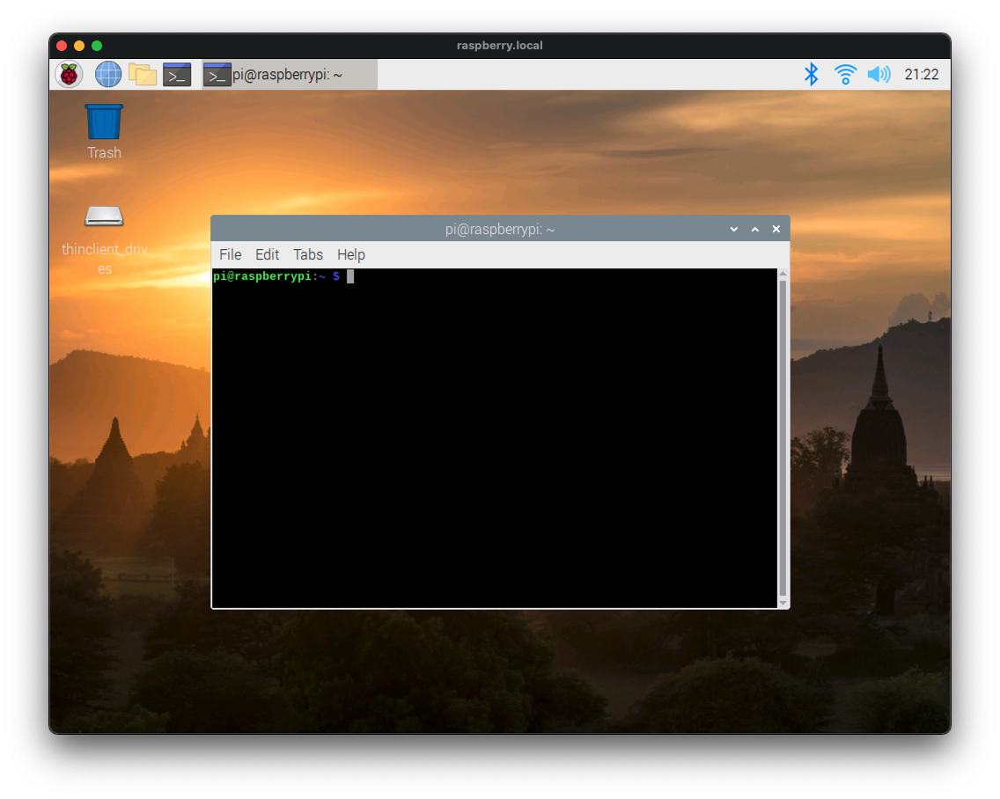

# 1. Introduction

I received a Raspberry Pi 4 as a gift from a great coworker at work, so it looks like I will be using it as my personal toy for a while. To make more active use of it, I plan to move the [Quote service](https://quote.advenoh.pe.kr/) I personally operate from AWS to the Raspberry Pi.

Now, let's look at how to install an OS on the Raspberry Pi 4. You can install it by connecting a monitor, but you can also install the OS easily without a monitor. The tools you need are as follows.

- Raspberry Pi 4
- SD card
- SD card reader
- Power cable (5V, 3000mA)
    - Personally, I use a USB-C cable to power it

# 2. Installing Raspberry Pi OS

## 2.1 Installing Raspberry Pi OS on the SD card

Follow the steps below to install the OS. Since I use a Mac, the explanation is based on macOS.

1. Download and install the Raspberry Pi image
2. Format the SD card
3. Write the OS to the SD card

First, go to the [Raspberry Pi site](https://www.raspberrypi.org/software/) and download the Raspberry Pi Imager. Double-click the downloaded file, select the App file, and move it to the Applications folder to copy it; this completes the installation.



Search for Raspberry Pi with Spotlight and launch the application, and you will see the following screen.



Next, to format the SD card, insert the SD card into the SD card reader and connect it to the computer. Then, in Raspberry Pi Imager, select the options below to format it.

- Storage > Select the inserted SD card
- Operation System > Choose OS > Select Erase

Once formatting is complete, select the options as below and click the WRITE button, and the OS image will be automatically downloaded over the internet and written to the SD card. The completion time may vary depending on the specifications of the SD card.

- Operating System > Select Raspberry PI OS Full (32-BIT)
- Storage > Select the inserted SD card



## 2.2 Accessing the Raspberry Pi in a Local Environment

### 2.2.1 Accessing via SSH

To access via ssh, create configuration files on the SD card, and you will be able to access the Raspberry Pi via SSH right when it boots. The required SSH settings are as follows. Create both files in the root folder.

- Create an empty ssh file (`ssh`)
- Create a wifi configuration file (`wpa_supplicant.conf`)

Create the empty ssh file (`ssh`) in the root without an extension. Then create `wpa_supplicant.conf` in the SD card root as well, and write the wifi and password information you want to use.

```
country=US
ctrl_interface=DIR=/var/run/wpa_supplicant GROUP=netdev
update_config=1
network={
    ssid="wifi-name"
    psk="password"
    scan_ssid=1
}
```

Remove the SD card from the reader, insert it into the rpi on the Raspberry Pi board, and connect the power cable to boot it. To find the IP address assigned by the router, access the router admin page and check. On my router, it was assigned `192.168.0.24`.



Since the IP address can change, it is a good idea to set a domain name in the `/etc/hosts` file and use the domain name.

```bash
$ vim /etc/hosts
192.168.0.24 raspberry.local
```

Connect using the IP address or the registered domain name.

```bash
$ ssh pi@192.168.0.24
$ ssh pi@raspberry.local
```

> The default `id/pasword` for the Raspberry Pi is `pi/raspberry`.




### 2.2.2 Accessing via Remote Desktop

To log in to a desktop environment instead of a Linux terminal, you can connect via VNC or XRDP. First, let's look at the VNC setup.

#### 2.2.2.1 VNC

For VNC, you can easily configure it from the terminal using `raspi-config`.

- Interface Options > VNC > Select Yes

```bash
$ sudo raspi-config
```

To connect via VNC on a Mac, install VNC Viewer with the brew command.

```bash
$ brew install vnc-viewer
```

Launch VNC Viewer, configure Connect as shown below, and log in.






#### 2.2.2.2 XRDP

For XRDP, install the required packages with `apt` and then reboot.

```bash
$ sudo apt install xrdp
$ sudo reboot
```

If you don't have Microsoft Remote Desktop on your Mac, find and install it from the App Store and configure the Connect settings.



This is the screen after logging in via XRDP.



# 3. Other Settings

## 3.1 Changing the Password

To change the default password, use the `passwd` command.

```bash
$ sudo passwd pi
```

## 3.2 Fixing the "Cannot currently show the desktop" Error When Starting VNC

If the *"Cannot currently show the desktiop"* error occurs, you can fix it by changing the following setting in `raspi-config`.

- Display Options > Resolution > DMT Mode 16 1024 x 728

Reference

- https://m.blog.naver.com/elepartsblog/221828692886

# 4. Conclusion

We installed the Raspberry Pi OS without a monitor. Next time, I will cover how to run the [Quote service](https://quote.advenoh.pe.kr/) on the Raspberry Pi using Kubernetes.

# 5. References

- https://www.raspberrypi.org/software/
- https://roboticsbackend.com/install-ubuntu-on-raspberry-pi-without-monitor/
- https://linuxhint.com/install_raspberry_pi_os_without_external_monitor/
- https://www.tomshardware.com/reviews/raspberry-pi-headless-setup-how-to,6028.html
