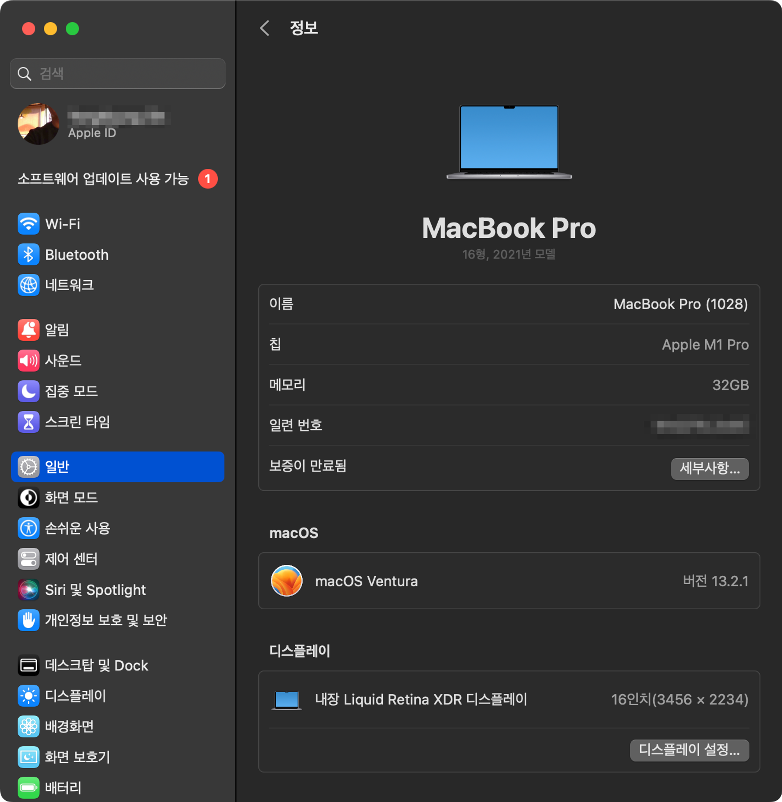
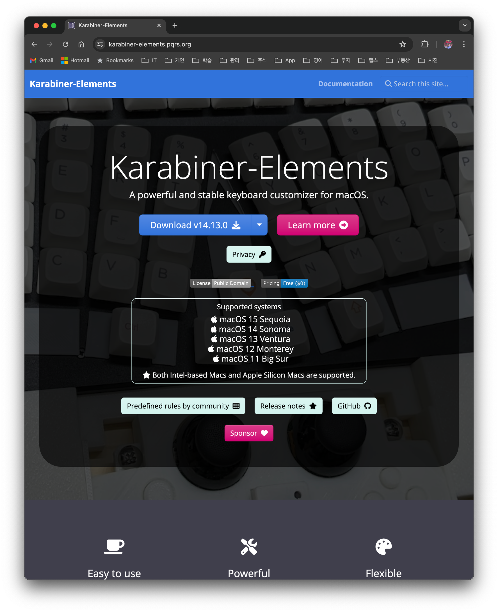
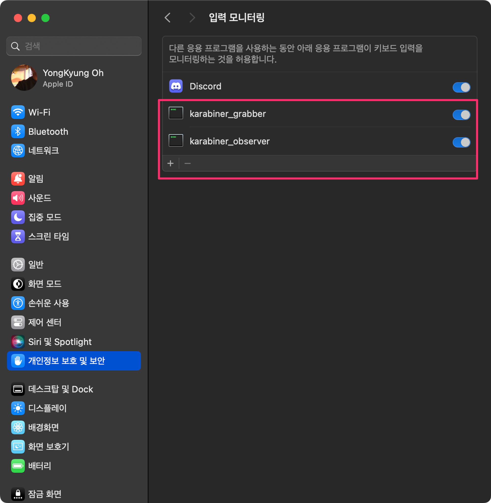
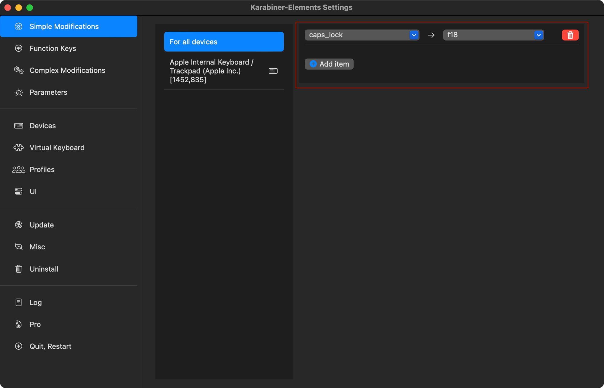
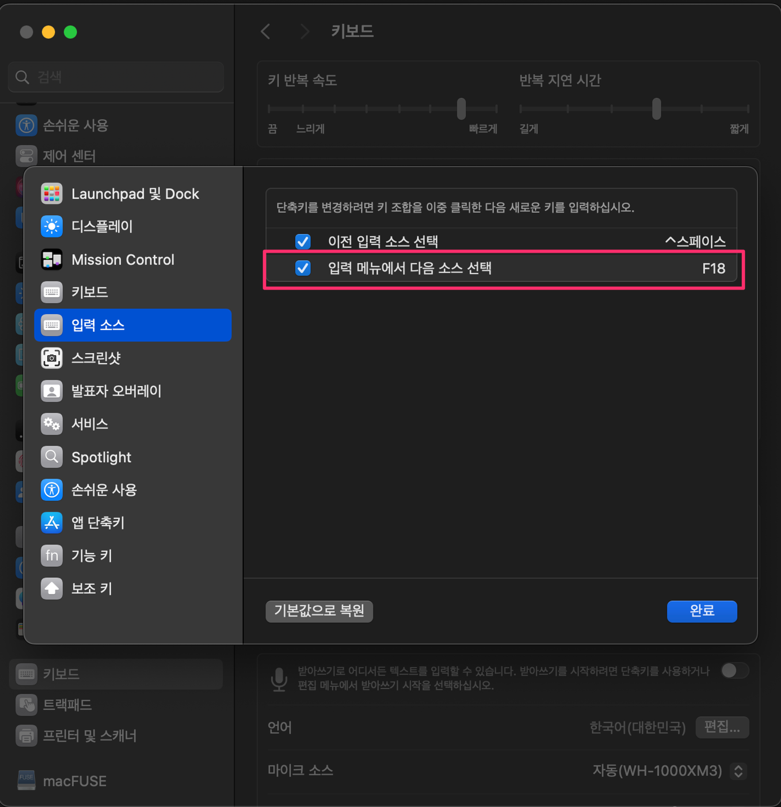

# 1. Overview

Many MacBook users experience lag when toggling between Korean and English input. I had previously solved this input-switching problem with `Karabiner` mapping, but after upgrading to Ventura or later, the lag came back.

I'm not sure what change in macOS caused it to stop working, but the bottom line is that updating to the latest `Karabiner` version and reconfiguring the settings resolves the issue. I'm leaving this on the blog as a record.

## 1.1 The Mac Version I Use

I'm currently using an M1 MacBook Air running macOS Ventura 13.2.1.

# 2. Installing and Configuring Karabiner

## 2.1 Installing Karabiner

`Karabiner` is a powerful key-mapping tool that lets you customize your MacBook's keyboard behavior. It's open source — visit the [Karabiner official website](https://karabiner-elements.pqrs.org/) and download the latest version.

> On first launch, it requests accessibility permissions in System Settings. You must grant these permissions for it to work properly.

Under `Privacy & Security` > `Input Monitoring`, allow the following two monitoring entries.

# 3. Configuring Karabiner - Eliminating Korean/English Switching Lag

Launch `Karabiner-Elements` and add the mapping as shown below. This setting means that pressing `caps_lock` produces the same result as pressing the f18 key.

In the Mac `Keyboard` settings, click `Input Sources` > `Keyboard Shortcuts…` > `Input Sources`, and in the input menu change the key for "Select the next source in the Input menu" to `f18`. This makes pressing `f18` toggle the Korean/English key.

> Now try pressing `caps_lock`. It should work without any problems.

In conclusion, through the process above, when the user presses the `caps_lock` key → the mapping presses `f18` → the Korean/English key switches smoothly.

# 4. References

- [[MAC\] Eliminating Korean/English switching lag with Karabiner](https://www.clien.net/service/board/lecture/18250346)
- [How to fix Korean/English switching delay on Mac (Karabiner-Elements)](https://blog.naver.com/rkdals530/222385359410)
- [How to eliminate Korean/English switching delay on M1 MacBook (Karabiner)](https://change-words.tistory.com/entry/Mac-capslock-conversion-delay)
